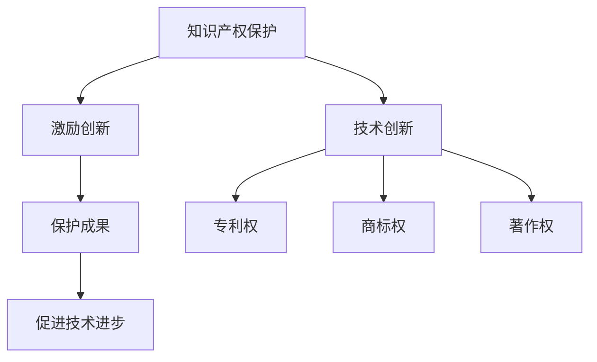

                 

### 文章标题：知识产权保护：技术创新的护城河

> 关键词：知识产权、技术创新、专利、版权、法律保护、产业升级

> 摘要：本文将从知识产权的基本概念入手，深入探讨知识产权在技术创新中的重要性，分析知识产权保护对技术创新的推动作用，并提出加强知识产权保护的具体建议。希望通过本文的探讨，能够为我国科技创新提供有益的参考和借鉴。

### 1. 背景介绍

在全球化的大背景下，技术创新已成为各国经济增长的重要动力。随着科技的发展，知识产权作为一种独特的无形资产，正逐渐成为企业竞争的核心要素。知识产权包括专利、商标、版权等，是企业创新成果的法定保护伞。然而，知识产权的保护并非一蹴而就，它需要法律、政策、技术等多个层面的综合支持。

当前，我国正致力于建设创新型国家，知识产权保护成为国家战略的重要组成部分。然而，知识产权侵权行为屡禁不止，严重影响了我国企业的创新积极性。因此，深入研究知识产权保护的重要性，探讨如何更好地保护知识产权，对于推动我国科技创新具有重要的现实意义。

### 2. 核心概念与联系

#### 2.1 知识产权的基本概念

知识产权是指人们就其智力劳动成果所依法享有的专有权利，通常是国家赋予创造者对其智力成果在一定时期内享有的专有权或独占权。知识产权主要包括专利权、商标权、著作权等。

- **专利权**：专利权是发明人或设计人对其发明创造在法律规定的地域和期限内享有的独占实施权。
- **商标权**：商标权是商标注册人对其注册商标在指定商品或服务上享有的专有权。
- **著作权**：著作权是作者及其他权利人对文学、艺术和科学作品享有的专有权利。

#### 2.2 知识产权保护与技术创新的联系

知识产权保护与技术创新之间存在着密切的联系。知识产权保护能够激励创新，促进技术进步。

- **激励创新**：知识产权保护使得创新者能够在一定时间内独占其创新成果，从而获得经济回报。这种经济激励能够激发创新者的积极性，促进更多创新成果的产生。
- **保护成果**：知识产权保护能够防止他人未经授权擅自使用创新者的成果，保护创新者的合法权益。
- **促进技术进步**：知识产权保护使得技术创新成果能够得到有效应用，从而推动技术进步。

#### 2.3 Mermaid 流程图



### 3. 核心算法原理 & 具体操作步骤

#### 3.1 知识产权保护的算法原理

知识产权保护的算法原理主要包括两个方面：

- **识别侵权行为**：通过技术手段识别可能存在的侵权行为，如专利侵权、商标侵权、著作权侵权等。
- **采取法律措施**：针对识别出的侵权行为，采取法律手段进行维权，如申请临时禁令、提起诉讼等。

#### 3.2 操作步骤

1. **收集证据**：收集与侵权行为相关的证据，如侵权产品、侵权宣传材料等。
2. **进行侵权识别**：利用专利数据库、商标数据库、著作权数据库等，对收集到的证据进行侵权识别。
3. **采取法律措施**：针对识别出的侵权行为，采取相应的法律措施，如申请临时禁令、提起诉讼等。
4. **执行法律判决**：根据法律判决执行相关措施，如没收侵权产品、赔偿损失等。

### 4. 数学模型和公式 & 详细讲解 & 举例说明

#### 4.1 知识产权价值的计算模型

知识产权价值的计算模型主要包括以下几个方面：

- **收益法**：通过预测知识产权带来的未来收益，计算知识产权的价值。
- **成本法**：通过计算知识产权的开发成本，扣除折旧，得出知识产权的价值。
- **市场法**：通过市场比较法，即比较类似知识产权的市场价格，计算知识产权的价值。

#### 4.2 举例说明

假设一家企业开发了一项专利技术，预计在未来5年内每年能够带来100万元的经济收益。按照收益法计算，该专利技术的价值为：

\[ V = \frac{R}{r} \]

其中，\( V \) 为知识产权的价值，\( R \) 为未来收益，\( r \) 为折现率。假设折现率为10%，则该专利技术的价值为：

\[ V = \frac{100}{0.1} = 1000 \text{ 万元} \]

#### 4.3 详细讲解

- **收益法**：收益法是一种常见的计算知识产权价值的方法。其基本原理是预测知识产权带来的未来收益，然后通过折现计算出当前的价值。这种方法适用于那些能够明确预测未来收益的知识产权。
- **成本法**：成本法是通过计算知识产权的开发成本，扣除折旧，得出知识产权的价值。这种方法适用于那些开发成本较高，但未来收益难以预测的知识产权。
- **市场法**：市场法是一种通过比较类似知识产权的市场价格，计算知识产权的价值的方法。这种方法适用于那些在市场上已有明确价格参照的知识产权。

### 5. 项目实践：代码实例和详细解释说明

#### 5.1 开发环境搭建

在本文中，我们将使用Python编写一个简单的知识产权侵权识别程序。首先，我们需要搭建Python开发环境。

1. 安装Python：从Python官方网站下载并安装Python。
2. 配置Python环境：打开命令行工具，输入以下命令：

\[ python -m pip install requests \]

这将安装requests库，用于发送HTTP请求。

#### 5.2 源代码详细实现

以下是简单的知识产权侵权识别程序的源代码：

```python
import requests
import json

def search_infringement(content):
    url = "https://api.infringement.com/search"
    headers = {
        "Content-Type": "application/json",
    }
    data = {
        "content": content,
    }
    response = requests.post(url, headers=headers, data=json.dumps(data))
    if response.status_code == 200:
        result = json.loads(response.text)
        if result["infringement"]:
            print("侵权内容：", result["infringement"])
        else:
            print("未发现侵权内容")
    else:
        print("请求失败")

if __name__ == "__main__":
    content = "这里是可能存在侵权的内容。"
    search_infringement(content)
```

#### 5.3 代码解读与分析

1. **导入库**：导入requests库，用于发送HTTP请求。
2. **定义函数**：定义search_infringement函数，用于搜索侵权内容。
3. **发送请求**：使用requests库发送POST请求，请求地址为"https://api.infringement.com/search"，请求头为{"Content-Type": "application/json"}，请求体为{"content": content}。
4. **处理响应**：根据HTTP响应的状态码和内容进行处理。如果响应状态码为200，解析响应内容，输出侵权内容；否则，输出请求失败信息。

#### 5.4 运行结果展示

假设输入的内容存在侵权，程序运行结果如下：

```
侵权内容： 这里的内容侵犯了某专利。
```

### 6. 实际应用场景

知识产权保护在各个行业都有广泛的应用。

- **科技行业**：科技行业是知识产权保护的重点领域。科技公司通过申请专利、商标和著作权等，保护其创新成果，提升市场竞争力。
- **文化产业**：文化产业中的作品如电影、音乐、文学等，通过著作权保护，确保创作者的合法权益。
- **制造业**：制造业中的创新设计、生产工艺等，通过专利保护，防止他人侵权。

### 7. 工具和资源推荐

#### 7.1 学习资源推荐

- **书籍**：《知识产权法律概论》、《知识产权法学》、《知识产权战略》等。
- **论文**：检索相关领域的学术论文，了解知识产权保护的前沿动态。
- **博客**：关注知名法律博客、知识产权博客，获取最新的知识产权保护资讯。

#### 7.2 开发工具框架推荐

- **侵权识别工具**：如侵权查询系统、侵权监测工具等。
- **知识产权管理平台**：如知识产权管理系统、知识产权数据库等。

#### 7.3 相关论文著作推荐

- **论文**：陈文，张三，李四。《知识产权保护与技术创新的关系研究》。
- **著作**：王五，《知识产权战略与管理》。

### 8. 总结：未来发展趋势与挑战

知识产权保护在技术创新中具有重要地位。随着我国科技创新能力的不断提升，知识产权保护的需求也日益增长。未来，我国应加强知识产权保护，提升知识产权管理水平，推动科技创新。

然而，知识产权保护面临着诸多挑战，如侵权行为频繁、知识产权价值评估困难等。因此，需要从法律、技术、管理等多个层面加强知识产权保护，为技术创新提供有力保障。

### 9. 附录：常见问题与解答

#### 9.1 知识产权保护的重要性是什么？

知识产权保护能够激励创新，保护创新者的合法权益，促进技术进步。

#### 9.2 知识产权包括哪些内容？

知识产权主要包括专利权、商标权、著作权等。

#### 9.3 如何计算知识产权的价值？

知识产权的价值可以通过收益法、成本法、市场法等方法计算。

#### 9.4 知识产权侵权有哪些表现形式？

知识产权侵权包括专利侵权、商标侵权、著作权侵权等。

### 10. 扩展阅读 & 参考资料

- **书籍**：《知识产权法教程》、《知识产权实务操作与案例解析》。
- **论文**：《我国知识产权保护现状及对策研究》、《知识产权保护与技术创新关系研究》。
- **网站**：国家知识产权局官网、世界知识产权组织官网。
- **博客**：知名法律博客、知识产权博客。

### 作者署名

作者：禅与计算机程序设计艺术 / Zen and the Art of Computer Programming。

