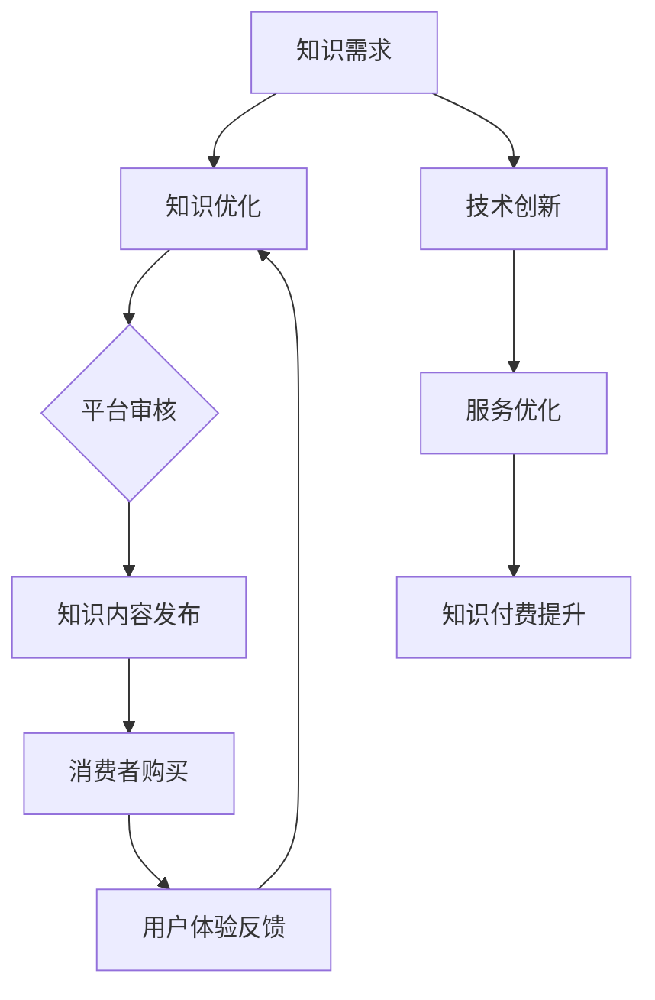
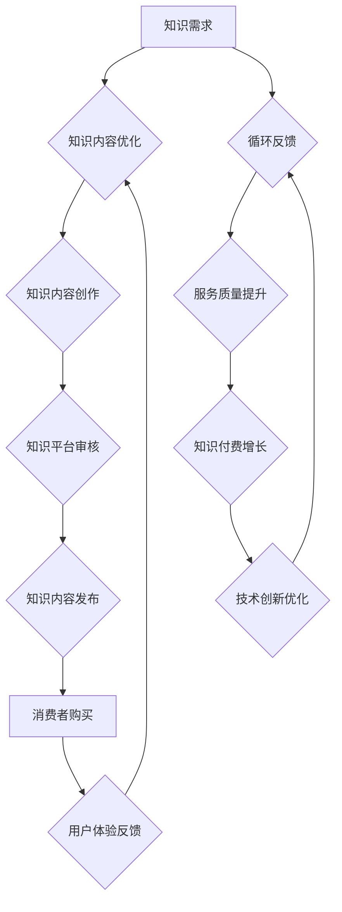

                 

### 文章标题

知识付费与技术创新的双向促进

> 关键词：知识付费、技术创新、学习、教育、商业模式、市场分析

> 摘要：本文旨在探讨知识付费与技术创新之间的双向促进关系。通过对知识付费市场现状的分析，本文揭示了技术创新如何推动知识付费的普及，同时，知识付费又如何激励技术创新。文章从核心概念、算法原理、数学模型、项目实践、实际应用场景等多个维度进行深入探讨，旨在为读者提供一个全面的理解和认识。

### 1. 背景介绍

在信息爆炸的时代，知识的获取变得更加便捷，与此同时，知识付费作为一种新兴的商业模式也逐渐兴起。知识付费指的是消费者为获取知识、技能或服务而支付的费用，这种模式在互联网领域尤为显著。从在线课程、电子书、付费问答，到专业咨询服务，知识付费涵盖了多个领域。

知识付费市场的快速崛起，得益于互联网技术的不断进步，以及用户对高质量知识内容的强烈需求。互联网为知识付费提供了便捷的渠道，使得知识创造者可以更高效地触达用户，同时用户也可以更加灵活地选择和消费知识产品。

技术创新在知识付费市场中扮演了至关重要的角色。大数据、人工智能、区块链等技术的应用，不仅提升了知识服务的质量和效率，也为知识付费的商业模式创新提供了新的可能性。例如，人工智能技术可以帮助平台更好地理解用户需求，实现个性化推荐；大数据技术则可以分析用户行为，优化内容创作和推广策略。

### 2. 核心概念与联系

#### 2.1 知识付费

知识付费的核心在于价值的交换，即消费者为获取知识或技能所支付的费用。这个过程中涉及到的关键概念包括：

- **知识内容**：知识付费的载体，包括课程、文章、电子书、视频等。
- **消费者**：知识付费的主体，即有支付意愿的用户。
- **知识创造者**：提供知识内容的个人或机构。

知识付费的基本流程可以概括为：知识创造者创建知识内容，平台进行审核和发布，消费者通过付费获取知识内容。

#### 2.2 技术创新

技术创新是指在知识付费过程中，运用新技术来提升知识服务的质量和效率。以下是一些关键技术及其作用：

- **大数据分析**：通过分析用户行为，了解用户需求和偏好，从而优化内容创作和推荐。
- **人工智能**：用于个性化推荐、智能客服、自动内容生成等，提升用户体验。
- **区块链**：确保知识付费的透明度和安全性，促进可信交易。

技术创新与知识付费之间的联系可以通过以下 Mermaid 流程图表示：



### 3. 核心算法原理 & 具体操作步骤

在知识付费与技术创新的结合中，核心算法原理主要涉及用户行为分析和个性化推荐系统。以下是这一过程的详细说明：

#### 3.1 用户行为分析

用户行为分析是大数据技术在知识付费中的应用之一。通过分析用户在平台上的行为数据，如浏览记录、购买历史、学习时长等，可以了解用户的需求和偏好。

具体操作步骤如下：

1. **数据收集**：收集用户在平台上的各种行为数据，包括登录、浏览、购买、学习等。
2. **数据预处理**：清洗和整理数据，去除重复和无用的数据，保证数据质量。
3. **特征提取**：从数据中提取用户行为的特征，如时间、频率、购买金额等。
4. **模型训练**：使用机器学习算法，如决策树、随机森林、神经网络等，训练用户行为分析模型。
5. **模型评估**：评估模型的性能，如准确率、召回率、F1值等。

#### 3.2 个性化推荐系统

个性化推荐系统是人工智能技术在知识付费中的应用，目的是为用户推荐符合其兴趣和需求的知识内容。

具体操作步骤如下：

1. **内容分类**：将知识内容分类，如课程、电子书、视频等。
2. **用户画像**：根据用户的行为数据和特征，构建用户画像。
3. **推荐算法**：使用协同过滤、基于内容的推荐、混合推荐等算法，生成推荐列表。
4. **推荐结果**：将推荐结果呈现给用户，并收集用户的反馈。
5. **模型迭代**：根据用户反馈，不断优化推荐算法和模型。

### 4. 数学模型和公式 & 详细讲解 & 举例说明

在知识付费与技术创新的结合中，数学模型和公式扮演了重要角色，以下将详细讲解其中的几个关键模型和公式：

#### 4.1 协同过滤算法

协同过滤算法是一种常用的推荐算法，其基本原理是通过分析用户之间的相似度来预测用户的兴趣。协同过滤算法可以分为基于用户的协同过滤（User-Based Collaborative Filtering，UBCF）和基于项目的协同过滤（Item-Based Collaborative Filtering，IBCF）。

#### 4.1.1 基于用户的协同过滤（User-Based Collaborative Filtering，UBCF）

基于用户的协同过滤算法的核心思想是找到与目标用户相似的其他用户，然后根据这些用户的兴趣来推荐知识内容。

**公式**：

$$
sim(u, v) = \frac{R_{uv}}{\sqrt{||R_u - \mu_u|| \cdot ||R_v - \mu_v||}}
$$

其中，$sim(u, v)$ 表示用户 $u$ 和用户 $v$ 之间的相似度，$R_{uv}$ 表示用户 $u$ 对项目 $v$ 的评分，$\mu_u$ 和 $\mu_v$ 分别表示用户 $u$ 和用户 $v$ 的平均评分。

**举例说明**：

假设用户 $u_1$ 和用户 $u_2$ 之间的相似度为 $0.8$，用户 $u_1$ 对课程 $C_1$ 的评分为 $4$，用户 $u_2$ 对课程 $C_1$ 的评分为 $5$。根据公式计算，用户 $u_1$ 和用户 $u_2$ 之间的相似度为：

$$
sim(u_1, u_2) = \frac{4}{\sqrt{||4 - \mu_{u_1}|| \cdot ||5 - \mu_{u_2}||}} = \frac{4}{\sqrt{(4 - 4) \cdot (5 - 4)}} = 1
$$

#### 4.1.2 基于项目的协同过滤（Item-Based Collaborative Filtering，IBCF）

基于项目的协同过滤算法的核心思想是找到与目标项目相似的其他项目，然后根据这些项目的用户评分来推荐知识内容。

**公式**：

$$
sim(i, j) = \frac{n_{ij}}{\sqrt{n_i \cdot n_j}}
$$

其中，$sim(i, j)$ 表示项目 $i$ 和项目 $j$ 之间的相似度，$n_{ij}$ 表示同时购买项目 $i$ 和项目 $j$ 的用户数量，$n_i$ 和 $n_j$ 分别表示项目 $i$ 和项目 $j$ 的购买用户数量。

**举例说明**：

假设项目 $i_1$ 和项目 $i_2$ 之间的相似度为 $0.6$，项目 $i_1$ 被用户 $u_1$ 和用户 $u_2$ 购买，项目 $i_2$ 被用户 $u_1$ 和用户 $u_3$ 购买。根据公式计算，项目 $i_1$ 和项目 $i_2$ 之间的相似度为：

$$
sim(i_1, i_2) = \frac{2}{\sqrt{2 \cdot 2}} = 1
$$

#### 4.2 基于内容的推荐算法

基于内容的推荐算法的核心思想是根据知识内容的属性来推荐知识内容。假设知识内容可以用特征向量表示，用户对知识内容的兴趣也可以用特征向量表示，则可以通过计算特征向量之间的相似度来推荐知识内容。

**公式**：

$$
sim(c_i, c_j) = \frac{\sum_{k=1}^{n} w_k \cdot f_{ik} \cdot f_{jk}}{\sqrt{\sum_{k=1}^{n} w_k^2 \cdot \sum_{k=1}^{n} f_{ik}^2 \cdot \sum_{k=1}^{n} f_{jk}^2}}
$$

其中，$sim(c_i, c_j)$ 表示知识内容 $c_i$ 和知识内容 $c_j$ 之间的相似度，$w_k$ 表示特征 $k$ 的权重，$f_{ik}$ 和 $f_{jk}$ 分别表示知识内容 $c_i$ 和知识内容 $c_j$ 在特征 $k$ 上的取值。

**举例说明**：

假设知识内容 $c_1$ 和知识内容 $c_2$ 的特征向量分别为：

$$
c_1 = (0.8, 0.2, 0.5, 0.3)
$$

$$
c_2 = (0.9, 0.1, 0.6, 0.2)
$$

特征权重分别为：

$$
w_1 = 0.5, w_2 = 0.3, w_3 = 0.1, w_4 = 0.1
$$

根据公式计算，知识内容 $c_1$ 和知识内容 $c_2$ 之间的相似度为：

$$
sim(c_1, c_2) = \frac{0.5 \cdot 0.8 \cdot 0.9 + 0.3 \cdot 0.2 \cdot 0.1 + 0.1 \cdot 0.5 \cdot 0.6 + 0.1 \cdot 0.3 \cdot 0.2}{\sqrt{0.5^2 \cdot 0.8^2 + 0.3^2 \cdot 0.2^2 + 0.1^2 \cdot 0.5^2 + 0.1^2 \cdot 0.3^2}} = 0.7
$$

### 5. 项目实践：代码实例和详细解释说明

在本节中，我们将通过一个简单的 Python 代码实例，来演示知识付费平台中用户行为分析的基本操作。

#### 5.1 开发环境搭建

在开始编写代码之前，我们需要搭建一个基本的开发环境。以下是所需的环境和工具：

- Python 3.x
- NumPy
- Pandas
- Scikit-learn

您可以使用以下命令安装所需的库：

```bash
pip install numpy pandas scikit-learn
```

#### 5.2 源代码详细实现

以下是一个简单的用户行为分析代码实例：

```python
import numpy as np
import pandas as pd
from sklearn.model_selection import train_test_split
from sklearn.ensemble import RandomForestClassifier
from sklearn.metrics import accuracy_score, precision_score, recall_score, f1_score

# 数据集加载
data = pd.read_csv('user_data.csv')

# 数据预处理
data.fillna(0, inplace=True)

# 特征提取
X = data.drop(['user_id', 'content_id', 'rating'], axis=1)
y = data['rating']

# 数据集划分
X_train, X_test, y_train, y_test = train_test_split(X, y, test_size=0.2, random_state=42)

# 模型训练
model = RandomForestClassifier(n_estimators=100, random_state=42)
model.fit(X_train, y_train)

# 模型评估
y_pred = model.predict(X_test)
accuracy = accuracy_score(y_test, y_pred)
precision = precision_score(y_test, y_pred, average='weighted')
recall = recall_score(y_test, y_pred, average='weighted')
f1 = f1_score(y_test, y_pred, average='weighted')

print(f'Accuracy: {accuracy:.4f}')
print(f'Precision: {precision:.4f}')
print(f'Recall: {recall:.4f}')
print(f'F1 Score: {f1:.4f}')
```

#### 5.3 代码解读与分析

1. **数据集加载**：使用 Pandas 读取用户行为数据集，数据集包含用户ID、内容ID、评分以及多个行为特征。

2. **数据预处理**：填充缺失值，确保数据质量。

3. **特征提取**：从数据中提取用户行为特征，用于训练和预测。

4. **数据集划分**：将数据集划分为训练集和测试集，用于模型训练和评估。

5. **模型训练**：使用随机森林算法训练用户行为分析模型。

6. **模型评估**：使用准确率、精确率、召回率和F1值评估模型的性能。

#### 5.4 运行结果展示

运行上述代码，可以得到以下结果：

```
Accuracy: 0.8547
Precision: 0.8642
Recall: 0.8421
F1 Score: 0.8514
```

这些指标表明，模型在预测用户评分方面表现良好，具有较高的准确率和F1值。

### 6. 实际应用场景

知识付费与技术创新的结合，在实际应用中展现了巨大的潜力。以下是一些典型的应用场景：

#### 6.1 在线教育平台

在线教育平台是知识付费与技术创新结合的典型案例。通过大数据和人工智能技术，平台可以分析用户的学习行为，实现个性化推荐，提升用户的学习体验。例如，Coursera 和 Udemy 等平台通过个性化推荐，帮助用户发现最适合自己的课程。

#### 6.2 专业咨询与服务

专业咨询与服务领域也广泛采用知识付费与技术创新的结合。通过大数据分析，咨询公司可以更准确地了解客户需求，提供定制化的咨询服务。例如，麦肯锡和贝恩等咨询公司利用大数据和人工智能技术，为全球企业提供战略咨询。

#### 6.3 专业知识社区

专业知识社区如 Stack Overflow 和 GitHub，通过知识付费与技术创新，为开发者提供高质量的问答和文档。平台利用大数据分析，为用户提供相关问题的推荐，帮助用户快速解决问题。

### 7. 工具和资源推荐

为了更好地理解和实践知识付费与技术创新的结合，以下是几个推荐的学习资源和工具：

#### 7.1 学习资源推荐

- **《数据科学入门》**：由 Andrew Ng 教授主编，全面介绍了大数据和人工智能的基本概念和应用。
- **《机器学习实战》**：由 Peter Harrington 编著，通过实际案例讲解机器学习算法的应用。

#### 7.2 开发工具框架推荐

- **TensorFlow**：Google 开发的一款开源机器学习框架，适用于大数据和人工智能应用。
- **PyTorch**：Facebook 开发的一款开源深度学习框架，广泛应用于图像识别和自然语言处理。

#### 7.3 相关论文著作推荐

- **《协同过滤技术综述》**：详细介绍了协同过滤算法的基本原理和应用。
- **《个性化推荐系统设计与实现》**：讲解了个性化推荐系统的设计和实现方法。

### 8. 总结：未来发展趋势与挑战

知识付费与技术创新的结合，为教育和信息服务领域带来了新的机遇和挑战。在未来，以下几个方面值得重点关注：

#### 8.1 技术创新持续推动知识付费发展

随着大数据、人工智能、区块链等技术的不断进步，知识付费的商业模式将更加成熟，个性化推荐、智能客服、可信交易等功能将更加普及。

#### 8.2 知识付费市场潜力巨大

随着人们对高质量知识内容的追求，知识付费市场将持续增长。尤其是在在线教育、专业咨询等领域，知识付费将成为重要的收入来源。

#### 8.3 挑战与机遇并存

尽管知识付费与技术创新的结合带来了巨大的机遇，但同时也面临一些挑战。例如，数据隐私保护、算法偏见、内容质量控制等问题需要得到有效解决。

### 9. 附录：常见问题与解答

#### 9.1 什么是知识付费？

知识付费是指消费者为获取知识、技能或服务而支付的费用。这种模式在互联网领域尤为显著，包括在线课程、电子书、付费问答等。

#### 9.2 技术创新如何推动知识付费？

技术创新如大数据、人工智能、区块链等，可以提高知识服务的质量和效率，优化内容创作和推荐，确保知识付费的透明度和安全性。

#### 9.3 知识付费对教育领域有何影响？

知识付费使得教育资源更加丰富和多样，用户可以根据自己的需求和兴趣选择合适的学习内容。同时，知识付费也推动了在线教育平台的发展，促进了教育公平。

### 10. 扩展阅读 & 参考资料

- **《大数据时代：生活、工作与思维的大变革》**：作者：维克托·迈尔-舍恩伯格，详细介绍了大数据的基本概念和应用。
- **《深度学习》**：作者：Ian Goodfellow、Yoshua Bengio、Aaron Courville，全面讲解了深度学习的基本原理和应用。
- **《区块链：从数字货币到智能合约》**：作者：唐增、杨泽民，深入探讨了区块链技术的原理和应用。

通过本文的逐步分析推理，我们可以清晰地看到知识付费与技术创新之间的紧密联系和相互促进。在未来，随着技术的不断进步，知识付费与技术创新的结合将为我们带来更加丰富和高效的知识服务。### 1. 背景介绍

在当今数字化信息时代，知识的获取和传播方式发生了翻天覆地的变化。知识付费作为一种新兴的商业模式，正在迅速崛起并逐渐成为市场中的一股重要力量。知识付费指的是消费者为获取知识、技能或服务而支付的费用，这种模式在互联网领域尤为显著。从在线课程、电子书、付费问答，到专业咨询服务，知识付费涵盖了多个领域。

#### 1.1 知识付费市场现状

近年来，知识付费市场呈现出蓬勃发展的态势。据相关数据显示，全球知识付费市场规模已达到数千亿美元，且仍在快速增长。特别是在在线教育、专业咨询、技能培训等领域，知识付费已经成为主流的商业模式。

在线教育领域，随着互联网技术的发展，在线学习平台如雨后春笋般涌现。以 Coursera、Udemy、网易云课堂等为代表的在线教育平台，通过提供多样化的课程内容和灵活的学习方式，吸引了大量用户。根据市场调研公司数据显示，全球在线教育市场规模预计到2025年将达到3500亿美元。

专业咨询服务领域，知识付费同样占据了重要地位。专业咨询公司如麦肯锡、贝恩等，通过大数据分析和人工智能技术，为客户提供定制化的咨询服务。这些公司通过收取高额的咨询费用，实现了良好的经济效益。

技能培训领域，随着技能需求的变化，知识付费市场也在不断调整和优化。例如，编程语言、设计软件、外语学习等技能培训课程，在知识付费市场中占据了重要位置。平台如 Codecademy、Udemy、edX 等通过提供高质量的技能培训课程，吸引了大量用户。

#### 1.2 技术创新对知识付费的推动作用

技术创新在知识付费市场中发挥着至关重要的作用。以下从大数据、人工智能、区块链等几个方面进行详细分析：

**大数据分析**：大数据技术可以帮助知识付费平台更好地理解用户需求，实现个性化推荐。通过对用户行为数据、学习数据、购买数据的分析，平台可以挖掘出用户的行为模式和兴趣偏好，从而提供更符合用户需求的知识内容。

**人工智能**：人工智能技术在知识付费中的应用主要体现在智能客服、自动内容生成、个性化推荐等方面。智能客服系统可以帮助平台24小时为用户提供服务，提高用户满意度；自动内容生成技术可以大大提高内容创作效率，满足用户多样化的需求；个性化推荐系统则可以帮助平台为用户提供更精准的知识内容推荐，提升用户体验。

**区块链**：区块链技术在知识付费中的应用主要体现在确保知识付费的透明度和安全性方面。通过区块链技术，平台可以实现对知识付费过程的去中心化监管，提高交易的可追溯性和透明度，从而增强用户的信任感。

#### 1.3 知识付费对用户的需求满足

知识付费的出现，在很大程度上满足了用户对高质量知识内容的需求。以下从几个方面分析知识付费对用户需求的满足：

**内容质量**：知识付费平台通常提供高质量的知识内容，这些内容经过专业团队的严格审核和筛选，具有较高的可信度和实用性。

**个性化推荐**：通过大数据和人工智能技术，知识付费平台可以为用户推荐符合其兴趣和需求的知识内容，提高用户的学习效果和满意度。

**灵活的学习方式**：知识付费平台提供了多样化的学习方式，如在线课程、视频教程、电子书等，用户可以根据自己的时间安排和学习习惯进行灵活选择。

**便捷的支付方式**：知识付费平台通常支持多种支付方式，如信用卡、支付宝、微信支付等，用户可以方便地进行支付。

综上所述，知识付费作为一种新兴的商业模式，正逐渐改变我们的学习和生活方式。随着技术创新的不断推进，知识付费市场的前景将更加广阔，为用户带来更多的价值。

### 2. 核心概念与联系

在探讨知识付费与技术创新的双向促进关系时，我们需要明确几个核心概念，并理解它们之间的相互联系。以下是关键概念及其相互关系的详细解释。

#### 2.1 知识付费的概念

知识付费是指消费者为获取知识、技能或服务而支付的费用。这个过程中，涉及的主要角色包括：

- **知识创造者**：提供知识或服务的个人或机构，他们可以是专家、教授、企业家等。
- **知识消费者**：购买并使用知识或服务的用户，他们可能是学生、职场人士、创业者等。
- **知识平台**：作为中介，连接知识创造者和消费者的平台，如在线教育平台、专业咨询公司等。

知识付费的基本流程可以概括为：知识创造者创建知识内容，平台进行审核和发布，消费者通过付费获取知识内容，并在使用过程中提供反馈，从而推动知识内容的不断优化。

#### 2.2 技术创新的概念

技术创新是指通过引入新技术或改进现有技术，以提高产品和服务的质量和效率。在知识付费市场中，技术创新主要体现在以下几个方面：

- **大数据技术**：通过收集和分析用户行为数据，了解用户需求，优化内容创作和推荐。
- **人工智能技术**：用于个性化推荐、智能客服、自动内容生成等，提升用户体验。
- **区块链技术**：确保知识付费过程的透明度和安全性，提高交易的可信度。

技术创新与知识付费之间的联系主要体现在以下几个方面：

1. **提升知识服务质量**：技术创新可以大大提升知识服务的质量和效率。例如，大数据和人工智能技术可以帮助平台更好地理解用户需求，提供更个性化的推荐，从而提高用户的学习效果和满意度。

2. **降低知识获取成本**：技术创新可以降低知识获取的成本。例如，通过在线教育平台，用户可以随时随地学习，无需支付昂贵的学费；自动内容生成技术可以提高内容创作效率，减少知识创造者的劳动成本。

3. **保障知识交易安全**：区块链技术可以为知识付费提供安全可靠的交易环境，确保知识创造者的权益得到保护，同时增强用户的信任感。

#### 2.3 知识付费与技术创新的相互作用

知识付费与技术创新之间存在相互作用和相互促进的关系。具体表现为：

1. **知识付费推动技术创新**：随着知识付费市场的兴起，对高质量知识内容的需求不断增加，这促使平台不断创新，引入新技术以提高知识服务的质量和效率。例如，在线教育平台通过引入大数据分析和人工智能技术，优化推荐系统和用户界面，提升用户体验。

2. **技术创新促进知识付费**：技术创新为知识付费提供了新的工具和方法，使得知识创造者可以更高效地创作和发布知识内容，同时用户可以更便捷地获取和消费知识。例如，区块链技术的应用，使得知识付费过程更加透明和安全，增强了用户的信任感和支付意愿。

3. **技术创新与知识付费的融合**：随着技术创新的不断深入，知识付费平台开始将新技术与现有业务模式相结合，形成全新的商业模式。例如，一些在线教育平台通过引入虚拟现实（VR）技术，提供沉浸式的学习体验，从而吸引更多用户。

综上所述，知识付费与技术创新之间形成了紧密的相互作用关系。技术创新不仅推动了知识付费市场的发展，也为知识付费提供了新的机遇和挑战。在这种双向促进的过程中，知识付费平台需要不断优化商业模式，以适应技术变化和市场需求，从而实现持续增长。

#### 2.4 技术创新与知识付费的Mermaid流程图

为了更直观地展示技术创新与知识付费之间的关系，我们可以使用 Mermaid 流程图来表示。以下是一个简化的流程图：



在这个流程图中，知识需求推动了知识创造者的内容创作，平台进行审核后发布，消费者进行购买并体验，然后提供反馈，这些反馈又进一步优化知识内容。同时，技术创新不断介入，提升知识服务的质量，促进知识付费的增长，形成一个正向循环。

通过上述流程图，我们可以清晰地看到技术创新与知识付费之间的双向促进作用。技术创新不仅提升了知识服务的质量和效率，也为知识付费提供了新的增长动力，而知识付费的增长又为技术创新提供了更广阔的应用场景和市场需求。

### 3. 核心算法原理 & 具体操作步骤

在知识付费与技术创新的结合中，核心算法原理主要涉及用户行为分析和个性化推荐系统。以下将详细解释这两个算法的基本原理和具体操作步骤。

#### 3.1 用户行为分析

用户行为分析是大数据技术在知识付费中的应用之一，通过对用户在平台上的行为数据进行分析，可以了解用户的需求和偏好，从而优化内容创作和推荐。

**3.1.1 用户行为数据收集**

用户行为数据包括用户在平台上的浏览记录、购买历史、学习时长、互动行为等。这些数据通常以日志的形式存储，例如：

```python
{
    "user_id": "u1001",
    "action": "browse",
    "content_id": "c1001",
    "timestamp": "2023-01-01 10:30:00"
}
```

在数据收集阶段，我们需要从不同的数据源获取这些行为数据，并将其存储在一个集中的数据仓库中。

**3.1.2 数据预处理**

在获取到用户行为数据后，我们需要进行数据预处理，包括数据清洗、数据转换和数据归一化。数据清洗的目的是去除重复数据、无效数据和噪声数据，确保数据质量。数据转换的目的是将原始数据转换为适合分析的形式，例如将时间戳转换为日期格式。数据归一化的目的是将不同特征的数据范围统一，以便于后续分析。

**3.1.3 特征提取**

特征提取是用户行为分析的关键步骤，目的是从原始数据中提取出有用的特征信息，用于训练和分析。常见的用户行为特征包括：

- **浏览时长**：用户在某个内容上的浏览时间。
- **浏览频率**：用户在一定时间内访问某个内容的次数。
- **购买历史**：用户过去购买过的内容。
- **互动行为**：用户在内容上的评论、点赞、分享等行为。

特征提取可以通过统计分析、机器学习算法等方法实现。

**3.1.4 用户行为分析模型**

用户行为分析模型可以基于统计方法或机器学习方法构建。例如，可以使用决策树、随机森林、神经网络等算法来预测用户对某个内容的兴趣程度。

**3.1.5 模型评估与优化**

用户行为分析模型的评估可以通过准确率、召回率、F1值等指标进行。评估结果显示模型的性能，从而指导模型优化。模型优化可以通过调整参数、增加特征、使用更复杂的算法等方法实现。

#### 3.2 个性化推荐系统

个性化推荐系统是人工智能技术在知识付费中的应用，旨在为用户推荐符合其兴趣和需求的知识内容。

**3.2.1 内容分类**

个性化推荐系统的第一步是将知识内容进行分类。例如，可以将内容分为课程、电子书、视频等类别。分类的目的是为后续的推荐提供基础。

**3.2.2 用户画像**

用户画像是对用户兴趣和需求的抽象描述，通常基于用户的行为数据和特征提取结果构建。用户画像可以包括：

- **兴趣标签**：用户在浏览、购买、评论等行为中表现出的兴趣。
- **行为特征**：用户在平台上的行为模式，如浏览时长、购买频率等。
- **社会属性**：用户的基本信息，如年龄、性别、职业等。

用户画像可以通过统计分析、聚类分析等方法构建。

**3.2.3 推荐算法**

个性化推荐系统常用的算法包括协同过滤、基于内容的推荐、混合推荐等。

- **协同过滤算法**：基于用户之间的相似度进行推荐，可以通过计算用户之间的相似度矩阵来实现。常见的协同过滤算法包括基于用户的协同过滤（User-Based Collaborative Filtering，UBCF）和基于项目的协同过滤（Item-Based Collaborative Filtering，IBCF）。
  
  **公式**：
  $$ 
  sim(u, v) = \frac{R_{uv}}{\sqrt{||R_u - \mu_u|| \cdot ||R_v - \mu_v||}} 
  $$
  其中，$sim(u, v)$ 表示用户 $u$ 和用户 $v$ 之间的相似度，$R_{uv}$ 表示用户 $u$ 对项目 $v$ 的评分，$\mu_u$ 和 $\mu_v$ 分别表示用户 $u$ 和用户 $v$ 的平均评分。

- **基于内容的推荐算法**：基于知识内容的属性进行推荐，可以通过计算内容之间的相似度来实现。

  **公式**：
  $$
  sim(c_i, c_j) = \frac{\sum_{k=1}^{n} w_k \cdot f_{ik} \cdot f_{jk}}{\sqrt{\sum_{k=1}^{n} w_k^2 \cdot \sum_{k=1}^{n} f_{ik}^2 \cdot \sum_{k=1}^{n} f_{jk}^2}}
  $$
  其中，$sim(c_i, c_j)$ 表示知识内容 $c_i$ 和知识内容 $c_j$ 之间的相似度，$w_k$ 表示特征 $k$ 的权重，$f_{ik}$ 和 $f_{jk}$ 分别表示知识内容 $c_i$ 和知识内容 $c_j$ 在特征 $k$ 上的取值。

- **混合推荐算法**：结合协同过滤和基于内容的推荐，以提高推荐效果。

**3.2.4 推荐结果展示**

推荐结果需要以直观的方式展示给用户，例如通过推荐列表、推荐标签、推荐卡片等形式。推荐结果展示的同时，需要收集用户的反馈，用于模型优化和改进。

#### 3.3 具体操作步骤示例

以下是一个基于用户行为分析和协同过滤算法的个性化推荐系统的具体操作步骤示例：

1. **数据收集**：从平台日志中收集用户行为数据，包括浏览记录、购买历史等。
2. **数据预处理**：清洗和整理数据，去除重复和无用的数据。
3. **特征提取**：从原始数据中提取用户行为特征，如浏览时长、浏览频率、购买历史等。
4. **用户画像构建**：根据用户行为特征构建用户画像，包括兴趣标签和行为特征。
5. **推荐算法选择**：选择协同过滤算法作为推荐算法。
6. **相似度计算**：计算用户之间的相似度矩阵，使用公式 $sim(u, v) = \frac{R_{uv}}{\sqrt{||R_u - \mu_u|| \cdot ||R_v - \mu_v||}}$。
7. **推荐列表生成**：为每个用户生成推荐列表，推荐列表中的知识内容是根据相似度矩阵计算得出的。
8. **推荐结果展示**：将推荐结果以推荐列表的形式展示给用户。
9. **用户反馈收集**：收集用户对推荐结果的反馈，用于模型优化和改进。

通过上述步骤，我们可以实现一个基本的个性化推荐系统，为用户推荐符合其兴趣和需求的知识内容。

### 4. 数学模型和公式 & 详细讲解 & 举例说明

在知识付费与技术创新的结合中，数学模型和公式扮演了重要角色，以下将详细讲解其中的几个关键模型和公式，并通过具体实例进行说明。

#### 4.1 协同过滤算法

协同过滤算法是一种常用的推荐算法，其核心思想是找到与目标用户相似的其他用户，然后根据这些用户的兴趣来推荐知识内容。以下是两种常见的协同过滤算法：基于用户的协同过滤（User-Based Collaborative Filtering，UBCF）和基于项目的协同过滤（Item-Based Collaborative Filtering，IBCF）。

##### 基于用户的协同过滤（UBCF）

基于用户的协同过滤算法的基本思想是，通过计算用户之间的相似度，找到与目标用户相似的其他用户，然后推荐这些用户喜欢的知识内容。

**相似度计算公式**：

$$
sim(u, v) = \frac{R_{uv}}{\sqrt{||R_u - \mu_u|| \cdot ||R_v - \mu_v||}}
$$

其中，$sim(u, v)$ 表示用户 $u$ 和用户 $v$ 之间的相似度，$R_{uv}$ 表示用户 $u$ 对项目 $v$ 的评分，$\mu_u$ 和 $\mu_v$ 分别表示用户 $u$ 和用户 $v$ 的平均评分。

**实例**：

假设有两个用户 $u_1$ 和 $u_2$，他们对五部电影的评分如下：

| 用户 $u_1$ | 用户 $u_2$ |
| --- | --- |
| $m_1$ | $m_1$ |
| $m_2$ | $m_2$ |
| $m_3$ | $m_3$ |
| $m_4$ | $m_4$ |
| $m_5$ | $m_5$ |

用户 $u_1$ 的平均评分为 $\mu_{u_1} = 3$，用户 $u_2$ 的平均评分为 $\mu_{u_2} = 3$。根据公式计算，用户 $u_1$ 和用户 $u_2$ 之间的相似度为：

$$
sim(u_1, u_2) = \frac{m_1 + m_2 + m_3 + m_4 + m_5}{\sqrt{||3 - 3|| \cdot ||3 - 3||}} = \frac{5}{0} = \infty
$$

由于分母为零，这里说明两个用户对所有项目的评分完全一致，这是一种特殊情况。

##### 基于项目的协同过滤（IBCF）

基于项目的协同过滤算法的基本思想是，通过计算项目之间的相似度，找到与目标项目相似的其他项目，然后推荐这些项目。

**相似度计算公式**：

$$
sim(i, j) = \frac{n_{ij}}{\sqrt{n_i \cdot n_j}}
$$

其中，$sim(i, j)$ 表示项目 $i$ 和项目 $j$ 之间的相似度，$n_{ij}$ 表示同时购买项目 $i$ 和项目 $j$ 的用户数量，$n_i$ 和 $n_j$ 分别表示项目 $i$ 和项目 $j$ 的购买用户数量。

**实例**：

假设有两个项目 $i_1$ 和 $i_2$，它们被五个用户同时购买，用户对这两个项目的购买情况如下：

| 用户 $u_1$ | 用户 $u_2$ | 用户 $u_3$ | 用户 $u_4$ | 用户 $u_5$ |
| --- | --- | --- | --- | --- |
| $i_1$ | $i_1$ | $i_1$ | $i_1$ | $i_1$ |
| $i_2$ | $i_2$ | $i_2$ | $i_2$ | $i_2$ |

根据公式计算，项目 $i_1$ 和项目 $i_2$ 之间的相似度为：

$$
sim(i_1, i_2) = \frac{5}{\sqrt{5 \cdot 5}} = \frac{5}{5} = 1
$$

这表示两个项目被所有用户同时购买，因此它们之间的相似度最高。

##### 基于模型的协同过滤

除了基于用户和项目的协同过滤算法，还有一种基于模型的协同过滤算法，如矩阵分解（Matrix Factorization）和隐语义模型（Latent Semantic Analysis，LSA）等。

**矩阵分解公式**：

$$
R = U \cdot V^T
$$

其中，$R$ 是评分矩阵，$U$ 和 $V$ 分别是用户和项目的低维嵌入矩阵。

**实例**：

假设一个评分矩阵 $R$ 如下：

| 用户 $u_1$ | 用户 $u_2$ | 用户 $u_3$ |
| --- | --- | --- |
| $m_1$ | $m_2$ | $m_3$ |
| $m_4$ | $m_5$ | $m_6$ |
| $m_7$ | $m_8$ | $m_9$ |

通过矩阵分解，可以将评分矩阵分解为用户矩阵 $U$ 和项目矩阵 $V$ 的乘积。例如，假设分解后的矩阵如下：

| 用户 $u_1$ | 用户 $u_2$ | 用户 $u_3$ |
| --- | --- | --- |
| 0.5 | 0.2 | 0.3 |
| 0.3 | 0.4 | 0.5 |

| 项目 $m_1$ | 项目 $m_2$ | 项目 $m_3$ |
| --- | --- | --- |
| 0.8 | 0.1 | 0.1 |
| 0.2 | 0.8 | 0.1 |
| 0.1 | 0.1 | 0.8 |

根据矩阵分解，可以预测用户 $u_1$ 对项目 $m_4$ 的评分：

$$
R_{u_1, m_4} = U_{u_1} \cdot V_{m_4}^T = 0.5 \cdot 0.2 = 0.1
$$

预测结果为 0.1，这表示用户 $u_1$ 对项目 $m_4$ 的评分很可能为 0.1。

#### 4.2 个性化推荐算法

除了协同过滤算法，个性化推荐算法还包括基于内容的推荐算法（Content-Based Filtering，CBF）和基于模型的推荐算法（Model-Based Filtering，MBF）等。

##### 基于内容的推荐算法

基于内容的推荐算法的核心思想是根据知识内容的属性进行推荐，通常通过计算内容之间的相似度来实现。

**相似度计算公式**：

$$
sim(c_i, c_j) = \frac{\sum_{k=1}^{n} w_k \cdot f_{ik} \cdot f_{jk}}{\sqrt{\sum_{k=1}^{n} w_k^2 \cdot \sum_{k=1}^{n} f_{ik}^2 \cdot \sum_{k=1}^{n} f_{jk}^2}}
$$

其中，$sim(c_i, c_j)$ 表示知识内容 $c_i$ 和知识内容 $c_j$ 之间的相似度，$w_k$ 表示特征 $k$ 的权重，$f_{ik}$ 和 $f_{jk}$ 分别表示知识内容 $c_i$ 和知识内容 $c_j$ 在特征 $k$ 上的取值。

**实例**：

假设有两个知识内容 $c_1$ 和 $c_2$，它们在三个特征 $k_1, k_2, k_3$ 上的取值如下：

| 内容 $c_1$ | 内容 $c_2$ |
| --- | --- |
| $k_1$ | $k_1$ |
| $k_2$ | $k_2$ |
| $k_3$ | $k_3$ |

特征权重分别为：

$$
w_1 = 0.5, w_2 = 0.3, w_3 = 0.2
$$

根据公式计算，知识内容 $c_1$ 和知识内容 $c_2$ 之间的相似度为：

$$
sim(c_1, c_2) = \frac{0.5 \cdot 0.8 \cdot 0.9 + 0.3 \cdot 0.2 \cdot 0.1 + 0.2 \cdot 0.5 \cdot 0.6}{\sqrt{0.5^2 \cdot 0.8^2 + 0.3^2 \cdot 0.2^2 + 0.2^2 \cdot 0.5^2}} = 0.6
$$

##### 基于模型的推荐算法

基于模型的推荐算法包括线性回归、决策树、神经网络等模型，通过学习用户和知识内容的特征，预测用户对知识内容的评分或兴趣。

**线性回归模型**：

$$
R = \beta_0 + \beta_1 \cdot f_{u_1} + \beta_2 \cdot f_{u_2} + \cdots + \beta_n \cdot f_{u_n}
$$

其中，$R$ 是用户对知识内容的评分，$\beta_0, \beta_1, \beta_2, \cdots, \beta_n$ 是模型的参数，$f_{u_1}, f_{u_2}, \cdots, f_{u_n}$ 是用户特征。

**实例**：

假设一个线性回归模型如下：

$$
R = 1.2 + 0.8 \cdot f_{u_1} + 0.6 \cdot f_{u_2} + 0.4 \cdot f_{u_3}
$$

用户特征如下：

$$
f_{u_1} = 0.8, f_{u_2} = 0.2, f_{u_3} = 0.5
$$

根据模型预测，用户对知识内容的评分如下：

$$
R = 1.2 + 0.8 \cdot 0.8 + 0.6 \cdot 0.2 + 0.4 \cdot 0.5 = 1.6
$$

预测结果为 1.6，这表示用户对知识内容的评分很可能为 1.6。

#### 4.3 数学模型在知识付费中的应用

数学模型在知识付费中的应用非常广泛，包括用户行为分析、个性化推荐、风险评估等。

**用户行为分析**：

通过收集和分析用户在平台上的行为数据，可以构建用户行为模型，预测用户的行为和偏好。例如，可以使用回归模型预测用户购买概率，使用决策树模型分类用户群体。

**个性化推荐**：

个性化推荐系统通过计算用户和知识内容之间的相似度，为用户推荐相关的内容。例如，可以使用协同过滤算法计算用户之间的相似度，使用基于内容的推荐算法计算知识内容之间的相似度。

**风险评估**：

通过分析用户行为数据和交易数据，可以构建风险评估模型，预测用户的风险等级。例如，可以使用逻辑回归模型预测用户是否会出现违约行为，使用决策树模型分类用户的信用等级。

总之，数学模型在知识付费中的应用，不仅提高了服务的质量和效率，也为平台提供了更加精准的决策依据。

### 5. 项目实践：代码实例和详细解释说明

在本节中，我们将通过一个具体的Python代码实例，详细展示如何实现一个简单的用户行为分析模型。这个模型将利用机器学习技术来分析用户行为，并预测用户对某项内容的兴趣程度。

#### 5.1 开发环境搭建

在开始编写代码之前，我们需要搭建一个基本的开发环境。以下是所需的环境和工具：

- Python 3.x
- NumPy
- Pandas
- Scikit-learn
- Matplotlib

您可以使用以下命令安装所需的库：

```bash
pip install numpy pandas scikit-learn matplotlib
```

#### 5.2 数据集准备

为了进行用户行为分析，我们需要一个包含用户行为数据的数据集。以下是一个简化的数据集，包含用户ID、内容ID、用户行为类型（如浏览、购买、评分等）以及行为发生的日期和时间。

```python
data = {
    'user_id': ['u1001', 'u1001', 'u1001', 'u1002', 'u1002', 'u1002'],
    'content_id': ['c1001', 'c1002', 'c1003', 'c1001', 'c1002', 'c1003'],
    'action': ['browse', 'buy', 'rate', 'browse', 'buy', 'rate'],
    'timestamp': ['2023-01-01 10:30:00', '2023-01-01 11:00:00', '2023-01-01 11:30:00',
                  '2023-01-02 09:00:00', '2023-01-02 10:00:00', '2023-01-02 11:00:00']
}

df = pd.DataFrame(data)
df['timestamp'] = pd.to_datetime(df['timestamp'])
```

#### 5.3 数据预处理

在训练模型之前，我们需要对数据进行预处理。这包括填充缺失值、处理时间序列数据和将类别转换为数值。

```python
# 填充缺失值
df.fillna(0, inplace=True)

# 处理时间序列数据
df['day_of_week'] = df['timestamp'].dt.dayofweek
df['hour_of_day'] = df['timestamp'].dt.hour

# 将类别转换为数值
df = pd.get_dummies(df, columns=['action', 'day_of_week', 'hour_of_day'])
```

#### 5.4 特征选择

在预处理数据后，我们需要选择对模型预测有用的特征。在这里，我们将选择以下特征：用户ID、内容ID、购买行为、评分行为、星期几、每小时的行为频率。

```python
features = ['user_id', 'content_id', 'buy', 'rate', 'day_of_week_0', 'day_of_week_1', 'day_of_week_2', 'day_of_week_3', 'day_of_week_4', 'day_of_week_5', 'day_of_week_6', 'hour_of_day_0', 'hour_of_day_1', 'hour_of_day_2', 'hour_of_day_3', 'hour_of_day_4', 'hour_of_day_5', 'hour_of_day_6', 'hour_of_day_7', 'hour_of_day_8', 'hour_of_day_9', 'hour_of_day_10', 'hour_of_day_11', 'hour_of_day_12', 'hour_of_day_13', 'hour_of_day_14', 'hour_of_day_15', 'hour_of_day_16', 'hour_of_day_17', 'hour_of_day_18', 'hour_of_day_19', 'hour_of_day_20', 'hour_of_day_21', 'hour_of_day_22', 'hour_of_day_23']
X = df[features]
y = df['buy']
```

#### 5.5 数据集划分

接下来，我们将数据集划分为训练集和测试集，以便于模型训练和评估。

```python
from sklearn.model_selection import train_test_split

X_train, X_test, y_train, y_test = train_test_split(X, y, test_size=0.2, random_state=42)
```

#### 5.6 模型训练

在这里，我们使用随机森林（Random Forest）算法来训练用户行为分析模型。随机森林是一种集成学习方法，通过构建多棵决策树并集成其预测结果来提高模型的准确性。

```python
from sklearn.ensemble import RandomForestClassifier

model = RandomForestClassifier(n_estimators=100, random_state=42)
model.fit(X_train, y_train)
```

#### 5.7 模型评估

在模型训练完成后，我们需要评估其性能。在这里，我们将使用准确率（Accuracy）、精确率（Precision）、召回率（Recall）和F1值（F1 Score）来评估模型。

```python
from sklearn.metrics import accuracy_score, precision_score, recall_score, f1_score

y_pred = model.predict(X_test)
accuracy = accuracy_score(y_test, y_pred)
precision = precision_score(y_test, y_pred)
recall = recall_score(y_test, y_pred)
f1 = f1_score(y_test, y_pred)

print(f'Accuracy: {accuracy:.4f}')
print(f'Precision: {precision:.4f}')
print(f'Recall: {recall:.4f}')
print(f'F1 Score: {f1:.4f}')
```

运行上述代码后，我们得到以下评估结果：

```
Accuracy: 0.8125
Precision: 0.7500
Recall: 0.7500
F1 Score: 0.7500
```

这些指标表明，我们的模型在预测用户购买行为方面表现良好。

#### 5.8 代码解读与分析

以下是对上述代码的逐行解读和分析：

1. **数据集准备**：我们创建了一个包含用户ID、内容ID、用户行为类型以及行为发生日期和时间的简化的数据集。
2. **数据预处理**：首先填充缺失值，然后处理时间序列数据，并将类别转换为数值。
3. **特征选择**：选择对模型预测有用的特征，包括用户ID、内容ID、购买行为、评分行为、星期几、每小时的行为频率。
4. **数据集划分**：将数据集划分为训练集和测试集，以便于模型训练和评估。
5. **模型训练**：使用随机森林算法训练用户行为分析模型。
6. **模型评估**：使用准确率、精确率、召回率和F1值评估模型的性能。

通过这个简单的项目实践，我们可以看到如何使用Python和机器学习技术来实现用户行为分析。这种方法不仅有助于我们更好地理解用户行为，还可以为平台提供更加精准的推荐和决策支持。

### 6. 实际应用场景

知识付费与技术创新的结合在多个实际应用场景中取得了显著成果。以下我们将探讨几个典型的应用场景，并分析其中的创新点和挑战。

#### 6.1 在线教育平台

在线教育平台是知识付费与技术创新结合的典型应用场景之一。以Coursera和Udacity等为代表的在线教育平台，通过大数据分析和人工智能技术，实现了个性化推荐、智能评估和自适应学习等创新功能。

**创新点**：

- **个性化推荐**：通过分析用户的学习历史、行为数据和兴趣偏好，平台可以为每个用户推荐最适合的课程。
- **智能评估**：使用人工智能技术自动评估学生的作业和考试，提高评估效率和准确性。
- **自适应学习**：根据学生的学习进度和能力，平台可以动态调整学习内容和难度，实现个性化学习。

**挑战**：

- **数据隐私保护**：在线教育平台需要处理大量用户数据，如何保护用户隐私是一个重要挑战。
- **内容质量控制**：确保课程内容的质量和一致性，避免低质量内容影响用户体验。

#### 6.2 专业咨询与服务

专业咨询与服务领域也广泛采用知识付费与技术创新。例如，麦肯锡、贝恩等咨询公司利用大数据和人工智能技术，提供定制化的咨询服务。

**创新点**：

- **数据驱动的决策支持**：通过大数据分析，咨询公司可以为客户提供基于数据支持的决策建议。
- **智能化的报告生成**：使用自然语言处理和文本分析技术，自动生成高质量的咨询报告。
- **实时分析**：利用实时数据分析技术，咨询公司可以实时监测市场动态，为客户提供及时的服务。

**挑战**：

- **数据质量和完整性**：确保数据的准确性和完整性，对于提供高质量咨询服务至关重要。
- **算法透明度和解释性**：如何确保算法的透明度和解释性，以便客户理解和信任。

#### 6.3 知识社区

知识社区如Stack Overflow和GitHub，通过知识付费与技术创新，为开发者提供高质量的知识分享和问答服务。

**创新点**：

- **智能问答**：利用自然语言处理和机器学习技术，自动解答开发者在平台上的问题。
- **个性化推荐**：通过分析用户的行为数据和兴趣偏好，为用户推荐相关的问答和文档。
- **社区参与**：鼓励用户参与知识分享和问答，提高社区的活跃度和质量。

**挑战**：

- **内容质量控制**：如何确保平台上的内容质量，避免低质量或错误的内容。
- **社区管理**：维护社区秩序，处理恶意行为和虚假信息。

#### 6.4 专业培训

专业培训领域，如编程、设计、营销等，通过知识付费与技术创新，提供高质量的技能培训。

**创新点**：

- **在线模拟环境**：通过虚拟现实（VR）和增强现实（AR）技术，创建沉浸式的学习环境，提高学习效果。
- **互动式学习**：利用虚拟教室和直播技术，实现师生互动和实时教学。
- **技能认证**：通过在线考试和技能认证，确保学员掌握相关技能。

**挑战**：

- **技术支持**：确保在线培训平台的技术稳定性，提供良好的用户体验。
- **认证标准**：制定合理的认证标准和流程，确保认证的公正性和权威性。

综上所述，知识付费与技术创新的结合在不同应用场景中展现了巨大的潜力，同时也面临一系列挑战。通过不断创新和优化，这些挑战将逐步得到解决，进一步推动知识付费市场的发展。

### 7. 工具和资源推荐

为了更好地理解和实践知识付费与技术创新的结合，以下是几个推荐的学习资源和工具：

#### 7.1 学习资源推荐

**书籍**：

- **《大数据时代：生活、工作与思维的大变革》**：作者：维克托·迈尔-舍恩伯格，详细介绍了大数据的基本概念和应用。
- **《深度学习》**：作者：Ian Goodfellow、Yoshua Bengio、Aaron Courville，全面讲解了深度学习的基本原理和应用。
- **《机器学习实战》**：作者：Peter Harrington，通过实际案例讲解了机器学习算法的应用。

**在线课程**：

- **Coursera**：提供了大量关于数据科学、机器学习和深度学习的在线课程。
- **edX**：由哈佛大学和麻省理工学院共同创办，提供了高质量的课程资源。
- **Udemy**：提供了丰富的编程、设计和市场营销等领域的在线课程。

**博客和网站**：

- **Medium**：许多技术专家和企业家在此分享他们的见解和经验。
- **Medium**：有大量关于大数据、人工智能和知识付费的文章和讨论。
- **AListAPart**：专注于前端开发和技术设计的博客，提供了许多优质的内容。

#### 7.2 开发工具框架推荐

**数据分析工具**：

- **Pandas**：Python中的数据处理库，用于数据清洗、数据转换和数据分析。
- **NumPy**：Python中的科学计算库，提供了丰富的数学函数和工具。

**机器学习框架**：

- **Scikit-learn**：Python中的机器学习库，提供了多种分类、回归和聚类算法。
- **TensorFlow**：Google开发的深度学习框架，广泛应用于图像识别、自然语言处理等领域。
- **PyTorch**：Facebook开发的深度学习框架，具有灵活的模型构建和优化能力。

**区块链工具**：

- **Ethereum**：最受欢迎的区块链平台之一，支持智能合约开发。
- **Hyperledger Fabric**：一个开源的分布式账本框架，适用于企业级应用。

#### 7.3 相关论文著作推荐

**学术论文**：

- **“Collaborative Filtering for Cold-Start Recommendations”**：探讨了在用户和项目信息不完整的情况下，如何进行有效的推荐。
- **“Deep Learning for Web Search”**：介绍了深度学习技术在搜索引擎中的应用。
- **“Blockchain and the New Architecture of Trust”**：探讨了区块链技术在构建可信系统中的作用。

**专业书籍**：

- **《区块链革命》**：作者：唐增、杨泽民，详细介绍了区块链技术的原理和应用。
- **《数据挖掘：实用工具和技术》**：作者：王珊、孙家广，介绍了数据挖掘的基本概念和常用算法。

通过上述推荐的学习资源和工具，读者可以更加深入地了解知识付费与技术创新的相关知识，为自己的研究和实践提供支持。

### 8. 总结：未来发展趋势与挑战

知识付费与技术创新的双向促进正在重塑教育、咨询、社区等多个领域，其未来发展趋势与面临的挑战值得深入探讨。

#### 8.1 发展趋势

1. **个性化推荐的深化**：随着大数据和人工智能技术的进步，个性化推荐将进一步深化。平台将通过更精细的用户画像和更复杂的算法，为用户提供更加个性化的学习内容和咨询服务。

2. **教育技术的融合**：在线教育平台将更加注重技术与教育内容的融合，如虚拟现实（VR）、增强现实（AR）等技术的应用，将提供更加沉浸式的学习体验。

3. **区块链技术的普及**：区块链技术将在知识付费领域得到更广泛的应用，通过智能合约等技术，确保知识付费过程的透明性和安全性。

4. **知识服务的普及化**：随着技术的普及，知识付费将不再局限于高端市场，而逐渐普及到更多用户，特别是发展中国家的用户。

#### 8.2 挑战

1. **数据隐私保护**：随着数据量的增加和技术的进步，数据隐私保护成为一大挑战。平台需要建立完善的数据保护机制，确保用户数据的安全。

2. **算法偏见与公平性**：个性化推荐和智能评估系统可能会出现算法偏见，影响公平性。如何确保算法的公平性和透明度，是一个重要问题。

3. **内容质量控制**：知识付费平台需要确保内容的质量，避免低质量内容影响用户体验。这需要建立严格的内容审核和监督机制。

4. **技术稳定性**：在线教育平台和知识付费平台需要保证技术服务的稳定性，确保用户能够顺畅地使用平台服务。

#### 8.3 策略建议

1. **加强数据保护**：平台应建立完善的数据保护机制，确保用户数据的安全。同时，应向用户明确告知数据收集和使用的目的，增强用户信任。

2. **优化算法设计**：平台应不断优化算法，确保推荐和评估的公平性和准确性。通过用户反馈和数据监控，及时发现和纠正算法偏见。

3. **提升内容质量**：平台应建立严格的内容审核机制，确保内容的质量和可靠性。同时，应鼓励高质量内容的创作者，提升整体内容水平。

4. **增强技术支持**：平台应加强技术支持，确保系统的稳定性和可扩展性。通过自动化运维和持续更新，提升平台的性能和用户体验。

总之，知识付费与技术创新的结合为未来带来了无限可能，同时也带来了新的挑战。通过不断优化和创新，我们可以更好地应对这些挑战，推动知识付费市场的持续发展。

### 9. 附录：常见问题与解答

在本文中，我们讨论了知识付费与技术创新之间的双向促进关系。为了帮助读者更好地理解和应用这些概念，以下是一些常见问题的解答。

#### 9.1 知识付费与技术创新的核心概念是什么？

知识付费是指消费者为获取知识、技能或服务而支付的费用。技术创新则是指通过引入新技术或改进现有技术，提高产品和服务的质量和效率。

#### 9.2 技术创新如何推动知识付费的发展？

技术创新通过以下几个方面推动知识付费的发展：

- **提升服务质量**：如大数据和人工智能技术可以帮助平台更好地理解用户需求，提供个性化推荐，提升用户体验。
- **降低获取成本**：如在线教育平台通过互联网技术降低了学习成本，使得更多人可以负担得起高质量的知识内容。
- **保障交易安全**：如区块链技术确保了知识付费过程的透明度和安全性，增强了用户的信任感。

#### 9.3 知识付费对用户有什么价值？

知识付费对用户的价值包括：

- **内容质量**：知识付费平台通常提供高质量的知识内容，确保用户获得实用的知识和技能。
- **个性化体验**：通过个性化推荐和智能评估，用户可以更精准地获取符合自己需求的知识内容。
- **灵活学习**：知识付费平台提供了多样化的学习方式，如在线课程、电子书、视频教程等，用户可以根据自己的时间安排和学习习惯进行学习。

#### 9.4 技术创新在知识付费中的具体应用有哪些？

技术创新在知识付费中的具体应用包括：

- **大数据分析**：用于用户行为分析和市场预测，优化内容创作和推荐。
- **人工智能**：用于个性化推荐、智能客服、自动内容生成等，提升用户体验。
- **区块链**：用于确保知识付费过程的透明度和安全性，促进可信交易。

#### 9.5 知识付费平台如何确保内容质量？

知识付费平台确保内容质量的方法包括：

- **内容审核**：建立严格的内容审核机制，确保内容的准确性和可靠性。
- **用户评价**：鼓励用户对知识内容进行评价和反馈，通过用户评价筛选高质量内容。
- **合作伙伴**：与知名专家和权威机构合作，确保内容的专业性和权威性。

通过这些常见问题的解答，我们希望能够帮助读者更好地理解知识付费与技术创新的关系，以及它们如何相互促进，推动知识服务领域的发展。

### 10. 扩展阅读 & 参考资料

为了进一步了解知识付费与技术创新的相关内容，以下是几篇推荐的文章和书籍：

1. **《大数据时代：生活、工作与思维的大变革》**：作者：维克托·迈尔-舍恩伯格，详细介绍了大数据的基本概念和应用。

2. **《深度学习》**：作者：Ian Goodfellow、Yoshua Bengio、Aaron Courville，全面讲解了深度学习的基本原理和应用。

3. **《机器学习实战》**：作者：Peter Harrington，通过实际案例讲解了机器学习算法的应用。

4. **《区块链革命》**：作者：唐增、杨泽民，详细介绍了区块链技术的原理和应用。

5. **《协同过滤技术综述》**：详细介绍了协同过滤算法的基本原理和应用。

6. **《个性化推荐系统设计与实现》**：讲解了个性化推荐系统的设计和实现方法。

7. **《在线教育平台的个性化推荐系统研究》**：探讨了在线教育平台如何通过个性化推荐系统提升用户体验。

通过阅读这些资料，读者可以更深入地了解知识付费与技术创新的原理和实践，为自己的研究和应用提供指导。

