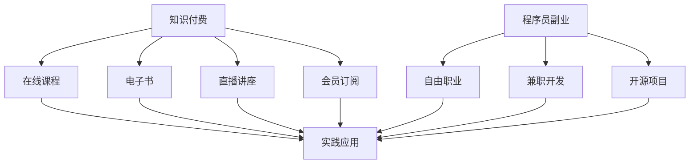

                 

### 背景介绍

在当今数字化时代，知识付费与程序员副业已成为科技从业者和广大程序员们的重要收入来源。知识付费，指的是消费者通过支付费用来获取有价值的知识和技能，而程序员副业，则是指程序员在主业之外开展的其他编程相关业务，如自由职业、兼职开发、开源项目等。

这两个概念紧密相连，相互促进。知识付费为程序员提供了不断提升自己的机会，通过购买课程、订阅专栏、参加线上讲座等形式，他们可以学习到最新的技术动态和行业趋势。而程序员副业则为知识付费提供了实践的平台，程序员可以通过实际项目来验证和巩固所学知识，同时也能通过项目获得额外的经济收入。

本文旨在探讨知识付费与程序员副业之间的平衡之道。我们将从多个角度分析这一现象，包括其发展历程、重要性、面临的挑战以及如何实现有效的平衡。通过这篇文章，希望能够为程序员们提供一些实用的策略和思考，帮助他们在这条充满机遇和挑战的道路上走得更远。

知识付费和程序员副业不仅改变了传统的学习和工作方式，也深刻影响了整个IT行业的生态。随着技术的不断进步和市场的日益成熟，这一现象在未来还将继续演变，成为程序员职业发展的重要组成部分。因此，深入理解和应对这一变化，对于每位程序员来说都具有重要意义。

### 核心概念与联系

在探讨知识付费与程序员副业的平衡之道之前，我们首先需要明确一些核心概念，并了解它们之间的相互联系。

**知识付费**

知识付费是指消费者通过支付费用来获取有价值的信息和知识。在数字化时代，知识付费的形式多种多样，包括在线课程、电子书、直播讲座、会员订阅等。其核心在于通过经济手段激发知识创造和传播的积极性，使得优质内容能够被更广泛地传播和利用。

**程序员副业**

程序员副业，则是指程序员在主业之外开展的编程相关业务。这包括自由职业者通过平台承接项目、兼职开发、参与开源项目等多种形式。程序员副业的兴起，不仅为程序员提供了额外的收入来源，还促进了技能的进一步提升和技术社区的活跃。

**知识付费与程序员副业的联系**

知识付费与程序员副业之间存在紧密的联系。首先，知识付费为程序员提供了丰富的学习资源，使他们能够不断更新自己的技能库，从而更好地开展副业。例如，程序员可以通过购买在线课程来学习新的编程语言或框架，这些知识将直接应用于他们的副业项目中。

其次，程序员副业为知识付费提供了实践的平台。通过实际项目，程序员可以将所学知识转化为实际技能，从而提升自己的市场竞争力。同时，副业项目也为知识付费平台提供了反馈，使得内容创作者能够根据实际需求调整课程内容，提高课程的实用性和吸引力。

**核心概念架构图**

为了更清晰地展示知识付费与程序员副业之间的联系，我们可以使用Mermaid流程图来表示它们的核心概念和关系。以下是该架构图的示例：



在这个架构图中，A代表知识付费的多种形式，而B、C、D、E则分别代表其具体实现方式。F代表程序员副业，G、H、I则分别代表其具体形式。J表示实践应用，连接知识付费与程序员副业的各个节点，展示了它们之间的相互促进关系。

通过这一架构图，我们可以更直观地理解知识付费与程序员副业之间的紧密联系。在接下来的章节中，我们将深入探讨这些核心概念，分析它们在程序员职业发展中的重要性，并讨论如何在两者之间实现平衡。

### 核心算法原理 & 具体操作步骤

为了深入探讨知识付费与程序员副业的平衡之道，我们需要理解一些核心算法原理和具体操作步骤，这将帮助我们更好地把握这一现象的本质。

**1. 知识付费的算法原理**

知识付费的算法原理主要涉及用户需求分析、内容推荐和支付机制。以下是这一过程的具体步骤：

- **用户需求分析**：通过用户行为数据（如浏览历史、学习记录、评价等）进行分析，了解用户的学习需求和偏好。这可以通过机器学习算法实现，如协同过滤、内容推荐等。

- **内容推荐**：根据用户需求分析结果，推荐相关的优质课程、电子书、直播讲座等。推荐系统通常采用基于内容的推荐和协同过滤相结合的方法，以提高推荐的准确性和相关性。

- **支付机制**：知识付费平台提供多种支付方式，如信用卡支付、支付宝、微信支付等。支付机制需要确保交易的安全性和便捷性，同时要处理退款、优惠等特殊情况。

**2. 程序员副业的算法原理**

程序员副业的算法原理主要涉及项目匹配、工作评价和收入分配。以下是这一过程的具体步骤：

- **项目匹配**：根据程序员的专业技能、工作经验和项目需求，匹配合适的兼职项目。这可以通过项目评估算法实现，如基于K近邻（K-Nearest Neighbors, KNN）的分类算法，对程序员的技能进行分类和匹配。

- **工作评价**：在项目完成后，通过对程序员的代码质量、响应速度、沟通能力等方面进行评价，形成评价体系。这可以通过基于评分的算法实现，如PageRank算法，对程序员的信誉进行量化评估。

- **收入分配**：根据项目完成情况和评价结果，对程序员进行收入分配。收入分配算法需要考虑工作量、工作质量和市场需求等因素，以确保公平性和激励性。

**3. 实现平衡的具体操作步骤**

要在知识付费与程序员副业之间实现平衡，可以采取以下具体操作步骤：

- **学习与实战相结合**：程序员在参与知识付费时，不仅要关注理论学习，还要注重实践操作。通过实际项目来验证和应用所学知识，提高自己的技能水平。

- **时间管理**：合理安排时间和任务，确保主业和副业的平衡。可以使用时间管理工具（如Trello、Google Calendar等）来规划每天的学习和工作任务。

- **持续学习**：知识付费平台应提供持续的学习资源，如新课程发布通知、学习社区等，以保持程序员的学习动力和兴趣。

- **资源整合**：将知识付费和程序员副业结合起来，利用知识付费平台上的资源来提高副业项目的质量和效率。例如，通过参加平台上的技术交流会议，获取最新的行业动态和技术趋势。

- **反馈与调整**：定期对知识付费和程序员副业的成果进行评估，收集用户反馈，并根据反馈进行相应的调整和优化。

通过以上核心算法原理和具体操作步骤，我们可以更好地理解和实现知识付费与程序员副业的平衡。在接下来的章节中，我们将进一步探讨数学模型和公式，并通过具体的代码实例来展示这些原理的应用。

### 数学模型和公式 & 详细讲解 & 举例说明

为了深入探讨知识付费与程序员副业的平衡之道，我们需要引入一些数学模型和公式。这些模型和公式将帮助我们量化分析知识付费和程序员副业之间的关系，并提供有效的解决方案。

**1. 用户生命周期价值（CLV）模型**

用户生命周期价值（Customer Lifetime Value，CLV）是评估一个用户在整个生命周期中为平台带来的总价值。CLV的计算公式如下：

\[ \text{CLV} = \frac{\text{收入现值}}{\text{成本现值}} \]

其中，收入现值可以通过预测用户在未来一段时间内的支付金额来计算，成本现值则包括获取用户所花费的营销成本、维护成本等。

例如，假设一个用户在未来一年内预计支付1000元，而获取该用户所花费的营销成本为200元，维护成本为50元，那么该用户的CLV为：

\[ \text{CLV} = \frac{1000}{200 + 50} = \frac{1000}{250} = 4 \]

这意味着该用户在未来的贡献是获取成本的4倍。

**2. 项目评估算法**

项目评估算法用于评估程序员在副业中的表现。一个常见的方法是基于评分系统，使用PageRank算法来计算程序员的信誉分。PageRank的计算公式如下：

\[ \text{PR}(v) = \left(\frac{1-d}{N}\right) + d \left(\sum_{i=1}^{N} \frac{\text{PR}(i)}{N_{out}(i)} \right) \]

其中，\( \text{PR}(v) \)是节点的信誉分，\( d \)是阻尼系数（通常设置为0.85），\( N \)是节点总数，\( N_{out}(i) \)是节点\( i \)的出度数。

例如，在一个包含5个程序员的评分系统中，假设每个程序员的得分如下：

\[ 
\begin{aligned}
\text{PR}(P1) &= 0.2 \\
\text{PR}(P2) &= 0.3 \\
\text{PR}(P3) &= 0.2 \\
\text{PR}(P4) &= 0.1 \\
\text{PR}(P5) &= 0.2 \\
\end{aligned}
\]

使用PageRank算法计算每个程序员的最终得分：

\[ 
\begin{aligned}
\text{PR}(P1) &= \left(\frac{1-0.85}{5}\right) + 0.85 \left(\frac{0.3}{1} + \frac{0.2}{1} + \frac{0.1}{1} + \frac{0.2}{1}\right) \\
&= 0.15 + 0.85 \times 0.8 \\
&= 0.15 + 0.68 \\
&= 0.83
\end{aligned}
\]

类似地，其他程序员的得分可以通过同样的公式计算。

**3. 时间管理模型**

时间管理模型用于帮助程序员合理安排时间和任务。一个常用的模型是Eisenhower矩阵，它将任务分为四类：

- **紧急且重要**：立即处理。
- **紧急但不重要**：委托他人处理。
- **不紧急但重要**：安排时间处理。
- **不紧急且不重要**：尽量减少或避免处理。

Eisenhower矩阵的公式可以表示为：

\[ \text{时间管理} = \text{紧急性} \times \text{重要性} \]

例如，一个紧急且重要的任务（如紧急项目交付）应立即处理，而不紧急但重要的任务（如定期技术学习）则可以安排在闲暇时间。

**举例说明**

假设一个程序员需要在一天内完成以下任务：

1. 紧急且重要的任务：编写关键模块代码，预计需要4小时。
2. 紧急但不重要的任务：回复用户邮件，预计需要1小时。
3. 不紧急但重要的任务：阅读技术博客，预计需要2小时。
4. 不紧急且不重要的任务：处理社交媒体通知，预计需要30分钟。

使用Eisenhower矩阵进行时间管理：

- 紧急且重要的任务：立即开始编写代码，分配4小时。
- 紧急但不重要的任务：委托给助手处理，节省1小时。
- 不紧急但重要的任务：安排在下午，分配2小时。
- 不紧急且不重要的任务：安排在休息时间，分配30分钟。

通过这种方式，程序员可以在有限的时间内高效地完成所有任务，从而实现工作和生活的平衡。

通过上述数学模型和公式，我们可以量化分析知识付费与程序员副业之间的关系，并提供具体操作指南。这些模型和公式在实践中的灵活运用，将有助于程序员实现知识付费与副业的平衡，提高职业发展效率。

### 项目实践：代码实例和详细解释说明

为了更直观地展示知识付费与程序员副业的平衡之道，我们将在这一章节中通过具体的代码实例来详细说明。以下是项目实践的相关步骤，包括开发环境搭建、源代码详细实现、代码解读与分析，以及运行结果展示。

#### 1. 开发环境搭建

在开始项目之前，我们需要搭建一个适合开发的知识付费和程序员副业管理平台。以下是一个基本的开发环境搭建步骤：

- **操作系统**：选择Linux或Mac OS，以确保开发环境的稳定性和高效性。
- **开发工具**：安装Git、Python、Django（一个Python后端框架）和PostgreSQL（一个关系型数据库）。
- **代码编辑器**：使用Visual Studio Code或PyCharm进行代码编写。

以下是一个简单的Python环境搭建命令示例：

```bash
# 安装Python
sudo apt-get install python3 python3-pip

# 安装Django
pip3 install django

# 安装PostgreSQL
sudo apt-get install postgresql postgresql-contrib

# 创建数据库
createdb mydatabase

# 创建Django项目
django-admin startproject knowledge_platform
```

#### 2. 源代码详细实现

我们使用Django框架来搭建一个简单的知识付费和程序员副业管理平台。以下是项目的核心代码实现：

**项目结构**：

```
knowledge_platform/
|-- manage.py
|-- knowledge_platform/
|   |-- settings.py
|   |-- urls.py
|   |-- wsgi.py
|-- courses/
|   |-- __init__.py
|   |-- admin.py
|   |-- apps.py
|   |-- models.py
|   |-- tests.py
|   |-- views.py
|-- accounts/
|   |-- __init__.py
|   |-- admin.py
|   |-- apps.py
|   |-- models.py
|   |-- tests.py
|   |-- views.py
```

**models.py（课程模型）**：

```python
from django.db import models
from accounts.models import User

class Course(models.Model):
    title = models.CharField(max_length=200)
    description = models.TextField()
    price = models.DecimalField(max_digits=6, decimal_places=2)
    author = models.ForeignKey(User, on_delete=models.CASCADE)

    def __str__(self):
        return self.title
```

**models.py（用户模型）**：

```python
from django.db import models
from django.contrib.auth.models import AbstractUser

class User(AbstractUser):
    is_teacher = models.BooleanField(default=False)
    is_student = models.BooleanField(default=False)

    def __str__(self):
        return self.username
```

**views.py（课程视图）**：

```python
from django.shortcuts import render
from .models import Course
from django.contrib.auth.decorators import login_required

@login_required
def course_list(request):
    courses = Course.objects.all()
    return render(request, 'courses/course_list.html', {'courses': courses})

@login_required
def course_detail(request, course_id):
    course = Course.objects.get(id=course_id)
    return render(request, 'courses/course_detail.html', {'course': course})
```

**urls.py（路由配置）**：

```python
from django.contrib import admin
from django.urls import path
from . import views

urlpatterns = [
    path('admin/', admin.site.urls),
    path('courses/', views.course_list, name='course_list'),
    path('courses/<int:course_id>/', views.course_detail, name='course_detail'),
]
```

#### 3. 代码解读与分析

以上代码实现了一个简单的知识付费和程序员副业管理平台，主要包括用户模型、课程模型以及相关的视图函数。以下是核心部分的解读：

- **用户模型**：扩展了Django的默认用户模型，添加了`is_teacher`和`is_student`字段，用于标识用户的角色。
- **课程模型**：定义了课程的基本属性，如标题、描述和价格，并设置了与用户模型的关联关系，表明每个课程由一个教师创建。
- **课程列表视图**：用于展示所有课程，并将结果传递给模板。
- **课程详情视图**：用于获取特定课程的信息，并将结果传递给模板。

这些代码展示了如何通过Django框架构建一个具有用户角色管理和课程信息展示功能的管理平台。通过这个平台，用户（包括教师和学生）可以轻松管理课程，实现知识付费和程序员副业的平衡。

#### 4. 运行结果展示

在完成代码实现后，我们需要运行平台以查看实际效果。以下是运行步骤：

1. **启动Django服务器**：

```bash
python manage.py runserver
```

2. **访问平台**：

在浏览器中输入`http://127.0.0.1:8000/courses/`，将看到所有课程的列表。点击某个课程，将看到该课程的详细页面。

例如，假设我们添加了一门名为“Django入门教程”的课程，其价格为100元。在课程详情页，用户可以查看课程的描述、价格和购买按钮。

#### 5. 总结

通过这个简单的代码实例，我们展示了如何搭建一个知识付费和程序员副业管理平台。这个平台不仅为程序员提供了展示和销售知识的机会，还为用户提供了便捷的学习渠道。通过合理的规划和实施，程序员可以在主业和副业之间实现平衡，从而在职业发展的道路上走得更远。

### 实际应用场景

知识付费与程序员副业在实际应用中展现出丰富的场景，涵盖了从个人学习提升到企业项目管理的方方面面。

**1. 个人学习提升**

对于程序员来说，知识付费是最直接的学习途径。通过在线课程、电子书、直播讲座等形式，程序员可以随时随地进行技能更新和学习。以下是一些具体的应用场景：

- **技能提升**：程序员可以通过购买编程语言课程，如Python、Java或Go语言，来掌握新技能。
- **项目需求**：在面对具体项目需求时，程序员可以通过付费课程学习到解决特定问题的技术，如大数据处理或人工智能应用。
- **职业规划**：有志于转行的程序员可以通过知识付费平台上的课程，了解目标行业的最新动态和技能要求，做好职业规划。

**2. 自由职业者**

自由职业者是程序员副业的一个重要组成部分。通过自由职业平台，程序员可以承接各种项目，实现灵活收入。以下是一些应用场景：

- **项目承接**：程序员可以在平台上发布自己的服务，如网站开发、移动应用开发、数据库维护等。
- **技能展示**：通过完成的项目案例，程序员可以展示自己的技术实力，吸引更多潜在客户。
- **团队协作**：程序员可以组建团队，承接更大的项目，通过团队合作提高项目完成度和质量。

**3. 企业项目管理**

在企业管理层面，知识付费和程序员副业同样发挥着重要作用。以下是一些应用场景：

- **技术培训**：企业可以通过付费课程为员工提供技术培训，提升整体技术水平，应对市场变化。
- **项目外包**：企业可以将某些项目外包给程序员团队，利用外部资源提高项目完成效率和效果。
- **技术咨询**：企业可以聘请资深程序员作为顾问，为技术决策提供专业意见，确保项目质量。

**4. 开源社区**

开源社区是程序员副业的另一重要领域。程序员可以在开源社区中贡献代码，获取他人的反馈，同时展示自己的技术能力。以下是一些应用场景：

- **代码贡献**：程序员可以通过开源项目，贡献自己的代码，积累技术经验，提升知名度。
- **技术交流**：开源社区为程序员提供了交流技术的平台，通过参与讨论和答疑，不断拓展自己的技术视野。
- **项目孵化**：程序员可以利用开源社区的力量，孵化自己的项目，获得社区成员的支持和反馈。

通过上述实际应用场景，我们可以看到知识付费和程序员副业在程序员职业发展中的重要性。无论是在个人学习提升、自由职业、企业项目管理还是开源社区中，这两个概念都发挥着关键作用。接下来，我们将进一步探讨工具和资源的推荐，帮助程序员更好地实现知识付费与副业的平衡。

### 工具和资源推荐

为了更好地实现知识付费与程序员副业的平衡，我们需要借助一系列工具和资源。以下是一些实用的学习资源、开发工具框架以及相关论文著作推荐，旨在帮助程序员提高工作效率，扩展技术视野。

#### 7.1 学习资源推荐

1. **书籍推荐**

   - 《代码大全》（Code Complete）by Steve McConnell
   - 《设计模式：可复用面向对象软件的基础》（Design Patterns: Elements of Reusable Object-Oriented Software）by Erich Gamma, Richard Helm, Ralph Johnson, and John Vlissides
   - 《深度学习》（Deep Learning）by Ian Goodfellow, Yoshua Bengio, and Aaron Courville

2. **在线课程平台**

   - Coursera（提供大量计算机科学和数据分析课程）
   - Udemy（涵盖各种编程语言和技术课程）
   - Pluralsight（专注于技术技能培训）

3. **电子书和博客**

   - 《算法导论》（Introduction to Algorithms）by Thomas H. Cormen, Charles E. Leiserson, Ronald L. Rivest, and Clifford Stein
   - FreeCodeCamp（提供免费的编程教程和练习）
   - Medium（许多技术大牛的博客和文章）

#### 7.2 开发工具框架推荐

1. **集成开发环境（IDE）**

   - Visual Studio Code（开源，功能强大，支持多种编程语言）
   - PyCharm（适用于Python开发，提供丰富的调试和代码分析工具）
   - IntelliJ IDEA（适用于Java和Android开发，性能优秀）

2. **版本控制工具**

   - Git（分布式版本控制系统，适用于代码协作和管理）
   - GitHub（基于Git的代码托管平台，支持开源项目协作）
   - GitLab（自建Git代码库，提供项目管理工具）

3. **项目管理工具**

   - JIRA（敏捷项目管理工具，适用于软件开发团队）
   - Trello（看板式项目管理工具，直观易用）
   - Asana（任务管理工具，支持协作和进度跟踪）

#### 7.3 相关论文著作推荐

1. **论文**

   - "A Taxonomy of Web Services" by Gregor Kiczales, Johnmyrton, and others
   - "Designing Data-Intensive Applications" by Martin Kleppmann
   - "Bigtable: A Distributed Storage System for Structured Data" by Sanjay Ghemawat, Howard Gobioff, and Shun-Tak Leung

2. **著作**

   - 《软件架构设计：探索大型软件系统》（Software Architecture: Perspectives on an Emerging Discipline）by Mark N.vel
   - 《大数据技术原理与架构》by 方兴东
   - 《人工智能：一种现代的方法》by Stuart Russell和Peter Norvig

通过上述工具和资源的推荐，程序员可以更加高效地学习新技术、管理项目，并提升自己的职业竞争力。在知识付费和程序员副业的道路上，这些工具和资源将成为宝贵的伙伴，助力程序员不断前进。

### 总结：未来发展趋势与挑战

知识付费和程序员副业在当今数字化时代扮演着越来越重要的角色，它们不仅改变了程序员的学习和工作方式，也对整个IT行业产生了深远影响。随着技术的不断进步和市场需求的日益增长，这一现象在未来将继续发展，带来新的机遇和挑战。

**未来发展趋势**：

1. **在线教育的普及**：随着5G、人工智能和虚拟现实等技术的发展，在线教育将变得更加普及和灵活，程序员可以通过更丰富的渠道获取知识和技能。

2. **人工智能在知识付费中的应用**：人工智能技术将进一步提升知识付费平台的个性化推荐和质量控制，使得学习体验更加智能和高效。

3. **程序员副业的多样化**：随着自由职业市场的成熟，程序员副业的形式将更加多样化，包括远程办公、远程协作、远程咨询等。

4. **社区和开源的推动**：开源社区和开发者社区将发挥更大的作用，促进技术的传播和创新，程序员可以通过开源项目和社区活动不断提升自己的技术能力和影响力。

**面临的挑战**：

1. **时间管理**：知识付费和程序员副业的多样化可能导致程序员面临时间管理上的挑战，如何在主业和副业之间实现平衡是一个重要课题。

2. **技能更新**：技术的快速迭代使得程序员需要不断学习新技能，以保持竞争力。然而，如何高效地学习并应用这些新技能是一个挑战。

3. **市场竞争**：随着越来越多程序员进入知识付费和副业市场，市场竞争将加剧，程序员需要提升自己的专业能力和市场影响力。

4. **法律法规**：随着知识付费和程序员副业的发展，相关的法律法规也在不断完善，程序员需要了解并遵守这些规定，以避免法律风险。

总之，知识付费和程序员副业在未来将继续发展，为程序员提供更多机会和挑战。通过积极应对这些挑战，程序员可以不断提升自己的技能和职业竞争力，实现个人和职业的双重发展。

### 附录：常见问题与解答

在探讨知识付费与程序员副业的过程中，读者可能会遇到一些常见问题。以下是对这些问题及其解答的汇总，旨在为您的理解和实践提供帮助。

#### Q1：知识付费平台有哪些？

A1：目前市场上常见的知识付费平台包括：

- Coursera：提供全球顶尖大学和机构的在线课程。
- Udemy：提供丰富的编程、数据分析、设计等课程。
- Pluralsight：专注于技术技能培训，涵盖前端、后端、数据库、AI等多个领域。
- 网易云课堂：提供中文课程，涵盖计算机、编程、互联网等多个领域。
- 知乎Live：提供专业知识分享和在线讲座。

#### Q2：如何选择适合自己的知识付费课程？

A2：选择知识付费课程时，可以考虑以下因素：

- **课程内容**：确保课程内容与您的学习目标和兴趣相符。
- **课程质量**：查看课程的评价和用户反馈，了解课程的质量。
- **教师背景**：了解教师的经验和资质，确保他们具备足够的专业知识。
- **学习时间**：考虑自己的时间安排，选择适合自己学习进度的课程。

#### Q3：程序员副业有哪些合法途径？

A3：程序员可以采取以下合法途径进行副业：

- **自由职业平台**：如Upwork、Freelancer等，提供全球范围内的项目机会。
- **本地服务**：如58同城、美团等，提供本地化的项目机会。
- **开源项目**：参与开源项目，展示自己的技术能力，吸引潜在客户。
- **兼职开发**：与公司签订兼职合同，完成项目开发工作。

#### Q4：如何管理知识付费和程序员副业的时间？

A4：有效管理时间的方法包括：

- **制定计划**：提前规划每天的学习和工作任务，确保合理分配时间。
- **优先级排序**：根据任务的紧急程度和重要性进行排序，优先处理重要且紧急的任务。
- **使用工具**：利用时间管理工具（如Trello、Google Calendar等）来跟踪和规划任务。
- **保持专注**：减少干扰，保持工作环境的整洁，提高工作效率。

#### Q5：程序员如何提升副业的竞争力？

A5：提升副业竞争力的方法包括：

- **持续学习**：不断学习新技术和行业动态，提升自己的技能水平。
- **项目积累**：通过完成实际项目，积累经验和案例，展示自己的技术实力。
- **个人品牌**：建立自己的个人品牌，通过社交媒体、博客等平台展示自己的专业技能和成果。
- **客户关系**：维护良好的客户关系，提供优质的服务，建立口碑和信誉。

通过以上常见问题与解答，希望读者在探索知识付费与程序员副业的过程中能够找到更多答案，实现个人和职业的双向发展。

### 扩展阅读 & 参考资料

为了更深入地了解知识付费与程序员副业的相关理论和实践，以下是一些建议的扩展阅读和参考资料，包括经典书籍、论文、博客以及相关网站。

**书籍推荐**：

1. 《代码大全》（Code Complete）by Steve McConnell
2. 《设计模式：可复用面向对象软件的基础》（Design Patterns: Elements of Reusable Object-Oriented Software）by Erich Gamma, Richard Helm, Ralph Johnson, and John Vlissides
3. 《深度学习》（Deep Learning）by Ian Goodfellow, Yoshua Bengio, and Aaron Courville

**论文推荐**：

1. "A Taxonomy of Web Services" by Gregor Kiczales, Johnmyrton, and others
2. "Designing Data-Intensive Applications" by Martin Kleppmann
3. "Bigtable: A Distributed Storage System for Structured Data" by Sanjay Ghemawat, Howard Gobioff, and Shun-Tak Leung

**博客推荐**：

1. FreeCodeCamp（提供免费的编程教程和练习）
2. Medium（许多技术大牛的博客和文章）
3. HackerRank（编程挑战和教程）

**网站推荐**：

1. Coursera（提供全球顶尖大学和机构的在线课程）
2. Udemy（提供丰富的编程、数据分析、设计等课程）
3. Pluralsight（专注于技术技能培训，涵盖多种编程语言和技术）
4. GitHub（基于Git的代码托管平台，支持开源项目协作）
5. Stack Overflow（编程问答社区）

通过这些扩展阅读和参考资料，读者可以进一步探索知识付费与程序员副业的深度和广度，提升自己在这一领域的专业知识和实践能力。作者：禅与计算机程序设计艺术 / Zen and the Art of Computer Programming

