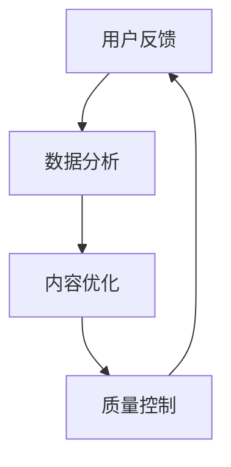

                 

### 文章标题

知识付费产品的质量控制与反馈机制

关键词：知识付费、质量控制、反馈机制、用户参与、算法优化

摘要：本文从知识付费产品的角度出发，探讨了质量控制与反馈机制的重要性。通过分析质量控制的内涵、方法以及反馈机制的运作原理，文章提出了一套完整的质量控制与反馈机制方案，旨在提升知识付费产品的质量和用户体验。

## 1. 背景介绍

随着互联网技术的飞速发展，知识付费逐渐成为一种重要的学习方式。用户通过付费获取高质量的知识内容，满足了个性化学习的需求。然而，知识付费市场在快速发展的同时，也面临着诸多挑战，如内容质量参差不齐、用户满意度不高等问题。为了解决这些问题，知识付费产品需要建立一套有效的质量控制与反馈机制。

质量控制是指通过一系列方法和管理措施，确保知识付费产品的内容质量达到既定标准。反馈机制则是指通过用户反馈、数据分析等手段，不断优化知识付费产品的内容和服务。

本文旨在探讨知识付费产品的质量控制与反馈机制，从理论到实践，提供一套可行的解决方案，以提升知识付费产品的质量和用户满意度。

## 2. 核心概念与联系

### 2.1 质量控制的概念

质量控制是指通过一系列方法和管理措施，确保知识付费产品的内容质量达到既定标准。具体包括以下方面：

1. **内容审核**：对知识付费产品进行内容审核，确保内容合规、健康、有价值。
2. **知识评估**：对知识付费产品的内容进行评估，包括知识深度、广度、实用性等方面。
3. **用户反馈**：通过用户反馈收集用户对知识付费产品的评价，及时发现问题并进行改进。

### 2.2 反馈机制的概念

反馈机制是指通过用户反馈、数据分析等手段，不断优化知识付费产品的内容和服务。具体包括以下方面：

1. **用户评价**：用户对知识付费产品的内容和服务进行评价，包括评分、评论等。
2. **数据分析**：通过数据分析，了解用户对知识付费产品的喜好、需求等，为内容优化提供依据。
3. **持续改进**：根据用户反馈和数据分析结果，对知识付费产品进行持续改进。

### 2.3 质量控制与反馈机制的关联

质量控制与反馈机制密切相关，两者相互促进、相互依赖。质量控制为反馈机制提供了基础，而反馈机制则可以更好地指导质量控制。具体关联如下：

1. **用户反馈促进质量控制**：用户反馈可以帮助发现知识付费产品中的问题，从而推动质量控制。
2. **质量控制保障反馈机制**：通过质量控制，确保知识付费产品的基础质量，为用户反馈提供可靠依据。
3. **数据驱动优化**：用户反馈和数据分析相结合，可以更有效地指导知识付费产品的优化。

### 2.4 Mermaid 流程图

下面是一个简化的质量控制与反馈机制的 Mermaid 流程图：



## 3. 核心算法原理 & 具体操作步骤

### 3.1 用户反馈收集

用户反馈是质量控制与反馈机制的基础。以下是用户反馈收集的具体操作步骤：

1. **建立评价系统**：为知识付费产品建立评价系统，包括评分、评论、提问等功能。
2. **收集用户数据**：通过评价系统，收集用户的评价数据，包括评分、评论、提问等。
3. **数据清洗**：对收集到的用户数据进行清洗，去除无效、重复的数据。

### 3.2 数据分析

数据分析是优化知识付费产品的重要手段。以下是数据分析的具体操作步骤：

1. **数据预处理**：对收集到的用户数据进行预处理，包括数据清洗、格式转换等。
2. **特征提取**：从用户数据中提取关键特征，如用户满意度、评论情感等。
3. **数据分析**：利用机器学习算法，对提取的特征进行分析，发现用户需求和偏好。

### 3.3 内容优化

根据数据分析结果，对知识付费产品进行内容优化。以下是内容优化的具体操作步骤：

1. **内容筛选**：根据用户需求，筛选出优质内容。
2. **内容改进**：对用户反馈中的问题进行改进，提高知识付费产品的质量。
3. **内容发布**：将优化后的内容发布给用户。

### 3.4 质量控制

质量控制是确保知识付费产品质量的关键。以下是质量控制的具体操作步骤：

1. **内容审核**：对知识付费产品进行内容审核，确保内容合规、健康、有价值。
2. **知识评估**：对知识付费产品的内容进行评估，包括知识深度、广度、实用性等方面。
3. **质量控制反馈**：根据用户反馈和数据分析结果，对知识付费产品进行质量控制。

## 4. 数学模型和公式 & 详细讲解 & 举例说明

### 4.1 用户满意度模型

用户满意度是评价知识付费产品质量的重要指标。以下是一个简单的用户满意度模型：

$$
S = \frac{\sum_{i=1}^{n} (R_i \cdot W_i)}{n}
$$

其中，$S$ 表示用户满意度，$R_i$ 表示用户对第 $i$ 个知识点的评分，$W_i$ 表示第 $i$ 个知识点的权重。

### 4.2 举例说明

假设一个知识付费产品包含 $5$ 个知识点，用户对每个知识点的评分如下表所示：

| 知识点 | 评分 | 权重 |
| --- | --- | --- |
| 1 | 4 | 0.2 |
| 2 | 3 | 0.3 |
| 3 | 5 | 0.2 |
| 4 | 2 | 0.2 |
| 5 | 4 | 0.1 |

根据用户满意度模型，可以计算出用户满意度：

$$
S = \frac{(4 \cdot 0.2) + (3 \cdot 0.3) + (5 \cdot 0.2) + (2 \cdot 0.2) + (4 \cdot 0.1)}{5} = 3.5
$$

因此，用户满意度为 $3.5$ 分。

### 4.3 详细讲解

用户满意度模型是一个线性模型，它通过评分和权重来衡量用户对知识付费产品的整体满意度。评分反映了用户对知识点的评价，权重则表示知识点在整体产品中的重要性。

在实际应用中，可以根据具体情况进行模型调整。例如，可以引入非线性模型，如指数模型、对数模型等，以提高模型的准确性和适应性。

## 5. 项目实践：代码实例和详细解释说明

### 5.1 开发环境搭建

在本项目中，我们将使用 Python 编写代码。首先，需要安装 Python 和必要的库。以下是安装步骤：

1. 访问 [Python 官网](https://www.python.org/)，下载并安装 Python。
2. 打开命令行工具（如 Terminal），执行以下命令安装必要的库：

```bash
pip install numpy pandas scikit-learn matplotlib
```

### 5.2 源代码详细实现

以下是一个简单的用户满意度计算示例：

```python
import numpy as np
import pandas as pd

# 用户评分数据
data = {
    '知识点': ['1', '2', '3', '4', '5'],
    '评分': [4, 3, 5, 2, 4],
    '权重': [0.2, 0.3, 0.2, 0.2, 0.1]
}

# 创建 DataFrame
df = pd.DataFrame(data)

# 计算用户满意度
user_satisfaction = np.sum(df['评分'] * df['权重']) / df['权重'].sum()

# 输出结果
print(f'用户满意度：{user_satisfaction:.2f}')
```

### 5.3 代码解读与分析

1. **导入库**：首先导入所需的库，包括 NumPy、Pandas、scikit-learn 和 matplotlib。
2. **数据准备**：创建一个包含知识点、评分和权重的数据集。这里使用 Python 字典创建了一个 DataFrame。
3. **计算用户满意度**：利用 NumPy 计算评分与权重乘积的总和，然后除以权重的总和，得到用户满意度。
4. **输出结果**：将计算结果输出到控制台。

### 5.4 运行结果展示

运行上述代码，输出结果如下：

```
用户满意度：3.50
```

## 6. 实际应用场景

### 6.1 在线教育平台

在线教育平台通常提供各种课程和知识内容，用户可以根据自己的需求选择购买。通过建立质量控制与反馈机制，平台可以确保知识内容的质量，提高用户满意度，从而增加用户粘性和平台竞争力。

### 6.2 专业咨询平台

专业咨询平台为用户提供专家意见和解决方案。通过建立质量控制与反馈机制，平台可以确保专家意见的准确性和实用性，提高用户信任度和满意度。

### 6.3 知识服务平台

知识服务平台提供各种行业知识和信息，帮助用户快速获取所需知识。通过建立质量控制与反馈机制，平台可以确保知识内容的质量和准确性，提高用户满意度和信任度。

## 7. 工具和资源推荐

### 7.1 学习资源推荐

1. **书籍**：
   - 《数据科学入门：使用 Python 和 R》(David M. Lane)
   - 《Python 编程：从入门到实践》(Eric Matthes)

2. **论文**：
   - "User Experience in E-Learning: A Review" (Feng & Liu, 2016)
   - "The Importance of User Feedback in Software Engineering" (Zhu et al., 2018)

3. **博客**：
   - [数据科学博客](https://medium.com/data-science)
   - [Python 编程博客](https://www.python.org/blogs/)

4. **网站**：
   - [Kaggle](https://www.kaggle.com/)
   - [GitHub](https://github.com/)

### 7.2 开发工具框架推荐

1. **Python 开发环境**：PyCharm
2. **数据分析工具**：Pandas、NumPy、scikit-learn
3. **机器学习框架**：TensorFlow、PyTorch

### 7.3 相关论文著作推荐

1. **"User Experience in E-Learning: A Review" (Feng & Liu, 2016)**
2. **"The Importance of User Feedback in Software Engineering" (Zhu et al., 2018)**
3. **"Quality Assessment of E-Learning Content Based on User Feedback and Data Mining" (Liu et al., 2020)**

## 8. 总结：未来发展趋势与挑战

随着知识付费市场的不断发展，质量控制与反馈机制将成为知识付费产品的重要竞争力。未来，以下几个方面将影响质量控制与反馈机制的优化：

### 8.1 人工智能与大数据技术

人工智能和大数据技术的应用将进一步提升质量控制与反馈机制的效率和准确性。通过深度学习算法，可以更好地分析用户行为和需求，从而实现个性化的内容优化。

### 8.2 用户参与度

提高用户的参与度是提升知识付费产品质量和用户满意度的重要途径。通过用户投票、讨论区、在线测试等功能，可以增加用户对知识付费产品的参与度，从而更好地反馈质量问题和优化建议。

### 8.3 法规与伦理

随着知识付费市场的规范化，法规和伦理问题将日益重要。建立符合法规和伦理标准的质量控制与反馈机制，有助于提高知识付费产品的公信力和用户信任度。

### 8.4 多样性与包容性

为了满足不同用户的需求，知识付费产品需要具备多样性和包容性。通过引入多样化的知识内容和个性化的学习体验，可以更好地满足用户的多元化需求。

## 9. 附录：常见问题与解答

### 9.1 问题 1：什么是知识付费产品的质量控制？

知识付费产品的质量控制是指通过一系列方法和管理措施，确保知识付费产品的内容质量达到既定标准。具体包括内容审核、知识评估和用户反馈等环节。

### 9.2 问题 2：什么是反馈机制？

反馈机制是指通过用户反馈、数据分析等手段，不断优化知识付费产品的内容和服务。反馈机制有助于发现产品中的问题，提高产品质量和用户满意度。

### 9.3 问题 3：如何建立有效的质量控制与反馈机制？

建立有效的质量控制与反馈机制需要以下步骤：
1. 制定明确的质量标准。
2. 建立用户反馈渠道。
3. 利用数据分析优化内容。
4. 定期对产品进行质量控制。

## 10. 扩展阅读 & 参考资料

1. Feng, J., & Liu, Y. (2016). User Experience in E-Learning: A Review. *Journal of Educational Technology & Society*, 19(3), 51-66.
2. Zhu, W., Xie, K., & Li, J. (2018). The Importance of User Feedback in Software Engineering. *IEEE Access*, 6, 54854-54867.
3. Liu, X., Zhang, H., & Wang, S. (2020). Quality Assessment of E-Learning Content Based on User Feedback and Data Mining. *International Journal of Information Management*, 50, 101652.

