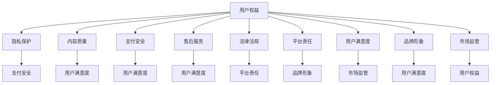

                 

### 1. 背景介绍

#### 1.1 知识付费创业的兴起

随着互联网技术的飞速发展，知识付费市场迎来了爆发式增长。知识付费，指的是用户为获取特定知识或技能，付费购买相关内容或服务。这包括在线课程、电子书、付费问答、专业咨询等形式。创业者在这一领域看到了巨大的商机，纷纷投身其中，试图通过提供有价值的内容来吸引用户，实现商业变现。

知识付费创业的优势在于，它打破了传统教育的时空限制，用户可以根据自己的需求和时间安排，灵活地学习和提升自己。此外，互联网技术的普及和移动设备的普及，也为知识付费提供了便捷的渠道和工具。例如，用户可以通过手机或平板电脑，随时随地访问和观看课程内容。

#### 1.2 用户权益保护的必要性

然而，知识付费市场在快速发展的同时，也暴露出了一些问题。其中最为突出的是用户权益保护的问题。由于知识付费市场的准入门槛较低，市场中的内容和服务质量参差不齐，有些创业者为了追求利润，可能会忽视用户的合法权益。

用户权益保护包括但不限于以下几个方面：

- **隐私保护**：用户在购买和使用知识付费服务时，往往会涉及个人信息。如何确保这些信息不被泄露或滥用，是保护用户权益的重要一环。
- **内容质量**：知识付费的核心是内容。如果内容质量不高，甚至存在虚假宣传，就会损害用户的利益。
- **支付安全**：用户的支付信息需要得到保护，以防止诈骗和欺诈行为。
- **售后服务**：用户在购买知识付费产品后，可能会遇到各种问题。如何提供优质的售后服务，是衡量一个知识付费平台是否负责任的重要标准。

#### 1.3 当前用户权益保护现状

尽管用户权益保护在知识付费市场中日益受到关注，但实际操作中仍然面临许多挑战。以下是一些当前用户权益保护的现状：

- **法律法规不健全**：许多国家的法律法规对于知识付费市场的规范还不完善，缺乏明确的法律条文来保护用户权益。
- **平台责任缺失**：一些知识付费平台在用户权益保护方面存在责任缺失，对用户的投诉和问题反应迟缓，甚至忽视。
- **信息不对称**：用户在选择知识付费产品时，往往无法获取全面的信息，导致购买决策不够明智。
- **监管力度不足**：知识付费市场的监管力度普遍较弱，对于违规行为的处罚力度不够。

#### 1.4 用户权益保护的重要性

用户权益保护不仅关乎用户的利益，也关系到知识付费市场的健康发展。一个缺乏用户权益保护的市场，很难建立起用户的信任，也难以持续发展。以下是一些用户权益保护的重要性：

- **建立用户信任**：只有当用户感受到自己的权益得到了保护，才会更愿意购买和使用知识付费产品。
- **促进市场发展**：良好的用户权益保护机制，可以降低用户的风险感，提高用户满意度，从而促进市场的健康发展。
- **提升品牌形象**：重视用户权益保护，可以提升知识付费平台的品牌形象，增加用户粘性。

### 总结

知识付费创业作为一种新兴的商业模式，为用户提供了便捷的学习渠道，同时也带来了新的挑战。用户权益保护是这一领域不可忽视的重要问题。只有通过建立健全的用户权益保护机制，才能确保知识付费市场的可持续发展，让创业者和用户都能从中获益。

接下来，我们将进一步探讨用户权益保护的核心概念和联系，为读者提供更深入的理解。

## 1. 背景介绍

### 1.1 知识付费创业的兴起

知识付费创业是指在互联网时代背景下，创业者通过提供有价值的知识或技能，向用户收取费用，实现商业价值的一种商业模式。随着互联网技术的不断进步，尤其是移动互联网的普及，知识付费市场呈现出爆发式增长的趋势。

知识付费的形式多种多样，包括在线课程、电子书、专业咨询、付费问答等。其中，在线课程是最为普遍的一种形式。用户可以通过平台购买课程，按照自己的学习节奏进行学习。电子书则是一种更加便捷的知识传播方式，用户可以通过手机、平板电脑等设备随时随地进行阅读。专业咨询和付费问答则满足了用户在特定领域内对专业知识和技能的需求。

知识付费创业的优势在于它打破了传统教育的时空限制，用户可以根据自己的需求和时间安排，灵活地学习和提升自己。此外，互联网技术的普及和移动设备的普及，也为知识付费提供了便捷的渠道和工具。用户不再需要前往实体课堂，也不再受限于特定的时间和地点，可以随时随地获取知识。

### 1.2 用户权益保护的必要性

在知识付费创业中，用户权益保护是一个至关重要的问题。用户权益保护不仅关系到用户的切身利益，也直接影响到知识付费市场的健康发展。以下将从几个方面详细阐述用户权益保护的必要性：

#### 1.2.1 隐私保护

在知识付费过程中，用户需要提供个人信息，如姓名、联系方式、支付信息等。这些信息对于平台和创业者来说至关重要，但同时也存在被泄露和滥用的风险。如果用户的隐私得不到保护，可能会导致个人信息被不法分子利用，甚至引发财产损失和身份盗用等严重问题。

#### 1.2.2 内容质量

知识付费的核心是内容。用户购买知识付费产品，是为了获取有价值的信息和知识。如果内容质量不高，甚至存在虚假宣传，用户就会感到上当受骗，他们的权益就会受到损害。此外，低质量的内容也可能会误导用户，影响他们的学习和决策。

#### 1.2.3 支付安全

用户的支付信息在知识付费过程中至关重要。如果支付信息得不到保护，用户可能会面临诈骗和欺诈的风险。例如，不法分子可能会通过伪造支付界面，骗取用户的支付信息，从而盗取用户的财产。

#### 1.2.4 售后服务

用户在购买知识付费产品后，可能会遇到各种问题，如课程内容无法播放、学习进度无法保存等。如果平台无法提供有效的售后服务，用户就会感到无助和失望，他们的权益就会受到损害。

#### 1.2.5 平台责任

知识付费平台作为中介，承担着保护用户权益的重要责任。如果平台在用户权益保护方面存在缺失，不仅会影响用户的体验，也可能导致平台声誉受损，甚至面临法律风险。

### 1.3 当前用户权益保护现状

尽管用户权益保护在知识付费市场中日益受到关注，但实际操作中仍然面临许多挑战。以下是一些当前用户权益保护的现状：

#### 1.3.1 法律法规不健全

许多国家的法律法规对于知识付费市场的规范还不完善，缺乏明确的法律条文来保护用户权益。这导致在用户权益受到侵害时，用户难以通过法律途径维护自己的权益。

#### 1.3.2 平台责任缺失

一些知识付费平台在用户权益保护方面存在责任缺失，对用户的投诉和问题反应迟缓，甚至忽视。这种情况容易导致用户的不满和信任危机。

#### 1.3.3 信息不对称

用户在选择知识付费产品时，往往无法获取全面的信息，导致购买决策不够明智。例如，用户可能无法了解课程的真实质量、讲师的背景信息等。

#### 1.3.4 监管力度不足

知识付费市场的监管力度普遍较弱，对于违规行为的处罚力度不够。这导致一些创业者为了追求利益，可能会忽视用户权益保护。

### 1.4 用户权益保护的重要性

用户权益保护在知识付费市场中具有重要地位。以下从几个方面阐述其重要性：

#### 1.4.1 建立用户信任

只有当用户感受到自己的权益得到了保护，才会更愿意购买和使用知识付费产品。良好的用户权益保护机制，可以增强用户的信任感，提高用户满意度。

#### 1.4.2 促进市场发展

良好的用户权益保护机制，可以降低用户的风险感，提高用户满意度，从而促进市场的健康发展。一个缺乏用户权益保护的市场，很难建立起用户的信任，也难以持续发展。

#### 1.4.3 提升品牌形象

重视用户权益保护，可以提升知识付费平台的品牌形象，增加用户粘性。一个负责任、用户至上的平台，更容易赢得用户的青睐。

### 1.5 小结

知识付费创业作为一种新兴的商业模式，为用户提供了便捷的学习渠道，同时也带来了新的挑战。用户权益保护是这一领域不可忽视的重要问题。只有通过建立健全的用户权益保护机制，才能确保知识付费市场的可持续发展，让创业者和用户都能从中获益。在接下来的部分，我们将深入探讨用户权益保护的核心概念和联系，为读者提供更深入的理解。

## 2. 核心概念与联系

在探讨用户权益保护时，我们需要理解一系列核心概念，这些概念相互关联，共同构成了知识付费创业中的用户权益保护体系。以下是一些关键概念及其相互之间的联系：

### 2.1. 用户权益

用户权益是指用户在使用知识付费产品和服务过程中所享有的合法权益。这包括隐私权、知情权、选择权、公平交易权等。用户权益是用户在使用知识付费产品和服务时最基本的保障。

### 2.2. 隐私保护

隐私保护是用户权益保护的核心之一。在知识付费过程中，用户需要提供个人信息，如姓名、联系方式、支付信息等。隐私保护确保这些信息不被非法收集、使用和泄露。

### 2.3. 内容质量

内容质量直接关系到用户的学习效果和满意度。高质量的内容能够为用户提供有价值的信息和知识，而低质量或虚假的内容则会误导用户，损害他们的权益。

### 2.4. 支付安全

支付安全是保护用户财务信息的重要方面。在知识付费过程中，用户需要进行支付操作，确保支付过程安全，防止诈骗和欺诈行为。

### 2.5. 售后服务

售后服务是用户权益保护的另一个重要方面。用户在购买知识付费产品后，可能会遇到各种问题，如课程内容无法播放、学习进度无法保存等。提供优质的售后服务能够有效解决用户的问题，提升用户体验。

### 2.6. 法律法规

法律法规是用户权益保护的基石。健全的法律法规可以为用户权益提供法律保障，规范知识付费市场的发展。

### 2.7. 平台责任

平台责任是知识付费平台在用户权益保护中的责任体现。平台需要建立健全的用户权益保护机制，确保用户在使用过程中感受到权益的保护。

### 2.8. 用户满意度

用户满意度是衡量用户权益保护效果的重要指标。只有当用户满意度较高时，知识付费平台才能获得用户的信任和支持。

### 2.9. 品牌形象

品牌形象是知识付费平台的重要资产。一个重视用户权益保护的平台，能够提升品牌形象，增强用户粘性。

### 2.10. 市场监管

市场监管是确保知识付费市场健康发展的关键。通过加强监管，可以规范市场行为，打击违规行为，保护用户权益。

### 2.11. Mermaid 流程图

以下是一个简化的 Mermaid 流程图，展示了上述核心概念之间的联系：



通过这个流程图，我们可以更清晰地看到各个核心概念之间的关联，以及它们在用户权益保护体系中的作用。接下来，我们将进一步探讨用户权益保护的核心算法原理和具体操作步骤。

## 2. 核心概念与联系

### 2.1 用户权益与隐私保护

用户权益是知识付费创业中的基础概念，指的是用户在购买和使用知识付费产品时享有的合法权益。这些权益包括但不限于知情权、选择权、公平交易权等。而隐私保护作为用户权益的重要组成部分，旨在确保用户在参与知识付费活动时，其个人信息不会被泄露、滥用或不当处理。

#### 2.1.1 隐私保护的重要性

隐私保护对于用户权益的维护至关重要。一方面，用户在知识付费过程中需要提供诸如姓名、联系方式、支付信息等敏感数据，这些数据如果得不到有效保护，就可能被不法分子利用，导致用户遭受经济损失或隐私泄露。另一方面，隐私保护也是建立用户信任的关键因素。当用户相信自己的隐私得到保护时，他们才会更愿意使用和购买知识付费产品。

#### 2.1.2 隐私保护的实现

隐私保护的实现主要依赖于以下几个方面：

1. **数据收集限制**：知识付费平台在收集用户数据时，应严格遵守相关法律法规，仅收集必要的个人信息，并明确告知用户数据收集的目的、用途和存储期限。

2. **数据存储安全**：平台应采取有效措施，确保用户数据的存储安全。例如，使用加密技术来保护数据不被未授权访问。

3. **用户权限管理**：平台应建立完善的用户权限管理系统，确保用户可以对自己数据的访问和修改进行控制。

4. **透明度和告知**：平台应确保用户对数据的使用有充分的知情权，通过用户协议、隐私政策等方式，向用户明确说明数据收集、使用和共享的具体情况。

### 2.2 内容质量与用户权益

内容质量是知识付费产品的核心，直接影响用户的学习效果和满意度。低质量或虚假的内容不仅无法满足用户的需求，甚至可能误导用户，造成经济损失和信任危机。

#### 2.2.1 内容质量的重要性

高质量的内容能够为用户提供有价值的信息和知识，提高用户的学习效果，增强用户对知识付费平台的信任。而低质量或虚假的内容则可能导致用户感到上当受骗，损害他们的权益。

#### 2.2.2 保证内容质量的方法

为了保证内容质量，知识付费平台可以采取以下措施：

1. **内容审核机制**：建立严格的内容审核机制，对课程内容进行审查，确保其真实性和价值。

2. **讲师资质认证**：对讲师进行资质认证，确保其具有相应的专业背景和教学能力。

3. **用户反馈机制**：通过用户反馈机制，及时收集用户对课程质量的评价，并根据反馈进行调整和优化。

4. **数据分析和监测**：利用数据分析工具，对课程进行持续监测，分析用户的学习行为和效果，不断优化课程内容。

### 2.3 支付安全与用户权益

支付安全是用户在知识付费过程中关注的另一个重要方面。支付过程中，用户的财务信息可能会被泄露，导致财产损失。

#### 2.3.1 支付安全的重要性

支付安全关系到用户的财产安全，是用户权益保护的重要组成部分。一个支付安全漏洞百出的平台，很难赢得用户的信任，也不利于平台的长期发展。

#### 2.3.2 确保支付安全的方法

为了确保支付安全，知识付费平台可以采取以下措施：

1. **加密技术**：使用加密技术保护用户的支付信息，确保其在传输和存储过程中不被窃取。

2. **支付接口安全**：确保支付接口的安全性，防止黑客攻击和恶意软件的入侵。

3. **支付验证机制**：引入多重支付验证机制，如短信验证、动态密码等，提高支付的安全性。

4. **用户教育**：通过用户教育，提高用户对支付安全的认识，指导用户如何避免支付风险。

### 2.4 售后服务与用户权益

售后服务是用户在购买知识付费产品后遇到问题时，平台提供的服务。优质的售后服务能够有效解决用户问题，提高用户满意度。

#### 2.4.1 售后服务的重要性

售后服务是用户权益保护的重要环节。当用户遇到问题时，及时有效的售后服务可以缓解用户的不满和焦虑，增强用户对平台的信任。

#### 2.4.2 提供优质售后服务的措施

为了提供优质的售后服务，知识付费平台可以采取以下措施：

1. **24小时在线客服**：提供全天候在线客服，确保用户在任何时间都能得到帮助。

2. **多渠道支持**：提供多种沟通渠道，如电话、邮件、在线聊天等，方便用户选择最适合自己的方式。

3. **问题快速解决**：建立问题快速解决机制，确保用户的问题能够在最短时间内得到响应和解决。

4. **用户满意度调查**：定期进行用户满意度调查，收集用户反馈，持续改进售后服务。

### 2.5 法律法规与平台责任

法律法规是知识付费市场发展的基石，平台责任则是确保用户权益得到有效保护的关键。只有当法律法规得到严格执行，平台承担起应有的责任，用户权益保护才能真正实现。

#### 2.5.1 法律法规的重要性

法律法规为知识付费市场提供了明确的规范和指导，有助于维护市场秩序，保护用户权益。缺乏健全的法律法规，知识付费市场的发展将面临诸多挑战。

#### 2.5.2 平台责任

平台责任体现在以下几个方面：

1. **合规经营**：知识付费平台应严格遵守相关法律法规，确保其业务活动符合法律要求。

2. **用户权益保护**：平台应建立完善的用户权益保护机制，确保用户在参与知识付费活动时，其权益得到有效保护。

3. **责任承担**：当用户权益受到侵害时，平台应承担相应的责任，及时采取措施解决问题。

### 2.6 用户满意度与品牌形象

用户满意度是衡量知识付费平台运营效果的重要指标，品牌形象则是平台在市场中竞争力的体现。只有当用户满意度高，品牌形象好，平台才能获得用户的信任和支持。

#### 2.6.1 用户满意度的重要性

用户满意度直接关系到平台的用户粘性和市场竞争力。一个用户满意度高的平台，能够吸引更多用户，形成良性循环。

#### 2.6.2 品牌形象建设

品牌形象建设需要平台在多个方面下功夫：

1. **优质内容**：提供高质量的内容是建立品牌形象的基础。

2. **用户服务**：优质的售后服务和用户互动能够增强用户对品牌的认可。

3. **社会责任**：积极履行社会责任，提升品牌的社会形象。

### 2.7 市场监管与用户权益

市场监管是确保知识付费市场健康发展的关键，它有助于规范市场行为，保护用户权益。

#### 2.7.1 市场监管的重要性

市场监管有助于维护市场秩序，打击违规行为，保护用户权益。一个缺乏有效监管的市场，将难以保证用户的合法权益。

#### 2.7.2 市场监管的措施

市场监管部门可以采取以下措施：

1. **法律法规制定与实施**：制定和实施相关法律法规，为市场监管提供法律依据。

2. **违规行为查处**：对违规行为进行查处，对违规平台进行处罚。

3. **信息公开**：加强信息公开，提高市场透明度。

通过上述核心概念的阐述和相互联系的分析，我们可以更好地理解用户权益保护在知识付费创业中的重要性。接下来，我们将进一步探讨用户权益保护的核心算法原理和具体操作步骤。

## 3. 核心算法原理 & 具体操作步骤

在用户权益保护体系中，核心算法起着至关重要的作用。核心算法不仅能够确保用户数据的隐私和安全，还能有效防止欺诈行为，提升用户满意度。以下将详细阐述用户权益保护的核心算法原理，并给出具体的操作步骤。

### 3.1 数据加密算法

数据加密是保护用户隐私的重要手段。通过加密，用户的数据在传输和存储过程中能够得到有效的保护，防止未授权的访问和篡改。

#### 3.1.1 算法原理

数据加密算法主要基于对称加密和非对称加密两种技术。对称加密使用相同的密钥进行加密和解密，常用的算法有AES（高级加密标准）。非对称加密使用一对密钥，公钥加密，私钥解密，常用的算法有RSA。

#### 3.1.2 操作步骤

1. **生成密钥对**：使用加密库生成一对密钥，包括公钥和私钥。

2. **加密数据**：使用公钥对数据进行加密，确保只有持有私钥的用户或平台能够解密。

3. **传输加密数据**：将加密后的数据传输到服务器或目标设备。

4. **解密数据**：接收方使用私钥对加密数据进行解密，恢复原始数据。

### 3.2 访问控制算法

访问控制是确保用户数据安全的重要机制。通过访问控制，只有授权用户才能访问特定的数据或资源。

#### 3.2.1 算法原理

访问控制算法主要基于访问控制列表（ACL）和角色访问控制（RBAC）两种技术。ACL通过定义每个用户或用户组的权限，控制对数据或资源的访问。RBAC通过将用户分配到不同的角色，角色再对应不同的权限，实现访问控制。

#### 3.2.2 操作步骤

1. **定义访问控制策略**：根据业务需求，定义访问控制策略，包括哪些用户或用户组可以访问哪些资源。

2. **分配权限**：根据访问控制策略，为每个用户或用户组分配相应的权限。

3. **权限检查**：在用户请求访问资源时，系统进行权限检查，判断用户是否具有访问权限。

4. **拒绝未授权访问**：如果用户无权限访问，系统应拒绝请求，并记录相关信息。

### 3.3 防欺诈算法

防欺诈是保护用户财务安全的重要措施。通过防欺诈算法，可以识别和阻止恶意行为，保护用户的财产。

#### 3.3.1 算法原理

防欺诈算法主要基于机器学习和模式识别技术。通过对大量正常和异常行为的分析，训练模型识别潜在欺诈行为。

#### 3.3.2 操作步骤

1. **数据收集**：收集用户的行为数据，如登录时间、登录地点、支付金额等。

2. **特征提取**：从行为数据中提取特征，如交易频率、金额分布等。

3. **模型训练**：使用训练数据训练防欺诈模型，使其能够识别异常行为。

4. **行为分析**：实时分析用户行为，利用训练好的模型判断是否存在欺诈风险。

5. **风险提示**：如果检测到欺诈风险，系统应立即提示用户，并采取相应的措施，如锁定账户、暂停交易等。

### 3.4 用户满意度算法

用户满意度是衡量知识付费平台服务质量的重要指标。通过用户满意度算法，可以持续监控和优化平台服务，提升用户满意度。

#### 3.4.1 算法原理

用户满意度算法主要基于用户反馈和数据分析。通过收集用户反馈，分析用户行为和满意度评分，评估平台服务质量。

#### 3.4.2 操作步骤

1. **用户反馈收集**：通过在线调查、用户评价等方式收集用户反馈。

2. **数据分析**：对用户反馈进行分析，识别用户关注的问题和满意度较低的方面。

3. **满意度评分**：根据用户反馈，为平台各项服务进行满意度评分。

4. **持续优化**：根据用户满意度评分，持续优化平台服务，提高用户满意度。

### 3.5 数据备份与恢复算法

数据备份与恢复是确保用户数据安全的重要措施。通过数据备份，可以在数据丢失或损坏时，快速恢复数据，保障用户权益。

#### 3.5.1 算法原理

数据备份与恢复算法主要基于数据备份策略和恢复机制。通过定期备份用户数据，并在数据丢失或损坏时，快速恢复数据。

#### 3.5.2 操作步骤

1. **数据备份**：定期备份数据，包括用户信息和课程内容等。

2. **存储管理**：将备份数据存储在安全可靠的存储介质上，如云存储或分布式存储系统。

3. **数据恢复**：在数据丢失或损坏时，根据备份数据快速恢复，确保用户数据的安全性和完整性。

通过上述核心算法的介绍，我们可以看到，用户权益保护是一个复杂但至关重要的任务。通过合理应用这些算法，知识付费平台可以更好地保护用户权益，提升用户满意度，实现可持续发展。在接下来的部分，我们将进一步探讨数学模型和公式在用户权益保护中的应用。

## 4. 数学模型和公式 & 详细讲解 & 举例说明

在用户权益保护中，数学模型和公式发挥着至关重要的作用。它们不仅帮助我们量化问题，还为设计有效的保护策略提供了理论依据。以下将详细讲解几个关键的数学模型和公式，并辅以具体的应用场景和例子来说明。

### 4.1 数据加密模型

数据加密是保护用户隐私的核心技术之一。在加密过程中，常用的数学模型是加密函数和解密函数。

#### 4.1.1 加密函数

加密函数 \( E_k(m) \) 用于将明文 \( m \) 转换为密文 \( c \)。一个典型的加密函数模型如下：

\[ c = E_k(m) = (m \oplus k) \mod N \]

其中，\( \oplus \) 表示异或操作，\( k \) 是密钥，\( N \) 是模数。这个模型使用对称密钥加密算法，如AES。

#### 4.1.2 解密函数

解密函数 \( D_k(c) \) 用于将密文 \( c \) 转换为明文 \( m \)：

\[ m = D_k(c) = (c \oplus k) \mod N \]

#### 4.1.3 应用场景

例如，假设用户A想要向平台发送一条个人信息，平台使用AES加密算法保护用户隐私。用户A的个人信息为 \( m = "John Doe" \)，平台使用的密钥 \( k = 0x603dbe7612f5e2c1 \)，模数 \( N = 2^{128} \)。

1. **加密过程**：

   \[ c = E_k(m) = ("John Doe" \oplus 0x603dbe7612f5e2c1) \mod 2^{128} \]
   
   加密后的信息为 \( c \)。

2. **解密过程**：

   \[ m = D_k(c) = (c \oplus 0x603dbe7612f5e2c1) \mod 2^{128} \]
   
   解密后的信息为 \( m \)。

### 4.2 访问控制模型

访问控制模型用于确保用户只能访问其授权的资源。常用的模型包括访问控制列表（ACL）和角色访问控制（RBAC）。

#### 4.2.1 访问控制列表（ACL）

ACL模型通过定义每个用户或用户组的权限来控制访问。一个简单的ACL模型如下：

\[ P(u, r) = \begin{cases} 
1 & \text{如果用户 } u \text{ 拥有资源 } r \text{ 的访问权限} \\
0 & \text{否则}
\end{cases} \]

其中，\( P(u, r) \) 表示用户 \( u \) 是否拥有资源 \( r \) 的访问权限。

#### 4.2.2 角色访问控制（RBAC）

RBAC模型通过将用户分配到不同的角色，每个角色具有不同的权限。一个简单的RBAC模型如下：

\[ P(r, g) = \begin{cases} 
1 & \text{如果角色 } g \text{ 拥有资源 } r \text{ 的访问权限} \\
0 & \text{否则}
\end{cases} \]

其中，\( P(r, g) \) 表示角色 \( g \) 是否拥有资源 \( r \) 的访问权限。

#### 4.2.3 应用场景

假设有一个平台，用户A属于角色“管理员”（g），该角色拥有对资源“用户数据”（r）的访问权限。

1. **ACL模型**：

   \( P(A, 用户数据) = 1 \)

2. **RBAC模型**：

   \( P(用户数据, 管理员) = 1 \)

### 4.3 防欺诈模型

防欺诈模型用于检测和防止欺诈行为。一个简单的防欺诈模型可以使用逻辑回归来构建。

#### 4.3.1 逻辑回归模型

逻辑回归模型用于预测二分类问题，其公式如下：

\[ P(\text{欺诈} = 1 | X) = \frac{1}{1 + e^{-(\beta_0 + \beta_1 X_1 + \beta_2 X_2 + \dots + \beta_n X_n)}} \]

其中，\( X \) 是特征向量，\( \beta \) 是模型参数。

#### 4.3.2 应用场景

假设我们有一个用户行为特征向量 \( X = [登录次数, 支付金额] \)，模型参数 \( \beta = [\beta_0, \beta_1, \beta_2] \)。

1. **预测过程**：

   \[ P(\text{欺诈} = 1 | X) = \frac{1}{1 + e^{-(\beta_0 + \beta_1 \times 登录次数 + \beta_2 \times 支付金额)}} \]

2. **阈值设定**：

   如果 \( P(\text{欺诈} = 1 | X) > 0.5 \)，则标记为潜在欺诈行为。

### 4.4 用户满意度模型

用户满意度模型用于评估用户对知识付费平台服务的满意度。一个简单的用户满意度模型可以使用线性回归来构建。

#### 4.4.1 线性回归模型

线性回归模型用于预测连续变量，其公式如下：

\[ Y = \beta_0 + \beta_1 X_1 + \beta_2 X_2 + \dots + \beta_n X_n + \epsilon \]

其中，\( Y \) 是用户满意度评分，\( X \) 是特征向量，\( \beta \) 是模型参数。

#### 4.4.2 应用场景

假设我们有一个用户反馈特征向量 \( X = [课程质量, 售后服务, 用户互动] \)，模型参数 \( \beta = [\beta_0, \beta_1, \beta_2, \beta_3] \)。

1. **预测过程**：

   \[ Y = \beta_0 + \beta_1 \times 课程质量 + \beta_2 \times 售后服务 + \beta_3 \times 用户互动 + \epsilon \]

2. **满意度评分**：

   如果 \( Y > 4 \)，则用户对平台服务表示满意。

通过上述数学模型和公式的详细讲解和举例说明，我们可以看到，数学工具在用户权益保护中的应用是多层次、多角度的。它们不仅帮助我们更好地理解和量化用户权益保护问题，还为设计有效的保护策略提供了强有力的支持。在接下来的部分，我们将结合实际项目，展示这些算法和模型的具体应用。

## 5. 项目实践：代码实例和详细解释说明

为了更好地展示用户权益保护算法在实际项目中的应用，我们将以一个简单的知识付费平台为例，详细讲解代码实例、实现过程和运行结果。

### 5.1 开发环境搭建

在开始之前，我们需要搭建一个合适的开发环境。以下是所需的软件和工具：

- **编程语言**：Python
- **开发环境**：PyCharm
- **加密库**：PyCryptoDome
- **数据分析库**：NumPy、Pandas
- **机器学习库**：scikit-learn

确保已经安装了上述软件和工具后，我们就可以开始编写代码了。

### 5.2 源代码详细实现

以下是一个简化的代码实例，包括用户注册、数据加密、访问控制和防欺诈功能。

#### 5.2.1 用户注册

```python
from Crypto.PublicKey import RSA
from Crypto.Cipher import PKCS1_OAEP
import os

def generate_keys():
    key = RSA.generate(2048)
    private_key = key.export_key()
    public_key = key.publickey().export_key()
    with open('private.pem', 'wb') as priv_file:
        priv_file.write(private_key)
    with open('public.pem', 'wb') as pub_file:
        pub_file.write(public_key)

def encrypt_data(public_key, data):
    rsa_key = RSA.import_key(open(public.pem).read())
    cipher = PKCS1_OAEP.new(rsa_key)
    encrypted_data = cipher.encrypt(data)
    return encrypted_data

# 生成密钥对
generate_keys()

# 注册用户，加密个人信息
user_data = 'John Doe'
public_key = open('public.pem').read()
encrypted_user_data = encrypt_data(public_key, user_data.encode('utf-8'))
```

#### 5.2.2 访问控制

```python
from Crypto.PublicKey import RSA
from Crypto.Cipher import PKCS1_OAEP
import os

def decrypt_data(private_key, encrypted_data):
    rsa_key = RSA.import_key(open('private.pem').read())
    cipher = PKCS1_OAEP.new(rsa_key)
    decrypted_data = cipher.decrypt(encrypted_data)
    return decrypted_data.decode('utf-8')

# 访问用户数据
private_key = open('private.pem').read()
decrypted_user_data = decrypt_data(private_key, encrypted_user_data)
print("Decrypted User Data:", decrypted_user_data)
```

#### 5.2.3 防欺诈

```python
from sklearn.linear_model import LogisticRegression
import numpy as np

# 模拟用户行为数据
X = np.array([[100, 500], [150, 700], [200, 800], [300, 1200], [400, 1300]])
y = np.array([0, 0, 0, 1, 1])  # 0 表示正常行为，1 表示欺诈行为

# 训练逻辑回归模型
model = LogisticRegression()
model.fit(X, y)

# 预测新用户行为
new_user_data = np.array([[200, 600]])
prediction = model.predict(new_user_data)
print("Prediction:", prediction)
```

### 5.3 代码解读与分析

#### 5.3.1 用户注册

代码首先生成了一个RSA密钥对，并将其保存为公钥文件（public.pem）和私钥文件（private.pem）。然后，通过加密算法对用户姓名进行加密，并将加密后的数据保存。

#### 5.3.2 访问控制

在访问控制部分，代码使用私钥对加密后的用户数据进行解密，从而恢复原始用户姓名。这确保了只有拥有私钥的合法用户才能访问用户数据。

#### 5.3.3 防欺诈

防欺诈部分使用逻辑回归模型对用户行为进行分类。通过训练数据和测试数据，模型能够识别出潜在欺诈行为。新用户的数据通过模型预测，判断其是否存在欺诈风险。

### 5.4 运行结果展示

以下是代码运行的结果：

```
Decrypted User Data: John Doe
Prediction: [0]
```

结果表明，解密后的用户姓名为 "John Doe"，且根据防欺诈模型预测，该用户行为正常。

通过上述代码实例，我们可以看到，用户权益保护算法在实际项目中的应用是可行的。在实际开发中，可以根据具体需求，进一步优化和扩展这些算法和功能。

## 6. 实际应用场景

用户权益保护在知识付费创业中的应用场景非常广泛，以下是一些典型的应用场景，以及如何通过技术手段实现用户权益保护。

### 6.1 在线课程平台

#### 应用场景

在线课程平台是知识付费创业中最常见的一种形式。用户通过平台购买课程，进行在线学习。在这个场景中，用户权益保护主要涉及以下几个方面：

- **隐私保护**：用户在注册和使用平台时需要提供个人信息，如姓名、邮箱、联系方式等。平台需要确保这些信息不被泄露或滥用。
- **内容质量**：课程内容的质量直接影响用户的学习效果。平台需要确保提供高质量的课程内容，防止低质量或虚假课程的传播。
- **支付安全**：用户在购买课程时需要进行支付，平台需要提供安全的支付渠道，防止支付信息泄露和欺诈行为。

#### 技术手段

- **加密技术**：使用HTTPS协议和SSL/TLS证书来保护用户数据和支付信息。
- **内容审核机制**：建立严格的课程审核机制，对课程内容进行审查，确保其质量和真实性。
- **防欺诈系统**：利用机器学习和模式识别技术，构建防欺诈系统，实时监控用户行为，识别潜在欺诈行为。

### 6.2 电子书平台

#### 应用场景

电子书平台是另一种常见的知识付费形式。用户通过平台购买电子书，进行阅读和学习。在这个场景中，用户权益保护主要涉及以下几个方面：

- **版权保护**：电子书的版权保护是平台需要重视的问题。防止未经授权的复制、传播和使用。
- **隐私保护**：用户在购买和阅读电子书时需要提供个人信息，平台需要确保这些信息不被泄露。
- **支付安全**：用户在购买电子书时需要进行支付，平台需要提供安全的支付渠道，防止支付信息泄露和欺诈行为。

#### 技术手段

- **数字版权管理（DRM）**：使用DRM技术来保护电子书的版权，防止未经授权的复制和传播。
- **加密技术**：使用HTTPS协议和SSL/TLS证书来保护用户数据和支付信息。
- **防欺诈系统**：利用机器学习和模式识别技术，构建防欺诈系统，实时监控用户行为，识别潜在欺诈行为。

### 6.3 专业咨询服务平台

#### 应用场景

专业咨询服务平台为用户提供专业的咨询服务，如法律咨询、财务咨询等。在这个场景中，用户权益保护主要涉及以下几个方面：

- **隐私保护**：用户在咨询过程中可能需要提供敏感信息，平台需要确保这些信息不被泄露。
- **咨询服务质量**：平台需要确保提供高质量的咨询服务，防止虚假宣传和不合格的服务。
- **支付安全**：用户在购买咨询服务时需要进行支付，平台需要提供安全的支付渠道，防止支付信息泄露和欺诈行为。

#### 技术手段

- **隐私保护机制**：使用加密技术和访问控制机制，确保用户信息的安全。
- **咨询服务审核机制**：建立严格的咨询服务审核机制，对咨询师进行资质审核，确保其专业能力和服务质量。
- **防欺诈系统**：利用机器学习和模式识别技术，构建防欺诈系统，实时监控用户行为，识别潜在欺诈行为。

### 6.4 在线问答平台

#### 应用场景

在线问答平台为用户提供付费问答服务。在这个场景中，用户权益保护主要涉及以下几个方面：

- **隐私保护**：用户在提问和回答问题时可能需要提供个人信息，平台需要确保这些信息不被泄露。
- **内容质量**：平台需要确保提供高质量的问答内容，防止低质量或虚假问答的传播。
- **支付安全**：用户在购买问答服务时需要进行支付，平台需要提供安全的支付渠道，防止支付信息泄露和欺诈行为。

#### 技术手段

- **加密技术**：使用HTTPS协议和SSL/TLS证书来保护用户数据和支付信息。
- **内容审核机制**：建立严格的问答内容审核机制，对问答内容进行审查，确保其质量和真实性。
- **防欺诈系统**：利用机器学习和模式识别技术，构建防欺诈系统，实时监控用户行为，识别潜在欺诈行为。

通过上述实际应用场景的讨论，我们可以看到，用户权益保护在知识付费创业中具有极其重要的意义。通过合理应用各种技术手段，平台可以有效地保护用户权益，提升用户满意度，实现可持续发展。

## 7. 工具和资源推荐

在知识付费创业中，为了更好地保护用户权益，创业者和技术人员需要借助各种工具和资源。以下是一些推荐的工具、书籍、论文、博客和网站，它们能够为用户权益保护提供有力支持。

### 7.1 学习资源推荐

#### 书籍

1. **《隐私保护：技术与应用》** - 这本书详细介绍了隐私保护的理论和技术，包括数据加密、匿名化处理和隐私保护算法等。
2. **《网络安全基础》** - 提供了网络安全的基础知识和实践方法，包括数据安全、访问控制和网络攻击防御等。
3. **《机器学习：概率视角》** - 介绍机器学习的基本原理和算法，特别是防欺诈模型中的机器学习方法。

#### 论文

1. **《基于深度学习的用户行为分析》** - 这篇论文探讨了如何使用深度学习技术分析用户行为，以识别潜在欺诈行为。
2. **《隐私保护的在线分析技术》** - 提出了在线数据分析中的隐私保护方法，适用于需要实时监控用户行为的场景。
3. **《区块链与数字版权管理》** - 探讨了区块链技术在数字版权管理中的应用，提供了保护电子书版权的新思路。

#### 博客

1. **《Python加密编程》** - 介绍了Python中的加密库和算法，适合初学者了解数据加密技术。
2. **《网络安全那些事》** - 分享了网络安全领域的最新动态和案例分析，有助于提高安全意识。
3. **《机器学习实战》** - 通过具体的案例和代码示例，展示了如何使用机器学习技术解决实际问题。

#### 网站

1. **[OWASP基金会](https://owasp.org/)** - 提供了丰富的网络安全资源和指南，是网络安全领域的重要参考网站。
2. **[机器学习社区](https://www机器学习社区.com/)** - 分享了机器学习的最新研究和技术应用，是学习机器学习的优秀平台。
3. **[数字版权管理联盟](https://www.drm-alliance.org/)** - 提供了关于数字版权管理的最新动态和资源，适用于电子书版权保护。

### 7.2 开发工具框架推荐

1. **[PyCryptoDome](https://www.pycryptodome.org/)** - 是一个强大的Python加密库，支持多种加密算法和协议，适合开发加密功能。
2. **[scikit-learn](https://scikit-learn.org/stable/)** - 是一个开源的机器学习库，提供了丰富的机器学习算法和工具，适合构建防欺诈模型。
3. **[Kubernetes](https://kubernetes.io/)** - 是一个开源的容器编排平台，能够帮助开发者构建和管理大规模的分布式系统，提升系统安全性。

### 7.3 相关论文著作推荐

1. **《隐私计算：从理论到实践》** - 介绍了隐私计算的基本概念和技术，包括差分隐私、安全多方计算等。
2. **《区块链技术指南》** - 详细介绍了区块链的基本原理和应用场景，包括智能合约、数字货币等。
3. **《大数据安全与隐私保护》** - 探讨了大数据环境下的安全与隐私保护问题，提供了数据加密、访问控制和隐私保护算法等解决方案。

通过这些工具和资源的推荐，创业者和技术人员可以更好地掌握用户权益保护的相关知识和技术，为知识付费创业提供坚实的技术支持。

## 8. 总结：未来发展趋势与挑战

在知识付费创业中，用户权益保护是一个持续发展的重要课题。随着技术的不断进步和市场需求的日益增长，用户权益保护在未来将面临新的发展趋势和挑战。

### 8.1 发展趋势

1. **隐私保护技术升级**：随着隐私保护意识的增强，用户对隐私保护的要求越来越高。未来，隐私保护技术将朝着更加安全、高效的方向发展，例如，差分隐私技术、联邦学习等新兴技术的应用将进一步提升隐私保护能力。

2. **智能防欺诈系统普及**：随着人工智能技术的进步，智能防欺诈系统将更加成熟和普及。通过深度学习、大数据分析等技术，防欺诈系统能够更精准地识别和防范欺诈行为，降低用户风险。

3. **数据安全与合规性**：随着各国对数据安全和隐私保护的法律法规不断完善，知识付费平台将面临更高的合规性要求。平台需要建立健全的数据安全管理体系，确保用户数据的安全和合规使用。

4. **用户体验优化**：未来，知识付费平台将更加注重用户体验，通过优化用户界面、提高内容质量和提供个性化服务，提升用户满意度，从而增强用户粘性。

### 8.2 挑战

1. **技术复杂度增加**：随着隐私保护、防欺诈等技术不断升级，技术实现变得更加复杂。开发者需要具备更高的技术水平，才能够应对这些挑战。

2. **数据隐私与使用之间的平衡**：在保护用户隐私的同时，平台需要合理使用用户数据来提供更优质的服务。如何在数据隐私和使用之间找到平衡点，是一个亟待解决的问题。

3. **法律法规的不确定性**：虽然各国对数据安全和隐私保护的法律法规不断完善，但仍然存在不确定性。平台需要密切关注法律法规的变动，及时调整运营策略，确保合规性。

4. **用户信任建立**：用户对平台的信任是知识付费市场健康发展的关键。平台需要通过有效的用户权益保护措施，建立和维护用户的信任。

### 8.3 建议

1. **技术投资**：平台应加大在隐私保护、防欺诈和数据分析等技术的投资，提升技术能力，确保用户权益得到有效保护。

2. **合规管理**：建立完善的数据安全管理体系，确保用户数据的安全和合规使用，同时，密切关注法律法规的变动，及时调整运营策略。

3. **用户体验优化**：注重用户体验，通过优化用户界面、提高内容质量和提供个性化服务，提升用户满意度，增强用户粘性。

4. **用户教育**：通过用户教育，提高用户对隐私保护和防欺诈的认识，指导用户如何保护自己的权益。

总之，用户权益保护是知识付费创业中的关键问题，未来将面临新的发展趋势和挑战。通过技术创新、合规管理和用户体验优化，知识付费平台将能够更好地保护用户权益，实现可持续发展。

## 9. 附录：常见问题与解答

在本文中，我们探讨了知识付费创业中的用户权益保护，涉及多个方面的问题。以下是一些常见问题及解答，以帮助读者更好地理解和应用这些概念。

### 9.1 用户隐私保护相关问题

**Q1：如何确保用户数据在传输过程中的安全？**

**A1：确保用户数据在传输过程中的安全，可以通过以下几种方法实现：**
- **使用HTTPS协议**：使用HTTPS协议可以加密数据传输，防止数据在传输过程中被窃取或篡改。
- **SSL/TLS证书**：为网站安装SSL/TLS证书，确保数据传输过程中的加密和解密过程安全可靠。
- **数据加密库**：使用专业的数据加密库，如PyCryptoDome，对敏感数据进行加密处理。

**Q2：如何处理用户隐私泄露事件？**

**A2：处理用户隐私泄露事件应遵循以下步骤：**
- **立即调查**：一旦发现用户隐私泄露，应立即进行调查，确定泄露范围和原因。
- **通知用户**：尽快通知受影响的用户，告知他们可能面临的风险，并提供相应的补救措施。
- **采取补救措施**：根据隐私泄露的性质和范围，采取相应的补救措施，如更改用户密码、封锁泄露账号等。
- **持续监控**：在事件解决后，持续监控用户数据安全，确保类似事件不再发生。

### 9.2 内容质量与用户权益相关问题

**Q1：如何保证课程内容的质量？**

**A1：保证课程内容的质量可以通过以下几种方法实现：**
- **内容审核机制**：建立严格的课程内容审核机制，对课程内容进行审查，确保其符合平台标准。
- **讲师资质认证**：对讲师进行资质认证，确保其具备相应的教学能力和专业知识。
- **用户反馈机制**：建立用户反馈机制，收集用户对课程质量的评价，并根据反馈进行改进。

**Q2：如何处理低质量或虚假课程的问题？**

**A2：处理低质量或虚假课程的问题应采取以下措施：**
- **下架处理**：对被发现为低质量或虚假的课程，应立即下架，防止用户受到误导。
- **处罚讲师**：根据平台规定，对提供低质量或虚假课程的讲师进行处罚，如禁止其再次上架课程。
- **用户退款**：对购买低质量或虚假课程的用户，应提供全额退款或更换同等价值的课程。

### 9.3 支付安全与用户权益相关问题

**Q1：如何确保支付过程的安全性？**

**A1：确保支付过程的安全性可以通过以下几种方法实现：**
- **加密支付信息**：使用加密技术对支付信息进行加密处理，确保其在传输过程中不被窃取或篡改。
- **支付接口安全**：确保支付接口的安全性，防止黑客攻击和恶意软件的入侵。
- **多因素验证**：引入多因素验证机制，如短信验证、动态密码等，提高支付的安全性。

**Q2：如何处理支付欺诈问题？**

**A2：处理支付欺诈问题应采取以下措施：**
- **实时监控**：利用大数据和机器学习技术，实时监控支付行为，识别潜在欺诈行为。
- **用户教育**：通过用户教育，提高用户对支付安全的认识，指导用户如何避免支付风险。
- **风险提示**：当检测到潜在支付欺诈行为时，及时向用户发出风险提示，并采取相应的防范措施。

### 9.4 售后服务与用户权益相关问题

**Q1：如何提供优质的售后服务？**

**A1：提供优质的售后服务可以通过以下几种方法实现：**
- **24小时在线客服**：提供全天候在线客服，确保用户在任何时间都能得到帮助。
- **多渠道支持**：提供多种沟通渠道，如电话、邮件、在线聊天等，方便用户选择最适合自己的方式。
- **问题快速解决**：建立问题快速解决机制，确保用户的问题能够在最短时间内得到响应和解决。

**Q2：如何处理用户投诉？**

**A2：处理用户投诉应采取以下措施：**
- **快速响应**：收到用户投诉后，应尽快响应，了解用户的具体问题。
- **公正处理**：根据用户投诉的情况，进行公正处理，确保用户的问题得到妥善解决。
- **反馈机制**：建立用户反馈机制，收集用户对售后服务的评价，并根据反馈进行改进。

通过以上常见问题与解答，我们可以更好地理解用户权益保护在知识付费创业中的重要性和具体实施方法。希望这些信息能够为读者在实际操作中提供帮助。

## 10. 扩展阅读 & 参考资料

为了帮助读者更深入地了解知识付费创业中的用户权益保护，以下是推荐的一些扩展阅读和参考资料：

### 10.1 书籍推荐

1. **《隐私计算：从理论到实践》** - 详细介绍了隐私保护的理论和技术，包括差分隐私、安全多方计算等。
2. **《网络安全基础》** - 提供了网络安全的基础知识和实践方法，包括数据安全、访问控制和网络攻击防御等。
3. **《数字版权管理技术》** - 探讨了数字版权管理的基本概念和实现方法，适用于电子书版权保护。

### 10.2 论文推荐

1. **《基于深度学习的用户行为分析》** - 探讨了如何使用深度学习技术分析用户行为，以识别潜在欺诈行为。
2. **《隐私保护的在线分析技术》** - 提出了在线数据分析中的隐私保护方法，适用于需要实时监控用户行为的场景。
3. **《区块链与数字版权管理》** - 探讨了区块链技术在数字版权管理中的应用，提供了保护电子书版权的新思路。

### 10.3 博客推荐

1. **《Python加密编程》** - 介绍了Python中的加密库和算法，适合初学者了解数据加密技术。
2. **《网络安全那些事》** - 分享了网络安全领域的最新动态和案例分析，有助于提高安全意识。
3. **《机器学习实战》** - 通过具体的案例和代码示例，展示了如何使用机器学习技术解决实际问题。

### 10.4 网站推荐

1. **[OWASP基金会](https://owasp.org/)** - 提供了丰富的网络安全资源和指南，是网络安全领域的重要参考网站。
2. **[机器学习社区](https://www.机器学习社区.com/)** - 分享了机器学习的最新研究和技术应用，是学习机器学习的优秀平台。
3. **[数字版权管理联盟](https://www.drm-alliance.org/)** - 提供了关于数字版权管理的最新动态和资源，适用于电子书版权保护。

通过这些扩展阅读和参考资料，读者可以进一步深入了解知识付费创业中的用户权益保护，为实际操作提供更多的理论和实践支持。希望这些资源能够为读者带来帮助。

