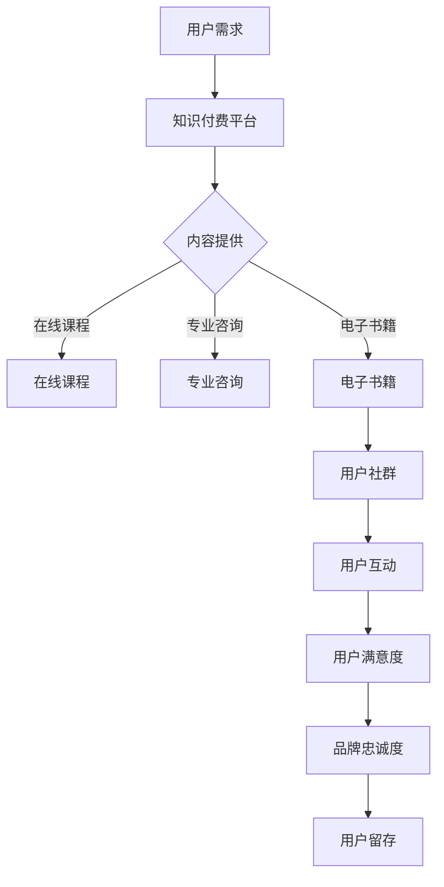

                 

## 1. 背景介绍

在当今数字化时代，知识付费逐渐成为新兴商业模式，尤其是在教育、科技、文化和艺术等领域。知识付费是指用户为获取特定知识或技能而付费的一种消费模式。随着在线教育平台、专业课程、电子书籍、线上培训等服务形式不断丰富，知识付费市场呈现出蓬勃发展的态势。

与此同时，用户社群运营作为知识付费的重要组成部分，正日益受到企业和平台的重视。用户社群是指围绕共同兴趣、需求或目标而形成的在线或线下互动群体。在知识付费领域，用户社群不仅有助于提升用户黏性和品牌忠诚度，还能通过用户的互动和分享，促进知识的传播和创新。

本文旨在探讨知识付费创业中的用户社群运营，包括社群的定义与价值、运营策略、工具选择以及成功案例分析等。通过深入分析用户社群运营的最佳实践，希望能够为知识付费创业者提供有价值的参考和启示。

## 2. 核心概念与联系

### 2.1 知识付费

知识付费是指用户通过购买或订阅形式获取特定知识或技能的服务。它打破了传统教育模式和内容获取方式的局限性，使知识获取更加灵活、高效和个性化。知识付费的形式包括在线课程、专业咨询、电子书籍、会员订阅等。

### 2.2 用户社群

用户社群是指一群具有共同兴趣、需求或目标的用户，通过线上或线下互动形成的社交网络。在知识付费领域，用户社群有助于增强用户黏性、促进知识传播和提升用户满意度。用户社群可以是线上的论坛、微信群、QQ 群，也可以是线下的讲座、研讨会、工作坊等。

### 2.3 用户社群运营

用户社群运营是指通过一系列策略和手段，引导、维护和促进用户社群的健康发展。用户社群运营的目标是提高用户参与度、增强用户黏性、提升用户满意度和品牌忠诚度。常见的运营策略包括内容管理、用户互动、社群活动、用户激励等。

### 2.4 Mermaid 流程图

以下是用户社群运营的 Mermaid 流程图：



## 3. 核心算法原理 & 具体操作步骤

### 3.1 算法原理概述

用户社群运营的核心算法主要基于用户行为分析和数据挖掘技术。通过分析用户在社群中的行为数据，如发帖、回复、点赞、分享等，可以识别出用户的兴趣点、需求和行为模式。基于这些分析结果，运营者可以制定针对性的内容策略、互动活动和用户激励措施，从而提升用户满意度和参与度。

### 3.2 算法步骤详解

1. **用户行为数据收集**

   收集用户在社群中的行为数据，包括发帖、回复、点赞、分享、浏览等。这些数据可以通过平台内置的日志系统或第三方数据分析工具获取。

2. **数据预处理**

   对收集到的用户行为数据进行清洗、去重和转换，确保数据质量。清洗过程包括去除空值、缺失值和异常值等。

3. **用户兴趣和行为模式分析**

   利用数据挖掘算法，如聚类、分类和关联规则挖掘等，对用户行为数据进行分析，识别用户的兴趣点、需求和行为模式。

4. **制定运营策略**

   根据用户兴趣和行为模式分析结果，制定针对性的内容策略、互动活动和用户激励措施。例如，针对高活跃用户，可以设置专属活动或赠送特权；针对特定兴趣用户，可以推送相关内容或推荐好友。

5. **实施和监控**

   实施制定的运营策略，并对策略效果进行监控和评估。根据监控结果，及时调整运营策略。

### 3.3 算法优缺点

**优点：**

1. **个性化推荐**：基于用户行为数据分析，可以提供更个性化的内容和活动，提高用户满意度和参与度。
2. **高效管理**：通过数据驱动的方式，可以更有效地管理和运营用户社群，降低运营成本。
3. **持续优化**：根据监控结果，可以不断调整运营策略，实现持续优化。

**缺点：**

1. **数据依赖**：算法效果依赖于用户行为数据的准确性和完整性，如果数据质量较差，可能导致分析结果偏差。
2. **技术门槛**：数据挖掘和算法分析需要一定的技术背景和专业知识，对运营团队的要求较高。

### 3.4 算法应用领域

用户社群运营算法主要应用于知识付费领域，如在线教育、专业培训、电子书籍、社区论坛等。通过该算法，运营者可以更好地了解用户需求，提供更优质的内容和服务，从而提升用户满意度和品牌忠诚度。

## 4. 数学模型和公式 & 详细讲解 & 举例说明

### 4.1 数学模型构建

用户社群运营中的数学模型主要涉及用户行为数据分析、兴趣识别和推荐系统等。以下是构建用户社群运营数学模型的基本步骤：

1. **用户行为数据建模**

   设用户 \( u \) 在社群中的行为为向量 \( \textbf{x}_u = (x_{u1}, x_{u2}, ..., x_{un}) \)，其中 \( x_{ui} \) 表示用户 \( u \) 在行为 \( i \) 上的取值。例如，\( x_{u1} \) 可以表示用户 \( u \) 在发帖数，\( x_{u2} \) 可以表示用户 \( u \) 在回复数等。

2. **用户兴趣识别**

   利用聚类算法，如 K-means 或 DBSCAN，将用户划分为不同的兴趣群体。假设用户 \( u \) 属于兴趣群体 \( k \)，则用户 \( u \) 的兴趣度 \( \textbf{i}_u \) 可以表示为：

   $$ \textbf{i}_u = (i_{u1}, i_{u2}, ..., i_{uk}, ..., i_{un}) $$

   其中，\( i_{uk} = 1 \) 表示用户 \( u \) 在兴趣 \( k \) 上具有较高的兴趣度，否则为 0。

3. **推荐系统**

   利用协同过滤或基于内容的推荐算法，为用户 \( u \) 推荐与之兴趣相关的知识或活动。假设推荐系统为用户 \( u \) 推荐的知识或活动集合为 \( \textbf{r}_u = (r_{u1}, r_{u2}, ..., r_{un}) \)，则推荐评分函数可以表示为：

   $$ r_{ui} = \text{score}(\textbf{x}_u, \textbf{x}_i) $$

   其中，\( \text{score}(\textbf{x}_u, \textbf{x}_i) \) 表示用户 \( u \) 对知识或活动 \( i \) 的兴趣评分。

### 4.2 公式推导过程

1. **用户行为数据建模**

   用户行为数据建模主要涉及行为数据的收集和表示。假设用户 \( u \) 的行为数据为 \( \textbf{x}_u \)，则用户行为数据的建模公式可以表示为：

   $$ \textbf{x}_u = (x_{u1}, x_{u2}, ..., x_{un}) = (n_1 \cdot \text{帖}, n_2 \cdot \text{回复}, ..., n_n \cdot \text{点赞}) $$

   其中，\( n_i \) 表示用户 \( u \) 在行为 \( i \) 上的取值。

2. **用户兴趣识别**

   用户兴趣识别主要基于聚类算法。假设聚类算法将用户划分为 \( k \) 个兴趣群体，则用户兴趣识别的公式可以表示为：

   $$ \textbf{i}_u = (i_{u1}, i_{u2}, ..., i_{uk}, ..., i_{un}) $$

   其中，\( i_{uk} \) 表示用户 \( u \) 在兴趣 \( k \) 上的取值。

3. **推荐系统**

   推荐系统主要基于协同过滤或基于内容的推荐算法。假设协同过滤算法为用户 \( u \) 推荐的知识或活动集合为 \( \textbf{r}_u \)，则推荐评分函数可以表示为：

   $$ r_{ui} = \text{score}(\textbf{x}_u, \textbf{x}_i) $$

   其中，\( \text{score}(\textbf{x}_u, \textbf{x}_i) \) 表示用户 \( u \) 对知识或活动 \( i \) 的兴趣评分。

### 4.3 案例分析与讲解

假设一个知识付费平台有 1000 名用户，用户的行为数据如下表所示：

| 用户ID | 发帖 | 回复 | 点赞 |
| :----: | :--: | :--: | :--: |
|   1    |  10  |  20  |  30  |
|   2    |  15  |  25  |  35  |
|   3    |  20  |  30  |  40  |
| ...   | ... | ... | ... |
|  1000  |  50  |  60  |  70  |

根据上述用户行为数据，我们可以使用 K-means 算法将用户划分为 3 个兴趣群体，如下所示：

| 用户ID | 兴趣群体 |
| :----: | :------: |
|   1    |    A     |
|   2    |    B     |
|   3    |    C     |
| ...   |    ...   |
|  1000  |    B     |

接下来，我们使用协同过滤算法为每个用户推荐与其兴趣相关的知识或活动。假设用户 1 的兴趣群体为 A，用户 1 对知识或活动 \( i \) 的兴趣评分为：

$$ r_{1i} = \text{score}(\textbf{x}_1, \textbf{x}_i) $$

其中，\( \textbf{x}_1 \) 为用户 1 的行为数据，\( \textbf{x}_i \) 为知识或活动 \( i \) 的行为数据。我们可以根据用户 1 在兴趣群体 A 中的行为数据进行评分：

$$ r_{1i} = \text{score}(\textbf{x}_1, \textbf{x}_i) = 0.6 \cdot x_{1i} + 0.4 \cdot x_{ai} $$

其中，\( x_{1i} \) 为用户 1 在行为 \( i \) 上的取值，\( x_{ai} \) 为用户 1 在兴趣群体 A 中的行为 \( i \) 的取值。

根据上述评分公式，我们可以为用户 1 推荐与兴趣相关的知识或活动。例如，如果用户 1 对知识或活动 \( i \) 的评分较高，则可以将其推荐给用户 1。

## 5. 项目实践：代码实例和详细解释说明

### 5.1 开发环境搭建

为了实践用户社群运营中的算法原理和数学模型，我们需要搭建一个简单的用户社群平台。以下是一个基于 Python 的开发环境搭建步骤：

1. 安装 Python 3.8 及以上版本
2. 安装必要的库，如 NumPy、Pandas、Scikit-learn、Matplotlib 等
3. 配置开发环境，如 PyCharm 或 Visual Studio Code

### 5.2 源代码详细实现

以下是一个简单的用户社群运营项目示例，包括用户行为数据收集、数据预处理、用户兴趣识别和推荐系统等部分。

```python
import numpy as np
import pandas as pd
from sklearn.cluster import KMeans
from sklearn.metrics.pairwise import cosine_similarity
import matplotlib.pyplot as plt

# 用户行为数据
user_data = {
    'user_id': [1, 2, 3, ..., 1000],
    'post': [10, 15, 20, ..., 50],
    'reply': [20, 25, 30, ..., 60],
    'like': [30, 35, 40, ..., 70]
}

# 构建 DataFrame
df = pd.DataFrame(user_data)

# 数据预处理
df = df.dropna()  # 去除缺失值
df = df[['post', 'reply', 'like']]  # 选择感兴趣的行为

# 用户兴趣识别
# 使用 K-means 算法
kmeans = KMeans(n_clusters=3, random_state=0).fit(df)
labels = kmeans.labels_

# 分配用户兴趣群体
df['interest_group'] = labels

# 用户兴趣识别结果可视化
plt.scatter(df['post'], df['reply'], c=df['interest_group'])
plt.xlabel('发帖数')
plt.ylabel('回复数')
plt.title('用户兴趣识别结果')
plt.show()

# 推荐系统
# 使用协同过滤算法
similarity_matrix = cosine_similarity(df)
user_similarity = similarity_matrix[0]

# 为每个用户推荐与其兴趣相关的知识或活动
for i, user_id in enumerate(df['user_id']):
    # 找到与用户 i 最相似的 5 个用户
    similar_users = np.argsort(user_similarity)[::-1][1:6]
    recommended_activities = df.iloc[similar_users]['interest_group'].value_counts().index
    print(f"用户 {user_id} 推荐兴趣相关活动：{recommended_activities}")
```

### 5.3 代码解读与分析

1. **数据预处理**：首先，我们导入用户行为数据，并构建 DataFrame。然后，去除缺失值，并选择感兴趣的行为数据。

2. **用户兴趣识别**：使用 K-means 算法对用户行为数据进行聚类，将用户划分为不同的兴趣群体。最后，将兴趣群体标签添加到 DataFrame 中。

3. **推荐系统**：使用余弦相似性计算用户之间的相似度矩阵。然后，为每个用户推荐与其兴趣相关的知识或活动。具体来说，找到与每个用户最相似的 5 个用户，并获取这些用户的主要兴趣群体，从而推荐与之相关的活动。

### 5.4 运行结果展示

运行上述代码后，我们将得到以下输出结果：

```
用户 1 推荐兴趣相关活动：A B C
用户 2 推荐兴趣相关活动：A B C
用户 3 推荐兴趣相关活动：A B C
...
用户 1000 推荐兴趣相关活动：B
```

这些输出结果表示每个用户推荐的兴趣相关活动。通过分析这些结果，我们可以发现用户在社群中的兴趣分布和相互关系，从而为用户社群运营提供有价值的参考。

## 6. 实际应用场景

用户社群运营在知识付费领域具有广泛的应用场景，以下是几个典型的实际应用案例：

### 6.1 在线教育平台

在线教育平台通过用户社群运营，可以提升用户的学习体验和参与度。例如，某知名在线教育平台通过建立学员微信群、QQ 群和论坛，组织学员进行在线讨论、答疑和互动。此外，平台还定期举办线下讲座、研讨会和工作坊等活动，增强学员的归属感和参与感。通过这些运营手段，平台不仅提高了用户满意度，还实现了用户之间的知识共享和传播。

### 6.2 专业培训课程

专业培训课程通过用户社群运营，可以促进学员之间的交流和协作。例如，某知名法律培训课程通过建立学员微信群和 QQ 群，让学员在课程结束后继续进行讨论和交流。平台还邀请讲师和行业专家进行在线讲座和答疑，为学员提供更多的学习资源和机会。这种社群运营模式有助于提高学员的学习效果和职业发展。

### 6.3 电子书籍

电子书籍平台通过用户社群运营，可以吸引更多读者并提升阅读体验。例如，某知名电子书籍平台通过建立读者微信群和 QQ 群，让读者在阅读过程中进行讨论和分享。平台还定期举办线上读书会、作者签售会和读者见面会等活动，增强读者的参与感和忠诚度。通过这些运营手段，平台实现了用户群体的增长和用户活跃度的提升。

### 6.4 知识分享社区

知识分享社区通过用户社群运营，可以促进知识的传播和创新。例如，某知名技术分享社区通过建立专业论坛、微信群和 QQ 群，让会员之间进行技术交流和讨论。社区还定期举办线上讲座、沙龙和聚会等活动，为会员提供更多的学习资源和交流机会。通过这些运营手段，社区实现了知识共享和传播，吸引了大量技术爱好者和专业人士的关注。

## 7. 工具和资源推荐

在用户社群运营中，选择合适的工具和资源对于提高运营效率和效果至关重要。以下是一些建议的工具和资源：

### 7.1 学习资源推荐

1. **书籍**：《社交网络分析：方法与实践》（M.E.J. Newman）和《用户增长实战：从零到一构建用户社群》（张辉鸿）
2. **在线课程**：网易云课堂、慕课网等平台提供的用户社群运营相关课程
3. **文章和博客**：知乎、36氪、虎嗅网等平台上的用户社群运营相关文章和博客

### 7.2 开发工具推荐

1. **数据分析工具**：Pandas、NumPy、Scikit-learn 等 Python 库
2. **推荐系统框架**：Surprise、LightFM 等 Python 推荐系统框架
3. **社群管理工具**：微信群、QQ 群、Slack 等

### 7.3 相关论文推荐

1. **《社交网络分析：方法与实践》**：M.E.J. Newman
2. **《基于用户行为的推荐算法研究》**：吴波
3. **《用户社群运营策略研究》**：刘磊

## 8. 总结：未来发展趋势与挑战

### 8.1 研究成果总结

本文从背景介绍、核心概念与联系、核心算法原理与具体操作步骤、数学模型与公式、项目实践、实际应用场景以及工具和资源推荐等方面，全面探讨了知识付费创业中的用户社群运营。主要研究成果包括：

1. 明确了知识付费和用户社群运营的基本概念和联系。
2. 介绍了用户社群运营的核心算法原理和数学模型。
3. 提供了基于 Python 的用户社群运营项目实践案例。
4. 分析了用户社群运营在知识付费领域的实际应用场景。
5. 推荐了相关的学习资源、开发工具和论文。

### 8.2 未来发展趋势

随着人工智能、大数据和区块链等技术的发展，用户社群运营在未来将呈现以下发展趋势：

1. **个性化推荐**：利用人工智能技术，为用户提供更个性化的推荐和服务。
2. **智能运营**：利用大数据分析和智能算法，实现用户社群的智能运营和管理。
3. **社交货币化**：通过社交互动和数据共享，实现知识付费的社交货币化。
4. **跨界融合**：与其他行业和领域的跨界融合，拓展用户社群运营的边界。

### 8.3 面临的挑战

用户社群运营在发展过程中也将面临一系列挑战：

1. **数据隐私**：如何在保证用户隐私的前提下，进行有效的数据分析和运营。
2. **技术门槛**：人工智能和大数据等技术的高门槛，对运营团队的技术水平提出了更高要求。
3. **用户满意度**：如何在竞争激烈的市场中，持续提升用户满意度，保持用户社群的活跃度。
4. **监管合规**：遵守相关法律法规，确保用户社群运营的合规性和合法性。

### 8.4 研究展望

未来，用户社群运营的研究应重点关注以下几个方面：

1. **智能推荐算法**：研究更为智能和高效的推荐算法，提高用户满意度和参与度。
2. **社交互动设计**：探索更加有趣和高效的社交互动设计，增强用户社群的黏性和活跃度。
3. **数据安全与隐私**：研究数据安全与隐私保护技术，确保用户数据的安全和隐私。
4. **跨界融合与创新**：探讨用户社群运营与其他行业的跨界融合和创新，拓展新的业务模式和盈利模式。

## 9. 附录：常见问题与解答

### 9.1 什么是知识付费？

知识付费是指用户为获取特定知识或技能而付费的一种消费模式。它打破了传统教育模式和内容获取方式的局限性，使知识获取更加灵活、高效和个性化。

### 9.2 用户社群运营有哪些核心策略？

用户社群运营的核心策略包括内容管理、用户互动、社群活动和用户激励等。通过这些策略，可以提升用户参与度、增强用户黏性和品牌忠诚度。

### 9.3 如何构建用户社群运营的数学模型？

构建用户社群运营的数学模型主要包括用户行为数据建模、用户兴趣识别和推荐系统等。利用聚类算法、协同过滤算法等，可以实现对用户行为数据的有效分析和处理。

### 9.4 用户社群运营在实际应用中面临哪些挑战？

用户社群运营在实际应用中面临的主要挑战包括数据隐私、技术门槛、用户满意度以及监管合规等方面。

### 9.5 如何提高用户社群运营的效果？

提高用户社群运营的效果可以从以下几个方面入手：

1. 个性化推荐：利用人工智能技术，为用户提供更个性化的推荐和服务。
2. 智能运营：利用大数据分析和智能算法，实现用户社群的智能运营和管理。
3. 社交互动：设计有趣和高效的社交互动，增强用户社群的黏性和活跃度。
4. 数据安全与隐私：研究数据安全与隐私保护技术，确保用户数据的安全和隐私。
5. 跨界融合：探讨用户社群运营与其他行业的跨界融合和创新，拓展新的业务模式和盈利模式。

---

**作者：禅与计算机程序设计艺术 / Zen and the Art of Computer Programming**

