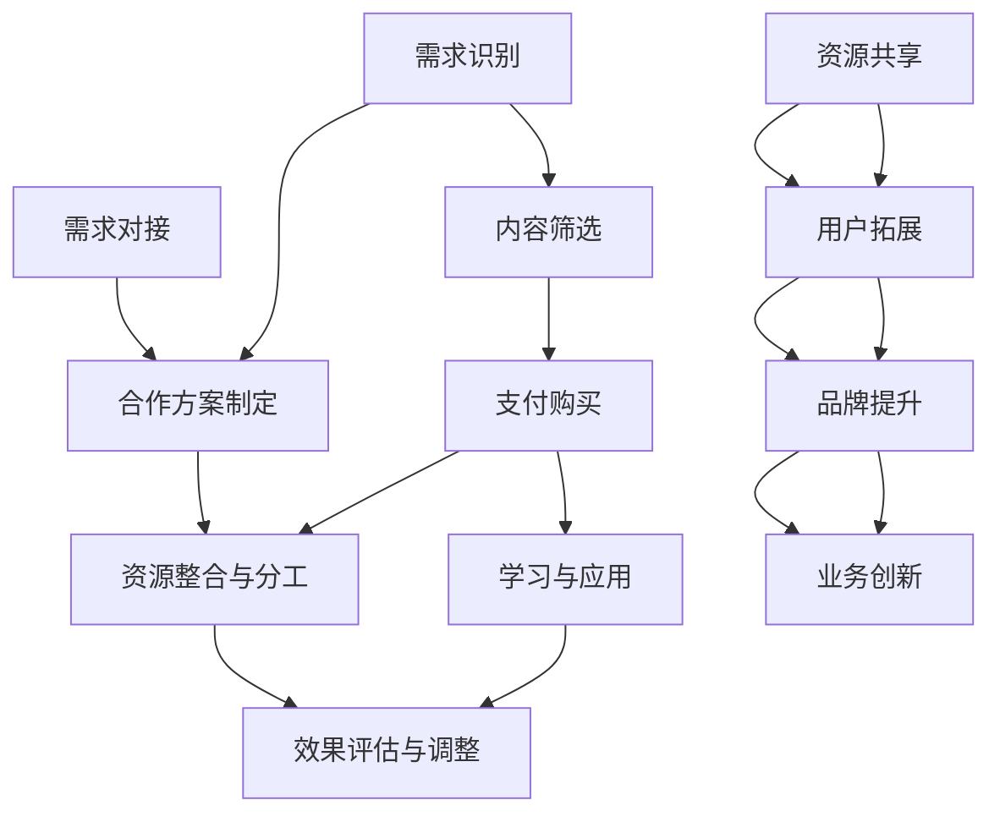

                 

### 1. 背景介绍

在当今快速变化的经济环境中，知识付费行业迅速崛起，吸引了大量创业者和投资者的关注。知识付费，顾名思义，是用户为获取专业知识和技能而支付的费用。这种模式打破了传统教育体系的垄断，让个体内容创作者能够通过平台将知识变现，实现价值交换。

知识付费行业的快速增长，源于以下几个方面：

1. **在线学习的普及**：随着互联网技术的不断进步，在线学习平台如雨后春笋般涌现，使得人们可以随时随地进行学习。这种便捷性满足了现代人对知识获取的迫切需求。

2. **知识价值的认可**：在信息爆炸的时代，专业知识变得愈发重要。企业和个人为了在竞争激烈的环境中脱颖而出，愿意为高质量的知识内容付费。

3. **个性化需求的满足**：知识付费平台能够根据用户的需求推荐个性化的学习内容，提高了用户的学习体验和效果。

然而，知识付费行业也面临一些挑战，如内容质量参差不齐、版权问题、用户留存率等。为了应对这些挑战，跨界合作成为一种新的发展趋势。

跨界合作，是指不同领域的企业、组织或个人之间，通过资源共享、优势互补、风险共担等方式，共同开展业务或合作项目。在知识付费领域，跨界合作具有以下几个显著特点：

1. **资源整合**：通过跨界合作，知识付费平台可以整合不同领域的资源，提供更全面、更深入的内容。

2. **提高品牌影响力**：跨界合作可以带来新的用户群体，提高品牌的认知度和影响力。

3. **降低运营风险**：跨界合作可以将风险分散，降低单一领域市场波动带来的影响。

4. **创新商业模式**：跨界合作可以促进新商业模式的探索，为知识付费行业带来新的增长点。

### 2. 核心概念与联系

#### 2.1 知识付费模式

知识付费模式是指用户通过支付一定费用，获取专业知识和技能的过程。这个过程可以分为以下几个阶段：

1. **需求识别**：用户在平台上识别到所需的知识内容。
2. **内容筛选**：用户根据平台推荐和个人偏好，筛选出合适的知识内容。
3. **支付购买**：用户支付费用，获取知识内容。
4. **学习与应用**：用户学习知识内容，并将其应用于实际工作中。


#### 2.2 跨界合作模式

跨界合作模式是指不同领域的主体之间，通过合作实现共同目标的过程。这个过程可以分为以下几个阶段：

1. **需求对接**：各合作方识别到合作需求，进行初步对接。
2. **合作方案制定**：合作方根据需求和资源，制定合作方案。
3. **资源整合与分工**：合作方整合各自资源，明确分工，开始执行。
4. **效果评估与调整**：合作方评估合作效果，根据实际情况进行调整。


#### 2.3 两者之间的联系

知识付费模式和跨界合作模式之间存在紧密的联系。知识付费模式为跨界合作提供了新的业务场景，而跨界合作则为知识付费模式提供了更多的可能性。

1. **资源共享**：知识付费平台可以通过跨界合作，获取更多领域的内容资源，提高内容丰富度和质量。
2. **用户拓展**：跨界合作可以吸引更多领域的用户，扩大用户群体。
3. **品牌提升**：跨界合作可以提升知识付费平台在相关领域的品牌影响力。
4. **业务创新**：跨界合作可以促进知识付费模式的创新，探索新的商业模式。

#### 2.4 Mermaid 流程图

以下是一个简化的 Mermaid 流程图，展示了知识付费模式和跨界合作模式之间的联系：



### 3. 核心算法原理 & 具体操作步骤

#### 3.1 跨界合作的算法原理

跨界合作的算法原理主要基于以下几个方面：

1. **需求匹配**：通过算法匹配各方的需求，找到合适的合作机会。
2. **资源评估**：评估各方的资源，确定合作的内容和形式。
3. **风险评估**：分析合作可能面临的风险，制定风险应对策略。
4. **效果评估**：合作过程中，实时评估效果，调整合作策略。

#### 3.2 具体操作步骤

1. **需求识别**：首先，知识付费平台需要识别到跨界合作的需求，这可能来自用户反馈、市场调研或内部战略规划。

2. **合作伙伴筛选**：根据需求，平台需要筛选潜在的合作伙伴。这个过程可以通过以下步骤完成：

   - **资源分析**：分析各合作方的资源，包括内容资源、技术资源、市场资源等。
   - **能力评估**：评估合作方的能力，包括内容创作能力、技术开发能力、市场运营能力等。
   - **合作潜力**：评估合作双方的合作潜力，包括合作意愿、长期发展潜力等。

3. **合作方案制定**：在确定合作伙伴后，双方需要制定合作方案。这个过程包括：

   - **合作目标**：明确合作的目标，包括内容创作、市场推广、用户增长等。
   - **内容规划**：规划合作内容，包括课程内容、文章、视频等。
   - **资源分配**：明确各方的资源投入，包括人力、物力、财力等。
   - **时间表**：制定合作的时间表，包括合作启动、内容创作、推广、效果评估等。

4. **风险评估与应对**：在合作过程中，双方需要不断评估合作效果，并制定风险应对策略。这个过程包括：

   - **效果监测**：实时监测合作效果，包括内容质量、用户反馈、市场表现等。
   - **风险识别**：识别可能的风险，包括技术风险、市场风险、法律风险等。
   - **风险应对**：制定风险应对策略，包括调整合作方案、增加资源投入、寻求外部支持等。

5. **合作效果评估与调整**：合作结束后，双方需要评估合作效果，并根据评估结果调整合作策略。这个过程包括：

   - **效果分析**：分析合作效果，包括内容质量、用户满意度、市场表现等。
   - **经验总结**：总结合作过程中的经验和教训，为未来的合作提供参考。
   - **策略调整**：根据评估结果，调整合作策略，包括内容创作、市场推广、用户增长等。

### 4. 数学模型和公式 & 详细讲解 & 举例说明

在跨界合作中，数学模型和公式可以帮助我们更好地理解和评估合作的效果。以下是一些常用的数学模型和公式：

#### 4.1 效益评估模型

假设跨界合作带来的效益为 \( E \)，合作双方的投资分别为 \( C_1 \) 和 \( C_2 \)，则效益评估模型可以表示为：

\[ E = f(C_1, C_2) \]

其中，\( f \) 是一个函数，表示效益与投资之间的关系。常见的函数形式包括线性函数、二次函数等。

**例子**：假设两家公司 \( A \) 和 \( B \) 进行跨界合作，\( A \) 的投资为 10 万元，\( B \) 的投资为 20 万元，效益函数为线性函数，即 \( E = C_1 + C_2 \)。则合作带来的总效益为：

\[ E = 10 + 20 = 30 \] 万元

#### 4.2 风险评估模型

假设跨界合作面临的风险为 \( R \)，合作双方的风险承受能力分别为 \( R_1 \) 和 \( R_2 \)，则风险评估模型可以表示为：

\[ R = g(R_1, R_2) \]

其中，\( g \) 是一个函数，表示风险与风险承受能力之间的关系。常见的函数形式包括线性函数、指数函数等。

**例子**：假设两家公司 \( A \) 和 \( B \) 的风险承受能力分别为 5 万元和 10 万元，风险函数为线性函数，即 \( R = R_1 + R_2 \)。则合作面临的总风险为：

\[ R = 5 + 10 = 15 \] 万元

#### 4.3 效益与风险平衡模型

为了平衡效益与风险，我们可以使用效益与风险平衡模型：

\[ E = kR \]

其中，\( k \) 是一个常数，表示效益与风险的平衡系数。通过调整 \( k \) 的值，可以找到最佳的效益与风险平衡点。

**例子**：假设两家公司 \( A \) 和 \( B \) 的平衡系数 \( k \) 为 2，效益与风险平衡模型为 \( E = 2R \)。则当合作面临 15 万元的风险时，应达到的效益为：

\[ E = 2 \times 15 = 30 \] 万元

### 5. 项目实践：代码实例和详细解释说明

#### 5.1 开发环境搭建

为了更好地理解跨界合作在知识付费领域的应用，我们以一个实际项目为例，该项目涉及两个领域的跨界合作：在线教育平台和智能推荐系统。

首先，我们需要搭建项目的开发环境。以下是所需的技术栈：

- **前端**：HTML、CSS、JavaScript（React 或 Vue）
- **后端**：Node.js、Express
- **数据库**：MongoDB
- **推荐系统**：基于机器学习的推荐算法（如协同过滤）

#### 5.2 源代码详细实现

以下是项目的核心代码，包括前端、后端和推荐系统的实现。

**5.2.1 前端实现**

前端主要负责展示知识内容、用户交互和推荐系统。以下是一个简单的 React 组件示例：

```jsx
import React, { useState, useEffect } from 'react';
import axios from 'axios';

const KnowledgeFeed = () => {
  const [knowledgeList, setKnowledgeList] = useState([]);

  useEffect(() => {
    const fetchKnowledge = async () => {
      try {
        const response = await axios.get('/api/knowledge');
        setKnowledgeList(response.data);
      } catch (error) {
        console.error('Error fetching knowledge:', error);
      }
    };

    fetchKnowledge();
  }, []);

  return (
    <div>
      {knowledgeList.map((knowledge) => (
        <div key={knowledge._id}>
          <h3>{knowledge.title}</h3>
          <p>{knowledge.description}</p>
          <button>Buy Now</button>
        </div>
      ))}
    </div>
  );
};

export default KnowledgeFeed;
```

**5.2.2 后端实现**

后端主要负责处理用户请求、存储知识内容和管理推荐系统。以下是一个简单的 Express 服务器示例：

```javascript
const express = require('express');
const mongoose = require('mongoose');
const KnowledgeController = require('./controllers/KnowledgeController');
const RecommendationController = require('./controllers/RecommendationController');

const app = express();
app.use(express.json());

// Connect to MongoDB
mongoose.connect('mongodb://localhost:27017/knowledge платформа', {
  useNewUrlParser: true,
  useUnifiedTopology: true,
});

// Routes
app.get('/api/knowledge', KnowledgeController.fetchKnowledge);
app.post('/api/knowledge', KnowledgeController.createKnowledge);
app.delete('/api/knowledge/:id', KnowledgeController.deleteKnowledge);
app.get('/api/recommendation', RecommendationController.fetchRecommendation);

const PORT = process.env.PORT || 3000;
app.listen(PORT, () => {
  console.log(`Server is running on port ${PORT}`);
});
```

**5.2.3 推荐系统实现**

推荐系统基于协同过滤算法，通过分析用户行为和知识内容的相似度，为用户推荐感兴趣的知识内容。以下是一个简单的协同过滤算法实现：

```javascript
const recommend = async (userHistory, allUsersHistory) => {
  // Calculate similarity scores for each user
  const similarityScores = {};

  for (const userId in allUsersHistory) {
    if (userId === userHistory._id) continue;

    similarityScores[userId] = 0;
    const user1History = userHistory.history;
    const user2History = allUsersHistory[userId].history;

    for (const item of user1History) {
      const item1 = item._id;
      for (const item of user2History) {
        const item2 = item._id;

        if (item1 === item2) {
          similarityScores[userId]++;
        }
      }
    }
  }

  // Calculate average similarity score
  const averageSimilarity = Object.values(similarityScores).reduce((acc, val) => acc + val, 0) / Object.keys(similarityScores).length;

  // Recommend knowledge based on similarity scores
  const recommendations = {};

  for (const userId in allUsersHistory) {
    if (userId === userHistory._id) continue;

    const similarityScore = similarityScores[userId];
    if (similarityScore > averageSimilarity) {
      recommendations[userId] = allUsersHistory[userId].knowledge;
    }
  }

  return recommendations;
};
```

#### 5.3 代码解读与分析

**5.3.1 前端代码解读**

前端代码主要负责展示知识内容列表，并为用户提供购买按钮。关键代码如下：

```jsx
import React, { useState, useEffect } from 'react';
import axios from 'axios';

const KnowledgeFeed = () => {
  const [knowledgeList, setKnowledgeList] = useState([]);

  useEffect(() => {
    const fetchKnowledge = async () => {
      try {
        const response = await axios.get('/api/knowledge');
        setKnowledgeList(response.data);
      } catch (error) {
        console.error('Error fetching knowledge:', error);
      }
    };

    fetchKnowledge();
  }, []);

  return (
    <div>
      {knowledgeList.map((knowledge) => (
        <div key={knowledge._id}>
          <h3>{knowledge.title}</h3>
          <p>{knowledge.description}</p>
          <button>Buy Now</button>
        </div>
      ))}
    </div>
  );
};

export default KnowledgeFeed;
```

这段代码使用了 React 的 Hook 功能，通过 `useState` 和 `useEffect` 实现了知识内容列表的获取和展示。关键步骤包括：

1. **状态初始化**：使用 `useState` 创建 `knowledgeList` 状态，用于存储知识内容列表。
2. **效果处理**：使用 `useEffect` 实现知识内容列表的获取。当组件加载时，触发 `fetchKnowledge` 函数，通过 axios 获取知识内容列表，并将结果更新到 `knowledgeList` 状态。
3. **渲染**：使用 `.map()` 方法遍历 `knowledgeList`，为每个知识内容创建一个 `<div>` 元素，并展示其标题、描述和购买按钮。

**5.3.2 后端代码解读**

后端代码主要负责处理用户请求、存储知识内容和管理推荐系统。关键代码如下：

```javascript
const express = require('express');
const mongoose = require('mongoose');
const KnowledgeController = require('./controllers/KnowledgeController');
const RecommendationController = require('./controllers/RecommendationController');

const app = express();
app.use(express.json());

// Connect to MongoDB
mongoose.connect('mongodb://localhost:27017/knowledge платформа', {
  useNewUrlParser: true,
  useUnifiedTopology: true,
});

// Routes
app.get('/api/knowledge', KnowledgeController.fetchKnowledge);
app.post('/api/knowledge', KnowledgeController.createKnowledge);
app.delete('/api/knowledge/:id', KnowledgeController.deleteKnowledge);
app.get('/api/recommendation', RecommendationController.fetchRecommendation);

const PORT = process.env.PORT || 3000;
app.listen(PORT, () => {
  console.log(`Server is running on port ${PORT}`);
});
```

这段代码使用了 Express 框架创建了一个 Web 服务器。关键步骤包括：

1. **连接 MongoDB**：使用 mongoose 连接 MongoDB 数据库，配置连接选项。
2. **定义路由**：定义了四个 API 路由，分别对应获取知识内容、创建知识内容、删除知识内容和获取推荐列表的操作。
3. **启动服务器**：在指定端口（默认为 3000）启动 Express 服务器。

**5.3.3 推荐系统代码解读**

推荐系统基于协同过滤算法，通过分析用户行为和知识内容的相似度，为用户推荐感兴趣的知识内容。关键代码如下：

```javascript
const recommend = async (userHistory, allUsersHistory) => {
  // Calculate similarity scores for each user
  const similarityScores = {};

  for (const userId in allUsersHistory) {
    if (userId === userHistory._id) continue;

    similarityScores[userId] = 0;
    const user1History = userHistory.history;
    const user2History = allUsersHistory[userId].history;

    for (const item of user1History) {
      const item1 = item._id;
      for (const item of user2History) {
        const item2 = item._id;

        if (item1 === item2) {
          similarityScores[userId]++;
        }
      }
    }
  }

  // Calculate average similarity score
  const averageSimilarity = Object.values(similarityScores).reduce((acc, val) => acc + val, 0) / Object.keys(similarityScores).length;

  // Recommend knowledge based on similarity scores
  const recommendations = {};

  for (const userId in allUsersHistory) {
    if (userId === userHistory._id) continue;

    const similarityScore = similarityScores[userId];
    if (similarityScore > averageSimilarity) {
      recommendations[userId] = allUsersHistory[userId].knowledge;
    }
  }

  return recommendations;
};
```

这段代码实现了协同过滤算法的核心逻辑：

1. **计算相似度分数**：遍历所有用户历史记录，计算用户之间的相似度分数。
2. **计算平均相似度分数**：计算所有相似度分数的平均值。
3. **生成推荐列表**：根据相似度分数为用户生成推荐列表。

#### 5.4 运行结果展示

在本地开发环境中，我们可以使用浏览器或 API 工具（如 Postman）测试项目的运行结果。以下是一个简单的测试流程：

1. **获取知识内容列表**：在浏览器中访问 `http://localhost:3000/api/knowledge`，或使用 Postman 发送 GET 请求，可以获取当前平台上的所有知识内容。

2. **创建知识内容**：在 Postman 中发送 POST 请求到 `http://localhost:3000/api/knowledge`，携带必要的字段（如 title、description 等），可以创建一个新的知识内容。

3. **删除知识内容**：在 Postman 中发送 DELETE 请求到 `http://localhost:3000/api/knowledge/:id`，将 `:id` 替换为具体的知识内容 ID，可以删除指定的知识内容。

4. **获取推荐列表**：在 Postman 中发送 GET 请求到 `http://localhost:3000/api/recommendation`，可以获取当前用户基于协同过滤算法生成的推荐列表。

### 6. 实际应用场景

#### 6.1 在线教育行业

在线教育行业是知识付费领域的一个重要分支。通过跨界合作，在线教育平台可以整合更多优质的教育资源，提高用户体验。以下是一些实际应用场景：

1. **名师合作**：在线教育平台可以与知名教育机构和名师合作，提供高质量的课程内容。
2. **技术整合**：与科技公司合作，引入人工智能技术，实现智能推荐、在线互动等功能。
3. **内容多样化**：与出版社、媒体合作，提供电子书籍、音频课程等多媒体内容。

#### 6.2 企业培训

企业培训是知识付费行业的另一个重要领域。以下是一些实际应用场景：

1. **定制化培训**：与咨询公司、培训机构合作，为企业提供定制化的培训方案。
2. **技术培训**：与科技公司合作，提供最新技术的培训课程，帮助企业提升技术能力。
3. **文化培训**：与文化机构合作，提供企业文化建设、团队建设等方面的培训。

#### 6.3 专业技能培训

专业技能培训是知识付费领域的细分市场，包括编程、设计、营销等多个领域。以下是一些实际应用场景：

1. **课程合作**：与专业培训机构合作，提供专业认证课程。
2. **导师制**：与行业专家合作，提供一对一的导师辅导服务。
3. **线上实践**：与科技公司合作，提供线上实践项目，帮助学生将理论知识应用到实际工作中。

### 7. 工具和资源推荐

#### 7.1 学习资源推荐

1. **书籍**：
   - 《深度学习》（Ian Goodfellow、Yoshua Bengio、Aaron Courville 著）
   - 《Python编程：从入门到实践》（埃里克·马瑟斯 著）
   - 《影响力：说服的心理学》（罗伯特·西奥迪尼 著）

2. **论文**：
   - 《协同过滤算法综述》（杨强、李航 著）
   - 《在线教育模式研究》（李琳 著）
   - 《知识付费行业发展报告》（中国电子商务研究中心 著）

3. **博客**：
   - [美团技术博客](https://tech.meituan.com/)
   - [掘金](https://juejin.cn/)
   - [V2EX](https://www.v2ex.com/)

4. **网站**：
   - [Coursera](https://www.coursera.org/)
   - [edX](https://www.edx.org/)
   - [网易云课堂](https://study.163.com/)

#### 7.2 开发工具框架推荐

1. **前端**：
   - React
   - Vue
   - Angular

2. **后端**：
   - Node.js
   - Express
   - Flask

3. **数据库**：
   - MongoDB
   - MySQL
   - PostgreSQL

4. **推荐系统**：
   - LightFM
   - TensorFlow Recommenders
   - PyTorch Rec

#### 7.3 相关论文著作推荐

1. **《协同过滤算法综述》**：该论文详细介绍了协同过滤算法的基本原理、分类和应用，是推荐系统领域的重要参考文献。

2. **《在线教育模式研究》**：该论文探讨了在线教育的各种模式，分析了在线教育的优势和挑战，为知识付费平台提供了有益的参考。

3. **《知识付费行业发展报告》**：该报告从宏观角度分析了知识付费行业的发展趋势、市场规模和竞争格局，为创业者提供了重要的决策依据。

### 8. 总结：未来发展趋势与挑战

#### 8.1 发展趋势

1. **技术驱动的创新**：随着人工智能、大数据等技术的发展，知识付费行业将迎来更多的创新机会，如智能推荐、个性化学习路径等。

2. **内容多样性的提升**：跨界合作将促进知识付费平台提供更多元化的内容，满足不同用户的需求。

3. **用户需求的精细化**：知识付费平台将更加注重用户需求的挖掘和满足，提供更加精准的内容和服务。

4. **行业规范化**：随着知识付费行业的快速发展，行业规范化将逐步加强，提高内容质量和服务水平。

#### 8.2 挑战

1. **内容质量参差不齐**：知识付费行业内容质量参差不齐，如何保证内容质量是一个重要的挑战。

2. **版权问题**：知识付费涉及版权问题，如何保护知识产权、避免侵权是一个重要的挑战。

3. **用户留存率**：如何提高用户留存率，提升用户黏性，是知识付费平台需要面对的挑战。

4. **市场竞争**：随着越来越多的创业者进入知识付费领域，市场竞争将愈发激烈。

### 9. 附录：常见问题与解答

#### 9.1 跨界合作的优势是什么？

跨界合作的优势包括资源共享、品牌提升、降低运营风险、提高创新能力等。通过跨界合作，企业可以整合更多资源，提高品牌影响力，降低运营风险，同时推动创新，实现共同发展。

#### 9.2 知识付费行业有哪些挑战？

知识付费行业的挑战包括内容质量参差不齐、版权问题、用户留存率、市场竞争等。这些挑战需要企业不断创新、规范运营，以提高内容质量、保护知识产权、提升用户黏性，同时应对激烈的市场竞争。

#### 9.3 跨界合作的关键步骤是什么？

跨界合作的关键步骤包括需求识别、合作伙伴筛选、合作方案制定、风险评估与应对、合作效果评估与调整等。这些步骤有助于确保跨界合作的顺利进行和取得预期效果。

### 10. 扩展阅读 & 参考资料

1. **《深度学习》**：Ian Goodfellow、Yoshua Bengio、Aaron Courville 著，中国财政经济出版社，2016年。
2. **《Python编程：从入门到实践》**：埃里克·马瑟斯 著，清华大学出版社，2016年。
3. **《影响力：说服的心理学》**：罗伯特·西奥迪尼 著，中国人民大学出版社，2016年。
4. **《协同过滤算法综述》**：杨强、李航 著，计算机学报，2008年第12期。
5. **《在线教育模式研究》**：李琳 著，教育发展研究，2017年第9期。
6. **《知识付费行业发展报告》**：中国电子商务研究中心 著，2018年。
7. **[美团技术博客](https://tech.meituan.com/)**：美团技术团队官方博客。
8. **[掘金](https://juejin.cn/)**：IT 技术社区。
9. **[V2EX](https://www.v2ex.com/)**：技术交流社区。
10. **[Coursera](https://www.coursera.org/)**：在线课程平台。
11. **[edX](https://www.edx.org/)**：在线课程平台。
12. **[网易云课堂](https://study.163.com/)**：在线学习平台。作者：禅与计算机程序设计艺术 / Zen and the Art of Computer Programming

