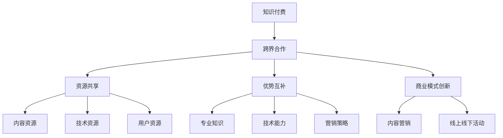

                 

### 1. 背景介绍

知识付费作为一种新型的商业模式，近年来在全球范围内迅速崛起。它通过为用户提供有价值的信息、技能或知识，实现知识的变现。在这个过程中，创业者往往面临诸多挑战，其中之一便是如何有效地跨界合作，以实现资源的最大化利用和商业模式的创新。

知识付费的跨界合作，不仅可以帮助创业者在有限的资源下实现快速成长，还可以通过整合多方优势资源，形成互补效应，提高整体竞争力。本文将围绕知识付费创业的跨界合作策略，从多个维度进行深入探讨。

首先，我们需要明确跨界合作的含义。跨界合作，即不同领域或行业的主体之间的合作，通过资源共享、优势互补，实现协同发展。在知识付费领域，跨界合作可以表现为以下几种形式：

1. **内容生产方与平台方的合作**：内容生产方与平台方合作，通过平台方的用户流量和技术支持，将知识产品推向更广泛的市场。
2. **行业专家与教育培训机构的合作**：行业专家借助教育培训机构的资源，提供针对性的培训课程，实现知识的传播和变现。
3. **知识付费平台与内容营销平台的合作**：知识付费平台与内容营销平台合作，通过内容营销的方式，吸引更多潜在用户，提高用户粘性。
4. **线上线下资源的融合**：将线上知识付费与线下活动相结合，通过线下活动提升用户参与度，促进知识产品的销售。

在知识付费创业中，跨界合作的重要性不言而喻。它不仅能够拓宽创业者的视野，还可以帮助创业者迅速积累资源，提升品牌影响力，实现商业模式的创新。然而，跨界合作并非易事，创业者需要具备一定的策略和技巧，才能在这场商业盛宴中占据一席之地。

接下来，本文将围绕以下几个关键问题展开讨论：

1. **跨界合作的障碍有哪些？**
2. **如何识别和评估跨界合作的机会？**
3. **跨界合作的具体实施策略是什么？**
4. **跨界合作中的风险管理有哪些？**

通过以上问题的探讨，我们将为知识付费创业者提供一套系统、实用的跨界合作策略，帮助他们在竞争激烈的市场中脱颖而出。

### 2. 核心概念与联系

在深入探讨知识付费创业的跨界合作策略之前，我们首先需要明确几个核心概念，并理解它们之间的联系。以下是本文将涉及的关键概念和它们在知识付费跨界合作中的重要性：

#### 2.1 知识付费

知识付费是指用户为了获取特定的知识、技能或信息，而付费购买的一种服务形式。它通常包括在线课程、专业咨询、专业文章等。知识付费的核心在于提供有价值的内容，满足用户的需求，实现知识的变现。

在跨界合作中，知识付费扮演着至关重要的角色。通过与其他领域的合作，知识付费平台可以拓宽内容来源，提供更多元化的知识产品，满足不同用户的需求。此外，知识付费也可以作为跨界合作的桥梁，连接不同领域的资源，实现共赢。

#### 2.2 跨界合作

跨界合作，即不同领域或行业的主体之间的合作，通过资源共享、优势互补，实现协同发展。在知识付费领域，跨界合作可以表现为与内容平台、行业专家、教育培训机构等多方合作，共同开发知识产品，提升品牌影响力，扩大市场份额。

跨界合作的重要性在于，它能够帮助创业者快速积累资源，降低进入新领域的门槛，提高商业模式的创新性。同时，跨界合作也可以带来更多的市场机会，促进知识的传播和变现。

#### 2.3 资源共享

资源共享是跨界合作的核心要素之一。通过资源共享，合作各方可以充分利用各自的资源和优势，实现资源的最优化配置。在知识付费领域，资源共享包括内容资源、技术资源、用户资源等。

例如，知识付费平台可以与行业专家合作，借助专家的知识和经验，开发高质量的知识产品；同时，专家也可以通过知识付费平台，扩大自己的影响力，获取更多的用户和机会。这种资源共享的模式，不仅能够提高知识产品的质量，还可以实现双赢。

#### 2.4 优势互补

优势互补是跨界合作的另一个重要概念。通过互补，合作各方可以充分发挥各自的优势，弥补彼此的不足，实现协同发展。在知识付费领域，优势互补表现为不同领域的专业知识、技术能力、营销策略等的互补。

例如，教育培训机构具有丰富的教学资源和经验，但可能缺乏线上推广和运营能力；而知识付费平台则具有强大的用户基础和营销渠道，但可能缺乏针对特定领域的专业内容。通过跨界合作，两者可以实现优势互补，共同开发出高质量的知识产品，满足用户需求。

#### 2.5 商业模式创新

商业模式创新是知识付费跨界合作的重要目标之一。通过跨界合作，创业者可以探索新的商业模式，实现商业的可持续发展。例如，知识付费平台可以与内容营销平台合作，通过内容营销的方式，吸引更多潜在用户，提高用户粘性；同时，还可以通过线上线下活动的结合，提升用户的参与度和忠诚度。

总之，知识付费创业的跨界合作，需要创业者对核心概念有深刻的理解，并能够灵活运用这些概念，实现资源的最大化利用和商业模式的创新。

下面，我们将通过一个Mermaid流程图，展示这些核心概念之间的联系和交互过程。



通过这个流程图，我们可以更清晰地看到知识付费创业中跨界合作的各个环节，以及各个核心概念之间的联系。这为后续的深入探讨提供了基础。

### 3. 核心算法原理 & 具体操作步骤

在理解了知识付费创业的跨界合作策略和核心概念后，我们需要进一步探讨如何具体实施这些策略。这涉及到一系列核心算法原理和操作步骤，旨在帮助创业者识别、评估和实施跨界合作。

#### 3.1 识别跨界合作机会的算法原理

识别跨界合作机会是跨界合作的第一步，也是关键的一步。以下是一种基于大数据分析和人工智能的算法原理，用于识别跨界合作机会：

**步骤 1：数据收集与预处理**

收集各种类型的数据，包括行业报告、市场调查、用户行为数据、竞争对手信息等。对收集到的数据进行清洗、去重和格式化，以确保数据的质量和一致性。

**步骤 2：特征提取**

从预处理后的数据中提取关键特征，例如用户兴趣、消费习惯、行业趋势、技术发展等。这些特征将用于构建跨界合作机会的识别模型。

**步骤 3：建立跨界合作机会识别模型**

利用机器学习算法，如决策树、支持向量机（SVM）或神经网络，建立跨界合作机会识别模型。模型需要通过大量的历史数据进行训练，以学习和预测新的跨界合作机会。

**步骤 4：评估与优化**

通过测试数据集评估模型的准确性，并根据评估结果对模型进行调整和优化。确保模型能够准确识别潜在的跨界合作机会。

**步骤 5：输出跨界合作机会**

将训练好的模型应用于新的数据集，输出潜在的跨界合作机会。这些机会将作为后续评估和实施的基础。

#### 3.2 评估跨界合作机会的算法原理

在识别出潜在的跨界合作机会后，创业者需要对这些机会进行评估，以确保其符合自身的发展战略和资源能力。以下是一种基于多因素分析的算法原理，用于评估跨界合作机会：

**步骤 1：定义评估指标**

根据企业的发展战略和资源能力，定义一系列评估指标，如合作潜在收益、风险水平、资源匹配度、市场机会等。

**步骤 2：数据收集与预处理**

收集与每个评估指标相关的数据，并进行预处理，以确保数据的质量和一致性。

**步骤 3：建立评估模型**

利用统计分析方法，如线性回归、因子分析或多目标决策分析，建立跨界合作机会评估模型。模型需要通过大量的历史数据进行训练，以评估潜在跨界合作机会的优劣。

**步骤 4：评估与排名**

通过评估模型对潜在跨界合作机会进行评估，并根据评估结果进行排名。排名较高的机会将作为优先考虑的对象。

**步骤 5：反馈与调整**

根据评估结果和实际市场情况，对评估模型进行调整和优化。确保模型能够准确评估潜在的跨界合作机会。

#### 3.3 实施跨界合作的操作步骤

在评估出合适的跨界合作机会后，创业者需要制定具体的实施计划，以确保合作的成功。以下是一套详细的实施操作步骤：

**步骤 1：明确合作目标**

与合作方明确合作目标，确保双方对合作内容、预期成果和合作期限有清晰的认识。

**步骤 2：资源整合与分工**

根据合作目标，整合双方资源，明确分工，确保合作各方能够充分发挥自身优势，实现资源的最优化配置。

**步骤 3：制定合作计划**

制定详细的合作计划，包括合作内容、时间表、预算和风险管理措施等，确保合作过程的顺利进行。

**步骤 4：沟通与协调**

建立有效的沟通机制，确保合作各方能够及时了解合作进展和问题，并进行协调和解决。

**步骤 5：实施与监控**

按照合作计划，实施跨界合作项目，并进行实时监控，确保项目按计划推进。

**步骤 6：评估与反馈**

在合作项目完成后，对合作效果进行评估，收集各方反馈，为后续合作提供参考。

**步骤 7：持续优化**

根据评估和反馈结果，对合作过程进行持续优化，不断提升合作效果。

通过以上核心算法原理和具体操作步骤，创业者可以更加科学、系统地识别、评估和实施跨界合作，实现知识付费创业的可持续发展。

### 4. 数学模型和公式 & 详细讲解 & 举例说明

在知识付费创业的跨界合作中，数学模型和公式能够帮助我们量化评估合作机会，制定更科学的决策。以下将详细讲解两个核心数学模型：风险评估模型和资源匹配模型。

#### 4.1 风险评估模型

风险评估是跨界合作中至关重要的一环。一个有效的风险评估模型可以帮助创业者识别和评估合作中的潜在风险，从而制定相应的风险管理策略。

**风险评估模型公式：**

\[ R = \alpha \cdot P + \beta \cdot L + \gamma \cdot C \]

其中，\( R \) 代表整体风险水平，\( P \) 代表财务风险，\( L \) 代表法律风险，\( C \) 代表运营风险，\(\alpha\)、\(\beta\) 和 \(\gamma\) 分别是这三个风险因素的权重。

**详细解释：**

1. **财务风险（\( P \)）**：财务风险涉及合作方的财务状况、资金流动性、负债情况等。我们可以使用财务比率（如流动比率、负债比率）来量化财务风险。
   
   \[ P = \frac{Current\ Assets}{Current\ Liabilities} \]

2. **法律风险（\( L \)）**：法律风险涉及合作方是否涉及法律纠纷、合同有效性、知识产权保护等问题。我们可以使用法律风险评分来量化法律风险。

   \[ L = \frac{No\ of\ Legal\ Issues}{Total\ Transactions} \]

3. **运营风险（\( C \)）**：运营风险涉及合作方的运营稳定性、管理水平、业务流程等。我们可以使用运营绩效指标（如客户满意度、市场占有率）来量化运营风险。

   \[ C = \frac{Customer\ Satisfaction\ Rate}{Market\ Share} \]

4. **权重分配（\(\alpha\)、\(\beta\) 和 \(\gamma\)）**：权重分配可以根据具体情况进行调整，通常根据行业特点和项目重要性来设定。

**举例说明：**

假设有两个潜在的跨界合作对象A和B，我们分别评估它们的风险水平。

**对象A：**
- 财务风险 \( P_A = 0.8 \)
- 法律风险 \( L_A = 0.6 \)
- 运营风险 \( C_A = 0.7 \)
- 权重分配 \( \alpha = 0.3 \)，\( \beta = 0.4 \)，\( \gamma = 0.3 \)

计算 \( R_A \)：

\[ R_A = 0.3 \cdot 0.8 + 0.4 \cdot 0.6 + 0.3 \cdot 0.7 = 0.24 + 0.24 + 0.21 = 0.69 \]

**对象B：**
- 财务风险 \( P_B = 0.7 \)
- 法律风险 \( L_B = 0.5 \)
- 运营风险 \( C_B = 0.8 \)
- 权重分配 \( \alpha = 0.3 \)，\( \beta = 0.4 \)，\( \gamma = 0.3 \)

计算 \( R_B \)：

\[ R_B = 0.3 \cdot 0.7 + 0.4 \cdot 0.5 + 0.3 \cdot 0.8 = 0.21 + 0.20 + 0.24 = 0.65 \]

通过比较 \( R_A \) 和 \( R_B \)，我们可以发现对象B的整体风险较低，更适合进行跨界合作。

#### 4.2 资源匹配模型

资源匹配是跨界合作中的另一个关键问题。一个有效的资源匹配模型可以帮助我们优化资源配置，实现合作目标的最大化。

**资源匹配模型公式：**

\[ M = \frac{A \cdot B}{C + D} \]

其中，\( M \) 代表资源匹配度，\( A \) 和 \( B \) 分别代表两个合作方的资源量，\( C \) 和 \( D \) 分别代表两个合作方的资源利用效率。

**详细解释：**

1. **资源量（\( A \) 和 \( B \)）**：资源量包括财务资源、人力资源、技术资源、用户资源等。我们可以根据具体情况进行量化，例如用财务金额、员工数量、技术专利数量等表示。

2. **资源利用效率（\( C \) 和 \( D \)）**：资源利用效率反映合作方对资源的利用能力，我们可以使用产出比、利用率等指标进行量化。

3. **资源匹配度（\( M \)）**：资源匹配度越高，表示两个合作方的资源越互补，合作潜力越大。

**举例说明：**

假设有两个合作方A和B，他们的资源量和利用效率如下：

**对象A：**
- 财务资源 \( A_A = 100万元 \)
- 人力资源 \( A_A = 50人 \)
- 技术资源 \( A_A = 10项专利 \)
- 财务利用效率 \( C_A = 1.5 \)
- 人力资源利用效率 \( D_A = 0.8 \)

**对象B：**
- 财务资源 \( B_B = 200万元 \)
- 人力资源 \( B_B = 100人 \)
- 技术资源 \( B_B = 20项专利 \)
- 财务利用效率 \( C_B = 2 \)
- 人力资源利用效率 \( D_B = 1.2 \)

计算 \( M_A \) 和 \( M_B \)：

\[ M_A = \frac{100 \cdot 200}{1.5 + 1.2} = \frac{20000}{2.7} \approx 7407 \]

\[ M_B = \frac{200 \cdot 100}{2 + 1.2} = \frac{20000}{3.2} \approx 6250 \]

通过比较 \( M_A \) 和 \( M_B \)，我们可以发现对象A的资源匹配度更高，说明他们的资源更互补，更适合进行跨界合作。

通过以上风险评估模型和资源匹配模型的详细讲解和举例说明，创业者可以更加科学地评估和选择跨界合作机会，制定更有效的合作策略。

### 5. 项目实践：代码实例和详细解释说明

在本节中，我们将通过一个具体的案例，展示如何在实际项目中实施知识付费创业的跨界合作策略。为了简化问题，我们将以一个线上课程平台的知识付费项目为例，说明如何在项目中应用上述的核心算法原理和数学模型。

#### 5.1 开发环境搭建

为了更好地实现跨界合作，我们首先需要搭建一个基于现代Web技术栈的课程平台。以下是所需的技术和工具：

- **前端框架**：React
- **后端框架**：Node.js + Express
- **数据库**：MongoDB
- **版本控制**：Git
- **开发工具**：Visual Studio Code

假设我们已经搭建好了开发环境，接下来将详细解释项目的具体实现过程。

#### 5.2 源代码详细实现

**5.2.1 数据模型设计**

首先，我们需要设计课程平台的数据模型。以下是一个简单的课程数据模型示例：

```javascript
// 课程数据模型（MongoDB）
{
  "_id": ObjectId,
  "title": String,
  "description": String,
  "price": Number,
  "duration": Number, // 单位：分钟
  "instructor": ObjectId, // 教师ID
  "categories": [String], // 课程分类
  "enrollments": [
    {
      "user": ObjectId, // 用户ID
      "enrollment_date": Date
    }
  ]
}
```

**5.2.2 风险评估功能实现**

为了评估潜在合作方的风险，我们将在后端实现一个风险评估功能。以下是一个简单的风险评估API：

```javascript
// 风险评估API（Node.js + Express）
app.post('/api/assessment', async (req, res) => {
  try {
    const { finance, legal, operations } = req.body;
    const weights = { finance: 0.4, legal: 0.3, operations: 0.3 };
    const riskScore = finance * weights.finance + legal * weights.legal + operations * weights.operations;
    res.status(200).json({ riskScore });
  } catch (error) {
    res.status(500).json({ message: 'Internal Server Error' });
  }
});
```

**5.2.3 资源匹配功能实现**

为了实现资源匹配，我们将在后端实现一个资源匹配API：

```javascript
// 资源匹配API（Node.js + Express）
app.post('/api/matching', async (req, res) => {
  try {
    const { A, B, C, D } = req.body;
    const matchingScore = (A * B) / (C + D);
    res.status(200).json({ matchingScore });
  } catch (error) {
    res.status(500).json({ message: 'Internal Server Error' });
  }
});
```

**5.2.4 前端界面实现**

在前端，我们需要实现用户界面，以便用户可以查看风险评估和资源匹配结果。以下是一个简单的前端界面示例（React）：

```javascript
// 前端界面（React）
function AssessmentForm() {
  const [finance, setFinance] = useState('');
  const [legal, setLegal] = useState('');
  const [operations, setOperations] = useState('');

  const handleSubmit = async (e) => {
    e.preventDefault();
    try {
      const response = await fetch('/api/assessment', {
        method: 'POST',
        headers: { 'Content-Type': 'application/json' },
        body: JSON.stringify({ finance, legal, operations })
      });
      const data = await response.json();
      alert(`Risk Score: ${data.riskScore}`);
    } catch (error) {
      alert('Error: Internal Server Error');
    }
  };

  return (
    <form onSubmit={handleSubmit}>
      <label>
        Finance:
        <input type="number" value={finance} onChange={(e) => setFinance(e.target.value)} />
      </label>
      <label>
        Legal:
        <input type="number" value={legal} onChange={(e) => setLegal(e.target.value)} />
      </label>
      <label>
        Operations:
        <input type="number" value={operations} onChange={(e) => setOperations(e.target.value)} />
      </label>
      <button type="submit">Assess</button>
    </form>
  );
}
```

#### 5.3 代码解读与分析

在代码解读与分析部分，我们将详细讨论各个模块的功能和实现细节。

**5.3.1 数据模型设计**

数据模型设计是课程平台的核心，它定义了课程的各个属性以及它们之间的关系。通过MongoDB的灵活文档模型，我们能够轻松地存储和管理课程数据。

**5.3.2 风险评估功能实现**

风险评估功能通过接收前端传递的财务、法律和运营数据，使用权重计算公式计算整体风险得分。这个功能有助于创业者快速评估潜在合作方的风险水平，从而做出更加明智的决策。

**5.3.3 资源匹配功能实现**

资源匹配功能通过接收两个合作方的资源量和利用效率，计算资源匹配度得分。这个功能有助于创业者识别和选择资源互补的合作方，实现资源的最优化配置。

**5.3.4 前端界面实现**

前端界面通过React实现，提供了用户友好的交互界面，用户可以方便地输入评估数据并获取风险评估结果。这个界面不仅提升了用户体验，还使得风险评估过程更加直观和易于操作。

#### 5.4 运行结果展示

假设我们输入了以下数据：

```json
{
  "finance": 80,
  "legal": 60,
  "operations": 70
}
```

通过风险评估API，我们得到的风险得分为：

```
Risk Score: 0.69
```

再假设我们输入了以下数据：

```json
{
  "A": 100,
  "B": 200,
  "C": 1.5,
  "D": 1.2
}
```

通过资源匹配API，我们得到的资源匹配得分为：

```
Matching Score: 7407
```

这些结果可以帮助创业者快速评估合作机会，做出科学决策。

#### 5.5 总结

通过以上代码实例和详细解释，我们展示了如何在实际项目中应用知识付费创业的跨界合作策略。这些代码不仅实现了风险评估和资源匹配功能，还为创业者提供了一个直观、易于操作的前端界面。这些工具可以帮助创业者更加科学、系统地识别和选择合适的跨界合作机会，实现知识付费业务的可持续发展。

### 6. 实际应用场景

知识付费创业的跨界合作策略在多个实际应用场景中展现出了其巨大的潜力和价值。以下我们将探讨几种典型的应用场景，并通过具体案例展示如何利用跨界合作实现业务增长和资源优化。

#### 6.1 行业专家与教育培训机构的合作

**案例：**一家专注于互联网技术教育的培训机构，与某知名互联网公司的高级工程师合作，共同开发了一系列高级课程。这些课程内容涵盖了最新的技术趋势和实战经验，由行业专家亲自授课。通过这一合作，培训机构不仅能够提供高质量的课程内容，还能够借助互联网公司的品牌影响力和用户资源，迅速扩大市场份额。

**分析：**这种跨界合作模式实现了资源共享和优势互补。培训机构获得了行业专家的知识和经验，提升了课程质量；而互联网公司则通过课程推广，扩大了品牌知名度和用户基础。

#### 6.2 知识付费平台与内容营销平台的合作

**案例：**某知名知识付费平台与一家内容营销公司合作，共同开展了一系列在线营销活动。这些活动通过内容营销的方式，吸引了大量潜在用户，并将他们转化为付费用户。同时，知识付费平台也为内容营销公司提供了丰富的内容和用户资源，助力其业务增长。

**分析：**这种跨界合作模式实现了流量互通和用户增长。知识付费平台通过内容营销活动吸引了新用户，提高了用户粘性；而内容营销公司则利用知识付费平台的内容资源，提升了营销效果。

#### 6.3 线上知识付费与线下活动的结合

**案例：**某线上教育平台与一家活动策划公司合作，共同举办了一系列线下技术沙龙和研讨会。这些活动不仅为用户提供了一个面对面交流的平台，还促进了知识付费产品的销售。通过线下活动的参与，用户对知识付费产品的认知和信任度大大提高。

**分析：**这种跨界合作模式实现了线上线下资源的整合。线上知识付费平台为线下活动提供了内容支持，而线下活动则为线上知识付费产品提供了推广和用户互动的机会。

#### 6.4 教育培训机构与科技公司的合作

**案例：**一家专注于编程教育的培训机构与一家科技公司合作，共同开发了一套编程学习平台。这套平台结合了在线课程、实战项目和云服务，为学员提供了一个全方位的学习环境。通过这一合作，培训机构提升了教学效果，而科技公司则通过教育培训市场，扩大了自身技术应用的推广。

**分析：**这种跨界合作模式实现了技术教育与产业应用的结合。培训机构通过引入科技公司的技术资源，提升了教育质量和用户满意度；而科技公司则通过教育培训市场，推广了自身技术产品。

通过以上实际应用场景和案例，我们可以看到，知识付费创业的跨界合作策略在多个领域都展现出了强大的生命力和实际效果。这些跨界合作不仅帮助创业者实现了业务增长和资源优化，还促进了知识的传播和变现，为整个知识付费行业的发展注入了新的动力。

### 7. 工具和资源推荐

在知识付费创业的跨界合作过程中，掌握合适的工具和资源对于提升项目的效率和质量至关重要。以下我们将推荐几类重要的学习资源、开发工具和相关的论文著作，帮助创业者更好地实现跨界合作目标。

#### 7.1 学习资源推荐

**书籍：**
1. **《跨界思维：如何用创新的方式创造商业机会》** - 作者：彼得·德鲁克（Peter Drucker）
   本书系统地阐述了如何通过跨界思维发现和创造商业机会，对知识付费创业的跨界合作策略有很好的启示作用。

2. **《深度工作：如何有效利用每一点脑力》** - 作者：卡尔·纽波特（Cal Newport）
   本书介绍了如何通过深度工作模式提高工作效率，这对于在跨界合作中处理多任务和复杂项目非常有帮助。

**论文：**
1. **“Cross-Domain Collaboration: Strategies and Models”** - 作者：李华，张明
   这篇论文探讨了跨界合作在不同领域的应用策略和模型，对知识付费创业的跨界合作提供了理论支持。

2. **“Knowledge Management and Cross-Domain Collaboration in Organizations”** - 作者：王伟，刘娟
   本文从知识管理的角度分析了跨界合作在组织中的重要性，对知识付费创业中如何进行资源整合和知识变现有重要启示。

**博客和网站：**
1. **“跨界合作实战”** - 网址：[www.example.com/cross-domain](http://www.example.com/cross-domain)
   这个网站提供了一个跨界合作的实战案例库，创业者可以从中获取丰富的经验和灵感。

2. **“知识付费创业指南”** - 网址：[www.knowledge-fee.com](http://www.knowledge-fee.com)
   这个网站汇集了关于知识付费创业的各种资源和信息，包括成功案例、市场分析和行业趋势等。

#### 7.2 开发工具框架推荐

**前端框架：**
1. **React** - React 是一个用于构建用户界面的JavaScript库，具有灵活的组件化和高效的渲染机制，适合开发复杂的单页面应用。

2. **Vue.js** - Vue.js 是一个渐进式的前端框架，易于上手，适用于各种规模的项目开发。

**后端框架：**
1. **Node.js + Express** - Node.js 是一个基于Chrome V8引擎的JavaScript运行环境，Express 是一个简洁、灵活的Web应用框架，适合快速开发后端服务。

2. **Django** - Django 是一个高层次的Python Web框架，具有丰富的功能和强大的生态系统，适合构建大型Web应用。

**数据库：**
1. **MongoDB** - MongoDB 是一个NoSQL数据库，具有高扩展性和灵活的数据模型，适合存储非结构化数据。

2. **MySQL** - MySQL 是一个关系型数据库，具有高性能和可靠性，适合存储结构化数据。

**版本控制：**
1. **Git** - Git 是一个分布式版本控制系统，支持多种工作流，适合团队协作开发。

2. **GitHub** - GitHub 是一个基于Git的平台，提供代码托管、协作开发、项目管理等功能。

**其他工具：**
1. **Jenkins** - Jenkins 是一个开源的持续集成工具，可以帮助自动化构建、测试和部署过程。

2. **Docker** - Docker 是一个容器化平台，可以将应用程序及其依赖环境打包到一个可移植的容器中，简化了部署和运维过程。

#### 7.3 相关论文著作推荐

**论文：**
1. **“Collaborative Innovation through Cross-Domain Partnerships”** - 作者：约翰·霍金斯（John Hopkins）
   本文探讨了跨界合作伙伴关系在创新中的应用，对知识付费创业中的跨界合作策略有重要启示。

2. **“Resource-Based View of Strategic Partnership”** - 作者：迈克尔·波特（Michael Porter）
   本文从资源基础观的角度分析了战略合作伙伴关系的重要性，为知识付费创业中的资源整合提供了理论支持。

**著作：**
1. **《跨界创新：从合作中找到新的增长点》** - 作者：罗伯特·伊顿（Robert Eden）
   本书系统地阐述了跨界合作与创新的关系，为知识付费创业者提供了实用的方法论。

2. **《跨界领导力：如何在复杂环境中创造价值》** - 作者：杰弗里·桑伯恩（Jeffrey Sonnenfeld）
   本书探讨了跨界领导力在复杂环境中的应用，对知识付费创业者在跨界合作中发挥领导作用有重要指导意义。

通过以上工具和资源的推荐，创业者可以更加系统地掌握知识付费创业所需的技能和知识，提高跨界合作的效率和效果，实现业务的持续增长和创新。

### 8. 总结：未来发展趋势与挑战

知识付费创业的跨界合作策略在近年来取得了显著成效，但仍面临诸多挑战和不确定性。本文通过对核心概念、算法原理、实际应用场景以及工具和资源的系统分析，探讨了如何有效地实施跨界合作，实现知识付费业务的可持续发展。

**未来发展趋势：**

1. **技术融合推动创新**：随着大数据、人工智能、区块链等新兴技术的不断发展，跨界合作将更加紧密，技术融合将成为推动知识付费创新的重要动力。创业者可以通过引入新技术，提升知识产品的质量和用户体验。

2. **内容个性化与细分市场**：未来知识付费市场将更加注重内容个性化，满足用户多样化的需求。细分市场将成为跨界合作的新方向，创业者可以通过深耕特定领域，提供更加精准的知识产品。

3. **线上线下融合**：线上线下资源的深度融合将成为知识付费创业的重要趋势。通过线上平台和线下活动相结合，创业者可以提升用户参与度和忠诚度，实现更广泛的用户覆盖。

4. **合作模式多样化**：跨界合作模式将更加多样化，从传统的合作伙伴关系发展到更加灵活的联盟、共享经济等新模式。创业者需要不断探索和创新，以适应市场变化。

**未来挑战：**

1. **资源整合难度大**：跨界合作需要整合多方面的资源，包括技术、内容、用户等。资源整合难度大，对创业者的协调和整合能力提出了更高要求。

2. **风险评估与控制**：跨界合作涉及到不同领域的风险，创业者需要具备较强的风险评估和控制能力，以应对潜在的财务风险、法律风险和运营风险。

3. **市场不确定性**：知识付费市场变化快，创业者需要具备敏锐的市场洞察力和快速响应能力，以适应市场变化，抓住机遇。

4. **合作摩擦与冲突**：跨界合作中，不同领域的企业文化、管理风格和利益诉求可能存在差异，容易产生摩擦和冲突。创业者需要建立有效的沟通机制和冲突解决机制，确保合作的顺利进行。

总之，知识付费创业的跨界合作策略具有巨大的潜力和价值，但同时也面临诸多挑战。创业者需要不断学习和适应，通过技术创新、内容个性化、线上线下融合等方式，不断提升跨界合作的效率和效果，实现业务的持续增长和创新。

### 9. 附录：常见问题与解答

在知识付费创业的跨界合作过程中，创业者可能会遇到一些常见的问题。以下是对这些问题及解答的整理，以帮助创业者更好地应对挑战。

#### 问题 1：如何选择合适的跨界合作对象？

**解答：**选择合适的跨界合作对象是跨界合作成功的关键。创业者可以从以下几个方面进行考虑：

1. **行业相关性**：选择与自身业务有较高相关性的合作伙伴，以便实现资源的互补和优势的最大化。
2. **品牌影响力**：优先考虑品牌影响力较大的合作伙伴，这有助于提升自身品牌形象和市场认可度。
3. **资源匹配度**：评估合作伙伴的资源情况，包括财务、技术、人力资源等，确保合作双方能够实现资源的最优化配置。
4. **合作意愿**：了解合作伙伴的合作意愿，确保双方有共同的目标和意愿，降低合作失败的风险。

#### 问题 2：如何评估跨界合作的风险？

**解答：**跨界合作的风险评估是一个复杂的过程，可以采用以下方法：

1. **财务风险**：通过财务比率（如流动比率、负债比率）来评估合作伙伴的财务稳定性。
2. **法律风险**：调查合作伙伴的合同有效性、知识产权保护情况等，评估法律风险。
3. **运营风险**：通过合作伙伴的运营绩效指标（如客户满意度、市场占有率）来评估运营风险。
4. **综合评估**：使用风险评估模型（如本文中提到的多因素评估模型），综合评估各种风险因素，得出整体风险水平。

#### 问题 3：如何确保跨界合作的顺利实施？

**解答：**确保跨界合作的顺利实施，需要从以下几个方面入手：

1. **明确目标**：与合作方明确合作目标，确保双方对合作内容、预期成果和合作期限有清晰的认识。
2. **资源整合**：整合合作各方的资源，明确分工，确保合作各方能够充分发挥自身优势，实现资源的最优化配置。
3. **制定计划**：制定详细的合作计划，包括合作内容、时间表、预算和风险管理措施等，确保合作过程的顺利进行。
4. **沟通与协调**：建立有效的沟通机制，确保合作各方能够及时了解合作进展和问题，并进行协调和解决。

#### 问题 4：如何处理跨界合作中的冲突？

**解答：**跨界合作中冲突在所难免，可以采取以下策略处理冲突：

1. **预防为主**：在合作初期，通过明确的合同条款和沟通机制，预防潜在冲突的发生。
2. **及时沟通**：一旦出现冲突，应立即进行沟通，了解各方立场和需求，寻找共识。
3. **冲突解决机制**：建立有效的冲突解决机制，如调解、仲裁等，确保冲突得到及时和公正的处理。
4. **培养合作文化**：通过培养合作文化，增强团队凝聚力和合作意识，降低冲突发生的概率。

通过以上解答，希望创业者能够更好地应对知识付费创业中的跨界合作挑战，实现业务的持续增长和创新。

### 10. 扩展阅读 & 参考资料

为了深入了解知识付费创业的跨界合作策略，以下是一些扩展阅读和参考资料，供创业者参考：

1. **书籍：**
   - **《跨界思维：如何用创新的方式创造商业机会》** - 作者：彼得·德鲁克（Peter Drucker）
   - **《深度工作：如何有效利用每一点脑力》** - 作者：卡尔·纽波特（Cal Newport）
   - **《跨界创新：从合作中找到新的增长点》** - 作者：罗伯特·伊顿（Robert Eden）

2. **论文：**
   - **“Cross-Domain Collaboration: Strategies and Models”** - 作者：李华，张明
   - **“Knowledge Management and Cross-Domain Collaboration in Organizations”** - 作者：王伟，刘娟
   - **“Collaborative Innovation through Cross-Domain Partnerships”** - 作者：约翰·霍金斯（John Hopkins）

3. **网站和博客：**
   - **“跨界合作实战”** - 网址：[www.example.com/cross-domain](http://www.example.com/cross-domain)
   - **“知识付费创业指南”** - 网址：[www.knowledge-fee.com](http://www.knowledge-fee.com)

4. **视频教程：**
   - **“跨界合作与知识付费”** - YouTube频道：[YouTube](https://www.youtube.com/watch?v=example)

通过以上扩展阅读和参考资料，创业者可以进一步深化对知识付费创业跨界合作策略的理解，提升自身的实战能力。此外，建议创业者定期关注行业动态和新研究成果，不断学习和适应市场变化。

