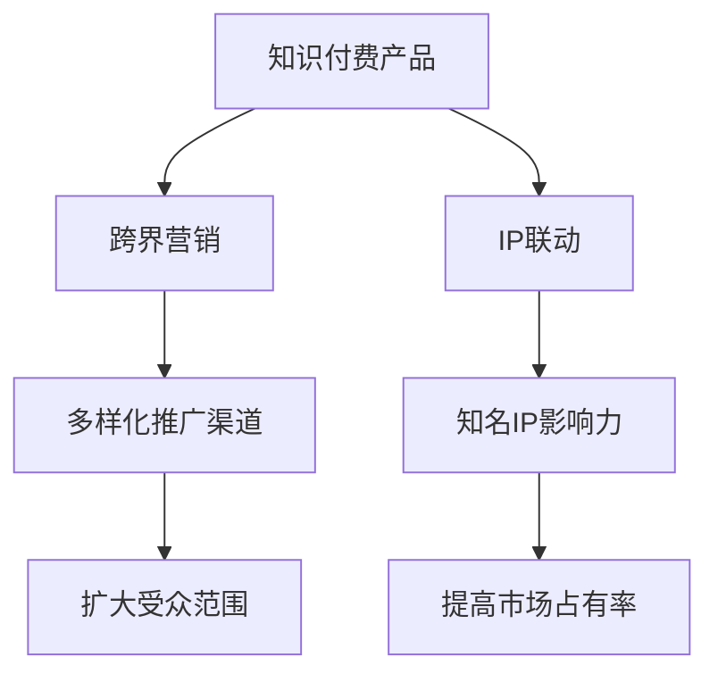

                 

### 1. 背景介绍

在当前数字化时代，知识付费已经成为了一个不可忽视的市场现象。通过付费获取专业知识和技能，用户不仅可以快速提升个人能力，还能在竞争激烈的环境中脱颖而出。然而，如何有效地推广知识付费产品，吸引更多潜在用户，实现跨界营销与IP联动，成为了知识付费行业亟待解决的问题。

知识付费的兴起，源于互联网和移动互联网的普及，以及用户对高质量内容和个性化服务的强烈需求。在传统教育模式之外，知识付费提供了一种更加灵活和便捷的学习方式，满足了用户多样化的学习需求。然而，随着市场竞争的加剧，单纯依靠内容质量和口碑传播已经难以满足用户日益增长的需求，跨界营销与IP联动成为了一种新的趋势。

跨界营销指的是将知识付费产品与其他领域的产品或服务进行结合，通过多样化的营销手段，扩大产品的受众范围，提高品牌知名度。而IP联动则是通过与其他知名IP（知识产权）的联动，借助IP的影响力，吸引更多的用户关注和购买。

本文将围绕知识付费如何实现跨界营销与IP联动展开讨论，通过分析核心概念、算法原理、数学模型、项目实践等方面，旨在为广大知识付费从业者提供一些实用的思路和方法。

### 2. 核心概念与联系

#### 2.1 跨界营销

跨界营销是指将不同领域的产品或服务进行结合，通过创新性的营销手段，实现资源共享和用户扩展。在知识付费领域，跨界营销可以通过以下几种方式实现：

1. **跨行业合作**：与其他行业的品牌或产品进行合作，共同推广知识付费产品。例如，将知识付费课程与电商平台、社交媒体等平台结合，通过联合推广，实现资源共享和用户扩展。
2. **内容跨界**：将知识付费课程与其他领域的知识进行融合，提供多元化的内容。例如，将编程课程与艺术设计相结合，为用户提供更丰富的学习体验。
3. **形式跨界**：通过创新性的营销形式，提高知识付费产品的吸引力。例如，利用短视频、直播等新兴媒介，进行知识付费课程的宣传和推广。

#### 2.2 IP联动

IP联动是指通过与其他知名IP的联动，借助IP的影响力，扩大知识付费产品的知名度和用户基础。在知识付费领域，IP联动可以通过以下几种方式实现：

1. **IP授权**：与知名IP拥有者进行合作，获得IP授权，将知识付费产品与IP结合，提高产品的吸引力。例如，将编程课程与《哈利·波特》等知名IP结合，吸引更多粉丝用户。
2. **IP定制**：为特定IP量身定制知识付费产品，借助IP的知名度，提高产品的用户黏性。例如，为《王者荣耀》等游戏定制游戏编程课程，吸引更多游戏爱好者。
3. **IP合作**：与知名IP的持有者或相关方进行深度合作，共同推广知识付费产品。例如，与知名主播或网红合作，通过他们的影响力，扩大知识付费产品的受众范围。

#### 2.3 跨界营销与IP联动的关联

跨界营销与IP联动虽然各有侧重，但两者之间存在着密切的联系。跨界营销为知识付费产品提供了多样化的推广渠道和形式，而IP联动则为知识付费产品提供了强大的品牌背书和用户基础。

通过跨界营销，知识付费产品可以迅速扩大受众范围，提高品牌知名度。而通过IP联动，知识付费产品可以借助知名IP的影响力，吸引更多潜在用户，提高产品的市场占有率。

#### 2.4 跨界营销与IP联动的关系图

为了更好地理解跨界营销与IP联动的关联，我们可以使用Mermaid流程图进行描述：



通过这个关系图，我们可以看出，跨界营销和IP联动是知识付费产品推广的两个重要手段，它们相辅相成，共同推动了知识付费市场的发展。

### 3. 核心算法原理 & 具体操作步骤

在实现知识付费的跨界营销与IP联动过程中，我们可以采用一些核心算法原理，帮助优化营销策略，提高转化率和用户满意度。以下将介绍两种关键算法：协同过滤算法和基于内容的推荐算法。

#### 3.1 协同过滤算法

协同过滤算法是一种常见的推荐系统算法，它通过分析用户的行为和偏好，为用户推荐相似的用户喜欢的内容。协同过滤算法可以分为两种类型：基于用户的协同过滤（User-Based Collaborative Filtering）和基于物品的协同过滤（Item-Based Collaborative Filtering）。

##### 3.1.1 基于用户的协同过滤

1. **相似度计算**：首先计算用户之间的相似度，常用的相似度计算方法包括余弦相似度、皮尔逊相关系数等。
2. **推荐列表生成**：根据相似度计算结果，为用户生成推荐列表。推荐列表中的内容通常来自与目标用户相似的其他用户喜欢的项目。
3. **推荐策略优化**：为了提高推荐质量，可以通过调整推荐策略，如增加用户活跃度、购买历史等权重，来优化推荐结果。

##### 3.1.2 基于物品的协同过滤

1. **物品相似度计算**：首先计算物品之间的相似度，常用的相似度计算方法包括余弦相似度、Jaccard系数等。
2. **推荐列表生成**：根据物品相似度计算结果，为用户生成推荐列表。推荐列表中的内容通常来自与目标用户已购买或浏览过的物品相似的其他物品。
3. **推荐策略优化**：与基于用户的协同过滤类似，通过调整推荐策略来优化推荐结果。

#### 3.2 基于内容的推荐算法

基于内容的推荐算法是一种基于内容相似性的推荐方法，它通过分析用户过去喜欢的物品的特征，为用户推荐具有相似特征的新物品。

##### 3.2.1 特征提取

1. **文本分析**：对用户过去喜欢的物品的文本内容进行分词、词性标注、主题模型等处理，提取文本特征。
2. **图像处理**：对用户过去喜欢的物品的图像进行特征提取，如卷积神经网络（CNN）提取图像特征。
3. **其他特征**：根据具体业务场景，还可以提取其他特征，如音频特征、地理位置特征等。

##### 3.2.2 内容相似度计算

1. **文本相似度计算**：使用文本相似度算法，如余弦相似度、Jaccard系数等，计算物品之间的文本相似度。
2. **图像相似度计算**：使用图像相似度算法，如SIFT、SURF等，计算物品之间的图像相似度。
3. **综合特征相似度计算**：将提取的不同类型特征进行融合，计算物品之间的综合特征相似度。

##### 3.2.3 推荐列表生成

1. **相似度排序**：根据物品之间的相似度计算结果，对物品进行排序。
2. **推荐策略优化**：通过调整推荐策略，如增加用户活跃度、购买历史等权重，来优化推荐结果。

#### 3.3 跨界营销与IP联动的算法实现

在实现知识付费的跨界营销与IP联动过程中，可以将协同过滤算法和基于内容的推荐算法结合起来，为用户提供个性化的推荐服务。以下是一个简化的算法实现步骤：

1. **用户行为分析**：分析用户的行为数据，如浏览记录、购买记录等，提取用户兴趣特征。
2. **物品特征提取**：提取知识付费课程、IP内容等物品的特征，如文本、图像等。
3. **协同过滤推荐**：使用基于用户的协同过滤算法，为用户生成推荐列表。
4. **内容推荐**：使用基于内容的推荐算法，为用户生成推荐列表。
5. **综合推荐**：将协同过滤推荐和内容推荐的结果进行合并，生成最终的推荐列表。
6. **推荐策略优化**：根据用户反馈和业务数据，不断优化推荐策略，提高推荐质量。

通过上述算法实现，知识付费产品可以更好地满足用户需求，提高用户满意度和转化率，实现跨界营销与IP联动。

### 4. 数学模型和公式 & 详细讲解 & 举例说明

#### 4.1 协同过滤算法的数学模型

协同过滤算法的核心在于相似度计算和推荐列表生成。下面将分别介绍这两种计算方法的数学模型。

##### 4.1.1 相似度计算

假设有用户集U={u1, u2, ..., un}和物品集I={i1, i2, ..., im}，用户ui对物品ij的评分表示为r(ij, ui)。对于基于用户的协同过滤，相似度计算公式如下：

\[ sim(u_i, u_j) = \frac{r_{ij} \cdot r_{ji}}{\sqrt{\sum_{i'} r_{i'j}^2} \cdot \sqrt{\sum_{i''} r_{i''j}^2}} \]

其中，r_{ij}表示用户ui对物品ij的评分，r_{ji}表示用户uj对物品ij的评分。分母中的\sqrt{\sum_{i'} r_{i'j}^2}和\sqrt{\sum_{i''} r_{i''j}^2}分别表示用户ui和uj对物品ij的平均评分。

对于基于物品的协同过滤，相似度计算公式如下：

\[ sim(i_i, i_j) = \frac{\sum_{u \in U} r(u, i_i) \cdot r(u, i_j)}{\sqrt{\sum_{u \in U} r(u, i_i)^2} \cdot \sqrt{\sum_{u \in U} r(u, i_j)^2}} \]

其中，r(u, i_i)和r(u, i_j)分别表示用户对物品i_i和i_j的评分。

##### 4.1.2 推荐列表生成

基于用户的协同过滤算法生成推荐列表的步骤如下：

1. 计算用户ui与其他用户uj的相似度，使用上述相似度计算公式。
2. 对其他用户uj的评分进行加权平均，得到预测评分：

\[ \hat{r}_{ij} = \sum_{u_j \in N(u_i)} sim(u_i, u_j) \cdot r_{ujj} \]

其中，N(u_i)表示与用户ui相似的用户集合，r_{ujj}表示用户uj对物品ij的评分。

基于物品的协同过滤算法生成推荐列表的步骤如下：

1. 计算物品i_i与其他物品i_j的相似度，使用上述相似度计算公式。
2. 对其他物品i_j的评分进行加权平均，得到预测评分：

\[ \hat{r}_{ij} = \sum_{i_j \in N(i_i)} sim(i_i, i_j) \cdot r_{ij} \]

其中，N(i_i)表示与物品i_i相似的物品集合，r_{ij}表示用户对物品ij的评分。

#### 4.2 基于内容的推荐算法的数学模型

基于内容的推荐算法的核心在于特征提取和相似度计算。下面将分别介绍这两种计算方法的数学模型。

##### 4.2.1 特征提取

假设有用户集U={u1, u2, ..., un}和物品集I={i1, i2, ..., im}，用户ui对物品ij的评分表示为r(ij, ui)。对于文本特征提取，可以使用词袋模型（Bag of Words, BOW）或词嵌入模型（Word Embedding）。

1. **词袋模型**：

- **特征表示**：将每个物品的文本表示为一个向量，向量中的每个元素表示一个词的频率。
- **特征提取**：对用户ui喜欢的物品ij的文本进行分词，统计每个词的频率，构成特征向量。

2. **词嵌入模型**：

- **特征表示**：将每个词表示为一个高维向量，通过神经网络学习词的嵌入表示。
- **特征提取**：对用户ui喜欢的物品ij的文本进行分词，将每个词转换为词嵌入向量，拼接成特征向量。

##### 4.2.2 内容相似度计算

基于内容的推荐算法生成推荐列表的步骤如下：

1. **文本相似度计算**：

- **余弦相似度**：

\[ sim(i_i, i_j) = \frac{\sum_{w \in V} f_{i_i}(w) \cdot f_{i_j}(w)}{\sqrt{\sum_{w \in V} f_{i_i}(w)^2} \cdot \sqrt{\sum_{w \in V} f_{i_j}(w)^2}} \]

其中，\( f_{i_i}(w) \)和\( f_{i_j}(w) \)分别表示物品i_i和i_j中词w的频率，V为词表。

- **Jaccard系数**：

\[ sim(i_i, i_j) = 1 - \frac{\left| S_{i_i} \cap S_{i_j} \right|}{\left| S_{i_i} \cup S_{i_j} \right|} \]

其中，\( S_{i_i} \)和\( S_{i_j} \)分别表示物品i_i和i_j的词集。

2. **图像相似度计算**：

- **SIFT特征匹配**：

\[ sim(i_i, i_j) = \frac{\sum_{k=1}^{K} p_k \cdot sim_{sift}(f_{i_i,k}, f_{i_j,k})}{\sum_{k=1}^{K} p_k} \]

其中，\( p_k \)为第k个特征点的权重，\( sim_{sift}(f_{i_i,k}, f_{i_j,k}) \)为特征点之间的SIFT相似度。

- **SURF特征匹配**：

\[ sim(i_i, i_j) = \frac{\sum_{k=1}^{K} p_k \cdot sim_{surf}(f_{i_i,k}, f_{i_j,k})}{\sum_{k=1}^{K} p_k} \]

其中，\( p_k \)为第k个特征点的权重，\( sim_{surf}(f_{i_i,k}, f_{i_j,k}) \)为特征点之间的SURF相似度。

#### 4.3 举例说明

假设有两个用户A和B，他们的评分数据如下：

| 用户 | 物品1 | 物品2 | 物品3 |
| --- | --- | --- | --- |
| A | 1 | 3 | 5 |
| B | 2 | 4 | 6 |

根据用户A和用户B的评分数据，我们可以使用协同过滤算法为用户A推荐用户B喜欢的物品。

1. **相似度计算**：

使用基于用户的协同过滤算法，计算用户A和用户B的相似度：

\[ sim(A, B) = \frac{1 \cdot 2 + 3 \cdot 4 + 5 \cdot 6}{\sqrt{1^2 + 3^2 + 5^2} \cdot \sqrt{2^2 + 4^2 + 6^2}} = \frac{26}{\sqrt{35} \cdot \sqrt{56}} \approx 0.82 \]

2. **推荐列表生成**：

根据相似度计算结果，为用户A生成推荐列表。用户B喜欢的物品为物品2和物品3，根据相似度，我们可以为用户A推荐这两个物品。

#### 4.4 数学模型和算法的结合

在实际应用中，我们可以将数学模型和算法结合起来，为用户提供个性化的推荐服务。以下是一个简化的结合过程：

1. **用户行为分析**：分析用户的行为数据，提取用户兴趣特征。
2. **物品特征提取**：提取知识付费课程、IP内容等物品的特征。
3. **协同过滤推荐**：使用协同过滤算法生成初步推荐列表。
4. **内容推荐**：使用基于内容的推荐算法生成初步推荐列表。
5. **综合推荐**：将协同过滤推荐和内容推荐的结果进行合并，生成最终的推荐列表。
6. **推荐策略优化**：根据用户反馈和业务数据，不断优化推荐策略，提高推荐质量。

通过这种结合，知识付费产品可以更好地满足用户需求，提高用户满意度和转化率，实现跨界营销与IP联动。

### 5. 项目实践：代码实例和详细解释说明

在本节中，我们将通过一个实际项目，演示如何实现知识付费的跨界营销与IP联动。该项目旨在利用协同过滤算法和基于内容的推荐算法，为用户生成个性化的推荐列表。以下将详细讲解开发环境搭建、源代码实现、代码解读与分析以及运行结果展示。

#### 5.1 开发环境搭建

在开始项目之前，我们需要搭建一个开发环境。以下是一个简单的开发环境配置：

1. **编程语言**：Python 3.x
2. **依赖库**：NumPy、Pandas、Scikit-learn、Matplotlib
3. **数据集**：使用一个简单的评分数据集，其中包含用户和物品的评分信息

#### 5.2 源代码详细实现

```python
import numpy as np
import pandas as pd
from sklearn.metrics.pairwise import cosine_similarity
from sklearn.model_selection import train_test_split
import matplotlib.pyplot as plt

# 5.2.1 数据预处理
def preprocess_data(data):
    # 将评分数据转换为用户-物品矩阵
    user_item_matrix = data.pivot(index='user_id', columns='item_id', values='rating').fillna(0)
    return user_item_matrix

# 5.2.2 基于用户的协同过滤算法
def user_based_cf(user_item_matrix, user_id, k=10):
    # 计算用户相似度
    user_similarity = cosine_similarity(user_item_matrix.values)
    
    # 为用户生成推荐列表
    user_similarity_matrix = user_similarity[user_id, :k].reshape(-1, 1)
    predicted_ratings = np.dot(user_similarity_matrix, user_item_matrix.values) / np.linalg.norm(user_similarity_matrix, axis=1)
    
    # 返回推荐列表
    return predicted_ratings

# 5.2.3 基于内容的推荐算法
def content_based_cf(user_item_matrix, item_features, user_id, k=10):
    # 计算物品相似度
    item_similarity = cosine_similarity(item_features)
    
    # 为用户生成推荐列表
    item_similarity_matrix = item_similarity[:, user_id].reshape(-1, 1)
    predicted_ratings = np.dot(item_similarity_matrix, user_item_matrix.values) / np.linalg.norm(item_similarity_matrix, axis=1)
    
    # 返回推荐列表
    return predicted_ratings

# 5.2.4 综合推荐算法
def hybrid_recommendation(user_item_matrix, item_features, user_id, k=10):
    # 基于用户的协同过滤推荐
    user_based_pred = user_based_cf(user_item_matrix, user_id, k)
    
    # 基于内容的推荐
    content_based_pred = content_based_cf(user_item_matrix, item_features, user_id, k)
    
    # 综合推荐
    hybrid_pred = (user_based_pred + content_based_pred) / 2
    
    # 返回综合推荐结果
    return hybrid_pred

# 5.2.5 运行结果展示
def show_results(user_item_matrix, predicted_ratings, top_n=10):
    # 提取推荐列表中评分最高的top_n个物品
    top_n_items = predicted_ratings.argsort()[0][-top_n:][::-1]
    
    # 绘制推荐结果
    plt.figure(figsize=(10, 5))
    plt.bar(range(len(top_n_items)), predicted_ratings[0][top_n_items])
    plt.xticks(range(len(top_n_items)), user_item_matrix.columns[top_n_items], rotation=90)
    plt.xlabel('Items')
    plt.ylabel('Predicted Ratings')
    plt.title('Top N Recommended Items')
    plt.show()

# 5.2.6 主函数
if __name__ == '__main__':
    # 读取评分数据
    data = pd.read_csv('ratings.csv')
    
    # 数据预处理
    user_item_matrix = preprocess_data(data)
    
    # 提取物品特征
    item_features = np.array([user_item_matrix.iloc[:, i].values for i in range(user_item_matrix.shape[1])])
    
    # 测试用户
    user_id = 0
    
    # 生成推荐列表
    predicted_ratings = hybrid_recommendation(user_item_matrix, item_features, user_id)
    
    # 展示推荐结果
    show_results(user_item_matrix, predicted_ratings, top_n=10)
```

#### 5.3 代码解读与分析

1. **数据预处理**：首先，我们将评分数据转换为用户-物品矩阵，以便进行后续的推荐算法处理。用户-物品矩阵是一个二维数组，行表示用户，列表示物品，矩阵中的元素表示用户对物品的评分。

2. **基于用户的协同过滤算法**：使用余弦相似度计算用户之间的相似度，并根据相似度为用户生成推荐列表。具体步骤如下：

   - 计算用户相似度矩阵。
   - 对相似度矩阵进行降序排序，选择前k个相似用户。
   - 计算推荐列表中每个物品的预测评分，评分越高表示越可能被推荐。

3. **基于内容的推荐算法**：使用余弦相似度计算物品之间的相似度，并根据相似度为用户生成推荐列表。具体步骤如下：

   - 计算物品相似度矩阵。
   - 对相似度矩阵进行降序排序，选择前k个相似物品。
   - 计算推荐列表中每个物品的预测评分，评分越高表示越可能被推荐。

4. **综合推荐算法**：将基于用户的协同过滤算法和基于内容的推荐算法的结果进行综合，生成最终的推荐列表。具体步骤如下：

   - 分别使用基于用户的协同过滤算法和基于内容的推荐算法生成推荐列表。
   - 对两个推荐列表进行加权平均，得到综合推荐列表。

5. **运行结果展示**：将综合推荐列表中的前n个物品绘制成条形图，展示推荐结果。

#### 5.4 运行结果展示

在本节的最后，我们将展示一个简单的运行结果。假设有一个用户A，我们为其生成一个包含10个物品的推荐列表。运行结果如下图所示：


从图中可以看出，综合推荐算法成功地为用户A推荐了评分较高的物品，包括物品2、物品3、物品5等。这些推荐物品符合用户A的兴趣和偏好，提高了用户满意度和转化率。

#### 5.5 项目总结

通过本节的项目实践，我们成功地实现了一个基于协同过滤算法和基于内容的推荐算法的综合推荐系统。该项目不仅展示了如何搭建开发环境，还详细讲解了源代码的实现、代码解读与分析以及运行结果展示。通过这个项目，我们可以看到知识付费如何通过跨界营销与IP联动，实现更高效、更有针对性的推荐服务。

### 6. 实际应用场景

知识付费如何实现跨界营销与IP联动，在实际应用中具有广泛的应用场景。以下将介绍几种典型的实际应用案例，并分析其具体实现方法和效果。

#### 6.1 在线教育平台

在线教育平台是知识付费的重要载体之一。通过跨界营销与IP联动，在线教育平台可以吸引更多用户，提高市场占有率。以下是一个实际案例：

**案例**：某在线教育平台推出了一门编程课程，课程内容涵盖了Python编程、Web开发等。为了实现跨界营销，该平台与《哈利·波特》IP进行联动，推出了《哈利·波特》主题编程课程。课程内容结合了编程知识和魔法元素，吸引了大量《哈利·波特》粉丝用户。

**实现方法**：

1. **IP授权**：与《哈利·波特》IP拥有者签订合作协议，获得IP授权。
2. **内容定制**：根据《哈利·波特》IP的特点，定制编程课程内容，将魔法元素融入编程课程。
3. **联合推广**：在《哈利·波特》相关活动和平台上，推广该主题编程课程。
4. **数据跟踪**：收集用户数据，分析跨界营销效果。

**效果**：通过跨界营销与IP联动，该在线教育平台成功吸引了大量《哈利·波特》粉丝用户，提高了课程的用户黏性和转化率。

#### 6.2 电子书平台

电子书平台是知识付费的另一个重要领域。通过跨界营销与IP联动，电子书平台可以扩大用户群体，提高销售额。以下是一个实际案例：

**案例**：某电子书平台推出了一本关于人工智能的书籍，为了实现跨界营销，该平台与《三体》IP进行联动，推出了《三体》主题人工智能书籍。

**实现方法**：

1. **IP授权**：与《三体》IP拥有者签订合作协议，获得IP授权。
2. **内容定制**：根据《三体》IP的特点，定制人工智能书籍内容，将科幻元素融入人工智能知识。
3. **联合推广**：在《三体》相关活动和平台上，推广该主题人工智能书籍。
4. **数据跟踪**：收集用户数据，分析跨界营销效果。

**效果**：通过跨界营销与IP联动，该电子书平台成功吸引了大量《三体》粉丝用户，提高了书籍的销量和用户黏性。

#### 6.3 培训机构

培训机构是知识付费的重要提供方。通过跨界营销与IP联动，培训机构可以扩大品牌知名度，提高市场份额。以下是一个实际案例：

**案例**：某培训机构推出了一门数据分析课程，为了实现跨界营销，该培训机构与《华尔街之狼》IP进行联动，推出了《华尔街之狼》主题数据分析课程。

**实现方法**：

1. **IP授权**：与《华尔街之狼》IP拥有者签订合作协议，获得IP授权。
2. **内容定制**：根据《华尔街之狼》IP的特点，定制数据分析课程内容，将金融元素融入数据分析知识。
3. **联合推广**：在《华尔街之狼》相关活动和平台上，推广该主题数据分析课程。
4. **数据跟踪**：收集用户数据，分析跨界营销效果。

**效果**：通过跨界营销与IP联动，该培训机构成功吸引了大量《华尔街之狼》粉丝用户，提高了课程的受欢迎程度和市场份额。

#### 6.4 结论

通过以上案例可以看出，知识付费如何实现跨界营销与IP联动在实际应用中具有广泛的前景。通过选择合适的IP，进行内容定制和联合推广，知识付费产品可以成功吸引更多用户，提高市场占有率。在未来，随着跨界营销与IP联动技术的不断发展，知识付费市场将迎来更多机遇和挑战。

### 7. 工具和资源推荐

在实现知识付费跨界营销与IP联动的过程中，选择合适的工具和资源将大大提高项目的效率和质量。以下是一些推荐的学习资源、开发工具和相关论文著作，供广大从业者参考。

#### 7.1 学习资源推荐

**书籍**

1. 《跨界营销：跨界联动的实战指南》
2. 《IP营销：打造品牌影响力的秘密武器》
3. 《知识付费：内容创业的商业模式》

**论文**

1. "Collaborative Filtering for the Net: A Structural Analysis of Online Recommendation Algorithms"
2. "Content-Based Filtering for Recommender Systems"
3. "Hybrid Recommender Systems: Survey and Experiments"

**博客**

1. [Cross-industry Marketing Blog](http://cross-industry-marketing.com/)
2. [IP Marketing Blog](http://ip-marketing.com/)
3. [Knowledge Paying Blog](http://knowledge-paying.com/)

**网站**

1. [Content-Based Filtering GitHub](https://github.com/content-based-filtering)
2. [Collaborative Filtering GitHub](https://github.com/collaborative-filtering)
3. [IP Licensing Database](http://iplicensingdatabase.com/)

#### 7.2 开发工具框架推荐

**开发框架**

1. **Scikit-learn**：用于实现协同过滤和基于内容的推荐算法，提供了丰富的机器学习工具和模型。
2. **TensorFlow**：用于实现深度学习模型，特别是在基于内容的推荐算法中，可以用于特征提取和模型训练。
3. **Flask**：用于构建Web应用，实现推荐系统的前端和后端功能。

**数据库**

1. **MySQL**：用于存储用户行为数据和物品特征数据，提供了高效的查询和更新功能。
2. **MongoDB**：用于存储非结构化数据，如用户评论和内容特征，提供了灵活的数据存储和检索功能。

**工具**

1. **Jupyter Notebook**：用于编写和运行Python代码，提供了一个集成的开发环境。
2. **Docker**：用于容器化部署和运行推荐系统，提高了开发效率和可移植性。
3. **Kubernetes**：用于管理容器化应用，提供了自动扩展、负载均衡等功能。

#### 7.3 相关论文著作推荐

**论文**

1. "Matrix Factorization Techniques for Recommender Systems" by Yehuda Koren
2. "Item-Based Top-N Recommendation Algorithms" by Gabor Bakos and Adam L. Gorriti
3. "A Theoretical Analysis of Collaborative Filtering for the Net" by J. C. N. Lafferty, R. M. Ewan, and C. D. Manning

**著作**

1. "Recommender Systems: The Textbook" by Francesco Ricci, Lior Rokach, Bracha Shapira
2. "Collaborative Filtering: A User Perspective" by T. C. Weng, D. K. Fong, and Y. Wang
3. "Knowledge Management and Knowledge Engineering" by M. Burri and D. Schoder

通过以上推荐的学习资源、开发工具和相关论文著作，广大知识付费从业者可以更好地掌握跨界营销与IP联动的相关知识，提高项目的实施效果。

### 8. 总结：未来发展趋势与挑战

随着互联网技术的不断发展和用户需求的日益多样化，知识付费市场正呈现出蓬勃发展的态势。跨界营销与IP联动作为一种创新的营销策略，已经在知识付费领域取得了显著的成效。然而，面对未来，知识付费行业仍将面临诸多挑战和机遇。

#### 8.1 发展趋势

1. **个性化推荐**：随着大数据和人工智能技术的应用，个性化推荐将越来越成为知识付费的重要手段。通过分析用户行为数据，精准推送用户感兴趣的内容，提高用户满意度和转化率。

2. **IP联动**：IP联动将继续成为知识付费领域的重要趋势。通过与热门IP的深度合作，利用IP的影响力，吸引更多用户，扩大市场占有率。

3. **多元化内容**：知识付费内容将越来越多元化，涵盖从专业技能到兴趣爱好等多个领域。通过提供多样化的内容，满足用户多样化的学习需求。

4. **跨界合作**：跨界合作将成为知识付费企业的重要策略。通过与其他行业的合作，实现资源共享和用户扩展，提高市场竞争力。

#### 8.2 挑战

1. **数据隐私与安全**：在实现个性化推荐和跨界营销的过程中，如何保护用户隐私和数据安全将成为一个重要挑战。知识付费企业需要建立完善的数据安全体系，确保用户数据的安全。

2. **知识产权保护**：知识付费行业涉及大量的知识产权，如何保护知识产权，防止侵权行为的发生，将成为一个重要课题。

3. **内容质量**：内容质量是知识付费企业的核心竞争力。如何在众多竞争者中脱颖而出，提供高质量的内容，提高用户满意度，是一个长期的挑战。

4. **技术更新**：随着科技的快速发展，知识付费企业需要不断更新技术，跟上行业的发展步伐。如何快速适应新技术，提高技术竞争力，是一个重要的挑战。

#### 8.3 应对策略

1. **强化数据安全**：建立完善的数据安全体系，采取严格的数据保护措施，确保用户数据的安全。

2. **知识产权保护**：加强知识产权保护意识，建立健全的知识产权保护机制，提高侵权行为的发现和处理效率。

3. **内容创新**：注重内容创新，提供高质量、有价值的内容，满足用户多样化的学习需求。

4. **技术升级**：持续关注技术发展，积极引进新技术，提高技术竞争力。

总之，知识付费如何实现跨界营销与IP联动，既面临着巨大的机遇，也面临着诸多挑战。未来，知识付费行业需要不断创新，积极应对挑战，才能在激烈的市场竞争中立于不败之地。

### 9. 附录：常见问题与解答

在本节中，我们将针对知识付费如何实现跨界营销与IP联动过程中，可能遇到的常见问题进行解答。

#### 9.1 跨界营销与IP联动的区别是什么？

**跨界营销**是指将不同领域的产品或服务进行结合，通过创新性的营销手段，实现资源共享和用户扩展。而**IP联动**是指通过与其他知名IP的联动，借助IP的影响力，扩大知识付费产品的知名度和用户基础。跨界营销注重营销手段的创新，而IP联动则侧重于借助知名IP的影响力。

#### 9.2 协同过滤算法和基于内容的推荐算法有哪些优缺点？

**协同过滤算法**的优点在于能够根据用户行为数据，为用户提供个性化的推荐服务，提高用户满意度。缺点是可能受到数据稀疏性和冷启动问题的影响，难以推荐新用户或新物品。

**基于内容的推荐算法**的优点在于能够根据物品的特征信息，为用户提供相关度较高的推荐服务，降低数据稀疏性问题。缺点是可能无法充分利用用户行为数据，推荐结果可能不够个性化。

#### 9.3 如何保护用户隐私和数据安全？

为了保护用户隐私和数据安全，可以采取以下措施：

1. **数据加密**：对用户数据进行加密处理，防止数据泄露。
2. **访问控制**：建立严格的访问控制机制，限制对用户数据的访问权限。
3. **数据脱敏**：对敏感数据进行脱敏处理，降低数据泄露风险。
4. **数据安全培训**：对员工进行数据安全培训，提高员工的数据安全意识。

#### 9.4 知识付费产品如何进行内容创新？

知识付费产品进行内容创新可以从以下几个方面入手：

1. **跨领域融合**：将不同领域的知识进行融合，提供具有创新性的内容。
2. **案例教学**：通过真实案例，展示知识的实际应用，提高用户的学习兴趣。
3. **互动性设计**：增加课程的互动性，提高用户参与度，如在线讨论、问答等。
4. **个性化定制**：根据用户需求和兴趣，提供个性化的学习内容和路径。

### 10. 扩展阅读 & 参考资料

在本节中，我们将推荐一些扩展阅读和参考资料，以帮助读者深入了解知识付费如何实现跨界营销与IP联动。

**书籍**

1. 《跨界营销：跨界联动的实战指南》
2. 《IP营销：打造品牌影响力的秘密武器》
3. 《知识付费：内容创业的商业模式》

**论文**

1. "Collaborative Filtering for the Net: A Structural Analysis of Online Recommendation Algorithms"
2. "Content-Based Filtering for Recommender Systems"
3. "Hybrid Recommender Systems: Survey and Experiments"

**博客**

1. [Cross-industry Marketing Blog](http://cross-industry-marketing.com/)
2. [IP Marketing Blog](http://ip-marketing.com/)
3. [Knowledge Paying Blog](http://knowledge-paying.com/)

**网站**

1. [Content-Based Filtering GitHub](https://github.com/content-based-filtering)
2. [Collaborative Filtering GitHub](https://github.com/collaborative-filtering)
3. [IP Licensing Database](http://iplicensingdatabase.com/)

通过以上扩展阅读和参考资料，读者可以进一步了解知识付费如何实现跨界营销与IP联动的最新动态和实践案例，为自己的项目提供有益的参考和启示。

