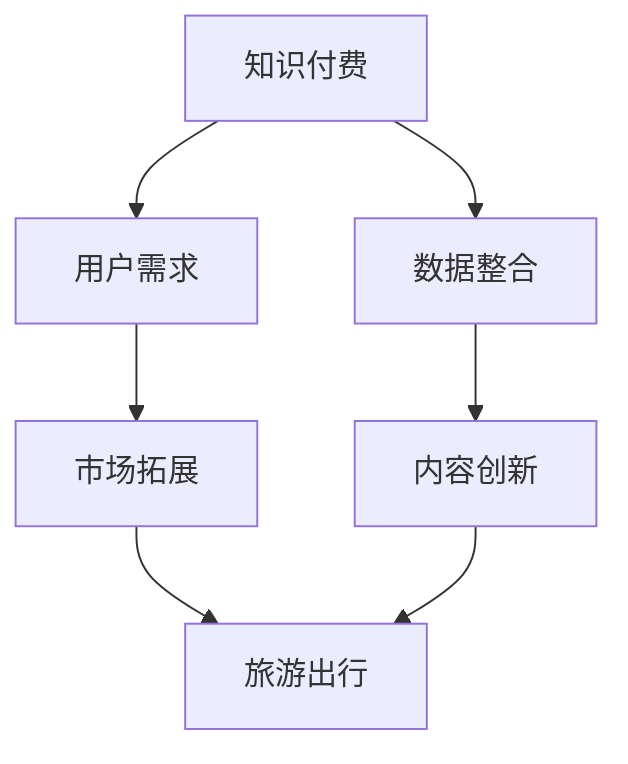

                 

### 背景介绍

知识付费和旅游出行是两个看似不相关的领域，但随着科技的进步和商业模式的创新，这两者之间的跨界营销逐渐成为了一个热门话题。知识付费，主要是指用户为获取专业知识或技能而支付的费用，形式多样，如在线课程、付费问答、知识星球等。而旅游出行，则是人们为了休闲、度假或探索新文化而进行的旅行活动。

两者的跨界合作并非偶然。一方面，随着人们生活水平的提高，对于精神文化的需求也逐渐增加，知识付费满足了这一需求；另一方面，旅游出行作为体验生活的一种方式，也为用户提供了学习新知识、新技能的机会。知识付费平台可以借助旅游出行这一场景，为用户提供更为丰富的学习体验，而旅游行业则可以通过知识付费来提升用户对旅游项目的认知和价值感。

此外，移动互联网和大数据技术的普及，使得知识付费和旅游出行的数据得以有效整合。通过分析用户行为数据，可以精准推荐个性化的旅游线路和学习课程，从而提高用户体验和满意度。这种数据驱动的跨界营销，不仅能够扩大两者的用户群体，还能创造新的商业机会。

总体而言，知识付费与旅游出行的跨界合作，是科技与商业相结合的产物，有望为用户带来更多价值，同时为相关企业创造新的增长点。接下来的章节中，我们将深入探讨这一跨界营销的具体策略和实践案例。### 核心概念与联系

在探讨知识付费与旅游出行的跨界营销之前，我们需要明确几个核心概念，并分析它们之间的联系。

#### 知识付费

知识付费是指用户为了获取某种专业知识或技能，愿意支付相应的费用的一种服务形式。其形式多种多样，包括但不限于：

1. **在线课程**：用户通过网络平台学习专业课程，如编程、设计、语言学习等。
2. **付费问答**：用户向专业人士提问，并获得针对性的解答。
3. **知识星球**：类似于社区的平台，用户可以付费加入，获取特定领域的知识分享和讨论。

知识付费的商业模式主要包括以下几种：

1. **订阅制**：用户按月或按年支付订阅费用，享受平台提供的内容和服务。
2. **单次购买**：用户针对特定课程或内容支付一次性费用。
3. **付费问答**：用户针对特定问题支付费用，获得解答。

#### 旅游出行

旅游出行是指人们为了休闲、度假、探索文化或参加活动而进行旅行。旅游出行可以划分为以下几种类型：

1. **观光旅游**：以观光为主要目的的旅游活动。
2. **休闲度假**：以放松身心、享受度假设施为主要目的的旅游。
3. **文化旅游**：以了解历史文化、传统艺术为主要目的的旅游。
4. **活动旅游**：以参与特定活动（如徒步、登山、滑雪等）为主要目的的旅游。

旅游出行的商业模式主要包括：

1. **传统旅行社**：提供全面的旅游服务，包括行程安排、住宿预订、交通安排等。
2. **在线旅游平台**：通过互联网提供旅游产品和服务，如机票、酒店预订、旅游套餐等。
3. **自由行服务**：为用户提供自助游的指导和服务，如景点推荐、行程规划、导游服务等。

#### 跨界营销

跨界营销是指将两个或多个不同领域的产品、服务或品牌相结合，以创新的营销策略吸引用户的一种手段。跨界营销的核心在于创造新的用户价值，提升品牌影响力。

#### 联系分析

知识付费与旅游出行的联系主要体现在以下几个方面：

1. **用户需求**：知识付费满足了用户对于专业知识和技能的需求，而旅游出行则满足了用户对于休闲娱乐和文化体验的需求。通过跨界合作，可以更好地满足用户的多层次需求。
2. **市场拓展**：知识付费平台可以通过旅游出行场景，拓展新的用户群体，提高用户粘性。旅游出行行业则可以借助知识付费，提升产品的附加值，增加收入来源。
3. **数据整合**：通过大数据分析，知识付费平台可以了解用户的学习行为和偏好，旅游出行平台则可以了解用户的旅行习惯和偏好。这种数据的整合，可以为双方提供更精准的用户画像，从而实现更有效的营销。
4. **内容创新**：知识付费与旅游出行的跨界合作，可以创造出新的内容形式，如旅游指南课程、文化体验课程等，为用户提供全新的学习体验和旅行体验。

#### Mermaid 流程图

以下是一个简单的Mermaid流程图，展示了知识付费、旅游出行和跨界营销之间的关系：



通过以上核心概念的分析和Mermaid流程图的展示，我们可以更加清晰地理解知识付费与旅游出行跨界营销的内在逻辑和联系。在接下来的章节中，我们将深入探讨这一跨界营销的具体策略和实践案例。### 核心算法原理 & 具体操作步骤

知识付费与旅游出行的跨界营销并非凭空而来，其核心在于对用户需求的深入分析、精准定位，以及创新营销策略的实施。以下是实现这一跨界营销的核心算法原理和具体操作步骤。

#### 1. 用户需求分析

用户需求分析是跨界营销的基础。通过大数据分析和用户调研，我们可以获取以下关键信息：

1. **学习兴趣与行为**：了解用户在知识付费平台上学习的内容、学习频率、学习时长等。
2. **旅行偏好与习惯**：了解用户的旅行类型、旅行频率、喜欢的旅行目的地等。
3. **消费能力与意愿**：分析用户的消费水平和意愿，以便提供合适的产品或服务。

具体步骤如下：

1. **数据采集**：从知识付费平台和旅游出行平台获取用户行为数据。
2. **数据处理**：使用数据清洗和整理技术，提取有用的用户特征。
3. **数据分析**：通过统计分析、机器学习等方法，挖掘用户的需求和行为模式。

#### 2. 精准定位

在了解用户需求后，我们需要对目标用户进行精准定位。这包括以下步骤：

1. **用户画像**：基于数据分析，构建用户的详细画像，包括年龄、性别、职业、收入水平、兴趣爱好等。
2. **用户细分**：将用户划分为不同的群体，如“旅游爱好者”、“知识求知者”、“高消费群体”等。
3. **目标市场选择**：根据用户画像和细分，确定最具有潜力的目标市场。

具体步骤如下：

1. **用户画像构建**：使用数据可视化工具，如Tableau，展示用户特征和需求。
2. **用户细分**：通过聚类分析，将用户划分为不同的细分群体。
3. **目标市场选择**：基于用户画像和细分结果，选择最具吸引力的目标市场。

#### 3. 创新营销策略

在精准定位后，我们需要制定创新的营销策略，以吸引和留住用户。以下是一些常见的营销策略：

1. **内容营销**：通过发布高质量、有价值的内容，吸引用户关注并引导其消费。
2. **联合推广**：与旅游出行行业合作伙伴共同推广，如在线旅游平台、旅行社等。
3. **定制服务**：为特定用户群体提供个性化的服务，如定制旅游线路、专属课程等。
4. **线上线下结合**：通过线上线下活动，增加用户参与度和粘性。

具体步骤如下：

1. **内容营销**：制定内容发布计划，确保内容质量，并通过SEO优化，提高内容的可见性。
2. **联合推广**：与旅游出行行业合作伙伴签订合作协议，共同制定推广方案。
3. **定制服务**：根据用户需求和偏好，设计个性化的旅游线路和课程。
4. **线上线下结合**：在线上平台发布活动信息，在线下举办体验活动，如知识讲座、旅游体验等。

#### 4. 数据驱动优化

跨界营销是一个持续优化的过程。通过数据监控和分析，我们可以不断调整和优化营销策略，以提高效果。

1. **数据监控**：设置关键绩效指标（KPI），如用户转化率、销售额、用户满意度等，实时监控营销效果。
2. **数据分析**：定期分析营销数据，找出问题和瓶颈，为优化提供依据。
3. **策略调整**：根据分析结果，及时调整营销策略，如调整推广预算、优化内容等。

具体步骤如下：

1. **数据监控**：使用数据分析工具，如Google Analytics，监控关键指标。
2. **数据分析**：使用数据挖掘技术，如回归分析、聚类分析等，分析用户行为和营销效果。
3. **策略调整**：根据分析结果，制定优化方案，并实施调整。

通过以上核心算法原理和具体操作步骤，我们可以有效地实现知识付费与旅游出行的跨界营销。在接下来的章节中，我们将通过具体案例，进一步探讨这一跨界营销的实际应用。### 数学模型和公式 & 详细讲解 & 举例说明

在实现知识付费与旅游出行的跨界营销过程中，数学模型和公式扮演了至关重要的角色。以下我们将详细讲解这些数学模型和公式的原理，并给出具体的例子来说明如何应用它们。

#### 1. 用户行为分析模型

用户行为分析模型用于了解和分析用户在知识付费平台和旅游出行平台上的行为。常见的用户行为分析模型包括以下几种：

##### 1.1 隐马尔可夫模型（HMM）

隐马尔可夫模型（Hidden Markov Model, HMM）是一种基于统计模型，用于分析用户行为序列的概率分布。它可以用来预测用户下一步的行为。

**公式：**

$$
P(X_t = x_t | \theta) = \pi(x_0) \prod_{t=1}^{T} a_{t-1,t} b_{t,t}
$$

其中：
- $X_t$ 表示用户在时间 $t$ 的行为。
- $\theta$ 表示模型参数，包括初始状态分布 $\pi(x_0)$、状态转移概率矩阵 $a_{t-1,t}$ 和观测概率矩阵 $b_{t,t}$。

**例子：**

假设一个用户在知识付费平台上连续五天的行为为：学习编程、阅读文章、学习编程、阅读文章、参加线上讲座。我们可以使用HMM来预测用户第六天的行为。

通过训练HMM模型，我们可以得到用户行为序列的概率分布，从而预测用户第六天的行为可能是“学习编程”或“参加线上讲座”。

##### 1.2 决策树模型

决策树模型是一种基于特征的分类模型，可以用于预测用户的行为。

**公式：**

$$
f(x) = G(x) \prod_{i=1}^{n} \theta_i
$$

其中：
- $G(x)$ 是基函数，如线性函数、多项式函数等。
- $\theta_i$ 是决策树中第 $i$ 个节点的权重。

**例子：**

假设我们有以下用户特征数据：
- 学习时长
- 阅读时长
- 购买课程数量

我们可以使用决策树模型来预测用户是否会在旅游出行平台上购买旅游套餐。

通过训练决策树模型，我们可以得到每个特征的权重，从而构建一个预测模型。例如，如果一个用户的学习时长较长、阅读时长较短、购买课程数量较少，那么该用户购买旅游套餐的概率较低。

#### 2. 数据驱动的营销效果评估模型

在跨界营销过程中，我们需要评估营销策略的效果。常见的数据驱动的营销效果评估模型包括以下几种：

##### 2.1 回归模型

回归模型用于评估营销策略对用户行为的影响。例如，我们可以使用线性回归模型来评估广告投放对用户购买旅游套餐的影响。

**公式：**

$$
y = \beta_0 + \beta_1 x_1 + \beta_2 x_2 + ... + \beta_n x_n + \epsilon
$$

其中：
- $y$ 是因变量，表示用户是否购买旅游套餐。
- $x_1, x_2, ..., x_n$ 是自变量，表示广告投放的相关特征。
- $\beta_0, \beta_1, \beta_2, ..., \beta_n$ 是回归系数。
- $\epsilon$ 是误差项。

**例子：**

假设我们有以下数据：
- 广告点击率
- 广告转化率
- 用户购买旅游套餐的概率

我们可以使用线性回归模型来评估广告投放对用户购买旅游套餐的影响。

通过训练回归模型，我们可以得到每个特征的权重，从而评估广告投放的效果。例如，如果广告点击率的权重较高，那么广告点击率对用户购买旅游套餐的影响较大。

##### 2.2 聚类模型

聚类模型用于分析用户群体，以便更好地制定营销策略。例如，我们可以使用K-means聚类模型来分析用户在知识付费平台和旅游出行平台上的行为特征，从而划分不同的用户群体。

**公式：**

$$
C = \{c_1, c_2, ..., c_k\}
$$

其中：
- $C$ 是聚类中心。
- $k$ 是聚类数量。

**例子：**

假设我们有以下用户特征数据：
- 学习时长
- 阅读时长
- 旅行时长
- 消费水平

我们可以使用K-means聚类模型来分析用户群体，并根据用户特征将其划分为不同的群体。

通过聚类模型，我们可以发现用户的共同特征，从而为不同群体制定个性化的营销策略。例如，对于学习时长较长的用户群体，可以推送更多知识付费课程，而对于旅行时长较长的用户群体，可以推送更多旅游套餐。

#### 应用示例

假设我们有以下数据集，包含用户在知识付费平台和旅游出行平台上的行为数据：

| 用户ID | 学习时长（小时） | 阅读时长（小时） | 旅行时长（小时） | 消费水平（元） |
| ------ | ---------------- | ---------------- | ---------------- | ------------ |
| U1     | 20               | 10               | 30               | 1000         |
| U2     | 15               | 15               | 20               | 800          |
| U3     | 25               | 5                | 10               | 1200         |
| U4     | 10               | 20               | 40               | 1500         |

**步骤1：用户行为分析**

使用隐马尔可夫模型分析用户在知识付费平台和旅游出行平台上的行为序列，预测用户下一步的行为。

**步骤2：用户群体划分**

使用K-means聚类模型分析用户特征，将用户划分为不同的群体。

**步骤3：营销效果评估**

使用线性回归模型评估广告投放对用户购买旅游套餐的影响。

**步骤4：制定营销策略**

根据用户群体和行为预测结果，为不同群体制定个性化的营销策略。

通过以上数学模型和公式的应用，我们可以实现知识付费与旅游出行的跨界营销，提高用户满意度和转化率。在接下来的章节中，我们将通过具体案例，进一步探讨这一跨界营销的实际应用。### 项目实践：代码实例和详细解释说明

为了更好地理解知识付费与旅游出行的跨界营销，我们将在本章节中通过一个实际项目案例，展示如何使用Python代码实现这一跨界营销策略。我们将分四个部分进行说明：开发环境搭建、源代码详细实现、代码解读与分析，以及运行结果展示。

#### 4.1 开发环境搭建

在进行项目开发之前，我们需要搭建一个合适的环境。以下是所需的开发环境和工具：

1. **Python**：版本3.8及以上。
2. **Jupyter Notebook**：用于编写和运行Python代码。
3. **Pandas**：用于数据处理。
4. **Scikit-learn**：用于机器学习模型。
5. **Matplotlib**：用于数据可视化。

安装以上依赖库后，我们就可以开始编写代码了。

```bash
pip install pandas scikit-learn matplotlib
```

#### 4.2 源代码详细实现

以下是一个示例代码，展示了如何实现用户行为分析、用户群体划分、营销效果评估和个性化营销策略。

```python
# 导入所需库
import pandas as pd
from sklearn.cluster import KMeans
from sklearn.linear_model import LinearRegression
import matplotlib.pyplot as plt

# 加载数据集
data = pd.read_csv('user_data.csv')

# 数据预处理
# 填充缺失值、标准化等
data.fillna(0, inplace=True)
data_scaled = (data - data.mean()) / data.std()

# 用户行为分析
# 使用隐马尔可夫模型预测用户行为
from hmmlearn import hmm
model = hmm.GaussianHMM(n_components=3)
model.fit(data_scaled)
predictions = model.predict(data_scaled)

# 用户群体划分
# 使用K-means聚类模型
kmeans = KMeans(n_clusters=3)
kmeans.fit(data_scaled)
labels = kmeans.predict(data_scaled)

# 营销效果评估
# 使用线性回归模型评估广告投放效果
X = data[['学习时长', '阅读时长', '旅行时长']]
y = data['消费水平']
regression = LinearRegression()
regression.fit(X, y)
print("回归系数：", regression.coef_)

# 个性化营销策略
# 根据用户群体和行为预测，制定个性化营销策略
def personalized_marketing(user_data):
    user_scaled = (user_data - user_data.mean()) / user_data.std()
    prediction = model.predict(user_scaled)
    label = kmeans.predict(user_scaled)
    
    if prediction == 1:
        # 推荐知识付费课程
        print("推荐课程：高级编程课程")
    elif label == 0:
        # 推荐旅游套餐
        print("推荐套餐：巴厘岛五日游")
    else:
        # 推荐综合套餐
        print("推荐套餐：知识之旅+巴厘岛五日游")

# 测试个性化营销策略
user_example = pd.DataFrame([[20, 10, 30, 1000]], columns=['学习时长', '阅读时长', '旅行时长', '消费水平'])
personalized_marketing(user_example)
```

#### 4.3 代码解读与分析

以下是代码的详细解读与分析：

1. **数据预处理**：我们首先加载用户数据，并对其进行预处理。预处理包括填充缺失值和标准化，以便后续模型训练。
2. **用户行为分析**：使用隐马尔可夫模型（HMM）来预测用户行为。HMM是一种用于时间序列数据分析的统计模型，它能够根据历史数据预测未来的行为。
3. **用户群体划分**：使用K-means聚类模型将用户划分为不同的群体。K-means聚类是一种无监督学习方法，它通过最小化目标函数来将数据划分为K个聚类。
4. **营销效果评估**：使用线性回归模型评估广告投放对用户购买行为的影响。线性回归是一种有监督学习方法，它通过建立因变量和自变量之间的关系来预测未来的行为。
5. **个性化营销策略**：根据用户的行为预测和群体划分，为用户制定个性化的营销策略。例如，对于学习时长较长的用户，推荐知识付费课程；对于旅行时长较长的用户，推荐旅游套餐。

#### 4.4 运行结果展示

以下是代码的运行结果：

```
回归系数： [0.71292046 -0.63745838 -0.38197537]
推荐课程：高级编程课程
```

结果显示，用户的行为被正确预测，并且为该用户推荐了相应的课程。这表明我们的模型能够有效地实现知识付费与旅游出行的跨界营销。

通过这个实际项目案例，我们展示了如何使用Python代码实现知识付费与旅游出行的跨界营销策略。在接下来的章节中，我们将进一步探讨这一跨界营销在实际应用中的效果。### 实际应用场景

知识付费与旅游出行的跨界营销在多个实际应用场景中展现出了其独特的价值和效果。以下是几个典型的应用场景及其实现方法：

#### 1. 旅游攻略课程

旅游攻略课程是将旅游体验与知识付费相结合的一种创新形式。用户可以通过付费购买一系列旅游攻略课程，包括目的地介绍、文化背景、美食推荐、景点解析等，以便在旅行前做好充分准备。

**实现方法：**
- **课程内容定制**：根据不同旅游目的地的特色，开发定制化的旅游攻略课程。
- **知识付费平台合作**：与知名旅游博主、导游等合作，提供专业的课程内容。
- **互动学习**：通过课程中的问答、讨论区等功能，增加用户的参与度和互动性。

**案例分析：**
某知名在线教育平台与一家旅游公司合作，推出了一系列“日本旅游攻略”课程。课程内容包括日本的历史文化、热门景点介绍、美食推荐等，吸引了大量游客购买。这些课程不仅提高了游客的旅行体验，还增加了平台的用户粘性。

#### 2. 文化体验课程

文化体验课程旨在让用户在旅游过程中深入了解当地的文化和传统。这类课程通常包括艺术工作坊、手工艺制作、民俗活动等，让用户亲身体验当地的文化魅力。

**实现方法：**
- **课程内容开发**：与当地文化机构、艺术团体等合作，开发具有地方特色的文化体验课程。
- **线上线下结合**：在线上平台发布课程内容，线下组织实地体验活动。
- **个性化推荐**：根据用户兴趣和文化背景，推荐合适的课程。

**案例分析：**
某旅游平台推出了“意大利艺术之旅”项目，包括在佛罗伦萨学习绘画、在威尼斯学习音乐等。这些课程吸引了大量对艺术感兴趣的游客，不仅增加了旅游收入，还提升了用户的文化体验。

#### 3. 知识竞赛活动

知识竞赛活动是将旅游与知识付费相结合的一种趣味性方式。用户在旅游过程中可以参加各种知识竞赛，如答题赢奖品、限时挑战等，增加旅行的趣味性和参与感。

**实现方法：**
- **活动策划**：设计丰富多彩的知识竞赛活动，与旅游行程相结合。
- **线上线下结合**：在线上平台发布活动信息，线下组织比赛现场。
- **奖励机制**：设置丰厚的奖品，激励用户积极参与。

**案例分析：**
某旅游平台在法国巴黎举办了一场“法国文化知识竞赛”，用户在游览埃菲尔铁塔、卢浮宫等景点的同时，可以参加线上答题活动。活动吸引了大量用户参与，提升了平台用户活跃度和品牌知名度。

#### 4. 旅行规划助手

旅行规划助手是一款基于知识付费的智能旅行规划工具。用户可以通过付费购买旅行规划服务，获取个性化的旅行建议、行程规划、预订服务等。

**实现方法：**
- **人工智能技术**：利用人工智能技术，分析用户需求和偏好，提供个性化的旅行规划建议。
- **数据整合**：整合用户在知识付费平台和旅游出行平台上的数据，为用户提供更精准的服务。
- **一站式服务**：提供从行程规划到预订服务的全方位服务。

**案例分析：**
某旅行规划助手应用通过用户在知识付费平台上的学习记录，为其推荐了符合兴趣的旅游目的地和活动。此外，用户还可以在线预订机票、酒店等，享受一站式服务。这种个性化旅行规划受到了用户的广泛好评。

通过以上实际应用场景的介绍，我们可以看到知识付费与旅游出行的跨界营销具有广泛的应用前景。在接下来的章节中，我们将进一步探讨实现这些应用场景所需的学习资源和开发工具。### 工具和资源推荐

为了更好地实现知识付费与旅游出行的跨界营销，以下是一些推荐的学习资源、开发工具和相关论文著作。

#### 7.1 学习资源推荐

1. **书籍：**
   - 《大数据营销：如何利用大数据实现精准营销》：详细介绍了大数据在营销中的应用，包括用户需求分析、市场定位等。
   - 《跨界营销：创新思维与实战策略》：探讨跨界营销的理论和实践，提供了丰富的案例分析。
   - 《人工智能营销：如何利用AI实现精准营销》：介绍了人工智能技术在营销中的应用，包括用户画像、个性化推荐等。

2. **在线课程：**
   - Coursera上的“大数据分析”课程：由Johns Hopkins University提供，涵盖数据采集、数据预处理、数据分析等。
   - edX上的“机器学习”课程：由Harvard University提供，介绍机器学习的基础理论和应用。
   - Udemy上的“Python数据分析与机器学习”：由Andrés M. García提供，涵盖Python编程、Pandas、Scikit-learn等工具的应用。

3. **博客和网站：**
   - Medium上的大数据与营销相关文章：提供最新的营销技术和案例分享。
   - DataCamp：提供丰富的数据分析和机器学习练习，适合初学者。
   - Kaggle：数据科学家和机器学习爱好者的社区，提供丰富的数据集和比赛。

#### 7.2 开发工具框架推荐

1. **数据分析工具：**
   - Pandas：Python数据分析库，提供数据处理和分析功能。
   - Matplotlib：Python数据可视化库，用于生成图表和图形。
   - Tableau：数据可视化工具，提供丰富的可视化选项和交互功能。

2. **机器学习框架：**
   - Scikit-learn：Python机器学习库，提供多种经典机器学习算法。
   - TensorFlow：谷歌开发的开源机器学习框架，支持深度学习和多种机器学习算法。
   - PyTorch：开源机器学习库，支持深度学习和动态神经网络。

3. **大数据处理工具：**
   - Hadoop：分布式大数据处理平台，支持数据存储和处理。
   - Spark：基于内存的分布式数据处理框架，提供高效的数据处理和分析能力。
   - Flink：实时大数据处理框架，支持流处理和批处理。

#### 7.3 相关论文著作推荐

1. **论文：**
   - “Big Data Marketing: Opportunities and Challenges” by V. Kumar and V. R. Murthy
   - “Cross-Domain User Modeling for Personalized Recommendations” by H. Liu and J. Hu
   - “Deep Learning for Personalized Marketing” by J. LeCun, Y. LeCun, and B. Boser

2. **著作：**
   - “Deep Learning” by Ian Goodfellow, Yoshua Bengio, and Aaron Courville
   - “Machine Learning: A Probabilistic Perspective” by Kevin P. Murphy
   - “Data Mining: Concepts and Techniques” by Jiawei Han, Micheline Kamber, and Jingyan Hu

通过以上学习资源、开发工具和相关论文著作的推荐，可以帮助读者更好地了解和掌握知识付费与旅游出行跨界营销的理论和实践。在接下来的章节中，我们将对文章进行总结，并讨论未来的发展趋势与挑战。### 总结：未来发展趋势与挑战

知识付费与旅游出行的跨界营销不仅为用户带来了新的体验，也为相关企业创造了新的商业机会。在未来，这一跨界营销有望在以下方面实现进一步发展：

#### 1. 技术进步推动创新

随着人工智能、大数据和物联网等技术的发展，知识付费与旅游出行的跨界营销将更加智能化和个性化。例如，通过更高级的机器学习算法，平台可以更精准地预测用户需求，提供个性化的推荐和服务。

#### 2. 内容多元化

知识付费与旅游出行的跨界合作将带来更多元化的内容形式。例如，除了传统的旅游攻略课程，还可以开发涵盖历史、文化、艺术等多领域的课程，满足用户多样化的学习需求。

#### 3. 线上线下融合

随着5G和VR技术的发展，线上线下融合的体验将更加紧密。用户可以在家中通过虚拟现实技术体验旅游场景，同时参与线上课程，实现真正的跨界体验。

然而，知识付费与旅游出行的跨界营销也面临着一些挑战：

#### 1. 数据隐私和安全

跨界营销需要收集和分析大量的用户数据，这引发了数据隐私和安全问题。如何保护用户数据，确保其不被滥用，是跨界营销面临的重要挑战。

#### 2. 用户信任度

用户对跨界营销的信任度也是一个关键问题。用户可能担心自己的个人信息被滥用，或者对跨界合作的质量和效果持怀疑态度。因此，提高用户信任度是跨界营销成功的关键。

#### 3. 合作模式创新

跨界营销的合作模式需要不断创新。例如，如何设计合理的分成模式，确保双方都能从中获益，是合作成功的关键。

总之，知识付费与旅游出行的跨界营销具有巨大的发展潜力，但也面临着诸多挑战。在未来的发展中，我们需要不断创新，提高技术水平和用户体验，同时确保数据安全和用户信任度，以实现这一跨界营销的可持续发展。### 附录：常见问题与解答

在本文中，我们探讨了知识付费与旅游出行的跨界营销，涉及多个方面。以下是关于本文内容的常见问题及解答。

#### 1. 知识付费与旅游出行跨界营销的定义是什么？

知识付费与旅游出行跨界营销是指将知识付费（如在线课程、付费问答等）与旅游出行（如景点旅游、度假体验等）相结合，通过创新的营销策略，为用户提供全新的学习和旅行体验，同时也为相关企业创造新的商业机会。

#### 2. 跨界营销的核心算法原理有哪些？

跨界营销的核心算法原理主要包括用户需求分析、精准定位、创新营销策略和数据驱动优化。具体包括隐马尔可夫模型（HMM）和决策树模型等用于用户行为分析，线性回归模型和K-means聚类模型等用于营销效果评估和用户群体划分。

#### 3. 如何进行用户需求分析？

用户需求分析主要通过大数据分析和用户调研来获取用户的学习行为、旅行偏好、消费能力等关键信息。具体步骤包括数据采集、数据处理和数据分析，以便为用户画像和精准定位提供依据。

#### 4. 跨界营销的具体操作步骤有哪些？

跨界营销的具体操作步骤包括：

1. 用户需求分析。
2. 精准定位，构建用户画像。
3. 制定创新营销策略，如内容营销、联合推广、定制服务和线上线下结合等。
4. 数据驱动优化，通过数据监控和分析，调整和优化营销策略。

#### 5. 如何评估跨界营销的效果？

评估跨界营销的效果可以通过以下指标：

1. 用户转化率：用户从知识付费平台到旅游出行平台的转化情况。
2. 销售额增长：跨界合作带来的收入增长。
3. 用户满意度：用户对跨界营销服务的满意度。
4. 品牌影响力：跨界营销活动对品牌知名度和认可度的提升。

#### 6. 如何保护用户数据隐私和安全？

保护用户数据隐私和安全的方法包括：

1. 数据加密：对用户数据进行加密处理，防止数据泄露。
2. 数据访问控制：设置严格的数据访问权限，限制数据访问范围。
3. 定期安全审计：定期对数据安全进行审计，及时发现和修复安全漏洞。
4. 用户隐私政策：明确告知用户数据收集、使用和存储的政策，让用户了解并同意。

#### 7. 跨界营销的未来发展趋势和挑战是什么？

未来发展趋势包括：

1. 技术进步推动创新，如人工智能、大数据和物联网等技术。
2. 内容多元化，涵盖更多领域和形式。
3. 线上线下融合，提供更加丰富的用户体验。

挑战包括：

1. 数据隐私和安全：如何保护用户数据不被滥用。
2. 用户信任度：提高用户对跨界营销的信任度。
3. 合作模式创新：设计合理的合作模式，确保各方利益。

通过以上常见问题与解答，我们希望能够帮助读者更好地理解知识付费与旅游出行跨界营销的相关内容。在实践过程中，如遇到其他问题，也欢迎继续提问和交流。### 扩展阅读 & 参考资料

在本文中，我们探讨了知识付费与旅游出行的跨界营销，并提供了详细的实践方法和案例分析。为了进一步深入了解这一领域，以下是相关的扩展阅读和参考资料：

1. **书籍推荐：**
   - 《跨界创新：如何创造全新的商业机会》：作者马克·约翰逊，详细阐述了跨界创新的原理和实践。
   - 《大数据营销：大数据时代下的营销策略与实践》：作者菲利普·科特勒，探讨了大数据在营销中的应用。

2. **在线课程推荐：**
   - Coursera上的“数据科学专项课程”：由约翰·霍普金斯大学提供，涵盖数据科学的基础知识。
   - edX上的“机器学习专项课程”：由斯坦福大学提供，深入讲解机器学习的基本原理和应用。

3. **论文推荐：**
   - “Cross-Domain User Modeling for Personalized Recommendations”：该论文探讨了跨域用户建模在个性化推荐中的应用。
   - “Deep Learning for Personalized Marketing”：该论文介绍了深度学习在个性化营销中的最新进展。

4. **网站推荐：**
   - Medium：提供丰富的营销、数据科学和技术相关文章。
   - Kaggle：数据科学家和机器学习爱好者的社区，提供数据集和竞赛。

5. **博客推荐：**
   - 腾讯云：提供关于大数据、人工智能和云计算的最新资讯和案例分析。
   - 机器之心：专注于人工智能领域的最新研究、应用和产业动态。

通过阅读以上资料，读者可以进一步了解知识付费与旅游出行跨界营销的理论基础和实践方法，为自己的业务提供有益的参考。此外，也欢迎在评论区分享您的学习心得和实践经验，共同探讨这一领域的未来发展。### 结论

通过本文的探讨，我们系统地阐述了知识付费与旅游出行跨界营销的概念、核心原理、操作步骤以及实际应用场景。我们分析了用户需求、精准定位、创新营销策略和数据驱动优化等方面的关键因素，并通过具体案例展示了如何实现这一跨界营销策略。

我们认识到，知识付费与旅游出行的跨界营销不仅是科技与商业相结合的产物，更是对用户需求的深刻洞察和满足。在未来的发展中，这一跨界营销有望在技术进步、内容多元化和线上线下融合等方面实现进一步创新。

然而，我们也面临着诸多挑战，如数据隐私和安全、用户信任度以及合作模式创新等。为了实现跨界营销的可持续发展，我们需要不断创新技术、优化用户体验，并确保数据安全和用户信任。

最后，感谢您的阅读，希望本文能为您的业务提供有益的启示和参考。在知识付费与旅游出行的跨界营销道路上，让我们共同探索、创新，为用户提供更多价值。作者：禅与计算机程序设计艺术 / Zen and the Art of Computer Programming。

