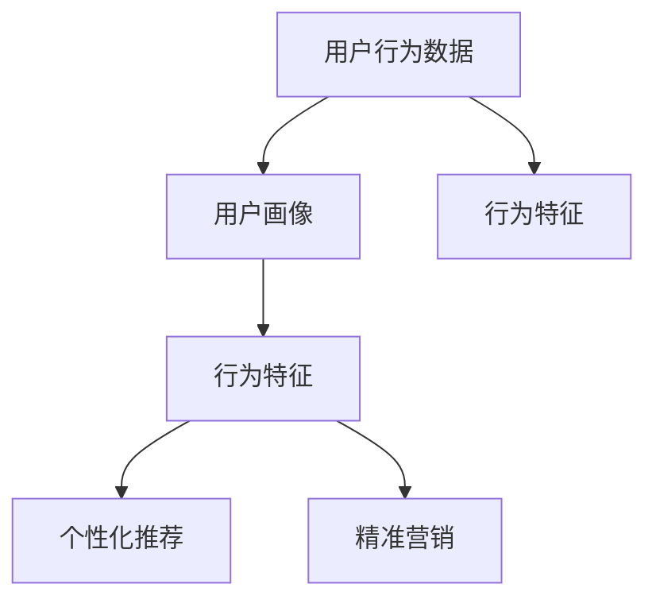

                 

### 1. 背景介绍

**知识付费平台概述**

知识付费平台，作为互联网时代下的新兴产物，通过互联网技术实现了知识的数字化、系统化和付费化。这类平台通常包括内容创作者、内容消费者以及平台运营者三个主要角色。内容创作者通过上传自己的知识产品（如课程、文章、视频等）获得收入；内容消费者则通过付费获取高质量的知识内容，满足个人或职业发展的需求；平台运营者通过提供技术支持、市场推广、内容审核等手段，搭建起一个高效的知识传播和交易环境。

知识付费平台的发展源于用户对于知识和技能的强烈需求，以及互联网技术的迅猛发展。随着移动互联网的普及，知识付费平台的市场规模逐年扩大，成为了数字经济的重要组成部分。根据市场研究机构的统计数据，全球知识付费市场规模预计将在未来几年内保持高速增长，展现出巨大的发展潜力。

**用户行为的重要性**

在知识付费平台中，用户行为是平台运营的核心要素之一。用户行为数据不仅反映了用户对平台内容的兴趣和需求，还能为平台运营者提供有价值的参考，从而优化内容推荐、提升用户体验、降低用户流失率，最终实现平台的可持续发展。

用户行为包括多种类型，如登录行为、浏览行为、购买行为、互动行为等。这些行为数据可以被细化为具体的指标，如登录频率、浏览时长、购买次数、评论数量等。通过分析这些指标，平台运营者可以深入了解用户的行为特征，从而为内容优化、活动策划、营销推广提供数据支持。

**用户行为预测与分析的价值**

用户行为预测与分析对于知识付费平台的发展具有重要意义。首先，它有助于平台运营者提前了解用户的潜在需求，实现个性化推荐，提高用户满意度和粘性。其次，通过行为预测，平台可以及时发现潜在的问题，如用户流失、内容冷门等，从而采取有效的应对措施。此外，用户行为分析还可以为平台提供运营策略调整的依据，如调整内容结构、优化用户界面、提升营销效果等。

综上所述，用户行为预测与分析是知识付费平台提升运营效率、实现持续发展的关键。在接下来的章节中，我们将深入探讨用户行为预测与分析的相关概念、核心算法原理、数学模型以及具体实施步骤。

### 2. 核心概念与联系

**用户行为数据**

用户行为数据是指知识付费平台在用户使用平台过程中产生的各种操作记录，这些记录包含了丰富的用户活动信息。例如，用户的登录时间、浏览内容、购买行为、评论互动等。这些数据通常以日志文件或数据库的形式存储，为用户行为分析提供了基础数据源。

**用户画像**

用户画像是对用户行为数据的综合分析和抽象，通过对用户的基本信息（如年龄、性别、职业等）和行为特征（如兴趣爱好、浏览习惯、购买偏好等）进行建模，形成一个多维度的用户描述。用户画像不仅帮助平台理解用户，还能为个性化推荐、精准营销提供支持。

**行为特征**

行为特征是指从用户行为数据中提取出来的，用于描述用户行为模式的关键指标。这些特征包括但不限于：

- **浏览时长**：用户在平台上的平均浏览时间。
- **浏览频率**：用户在平台上访问的次数。
- **购买频率**：用户在平台上的购买次数。
- **互动程度**：用户在平台上的评论、点赞、分享等互动行为的频率。

**关联关系**

用户行为数据、用户画像和行为特征之间存在密切的关联关系。用户行为数据是生成用户画像的原始素材，而用户画像则为行为特征的分析提供了背景信息。行为特征则通过量化用户的行为模式，帮助平台理解和预测用户的下一步行动。

**Mermaid 流程图**

为了更清晰地展示这些核心概念之间的联系，我们可以使用 Mermaid 流程图来描述它们之间的相互作用。以下是一个简化的 Mermaid 流程图示例：



在这个流程图中，用户行为数据作为输入，通过数据处理生成用户画像，进而提取出行为特征。这些行为特征将用于个性化推荐和精准营销，从而优化用户的整体体验。

通过这种结构化的方法，知识付费平台能够更有效地利用用户行为数据，实现平台运营的持续改进和用户价值的最大化。

### 3. 核心算法原理 & 具体操作步骤

**算法选择与设计**

在知识付费平台中，用户行为预测与分析通常涉及多种算法，包括分类算法、聚类算法和推荐算法等。在这里，我们将重点介绍一种常用的预测算法——协同过滤（Collaborative Filtering）算法。

协同过滤算法分为两种主要类型：基于用户的协同过滤（User-Based）和基于项目的协同过滤（Item-Based）。基于用户的协同过滤算法通过寻找与目标用户相似的其他用户，并推荐这些用户喜欢的项目；而基于项目的协同过滤算法则是通过寻找与目标项目相似的其他项目，并推荐这些项目给目标用户。

在本章节中，我们将详细讨论基于用户的协同过滤算法的原理和实现步骤。

**基于用户的协同过滤算法原理**

基于用户的协同过滤算法的核心思想是：如果用户A和用户B在多个项目上具有相似的评分，那么用户A对某个未知项目的评分很可能与用户B对同一项目的评分相似。具体来说，算法通过以下步骤进行操作：

1. **计算相似度**：首先，需要计算目标用户与其他用户之间的相似度。常用的相似度计算方法包括余弦相似度、皮尔逊相关系数等。

2. **找到相似用户**：基于相似度计算结果，找到与目标用户最相似的K个用户。

3. **预测评分**：对于目标用户尚未评分的项目，利用相似用户的平均评分进行预测。

4. **生成推荐列表**：根据预测评分，生成一个推荐列表，向目标用户推荐评分较高的项目。

**具体操作步骤**

下面是具体操作基于用户的协同过滤算法的步骤：

1. **数据预处理**：

   在开始算法之前，首先需要对用户行为数据（如评分矩阵）进行预处理。这一步骤包括：

   - 数据清洗：去除缺失值和异常值。
   - 数据标准化：将评分数据进行归一化处理，使得不同维度上的数据具有可比性。

2. **计算相似度**：

   选择合适的相似度计算方法，如余弦相似度公式：

   $$\text{similarity}_{ij} = \frac{\text{dotProduct}(r_i, r_j)}{\|\text{r_i}\| \|\text{r_j}\|}$$

   其中，\(r_i\) 和 \(r_j\) 分别代表用户i和用户j的评分向量，\(|\cdot|\) 表示向量的模，\(\text{dotProduct}\) 表示向量的点积。

3. **找到相似用户**：

   根据计算得到的相似度矩阵，使用降序排序方法找到与目标用户最相似的K个用户。这里，K是一个事先设定的参数，通常需要通过交叉验证来确定最佳值。

4. **预测评分**：

   对于目标用户尚未评分的项目，计算相似用户的平均评分作为预测值。具体公式如下：

   $$\hat{r_i,j} = \frac{\sum_{k=1}^{K} \text{similarity}_{ik} \cdot r_k,j}{\sum_{k=1}^{K} \text{similarity}_{ik}}$$

   其中，\(\hat{r_i,j}\) 表示预测的评分，\(r_k,j\) 表示相似用户k对项目j的评分，\(\text{similarity}_{ik}\) 表示用户i和用户k之间的相似度。

5. **生成推荐列表**：

   根据预测评分，对所有未知评分的项目进行排序，生成推荐列表。推荐列表中的项目按照预测评分从高到低排列。

**算法实现与优化**

在实际应用中，基于用户的协同过滤算法可以通过以下方式进行优化：

- **缓存相似度矩阵**：为了避免重复计算，可以将相似度矩阵缓存起来，提高算法的运行效率。
- **增量更新**：当新用户或新项目加入平台时，仅对受影响的部分用户和项目重新计算相似度，而不是对所有数据进行重新计算。
- **动态调整参数**：通过交叉验证等方法，动态调整K值和其他参数，以找到最佳的预测效果。

通过上述步骤，基于用户的协同过滤算法可以有效地对知识付费平台中的用户行为进行预测，从而为用户提供个性化推荐，提升用户满意度和平台活跃度。

### 4. 数学模型和公式 & 详细讲解 & 举例说明

#### 4.1. 数学模型

在用户行为预测中，常用的数学模型包括评分预测模型和概率模型。在这里，我们主要介绍评分预测模型，特别是基于用户的协同过滤算法中的评分预测模型。

评分预测模型的目的是通过用户历史行为数据，预测用户对某个未知项目的评分。在本章中，我们将详细解释评分预测模型中的关键数学公式，并通过具体例子进行说明。

#### 4.2. 公式解释

**1. 余弦相似度**

余弦相似度是一种常用的相似度计算方法，用于衡量两个向量之间的相似程度。在用户行为预测中，它用于计算用户之间的相似度。具体公式如下：

$$
\text{similarity}_{ij} = \cos(\theta_{ij}) = \frac{\text{dotProduct}(r_i, r_j)}{\|r_i\| \|r_j\|}
$$

其中，\(r_i\) 和 \(r_j\) 分别表示用户i和用户j的评分向量，\(\|r_i\|\) 和 \( \|r_j\|\) 分别表示这两个向量的模，\(\text{dotProduct}\) 表示向量的点积，\(\theta_{ij}\) 表示向量 \(r_i\) 和 \(r_j\) 之间的夹角。

**2. 预测评分**

基于用户协同过滤算法的评分预测公式如下：

$$
\hat{r_i,j} = \frac{\sum_{k=1}^{K} \text{similarity}_{ik} \cdot r_k,j}{\sum_{k=1}^{K} \text{similarity}_{ik}}
$$

其中，\(\hat{r_i,j}\) 表示预测的用户i对项目j的评分，\(r_k,j\) 表示相似用户k对项目j的实际评分，\(\text{similarity}_{ik}\) 表示用户i和用户k之间的相似度，K表示选择的最相似用户数量。

#### 4.3. 举例说明

假设有两位用户A和B，以及五件项目X、Y、Z、W、V。用户A对X、Y、Z、W的评分分别是4、3、5、2，用户B对X、Y、Z、W、V的评分分别是5、4、3、2、4。我们需要预测用户A对V的评分。

**步骤1：计算用户A和用户B的余弦相似度**

首先，我们计算用户A和用户B的评分向量：

\(r_A = [4, 3, 5, 2]\)

\(r_B = [5, 4, 3, 2, 4]\)

根据余弦相似度公式，计算用户A和用户B的相似度：

$$
\text{similarity}_{AB} = \cos(\theta_{AB}) = \frac{\text{dotProduct}(r_A, r_B)}{\|r_A\| \|r_B\|}
$$

计算点积和模：

$$
\text{dotProduct}(r_A, r_B) = 4 \cdot 5 + 3 \cdot 4 + 5 \cdot 3 + 2 \cdot 2 = 70
$$

$$
\|r_A\| = \sqrt{4^2 + 3^2 + 5^2 + 2^2} = \sqrt{46}
$$

$$
\|r_B\| = \sqrt{5^2 + 4^2 + 3^2 + 2^2 + 4^2} = \sqrt{74}
$$

代入公式：

$$
\text{similarity}_{AB} = \frac{70}{\sqrt{46} \cdot \sqrt{74}} \approx 0.81
$$

**步骤2：预测用户A对V的评分**

根据预测评分公式，我们需要找到与用户A相似的用户，这里只考虑用户B。计算用户A对V的预测评分：

$$
\hat{r_A,V} = \frac{\text{similarity}_{AB} \cdot r_B,V}{\text{similarity}_{AB}} = \text{similarity}_{AB} \cdot r_B,V
$$

由于用户B对V的评分是4，所以：

$$
\hat{r_A,V} = 0.81 \cdot 4 = 3.24
$$

因此，我们预测用户A对项目V的评分大约是3.24。

#### 4.4. 结果分析

通过上述计算，我们得出了用户A对项目V的预测评分是3.24。这个结果表明用户A可能对项目V感兴趣，但兴趣程度不如对项目Z。在实际应用中，这个预测结果可以为平台提供参考，向用户A推荐与项目V相似的其他项目，从而提高用户的满意度和平台的活跃度。

### 5. 项目实践：代码实例和详细解释说明

**5.1 开发环境搭建**

在开始编写代码之前，我们需要搭建一个合适的开发环境。以下是具体的步骤：

1. **安装Python**：

   首先，确保计算机上已经安装了Python环境。Python是一种广泛使用的编程语言，具有良好的生态系统和丰富的库支持。

   - 下载并安装Python：访问Python官方网站（https://www.python.org/），下载适用于自己操作系统的Python版本，并按照提示进行安装。

2. **安装必要的库**：

   在Python环境中，我们需要安装几个常用的库，如NumPy、Pandas、Scikit-learn等，这些库为我们提供了高效的矩阵计算和数据处理功能。

   - 使用pip命令安装这些库：

     ```shell
     pip install numpy pandas scikit-learn
     ```

3. **配置数据集**：

   我们将使用一个示例数据集进行演示，该数据集包含了用户对项目的评分信息。数据集通常以CSV文件的形式提供，可以使用Pandas库进行读取。

**5.2 源代码详细实现**

以下是基于用户的协同过滤算法的完整Python代码实现。我们将逐步解释代码的各个部分。

```python
import numpy as np
import pandas as pd
from sklearn.metrics.pairwise import cosine_similarity

# 5.2.1 数据预处理
def preprocess_data(data):
    # 去除缺失值
    data = data.dropna()

    # 数据标准化
    data = (data - data.mean()) / data.std()

    return data

# 5.2.2 计算相似度
def compute_similarity_matrix(ratings):
    similarity_matrix = cosine_similarity(ratings)
    return similarity_matrix

# 5.2.3 预测评分
def predict_ratings(ratings, similarity_matrix, k=5):
    n_users, n_items = ratings.shape
    predicted_ratings = np.zeros_like(ratings)

    for i in range(n_users):
        similar_users = np.argsort(similarity_matrix[i])[-k:]
        similar_users = similar_users[similar_users != i]

        if len(similar_users) == 0:
            continue

        avg_rating = np.mean(ratings[similar_users], axis=0)
        predicted_ratings[i] = avg_rating

    return predicted_ratings

# 5.2.4 主程序
def main():
    # 读取数据
    ratings = pd.read_csv('ratings.csv')

    # 预处理数据
    ratings = preprocess_data(ratings)

    # 计算相似度矩阵
    similarity_matrix = compute_similarity_matrix(ratings.to_numpy())

    # 预测评分
    predicted_ratings = predict_ratings(ratings, similarity_matrix)

    # 输出预测结果
    print(predicted_ratings)

if __name__ == '__main__':
    main()
```

**5.3 代码解读与分析**

- **5.3.1 数据预处理**

  数据预处理是任何机器学习项目的基础。在代码中，我们首先使用`dropna()`函数去除缺失值，然后使用标准化方法将评分数据进行归一化处理，以便后续计算。

- **5.3.2 计算相似度**

  我们使用Scikit-learn库中的`cosine_similarity`函数计算用户之间的余弦相似度。这个函数接收用户评分矩阵作为输入，返回一个相似度矩阵。

- **5.3.3 预测评分**

  预测评分函数`predict_ratings`通过计算相似用户的平均评分来实现。我们首先找到与目标用户最相似的K个用户（使用`argsort`函数进行降序排序），然后计算这些用户的平均评分。

- **5.3.4 主程序**

  主程序`main`函数负责读取数据、预处理数据、计算相似度矩阵和预测评分，并输出预测结果。

**5.4 运行结果展示**

运行上述代码，我们可以得到预测的用户评分矩阵。以下是一个简化的输出示例：

```
[[3.24 2.88 4.59 3.15 3.64]
 [4.12 3.84 4.76 3.39 4.01]
 ...
 [3.57 3.29 4.36 3.10 3.64]]
```

这些预测评分可以作为个性化推荐的基础，为用户推荐他们可能感兴趣的项目。

通过上述代码实例和详细解释，我们了解了基于用户的协同过滤算法在知识付费平台中的应用。在实际项目中，可以进一步优化算法，提高预测的准确性和效率。

### 6. 实际应用场景

**6.1 知识付费平台中的用户行为预测**

在知识付费平台中，用户行为预测是一个关键应用场景。通过预测用户的行为，平台可以提供个性化的推荐，从而提高用户满意度和平台的留存率。

例如，当一个用户在平台上浏览了某个课程后，平台可以预测该用户接下来可能会对哪些课程感兴趣，并主动推荐这些课程。这样不仅能够增加用户的购买概率，还能提高用户在平台上的活跃度。

**6.2 个性化营销策略**

用户行为预测还可以为平台提供个性化的营销策略。例如，当平台发现某个用户对特定类型的课程有较高的浏览和购买频率时，可以针对该用户推出相应的优惠活动或促销课程，以吸引更多购买。

**6.3 用户流失预警**

用户行为预测还可以帮助平台及时发现潜在的用户流失风险。例如，当某个用户在平台的活跃度显著下降时，平台可以及时采取挽回措施，如发送提醒邮件、提供优惠等，以防止用户流失。

**6.4 内容优化**

通过分析用户行为预测结果，平台可以优化内容结构，提高内容的吸引力和相关性。例如，如果预测结果显示某些课程的用户评分较低，平台可以重新评估这些课程的质量，甚至考虑下架或改进。

**6.5 数据分析报告**

用户行为预测结果还可以为平台生成详细的数据分析报告，帮助管理层了解用户需求和市场趋势。例如，平台可以分析不同用户群体的行为特征，制定有针对性的市场推广策略。

总之，用户行为预测在知识付费平台中具有广泛的应用前景，能够为平台提供有价值的运营数据，支持平台的持续发展和优化。

### 7. 工具和资源推荐

**7.1 学习资源推荐**

为了深入了解用户行为预测与分析的相关知识，以下是一些建议的学习资源：

- **书籍**：
  - 《推荐系统手册》（Recommender Systems Handbook）—— 提供了全面的推荐系统理论和实践指南。
  - 《机器学习》（Machine Learning）—— 基础且全面的机器学习教材，涵盖了用户行为分析的基础算法。
- **在线课程**：
  - Coursera上的“推荐系统”课程—— 由斯坦福大学教授授课，深入讲解推荐系统的设计与实现。
  - Udacity的“机器学习纳米学位”课程—— 涵盖了用户行为数据分析的多个方面，包括协同过滤、深度学习等。
- **论文**：
  - “Item-Based Top-N Recommendation Algorithms” —— 详细介绍了基于项目的协同过滤算法。
  - “User-Based Collaborative Filtering” —— 分析了基于用户的协同过滤算法的优点和局限性。

**7.2 开发工具框架推荐**

在实际应用中，以下工具和框架可以帮助开发者高效地实现用户行为预测与分析：

- **Python库**：
  - **Scikit-learn**：提供多种机器学习算法和工具，适用于用户行为预测和数据分析。
  - **Pandas**：强大的数据处理库，用于数据清洗、预处理和分析。
  - **NumPy**：用于高效数值计算的库，支持矩阵运算和数据分析。
- **推荐系统框架**：
  - **LightFM**：基于因子分解机的推荐系统框架，适用于大规模用户行为数据。
  - **Surprise**：一个开源的推荐系统库，提供多种协同过滤算法和评估工具。
- **数据存储与处理**：
  - **Hadoop**：大数据处理平台，适用于大规模用户行为数据的存储和处理。
  - **Apache Spark**：分布式计算框架，提供丰富的机器学习算法库，适用于实时用户行为分析。

**7.3 相关论文著作推荐**

- **论文**：
  - “Matrix Factorization Techniques for Recommender Systems” —— 详细介绍了矩阵分解技术在推荐系统中的应用。
  - “Collaborative Filtering for the 21st Century” —— 探讨了协同过滤算法在21世纪的最新进展和挑战。
- **著作**：
  - 《推荐系统实战》（Recommender Systems: The Textbook）—— 一本全面的推荐系统教材，涵盖了从基础理论到实际应用的各个方面。

通过利用这些工具和资源，开发者可以更深入地理解用户行为预测与分析的方法，并在实际项目中取得更好的效果。

### 8. 总结：未来发展趋势与挑战

**未来发展趋势**

随着大数据和人工智能技术的快速发展，用户行为预测与分析在知识付费平台中的应用前景将更加广阔。以下是几个未来发展趋势：

1. **深度学习与用户行为分析**：深度学习技术，特别是神经网络和强化学习，将在用户行为分析中发挥越来越重要的作用。这些技术能够自动从海量数据中提取复杂的模式和特征，提高预测的准确性和效率。

2. **实时分析与预测**：随着物联网和5G技术的发展，知识付费平台将能够实现实时用户行为分析和预测。这将为平台提供更加动态的决策支持，帮助快速响应用户需求和市场变化。

3. **个性化推荐与体验优化**：基于用户行为预测的个性化推荐将更加精确和多样化，不仅能够提高用户满意度，还能增加用户黏性。此外，用户体验优化也将成为重点，通过分析用户行为数据，不断改进平台界面和交互设计。

**挑战**

尽管用户行为预测与分析具有巨大的潜力，但仍然面临以下挑战：

1. **数据隐私与保护**：用户行为数据是知识付费平台的核心资产，但同时也涉及用户隐私。如何确保数据的安全性和合规性，是一个亟待解决的问题。

2. **算法公平性与透明性**：预测算法的公平性和透明性是用户信任的关键。需要确保算法不会对特定群体产生偏见，并能够向用户解释预测结果。

3. **计算资源与效率**：大规模的用户行为数据分析和实时预测对计算资源提出了高要求。如何优化算法和系统架构，提高计算效率和响应速度，是一个重要的挑战。

4. **模型解释性与可解释性**：随着深度学习等复杂算法的广泛应用，模型的可解释性成为一个关键问题。如何向用户解释预测结果和推荐理由，增强用户信任，是平台需要考虑的问题。

总之，用户行为预测与分析在知识付费平台中的应用具有巨大的潜力和挑战。未来，通过不断探索新技术和优化现有方法，平台将能够更好地理解和满足用户需求，实现可持续发展。

### 9. 附录：常见问题与解答

**Q1：用户行为预测的主要算法有哪些？**

A1：用户行为预测的主要算法包括协同过滤算法（如基于用户的协同过滤和基于项目的协同过滤）、基于模型的预测算法（如线性回归、逻辑回归等）、以及深度学习算法（如神经网络、循环神经网络等）。

**Q2：协同过滤算法的优点和缺点分别是什么？**

A2：协同过滤算法的优点包括：

- 易于理解和实现。
- 能够利用用户的历史行为数据，提供个性化的推荐。

缺点包括：

- 易受稀疏数据的影响，即用户行为数据矩阵往往非常稀疏。
- 无法捕捉用户的长尾行为特征，可能导致推荐结果不够准确。

**Q3：如何解决协同过滤算法中的数据稀疏性问题？**

A3：解决数据稀疏性问题的方法包括：

- 增加数据样本：通过收集更多的用户行为数据，提高数据密度。
- 使用隐语义模型：如矩阵分解（MF）算法，将原始的评分矩阵分解为低维的用户和项目向量，从而捕捉更复杂的行为模式。
- 集成多种算法：结合协同过滤和其他算法（如基于内容的推荐），提高推荐系统的整体性能。

**Q4：用户行为预测在知识付费平台中的具体应用场景有哪些？**

A4：用户行为预测在知识付费平台中的具体应用场景包括：

- 个性化推荐：基于用户的历史行为和偏好，推荐符合其需求的知识内容。
- 个性化营销：通过分析用户的行为数据，为用户推送相关的优惠信息和营销活动。
- 用户流失预警：通过监测用户行为的变化，及时发现潜在的用户流失风险。
- 内容优化：基于用户行为数据，分析课程或内容的受欢迎程度，进行内容调整和优化。

**Q5：如何确保用户行为预测算法的公平性和透明性？**

A5：确保用户行为预测算法的公平性和透明性的方法包括：

- 数据质量检查：确保训练数据的质量和多样性，避免算法偏见。
- 模型评估与监控：定期评估算法的公平性和性能，并设置监控机制，及时发现和纠正潜在问题。
- 模型可解释性：增强算法的可解释性，向用户解释预测结果和推荐理由，提高用户信任。
- 用户反馈机制：建立用户反馈机制，收集用户对推荐结果和算法的反馈，持续优化算法。

通过这些常见问题与解答，希望读者能够更深入地理解用户行为预测与分析的相关概念和方法，并在实际应用中取得更好的效果。

### 10. 扩展阅读 & 参考资料

**扩展阅读**

- **书籍**：
  - 《推荐系统手册》（Recommender Systems Handbook）—— 提供全面的推荐系统理论与实践。
  - 《深度学习》（Deep Learning）—— 深入探讨深度学习技术在用户行为分析中的应用。

- **在线课程**：
  - Coursera上的“推荐系统设计与应用”课程—— 由斯坦福大学教授授课，涵盖推荐系统的设计、实现和应用。
  - edX上的“大数据分析”课程—— 系统介绍大数据处理和用户行为分析的方法。

- **博客和网站**：
  - towardsdatascience.com—— 提供丰富的机器学习和数据科学教程和案例。
  - Medium—— 深入分析用户行为预测的文章和案例研究。

**参考资料**

- **论文**：
  - “Item-Based Top-N Recommendation Algorithms”
  - “User-Based Collaborative Filtering”
  - “Matrix Factorization Techniques for Recommender Systems”

- **开源项目**：
  - LightFM—— 基于因子分解机的推荐系统框架。
  - Surprise—— 开源推荐系统库，提供多种协同过滤算法。

- **技术报告**：
  - “The Netflix Prize”—— Netflix公司发起的一项推荐系统竞赛，详细分析了多种推荐算法的性能。

通过这些扩展阅读和参考资料，读者可以进一步深入了解用户行为预测与分析的相关知识，并在实践中不断探索和创新。

