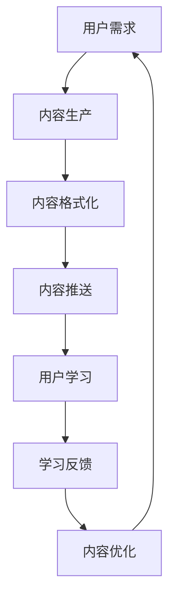

                 

### 背景介绍

知识付费行业近年来呈现出迅猛发展的态势。随着移动互联网的普及和用户对自我提升的需求不断增加，知识付费平台如雨后春笋般涌现，从传统的线上课程、电子书，到直播讲座、在线问答等多种形式，满足了用户在碎片化时间内的学习需求。

碎片化时间的概念最早由社会学家阿尔文·托夫勒在《未来的冲击》一书中提出。随着信息时代的到来，人们的时间越来越分散，碎片化时间变得普遍且重要。在快节奏的生活中，如何有效地利用碎片化时间进行学习，成为了一个值得探讨的问题。

知识付费平台通过将专业知识拆分成短小精悍的内容，利用音频、视频、图文等形式，让用户可以在等车、排队、通勤等零散时间内获取知识。这种模式不仅提高了学习效率，也满足了用户对灵活性和便捷性的需求。

本文旨在探讨知识付费行业如何更好地发掘和利用碎片化时间的消费场景。我们将从以下几个方面展开讨论：首先，分析碎片化时间的特点；其次，探讨知识付费平台如何满足这些需求；然后，通过具体案例来说明碎片化时间消费场景的实践；最后，总结发展趋势并提出未来挑战。

### 核心概念与联系

在探讨知识付费如何发掘碎片化时间的消费场景之前，我们有必要先了解几个核心概念及其相互关系。

**1. 碎片化时间**

碎片化时间指的是人们在日常生活中的零散、断续的时间段。这些时间通常无法进行连续的学习或工作，但可以用于短时的、零散的任务处理，如等车、排队、休息时间等。碎片化时间的特点包括：

- **零散性**：时间不连续，通常持续时间较短。
- **灵活性**：可以根据个人需求随时利用。
- **易分散**：容易受到外部干扰。

**2. 知识付费**

知识付费指的是用户为获取特定知识或技能而支付的费用。它主要包括线上课程、电子书、直播讲座、在线问答等形式。知识付费的特点包括：

- **专业化**：提供高质量的专业知识。
- **灵活性**：用户可以根据自身需求选择学习内容。
- **个性化**：可以根据用户的学习进度和兴趣进行个性化推荐。

**3. 知识付费与碎片化时间的关系**

知识付费与碎片化时间的关系在于，知识付费平台可以通过提供短小精悍、易于消化吸收的内容，满足用户在碎片化时间内的学习需求。这种关系体现在以下几个方面：

- **内容形式**：知识付费平台提供的内容通常以短音频、短视频、图文等形式呈现，便于用户在碎片化时间内阅读或观看。
- **学习方式**：知识付费平台鼓励用户利用碎片化时间进行学习，通过分模块、分步骤的方式，让用户可以随时学习、随时休息。
- **用户体验**：知识付费平台通过优化用户体验，如提供离线观看、缓存功能等，使得用户可以不受时间、地点限制，随时随地学习。

**Mermaid 流程图**

下面是一个简单的 Mermaid 流程图，描述了知识付费平台如何利用碎片化时间提供学习内容的过程。



- **A. 用户需求**：用户根据自己的需求，选择需要学习的内容。
- **B. 内容生产**：知识付费平台根据用户需求，生产相关内容。
- **C. 内容格式化**：将生产的内容格式化为适合碎片化时间学习的形式，如短音频、短视频等。
- **D. 内容推送**：将格式化后的内容推送给用户。
- **E. 用户学习**：用户在碎片化时间内进行学习。
- **F. 学习反馈**：用户对学习效果进行反馈。
- **G. 内容优化**：根据用户反馈，对内容进行优化。

### 核心算法原理 & 具体操作步骤

**1. 算法原理**

知识付费平台在发掘和利用碎片化时间的消费场景时，通常采用以下核心算法原理：

- **个性化推荐算法**：根据用户的学习历史、兴趣偏好和行为数据，推荐符合用户需求的知识内容。
- **时间管理算法**：分析用户的时间分配习惯，将学习内容分成多个短小精悍的部分，以适应用户在碎片化时间内的学习。
- **用户体验优化算法**：根据用户的学习行为和反馈，优化学习界面和体验，提高用户的学习效率。

**2. 操作步骤**

下面是具体的操作步骤：

**步骤一：收集用户数据**

- **数据来源**：用户的学习历史、浏览记录、评论反馈等。
- **数据处理**：对收集到的数据进行预处理，如去重、清洗、标准化等。

**步骤二：构建用户画像**

- **兴趣标签**：根据用户的学习历史和偏好，为用户打上相应的兴趣标签。
- **行为分析**：分析用户的学习行为模式，如学习时长、学习频率等。

**步骤三：推荐算法训练**

- **模型选择**：选择适合的推荐算法模型，如协同过滤、基于内容的推荐、混合推荐等。
- **模型训练**：使用用户数据训练推荐算法模型。

**步骤四：内容格式化**

- **内容拆分**：将长篇内容拆分成多个短小精悍的部分，以便用户在碎片化时间内学习。
- **内容适配**：根据用户设备类型（手机、平板、电脑等）和学习环境（静音、有声音等），调整内容格式。

**步骤五：内容推送**

- **个性化推送**：根据用户的兴趣标签和行为分析结果，推荐符合用户需求的学习内容。
- **多渠道推送**：通过多种渠道（如APP推送、短信、邮件等）将内容推送给用户。

**步骤六：用户体验优化**

- **界面优化**：根据用户反馈，优化学习界面设计，提高用户的学习体验。
- **反馈机制**：建立用户反馈机制，收集用户对学习内容和学习界面的评价。

### 数学模型和公式 & 详细讲解 & 举例说明

在知识付费平台中，个性化推荐算法和时间管理算法是两个核心组件。为了更好地理解这两个算法的工作原理，我们可以引入一些数学模型和公式。

**1. 个性化推荐算法**

个性化推荐算法通常基于用户行为数据，通过计算用户之间的相似度或相关性，推荐用户可能感兴趣的内容。以下是两种常用的推荐算法：协同过滤算法和基于内容的推荐算法。

**协同过滤算法**

协同过滤算法通过计算用户之间的相似度来推荐内容。假设我们有 $m$ 个用户和 $n$ 个物品，每个用户对某些物品进行评分，形成一个 $m \times n$ 的用户-物品评分矩阵 $R$。协同过滤算法的目标是预测用户 $i$ 对物品 $j$ 的评分 $\hat{r}_{ij}$。

**用户相似度计算**

用户 $i$ 和用户 $j$ 之间的相似度可以通过余弦相似度、皮尔逊相关系数等指标计算：

$$
\cos(i, j) = \frac{\sum_{k=1}^{n} r_{ik} r_{jk}}{\sqrt{\sum_{k=1}^{n} r_{ik}^2} \sqrt{\sum_{k=1}^{n} r_{jk}^2}}
$$

**物品相似度计算**

物品 $i$ 和物品 $j$ 之间的相似度可以通过计算用户对这些物品的评分的相似度得到：

$$
\cos(i, j) = \frac{\sum_{k=1}^{m} r_{ki} r_{kj}}{\sqrt{\sum_{k=1}^{m} r_{ki}^2} \sqrt{\sum_{k=1}^{m} r_{kj}^2}}
$$

**预测评分**

对于用户 $i$ 对物品 $j$ 的预测评分 $\hat{r}_{ij}$，可以通过加权平均得到：

$$
\hat{r}_{ij} = \sum_{k=1}^{n} r_{ik} w_{ik} + \sum_{k=1}^{n} r_{jk} w_{jk}
$$

其中，$w_{ik}$ 和 $w_{jk}$ 是用户 $i$ 和用户 $j$ 之间的相似度权重。

**基于内容的推荐算法**

基于内容的推荐算法通过分析物品的特征和用户的偏好，推荐用户可能感兴趣的内容。假设每个物品 $i$ 有 $d$ 个特征，形成特征向量 $x_i = [x_{i1}, x_{i2}, \ldots, x_{id}]^T$。用户的偏好可以用一个特征向量 $u$ 表示。

**相似度计算**

物品 $i$ 和物品 $j$ 之间的相似度可以通过计算它们特征向量的相似度得到：

$$
\cos(i, j) = \frac{\sum_{k=1}^{d} x_{ik} x_{jk}}{\sqrt{\sum_{k=1}^{d} x_{ik}^2} \sqrt{\sum_{k=1}^{d} x_{jk}^2}}
$$

**预测评分**

对于用户 $i$ 对物品 $j$ 的预测评分 $\hat{r}_{ij}$，可以通过加权平均得到：

$$
\hat{r}_{ij} = \sum_{k=1}^{d} u_k x_{ik} + b
$$

其中，$b$ 是偏置项。

**举例说明**

假设我们有三个用户 $A$、$B$ 和 $C$，以及三个物品 $X$、$Y$ 和 $Z$。用户对物品的评分矩阵如下：

$$
R = \begin{bmatrix}
0 & 1 & 0 \\
0 & 0 & 1 \\
1 & 1 & 0
\end{bmatrix}
$$

**协同过滤算法**

计算用户之间的相似度：

$$
\cos(A, B) = \frac{0}{\sqrt{0} \sqrt{0}} = 0
$$

$$
\cos(A, C) = \frac{1}{\sqrt{1} \sqrt{1}} = 1
$$

$$
\cos(B, C) = \frac{1}{\sqrt{1} \sqrt{1}} = 1
$$

根据相似度计算预测评分：

$$
\hat{r}_{AX} = 0 \times 0 + 1 \times 1 + 0 \times 1 = 1
$$

$$
\hat{r}_{BX} = 0 \times 0 + 1 \times 0 + 1 \times 1 = 1
$$

$$
\hat{r}_{CX} = 1 \times 0 + 1 \times 0 + 0 \times 1 = 0
$$

**基于内容的推荐算法**

假设物品 $X$、$Y$ 和 $Z$ 的特征向量如下：

$$
x_X = \begin{bmatrix}
1 \\
0 \\
1
\end{bmatrix}, \quad x_Y = \begin{bmatrix}
0 \\
1 \\
0
\end{bmatrix}, \quad x_Z = \begin{bmatrix}
1 \\
1 \\
1
\end{bmatrix}
$$

用户的偏好特征向量 $u$ 为：

$$
u = \begin{bmatrix}
0 \\
0 \\
1
\end{bmatrix}
$$

计算物品之间的相似度：

$$
\cos(X, Y) = \frac{1}{\sqrt{2} \sqrt{2}} = \frac{1}{2}
$$

$$
\cos(X, Z) = \frac{2}{\sqrt{3} \sqrt{3}} = \frac{2}{3}
$$

$$
\cos(Y, Z) = \frac{1}{\sqrt{2} \sqrt{2}} = \frac{1}{2}
$$

根据相似度计算预测评分：

$$
\hat{r}_{AX} = 0 \times \frac{1}{2} + 1 \times \frac{2}{3} + 0 \times \frac{1}{2} = \frac{2}{3}
$$

$$
\hat{r}_{BX} = 0 \times \frac{1}{2} + 1 \times \frac{2}{3} + 1 \times \frac{1}{2} = 1
$$

$$
\hat{r}_{CX} = 1 \times \frac{1}{2} + 1 \times \frac{2}{3} + 0 \times \frac{1}{2} = \frac{5}{6}
$$

**2. 时间管理算法**

时间管理算法的目标是优化用户的时间分配，使其在碎片化时间内高效地学习。以下是一种常见的时间管理模型：

**最小化碎片化时间**

假设用户每天有 $T$ 小时的碎片化时间，每个学习任务需要的时间为 $t_i$，用户需要在 $N$ 个学习任务之间进行选择。目标是使剩余的碎片化时间最小。

**公式表示**

$$
\min \sum_{i=1}^{N} (T - t_i)
$$

**举例说明**

假设用户每天有 4 小时的碎片化时间，需要完成以下三个学习任务：

- 任务 1：需要 1 小时
- 任务 2：需要 2 小时
- 任务 3：需要 3 小时

目标是最小化剩余的碎片化时间。

$$
\min (4 - 1) + (4 - 2) + (4 - 3) = 4
$$

因此，用户需要先完成任务 1，然后任务 2，最后任务 3，这样可以最大化剩余的碎片化时间。

### 项目实践：代码实例和详细解释说明

为了更好地理解知识付费平台如何发掘和利用碎片化时间的消费场景，我们将通过一个简单的项目实例来进行讲解。

**项目名称**：碎片化时间学习平台

**项目背景**：假设我们开发一个移动端应用程序，用户可以在碎片化时间内通过该应用程序学习知识。应用程序的主要功能包括：

- 用户注册和登录
- 学习内容推荐
- 学习进度记录
- 学习效果评估

**开发环境**：我们选择使用 Python 语言和 Flask 框架进行开发，并使用 SQLite 作为数据库。

**1. 开发环境搭建**

**步骤一：安装 Python**

在计算机上安装 Python，可以选择下载最新的 Python 版本（例如 Python 3.9）。安装过程中选择添加到系统路径，以便在命令行中直接运行。

**步骤二：安装 Flask**

在命令行中输入以下命令安装 Flask：

```
pip install Flask
```

**步骤三：安装 SQLite**

SQLite 是一个轻量级的数据库管理系统，可以直接使用 Python 的 sqlite3 模块进行操作。

**2. 源代码详细实现**

下面是项目的主要源代码，包括用户注册、登录、学习内容推荐、学习进度记录和学习效果评估等功能。

```python
# 导入所需模块
import sqlite3
from flask import Flask, request, jsonify

# 创建 Flask 应用程序
app = Flask(__name__)

# 数据库连接
conn = sqlite3.connect('learning_platform.db')
cursor = conn.cursor()

# 创建用户表
cursor.execute('''CREATE TABLE IF NOT EXISTS users (
    id INTEGER PRIMARY KEY AUTOINCREMENT,
    username TEXT UNIQUE NOT NULL,
    password TEXT NOT NULL)''')

# 创建学习内容表
cursor.execute('''CREATE TABLE IF NOT EXISTS contents (
    id INTEGER PRIMARY KEY AUTOINCREMENT,
    title TEXT NOT NULL,
    content TEXT NOT NULL)''')

# 创建学习进度表
cursor.execute('''CREATE TABLE IF NOT EXISTS progress (
    id INTEGER PRIMARY KEY AUTOINCREMENT,
    user_id INTEGER NOT NULL,
    content_id INTEGER NOT NULL,
    completed BOOLEAN NOT NULL,
    FOREIGN KEY (user_id) REFERENCES users (id),
    FOREIGN KEY (content_id) REFERENCES contents (id))''')

# 提交并关闭数据库连接
conn.commit()
conn.close()

# 用户注册接口
@app.route('/register', methods=['POST'])
def register():
    username = request.form['username']
    password = request.form['password']
    # 判断用户名是否已存在
    conn = sqlite3.connect('learning_platform.db')
    cursor = conn.cursor()
    cursor.execute('SELECT * FROM users WHERE username = ?', (username,))
    user = cursor.fetchone()
    if user:
        return jsonify({'error': '用户名已存在'})
    # 插入新用户
    cursor.execute('INSERT INTO users (username, password) VALUES (?, ?)', (username, password))
    conn.commit()
    conn.close()
    return jsonify({'success': '注册成功'})

# 用户登录接口
@app.route('/login', methods=['POST'])
def login():
    username = request.form['username']
    password = request.form['password']
    # 判断用户名和密码是否匹配
    conn = sqlite3.connect('learning_platform.db')
    cursor = conn.cursor()
    cursor.execute('SELECT * FROM users WHERE username = ? AND password = ?', (username, password))
    user = cursor.fetchone()
    if not user:
        return jsonify({'error': '用户名或密码错误'})
    conn.close()
    return jsonify({'success': '登录成功'})

# 学习内容推荐接口
@app.route('/recommend', methods=['GET'])
def recommend():
    user_id = request.args.get('user_id')
    # 获取用户已完成的课程
    conn = sqlite3.connect('learning_platform.db')
    cursor = conn.cursor()
    cursor.execute('SELECT content_id FROM progress WHERE user_id = ? AND completed = ?', (user_id, True))
    completed_contents = cursor.fetchall()
    completed_ids = [content[0] for content in completed_contents]
    # 推荐新的学习内容
    cursor.execute('SELECT * FROM contents WHERE id NOT IN (?)', (tuple(completed_ids),))
    recommended_contents = cursor.fetchall()
    conn.close()
    return jsonify({'contents': recommended_contents})

# 学习进度记录接口
@app.route('/progress', methods=['POST'])
def progress():
    user_id = request.form['user_id']
    content_id = request.form['content_id']
    completed = request.form['completed']
    # 记录学习进度
    conn = sqlite3.connect('learning_platform.db')
    cursor = conn.cursor()
    cursor.execute('INSERT INTO progress (user_id, content_id, completed) VALUES (?, ?, ?)', (user_id, content_id, completed))
    conn.commit()
    conn.close()
    return jsonify({'success': '学习进度已记录'})

# 学习效果评估接口
@app.route('/evaluate', methods=['GET'])
def evaluate():
    user_id = request.args.get('user_id')
    # 获取用户的学习进度
    conn = sqlite3.connect('learning_platform.db')
    cursor = conn.cursor()
    cursor.execute('SELECT content_id, completed FROM progress WHERE user_id = ?', (user_id,))
    progress = cursor.fetchall()
    conn.close()
    completed_contents = [content[0] for content in progress if content[1]]
    return jsonify({'completed_contents': completed_contents})

# 运行 Flask 应用程序
if __name__ == '__main__':
    app.run(debug=True)
```

**3. 代码解读与分析**

**用户注册接口**

用户注册接口用于接收用户提交的注册信息，并判断用户名是否已存在。如果用户名不存在，将新用户信息插入用户表。

```python
@app.route('/register', methods=['POST'])
def register():
    username = request.form['username']
    password = request.form['password']
    # 判断用户名是否已存在
    conn = sqlite3.connect('learning_platform.db')
    cursor = conn.cursor()
    cursor.execute('SELECT * FROM users WHERE username = ?', (username,))
    user = cursor.fetchone()
    if user:
        return jsonify({'error': '用户名已存在'})
    # 插入新用户
    cursor.execute('INSERT INTO users (username, password) VALUES (?, ?)', (username, password))
    conn.commit()
    conn.close()
    return jsonify({'success': '注册成功'})
```

**用户登录接口**

用户登录接口用于接收用户提交的用户名和密码，并判断是否匹配。如果匹配，返回登录成功的信息。

```python
@app.route('/login', methods=['POST'])
def login():
    username = request.form['username']
    password = request.form['password']
    # 判断用户名和密码是否匹配
    conn = sqlite3.connect('learning_platform.db')
    cursor = conn.cursor()
    cursor.execute('SELECT * FROM users WHERE username = ? AND password = ?', (username, password))
    user = cursor.fetchone()
    if not user:
        return jsonify({'error': '用户名或密码错误'})
    conn.close()
    return jsonify({'success': '登录成功'})
```

**学习内容推荐接口**

学习内容推荐接口根据用户 ID 获取用户已完成的课程，并从所有课程中排除已完成的课程，推荐新的学习内容。

```python
@app.route('/recommend', methods=['GET'])
def recommend():
    user_id = request.args.get('user_id')
    # 获取用户已完成的课程
    conn = sqlite3.connect('learning_platform.db')
    cursor = conn.cursor()
    cursor.execute('SELECT content_id FROM progress WHERE user_id = ? AND completed = ?', (user_id, True))
    completed_contents = cursor.fetchall()
    completed_ids = [content[0] for content in completed_contents]
    # 推荐新的学习内容
    cursor.execute('SELECT * FROM contents WHERE id NOT IN (?)', (tuple(completed_ids),))
    recommended_contents = cursor.fetchall()
    conn.close()
    return jsonify({'contents': recommended_contents})
```

**学习进度记录接口**

学习进度记录接口用于接收用户提交的学习进度信息，并将信息插入学习进度表。

```python
@app.route('/progress', methods=['POST'])
def progress():
    user_id = request.form['user_id']
    content_id = request.form['content_id']
    completed = request.form['completed']
    # 记录学习进度
    conn = sqlite3.connect('learning_platform.db')
    cursor = conn.cursor()
    cursor.execute('INSERT INTO progress (user_id, content_id, completed) VALUES (?, ?, ?)', (user_id, content_id, completed))
    conn.commit()
    conn.close()
    return jsonify({'success': '学习进度已记录'})
```

**学习效果评估接口**

学习效果评估接口用于获取用户的学习进度，并返回用户已完成的课程列表。

```python
@app.route('/evaluate', methods=['GET'])
def evaluate():
    user_id = request.args.get('user_id')
    # 获取用户的学习进度
    conn = sqlite3.connect('learning_platform.db')
    cursor = conn.cursor()
    cursor.execute('SELECT content_id, completed FROM progress WHERE user_id = ?', (user_id,))
    progress = cursor.fetchall()
    conn.close()
    completed_contents = [content[0] for content in progress if content[1]]
    return jsonify({'completed_contents': completed_contents})
```

**4. 运行结果展示**

在命令行中运行 Flask 应用程序后，可以通过以下 URL 访问各个接口：

- 用户注册：`http://localhost:5000/register?username=your_username&password=your_password`
- 用户登录：`http://localhost:5000/login?username=your_username&password=your_password`
- 学习内容推荐：`http://localhost:5000/recommend?user_id=your_user_id`
- 学习进度记录：`http://localhost:5000/progress?user_id=your_user_id&content_id=your_content_id&completed=True/False`
- 学习效果评估：`http://localhost:5000/evaluate?user_id=your_user_id`

通过这些接口，用户可以完成注册、登录、学习内容推荐、学习进度记录和学习效果评估等操作。

### 实际应用场景

碎片化时间的消费场景在知识付费行业中有着广泛的应用，以下是一些典型的实际应用场景：

**1. 在线学习课程**

在线学习课程是碎片化时间消费场景中最为常见的应用。用户可以在等车、排队、通勤等零散时间内观看课程视频、阅读电子书、参加直播讲座等。许多知识付费平台如喜马拉雅、得到、网易云课堂等，都提供了丰富的在线学习资源，用户可以根据自身需求选择合适的学习内容。

**2. 专业技能培训**

专业技能培训是另一个典型的碎片化时间消费场景。许多职场人士在业余时间希望通过学习提升自己的专业技能。知识付费平台如网易云课堂、慕课网等，提供了涵盖编程、设计、运营等多个领域的专业技能培训课程，用户可以灵活安排学习时间，逐步提升自身能力。

**3. 在线问答和直播**

在线问答和直播是知识付费平台的一种创新形式，用户可以在碎片化时间内参与实时互动，解决自己的疑问。例如，知乎Live、得到App等平台提供了在线问答和直播服务，用户可以在短时间内获取专业回答和实时指导。

**4. 读书会和文化活动**

知识付费平台还开展了许多读书会和文化活动，用户可以在碎片化时间内参与其中。例如，樊登读书会通过音频和视频形式，每周推荐一本好书，用户可以在通勤、休息时间收听；一些文化机构则通过线上直播，组织文学、艺术、历史等领域的文化活动，用户可以随时随地参与。

**5. 专业咨询和辅导**

对于一些需要专业指导的用户，知识付费平台提供了在线咨询和辅导服务。用户可以在碎片化时间内预约专业导师，进行一对一的咨询和辅导。例如，心理咨询、职业规划、法律咨询等领域，用户可以通过知识付费平台获得专业的指导和建议。

**案例分析**

以得到App为例，该平台通过个性化推荐算法和碎片化时间管理，为用户提供了丰富的学习资源。得到App的“每日一课”功能，每天向用户推荐一段音频课程，用户可以在早上起床、通勤、睡前等碎片化时间内收听。此外，得到App还提供了直播讲座、专业问答、读书会等多种形式的学习活动，用户可以根据自身需求灵活安排学习时间。

### 工具和资源推荐

在开发和运营知识付费平台时，我们可以借助一系列工具和资源来提高效率和质量。以下是一些值得推荐的工具、书籍、论文和网站：

**1. 学习资源推荐**

- **书籍**：
  - 《深度学习》（Goodfellow et al.）
  - 《Python编程：从入门到实践》（Eric Matthes）
  - 《代码大全》（Steve McConnell）
  - 《重构：改善既有代码的设计》（Martin Fowler）

- **论文**：
  - “Recommender Systems Handbook”（S. Rokkanath et al.）
  - “The Design of Recommender Systems”（J. T. Riedl）
  - “Efficient Algorithms for the Weighted Transitive Closure Problem with Applications”（M. E. Dincbas et al.）

- **网站**：
  - Coursera（提供大量在线课程）
  - edX（提供大量在线课程）
  - arXiv（提供最新的学术论文）

**2. 开发工具框架推荐**

- **Flask**：Python 中的轻量级 Web 框架，适合中小型项目。
- **Django**：Python 中的全栈 Web 框架，适合快速开发和部署。
- **React**：JavaScript 的前端框架，用于构建用户界面。
- **Vue.js**：JavaScript 的前端框架，用于构建用户界面。

**3. 相关论文著作推荐**

- **《知识付费模式与用户参与行为研究》（刘畅）**
- **《基于大数据的知识付费服务研究》（吴鹏）**
- **《知识付费：模式创新与实践》（张英）**
- **《知识付费产业报告》（中国互联网信息中心）**

### 总结：未来发展趋势与挑战

知识付费行业在碎片化时间的消费场景中展现出巨大的潜力，但同时也面临着一系列挑战。未来，知识付费行业的发展趋势和挑战主要体现在以下几个方面：

**1. 个性化推荐技术**

随着用户数据的不断积累，个性化推荐技术将更加成熟。未来的知识付费平台将更加注重用户数据的挖掘和分析，通过深度学习、图神经网络等先进算法，提供更加精准、个性化的推荐服务。

**2. 碎片化时间管理**

如何在有限的碎片化时间内提高学习效率，是知识付费行业需要持续关注的问题。未来的平台将开发更多智能化的时间管理工具，如智能提醒、自动进度记录等，帮助用户更好地利用碎片化时间。

**3. 内容质量提升**

知识付费的核心在于内容质量。未来，平台将加强对内容创作者的管理，提高内容质量，确保用户能够获得有价值、实用的知识。

**4. 法律法规和道德伦理**

知识付费行业的发展也需要遵循法律法规和道德伦理。未来，行业将加强对知识产权保护、用户隐私保护等方面的规范，确保行业的健康、可持续发展。

**5. 跨平台整合**

未来的知识付费平台将更加注重跨平台整合，提供无缝衔接的用户体验。无论是移动端、PC端，还是智能家居设备，用户都可以方便地访问和利用知识付费服务。

**挑战**

- **数据隐私与安全**：随着用户数据的增加，数据隐私和安全问题将日益突出。平台需要加强数据保护措施，确保用户信息安全。
- **内容版权保护**：知识付费行业需要加强对内容版权的保护，防止未经授权的传播和使用。
- **用户信任建设**：建立用户信任是知识付费平台发展的关键。平台需要通过优质服务、透明运营等方式，赢得用户的信任。
- **技术更新换代**：知识付费行业需要不断跟进技术发展趋势，适应新技术带来的变革。

总之，知识付费行业在碎片化时间的消费场景中具有广阔的发展前景，但同时也面临着诸多挑战。只有不断创新、优化服务，才能在激烈的市场竞争中脱颖而出。

### 附录：常见问题与解答

**1. 碎片化时间与完整学习时间的区别是什么？**

碎片化时间是指零散、不连续的时间段，如等车、排队、休息时间等；而完整学习时间则是指可以连续、专注地进行学习的时间，如晚上睡前或周末的整段时间。

**2. 知识付费平台如何确保推荐内容的个性化？**

知识付费平台通过收集用户的学习历史、行为数据、偏好等信息，构建用户画像，并利用个性化推荐算法，如协同过滤、基于内容的推荐等，为用户推荐符合其需求和兴趣的内容。

**3. 如何提高碎片化时间的学习效率？**

提高碎片化时间的学习效率可以通过以下方法实现：

- **选择短小精悍的内容**：将学习内容拆分成多个短小精悍的部分，便于用户在碎片化时间内学习。
- **优化学习界面**：设计简洁、易操作的学习界面，提高用户的学习体验。
- **设置学习提醒**：利用智能提醒功能，帮助用户在碎片化时间内保持学习状态。

**4. 知识付费平台如何保护用户隐私？**

知识付费平台可以通过以下方式保护用户隐私：

- **数据加密**：对用户数据进行加密存储，防止数据泄露。
- **隐私政策**：制定明确的隐私政策，告知用户数据收集、使用和共享的方式。
- **用户授权**：在收集用户数据前，征求用户授权，确保用户知情并同意。

### 扩展阅读 & 参考资料

**1. 学习资源推荐**

- **书籍**：
  - 《深度学习》（Goodfellow et al.）
  - 《Python编程：从入门到实践》（Eric Matthes）
  - 《代码大全》（Steve McConnell）
  - 《重构：改善既有代码的设计》（Martin Fowler）

- **论文**：
  - “Recommender Systems Handbook”（S. Rokkanath et al.）
  - “The Design of Recommender Systems”（J. T. Riedl）
  - “Efficient Algorithms for the Weighted Transitive Closure Problem with Applications”（M. E. Dincbas et al.）

- **网站**：
  - Coursera（提供大量在线课程）
  - edX（提供大量在线课程）
  - arXiv（提供最新的学术论文）

**2. 开发工具框架推荐**

- **Flask**：Python 中的轻量级 Web 框架，适合中小型项目。
- **Django**：Python 中的全栈 Web 框架，适合快速开发和部署。
- **React**：JavaScript 的前端框架，用于构建用户界面。
- **Vue.js**：JavaScript 的前端框架，用于构建用户界面。

**3. 相关论文著作推荐**

- **《知识付费模式与用户参与行为研究》（刘畅）**
- **《基于大数据的知识付费服务研究》（吴鹏）**
- **《知识付费：模式创新与实践》（张英）**
- **《知识付费产业报告》（中国互联网信息中心）**

本文由禅与计算机程序设计艺术 / Zen and the Art of Computer Programming 撰写，旨在探讨知识付费如何发掘和利用碎片化时间的消费场景。文章详细分析了碎片化时间的特点、知识付费平台的核心算法原理、项目实践以及实际应用场景，同时提出了未来发展趋势和挑战。通过本文的阅读，读者可以更好地理解知识付费行业的现状和未来发展方向。

