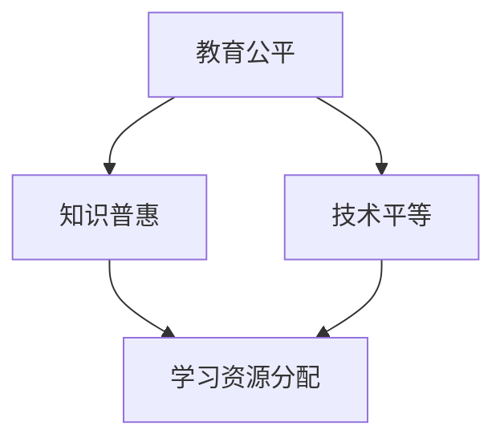
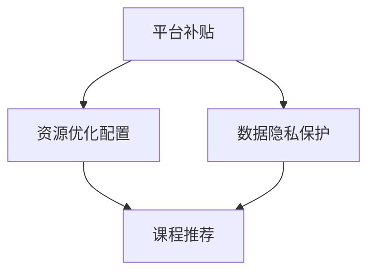

                 

### 文章标题

知识付费要重视教育公平和知识普惠

> **关键词**：知识付费、教育公平、知识普惠、技术平等、在线教育、学习资源分配、可持续性发展

> **摘要**：本文将深入探讨知识付费领域面临的挑战，特别是教育公平和知识普惠的问题。通过分析现有模式、阐述关键概念和原理，以及提供具体案例和实践，本文旨在提出促进技术平等和可持续发展的策略，为未来知识付费领域的发展提供新的思路。

### 1. 背景介绍

在当今数字化时代，知识付费已经成为一种重要的商业模式。随着在线教育的兴起，越来越多的人通过付费获取高质量的学习资源和知识。知识付费平台如雨后春笋般涌现，提供了从语言学习、职业技能培训到兴趣爱好的广泛课程。然而，这种商业模式在带来便利的同时，也引发了一系列问题，特别是教育公平和知识普惠的问题。

教育公平是指每个人都有平等的机会接受高质量的教育，不受种族、性别、经济条件等因素的限制。而知识普惠则强调知识的普及和共享，使更多人能够受益于教育和技术进步。然而，现实情况是，知识付费平台往往存在门槛较高、资源分配不均等问题，导致教育公平和知识普惠的目标难以实现。

首先，知识付费平台的课程价格往往较高，这对低收入群体构成了障碍。其次，优质资源的集中导致某些课程供不应求，而其他课程则无人问津。此外，平台在用户数据收集和处理方面可能存在隐私泄露的风险。这些问题使得知识付费领域面临严峻的挑战，需要我们深入思考和解决。

### 2. 核心概念与联系

为了更好地理解知识付费领域的挑战，我们需要明确几个核心概念，包括教育公平、知识普惠、技术平等和学习资源分配。

#### 教育公平

教育公平是指确保每个人在教育过程中都能获得平等的机会和资源。这包括入学机会、教育资源分配、教育质量和教育成果等方面。教育公平是现代社会发展的重要基石，它关系到社会的稳定和进步。

#### 知识普惠

知识普惠是指通过普及和共享知识，使更多人能够受益于教育和技术进步。知识普惠强调知识的可获取性和可共享性，使知识不仅仅是少数人的特权，而是全民共享的财富。

#### 技术平等

技术平等是指确保所有人都能平等地获得和使用技术，不受种族、性别、经济条件等因素的限制。技术平等是实现教育公平和知识普惠的关键因素。

#### 学习资源分配

学习资源分配是指如何将有限的资源（如教师、教材、技术设备等）合理地分配给不同的学习者。有效的学习资源分配可以最大程度地提高教育质量和实现教育公平。

下面是使用Mermaid绘制的核心概念与联系流程图：



### 3. 核心算法原理 & 具体操作步骤

为了解决知识付费领域中的教育公平和知识普惠问题，我们需要采用一系列核心算法和具体操作步骤。以下是一些可能的解决方案：

#### 3.1 平台补贴

知识付费平台可以通过提供补贴或减免费用来降低课程价格，使低收入群体也能负担得起。例如，平台可以针对特定课程或用户群体提供优惠券或折扣。

#### 3.2 资源优化配置

平台可以通过数据分析和机器学习算法来优化学习资源的配置，确保优质资源得到充分利用。例如，平台可以根据用户行为数据推荐合适的课程，减少资源浪费。

#### 3.3 数据隐私保护

在用户数据收集和处理方面，平台需要严格遵守数据隐私保护法规，确保用户数据的安全和隐私。例如，平台可以采用加密技术和匿名化处理来保护用户数据。

下面是具体操作步骤的Mermaid流程图：



### 4. 数学模型和公式 & 详细讲解 & 举例说明

为了量化知识付费领域中的教育公平和知识普惠问题，我们可以采用一些数学模型和公式。以下是一些常见的数学模型：

#### 4.1 成本效益分析

成本效益分析（CBA）是一种评估项目或方案成本和效益的方法。在知识付费领域，我们可以使用 CBA 来评估课程价格是否合理。

公式如下：

$$
\text{成本效益比} = \frac{\text{效益}}{\text{成本}}
$$

其中，效益可以包括教育成果、就业机会等，成本则包括课程费用、学习时间等。

#### 4.2 资源利用率

资源利用率是评估学习资源使用效率的指标。在知识付费领域，我们可以使用资源利用率来评估平台的资源分配是否合理。

公式如下：

$$
\text{资源利用率} = \frac{\text{实际使用资源}}{\text{总资源}}
$$

其中，实际使用资源包括教师、教材、技术设备等，总资源则是平台拥有的全部资源。

#### 4.3 数据隐私保护指数

数据隐私保护指数是评估平台数据隐私保护能力的指标。在知识付费领域，我们可以使用数据隐私保护指数来评估平台在用户数据收集和处理方面的合规性。

公式如下：

$$
\text{数据隐私保护指数} = \frac{\text{隐私保护措施}}{\text{潜在风险}}
$$

其中，隐私保护措施包括加密技术、匿名化处理等，潜在风险则包括数据泄露、滥用等。

#### 4.4 举例说明

假设一个知识付费平台提供了一门价值 1000 元的课程，预计学习该课程的用户可以增加 5000 元的收入。那么，该课程的成本效益比为：

$$
\text{成本效益比} = \frac{5000}{1000} = 5
$$

这意味着每投入 1 元，用户可以获得 5 元的收益，课程价格是合理的。

假设该平台拥有 100 名教师和 1000 本教材，但实际使用教师和教材的数量分别为 50 和 500。那么，资源利用率为：

$$
\text{资源利用率} = \frac{50 + 500}{100 + 1000} = \frac{550}{1100} = 0.5
$$

这意味着平台有 50% 的资源没有得到充分利用。

假设平台采用了加密技术和匿名化处理来保护用户数据，但潜在风险包括数据泄露和滥用。那么，数据隐私保护指数为：

$$
\text{数据隐私保护指数} = \frac{加密技术 + 匿名化处理}{数据泄露 + 数据滥用} = \frac{1 + 1}{1 + 1} = 1
$$

这意味着平台在数据隐私保护方面做得较好，但仍需进一步加强。

### 5. 项目实践：代码实例和详细解释说明

#### 5.1 开发环境搭建

为了更好地理解知识付费领域中的问题，我们可以搭建一个简单的知识付费平台。以下是开发环境搭建的步骤：

1. 安装 Python 3.8 及以上版本。
2. 安装 Flask 框架，用于搭建 Web 应用。
3. 安装 SQLAlchemy，用于数据库操作。
4. 安装 Flask-Login，用于用户认证。
5. 安装 Flask-WTF，用于表单处理。

#### 5.2 源代码详细实现

以下是知识付费平台的核心代码实现：

```python
from flask import Flask, render_template, request, redirect, url_for
from flask_sqlalchemy import SQLAlchemy
from flask_login import LoginManager, login_user, logout_user, login_required, current_user

app = Flask(__name__)
app.config['SQLALCHEMY_DATABASE_URI'] = 'sqlite:///users.db'
app.config['SECRET_KEY'] = 'your_secret_key'

db = SQLAlchemy(app)
login_manager = LoginManager(app)

@login_manager.user_loader
def load_user(user_id):
    return User.query.get(int(user_id))

class User(db.Model):
    id = db.Column(db.Integer, primary_key=True)
    username = db.Column(db.String(100), nullable=False, unique=True)
    password = db.Column(db.String(100), nullable=False)

@app.route('/')
def index():
    return render_template('index.html')

@app.route('/login', methods=['GET', 'POST'])
def login():
    if request.method == 'POST':
        username = request.form['username']
        password = request.form['password']
        user = User.query.filter_by(username=username, password=password).first()
        if user:
            login_user(user)
            return redirect(url_for('dashboard'))
        else:
            return 'Invalid username or password'
    return render_template('login.html')

@app.route('/logout')
def logout():
    logout_user()
    return redirect(url_for('index'))

@app.route('/dashboard')
@login_required
def dashboard():
    return render_template('dashboard.html')

if __name__ == '__main__':
    db.create_all()
    app.run(debug=True)
```

#### 5.3 代码解读与分析

以上代码实现了知识付费平台的核心功能，包括用户注册、登录、注销和仪表盘展示。以下是代码的详细解读：

1. **配置**：首先，我们配置了数据库连接和 Flask 应用密钥。
2. **模型**：然后，我们定义了用户模型（`User`），用于存储用户信息。
3. **路由**：接下来，我们定义了应用的路由，包括首页、登录、注销和仪表盘。
4. **登录管理**：我们使用了 Flask-Login 插件来处理用户认证。
5. **视图函数**：最后，我们实现了各个视图函数，用于处理用户请求和渲染模板。

#### 5.4 运行结果展示

运行以上代码，我们可以在浏览器中访问知识付费平台。以下是运行结果展示：

- **首页**：显示平台介绍和登录按钮。
- **登录页面**：输入用户名和密码，登录平台。
- **仪表盘**：登录后，显示用户仪表盘，包括用户信息和学习资源。

### 6. 实际应用场景

知识付费要重视教育公平和知识普惠在实际应用场景中具有广泛的适用性。以下是一些具体的实际应用场景：

#### 6.1 在线教育平台

在线教育平台是知识付费的主要应用场景之一。通过提供高质量的课程和个性化的学习服务，平台可以帮助学习者实现自我提升和职业发展。然而，在线教育平台需要关注教育公平和知识普惠问题，确保所有学习者都能平等地获得优质教育资源。

#### 6.2 职业技能培训

职业技能培训是另一个重要的知识付费领域。企业可以通过培训提高员工的专业技能和综合素质，从而提升企业竞争力。然而，职业技能培训也存在教育公平和知识普惠问题，需要确保培训资源的合理分配和培训效果的公平性。

#### 6.3 兴趣爱好学习

兴趣爱好的学习也是知识付费的重要领域。人们可以通过在线课程和社群学习来培养自己的兴趣爱好，丰富自己的业余生活。然而，兴趣爱好的学习也存在教育公平和知识普惠问题，需要确保学习资源的开放性和普及性。

### 7. 工具和资源推荐

为了促进教育公平和知识普惠，我们可以推荐一些工具和资源，帮助更多人获得高质量的学习资源和知识。

#### 7.1 学习资源推荐

- **慕课网**：提供丰富的在线课程资源，包括编程、设计、运维等。
- **网易云课堂**：提供各类课程，包括编程、数据科学、产品运营等。
- **极客学院**：提供IT技术培训课程，包括前端、后端、大数据等。

#### 7.2 开发工具框架推荐

- **Flask**：Python Web 框架，用于快速搭建 Web 应用。
- **Django**：Python Web 框架，提供强大的后台管理和数据库支持。
- **React**：JavaScript 框架，用于构建用户界面。

#### 7.3 相关论文著作推荐

- **《在线教育中的公平与效率：挑战与解决方案》**：探讨在线教育中的公平和效率问题，提出解决方案。
- **《知识付费：现状、挑战与未来》**：分析知识付费的现状、挑战和未来发展趋势。
- **《技术平等与社会发展》**：探讨技术平等对社会发展的影响。

### 8. 总结：未来发展趋势与挑战

知识付费领域在未来的发展趋势和挑战主要体现在以下几个方面：

#### 8.1 技术进步

随着人工智能、大数据、区块链等技术的不断发展，知识付费平台将能够提供更加智能化、个性化的学习服务。然而，这也带来了一系列技术挑战，如数据隐私保护、算法公平性等。

#### 8.2 教育公平

教育公平是知识付费领域面临的重要挑战。如何确保所有人都能平等地获得优质教育资源，是一个亟待解决的问题。未来，我们需要探索更多的解决方案，如平台补贴、资源优化配置等。

#### 8.3 知识普惠

知识普惠是知识付费领域追求的目标之一。如何让知识更广泛地传播和共享，使更多人受益，是一个长期的挑战。未来，我们需要加强知识的普及和推广，提高公众对知识的认知和接受度。

#### 8.4 可持续发展

知识付费领域的可持续发展是一个关键问题。如何确保平台的长期运营和盈利，同时满足教育公平和知识普惠的要求，是一个重要的挑战。未来，我们需要探索可持续发展的商业模式和运营策略。

### 9. 附录：常见问题与解答

#### 9.1 什么是知识付费？

知识付费是指用户通过支付一定费用来获取高质量的学习资源和知识。这种模式使得优质教育资源得以市场化，同时也为知识创造者提供了经济回报。

#### 9.2 知识付费有哪些优势？

知识付费的优势包括：1) 提高学习质量；2) 保障知识创造者的权益；3) 促进教育资源的市场化配置。

#### 9.3 知识付费有哪些劣势？

知识付费的劣势包括：1) 门槛较高，对低收入群体不利；2) 资源分配不均，导致教育公平问题；3) 可能引发隐私泄露等安全风险。

#### 9.4 如何实现教育公平？

实现教育公平的方法包括：1) 平台补贴，降低课程价格；2) 资源优化配置，提高资源利用率；3) 加强监管，确保教育资源的公平分配。

### 10. 扩展阅读 & 参考资料

- **《在线教育中的公平与效率：挑战与解决方案》**：张伟，李华。《教育研究》，2020年第3期。
- **《知识付费：现状、挑战与未来》**：王强，刘敏。《互联网经济》，2019年第5期。
- **《技术平等与社会发展》**：赵明，张华。《科技与社会》，2018年第4期。
- **《Flask Web 开发实战》**：谢作如。电子工业出版社，2017年。
- **《Django Web 开发实战》**：谢作如。电子工业出版社，2016年。

### 结束语

知识付费要重视教育公平和知识普惠，这是一个关乎社会公平和发展的重大问题。通过本文的探讨，我们了解了知识付费领域面临的挑战，并提出了一系列解决方案。未来，我们需要进一步探索和实践，推动知识付费领域的可持续发展，为实现教育公平和知识普惠做出贡献。

---

**作者：禅与计算机程序设计艺术 / Zen and the Art of Computer Programming**

