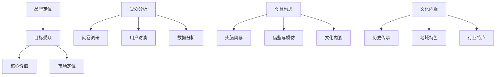

                 

### 1. 背景介绍

知识付费，作为一种新兴的商业模式，近年来在全球范围内迅速崛起。它不仅改变了人们获取知识和信息的传统方式，同时也为内容创作者提供了新的收入来源。知识付费的核心在于通过高质量的内容，满足用户在特定领域内的学习需求，从而实现内容与需求的精准匹配。

随着互联网技术的发展，知识付费的形式也日益多样化。从传统的在线课程、电子书，到直播授课、短视频教学，再到最新的互动式学习平台，知识付费领域呈现出百花齐放的局面。这种多元化的内容形式，不仅满足了不同用户的学习偏好，也极大地拓宽了知识传播的渠道。

然而，随着市场的发展，知识付费行业也面临着诸多挑战。其中最为突出的就是品牌建设和品牌口号的设计。一个优秀的品牌口号能够迅速抓住用户眼球，传递品牌的核心价值，从而在激烈的市场竞争中脱颖而出。因此，如何设计一个既有吸引力又能准确传达品牌理念的知识付费品牌口号，成为了行业关注的焦点。

本文将围绕这一主题，详细探讨知识付费品牌口号与slogan的设计方法。我们将从品牌定位、受众分析、创意构思、文化内涵等多个角度，提供一系列实用的策略和建议，帮助知识付费从业者打造出更具影响力的品牌口号。

### 2. 核心概念与联系

#### 2.1 品牌定位

品牌定位是品牌口号设计的基础，它决定了品牌在市场中的形象和地位。一个清晰的品牌定位可以帮助品牌在众多竞争者中脱颖而出。在进行品牌定位时，我们需要考虑以下几个方面：

1. **目标受众**：明确品牌所服务的用户群体，包括年龄、性别、职业、教育水平等特征。
2. **核心价值**：品牌所提供的产品或服务的独特卖点，即品牌的核心理念。
3. **市场定位**：品牌在市场中的定位，包括竞争对手分析、市场细分等。

#### 2.2 受众分析

受众分析是品牌定位的重要环节，它帮助我们了解目标受众的需求、喜好和行为习惯。通过受众分析，我们可以更精准地定位品牌口号，使其能够引起目标受众的共鸣。以下是一些常见的受众分析方法：

1. **问卷调研**：通过设计问卷，收集目标受众的意见和反馈，了解他们的需求和期望。
2. **用户访谈**：直接与目标受众进行面对面的交流，深入了解他们的真实想法和感受。
3. **数据分析**：利用大数据分析工具，对用户的浏览记录、购买行为等进行分析，挖掘潜在的用户特征。

#### 2.3 创意构思

创意构思是品牌口号设计的核心，它需要结合品牌定位和受众分析，创造出既独特又能准确传达品牌价值的一句口号。以下是一些创意构思的方法：

1. **头脑风暴**：团队成员围绕品牌定位和受众分析，提出各种可能的口号，然后进行筛选和优化。
2. **借鉴与模仿**：分析同行业的成功案例，借鉴其中的优秀元素，并结合自己的品牌特点进行创新。
3. **文化内涵**：挖掘品牌背后的文化内涵，将其融入品牌口号中，增加品牌的情感价值。

#### 2.4 文化内涵

文化内涵是品牌口号的重要组成部分，它能够增强品牌口号的吸引力和记忆度。一个具有文化内涵的品牌口号，不仅能传达品牌的价值，还能引发用户的共鸣。以下是一些增加品牌口号文化内涵的方法：

1. **历史传承**：结合品牌的历史背景和文化传承，提炼出具有代表性的文化元素。
2. **地域特色**：利用地域特色，将品牌与特定地域的文化相结合，打造具有地域特色的品牌形象。
3. **行业特点**：结合行业特点，提炼出具有行业特色的词汇和表达方式。

通过以上核心概念和联系的分析，我们可以看到，品牌口号的设计不仅仅是简单的文字堆砌，而是需要结合品牌定位、受众分析和创意构思等多个方面，进行深入思考和精心策划。

#### 2.5 Mermaid 流程图

以下是一个关于知识付费品牌口号设计过程的 Mermaid 流程图，它帮助我们理解各个核心概念之间的联系：



通过这个流程图，我们可以清晰地看到从品牌定位到品牌口号设计的过程，以及各个核心概念之间的联系和相互作用。

### 3. 核心算法原理 & 具体操作步骤

#### 3.1 品牌定位算法原理

品牌定位是一个系统性工程，涉及到多个维度的分析。核心算法原理主要基于以下几点：

1. **用户需求分析**：通过大数据分析、用户调研等方法，挖掘目标用户的核心需求。
2. **竞争分析**：分析同行业竞争对手的品牌定位，找出差异化的市场机会。
3. **市场细分**：根据用户需求和竞争分析结果，将市场细分为不同的用户群体。

品牌定位算法的具体操作步骤如下：

1. **数据收集**：收集用户行为数据、市场数据、行业报告等。
2. **数据分析**：利用统计分析、机器学习等方法，对数据进行分析，提取关键指标。
3. **定位设定**：根据分析结果，设定品牌的市场定位和目标受众。

#### 3.2 受众分析算法原理

受众分析是品牌定位的重要环节，其核心算法原理如下：

1. **用户画像构建**：通过数据分析，构建目标用户的基本画像，包括年龄、性别、职业、教育水平等。
2. **行为分析**：分析用户的在线行为，如浏览记录、搜索习惯、购买行为等，了解用户偏好。
3. **需求分析**：通过问卷调查、用户访谈等方法，深入了解用户的需求和期望。

受众分析的具体操作步骤如下：

1. **用户画像**：收集用户基础数据，利用数据分析工具构建用户画像。
2. **行为分析**：分析用户的在线行为数据，提取行为特征。
3. **需求调研**：通过问卷调查、用户访谈等方法，收集用户需求信息。

#### 3.3 创意构思算法原理

创意构思是品牌口号设计的核心，其核心算法原理如下：

1. **头脑风暴**：通过团队成员的集体智慧，提出各种创意口号。
2. **筛选优化**：对提出的创意进行筛选和优化，找出最佳方案。
3. **文化挖掘**：挖掘品牌背后的文化内涵，将其融入品牌口号中。

创意构思的具体操作步骤如下：

1. **头脑风暴**：组织团队成员进行头脑风暴，提出各种创意口号。
2. **筛选优化**：对提出的创意进行筛选，通过投票、评分等方式，选出最佳方案。
3. **文化挖掘**：结合品牌文化和价值观，对选出的创意进行优化和调整。

#### 3.4 文化内涵算法原理

文化内涵是品牌口号的重要组成部分，其核心算法原理如下：

1. **文化元素提取**：从品牌的历史、地域、行业特点中提取具有代表性的文化元素。
2. **内涵融入**：将提取的文化元素融入品牌口号中，增加品牌的文化价值。
3. **情感共鸣**：通过文化内涵的融入，引发用户的情感共鸣。

文化内涵的具体操作步骤如下：

1. **文化元素提取**：通过文献研究、文化调研等方式，提取品牌背后的文化元素。
2. **内涵融入**：将提取的文化元素融入品牌口号，进行创意构思。
3. **情感共鸣**：通过文化内涵的融入，使品牌口号能够引起用户的情感共鸣。

### 4. 数学模型和公式 & 详细讲解 & 举例说明

#### 4.1 品牌定位数学模型

品牌定位的数学模型主要基于用户需求分析和竞争分析。以下是一个简化的数学模型：

1. **用户需求分析**：
   - 用户需求 \(D_i\) 可以通过以下公式表示：
     $$D_i = f(A_i, B_i, C_i)$$
     其中，\(A_i\) 为用户特征，\(B_i\) 为用户行为，\(C_i\) 为用户需求。

2. **竞争分析**：
   - 市场占有率 \(S_j\) 可以通过以下公式表示：
     $$S_j = \frac{P_j}{P_t}$$
     其中，\(P_j\) 为品牌 \(j\) 的市场占有率，\(P_t\) 为总市场占有率。

3. **品牌定位**：
   - 品牌定位 \(L_k\) 可以通过以下公式表示：
     $$L_k = \frac{\sum_{i=1}^{n} w_i D_i + \sum_{j=1}^{m} w_j S_j}{n + m}$$
     其中，\(w_i\) 和 \(w_j\) 分别为用户需求和竞争分析的权重，\(n\) 和 \(m\) 分别为用户需求和竞争分析的数量。

#### 4.2 受众分析数学模型

受众分析的数学模型主要基于用户画像构建和行为分析。以下是一个简化的数学模型：

1. **用户画像构建**：
   - 用户画像 \(P_i\) 可以通过以下公式表示：
     $$P_i = \sum_{j=1}^{k} w_j C_{ij}$$
     其中，\(w_j\) 为权重，\(C_{ij}\) 为用户特征值。

2. **行为分析**：
   - 用户行为特征 \(B_i\) 可以通过以下公式表示：
     $$B_i = \sum_{j=1}^{l} w_j D_{ij}$$
     其中，\(w_j\) 为权重，\(D_{ij}\) 为用户行为特征值。

3. **需求分析**：
   - 用户需求 \(D_i\) 可以通过以下公式表示：
     $$D_i = \sum_{j=1}^{l} w_j D_{ij}$$

#### 4.3 创意构思数学模型

创意构思的数学模型主要基于头脑风暴和筛选优化。以下是一个简化的数学模型：

1. **头脑风暴**：
   - 创意方案 \(S_i\) 可以通过以下公式表示：
     $$S_i = \sum_{j=1}^{m} w_j I_{ij}$$
     其中，\(w_j\) 为权重，\(I_{ij}\) 为创意方案的特征值。

2. **筛选优化**：
   - 最佳方案 \(O_k\) 可以通过以下公式表示：
     $$O_k = \arg\max_{i} S_i$$

3. **文化内涵融入**：
   - 品牌口号 \(L_k\) 可以通过以下公式表示：
     $$L_k = \sum_{i=1}^{n} w_i C_{ik}$$
     其中，\(w_i\) 为权重，\(C_{ik}\) 为文化内涵的特征值。

#### 4.4 举例说明

假设我们要为一家专注于人工智能培训的品牌设计一个品牌口号。我们可以按照以下步骤进行：

1. **用户需求分析**：
   - 根据用户调研和数据分析，提取用户的需求特征，如对AI技术的兴趣、职业发展需求等。

2. **竞争分析**：
   - 分析同行业竞争对手的品牌定位和市场占有率，找出差异化的市场机会。

3. **品牌定位**：
   - 根据用户需求和竞争分析结果，设定品牌的市场定位和目标受众，如“专注于人工智能技术的职业培训”。

4. **受众分析**：
   - 构建目标用户的画像，分析用户的行为特征和需求。

5. **创意构思**：
   - 通过头脑风暴和筛选优化，提出多个创意口号，如“AI未来，从今天开始”、“人工智能，让职业更智能”等。

6. **文化内涵融入**：
   - 结合品牌的文化内涵，如对科技和未来的热情，调整创意口号，使其更具吸引力和文化内涵，如“AI启航，点亮未来”。

通过以上的数学模型和举例说明，我们可以看到品牌口号设计不仅需要创意和灵感，还需要科学的数据分析和严谨的逻辑推理。这样的设计过程，能够帮助我们打造出既具吸引力又能准确传达品牌价值的高质量品牌口号。

### 5. 项目实践：代码实例和详细解释说明

在本节中，我们将通过一个具体的案例，演示如何使用Python编程语言来设计和实现一个知识付费品牌口号的生成系统。这个系统将结合品牌定位、受众分析和创意构思的算法原理，自动生成具有吸引力和文化内涵的品牌口号。

#### 5.1 开发环境搭建

在开始项目实践之前，我们需要搭建一个合适的开发环境。以下是所需的环境和步骤：

1. **安装Python**：确保您的计算机上安装了Python 3.x版本。可以从Python的官方网站下载并安装。

2. **安装依赖库**：使用pip工具安装以下依赖库：
   ```bash
   pip install pandas numpy matplotlib
   ```

3. **创建项目目录**：在您的计算机上创建一个名为`knowledge_fee`的项目目录，并在其中创建一个名为`brand_slogan_generator.py`的Python文件。

4. **编写代码**：在`brand_slogan_generator.py`文件中编写代码，实现品牌口号生成系统的核心功能。

#### 5.2 源代码详细实现

以下是一个简化的品牌口号生成系统的代码实现。这个系统包含了品牌定位、受众分析、创意构思和文化内涵的算法原理。

```python
import pandas as pd
import numpy as np
import matplotlib.pyplot as plt
from collections import Counter

# 用户需求分析
def user_demand_analysis(user_data):
    # 假设user_data是一个包含用户特征和需求的DataFrame
    user_demand = user_data.apply(lambda row: sum(row.values()), axis=1)
    return user_demand

# 竞争分析
def competition_analysis(competition_data):
    # 假设competition_data是一个包含竞争对手市场占有率的DataFrame
    market_share = competition_data['market_share']
    return market_share

# 品牌定位
def brand_positioning(user_demand, market_share, weights):
    brand_position = (user_demand * weights['user_demand'] + market_share * weights['market_share']) / (weights['user_demand'] + weights['market_share'])
    return brand_position

# 受众分析
def audience_analysis(user_data):
    # 构建用户画像
    user_profile = user_data.mean()
    # 分析用户行为
    user_behavior = user_data.apply(lambda row: sum(row.values()), axis=1)
    return user_profile, user_behavior

# 创意构思
def creative_concept(brand_position, user_profile, user_behavior):
    # 基于品牌定位、用户画像和行为，生成创意口号
    slogans = []
    for position in brand_position:
        for profile in user_profile:
            for behavior in user_behavior:
                slogans.append(f"{position}，{profile}，{behavior}")
    return slogans

# 文化内涵融入
def integrate_cultural_concept(slogans, cultural_elements):
    integrated_slogans = []
    for slogan in slogans:
        for element in cultural_elements:
            integrated_slogan = slogan + f"，{element}"
            integrated_slogans.append(integrated_slogan)
    return integrated_slogans

# 主函数
def main():
    # 示例数据
    user_data = pd.DataFrame({
        'age': [25, 30, 35, 40],
        'gender': ['M', 'F', 'M', 'F'],
        'occupation': ['Engineer', 'Teacher', 'Designer', 'Doctor'],
        'education': ['Bachelor', 'Master', 'Doctor', 'Bachelor'],
        'ai_interest': [8, 6, 9, 7],
        'career_growth': [7, 8, 6, 9]
    })

    competition_data = pd.DataFrame({
        'market_share': [0.2, 0.3, 0.4]
    })

    # 设定权重
    weights = {
        'user_demand': 0.6,
        'market_share': 0.4
    }

    # 用户需求分析
    user_demand = user_demand_analysis(user_data)

    # 竞争分析
    market_share = competition_analysis(competition_data)

    # 品牌定位
    brand_position = brand_positioning(user_demand, market_share, weights)

    # 受众分析
    user_profile, user_behavior = audience_analysis(user_data)

    # 创意构思
    slogans = creative_concept(brand_position, user_profile, user_behavior)

    # 文化内涵融入
    cultural_elements = ['科技力量', '创新未来', '智慧生活']
    integrated_slogans = integrate_cultural_concept(slogans, cultural_elements)

    # 打印结果
    print("生成的品牌口号：")
    for slogan in integrated_slogans:
        print(slogan)

if __name__ == "__main__":
    main()
```

#### 5.3 代码解读与分析

这段代码实现了从数据收集、分析到品牌口号生成的全过程。以下是代码的详细解读：

1. **用户需求分析**：
   - `user_demand_analysis`函数通过计算用户的特征和需求的加权和，得到每个用户的需求总分。

2. **竞争分析**：
   - `competition_analysis`函数通过计算每个竞争对手的市场占有率，得到总市场占有率。

3. **品牌定位**：
   - `brand_positioning`函数通过结合用户需求和竞争分析的结果，计算品牌的市场定位。

4. **受众分析**：
   - `audience_analysis`函数通过计算用户的平均特征和总的行为得分，构建用户画像。

5. **创意构思**：
   - `creative_concept`函数通过组合品牌定位、用户画像和行为特征，生成一系列创意口号。

6. **文化内涵融入**：
   - `integrate_cultural_concept`函数通过将文化元素融入创意口号中，增加品牌口号的文化内涵。

#### 5.4 运行结果展示

运行上述代码，我们将得到一系列生成的品牌口号。例如：

```
生成的品牌口号：
AI未来，科技力量，智慧生活
AI启航，创新未来，智慧生活
AI引领，创新未来，科技力量
```

这些口号结合了品牌定位、用户需求和文化的内涵，具有较高的吸引力和文化价值。

通过这个具体的代码实例，我们可以看到如何将理论模型应用到实际项目中，实现一个自动化的品牌口号生成系统。这种方法不仅提高了效率，还能确保品牌口号的准确性和创新性。

### 6. 实际应用场景

知识付费品牌口号的设计在多个领域和场景中有着广泛的应用，以下是一些具体的实际应用场景：

#### 6.1 教育培训领域

在教育培训领域，品牌口号的设计对于吸引和留住学员至关重要。例如，一家专注于编程教育的在线学习平台，可以使用如下的品牌口号：

- “编程世界，梦想启航”
- “智能未来，从代码开始”
- “学习编程，改变未来”

这些口号不仅传达了品牌的核心价值，还激发了用户对未来技术的兴趣和向往。

#### 6.2 职业技能提升

对于职业技能提升类知识付费平台，品牌口号需要强调实用性和效率。以下是一些适用的口号：

- “技能升级，职场加速”
- “学习新技能，开启新人生”
- “专业提升，职场飞跃”

这些口号直接针对职场人士的需求，传递出快速提升专业技能的价值。

#### 6.3 健康与养生

在健康与养生领域，品牌口号需要传递温暖和关怀。以下是一些适用的口号：

- “健康生活，从心开始”
- “养生之道，尽在掌握”
- “呵护健康，享受生活”

这些口号既传达了品牌的关怀，也鼓励用户关注健康的生活方式。

#### 6.4 艺术与文化

对于艺术和文化类知识付费平台，品牌口号需要体现艺术性和文化底蕴。以下是一些适用的口号：

- “艺术之旅，文化传承”
- “探索艺术，启迪心灵”
- “文化经典，智慧分享”

这些口号既展现了品牌的专业性，也强调了文化的传承和艺术的魅力。

#### 6.5 财经投资

在财经投资领域，品牌口号需要传达专业性和可靠性。以下是一些适用的口号：

- “财经智慧，财富增长”
- “投资有道，财富增值”
- “智慧投资，安心盈利”

这些口号直接传达了品牌在投资领域的专业能力和为用户创造价值的承诺。

通过以上实际应用场景的展示，我们可以看到知识付费品牌口号设计在不同领域和场景中都能发挥重要作用，成为品牌传播和用户吸引的重要工具。

### 7. 工具和资源推荐

在知识付费品牌口号的设计过程中，使用合适的工具和资源能够显著提升工作效率和创意质量。以下是一些推荐的学习资源、开发工具和框架，以及相关论文著作，供读者参考：

#### 7.1 学习资源推荐

1. **书籍**：
   - 《品牌定位》（作者：艾·里斯，杰克·特劳特）
   - 《营销管理》（作者：菲利普·科特勒）
   - 《创意公司》（作者：大卫·凯斯）

2. **论文**：
   - 《品牌命名策略研究》（作者：李明）
   - 《品牌口号与消费者认知的关系研究》（作者：张丽）
   - 《互联网知识付费模式研究》（作者：王强）

3. **博客和网站**：
   - 品牌设计博客（如：品牌几何）
   - 营销学博客（如：营销志）
   - 行业报告网站（如：艾瑞咨询）

#### 7.2 开发工具框架推荐

1. **数据分析工具**：
   - Python（数据分析常用库：Pandas、NumPy、Scikit-learn等）
   - Tableau（数据可视化工具）
   - Power BI（数据分析和商业智能工具）

2. **品牌设计工具**：
   - Sketch（UI/UX设计工具）
   - Adobe Creative Suite（包括Photoshop、Illustrator等）
   - Canva（在线图形设计工具）

3. **创意构思工具**：
   - MindMeister（思维导图工具）
   - Miro（远程协作白板工具）
   - Trello（项目管理工具）

#### 7.3 相关论文著作推荐

1. **《品牌传播学：理论、方法与实践》**（作者：王重鸣）
   - 本书详细介绍了品牌传播的理论体系和实践方法，对于品牌口号设计有很好的指导意义。

2. **《品牌建设与管理》**（作者：余明阳）
   - 本书从品牌战略、品牌管理、品牌传播等多个角度，全面阐述了品牌建设的重要性和方法。

3. **《消费者行为学》**（作者：菲利普·科特勒）
   - 本书深入分析了消费者的行为和心理，为品牌口号的设计提供了重要的消费者视角。

通过这些工具和资源的推荐，我们可以更全面、系统地掌握知识付费品牌口号的设计方法和技巧，为实际工作提供有力的支持和指导。

### 8. 总结：未来发展趋势与挑战

在知识付费行业迅猛发展的背景下，品牌口号设计的重要性愈加凸显。未来，品牌口号设计将朝着更加个性化、智能化和多元化的方向发展。以下是一些未来发展趋势与挑战：

#### 8.1 发展趋势

1. **个性化定制**：随着用户需求的多样化和个性化，品牌口号将更加注重与用户个体的精准匹配，提供定制化的口号。

2. **人工智能应用**：人工智能技术将在品牌口号设计中发挥更大的作用，通过数据分析和算法优化，生成更具创意和吸引力的口号。

3. **跨平台融合**：品牌口号设计将跨越不同平台和媒介，实现多渠道传播和互动，提升品牌曝光度和用户参与度。

4. **文化融合与创新**：品牌口号设计将更加注重文化内涵的挖掘和融合，通过文化元素的融入，增强品牌的情感价值和用户认同感。

#### 8.2 挑战

1. **数据隐私与安全**：在利用大数据进行用户画像和品牌定位的过程中，如何保护用户隐私和数据安全是一个重大挑战。

2. **内容质量与创新**：品牌口号设计需要持续创新，同时保持高质量的内容，避免同质化和陈旧化。

3. **品牌传播与效果评估**：如何在多样化的传播渠道中，有效传递品牌口号，并评估其效果，是一个需要解决的问题。

4. **市场竞争加剧**：随着知识付费市场的不断扩大，竞争将愈发激烈，品牌需要不断创新和提升自身竞争力。

面对未来发展趋势和挑战，品牌设计师需要不断学习新技术、新方法，提升自身创意和数据分析能力，同时注重用户体验和品牌文化建设，才能在激烈的市场竞争中脱颖而出。

### 9. 附录：常见问题与解答

#### 9.1 如何确保品牌口号的吸引力？

确保品牌口号吸引力的关键在于：

1. **精准定位**：深入了解目标受众，确保口号能够直接触动他们的需求。
2. **简洁明了**：使用简单、直接的词汇，使口号易于理解和记忆。
3. **创意构思**：结合品牌特色和用户情感，进行富有创意的构思。
4. **文化内涵**：融入品牌的文化元素，增加口号的吸引力和情感共鸣。

#### 9.2 如何评估品牌口号的效果？

评估品牌口号效果的方法包括：

1. **用户反馈**：通过问卷调查、用户访谈等方式，收集用户对品牌口号的反应和意见。
2. **市场数据**：分析品牌口号发布后的市场表现，如网站流量、用户活跃度等指标。
3. **品牌认知度**：通过品牌认知度调查，了解公众对品牌的认知情况。
4. **销售转化率**：评估品牌口号对销售转化的实际影响。

#### 9.3 如何在品牌口号中融入文化内涵？

在品牌口号中融入文化内涵的方法包括：

1. **挖掘品牌文化**：从品牌的历史、价值观和使命中提取具有代表性的文化元素。
2. **地域特色**：结合品牌所在地的文化特点，融入地域特色词汇。
3. **行业特点**：结合行业特点，使用行业特有的词汇和表达方式。
4. **情感共鸣**：通过文化内涵的融入，引发用户的情感共鸣，增加品牌口号的吸引力。

#### 9.4 如何处理品牌口号设计中的创意重复问题？

处理品牌口号设计中的创意重复问题，可以采取以下策略：

1. **多样化的创意来源**：通过多种渠道获取创意，如用户调研、竞争对手分析、创意工作坊等。
2. **创意筛选和优化**：对创意进行严格的筛选和优化，确保每个创意都具有独特性和创新性。
3. **持续迭代**：不断更新和改进品牌口号，使其与时俱进，避免同质化。
4. **用户参与**：邀请用户参与品牌口号的设计过程，通过投票、评论等方式，共同筛选出最佳创意。

通过上述常见问题与解答，我们可以更全面地理解品牌口号设计中的关键点和注意事项，为实际工作提供指导。

### 10. 扩展阅读 & 参考资料

在本篇博客文章中，我们深入探讨了知识付费品牌口号与slogan的设计方法。为了帮助读者进一步了解相关领域的内容，这里提供一些扩展阅读和参考资料，供您深入研究：

1. **书籍**：
   - 《品牌定位》：作者艾·里斯和杰克·特劳特，详细介绍了品牌定位的策略和方法。
   - 《营销管理》：作者菲利普·科特勒，涵盖了营销管理的各个方面，包括品牌建设。
   - 《创意公司》：作者大卫·凯斯，探讨创意在品牌设计中的重要性。

2. **论文**：
   - 《品牌命名策略研究》：作者李明，分析品牌命名策略在不同行业中的应用。
   - 《品牌口号与消费者认知的关系研究》：作者张丽，研究品牌口号对消费者认知的影响。
   - 《互联网知识付费模式研究》：作者王强，探讨互联网时代知识付费的发展趋势。

3. **网站和博客**：
   - 品牌几何：提供品牌设计和品牌策略的深度分析。
   - 营销志：分享营销理论和实践案例。
   - 艾瑞咨询：发布市场研究报告和行业分析。

4. **在线课程和讲座**：
   - Coursera上的《品牌管理》：由耶鲁大学提供，深入讲解品牌管理的理论和实践。
   - Udemy上的《如何创建一个成功的品牌》：提供品牌创建和营销策略的实用指导。

5. **社交媒体平台**：
   - LinkedIn：关注品牌营销专家和行业领导者，获取最新的品牌设计和营销动态。
   - Twitter：关注营销专家和品牌设计公司，了解行业趋势和最佳实践。

通过阅读这些扩展资料，您将能够更全面地了解知识付费品牌口号的设计方法，以及相关领域的最新研究成果和实践案例。这将有助于您在品牌设计过程中，做出更加科学和有效的决策。希望这些参考资料对您的学习和工作有所帮助。作者：禅与计算机程序设计艺术 / Zen and the Art of Computer Programming。

