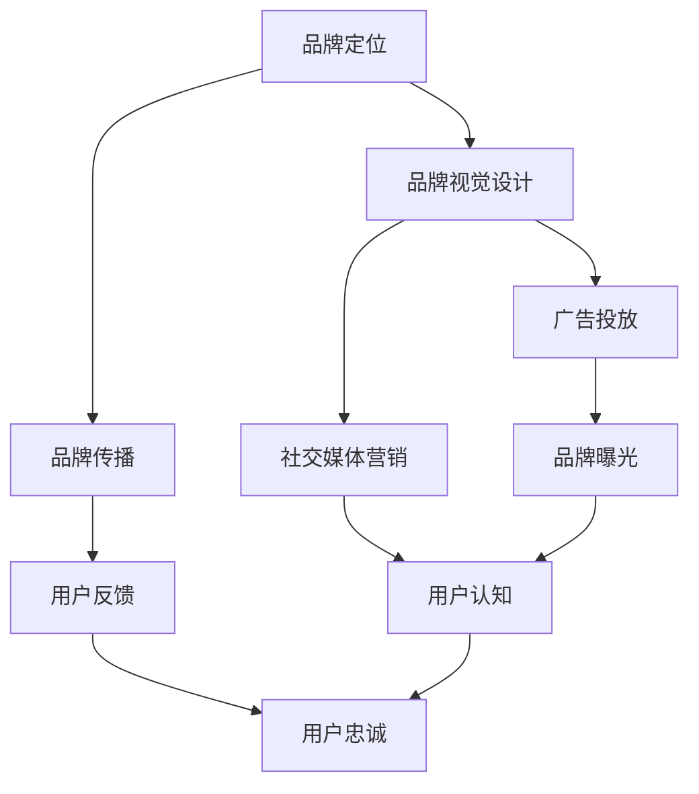

                 

 **关键词**: 知识付费，品牌运营，品牌推广，策略，营销，用户增长，用户体验，数据分析

> **摘要**: 本文将深入探讨知识付费行业中的品牌运营与品牌推广策略。通过分析市场趋势，用户需求，以及成功的品牌案例，我们将为您揭示如何在竞争激烈的市场中打造和推广一个有影响力的知识付费品牌。

## 1. 背景介绍

### 知识付费行业的发展

知识付费作为一种商业模式，近年来在互联网的推动下得到了迅速发展。从在线课程、电子书籍到专业咨询，知识付费满足了人们对于高质量内容的需求。根据统计数据显示，全球知识付费市场规模逐年增长，预计在未来几年内将继续保持稳定上升态势。

### 品牌运营与品牌推广的重要性

在知识付费市场中，品牌的作用愈发突出。品牌不仅仅是企业的标识，更是用户信任的象征。一个成功的品牌能够为知识付费平台带来稳定的用户流量和收入，同时提升用户的忠诚度和口碑。因此，品牌运营与品牌推广成为知识付费企业必须重视的环节。

## 2. 核心概念与联系

### 品牌运营

品牌运营是指企业通过一系列策略和活动来管理和提升品牌的知名度和影响力。包括品牌定位、品牌视觉设计、品牌传播等。

### 品牌推广

品牌推广是品牌运营的一部分，主要目的是通过市场宣传和推广活动来增加品牌的曝光度和用户认知度。包括广告投放、社交媒体营销、内容营销等。

### 品牌与用户关系

品牌与用户的关系是品牌运营的核心。一个成功的品牌需要建立与用户之间的信任和情感连接，从而实现用户的忠诚和持续使用。

### Mermaid 流程图



## 3. 核心算法原理 & 具体操作步骤

### 3.1 算法原理概述

品牌运营与品牌推广的核心算法是基于用户行为分析和数据驱动的营销策略。通过收集和分析用户数据，企业可以精准定位目标用户，制定个性化的推广方案，从而提高品牌转化率和用户满意度。

### 3.2 算法步骤详解

#### 3.2.1 用户数据收集

- 用户行为数据：包括浏览记录、购买记录、互动行为等。
- 社会媒体数据：包括点赞、评论、分享等互动数据。
- 问卷调查：收集用户对于品牌和产品的看法和建议。

#### 3.2.2 用户数据分析

- 用户画像：基于用户数据构建用户画像，了解用户的兴趣、需求和偏好。
- 数据分析工具：如Google Analytics、KPI分析工具等。

#### 3.2.3 品牌定位与推广方案制定

- 根据用户画像制定品牌定位和推广方案。
- 制定个性化的内容策略，包括文章、视频、海报等。

#### 3.2.4 广告投放与社交媒体营销

- 选择合适的广告平台和社交媒体渠道进行投放。
- 运用大数据分析优化广告投放策略，提高投放效果。

### 3.3 算法优缺点

#### 优点

- 提高品牌曝光度和用户认知度。
- 提高用户转化率和忠诚度。
- 降低营销成本，提高投资回报率。

#### 缺点

- 需要大量的数据和技术支持。
- 数据分析和管理需要专业知识和经验。

### 3.4 算法应用领域

- 知识付费平台：通过用户数据分析制定个性化课程推荐，提高用户满意度和转化率。
- 电商平台：通过用户数据分析进行精准广告投放和推荐，提高销售额。
- 咨询公司：通过用户数据分析提供定制化的咨询服务，提升服务质量和客户满意度。

## 4. 数学模型和公式 & 详细讲解 & 举例说明

### 4.1 数学模型构建

品牌运营与品牌推广的数学模型主要包括以下三个部分：

- 用户行为模型：根据用户行为数据构建用户行为模型，如马尔可夫模型、贝叶斯网络等。
- 用户兴趣模型：根据用户兴趣数据构建用户兴趣模型，如协同过滤算法、K-means聚类算法等。
- 营销效果模型：根据营销数据构建营销效果模型，如线性回归、逻辑回归等。

### 4.2 公式推导过程

以用户行为模型为例，我们使用马尔可夫模型来描述用户行为。

- 状态转移矩阵 \( P \):

\[ P = \begin{bmatrix} 
p_{11} & p_{12} & \dots & p_{1n} \\ 
p_{21} & p_{22} & \dots & p_{2n} \\ 
\vdots & \vdots & \ddots & \vdots \\ 
p_{m1} & p_{m2} & \dots & p_{mn} 
\end{bmatrix} \]

其中，\( p_{ij} \) 表示从状态 \( i \) 转移到状态 \( j \) 的概率。

- 初始状态概率向量 \( \pi \):

\[ \pi = \begin{bmatrix} 
\pi_1 \\ 
\pi_2 \\ 
\vdots \\ 
\pi_m 
\end{bmatrix} \]

其中，\( \pi_i \) 表示初始状态为 \( i \) 的概率。

- 未来状态概率向量 \( \pi' \):

\[ \pi' = P^n\pi \]

其中，\( n \) 表示预测的时间步数。

### 4.3 案例分析与讲解

假设一个知识付费平台，用户行为数据包括浏览、购买、评价等。我们使用马尔可夫模型来预测用户的下一步行为。

- 用户行为状态集合：{浏览，购买，评价}
- 状态转移矩阵：

\[ P = \begin{bmatrix} 
0.2 & 0.5 & 0.3 \\ 
0.1 & 0.4 & 0.5 \\ 
0.3 & 0.2 & 0.5 
\end{bmatrix} \]

- 初始状态概率向量：

\[ \pi = \begin{bmatrix} 
0.4 \\ 
0.3 \\ 
0.3 
\end{bmatrix} \]

预测用户在第三步购买的概率：

\[ \pi' = P^3\pi = \begin{bmatrix} 
0.044 \\ 
0.064 \\ 
0.082 
\end{bmatrix} \]

用户在第三步购买的概率为0.082，说明用户购买的概率较高。

## 5. 项目实践：代码实例和详细解释说明

### 5.1 开发环境搭建

- 使用Python进行数据分析与建模。
- 使用Jupyter Notebook进行代码编写与调试。
- 使用matplotlib进行数据可视化。

### 5.2 源代码详细实现

以下是一个简单的用户行为数据分析的Python代码实例：

```python
import numpy as np
import pandas as pd
import matplotlib.pyplot as plt

# 加载用户行为数据
data = pd.read_csv('user_behavior.csv')

# 构建状态转移矩阵
transition_counts = data.groupby(['current_state', 'next_state']).size().unstack(fill_value=0)
transition_matrix = transition_counts / transition_counts.sum(axis=1)[:, None]

# 初始状态概率向量
initial_counts = data['current_state'].value_counts()
initial_matrix = initial_counts / len(data)

# 预测用户行为
for i in range(1, 4):
    initial_matrix = np.dot(transition_matrix, initial_matrix)
    print(f"预测第{i}步：{initial_matrix}")

# 可视化状态转移矩阵
plt.imshow(transition_matrix, cmap='hot', interpolation='nearest')
plt.colorbar()
plt.xticks(np.arange(3), ['浏览', '购买', '评价'], rotation=90)
plt.yticks(np.arange(3), ['浏览', '购买', '评价'])
plt.show()
```

### 5.3 代码解读与分析

- 代码首先加载用户行为数据，并计算状态转移矩阵。
- 状态转移矩阵表示用户在不同状态之间的转移概率。
- 初始状态概率向量表示用户初始状态的概率分布。
- 通过迭代计算，可以预测用户在后续步骤的行为概率。
- 代码最后使用matplotlib对状态转移矩阵进行可视化，帮助理解用户行为模式。

### 5.4 运行结果展示

运行代码后，将输出用户在第三步购买的概率，以及状态转移矩阵的可视化结果。

## 6. 实际应用场景

### 6.1 在线教育平台

知识付费平台可以通过用户行为分析，为用户提供个性化的课程推荐，提高用户满意度和转化率。

### 6.2 专业咨询

咨询公司可以通过用户数据分析，提供定制化的咨询服务，提高服务质量和客户满意度。

### 6.3 企业培训

企业培训部门可以通过用户数据分析，制定个性化的培训计划，提高员工的学习效果和工作效率。

## 7. 工具和资源推荐

### 7.1 学习资源推荐

- 《用户行为数据分析：从零开始》
- 《Python数据分析基础教程》

### 7.2 开发工具推荐

- Jupyter Notebook
- PyCharm

### 7.3 相关论文推荐

- "User Behavior Analysis in Knowledge-based Applications"
- "Data-Driven Marketing Strategies for Knowledge-based Services"

## 8. 总结：未来发展趋势与挑战

### 8.1 研究成果总结

通过本文的探讨，我们了解到品牌运营与品牌推广在知识付费行业中的重要性，以及基于用户行为分析的数据驱动营销策略的应用。

### 8.2 未来发展趋势

随着人工智能和数据技术的发展，品牌运营与品牌推广将更加智能化和个性化。知识付费行业将继续保持快速增长，为品牌运营与品牌推广提供更多机会。

### 8.3 面临的挑战

数据隐私和安全、算法透明性和公平性是知识付费行业面临的主要挑战。企业需要采取措施确保用户数据的安全和隐私。

### 8.4 研究展望

未来的研究可以重点关注以下几个方面：

- 开发更高效的算法和模型，提高用户数据分析的准确性和实时性。
- 研究如何平衡个性化与用户隐私之间的关系。
- 探索跨平台的用户行为分析技术，实现更广泛的应用。

## 9. 附录：常见问题与解答

### Q：如何确保用户数据的安全和隐私？

A：企业应采取严格的数据安全措施，包括数据加密、访问控制、定期安全审计等。同时，应遵循相关法律法规，确保用户数据的安全和隐私。

### Q：数据驱动营销策略如何提高用户满意度？

A：通过深入了解用户需求和行为，企业可以提供个性化的内容和服务，提高用户满意度。同时，实时监测和优化营销策略，确保用户获得最佳体验。

## 作者署名

作者：禅与计算机程序设计艺术 / Zen and the Art of Computer Programming

----------------------------------------------------------------

本文通过深入探讨知识付费行业中的品牌运营与品牌推广策略，为读者提供了全面的指导和实用的工具。希望本文能够帮助知识付费企业更好地打造和推广品牌，实现持续增长和成功。在未来的发展中，我们将继续关注这一领域的新趋势和新挑战，为读者带来更多有价值的内容。感谢您的阅读！

