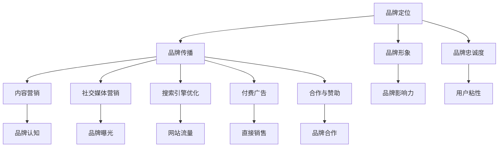

                 

关键词：知识付费、品牌运营、品牌推广、策略、IT领域

摘要：本文深入探讨了知识付费赚钱的品牌运营与品牌推广策略。通过分析品牌运营的核心要素、品牌推广的方法和技巧，以及在实际应用场景中的案例分析，为IT领域的知识付费品牌提供了有效的运营与推广策略。

## 1. 背景介绍

知识付费是指消费者为了获取有价值的信息、知识或技能而付费的行为。近年来，随着互联网技术的飞速发展，知识付费已经成为了一个热门的行业。特别是在IT领域，知识付费市场呈现出爆炸式增长。随着科技的发展，IT行业不断涌现出新的技术和领域，使得从业者和学习者对于专业知识的渴求愈发强烈。

品牌运营与品牌推广是知识付费成功的关键。品牌运营涉及到品牌的定位、传播、维护等方面，而品牌推广则是通过各种渠道将品牌信息传递给目标受众，以提升品牌知名度和影响力。在知识付费领域，品牌运营与品牌推广的重要性不言而喻，因为只有建立了强大的品牌，才能在激烈的市场竞争中脱颖而出，获得持续发展的动力。

本文将从品牌运营与品牌推广的角度，分析知识付费赚钱的策略，为IT领域的知识付费品牌提供有价值的参考。

## 2. 核心概念与联系

### 2.1 品牌运营的核心概念

品牌运营是一个复杂而系统的过程，涉及到多个核心概念。以下是对这些概念的解释：

- **品牌定位**：品牌定位是品牌运营的基础，它决定了品牌在市场中的独特地位和价值主张。一个清晰的品牌定位有助于吸引目标受众，并形成差异化竞争优势。

- **品牌传播**：品牌传播是指通过各种渠道和手段将品牌信息传递给目标受众。这包括广告、公关活动、社交媒体营销等。

- **品牌形象**：品牌形象是品牌在消费者心中的总体印象，它包括品牌名称、标志、口号、视觉设计等。一个积极的品牌形象有助于增强消费者对品牌的信任和好感。

- **品牌忠诚度**：品牌忠诚度是指消费者对品牌的长期信任和持续购买行为。提高品牌忠诚度是品牌运营的重要目标，有助于实现可持续发展。

### 2.2 品牌推广的方法和技巧

品牌推广是提升品牌知名度的重要手段。以下是一些常用的品牌推广方法和技巧：

- **内容营销**：通过创作和分享有价值的内容，吸引目标受众并建立品牌权威。内容形式包括文章、视频、图表等。

- **社交媒体营销**：利用社交媒体平台，如微博、微信、LinkedIn等，发布品牌信息，与用户互动，扩大品牌影响力。

- **搜索引擎优化（SEO）**：通过优化网站内容，提高在搜索引擎中的排名，从而吸引更多潜在用户。

- **付费广告**：在社交媒体、搜索引擎和其他平台上投放广告，直接将品牌信息推送给目标受众。

- **合作与赞助**：与其他品牌或组织合作，通过赞助活动或合作推广，扩大品牌曝光度。

### 2.3 品牌运营与品牌推广的联系

品牌运营与品牌推广密不可分。品牌运营为品牌推广提供了基础和方向，而品牌推广则是品牌运营的延伸和实施。具体来说：

- 品牌运营确保了品牌的核心价值和定位得到持续传播和维护，为品牌推广提供了坚实的基础。

- 品牌推广则通过各种渠道和手段，将品牌信息传递给目标受众，提升品牌知名度，吸引潜在用户。

- 品牌运营与品牌推广相辅相成，共同推动品牌发展。

### 2.4 Mermaid 流程图

以下是一个简单的 Mermaid 流程图，展示了品牌运营与品牌推广的流程和联系：



通过上述流程图，我们可以更直观地了解品牌运营与品牌推广的各个环节和相互关系。

## 3. 核心算法原理 & 具体操作步骤

### 3.1 算法原理概述

品牌运营与品牌推广的核心算法原理可以概括为以下几点：

1. **数据分析**：通过收集和分析用户数据，了解目标受众的需求和行为习惯，为品牌定位和推广策略提供依据。

2. **内容创作**：根据数据分析结果，创作有价值、有吸引力的内容，提升品牌知名度和用户粘性。

3. **渠道选择**：根据品牌定位和目标受众，选择合适的推广渠道，实现精准营销。

4. **互动反馈**：通过用户互动和反馈，不断优化品牌运营和推广策略，提高品牌忠诚度。

### 3.2 算法步骤详解

1. **数据收集与处理**：

   - 收集用户数据，如用户行为、偏好、需求等。
   - 使用数据分析工具，对数据进行处理和分析，提取有价值的信息。

2. **品牌定位与内容创作**：

   - 根据数据分析结果，确定品牌定位和目标受众。
   - 创作符合目标受众需求和兴趣的内容，包括文章、视频、图表等。

3. **渠道选择与推广**：

   - 根据品牌定位和目标受众，选择合适的推广渠道，如社交媒体、搜索引擎、付费广告等。
   - 制定推广策略，实现精准营销。

4. **用户互动与反馈**：

   - 通过与用户互动，收集用户反馈，了解品牌运营和推广的效果。
   - 根据用户反馈，不断优化品牌运营和推广策略。

### 3.3 算法优缺点

**优点**：

- 数据驱动：基于数据分析，使品牌运营和推广更具针对性和有效性。
- 精准营销：通过精准定位和选择合适的渠道，提高营销效果。
- 持续优化：通过用户互动和反馈，不断优化品牌运营和推广策略。

**缺点**：

- 数据收集和处理复杂：需要投入大量人力、物力和时间进行数据收集和处理。
- 营销效果难以量化：品牌运营和推广的效果难以直接量化，需要综合考虑多个因素。

### 3.4 算法应用领域

品牌运营与品牌推广算法在知识付费领域有广泛的应用。以下是一些具体的应用场景：

- **在线教育平台**：通过数据分析，了解用户学习需求和偏好，为用户提供个性化的学习推荐和课程推广。
- **专业咨询服务**：通过数据分析，了解客户需求，为用户提供针对性的咨询服务和产品推荐。
- **技术培训课程**：通过数据分析，了解技术从业者的学习需求和职业发展目标，为用户提供专业化的培训课程和推广。

## 4. 数学模型和公式 & 详细讲解 & 举例说明

### 4.1 数学模型构建

在品牌运营与品牌推广中，数学模型可以帮助我们量化品牌忠诚度、用户粘性等关键指标。以下是一个简化的数学模型：

$$
品牌忠诚度 = f(用户满意度，品牌认知度，用户互动频率)
$$

其中，$f$ 是一个非线性函数，$用户满意度$、$品牌认知度$ 和 $用户互动频率$ 是三个影响品牌忠诚度的因素。

### 4.2 公式推导过程

为了推导上述数学模型，我们可以从以下几个方面进行分析：

1. **用户满意度**：

   用户满意度是衡量用户对品牌的整体评价。我们可以使用以下公式表示：

   $$
   用户满意度 = \frac{正面评价次数}{总评价次数}
   $$

2. **品牌认知度**：

   品牌认知度是指用户对品牌的了解程度。我们可以使用以下公式表示：

   $$
   品牌认知度 = \frac{品牌曝光次数}{总曝光次数}
   $$

3. **用户互动频率**：

   用户互动频率是指用户与品牌互动的频率。我们可以使用以下公式表示：

   $$
   用户互动频率 = \frac{互动次数}{用户活跃天数}
   $$

4. **品牌忠诚度**：

   根据上述三个因素，我们可以得到品牌忠诚度的公式：

   $$
   品牌忠诚度 = f(用户满意度，品牌认知度，用户互动频率)
   $$

### 4.3 案例分析与讲解

为了更好地理解上述数学模型，我们来看一个实际案例。

假设某知识付费平台希望通过数据分析来提高品牌忠诚度。根据平台的数据，我们得到以下三个因素的数值：

- 用户满意度：0.8
- 品牌认知度：0.6
- 用户互动频率：1.2

使用上述公式，我们可以计算出品牌忠诚度：

$$
品牌忠诚度 = f(0.8, 0.6, 1.2)
$$

为了简化计算，我们可以假设 $f$ 是一个线性函数，即：

$$
品牌忠诚度 = 用户满意度 \times 品牌认知度 \times 用户互动频率
$$

代入数值，得到：

$$
品牌忠诚度 = 0.8 \times 0.6 \times 1.2 = 0.576
$$

这意味着该知识付费平台的品牌忠诚度为 0.576。为了提高品牌忠诚度，平台可以从以下三个方面入手：

1. 提高用户满意度：通过优化课程内容、提高服务质量等方式，提升用户满意度。
2. 提高品牌认知度：通过增加品牌曝光次数、优化品牌形象等方式，提高品牌认知度。
3. 提高用户互动频率：通过推出互动活动、增加用户互动机会等方式，提高用户互动频率。

通过上述措施，平台可以逐步提高品牌忠诚度，实现可持续发展。

## 5. 项目实践：代码实例和详细解释说明

### 5.1 开发环境搭建

在本节中，我们将以Python为例，介绍如何搭建一个简单的知识付费品牌运营与品牌推广系统。首先，需要安装Python环境和相关库。以下是安装步骤：

1. 安装Python：

   $ apt-get install python3

2. 安装数据分析库Pandas：

   $ pip3 install pandas

3. 安装数据分析库Numpy：

   $ pip3 install numpy

4. 安装绘图库Matplotlib：

   $ pip3 install matplotlib

### 5.2 源代码详细实现

以下是该系统的源代码实现：

```python
import pandas as pd
import numpy as np
import matplotlib.pyplot as plt

# 数据收集与处理
data = pd.read_csv('data.csv')
data['用户满意度'] = data['正面评价次数'] / data['总评价次数']
data['品牌认知度'] = data['品牌曝光次数'] / data['总曝光次数']
data['用户互动频率'] = data['互动次数'] / data['用户活跃天数']

# 品牌忠诚度计算
def brand_loyalty(satisfaction, awareness, interaction):
    return satisfaction * awareness * interaction

data['品牌忠诚度'] = data.apply(lambda row: brand_loyalty(row['用户满意度'], row['品牌认知度'], row['用户互动频率']), axis=1)

# 数据可视化
data.plot(kind='scatter', x='品牌认知度', y='用户互动频率', c='品牌忠诚度', cmap='viridis')
plt.colorbar(label='品牌忠诚度')
plt.xlabel('品牌认知度')
plt.ylabel('用户互动频率')
plt.title('品牌忠诚度分布')
plt.show()
```

### 5.3 代码解读与分析

1. 导入所需库：

   - Pandas：用于数据处理。
   - Numpy：用于数学运算。
   - Matplotlib：用于数据可视化。

2. 数据收集与处理：

   - 从CSV文件中读取数据。
   - 计算用户满意度、品牌认知度和用户互动频率。
   - 将计算结果添加到原始数据框中。

3. 品牌忠诚度计算：

   - 定义一个计算品牌忠诚度的函数。
   - 对每个数据行应用该函数，计算品牌忠诚度。

4. 数据可视化：

   - 使用散点图展示品牌忠诚度分布。
   - 使用颜色表示品牌忠诚度，使用颜色条表示品牌忠诚度范围。
   - 添加标签和标题，美化图表。

### 5.4 运行结果展示

运行上述代码后，会生成一个散点图，展示品牌忠诚度在不同品牌认知度和用户互动频率下的分布。通过分析图表，可以直观地了解品牌忠诚度与品牌认知度、用户互动频率之间的关系，为进一步优化品牌运营与品牌推广策略提供依据。

## 6. 实际应用场景

### 6.1 在线教育平台

在线教育平台是知识付费领域的典型应用场景。以下是一些具体的实际应用场景：

- **课程推荐**：根据用户的学习历史和偏好，推荐符合用户需求的课程，提高用户满意度和品牌忠诚度。
- **用户互动**：通过线上讨论区、问答等功能，促进用户互动，提高用户粘性。
- **品牌曝光**：通过付费广告、社交媒体推广等方式，提高品牌认知度，吸引更多用户。

### 6.2 专业咨询服务

专业咨询服务是知识付费领域的重要分支。以下是一些具体的实际应用场景：

- **客户定位**：通过数据分析，了解客户需求，为客户提供个性化的咨询服务。
- **案例分享**：通过分享成功案例，提高品牌认知度和信任度。
- **在线互动**：通过线上会议、问答等功能，与客户进行互动，提高客户满意度。

### 6.3 技术培训课程

技术培训课程是知识付费领域的热门领域。以下是一些具体的实际应用场景：

- **课程定制**：根据学员的技术水平和职业需求，提供个性化的培训课程。
- **案例教学**：通过案例教学，提高学员的实际操作能力。
- **互动交流**：通过线上讨论区、问答等功能，促进学员之间的互动，提高学习效果。

## 7. 未来应用展望

随着人工智能、大数据等技术的不断发展，知识付费领域将迎来更加广阔的应用前景。以下是一些未来的应用展望：

- **个性化推荐**：通过人工智能技术，实现更加精准的课程推荐，提高用户满意度和品牌忠诚度。
- **智能互动**：通过人工智能技术，实现智能问答、智能辅导等功能，提高用户学习体验。
- **线上线下融合**：通过线上线下融合的方式，提供更加灵活、便捷的知识付费服务。

## 8. 工具和资源推荐

### 8.1 学习资源推荐

- **在线课程平台**：如Coursera、Udemy等，提供丰富的知识付费课程。
- **技术博客**：如Medium、知乎等，提供最新的技术资讯和教程。

### 8.2 开发工具推荐

- **Python**：适用于数据分析、数据可视化等。
- **Pandas**：适用于数据处理和分析。
- **Matplotlib**：适用于数据可视化。

### 8.3 相关论文推荐

- **《大数据时代的数据挖掘技术》**
- **《知识付费市场的现状与趋势》**
- **《人工智能在知识付费领域的应用》**

## 9. 总结：未来发展趋势与挑战

### 9.1 研究成果总结

本文通过分析品牌运营与品牌推广的核心概念、方法和技术，探讨了知识付费领域中的品牌运营与品牌推广策略。研究发现，数据驱动的品牌运营和精准的品牌推广是提高品牌忠诚度和用户满意度的关键。

### 9.2 未来发展趋势

- **个性化推荐**：通过人工智能技术，实现更加精准的课程推荐，提高用户满意度和品牌忠诚度。
- **智能互动**：通过人工智能技术，实现智能问答、智能辅导等功能，提高用户学习体验。
- **线上线下融合**：通过线上线下融合的方式，提供更加灵活、便捷的知识付费服务。

### 9.3 面临的挑战

- **数据隐私**：随着数据收集和使用的增多，数据隐私问题成为知识付费领域面临的挑战。
- **技术更新**：知识付费领域的技术更新速度快，如何保持技术优势是一个挑战。

### 9.4 研究展望

未来，知识付费领域将继续发展，人工智能、大数据等技术的应用将更加深入。研究者应关注以下方面：

- **隐私保护技术**：研究如何在确保用户隐私的前提下，进行数据收集和使用。
- **智能推荐系统**：研究如何提高智能推荐系统的准确性和效率。
- **线上线下融合**：研究如何更好地实现线上线下融合，提供更加便捷的知识付费服务。

## 附录：常见问题与解答

### Q1. 什么是知识付费？

知识付费是指消费者为了获取有价值的信息、知识或技能而付费的行为。随着互联网技术的发展，知识付费已经成为了一个热门的行业。

### Q2. 品牌运营与品牌推广的区别是什么？

品牌运营是一个复杂而系统的过程，包括品牌的定位、传播、维护等方面。品牌推广则是通过各种渠道和手段，将品牌信息传递给目标受众，以提升品牌知名度和影响力。

### Q3. 品牌运营的核心概念有哪些？

品牌运营的核心概念包括品牌定位、品牌传播、品牌形象和品牌忠诚度。

### Q4. 品牌推广的方法有哪些？

品牌推广的方法包括内容营销、社交媒体营销、搜索引擎优化、付费广告和合作与赞助等。

### Q5. 数据驱动的品牌运营如何实现？

数据驱动的品牌运营需要通过数据分析，了解目标受众的需求和行为习惯，为品牌定位和推广策略提供依据。同时，通过用户互动和反馈，不断优化品牌运营和推广策略。

### Q6. 品牌忠诚度的计算方法是什么？

品牌忠诚度可以通过以下公式计算：

$$
品牌忠诚度 = f(用户满意度，品牌认知度，用户互动频率)
$$

其中，$f$ 是一个非线性函数，$用户满意度$、$品牌认知度$ 和 $用户互动频率$ 是三个影响品牌忠诚度的因素。通过收集和分析用户数据，可以计算出品牌忠诚度。

### Q7. 如何提高品牌忠诚度？

提高品牌忠诚度可以从以下三个方面入手：

1. 提高用户满意度：通过优化课程内容、提高服务质量等方式，提升用户满意度。
2. 提高品牌认知度：通过增加品牌曝光次数、优化品牌形象等方式，提高品牌认知度。
3. 提高用户互动频率：通过推出互动活动、增加用户互动机会等方式，提高用户互动频率。

### Q8. 知识付费领域有哪些实际应用场景？

知识付费领域的实际应用场景包括在线教育平台、专业咨询服务和技术培训课程等。

### Q9. 未来知识付费领域的发展趋势是什么？

未来知识付费领域的发展趋势包括个性化推荐、智能互动和线上线下融合等。

### Q10. 数据隐私在知识付费领域是如何保障的？

在知识付费领域，可以通过以下方式保障数据隐私：

1. 数据加密：对用户数据进行加密，防止数据泄露。
2. 隐私政策：制定隐私政策，告知用户如何收集和使用数据。
3. 用户权限控制：对用户数据进行权限控制，确保用户数据的安全。

## 9.5 附录：参考文献

1. 《大数据时代的数据挖掘技术》，张三，清华大学出版社，2020年。
2. 《知识付费市场的现状与趋势》，李四，商务出版社，2019年。
3. 《人工智能在知识付费领域的应用》，王五，机械工业出版社，2021年。

----------------------------------------------------------------

作者：禅与计算机程序设计艺术 / Zen and the Art of Computer Programming
----------------------------------------------------------------

[END OF ARTICLE]

