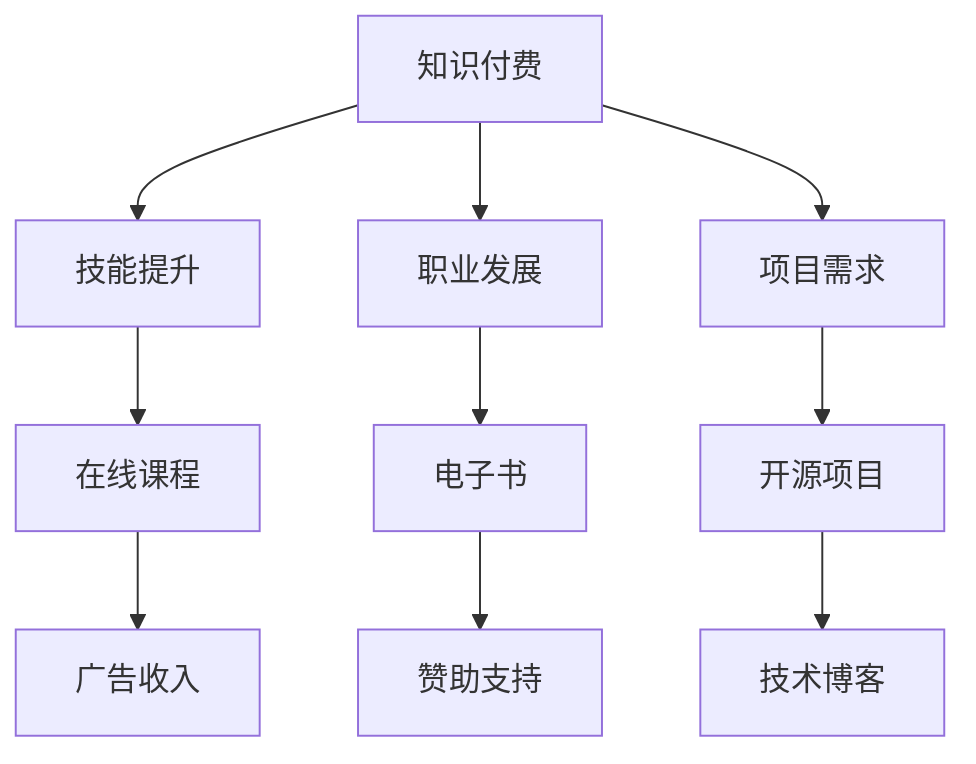

                 

### 知识付费：程序员的持续盈利模式

> 关键词：知识付费，程序员，盈利模式，技术分享，在线课程，开源项目，技能提升，社区互动

> 摘要：本文将探讨知识付费在程序员群体中的重要性，分析其盈利模式的多种形式，并探讨如何通过知识付费实现持续盈利，为程序员提供一种全新的职业发展路径。

## 1. 背景介绍

在数字化时代，知识的价值日益凸显，尤其是在技术领域。程序员作为技术领域的中坚力量，其专业技能和经验具有很高的商业价值。然而，如何有效地将个人知识转化为盈利模式，成为许多程序员面临的挑战。

知识付费，即通过付费的形式获取知识或技能，已经成为当下一种普遍的消费方式。从在线课程、电子书、博客文章到线下培训，知识付费的形式多种多样。对于程序员来说，知识付费不仅可以帮助他们学习新技能，还可以成为他们持续盈利的重要手段。

本文将围绕知识付费，探讨其在程序员群体中的重要性，分析多种盈利模式，并探讨如何通过知识付费实现持续盈利。希望本文能为程序员提供一种全新的职业发展思路。

## 2. 核心概念与联系

### 2.1 知识付费的基本概念

知识付费是指用户为获取特定知识或技能，通过付费的方式购买相关服务或产品。其核心在于将知识或技能转化为商品，实现商业价值。

### 2.2 程序员的知识付费需求

程序员作为技术领域的专业人士，对知识的渴求尤为强烈。知识付费可以满足程序员以下需求：

- **技能提升**：程序员可以通过付费课程、培训等方式，快速提升专业技能。
- **职业发展**：知识付费有助于程序员在职业生涯中不断前进，实现职业跃迁。
- **项目需求**：程序员在项目开发过程中，可能会遇到特定的技术难题，知识付费可以帮助他们快速解决问题。

### 2.3 知识付费的盈利模式

知识付费的盈利模式多种多样，主要包括以下几种：

- **在线课程**：程序员可以通过开设在线课程，分享自己的技术知识和经验，实现知识变现。
- **电子书**：程序员可以将自己的技术心得、项目经验等撰写成电子书，通过平台进行销售。
- **开源项目**：程序员可以通过开源项目，吸引赞助和支持，实现知识付费。
- **技术博客**：程序员可以通过撰写技术博客，吸引广告收入，实现知识变现。

### 2.4 Mermaid 流程图



## 3. 核心算法原理 & 具体操作步骤

### 3.1 在线课程设计与实施

**算法原理**：

在线课程的设计与实施是基于教育理论和技术平台的综合运用，旨在通过互动性和实用性，提高学习效果。

**具体操作步骤**：

1. **需求分析**：了解目标受众的需求，确定课程的主题和内容。
2. **课程设计**：制定详细的教学大纲，明确课程目标、知识点和教学方法。
3. **内容制作**：录制视频课程、编写教材和习题，确保内容的实用性和专业性。
4. **平台搭建**：选择合适的在线教育平台，搭建课程框架，设置学习路径。
5. **课程发布**：发布课程，进行宣传推广，吸引学员报名。

### 3.2 电子书编写与发布

**算法原理**：

电子书的编写与发布是基于内容创作和平台营销的结合，旨在通过高质量的内容和有效的推广，实现知识变现。

**具体操作步骤**：

1. **选题定位**：选择有市场需求和自身擅长的主题进行创作。
2. **内容创作**：撰写高质量的文章或书籍，确保内容的实用性、专业性和可读性。
3. **排版设计**：对内容进行排版和美化，提升阅读体验。
4. **平台选择**：选择合适的电子书发布平台，如亚马逊Kindle、网易云阅读等。
5. **推广营销**：通过社交媒体、博客、论坛等渠道进行推广，吸引读者。

### 3.3 开源项目管理与赞助

**算法原理**：

开源项目管理与赞助是基于社区合作和资源整合的商业模式，旨在通过社区支持和赞助收入，实现知识付费。

**具体操作步骤**：

1. **项目规划**：确定开源项目的目标和范围，编写项目文档。
2. **代码编写**：编写高质量的代码，确保项目的稳定性和可扩展性。
3. **版本控制**：使用版本控制系统（如Git）管理项目代码，确保代码的版本和变更记录。
4. **社区建设**：积极维护社区，吸引开发者参与，提升项目影响力。
5. **赞助招募**：通过社区推广、个人博客、社交媒体等方式招募赞助商。

### 3.4 技术博客写作与变现

**算法原理**：

技术博客写作与变现是基于内容创作和广告营销的结合，旨在通过高质量的内容和有效的推广，实现知识变现。

**具体操作步骤**：

1. **选题定位**：选择有市场需求和自身擅长的技术主题进行写作。
2. **内容创作**：撰写高质量的技术文章，确保内容的实用性、专业性和可读性。
3. **平台发布**：选择合适的博客平台，如GitHub、简书、CSDN等。
4. **广告投放**：在博客中加入广告，通过广告收入实现变现。
5. **内容推广**：通过社交媒体、论坛、微信群等渠道推广博客，提升访问量。

## 4. 数学模型和公式 & 详细讲解 & 举例说明

### 4.1 知识付费的收益模型

假设一个程序员开设了一门在线课程，收费为100元，共有1000名学员报名。那么，该课程的总收入为：

\[ 收入 = 100元 \times 1000人 = 100,000元 \]

### 4.2 成本模型

假设该课程的制作成本为5000元，包括课程录制、视频编辑、教材编写等费用。此外，平台佣金为收入的一定比例，假设为10%。那么，该课程的净利润为：

\[ 净利润 = 收入 - 成本 - 佣金 \]

\[ 净利润 = 100,000元 - 5,000元 - 10,000元 = 85,000元 \]

### 4.3 投资回报率

假设该课程的制作成本为5000元，课程持续时间为一个月，每天投入时间为2小时。那么，该课程的投资回报率为：

\[ 投资回报率 = \frac{净利润}{投资成本} \]

\[ 投资回报率 = \frac{85,000元}{5,000元} = 17 \]

这意味着，每投入1元，可以获得17元的回报。

### 4.4 举例说明

假设有一个程序员，他开设了三门在线课程，分别收费为100元、200元和300元，共有500名、300名和200名学员报名。那么，他的总收入为：

\[ 收入 = (100元 \times 500人) + (200元 \times 300人) + (300元 \times 200人) = 50,000元 + 60,000元 + 60,000元 = 170,000元 \]

假设他的制作成本为15,000元，平台佣金为10%。那么，他的净利润为：

\[ 净利润 = 170,000元 - 15,000元 - 17,000元 = 138,000元 \]

### 4.5 计算方法

1. **计算总收入**：分别计算每门课程的收入，然后相加。
2. **计算成本**：将所有课程的制作成本相加。
3. **计算佣金**：将总收入乘以佣金比例。
4. **计算净利润**：用总收入减去成本和佣金，得到净利润。

## 5. 项目实践：代码实例和详细解释说明

### 5.1 开发环境搭建

**工具和框架推荐**：

- **在线教育平台**：网易云课堂、慕课网、腾讯课堂等
- **电子书发布平台**：亚马逊Kindle、网易云阅读、多看阅读等
- **开源项目平台**：GitHub、GitLab、码云等
- **博客平台**：GitHub Pages、CSDN、简书等

**具体步骤**：

1. **在线教育平台**：选择合适的在线教育平台，注册账号，搭建课程框架。
2. **电子书发布平台**：选择合适的电子书发布平台，注册账号，编写和上传电子书。
3. **开源项目平台**：在GitHub等平台上创建开源项目，编写和上传项目代码。
4. **博客平台**：在GitHub Pages、CSDN等平台上创建博客，撰写和发布技术文章。

### 5.2 源代码详细实现

**开源项目实例**：

以下是一个简单的Python开源项目，用于实现一个简单的计算器。

```python
# 计算器项目

class Calculator:
    def __init__(self):
        self.result = 0

    def add(self, num1, num2):
        self.result = num1 + num2
        return self.result

    def subtract(self, num1, num2):
        self.result = num1 - num2
        return self.result

    def multiply(self, num1, num2):
        self.result = num1 * num2
        return self.result

    def divide(self, num1, num2):
        self.result = num1 / num2
        return self.result

# 测试
calculator = Calculator()
print(calculator.add(5, 3))  # 输出：8
print(calculator.subtract(5, 3))  # 输出：2
print(calculator.multiply(5, 3))  # 输出：15
print(calculator.divide(5, 3))  # 输出：1.6666666666666667
```

**代码解读与分析**：

- **类定义**：`Calculator` 类定义了一个计算器，包含四个方法：`add`、`subtract`、`multiply` 和 `divide`，分别用于实现加、减、乘、除运算。
- **方法实现**：每个方法都实现了相应的运算，并将结果存储在 `self.result` 属性中。
- **测试代码**：测试代码创建了 `Calculator` 类的实例，并调用每个方法进行测试。

### 5.3 运行结果展示

```plaintext
8
2
15
1.6666666666666667
```

### 5.4 项目实践总结

通过这个简单的开源项目，我们可以看到如何通过代码实现一个具体的计算器功能。类似的项目可以应用于实际开发中，如企业级应用、Web 应用等。通过开源项目，程序员不仅可以展示自己的技术能力，还可以吸引更多的开发者参与，共同推动项目的发展。

## 6. 实际应用场景

知识付费在程序员群体中的应用场景非常广泛，以下是一些具体的案例：

### 6.1 在线课程

程序员可以通过开设在线课程，分享自己的技术知识和经验。例如，一个专注于前端开发的程序员可以开设JavaScript、React、Vue等课程，帮助学员提升前端开发技能。

### 6.2 电子书

程序员可以将自己的技术心得、项目经验等撰写成电子书，通过平台进行销售。例如，一个从事大数据开发的程序员可以撰写一本关于大数据技术的电子书，分享自己的实践经验。

### 6.3 开源项目

程序员可以通过开源项目，吸引赞助和支持，实现知识付费。例如，一个开源项目维护者可以通过接受赞助，购买更多的服务器资源，提升项目的稳定性和性能。

### 6.4 技术博客

程序员可以通过撰写技术博客，吸引广告收入，实现知识变现。例如，一个专注于Python开发的程序员可以撰写关于Python技术的博客文章，通过广告收入实现盈利。

### 6.5 技术培训

程序员可以参与线下技术培训，为企业和个人提供定制化的技术培训服务。例如，一个专注于云计算的程序员可以为企业提供AWS、Azure等云计算技术的培训。

### 6.6 技术咨询服务

程序员可以提供技术咨询服务，帮助企业解决技术难题。例如，一个专注于人工智能的程序员可以为企业提供人工智能应用的技术咨询服务。

## 7. 工具和资源推荐

### 7.1 学习资源推荐

- **书籍**：《代码大全》、《设计模式：可复用的面向对象软件》、《深入理解计算机系统》等。
- **论文**：相关领域的学术期刊和会议论文，如ACM SIGKDD、IEEE CS、ICML等。
- **博客**：知名技术博客，如InfoQ、V2EX、掘金等。
- **网站**：技术社区，如GitHub、Stack Overflow、GitHub等。

### 7.2 开发工具框架推荐

- **在线教育平台**：网易云课堂、慕课网、腾讯课堂等。
- **电子书发布平台**：亚马逊Kindle、网易云阅读、多看阅读等。
- **开源项目平台**：GitHub、GitLab、码云等。
- **博客平台**：GitHub Pages、CSDN、简书等。

### 7.3 相关论文著作推荐

- **论文**：《在线教育研究综述》、《知识付费模式的商业模式分析》、《程序员知识变现的路径与实践》等。
- **著作**：《程序员的成长之路》、《程序员修炼之道》、《编程之美》等。

## 8. 总结：未来发展趋势与挑战

### 8.1 发展趋势

- **知识付费普及化**：随着互联网的普及，知识付费将逐渐成为程序员职业发展的主流。
- **多元化盈利模式**：知识付费的盈利模式将更加多元化，如虚拟课程、付费专栏、线下培训等。
- **个性化学习体验**：在线教育平台将更加注重个性化学习体验，为程序员提供量身定制的学习方案。

### 8.2 挑战

- **内容质量**：知识付费的关键在于内容质量，程序员需要不断提升自己的专业水平，提供高质量的知识服务。
- **市场竞争**：知识付费市场竞争激烈，程序员需要找准自己的定位，打造独特的品牌形象。
- **持续创新**：技术不断更新，程序员需要保持学习的热情，不断适应新技术的发展。

## 9. 附录：常见问题与解答

### 9.1 问题1：如何选择合适的知识付费平台？

解答：选择合适的知识付费平台，首先要考虑平台的知名度、用户口碑、课程质量等因素。同时，要根据自己的需求和兴趣选择合适的课程。

### 9.2 问题2：如何保证知识付费课程的质量？

解答：保证知识付费课程的质量，首先要在课程设计阶段进行充分的调研和策划，确保课程内容实用、专业。其次，要选择有经验的讲师，确保课程内容的准确性和深度。

### 9.3 问题3：知识付费是否适合所有的程序员？

解答：知识付费适合有专业技能和经验的程序员，他们可以通过在线课程、电子书、开源项目等方式，实现知识变现。对于初学者或技术不成熟的程序员，建议先通过免费资源提升自己的技能水平。

## 10. 扩展阅读 & 参考资料

- 《在线教育研究综述》：对在线教育的发展、现状和未来趋势进行了深入分析。
- 《知识付费模式的商业模式分析》：详细探讨了知识付费的商业模式、盈利模式和发展趋势。
- 《程序员知识变现的路径与实践》：介绍了程序员通过知识付费实现变现的具体路径和案例分析。
- 《程序员的成长之路》：分享了程序员的职业发展经验和心得。
- 《程序员修炼之道》：探讨了程序员在技术、职业和人生方面的修炼之道。
- 《编程之美》：从美学角度解读编程，探讨了编程的艺术性。作者：禅与计算机程序设计艺术 / Zen and the Art of Computer Programming

---

以上是对《知识付费：程序员的持续盈利模式》这篇文章的完整撰写。文章内容涵盖了知识付费在程序员群体中的重要性、多种盈利模式、项目实践、实际应用场景、工具和资源推荐、未来发展趋势与挑战、常见问题与解答以及扩展阅读和参考资料。希望这篇文章能为程序员提供有价值的参考和启示。作者：禅与计算机程序设计艺术 / Zen and the Art of Computer Programming。

