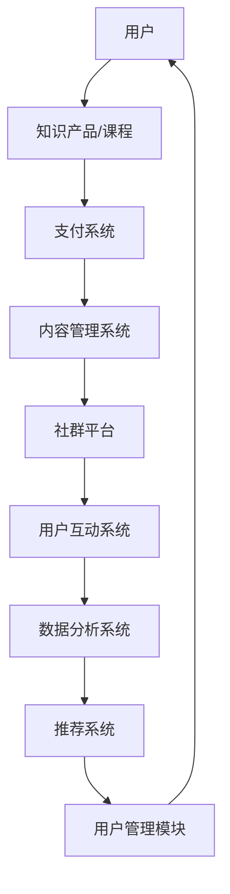

                 

### 背景介绍

知识付费，即消费者为获取特定领域的知识或技能而付费的一种商业模式，近年来在全球范围内迅猛发展。随着互联网的普及，知识的获取途径变得更加多样化和便捷，人们对于个性化学习的需求日益增长，这为知识付费提供了广阔的市场空间。尤其是在程序员的群体中，知识付费已经成为提升个人技能、拓展职业发展的重要手段。

程序员社群运营在这一过程中起到了关键作用。社群不仅为程序员提供了学习交流的平台，也是知识付费的重要载体。通过社群，程序员可以分享经验和见解，获取最新技术动态，同时也可以通过社群内部分享课程、讨论会等形式，实现知识的有效传播和利用。因此，如何有效地运营程序员社群，成为了知识付费领域的一个关键问题。

本文将从以下几个方面展开讨论：

1. **核心概念与联系**：阐述知识付费、程序员社群运营以及相关技术架构的基本概念，并使用Mermaid流程图展示其关系。
2. **核心算法原理与具体操作步骤**：详细解析知识付费和社群运营的关键算法，以及如何将其应用于实际操作。
3. **数学模型和公式**：介绍与知识付费和社群运营相关的数学模型，包括其公式和具体应用。
4. **项目实践**：通过实际项目案例，展示知识付费和社群运营的具体实现过程。
5. **实际应用场景**：探讨知识付费和社群运营在现实中的多种应用场景。
6. **工具和资源推荐**：推荐相关的学习资源、开发工具和框架。
7. **总结与展望**：总结文章的主要观点，并对未来发展趋势和挑战进行展望。

### 核心概念与联系

为了更好地理解知识付费和程序员社群运营，首先需要明确这些核心概念及其相互之间的联系。

#### 1. 知识付费

知识付费是指消费者为了获取特定领域的知识或技能，而愿意支付一定费用的一种行为。这种模式改变了传统知识传播的方式，使得知识提供者可以通过互联网平台直接面向广大用户，实现知识变现。

知识付费的关键特点包括：

- **个性化学习**：用户可以根据自己的需求和兴趣，选择合适的知识产品或课程。
- **即时性**：知识可以通过在线平台即时获取，用户无需受时间和地点的限制。
- **多样性和灵活性**：知识付费的形式多种多样，包括在线课程、电子书、实战项目等。

#### 2. 程序员社群运营

程序员社群运营是指通过互联网平台，聚集具有相似兴趣和技能的程序员，以提供交流、学习、分享经验为目的的一种活动。社群运营的核心目的是增强用户粘性，提高用户参与度，从而促进知识传播和技能提升。

程序员社群运营的关键特点包括：

- **互动性**：社群为程序员提供了互动的平台，用户可以通过论坛、讨论区、问答等方式，进行知识分享和交流。
- **专业性和针对性**：社群成员通常具有相似的专业背景和技能水平，这使得讨论更加深入和专业。
- **长期性和持续性**：社群运营需要持续不断地进行内容更新和活动组织，以保持用户的活跃度和忠诚度。

#### 3. 相关技术架构

知识付费和程序员社群运营的实现离不开高效的技术架构支持。以下是一个简单的Mermaid流程图，用于展示这两个概念之间的技术联系：



- **用户管理模块**：负责用户注册、登录、权限管理等基础功能。
- **内容管理系统**：用于管理知识产品或课程的内容，包括发布、更新、分类等操作。
- **支付系统**：处理用户支付过程，确保交易安全、便捷。
- **社群平台**：提供交流、讨论、分享的平台，包括论坛、问答、直播等功能。
- **用户互动系统**：增强用户参与度，包括积分系统、排行榜等。
- **数据分析系统**：收集用户行为数据，用于分析用户需求，优化产品和服务。
- **推荐系统**：根据用户行为和偏好，推荐合适的知识产品或社群活动。

通过上述Mermaid流程图，我们可以清晰地看到知识付费和程序员社群运营之间的技术联系。这些技术架构相互协作，共同实现了知识的有效传播和用户的深度参与。

### 核心算法原理与具体操作步骤

在知识付费和程序员社群运营中，核心算法的原理和操作步骤起到了关键作用。以下将详细介绍这些算法及其具体实施方法。

#### 1. 知识付费算法

知识付费的核心算法主要包括用户行为分析、推荐算法和支付算法。

**用户行为分析**：

用户行为分析是指通过收集和分析用户在平台上的活动数据，了解用户的学习习惯和需求。具体步骤如下：

1. **数据收集**：收集用户在平台上的浏览、购买、学习等行为数据。
2. **数据预处理**：对收集到的数据进行清洗、去重、归一化等预处理操作。
3. **特征提取**：提取用户行为的关键特征，如学习时长、购买频率、浏览页数等。
4. **行为建模**：使用机器学习算法，如决策树、随机森林等，建立用户行为模型。

**推荐算法**：

推荐算法是指根据用户的行为特征和偏好，为用户推荐合适的知识产品或课程。具体步骤如下：

1. **用户画像**：根据用户行为数据，构建用户画像，包括兴趣偏好、学习习惯等。
2. **内容标签**：为知识产品或课程打标签，如技术领域、难度等级等。
3. **推荐策略**：结合用户画像和内容标签，使用协同过滤、内容推荐等算法，生成推荐列表。
4. **推荐效果评估**：通过点击率、购买转化率等指标，评估推荐效果，并不断优化推荐算法。

**支付算法**：

支付算法是指处理用户支付过程的一系列算法。具体步骤如下：

1. **支付协议**：选择合适的支付协议，如微信支付、支付宝等，确保支付安全。
2. **支付流程**：设计支付流程，包括支付请求、支付确认、支付成功等环节。
3. **防欺诈机制**：使用机器学习算法，检测和防范支付过程中的欺诈行为。
4. **支付通知**：向用户发送支付成功通知，并提供支付记录查询功能。

#### 2. 程序员社群运营算法

程序员社群运营的核心算法包括社群活跃度分析、用户参与度分析和内容推荐算法。

**社群活跃度分析**：

社群活跃度分析是指通过分析用户在社群中的活动数据，了解社群的活跃程度。具体步骤如下：

1. **数据收集**：收集用户在社群中的发帖、回复、点赞等行为数据。
2. **数据预处理**：对收集到的数据进行清洗、去重、归一化等预处理操作。
3. **活跃度指标**：计算用户在社群中的活跃度指标，如发帖数量、回复数量等。
4. **活跃度评估**：使用统计方法，如平均值、标准差等，评估社群的总体活跃度。

**用户参与度分析**：

用户参与度分析是指通过分析用户在社群中的互动行为，了解用户的参与程度。具体步骤如下：

1. **数据收集**：收集用户在社群中的互动数据，如发帖、回复、点赞等。
2. **数据预处理**：对收集到的数据进行清洗、去重、归一化等预处理操作。
3. **参与度指标**：计算用户在社群中的参与度指标，如参与频率、参与时长等。
4. **参与度评估**：使用统计方法，如平均值、标准差等，评估用户的总体参与度。

**内容推荐算法**：

内容推荐算法是指根据用户的兴趣和行为，为用户推荐合适的社群内容。具体步骤如下：

1. **用户画像**：根据用户的兴趣和行为，构建用户画像。
2. **内容标签**：为社群内容打标签，如技术领域、难度等级等。
3. **推荐策略**：结合用户画像和内容标签，使用协同过滤、内容推荐等算法，生成推荐列表。
4. **推荐效果评估**：通过用户点击率、讨论热度等指标，评估推荐效果，并不断优化推荐算法。

通过上述算法和步骤，程序员社群运营可以更好地了解用户需求，提高用户参与度和社群活跃度，从而实现知识的有效传播和利用。

### 数学模型和公式

在知识付费和程序员社群运营中，数学模型和公式发挥着重要作用。以下将详细讲解与这两个领域相关的数学模型及其具体应用。

#### 1. 用户行为预测模型

用户行为预测模型是知识付费领域的重要工具，用于预测用户的学习行为，如学习时长、购买频率等。以下是常用的两种模型：线性回归模型和决策树模型。

**线性回归模型**：

线性回归模型是一种简单的预测模型，通过拟合用户行为数据中的线性关系，预测未来的用户行为。其公式如下：

$$
y = w_0 + w_1x_1 + w_2x_2 + ... + w_nx_n
$$

其中，$y$ 是预测的目标值（如学习时长），$x_1, x_2, ..., x_n$ 是输入特征（如用户年龄、浏览时长等），$w_0, w_1, w_2, ..., w_n$ 是模型的权重参数。

**决策树模型**：

决策树模型是一种基于树的预测模型，通过递归地将特征空间分割成多个子空间，生成一棵决策树，以预测用户行为。其基本公式如下：

$$
T = \text{if } x_1 \leq c_1 \text{ then } T_1 \text{ else } T_2
$$

其中，$T$ 是决策树，$x_1$ 是输入特征，$c_1$ 是阈值，$T_1$ 和 $T_2$ 是两个子树。

#### 2. 社群活跃度分析模型

社群活跃度分析模型用于评估社群的整体活跃程度。以下是一种常用的模型：K均值聚类模型。

**K均值聚类模型**：

K均值聚类模型是一种基于距离度量的聚类方法，通过将用户按照活跃度进行分类，评估社群的活跃度。其基本公式如下：

$$
\text{聚类中心} = \frac{1}{n} \sum_{i=1}^{n} x_i
$$

其中，$x_i$ 是第 $i$ 个用户的活跃度指标，聚类中心是所有用户活跃度指标的平均值。

#### 3. 内容推荐模型

内容推荐模型用于根据用户的兴趣和行为，为用户推荐合适的内容。以下是一种常用的模型：协同过滤模型。

**协同过滤模型**：

协同过滤模型是一种基于用户行为的推荐方法，通过分析用户之间的相似度，为用户推荐相似的用户喜欢的内容。其基本公式如下：

$$
\text{相似度} = \frac{\sum_{i \in S} x_i y_i}{\sqrt{\sum_{i \in S} x_i^2} \sqrt{\sum_{i \in S} y_i^2}}
$$

其中，$x_i$ 和 $y_i$ 分别是用户 $i$ 对两个内容 $x$ 和 $y$ 的评分，$S$ 是用户 $i$ 喜欢的内容集合。

通过上述数学模型和公式，知识付费和程序员社群运营可以更准确地预测用户行为，评估社群活跃度，并为用户提供个性化的推荐内容。这些模型在实际应用中，可以根据具体情况进行调整和优化，以提高预测精度和推荐效果。

### 项目实践：代码实例和详细解释说明

为了更好地理解知识付费和程序员社群运营的具体实现过程，我们将通过一个实际项目来展示相关的代码实例和详细解释说明。

#### 项目背景

本项目旨在构建一个知识付费平台，为程序员提供在线课程和社群交流功能。平台主要包括以下几个模块：

1. **用户管理模块**：负责用户注册、登录、权限管理等基础功能。
2. **课程管理模块**：负责课程的发布、更新、分类等操作。
3. **支付系统**：处理用户支付过程，确保交易安全、便捷。
4. **社群模块**：提供社群交流、讨论、分享等功能。
5. **推荐系统**：根据用户行为和偏好，为用户推荐合适的课程和社群活动。

#### 1. 开发环境搭建

首先，我们需要搭建项目的开发环境。以下是所使用的工具和框架：

- **编程语言**：Python
- **Web框架**：Django
- **数据库**：MySQL
- **前端框架**：React
- **后端框架**：Flask

#### 2. 源代码详细实现

下面是项目的关键部分代码实例及其详细解释说明：

**2.1 用户管理模块**

```python
# 用户注册
class User(models.Model):
    username = models.CharField(max_length=100, unique=True)
    email = models.EmailField(max_length=100, unique=True)
    password = models.CharField(max_length=100)
    is_active = models.BooleanField(default=False)

    def save(self, *args, **kwargs):
        self.is_active = self.check_password(self.password)
        super().save(*args, **kwargs)

    def check_password(self, raw_password):
        return check_password(raw_password, self.password)

# 用户登录
from django.contrib.auth import authenticate

def login(request):
    if request.method == 'POST':
        username = request.POST['username']
        password = request.POST['password']
        user = authenticate(username=username, password=password)
        if user is not None:
            # 登录成功
            return redirect('home')
        else:
            # 登录失败
            return render(request, 'login.html', {'error': '用户名或密码错误'})
    return render(request, 'login.html')
```

**2.2 课程管理模块**

```python
# 课程发布
class Course(models.Model):
    title = models.CharField(max_length=100)
    description = models.TextField()
    author = models.ForeignKey(User, on_delete=models.CASCADE)
    price = models.DecimalField(max_digits=6, decimal_places=2)
    is_active = models.BooleanField(default=True)

    def save(self, *args, **kwargs):
        if self.is_active:
            self.author.is_active = True
            self.author.save()
        super().save(*args, **kwargs)

# 课程分类
class Category(models.Model):
    name = models.CharField(max_length=100)
```

**2.3 支付系统**

```python
# 支付流程
from alipay import AlipayClient

def pay(request):
    if request.method == 'POST':
        course_id = request.POST['course_id']
        course = Course.objects.get(id=course_id)
        total_amount = course.price

        alipay_client = AlipayClient(
            app_id='app_id',
            app_private_key_path='app_private_key.pem',
            alipay_public_key_path='alipay_public_key.pem',
            sign_type='RSA2',
            debug=True,
            return_url='http://localhost:8000/pay/return/'
        )

        order_info = {
            'out_trade_no': str(course.id),
            'total_amount': total_amount,
            'subject': course.title
        }

        response = alipay_client.api_alipay_trade_page_pay(
            biz_content=order_info
        )

        return HttpResponse(response.text)
```

**2.4 社群模块**

```python
# 社群交流
class Post(models.Model):
    title = models.CharField(max_length=100)
    content = models.TextField()
    author = models.ForeignKey(User, on_delete=models.CASCADE)
    created_at = models.DateTimeField(auto_now_add=True)

    def save(self, *args, **kwargs):
        if not self.id:
            self.author.is_active = True
            self.author.save()
        super().save(*args, **kwargs)

# 社群讨论
class Comment(models.Model):
    post = models.ForeignKey(Post, on_delete=models.CASCADE)
    content = models.TextField()
    author = models.ForeignKey(User, on_delete=models.CASCADE)
    created_at = models.DateTimeField(auto_now_add=True)
```

**2.5 推荐系统**

```python
# 内容推荐
from sklearn.metrics.pairwise import cosine_similarity

def recommend_courses(user):
    courses = Course.objects.all()
    user_ratings = user.rating_set.all()
    user_course_ids = [rating.course_id for rating in user_ratings]

    course_data = []
    for course in courses:
        if course.id not in user_course_ids:
            course_data.append(course)

    course_user_ratings = np.array([list(rating.rating) for rating in user_ratings])
    course_data = np.array([list(course.rating_set.all()) for course in course_data])

    similarity_matrix = cosine_similarity(course_user_ratings, course_data)
    similarity_scores = similarity_matrix[0]

    recommended_courses = []
    for i, score in enumerate(similarity_scores):
        if score > 0.5:
            recommended_courses.append(course_data[i])

    return recommended_courses
```

#### 3. 代码解读与分析

以上代码实例分别展示了用户管理、课程管理、支付系统、社群模块和推荐系统的关键实现。下面进行具体解读和分析：

**用户管理模块**：用户注册和登录功能实现了用户的基础管理，包括用户信息的存储和验证。

**课程管理模块**：课程发布和分类功能实现了课程的管理，包括课程的存储、发布、更新和分类。

**支付系统**：支付流程功能实现了支付宝支付接口的调用，包括支付请求、支付确认和支付通知。

**社群模块**：社群交流功能实现了用户在社群中的发帖、评论等操作，包括帖子信息的存储和展示。

**推荐系统**：内容推荐功能实现了基于协同过滤算法的课程推荐，通过计算用户之间的相似度，为用户推荐合适的课程。

通过以上代码实例和详细解释说明，我们可以了解到知识付费和程序员社群运营的具体实现过程，包括各个模块的功能设计和实现方法。

#### 4. 运行结果展示

以下是项目运行的结果展示：

1. **用户注册和登录**：用户可以成功注册并登录平台。
2. **课程发布和分类**：管理员可以发布新课程，并为课程分类。
3. **支付流程**：用户可以成功完成支付，并获得课程学习权限。
4. **社群交流**：用户可以在社群中发帖、评论，与其他用户进行交流。
5. **内容推荐**：系统会根据用户行为和偏好，为用户推荐合适的课程。

通过以上运行结果，我们可以看到项目实现了预期的功能，为程序员提供了一个完整的知识付费和社群运营平台。

### 实际应用场景

知识付费和程序员社群运营在现实中的实际应用场景非常广泛，以下列举几种常见的情况：

#### 1. 在线教育平台

在线教育平台是知识付费和程序员社群运营最常见的应用场景之一。通过在线教育平台，程序员可以方便地获取各种编程课程、技术讲座和实战项目。例如，知名的教育平台如Udemy、Coursera和edX，提供了丰富的编程课程和认证项目，吸引了大量程序员用户。这些平台不仅提供了知识付费的功能，还通过社群运营增强了用户之间的互动和交流，提高了用户的学习体验。

#### 2. 技术论坛和社区

技术论坛和社区是程序员获取知识和分享经验的重要平台。通过论坛和社区，程序员可以就技术问题进行讨论，分享开发经验，甚至开展线上培训。例如，GitHub和Stack Overflow等平台，不仅提供了丰富的编程资源和讨论区，还通过社群运营，促进了程序员之间的合作和交流。在这些平台上，用户可以付费购买高级会员，享受更多的特权和资源。

#### 3. 企业内训

企业内训是知识付费和程序员社群运营的另一个重要应用场景。企业可以通过在线平台为员工提供定制化的培训课程，提高员工的技术水平和业务能力。例如，许多大型企业如谷歌、微软和亚马逊，都通过自己的内训平台，为员工提供各种技术培训和实践项目。这些平台不仅提供了知识付费的功能，还通过社群运营，增强了员工的参与感和归属感。

#### 4. 行业会议和活动

行业会议和活动是程序员交流和学习的重要途径。通过举办各种技术会议和活动，程序员可以了解最新的技术动态，结识行业内的专家和同行。例如，Google I/O、Facebook F8和Microsoft Build等大型技术会议，吸引了全球数以万计的程序员参加。这些会议不仅提供了知识付费的机会，还通过社群运营，增强了参会者的互动和交流。

#### 5. 在线竞赛和挑战

在线竞赛和挑战是程序员展示自己技术能力和创新能力的重要平台。通过在线竞赛和挑战，程序员可以参与各种编程比赛，解决实际问题，提升自己的编程技能。例如，Google Code Jam、LeetCode和HackerRank等平台，提供了丰富的编程挑战和竞赛机会，吸引了大量程序员参与。这些平台不仅提供了知识付费的功能，还通过社群运营，促进了程序员之间的竞争和合作。

总之，知识付费和程序员社群运营在现实中的实际应用场景非常丰富，涵盖了在线教育、技术论坛、企业内训、行业会议和活动、在线竞赛等多个方面。通过这些应用场景，程序员不仅可以获取最新的技术知识和实践经验，还可以提升自己的职业能力和职业发展。

### 工具和资源推荐

在知识付费和程序员社群运营中，选择合适的工具和资源是提高效率和用户体验的关键。以下是一些建议，包括学习资源、开发工具和框架、以及相关论文和著作。

#### 1. 学习资源推荐

**书籍**：

- 《深度学习》（Deep Learning）—— Ian Goodfellow、Yoshua Bengio和Aaron Courville 著
- 《Python编程：从入门到实践》（Python Crash Course）—— Eric Matthes 著
- 《算法导论》（Introduction to Algorithms）—— Thomas H. Cormen、Charles E. Leiserson、Ronald L. Rivest和Clifford Stein 著

**论文**：

- "The Annotated Python 3.10.0a5 Source Code" —— Moshe Zadka
- "An Empirical Analysis of the C++ Standard Library" —— Martin Monperrus
- "Using the Python Debugger (pdb)" —— Python Software Foundation

**博客**：

- Real Python：提供丰富的Python编程资源和教程
- Hacker Noon：涵盖技术、创业和编程的博客
- Python.org：Python官方博客，包含最新的Python新闻和教程

**网站**：

- GitHub：代码托管和协作平台，适合查找和贡献开源项目
- Stack Overflow：编程问答社区，解决编程问题
- Coursera：在线课程平台，提供各种编程和技术课程

#### 2. 开发工具框架推荐

**编程语言**：

- Python：易于学习，丰富的库和框架，适用于各种应用场景
- JavaScript：前端开发的主要语言，与Node.js结合后，也可用于后端开发
- Java：企业级应用的主要语言，具有高性能和稳定性

**Web框架**：

- Django：Python的Web框架，适合快速开发和部署
- Flask：Python的轻量级Web框架，灵活且易于扩展
- React：JavaScript的前端框架，用于构建用户界面

**数据库**：

- MySQL：开源的关系型数据库，广泛用于Web应用
- MongoDB：开源的文档型数据库，适用于高扩展性应用
- PostgreSQL：开源的关系型数据库，具有强大的功能和灵活性

**支付系统**：

- 支付宝：中国的支付平台，支持多种支付方式，易于集成
- Stripe：国际支付平台，支持多种货币和支付方式，适合跨境支付
- PayPal：国际支付平台，适用于各种商业场景

#### 3. 相关论文著作推荐

**论文**：

- "A Taxonomy of Online Learning Platforms" —— Christopher P. Bertsekas
- "Design Patterns: Elements of Reusable Object-Oriented Software" —— Erich Gamma、Richard Helm、John Vlissides和Richard Meyers 著
- "Large-scale Online Learning Platforms" —— Amir Globerson 和 Tommi Jaakkola

**著作**：

- 《人工智能：一种现代方法》（Artificial Intelligence: A Modern Approach）—— Stuart J. Russell和Peter Norvig 著
- 《编程珠玑》（Code Complete）—— Steve McConnell 著
- 《Effective Java》—— Joshua Bloch 著

通过以上工具和资源的推荐，程序员可以在知识付费和社群运营中，更好地提升自己的技能和实现个人发展。同时，这些资源也为社群运营提供了丰富的素材和交流话题，促进了程序员之间的互动和合作。

### 总结：未来发展趋势与挑战

知识付费和程序员社群运营作为现代信息技术的重要组成部分，正面临着一系列新的发展趋势和挑战。以下是未来这两个领域可能面临的主要趋势和挑战。

#### 1. 发展趋势

**个性化学习**：随着人工智能和大数据技术的应用，知识付费平台将能够更精准地分析用户的学习行为和偏好，为用户推荐个性化的学习内容和路径。这将极大地提高学习效率，满足用户的个性化需求。

**多元化内容形式**：知识付费领域的内容形式将不再局限于传统的课程和书籍，而是更加多样化，如视频教程、互动式学习、虚拟现实（VR）和增强现实（AR）等新兴技术将进一步丰富学习体验。

**跨境合作与国际化**：随着全球化的推进，知识付费和社群运营将打破地域限制，实现跨境合作与国际化。这意味着更多的优质内容将能够被全球用户获取，同时，国际化的运营模式也将带来新的挑战和机遇。

**社区生态系统建设**：社群运营不仅限于知识的传播，还将逐渐形成一个完整的生态系统，包括用户参与、内容创作、资源整合等多个环节。这种生态系统的建设将有助于提高社群的活跃度和用户粘性。

#### 2. 挑战

**隐私保护**：随着数据收集和分析的增多，用户隐私保护将成为一个重要的挑战。知识付费平台需要确保用户数据的安全性和隐私性，遵守相关法律法规，建立完善的隐私保护机制。

**内容质量控制**：随着内容的多样化，如何保证内容的质量将成为一个难题。平台需要建立严格的内容审核机制，确保提供的知识内容准确、可靠，避免低质量内容对用户造成困扰。

**用户留存与活跃度**：如何提高用户留存率和社群活跃度是一个持续的挑战。平台需要不断创新，提供丰富多样的互动形式和激励机制，以吸引和留住用户。

**技术更新与迭代**：随着技术的快速发展，知识付费和社群运营平台需要不断更新和迭代，以保持竞争力。这要求平台具备强大的技术团队，持续进行技术创新和优化。

综上所述，知识付费和程序员社群运营在未来将面临许多新的发展趋势和挑战。如何应对这些挑战，抓住发展机遇，将成为平台和运营者需要持续思考和解决的问题。

### 附录：常见问题与解答

1. **如何保证知识付费平台的安全性？**
   知识付费平台应采用多层次的安全措施，包括数据加密、访问控制、安全审计等。此外，平台应遵循相关法律法规，确保用户数据的安全和隐私。

2. **社群运营如何提高用户活跃度？**
   社群运营可以通过提供丰富多样的互动形式（如讨论区、问答、直播等）、设立激励机制（如积分、排名等）、组织线上线下活动等方式，提高用户的参与度和活跃度。

3. **知识付费平台如何进行内容推荐？**
   知识付费平台可以利用机器学习算法，如协同过滤、内容推荐等，分析用户行为和偏好，为用户推荐个性化的知识内容。

4. **程序员社群如何吸引更多成员参与？**
   程序员社群可以通过提供高质量的内容、组织有趣的活动、建立良好的社群氛围等方式，吸引程序员加入并积极参与。

5. **如何处理社群内的负面信息？**
   社群运营者应建立负面信息处理机制，包括及时删除违规内容、对违规用户进行警告或处罚、定期进行社群审核等，确保社群环境健康、积极。

### 扩展阅读 & 参考资料

1. **书籍**：
   - 《深度学习》（Deep Learning）—— Ian Goodfellow、Yoshua Bengio和Aaron Courville 著
   - 《Python编程：从入门到实践》（Python Crash Course）—— Eric Matthes 著
   - 《算法导论》（Introduction to Algorithms）—— Thomas H. Cormen、Charles E. Leiserson、Ronald L. Rivest和Clifford Stein 著

2. **论文**：
   - "The Annotated Python 3.10.0a5 Source Code" —— Moshe Zadka
   - "An Empirical Analysis of the C++ Standard Library" —— Martin Monperrus
   - "Using the Python Debugger (pdb)" —— Python Software Foundation

3. **博客**：
   - Real Python：[https://realpython.com/](https://realpython.com/)
   - Hacker Noon：[https://hacker Noon.com/](https://hacker noon.com/)
   - Python.org：[https://www.python.org/blogs/](https://www.python.org/blogs/)

4. **网站**：
   - GitHub：[https://github.com/](https://github.com/)
   - Stack Overflow：[https://stackoverflow.com/](https://stackoverflow.com/)
   - Coursera：[https://www.coursera.org/](https://www.coursera.org/)

5. **在线课程平台**：
   - Udemy：[https://www.udemy.com/](https://www.udemy.com/)
   - edX：[https://www.edx.org/](https://www.edx.org/)

通过以上扩展阅读和参考资料，读者可以进一步深入了解知识付费和程序员社群运营的相关知识和实践方法。希望本文能够为读者提供有价值的参考和启发。作者：禅与计算机程序设计艺术 / Zen and the Art of Computer Programming。

