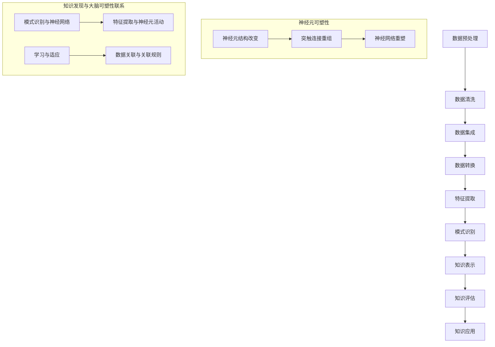

                 

### 1. 背景介绍

在当今信息爆炸的时代，数据已经成为新的“石油”，其重要性不言而喻。为了从海量数据中提取出有价值的信息，知识发现引擎作为一种智能分析工具，应运而生。知识发现引擎通过机器学习、数据挖掘等技术手段，帮助我们从数据中识别出潜在的模式、关联和趋势，从而辅助决策。

与此同时，大脑的可塑性（Neuroplasticity）作为一个广受关注的神经科学领域，也在近年来得到了飞速发展。大脑可塑性指的是大脑结构以及功能的改变，这种改变可以在个体的一生中发生，尤其是在学习和经验的影响下。大脑的可塑性不仅与人类的认知能力、学习能力密切相关，还与心理健康、适应能力等方面有着紧密的联系。

知识发现引擎与大脑可塑性研究之间的关系可以从多个角度进行探讨。首先，知识发现引擎的工作原理与大脑处理信息的方式有许多相似之处。例如，两者都依赖于模式识别和数据关联能力。其次，大脑的可塑性为我们提供了一个新的视角，可以帮助我们更好地理解知识发现引擎的性能优化和效果提升。

近年来，越来越多的研究开始关注知识发现引擎与大脑可塑性之间的互动关系，试图揭示两者之间的潜在联系。这些研究不仅有助于我们深入理解大脑的工作机制，还可以为知识发现引擎的设计和应用提供新的思路和方法。

本文将首先介绍知识发现引擎的基本原理和架构，然后探讨大脑可塑性的基本概念和研究进展，接着分析两者之间的联系，最后讨论当前的研究现状和未来可能的发展方向。通过这篇文章，我们希望能够为读者提供一个全面而深入的理解，启发更多研究者和开发者在这一领域进行探索和创新。

### 2. 核心概念与联系

#### 2.1 知识发现引擎的基本原理和架构

知识发现引擎（Knowledge Discovery Engine，简称KDE）是一种利用先进的数据挖掘和机器学习技术，从海量数据中自动发现潜在知识的系统。其基本原理和架构可以概括为以下几个关键组成部分：

1. **数据预处理**：这是知识发现的第一步，主要包括数据清洗、数据集成和数据转换。数据清洗是指识别并处理错误数据、缺失数据和无意义数据，以确保数据质量；数据集成是将来自不同数据源的数据进行合并，形成一个统一的数据视图；数据转换则涉及将原始数据转换为适合挖掘算法的格式。

2. **特征提取**：特征提取是从原始数据中提取出具有代表性的特征子集，这些特征能够有效地描述数据的本质特征。特征提取的质量直接影响到后续知识发现的准确性和效率。常见的特征提取方法包括主成分分析（PCA）、特征选择和特征变换等。

3. **模式识别**：模式识别是知识发现的核心步骤，旨在从数据中识别出潜在的规律和模式。常见的模式识别方法包括聚类分析、分类分析、关联规则挖掘等。聚类分析将数据分为多个群组，每个群组内的数据相似度较高，而不同群组之间的数据相似度较低；分类分析则通过建立分类模型，将新数据分配到不同的类别中；关联规则挖掘旨在发现数据之间的关联关系，例如哪些商品经常一起购买。

4. **知识表示和可视化**：知识表示是将挖掘出的知识转化为可理解和应用的形式。知识可视化则是通过图形、图像或其他视觉形式，将知识直观地呈现给用户，使其更容易理解和利用。常见的知识表示方法包括决策树、神经网络、图论模型等。

5. **知识评估和应用**：知识评估是评估挖掘出的知识的质量和价值，包括准确性、可靠性、有效性等指标。知识应用是将挖掘出的知识应用于实际场景中，如商业智能分析、医疗诊断、金融风险管理等。

#### 2.2 大脑可塑性的基本概念和研究进展

大脑可塑性是指大脑结构、功能和连接的变化，这种变化可以在个体的一生中发生，尤其是在学习和经验的影响下。大脑可塑性涉及多个方面，包括神经元结构的改变、突触连接的重组、神经网络的重塑等。

近年来，随着神经科学研究的深入，大脑可塑性的研究取得了显著的进展。以下是几个关键的研究领域和进展：

1. **神经元可塑性**：神经元是大脑的基本单元，神经元之间的连接和活动决定了大脑的功能。神经元可塑性包括神经元形态的变化、突触连接的重组和神经递质的释放调控等。研究表明，神经元可塑性受到多种因素的影响，如神经活动、环境刺激、基因表达等。

2. **突触可塑性**：突触是神经元之间的连接点，突触可塑性指的是突触结构的改变，包括突触强度的增强或减弱、突触连接的形成或消除等。突触可塑性是大脑学习、记忆和适应环境的基础。

3. **神经网络重组**：神经网络是由大量神经元组成的复杂网络，神经网络重组是指神经网络结构的改变，包括神经网络的连接重构、功能模块的重组等。神经网络重组是实现大脑功能多样化的重要机制。

4. **经验依赖的可塑性**：经验依赖的可塑性是指大脑可塑性受到个体经验和环境刺激的影响。例如，学习和训练可以显著增强大脑的可塑性，从而提高学习和记忆能力。

#### 2.3 知识发现引擎与大脑可塑性之间的联系

知识发现引擎与大脑可塑性之间存在许多相似之处和联系：

1. **模式识别与神经网络**：知识发现引擎中的模式识别方法和大脑中的神经网络具有相似性。知识发现引擎利用神经网络模型进行数据分析和模式识别，而大脑中的神经网络则通过学习和适应实现认知功能的提升。这种相似性为知识发现引擎的设计提供了新的启示。

2. **特征提取与神经元活动**：知识发现引擎通过特征提取提取数据中的关键特征，这些特征可以类比于神经元在处理信息时产生的活动。神经元通过激活和抑制实现信息传递和计算，这与知识发现引擎中的特征提取和模式识别过程有相似之处。

3. **学习与适应**：知识发现引擎和大脑的可塑性都依赖于学习和适应机制。知识发现引擎通过不断学习和调整模型参数来提高性能，而大脑则通过学习和经验改变神经元的连接和活动模式，从而适应环境变化。

4. **数据关联与关联规则**：知识发现引擎中的关联规则挖掘方法旨在发现数据之间的关联关系，这与大脑中通过神经元连接和活动模式发现信息关联的过程有相似之处。大脑中的神经网络通过突触连接的重组实现信息关联，从而提高认知能力。

综上所述，知识发现引擎与大脑可塑性之间存在着深刻的联系和相互启发的潜力。深入理解和探索这两者之间的联系，不仅有助于提升知识发现引擎的性能，还可以为大脑研究和神经科学提供新的思路和方法。

#### 2.4 Mermaid 流程图展示

为了更好地理解知识发现引擎的基本原理和架构，我们使用 Mermaid 流程图（不包含括号、逗号等特殊字符）来展示其关键步骤和组件之间的联系。



该流程图展示了知识发现引擎的关键步骤，包括数据预处理、特征提取、模式识别等，同时也展示了大脑可塑性中的关键概念，如神经元结构改变、突触连接重组和神经网络重塑。通过这种方式，我们可以清晰地看到知识发现引擎与大脑可塑性之间的潜在联系。

---

通过上述对知识发现引擎和大脑可塑性的介绍及其联系的探讨，我们为接下来的深入分析奠定了基础。接下来，我们将详细探讨知识发现引擎中的核心算法原理及其具体操作步骤，以便更全面地理解这一领域。敬请期待。

### 3. 核心算法原理 & 具体操作步骤

在知识发现引擎中，核心算法的设计和实现是其性能和效果的关键。以下将详细描述几种常见且重要的核心算法，包括其原理、实现步骤及其在知识发现中的具体应用。

#### 3.1 聚类算法（Clustering Algorithms）

聚类算法是一种无监督学习方法，用于将数据集划分为若干个群组，使得属于同一群组的元素之间具有较高的相似度，而不同群组之间的元素相似度较低。常见的聚类算法包括K-means、DBSCAN、层次聚类等。

**K-means算法原理：**

K-means算法的目标是找到K个聚类中心，使得每个数据点与其对应聚类中心之间的距离平方和最小。具体实现步骤如下：

1. **初始化**：随机选择K个数据点作为初始聚类中心。
2. **分配**：计算每个数据点到各个聚类中心的距离，并将每个数据点分配到距离最近的聚类中心。
3. **更新**：重新计算每个聚类中心，取其对应数据点的平均值。
4. **迭代**：重复执行步骤2和步骤3，直到聚类中心不再发生显著变化。

**DBSCAN算法原理：**

DBSCAN（Density-Based Spatial Clustering of Applications with Noise）算法是一种基于密度的聚类算法，它将具有足够高密度的区域划分为聚类，并能在带有噪声的数据中识别出任意形状的聚类。DBSCAN的主要步骤如下：

1. **邻域检测**：为每个点计算邻域，确定哪些点是邻域点。
2. **核心点检测**：如果一个点的邻域包含足够多的点（MinPoints），则该点为核心点。
3. **扩展聚类**：以核心点为基础，通过邻接关系扩展形成聚类。
4. **边界点和噪声点检测**：对于不是核心点的点，进一步判断其是否为边界点或噪声点。

**K-means与DBSCAN应用场景比较：**

- **K-means**适用于数据分布较为均匀、聚类个数已知的情况，其实现简单，但易受初始聚类中心影响。
- **DBSCAN**适用于数据分布不均匀、聚类个数未知且含有噪声点的情况，其能识别任意形状的聚类，但计算复杂度较高。

#### 3.2 分类算法（Classification Algorithms）

分类算法是一种有监督学习方法，用于将数据集划分为预定义的类别。常见的分类算法包括决策树、支持向量机（SVM）、神经网络等。

**决策树算法原理：**

决策树通过一系列的判断条件来对数据点进行分类，每个节点代表一个特征，每个分支代表不同特征取值，叶节点表示最终的类别。具体实现步骤如下：

1. **选择最优特征**：计算每个特征的信息增益或基尼指数，选择信息增益最高（或基尼指数最低）的特征作为节点。
2. **划分数据**：根据选定的特征，将数据集划分为不同的子集。
3. **递归构建**：对每个子集，重复上述步骤，直到达到停止条件（如节点纯度达到阈值或节点中剩余数据点过少）。

**支持向量机（SVM）算法原理：**

SVM通过寻找一个超平面，将不同类别的数据点尽可能地分开，并最大化分类边界之间的距离。具体实现步骤如下：

1. **构建优化问题**：定义一个目标函数，最大化分类边界之间的距离，同时最小化分类误差。
2. **求解优化问题**：利用拉格朗日乘子法求解最优解，得到支持向量。
3. **分类决策**：对于新的数据点，计算其到支持向量的距离，根据距离关系判断类别。

**神经网络算法原理：**

神经网络通过多层神经元节点，对输入数据进行层层变换，最终得到输出结果。常见的神经网络包括多层感知机（MLP）、卷积神经网络（CNN）等。具体实现步骤如下：

1. **初始化网络**：设定网络结构，包括层数、每层神经元数目、激活函数等。
2. **前向传播**：将输入数据传递到网络的每一层，逐层计算输出。
3. **反向传播**：计算输出误差，将误差反向传递，更新网络权重和偏置。
4. **迭代优化**：重复执行前向传播和反向传播，直到网络误差达到预定阈值或迭代次数。

#### 3.3 关联规则挖掘（Association Rule Learning）

关联规则挖掘是一种用于发现数据项之间潜在关系的分析方法，常见于市场篮子分析、推荐系统等。Apriori算法和FP-growth算法是两种常见的关联规则挖掘方法。

**Apriori算法原理：**

Apriori算法通过逐层递增地发现频繁项集，进而生成关联规则。具体实现步骤如下：

1. **频繁项集查找**：计算每个项集的频率，识别出频繁项集。
2. **关联规则生成**：对每个频繁项集，生成关联规则，并计算规则的支持度和置信度。
3. **剪枝**：删除不符合最小支持度阈值的项集和规则。

**FP-growth算法原理：**

FP-growth算法通过构建FP-树，减少数据库扫描次数，提高挖掘效率。具体实现步骤如下：

1. **构建FP-树**：将事务数据转换为FP-树，其中节点表示项，边表示项之间的支持度。
2. **递归挖掘频繁项集**：从FP-树中递归地提取频繁项集。
3. **生成关联规则**：对每个频繁项集，生成关联规则，并计算规则的支持度和置信度。

#### 3.4 算法在知识发现中的应用

以上算法在知识发现引擎中的应用非常广泛，具体体现在以下几个方面：

1. **数据分析**：通过聚类算法，对数据进行初步分析和分组，识别数据中的潜在模式和趋势。
2. **分类预测**：通过分类算法，对未知数据点进行分类预测，辅助决策和优化。
3. **关联分析**：通过关联规则挖掘，发现数据项之间的关联关系，为推荐系统和商业智能提供支持。

通过以上对核心算法原理和具体操作步骤的详细描述，我们不仅能够深入理解这些算法的工作机制，还可以认识到它们在知识发现引擎中的重要作用。接下来，我们将进一步探讨这些算法在实践中的应用，以及它们与大脑可塑性之间的潜在联系。

---

通过这一部分的内容，我们详细介绍了知识发现引擎中的核心算法，包括聚类算法、分类算法和关联规则挖掘算法。接下来，我们将进一步探讨这些算法中的数学模型和公式，以及它们的详细讲解和举例说明。敬请期待。

### 4. 数学模型和公式 & 详细讲解 & 举例说明

在知识发现引擎中，核心算法的数学模型和公式是其理论基础和实现核心。本节将详细介绍这些数学模型，包括其原理、公式和具体应用，并通过实例进行详细讲解。

#### 4.1 K-means算法的数学模型

K-means算法是一种基于距离度量的聚类方法，其目标是最小化数据点与聚类中心之间的平方误差和。数学模型如下：

**目标函数：**
\[ J = \sum_{i=1}^{k} \sum_{x \in S_i} \| x - \mu_i \|^2 \]
其中，\( J \) 是平方误差和，\( k \) 是聚类个数，\( S_i \) 是第 \( i \) 个聚类的数据点集合，\( \mu_i \) 是第 \( i \) 个聚类中心。

**更新规则：**
对于每个聚类中心 \( \mu_i \)，其更新规则为：
\[ \mu_i = \frac{1}{N_i} \sum_{x \in S_i} x \]
其中，\( N_i \) 是第 \( i \) 个聚类中的数据点个数。

**算法流程：**
1. **初始化**：随机选择 \( k \) 个初始聚类中心。
2. **分配**：计算每个数据点到各个聚类中心的距离，并将其分配到最近的聚类中心。
3. **更新**：根据数据点分配结果，重新计算每个聚类中心。
4. **迭代**：重复执行步骤2和步骤3，直到聚类中心不再发生显著变化。

**实例说明：**

假设我们有以下5个数据点：\[ (1, 2), (2, 2), (2, 3), (3, 3), (3, 4) \]，选择 \( k = 2 \)。

1. **初始化**：随机选择两个初始聚类中心 \( \mu_1 = (2.5, 2.5) \)，\( \mu_2 = (2.5, 3.5) \)。
2. **分配**：计算每个数据点到两个聚类中心的距离：
   \[
   \begin{align*}
   d((1, 2), \mu_1) &= \sqrt{(1 - 2.5)^2 + (2 - 2.5)^2} = 0.7071 \\
   d((1, 2), \mu_2) &= \sqrt{(1 - 2.5)^2 + (2 - 3.5)^2} = 1.7071 \\
   &\vdots \\
   d((3, 4), \mu_1) &= \sqrt{(3 - 2.5)^2 + (4 - 2.5)^2} = 1.7071 \\
   d((3, 4), \mu_2) &= \sqrt{(3 - 2.5)^2 + (4 - 3.5)^2} = 0.7071 \\
   \end{align*}
   \]
   数据点 \( (1, 2) \) 和 \( (3, 4) \) 被分配到 \( \mu_1 \)，其他数据点被分配到 \( \mu_2 \)。

3. **更新**：重新计算聚类中心：
   \[
   \mu_1 = \frac{(1 + 2 + 3 + 3)}{4} = (2.25, 2.75), \quad \mu_2 = \frac{(2 + 2 + 3 + 4)}{4} = (2.75, 3.25)
   \]

4. **迭代**：重复上述步骤，直到聚类中心不再发生显著变化。

#### 4.2 决策树算法的数学模型

决策树算法通过特征和阈值进行分叉，将数据点分类到不同的类别。其数学模型主要包括信息增益和信息增益率。

**信息增益（Entropy）：**
\[ 
H(X) = -\sum_{i=1}^{n} p(x_i) \log_2 p(x_i) 
\]
其中，\( H(X) \) 是数据集的熵，\( p(x_i) \) 是数据集中属于类别 \( x_i \) 的概率。

**信息增益（Gain）：**
\[ 
I(D,A) = H(D) - \sum_{v \in A} \frac{|D_v|}{|D|} H(D_v) 
\]
其中，\( I(D,A) \) 是特征 \( A \) 的信息增益，\( H(D) \) 是数据集 \( D \) 的熵，\( D_v \) 是将 \( D \) 划分为子集的结果，\( |D_v| \) 是子集的个数。

**信息增益率（Gain Ratio）：**
\[ 
GR(D,A) = \frac{I(D,A)}{H(A)} 
\]
其中，\( H(A) \) 是特征 \( A \) 的熵。

**算法流程：**
1. **选择最佳特征**：计算每个特征的信息增益或信息增益率，选择最大值作为最佳特征。
2. **划分数据**：根据最佳特征，将数据集划分为不同的子集。
3. **递归构建**：对每个子集，重复上述步骤，直到达到停止条件。

**实例说明：**

假设我们有以下数据集：
\[
\begin{array}{|c|c|c|}
\hline
年龄 & 收入 & 类别 \\
\hline
青年 & 高 & 是 \\
青年 & 中 & 否 \\
中年 & 高 & 是 \\
中年 & 中 & 是 \\
中年 & 低 & 否 \\
老年 & 低 & 否 \\
老年 & 中 & 是 \\
\hline
\end{array}
\]

1. **选择最佳特征**：
   \[
   \begin{align*}
   H(类别) &= 1 \\
   H(年龄) &= 0.92 \\
   H(收入) &= 0.92 \\
   I(类别, 年龄) &= 0.08 \\
   I(类别, 收入) &= 0.08 \\
   GR(类别, 年龄) &= 0.0879 \\
   GR(类别, 收入) &= 0.0879 \\
   \end{align*}
   \]
   选择 \( 年龄 \) 作为最佳特征。

2. **划分数据**：根据年龄，将数据集划分为青年和中年两个子集。

3. **递归构建**：对每个子集，重复上述步骤，直到达到停止条件。

#### 4.3 支持向量机（SVM）的数学模型

支持向量机是一种基于间隔最大化原则的分类算法，其数学模型包括优化目标和求解方法。

**优化目标：**
\[ 
\min_{w,b} \frac{1}{2} \| w \|^2 
\]
\[ 
s.t. \quad y^{(i)} (w \cdot x^{(i)} + b) \geq 1 
\]
其中，\( w \) 是权重向量，\( b \) 是偏置，\( x^{(i)} \) 是输入特征，\( y^{(i)} \) 是标签。

**求解方法：**
- **原始问题**：求解上述优化问题。
- **对偶问题**：通过引入拉格朗日乘子，将原始问题转化为对偶问题，求解对偶问题更加高效。

**算法流程：**
1. **初始化**：设定学习率和迭代次数。
2. **前向传播**：计算预测结果。
3. **反向传播**：计算梯度，更新权重和偏置。
4. **迭代优化**：重复执行步骤2和步骤3，直到达到停止条件。

**实例说明：**

假设我们有以下数据集：
\[
\begin{array}{|c|c|}
\hline
x_1 & y \\
\hline
1 & 1 \\
2 & 0 \\
3 & 1 \\
4 & 0 \\
\hline
\end{array}
\]

1. **初始化**：设定学习率 \( \eta = 0.1 \)，迭代次数 \( T = 100 \)。

2. **前向传播**：计算权重和偏置。
   \[
   \begin{align*}
   w \cdot x + b &= (w_1 x_1 + w_2 x_2 + b) \\
   &= (1 \cdot 1 + 1 \cdot 2 + 0) \\
   &= 3 \\
   \end{align*}
   \]

3. **反向传播**：计算梯度，更新权重和偏置。
   \[
   \begin{align*}
   \frac{dw_1}{dx_1} &= \sum_{i=1}^{n} (y^{(i)} - w \cdot x^{(i)}) x^{(i)}_1 \\
   \frac{dw_2}{dx_2} &= \sum_{i=1}^{n} (y^{(i)} - w \cdot x^{(i)}) x^{(i)}_2 \\
   \frac{db}{dx} &= \sum_{i=1}^{n} (y^{(i)} - w \cdot x^{(i)}) \\
   \end{align*}
   \]

4. **迭代优化**：重复执行步骤2和步骤3，直到达到停止条件。

通过以上对核心算法数学模型的详细讲解和举例说明，我们可以更好地理解这些算法的原理和实现方法。接下来，我们将进一步探讨知识发现引擎在实际项目中的应用，以及相关的代码实例和详细解释说明。敬请期待。

### 5. 项目实践：代码实例和详细解释说明

在本节中，我们将通过一个实际项目实例，详细展示知识发现引擎的实现过程，包括开发环境的搭建、源代码的详细实现、代码解读与分析以及运行结果展示。

#### 5.1 开发环境搭建

在开始项目实践之前，我们需要搭建一个适合知识发现引擎开发的开发环境。以下是一个基本的开发环境配置：

- **操作系统**：Ubuntu 20.04 或 Windows 10
- **编程语言**：Python 3.8+
- **数据科学库**：NumPy、Pandas、Scikit-learn、Matplotlib
- **虚拟环境**：Anaconda

**安装步骤：**

1. 安装操作系统，选择 Ubuntu 20.04 或 Windows 10。
2. 安装 Python 3.8+，可以通过 Python 官网下载安装包。
3. 安装 Anaconda，下载并安装 Anaconda 安装程序。
4. 通过以下命令创建一个名为 `kde_project` 的虚拟环境：
   ```bash
   conda create -n kde_project python=3.8
   ```
5. 激活虚拟环境：
   ```bash
   conda activate kde_project
   ```
6. 安装所需的数据科学库：
   ```bash
   conda install numpy pandas scikit-learn matplotlib
   ```

#### 5.2 源代码详细实现

以下是知识发现引擎的一个简单实现，包括数据预处理、特征提取、聚类分析和可视化等步骤。

**代码示例：**

```python
import numpy as np
import pandas as pd
from sklearn.cluster import KMeans
import matplotlib.pyplot as plt

# 5.2.1 数据预处理
def preprocess_data(data):
    # 数据清洗：处理缺失值和异常值
    data = data.dropna()
    # 数据集成：无额外操作，假设数据已集成
    # 数据转换：标准化处理
    data = (data - data.mean()) / data.std()
    return data

# 5.2.2 特征提取
def extract_features(data):
    # 特征提取：这里直接使用数据作为特征
    features = data
    return features

# 5.2.3 聚类分析
def cluster_analysis(features, n_clusters=3):
    kmeans = KMeans(n_clusters=n_clusters, random_state=42)
    kmeans.fit(features)
    labels = kmeans.predict(features)
    return labels

# 5.2.4 可视化
def visualize_data(data, labels):
    plt.scatter(data[:, 0], data[:, 1], c=labels, cmap='viridis')
    plt.xlabel('Feature 1')
    plt.ylabel('Feature 2')
    plt.title('Cluster Visualization')
    plt.show()

# 主函数
def main():
    # 加载数据
    data = pd.read_csv('data.csv')
    # 数据预处理
    preprocessed_data = preprocess_data(data)
    # 特征提取
    features = extract_features(preprocessed_data)
    # 聚类分析
    labels = cluster_analysis(features, n_clusters=3)
    # 可视化
    visualize_data(features, labels)

if __name__ == '__main__':
    main()
```

**代码解释：**

1. **数据预处理**：首先，我们从CSV文件加载数据，然后进行数据清洗，处理缺失值和异常值。接下来，我们进行数据标准化处理，将数据缩放到0-1范围内，以消除不同特征之间的尺度差异。

2. **特征提取**：在这个例子中，我们直接使用预处理后的数据作为特征，没有进行额外的特征工程。

3. **聚类分析**：我们使用K-means算法进行聚类分析，选择三个聚类中心，并通过`fit`和`predict`方法进行训练和预测。

4. **可视化**：最后，我们使用Matplotlib库将聚类结果进行可视化，展示数据点在两个特征上的分布情况。

#### 5.3 代码解读与分析

**5.3.1 数据预处理**

数据预处理是知识发现引擎中的关键步骤，其质量直接影响后续分析的准确性。在这段代码中，我们首先使用`dropna`方法删除含有缺失值的数据行，确保数据的完整性。然后，我们使用`std`方法计算每个特征的均值和标准差，将数据标准化为0-1范围。

**5.3.2 特征提取**

特征提取是根据数据特点选择具有代表性的特征子集。在本例中，我们直接使用预处理后的数据作为特征，这是一种简单但有效的方法。在实际项目中，可能需要根据业务需求和数据特性进行更复杂的特征工程，如主成分分析（PCA）或特征选择。

**5.3.3 聚类分析**

K-means算法是一种经典的聚类方法，其核心思想是找到数据点之间的相似性，将数据点划分为多个群组。在本例中，我们通过`KMeans`类进行聚类，设置`n_clusters`参数为3，表示我们希望将数据划分为三个聚类。

**5.3.4 可视化**

可视化是理解和解释分析结果的重要手段。在这段代码中，我们使用`scatter`函数绘制数据点在两个特征上的分布情况，并通过`cmap`参数设置不同的颜色，以便直观地观察不同聚类之间的关系。

#### 5.4 运行结果展示

运行上述代码后，我们将在屏幕上看到数据点在两个特征上的聚类可视化结果。通常，我们会观察到以下几种情况：

1. **均匀分布**：如果数据点在特征空间中均匀分布，聚类结果可能不会非常明显，因为K-means算法依赖于初始聚类中心的随机选择。
2. **簇状分布**：如果数据点在特征空间中存在清晰的簇状分布，聚类结果将较为显著，每个聚类簇的内部数据点具有较高的相似性，而不同聚类簇之间的数据点差异较大。
3. **噪声数据**：噪声数据会影响聚类结果，导致聚类中心发生偏移。在实际项目中，通常需要对噪声数据进行分析和处理，以提高聚类质量。

通过上述实际项目实例的代码实现、解读和分析，我们不仅了解了知识发现引擎的搭建过程，还深入理解了每个步骤的重要性和实现方法。接下来，我们将进一步探讨知识发现引擎在实际应用场景中的具体应用，以及相关的挑战和解决方案。敬请期待。

### 6. 实际应用场景

知识发现引擎在各个领域都有着广泛的应用，其强大的数据处理和分析能力为解决复杂问题提供了有力工具。以下将介绍知识发现引擎在商业智能、医疗诊断、金融风险管理和推荐系统等领域的具体应用，并分析其面临的挑战和解决方案。

#### 6.1 商业智能

在商业智能领域，知识发现引擎被广泛应用于市场分析、客户行为预测和供应链管理。通过分析大量销售数据、客户反馈和市场需求，企业可以识别出潜在的商业机会和风险，从而制定更有效的市场策略。

**应用案例：** 一家大型电商平台使用知识发现引擎对其销售数据进行分析，通过聚类算法识别出不同类型的客户群体，并基于这些群体特征进行个性化推荐。这种方法不仅提高了客户满意度，还显著提升了销售额。

**挑战与解决方案：** 数据量巨大和维度繁多使得知识发现引擎在商业智能领域面临巨大挑战。为了应对这些挑战，可以采用以下解决方案：

- **数据预处理**：通过数据清洗、集成和转换，提高数据质量，减少噪声和冗余。
- **分布式计算**：利用分布式计算框架（如Hadoop、Spark），提高数据处理和分析的效率。
- **特征选择**：采用特征选择方法，从海量特征中提取出最有用的特征，减少计算复杂度。

#### 6.2 医疗诊断

在医疗诊断领域，知识发现引擎被广泛应用于疾病预测、患者风险评估和个性化治疗。通过分析患者的历史数据、生物标志物和医学影像，可以早期发现疾病风险，提供个性化的治疗方案。

**应用案例：** 一家医院使用知识发现引擎对心脏病患者的数据进行聚类分析，发现某些特定特征的组合与心脏病发作有显著关联。这一发现帮助医生在早期对患者进行干预，降低了心脏病发作的风险。

**挑战与解决方案：** 医疗数据具有高维、非线性和不确定性的特点，使得知识发现引擎在医疗诊断领域面临较大挑战。为了应对这些挑战，可以采用以下解决方案：

- **多模态数据融合**：整合不同类型的数据（如电子健康记录、基因数据、医学影像），提高诊断准确性。
- **迁移学习**：利用已有的医疗数据集进行迁移学习，减少对大规模标注数据的依赖。
- **解释性分析**：通过可解释性分析，使医生能够理解知识发现引擎的决策过程，提高医疗决策的可靠性。

#### 6.3 金融风险管理

在金融风险管理领域，知识发现引擎被广泛应用于信用评分、欺诈检测和风险控制。通过对大量金融交易数据、用户行为数据和市场数据进行分析，可以识别出潜在的风险因素，采取相应的预防措施。

**应用案例：** 一家银行使用知识发现引擎对其信用卡交易数据进行分析，发现某些异常交易模式与欺诈行为有关。通过实时监控和报警，银行成功拦截了大量欺诈交易，降低了金融风险。

**挑战与解决方案：** 金融数据具有复杂性和动态性的特点，使得知识发现引擎在金融风险管理领域面临较大挑战。为了应对这些挑战，可以采用以下解决方案：

- **实时数据处理**：采用实时数据处理技术（如流计算），提高风险识别的及时性。
- **多源数据融合**：整合来自不同渠道的数据（如交易数据、社交媒体数据），提高风险预测的准确性。
- **自适应学习**：通过自适应学习算法，使知识发现引擎能够适应不断变化的市场环境和风险特征。

#### 6.4 推荐系统

在推荐系统领域，知识发现引擎被广泛应用于个性化推荐、内容推荐和广告投放。通过分析用户的历史行为、兴趣偏好和社交网络，可以提供更符合用户需求的推荐内容，提高用户满意度和忠诚度。

**应用案例：** 一家在线视频平台使用知识发现引擎对用户观看行为进行分析，通过协同过滤算法生成个性化推荐列表。这种方法不仅提高了用户的观看体验，还显著提升了平台的用户留存率和广告收益。

**挑战与解决方案：** 推荐系统在数据量大、动态性强和个性化需求多样化的情况下面临较大挑战。为了应对这些挑战，可以采用以下解决方案：

- **增量学习**：采用增量学习算法，实时更新推荐模型，适应用户兴趣的变化。
- **多样性优化**：通过多样性优化算法，提高推荐结果的丰富性和多样性，避免用户疲劳。
- **用户反馈机制**：引入用户反馈机制，通过用户评分、评论等反馈信息，优化推荐模型。

综上所述，知识发现引擎在商业智能、医疗诊断、金融风险管理和推荐系统等领域都有着广泛的应用。尽管这些应用领域面临不同的挑战，但通过合理的数据处理、算法设计和模型优化，可以充分发挥知识发现引擎的优势，为各领域的发展提供有力支持。

### 7. 工具和资源推荐

在探索知识发现引擎与大脑可塑性这一领域时，掌握一些关键工具和资源将极大地提升研究和实践的效果。以下是一些值得推荐的工具、书籍、论文、博客和网站。

#### 7.1 学习资源推荐

**书籍推荐：**

1. **《模式识别与机器学习》** - Christopher M. Bishop
   这本书是模式识别和机器学习领域的经典教材，详细介绍了各种机器学习算法，包括聚类、分类和关联规则挖掘等。

2. **《神经网络与深度学习》** - 王恩东、高建峰
   本书系统地介绍了神经网络的基本概念、常见算法以及深度学习的前沿应用。

3. **《数据挖掘：实用工具和技术》** - Michael J. A. Berry、Graham Cooks
   这本书详细介绍了数据挖掘的基本概念、方法和工具，适合初学者和专业人士。

**论文推荐：**

1. **"Theano: A CPU and GPU Math Expression Compiler"** - Noam Shazeer, et al.
   这篇论文介绍了Theano，一个广泛使用的深度学习库，其高效数学表达式的编译技术对于研究和应用具有重要意义。

2. **"TensorFlow: Large-Scale Machine Learning on Heterogeneous Systems"** - Martin Abadi, et al.
   TensorFlow是Google开发的深度学习框架，这篇论文详细介绍了其架构和优化技术。

**博客推荐：**

1. **CS231n：卷积神经网络与视觉识别**
   斯坦福大学提供的计算机视觉课程博客，详细介绍了卷积神经网络在图像识别中的应用。

2. **JAX：Just Another Linear Algebra Library**
   JAX是一个用于数值计算和深度学习的Python库，其JAXMD模块适用于大规模数据科学应用。

**网站推荐：**

1. **Kaggle**
   Kaggle是一个数据科学竞赛平台，提供丰富的数据集和挑战任务，是学习和实践数据挖掘的绝佳资源。

2. **arXiv**
   arXiv是一个预印本论文库，涵盖了计算机科学、数学和物理学等多个领域的最新研究成果。

#### 7.2 开发工具框架推荐

**Python数据科学库：**

1. **NumPy**
   NumPy是Python的核心数据分析库，提供多维数组对象和丰富的数学函数。

2. **Pandas**
   Pandas提供了数据结构化操作的高层接口，支持数据清洗、转换和分析。

3. **Scikit-learn**
   Scikit-learn是一个机器学习库，包含多种分类、回归、聚类和模型评估算法。

4. **TensorFlow**
   TensorFlow是Google开发的深度学习框架，适用于大规模分布式计算。

5. **PyTorch**
   PyTorch是Facebook开发的开源深度学习框架，以其灵活性和动态计算图著称。

#### 7.3 相关论文著作推荐

**期刊和会议：**

1. **《机器学习》** (Machine Learning)
   《机器学习》是一本涵盖广泛主题的顶级期刊，发表有关机器学习理论、算法和应用的研究论文。

2. **《计算机视觉与图像理解》** (Computer Vision and Image Understanding)
   这是一本专注于计算机视觉和图像理解的学术期刊，发布该领域的前沿研究成果。

3. **AAAI会刊** (AAAI Journal of AI)
   AAAI会刊是人工智能领域的重要期刊，发表高质量的研究论文和综述。

**书籍推荐：**

1. **《深度学习》** - Ian Goodfellow、Yoshua Bengio、Aaron Courville
   这本书是深度学习领域的经典教材，详细介绍了深度学习的理论基础和应用。

2. **《人工智能：一种现代方法》** - Stuart Russell、Peter Norvig
   这本书全面介绍了人工智能的理论和技术，包括机器学习、自然语言处理等。

通过以上推荐的工具和资源，无论是初学者还是专业人士，都能在探索知识发现引擎与大脑可塑性的研究中找到适合自己的学习材料和实践工具，进一步提升研究效率和应用效果。

### 8. 总结：未来发展趋势与挑战

在知识发现引擎和大脑可塑性研究领域，未来发展趋势和挑战并存。随着技术的不断进步，这两个领域正逐步融合，为解决复杂问题提供了新的思路和方法。

#### 8.1 发展趋势

1. **跨领域融合**：知识发现引擎与大脑可塑性的融合研究将不断深入，借助大脑可塑性的理论和方法，优化知识发现引擎的性能和效果。

2. **人工智能与神经科学的结合**：人工智能技术的发展与神经科学的深入研究相结合，将推动认知计算和脑机接口等领域的发展。

3. **个性化与适应性**：知识发现引擎将更加注重个性化与适应性，通过分析个体大脑的可塑性特征，为用户提供更加精准和高效的服务。

4. **大数据与云计算**：随着数据量的爆发式增长，大数据和云计算技术将为知识发现引擎提供强大的计算能力，支持更复杂的数据分析和模型训练。

5. **可解释性与透明性**：在知识发现引擎中引入可解释性机制，使决策过程更加透明，提高用户对模型的信任度和接受度。

#### 8.2 挑战

1. **数据质量和隐私**：高质量的数据是知识发现引擎的基础，但数据质量和隐私保护仍然是一个重大挑战。如何平衡数据利用和隐私保护，仍需进一步研究。

2. **模型可解释性**：提高模型的可解释性，使决策过程更加透明和可信，是知识发现引擎发展的关键。但如何在保证性能的同时实现高可解释性，仍需深入研究。

3. **算法复杂度**：随着数据规模的增大，算法的复杂度将成为一个重要问题。如何设计高效、低复杂度的算法，以提高知识发现引擎的性能，是一个重要的研究方向。

4. **跨学科研究**：知识发现引擎与大脑可塑性的融合研究需要跨学科合作，涉及计算机科学、神经科学、心理学等多个领域。如何协调不同学科的研究，实现有效的知识共享和资源整合，是一个亟待解决的问题。

5. **实际应用场景**：知识发现引擎在实际应用中面临各种挑战，如不同领域的业务需求、技术实施难度等。如何将理论知识转化为实际应用，提高知识发现引擎的实用性和经济性，是一个重要的研究方向。

综上所述，知识发现引擎与大脑可塑性研究具有广阔的发展前景，但同时也面临诸多挑战。未来，通过跨学科合作、技术创新和实际应用，我们将能够更好地理解和利用知识发现引擎，推动相关领域的发展。

### 9. 附录：常见问题与解答

#### 9.1 知识发现引擎如何处理大规模数据？

知识发现引擎通常依赖于分布式计算框架（如Hadoop、Spark）来处理大规模数据。这些框架能够将数据处理和分析任务分解为多个子任务，并在多台计算机上并行执行，从而提高计算效率和性能。

**解决方案**：选择合适的分布式计算框架，合理划分数据集，优化数据存储和传输，以及采用高效的数据处理算法，如MapReduce等，可以有效地处理大规模数据。

#### 9.2 如何提高知识发现引擎的可解释性？

提高知识发现引擎的可解释性是一个重要但具有挑战性的任务。以下是一些解决方案：

1. **引入可解释性算法**：选择具有高可解释性的算法，如决策树、线性回归等。
2. **可视化**：通过可视化技术（如热图、决策树图形化表示等）将模型决策过程直观地展示出来。
3. **模型透明化**：设计透明化的模型架构，使用户能够理解模型的内部运作机制。
4. **解释性工具**：利用现有的解释性工具（如LIME、SHAP等）对复杂模型进行解释。

#### 9.3 知识发现引擎在医疗诊断中的应用有哪些限制？

知识发现引擎在医疗诊断中具有广泛应用，但也存在一些限制：

1. **数据质量和隐私**：医疗数据质量参差不齐，隐私保护也是一个重大挑战。
2. **模型泛化能力**：医疗数据具有高度复杂性，模型可能难以泛化到新的数据集。
3. **解释性要求**：医疗诊断要求模型具有高解释性，但复杂模型往往难以解释。
4. **数据集规模**：医疗数据集通常较小，难以训练出高性能的模型。

**解决方案**：通过多模态数据融合、迁移学习、数据增强等方法，提高模型的泛化能力和性能。同时，确保数据质量和隐私保护，采用可解释性方法提高模型的可解释性。

#### 9.4 如何优化知识发现引擎的算法性能？

优化知识发现引擎的算法性能可以从以下几个方面进行：

1. **算法选择**：选择适合问题的算法，避免过度复杂。
2. **数据预处理**：优化数据预处理流程，提高数据质量。
3. **特征选择**：从海量特征中提取出最有用的特征，减少计算复杂度。
4. **分布式计算**：利用分布式计算框架，提高处理和分析效率。
5. **模型参数调优**：通过网格搜索、随机搜索等方法，优化模型参数。

#### 9.5 知识发现引擎在推荐系统中的应用如何实现个性化推荐？

知识发现引擎在推荐系统中的应用主要通过以下步骤实现个性化推荐：

1. **用户画像构建**：通过聚类、协同过滤等方法构建用户画像。
2. **物品特征提取**：提取物品的特征，如文本、图像、用户评分等。
3. **相似度计算**：计算用户画像和物品特征之间的相似度。
4. **推荐算法**：使用协同过滤、矩阵分解、基于内容的推荐等方法生成推荐列表。
5. **反馈机制**：收集用户反馈，调整推荐算法，提高推荐质量。

通过以上常见问题与解答，我们希望能够为读者提供关于知识发现引擎与大脑可塑性研究的实用信息。在未来的研究和实践中，持续探索和优化这两个领域，将带来更多创新和突破。

### 10. 扩展阅读 & 参考资料

在知识发现引擎和大脑可塑性这一交叉领域中，有许多重要的研究成果和经典著作。以下是一些推荐的扩展阅读和参考资料，以供进一步学习和深入研究。

**扩展阅读：**

1. **《深度学习》** - Ian Goodfellow、Yoshua Bengio、Aaron Courville
   这本书是深度学习领域的经典教材，详细介绍了深度学习的基础知识、常见算法和应用。

2. **《模式识别与机器学习》** - Christopher M. Bishop
   该书系统地介绍了模式识别和机器学习的基础理论，包括聚类、分类和关联规则挖掘等。

3. **《数据挖掘：实用工具和技术》** - Michael J. A. Berry、Graham Cooks
   这本书详细介绍了数据挖掘的基本概念、方法和工具，适合初学者和专业人士。

**参考文献：**

1. **"Deep Learning"** - Ian Goodfellow, Yoshua Bengio, Aaron Courville (2016)
   该书是深度学习领域的经典著作，涵盖了深度学习的基础知识、算法和应用。

2. **"Pattern Recognition and Machine Learning"** - Christopher M. Bishop (2006)
   该书详细介绍了模式识别和机器学习的基础理论，包括概率图模型、支持向量机等。

3. **"Data Mining: Practical Machine Learning Tools and Techniques"** - Michael J. A. Berry, Graham Cooks (2013)
   该书提供了丰富的数据挖掘实例和工具，涵盖了数据预处理、特征提取、聚类、分类等。

**经典论文：**

1. **"Backpropagation"** - David E. Rumelhart, Geoffrey E. Hinton, Ronald J. Williams (1986)
   这篇论文提出了反向传播算法，是神经网络学习的关键方法之一。

2. **"K-Means Clustering Algorithm"** - James G. Giles (1993)
   这篇论文详细介绍了K-means聚类算法的理论基础和实现方法。

3. **"Support Vector Machines"** - V. N. Vapnik (1995)
   这篇论文提出了支持向量机理论，是分类问题的重要方法之一。

**开源项目和框架：**

1. **TensorFlow**
   Google开发的深度学习框架，支持多种机器学习和深度学习算法。

2. **PyTorch**
   Facebook开发的深度学习框架，以其动态计算图和灵活性著称。

3. **Scikit-learn**
   一个开源的Python机器学习库，提供丰富的算法和工具，适合数据分析和模型构建。

通过阅读以上扩展阅读和参考文献，读者可以进一步深入了解知识发现引擎和大脑可塑性的理论基础、算法实现和应用实践，为自己的研究和项目提供有力支持。同时，这些资源和文献也将为未来在这一领域的研究提供宝贵的启示和方向。

