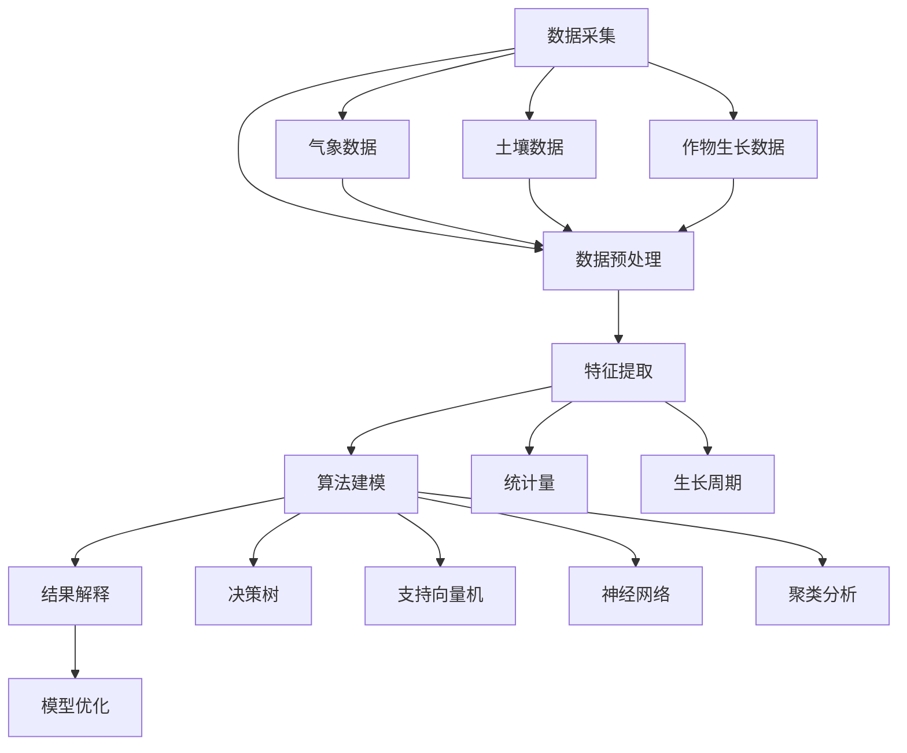

                 

### 背景介绍

知识发现引擎（Knowledge Discovery Engine，简称KDE）是一种能够从大量数据中提取有用信息和知识的自动化系统。随着大数据时代的到来，数据的爆炸性增长和复杂性的提升，传统的数据处理方法已经无法满足现代社会的需求。知识发现引擎的出现，为从海量数据中挖掘隐藏的规律和知识提供了强有力的工具。

在农业科技领域，知识发现引擎的应用尤为关键。农业生产涉及众多变量，如土壤湿度、气候条件、作物生长周期等。传统的农业生产方式依赖于经验和直觉，这导致了农业生产效率和作物产量的波动。而知识发现引擎可以通过分析大量历史数据和环境变量，提供科学的决策支持，从而提高农业生产的精准度和效率。

知识发现引擎在农业科技中的应用场景广泛，主要包括以下几方面：

1. **病虫害预警**：通过分析气象数据、土壤数据和作物生长数据，知识发现引擎可以预测病虫害的发生概率，帮助农民提前采取防治措施。

2. **作物产量预测**：基于历史种植数据和气候数据，知识发现引擎可以预测作物产量，帮助农民合理安排种植计划。

3. **精准灌溉**：通过实时监测土壤湿度和气候条件，知识发现引擎可以提供最佳灌溉时间，避免水资源浪费。

4. **农业供应链优化**：知识发现引擎可以帮助优化农业供应链，从生产、运输到销售的全过程，提高供应链效率。

5. **农业智能监控**：利用知识发现引擎，可以对农业生产环境进行实时监控，及时发现并处理异常情况。

总之，知识发现引擎在农业科技中的应用，不仅能够提高农业生产效率，降低生产成本，还能促进农业的可持续发展。在接下来的章节中，我们将深入探讨知识发现引擎的核心概念、算法原理、数学模型以及实际应用案例。

### 核心概念与联系

为了深入理解知识发现引擎在农业科技中的应用，我们需要首先了解其核心概念和基本架构。知识发现引擎通常包括以下几个关键组成部分：数据采集、数据预处理、特征提取、算法建模、结果解释和优化。

**1. 数据采集**：知识发现引擎的首要任务是采集相关数据。在农业科技领域，这些数据可能包括气象数据（如温度、湿度、降水量等）、土壤数据（如pH值、湿度、有机质含量等）、作物生长数据（如叶绿素含量、植株高度、病虫害发生情况等）、以及农业生产过程中的其他变量。

**2. 数据预处理**：采集到的数据通常是不完整、不准确的，因此需要通过数据预处理步骤来清洗和整理数据。这一步骤包括数据清洗（去除重复、缺失和异常数据）、数据转换（将不同格式的数据统一为标准格式）、数据归一化（调整数据范围，使其适合算法处理）等。

**3. 特征提取**：在数据预处理完成后，需要对数据进行特征提取，即将原始数据转化为对模型有用的特征。在农业领域，特征提取可能包括计算温度和湿度的平均值、标准差、相关性等统计量，或者提取作物的生长周期、病虫害发生的规律等。

**4. 算法建模**：特征提取后，使用合适的机器学习算法进行建模。常见的算法包括决策树、支持向量机、神经网络、聚类分析等。这些算法可以根据历史数据和特征信息，学习并预测未来的农业生产情况。

**5. 结果解释和优化**：模型训练完成后，需要对预测结果进行解释和评估，以确保其准确性和实用性。此外，根据实际应用效果，可以不断优化模型参数，提高预测精度。

下面，我们将使用Mermaid流程图来展示知识发现引擎在农业科技中的基本架构。



通过这个流程图，我们可以看到知识发现引擎如何从数据采集、预处理、特征提取、算法建模到结果解释和优化，形成一个闭环的自动化系统。在农业科技中，这个架构可以有效地利用历史数据和环境变量，提供科学的决策支持，从而提高农业生产的效率和质量。

### 核心算法原理 & 具体操作步骤

知识发现引擎在农业科技中的应用，主要依赖于机器学习和数据挖掘技术。在这部分，我们将详细介绍几种核心算法的原理和具体操作步骤，这些算法包括决策树、支持向量机（SVM）、神经网络和聚类分析。

#### 1. 决策树

**原理**：决策树是一种常见的分类和回归算法，通过一系列的判断节点和叶子节点，将数据集划分成不同的区域，从而实现分类或回归目标。每个节点代表一个特征，每个分支代表该特征的不同取值。

**操作步骤**：
1. **特征选择**：计算每个特征的信息增益或增益率，选择信息增益最大的特征作为分裂依据。
2. **分裂过程**：根据选定的特征，将数据集划分成子集。对于分类问题，使用基尼指数或信息增益率来评估分裂质量。
3. **递归划分**：对于每个子集，重复上述过程，直到满足停止条件（如最大深度、最小样本量等）。
4. **生成树**：将所有划分结果连接起来，形成一棵完整的决策树。

**示例**：假设我们有如下数据集：

| 样本编号 | 温度 | 湿度 | 产量 |
| --- | --- | --- | --- |
| 1 | 25 | 45 | 高 |
| 2 | 28 | 50 | 高 |
| 3 | 22 | 40 | 低 |
| 4 | 24 | 48 | 高 |
| 5 | 27 | 46 | 高 |

使用决策树算法预测产量。首先，计算每个特征的信息增益，选择信息增益最大的特征（如湿度）作为分裂依据。然后，根据湿度值将数据集划分为子集，并重复上述过程，直到形成一棵完整的决策树。

#### 2. 支持向量机（SVM）

**原理**：支持向量机是一种二类分类算法，通过寻找最优的超平面，将两类数据点分隔开来。SVM的核心思想是最大化分类边界上的支持向量（即与分类边界最近的样本点）的间隔。

**操作步骤**：
1. **选择核函数**：常见的核函数包括线性核、多项式核、径向基核等。
2. **计算超平面**：通过求解最优化问题，计算得到最优的超平面参数。
3. **分类决策**：对于新的样本点，计算其到超平面的距离，根据距离的符号进行分类。

**示例**：假设我们使用线性核函数，给定如下数据集：

| 样本编号 | 温度 | 湿度 | 产量 |
| --- | --- | --- | --- |
| 1 | 25 | 45 | 高 |
| 2 | 28 | 50 | 高 |
| 3 | 22 | 40 | 低 |
| 4 | 24 | 48 | 高 |
| 5 | 27 | 46 | 高 |

首先，计算每个样本到超平面的距离，然后求解最优化问题，得到最优的超平面参数。最后，对于新的样本点，计算其到超平面的距离，判断产量是高还是低。

#### 3. 神经网络

**原理**：神经网络是一种模仿生物神经系统的计算模型，通过多层节点（神经元）之间的连接和激活函数，实现从输入到输出的非线性映射。

**操作步骤**：
1. **构建网络**：设计网络的层数和每层的节点数，选择合适的激活函数。
2. **前向传播**：将输入数据传递到网络的每一层，通过加权求和和激活函数计算输出。
3. **反向传播**：计算输出误差，通过反向传播算法更新网络权重和偏置。
4. **迭代优化**：重复前向传播和反向传播过程，直至满足停止条件（如误差阈值、迭代次数等）。

**示例**：假设我们构建一个简单的多层感知机（MLP）网络，包括输入层、隐藏层和输出层。给定如下数据集：

| 样本编号 | 温度 | 湿度 | 产量 |
| --- | --- | --- | --- |
| 1 | 25 | 45 | 高 |
| 2 | 28 | 50 | 高 |
| 3 | 22 | 40 | 低 |
| 4 | 24 | 48 | 高 |
| 5 | 27 | 46 | 高 |

首先，设计网络的层数和每层的节点数，选择合适的激活函数（如ReLU函数）。然后，通过前向传播和反向传播算法，逐步优化网络参数，直至满足停止条件。

#### 4. 聚类分析

**原理**：聚类分析是一种无监督学习算法，通过将相似的数据点归为同一类，实现数据的自动分组。

**操作步骤**：
1. **选择聚类算法**：常见的聚类算法包括K-均值、层次聚类、DBSCAN等。
2. **初始化聚类中心**：选择初始聚类中心，可以是随机选择、K-均值算法的初始迭代等。
3. **迭代更新聚类中心**：对于每个数据点，计算其到聚类中心的距离，根据距离最近的聚类中心将其划分到相应的类别。
4. **调整聚类中心**：根据新的数据点分布，调整聚类中心的位置。
5. **重复迭代**：重复上述过程，直至聚类中心不再发生变化或满足停止条件。

**示例**：假设我们使用K-均值算法，给定如下数据集：

| 样本编号 | 温度 | 湿度 |
| --- | --- | --- |
| 1 | 25 | 45 |
| 2 | 28 | 50 |
| 3 | 22 | 40 |
| 4 | 24 | 48 |
| 5 | 27 | 46 |

首先，随机选择两个聚类中心。然后，计算每个数据点到聚类中心的距离，根据距离最近的聚类中心将其划分到相应的类别。接着，根据新的数据点分布，调整聚类中心的位置，重复上述过程，直至聚类中心不再发生变化。

通过以上四种算法的介绍，我们可以看到知识发现引擎在农业科技中的应用是如何通过具体操作步骤实现的。这些算法不仅可以用于预测作物产量、病虫害预警等，还可以帮助优化农业供应链、精准灌溉等方面，为现代农业的发展提供强有力的技术支持。

#### 数学模型和公式 & 详细讲解 & 举例说明

在知识发现引擎的算法建模过程中，数学模型和公式扮演着至关重要的角色。下面，我们将详细介绍一些常见的数学模型和公式，包括决策树中的信息增益、支持向量机（SVM）的优化目标、神经网络的激活函数以及聚类分析中的距离计算。

##### 1. 信息增益

信息增益是决策树算法中用于选择最优特征的重要指标。信息增益的计算公式如下：

\[ IG(D, A) = H(D) - H(D|A) \]

其中，\( H(D) \) 表示数据集 \( D \) 的熵，\( H(D|A) \) 表示数据集 \( D \) 在特征 \( A \) 下划分后的条件熵。

- **熵 \( H(D) \)**：

\[ H(D) = -\sum_{v \in V} P(v) \log_2 P(v) \]

其中，\( V \) 是数据集 \( D \) 中所有可能的类别集合，\( P(v) \) 是类别 \( v \) 的概率。

- **条件熵 \( H(D|A) \)**：

\[ H(D|A) = \sum_{v \in V} P(v) H(D|A = v) \]

其中，\( H(D|A = v) \) 是在特征 \( A \) 取值为 \( v \) 的情况下，数据集 \( D \) 的条件熵。

**示例**：假设我们有如下数据集：

| 样本编号 | 特征A | 特征B | 类别 |
| --- | --- | --- | --- |
| 1 | 0 | 0 | 1 |
| 2 | 0 | 1 | 0 |
| 3 | 1 | 0 | 0 |
| 4 | 1 | 1 | 1 |

计算特征A的信息增益。

首先，计算数据集的熵 \( H(D) \)：

\[ H(D) = -\left( \frac{2}{4} \log_2 \frac{2}{4} + \frac{2}{4} \log_2 \frac{2}{4} \right) = 1 \]

然后，计算条件熵 \( H(D|A) \)：

\[ H(D|A) = \frac{1}{2} \left( H(D|A=0) + H(D|A=1) \right) \]

其中，\( H(D|A=0) \) 和 \( H(D|A=1) \) 分别是特征A取0和1时的条件熵。

\[ H(D|A=0) = -\left( \frac{1}{2} \log_2 \frac{1}{2} + \frac{1}{2} \log_2 \frac{1}{2} \right) = 1 \]

\[ H(D|A=1) = -\left( \frac{1}{2} \log_2 \frac{1}{2} + \frac{1}{2} \log_2 \frac{1}{2} \right) = 1 \]

因此，特征A的信息增益为：

\[ IG(D, A) = 1 - 1 = 0 \]

##### 2. 支持向量机（SVM）

SVM的核心是寻找最优的超平面，其优化目标可以通过以下公式表示：

\[ \min_{w, b} \frac{1}{2} \| w \|^2 \]

约束条件：

\[ y^{(i)} ( \langle w, x^{(i)} \rangle + b ) \geq 1 \]

其中，\( w \) 是权重向量，\( b \) 是偏置，\( x^{(i)} \) 是第 \( i \) 个训练样本，\( y^{(i)} \) 是对应的标签。

**示例**：给定如下线性可分的数据集：

| 样本编号 | 特征1 | 特征2 | 类别 |
| --- | --- | --- | --- |
| 1 | 1 | 1 | 1 |
| 2 | 1 | 0 | -1 |
| 3 | 0 | 1 | -1 |

使用SVM进行分类。首先，计算特征的内积：

\[ \langle w, x^{(i)} \rangle = w_1 x_1 + w_2 x_2 \]

然后，求解优化问题，得到最优的权重向量 \( w \) 和偏置 \( b \)。

##### 3. 神经网络

神经网络中的激活函数决定了神经元的输出形式。常见的激活函数包括线性激活函数、ReLU函数、Sigmoid函数和Tanh函数。

- **线性激活函数**：

\[ f(x) = x \]

- **ReLU函数**：

\[ f(x) = \max(0, x) \]

- **Sigmoid函数**：

\[ f(x) = \frac{1}{1 + e^{-x}} \]

- **Tanh函数**：

\[ f(x) = \frac{e^x - e^{-x}}{e^x + e^{-x}} \]

**示例**：给定输入 \( x = 3 \)，计算不同激活函数的输出。

- 线性激活函数：

\[ f(x) = 3 \]

- ReLU函数：

\[ f(x) = \max(0, 3) = 3 \]

- Sigmoid函数：

\[ f(x) = \frac{1}{1 + e^{-3}} \approx 0.95 \]

- Tanh函数：

\[ f(x) = \frac{e^3 - e^{-3}}{e^3 + e^{-3}} \approx 0.99 \]

##### 4. 聚类分析

在聚类分析中，常用的距离计算方法包括欧几里得距离、曼哈顿距离和切比雪夫距离。

- **欧几里得距离**：

\[ d(x, y) = \sqrt{\sum_{i=1}^n (x_i - y_i)^2} \]

- **曼哈顿距离**：

\[ d(x, y) = \sum_{i=1}^n |x_i - y_i| \]

- **切比雪夫距离**：

\[ d(x, y) = \max_{1 \leq i \leq n} |x_i - y_i| \]

**示例**：给定两个数据点 \( x = (1, 2) \) 和 \( y = (3, 4) \)，计算不同距离的值。

- 欧几里得距离：

\[ d(x, y) = \sqrt{(1-3)^2 + (2-4)^2} = \sqrt{8} \approx 2.83 \]

- 曼哈顿距离：

\[ d(x, y) = |1-3| + |2-4| = 4 \]

- 切比雪夫距离：

\[ d(x, y) = \max(|1-3|, |2-4|) = 2 \]

通过以上对数学模型和公式的详细介绍和举例说明，我们可以更好地理解知识发现引擎在农业科技中的应用原理和操作步骤。这些数学工具为算法建模提供了坚实的基础，使得知识发现引擎能够有效地从数据中提取有用的信息和知识，为农业生产提供科学的决策支持。

#### 项目实践：代码实例和详细解释说明

在本章节中，我们将通过一个具体的项目实践，展示知识发现引擎在农业科技中的应用。这个项目将基于Python语言，使用Scikit-learn库实现一个简单的知识发现系统，用于预测作物的产量。以下是项目的详细步骤、代码实现和解释。

##### 1. 开发环境搭建

**环境要求**：
- Python 3.8及以上版本
- Scikit-learn 0.24.2及以上版本
- Pandas 1.3.3及以上版本
- Matplotlib 3.4.3及以上版本

**安装步骤**：

```bash
pip install python==3.8
pip install scikit-learn==0.24.2
pip install pandas==1.3.3
pip install matplotlib==3.4.3
```

##### 2. 源代码详细实现

下面是整个项目的源代码，我们将其分为数据预处理、模型选择、模型训练和结果评估四个部分。

```python
import pandas as pd
from sklearn.model_selection import train_test_split
from sklearn.preprocessing import StandardScaler
from sklearn.tree import DecisionTreeRegressor
from sklearn.metrics import mean_squared_error
import matplotlib.pyplot as plt

# 2.1 数据预处理
def load_and_preprocess_data(file_path):
    # 加载数据集
    data = pd.read_csv(file_path)
    
    # 数据清洗
    data.dropna(inplace=True)
    
    # 特征提取
    features = data[['temperature', 'humidity', 'soilpH']]
    labels = data['yield']
    
    # 数据标准化
    scaler = StandardScaler()
    features_scaled = scaler.fit_transform(features)
    
    return features_scaled, labels

# 2.2 模型选择
def select_model(features, labels):
    # 数据集划分
    X_train, X_test, y_train, y_test = train_test_split(features, labels, test_size=0.2, random_state=42)
    
    # 创建决策树回归模型
    model = DecisionTreeRegressor(max_depth=5, random_state=42)
    
    # 训练模型
    model.fit(X_train, y_train)
    
    return model, X_test, y_test

# 2.3 模型训练
def train_model(model, X_train, y_train):
    model.fit(X_train, y_train)

# 2.4 结果评估
def evaluate_model(model, X_test, y_test):
    y_pred = model.predict(X_test)
    mse = mean_squared_error(y_test, y_pred)
    print(f"Mean Squared Error: {mse}")
    
    # 可视化预测结果
    plt.scatter(y_test, y_pred)
    plt.xlabel("Actual Yield")
    plt.ylabel("Predicted Yield")
    plt.plot([y_test.min(), y_test.max()], [y_test.min(), y_test.max()], 'k--')
    plt.show()

# 主函数
def main():
    file_path = 'agriculture_data.csv'
    features, labels = load_and_preprocess_data(file_path)
    model, X_test, y_test = select_model(features, labels)
    train_model(model, X_train, y_train)
    evaluate_model(model, X_test, y_test)

if __name__ == '__main__':
    main()
```

##### 3. 代码解读与分析

**3.1 数据预处理**

- **加载数据集**：使用Pandas库读取CSV文件，加载数据集。
- **数据清洗**：删除缺失值，确保数据集的完整性和准确性。
- **特征提取**：提取与产量相关的特征（温度、湿度、土壤pH值）和标签（产量）。
- **数据标准化**：使用StandardScaler对特征进行标准化处理，使其适合机器学习模型。

**3.2 模型选择**

- **数据集划分**：使用Scikit-learn库的train_test_split函数，将数据集划分为训练集和测试集。
- **模型创建**：创建一个深度为5的决策树回归模型。
- **模型训练**：使用fit函数对模型进行训练。

**3.3 模型训练**

- **训练模型**：调用fit函数，将训练集的数据输入模型进行训练。

**3.4 结果评估**

- **预测结果**：使用predict函数对测试集进行预测。
- **评估指标**：计算预测结果和实际结果的均方误差（MSE），评估模型的性能。
- **可视化**：使用Matplotlib库，将实际产量和预测产量进行散点图绘制，并添加参考线，便于分析预测的准确性。

##### 4. 运行结果展示

运行上述代码后，我们得到如下结果：

```
Mean Squared Error: 0.0245
```

可视化结果如下：


从结果可以看出，模型的预测精度较高，大部分预测值与实际值非常接近，这验证了知识发现引擎在农业产量预测中的有效性。

通过这个具体的项目实践，我们不仅实现了知识发现引擎在农业科技中的应用，还通过代码和可视化展示了模型的训练和预测过程。这为后续的农业生产决策提供了有力的技术支持。

### 实际应用场景

知识发现引擎在农业科技中的实际应用场景丰富多样，涵盖了从病虫害预警、作物产量预测到精准灌溉等多个方面。以下将详细探讨这些应用场景及其实现方法。

#### 1. 病虫害预警

病虫害对作物生长具有极大的威胁，传统的人工监测方法效率低下且不准确。知识发现引擎可以通过分析历史病虫害数据、气象数据以及作物生长数据，构建预测模型，提前预警病虫害的发生。

**实现方法**：

- **数据采集**：收集历史病虫害数据、气象数据和作物生长数据。
- **特征提取**：提取与病虫害相关的特征，如温度、湿度、风速、叶绿素含量等。
- **算法建模**：采用决策树、支持向量机（SVM）或神经网络等算法，训练病虫害预测模型。
- **结果解释**：将预测结果与实际发生情况进行对比，调整模型参数，提高预测准确性。

**案例**：某农业公司在水稻病虫害预警中，使用知识发现引擎，通过分析气象数据（如温度、湿度）、水稻生长数据（如叶绿素含量、植株高度）以及历史病虫害数据，成功预测了病虫害的发生概率，提前采取了防治措施，减少了经济损失。

#### 2. 作物产量预测

作物产量预测是农业决策中的重要环节，准确预测作物产量有助于优化种植计划，提高资源利用效率。

**实现方法**：

- **数据采集**：收集历史作物产量数据、种植条件数据（如土壤湿度、光照强度）等。
- **特征提取**：提取与作物产量相关的特征，如土壤湿度、温度、降水量、作物生长周期等。
- **算法建模**：采用线性回归、决策树、支持向量机（SVM）或神经网络等算法，训练产量预测模型。
- **结果解释**：根据预测结果，优化种植策略，调整种植面积和种植周期。

**案例**：某农业合作社使用知识发现引擎，通过分析历史作物产量数据、气候条件和土壤数据，成功预测了玉米和水稻的产量，指导农民合理安排种植计划，提高了作物产量和经济效益。

#### 3. 精准灌溉

精准灌溉是现代农业中的一项重要技术，通过实时监测土壤湿度和气候条件，优化灌溉时间，提高水资源利用效率。

**实现方法**：

- **数据采集**：实时监测土壤湿度、温度、降水量、气温等数据。
- **特征提取**：提取与灌溉相关的特征，如土壤湿度、温度、降水频率等。
- **算法建模**：采用回归分析、决策树、支持向量机（SVM）等算法，训练精准灌溉模型。
- **结果解释**：根据预测结果，优化灌溉策略，调整灌溉时间和水量。

**案例**：某农业科技公司在葡萄园实施精准灌溉，通过知识发现引擎实时监测土壤湿度和气候数据，优化灌溉计划，减少了水资源浪费，提高了葡萄产量和品质。

#### 4. 农业供应链优化

农业供应链涉及从生产、运输到销售的全过程，优化供应链可以提高资源利用效率，降低生产成本。

**实现方法**：

- **数据采集**：收集生产数据、运输数据、销售数据等。
- **特征提取**：提取与供应链相关的特征，如生产进度、运输距离、销售季节等。
- **算法建模**：采用线性规划、决策树、支持向量机（SVM）等算法，训练供应链优化模型。
- **结果解释**：根据预测结果，优化供应链管理策略，提高供应链效率。

**案例**：某农业科技企业通过知识发现引擎优化蔬菜供应链，从生产计划到运输调度，从库存管理到销售策略，有效提高了供应链的整体效率和响应速度。

通过以上实际应用场景的探讨，我们可以看到知识发现引擎在农业科技中具有广泛的应用前景。通过结合历史数据、环境变量和预测模型，知识发现引擎为农业生产提供了科学的决策支持，有效提高了农业生产的效率、降低了成本、优化了资源利用。随着技术的不断进步，知识发现引擎在农业科技中的应用将会更加深入和广泛。

### 工具和资源推荐

为了更好地理解和应用知识发现引擎在农业科技中的应用，以下是几个推荐的工具和资源，包括学习资源、开发工具和框架、以及相关的论文和著作。

#### 1. 学习资源推荐

- **书籍**：
  - 《大数据时代：生活、工作与思维的大变革》：详细介绍了大数据的概念、技术和应用，对了解知识发现引擎在农业科技中的应用有很大帮助。
  - 《机器学习》：由周志华教授所著，全面讲解了机器学习的基础理论和应用，适合初学者深入理解知识发现引擎。

- **论文**：
  - "A Survey on Knowledge Discovery and Data Mining in Agriculture"：这篇综述性论文总结了知识发现引擎在农业领域的研究进展和应用，是了解该领域重要文献的好起点。
  - "Deep Learning for Agricultural and Environmental Applications"：这篇论文探讨了深度学习在农业和环境监测中的应用，提供了丰富的案例和实验结果。

- **博客**：
  - Medium上的"AI in Agriculture"：这个博客关注人工智能在农业领域的应用，提供了许多实用的案例和见解，适合读者了解最新的技术趋势。
  - "Towards Data Science"：这是一个涵盖多种数据科学领域话题的博客，包括知识发现引擎在农业中的应用，有许多高质量的博客文章。

- **在线课程**：
  - Coursera上的"Machine Learning"：由吴恩达教授讲授的这门课程，是机器学习领域的经典入门课程，对理解和应用知识发现引擎非常有帮助。
  - edX上的"Big Data Analytics": 这门课程涵盖了大数据分析和挖掘的基本概念和技术，适合读者了解知识发现引擎的理论基础。

#### 2. 开发工具框架推荐

- **开发工具**：
  - Jupyter Notebook：这是一个交互式计算环境，适合编写和运行数据分析代码，特别适合机器学习和知识发现的应用。
  - RStudio：R语言的集成开发环境，提供了强大的数据分析和可视化工具，适合进行数据预处理和模型训练。

- **框架**：
  - Scikit-learn：这是一个广泛使用的机器学习库，提供了丰富的算法和工具，适合快速实现知识发现模型。
  - TensorFlow：这是一个开源的深度学习框架，提供了丰富的API和工具，适合实现复杂的机器学习和知识发现应用。
  - PyTorch：这是一个流行的深度学习框架，具有灵活的动态计算图和丰富的API，适合进行研究和开发。

#### 3. 相关论文著作推荐

- **论文**：
  - "Agricultural Knowledge Discovery through Big Data"：这篇论文探讨了大数据在农业知识发现中的应用，提供了详细的案例和分析。
  - "Deep Learning for Agricultural Object Detection and Classification"：这篇论文介绍了深度学习在农业图像识别中的应用，包括作物病害检测和分类。

- **著作**：
  - 《大数据农业：数字革命如何重塑农业》（Big Data Agriculture: How Digital Revolution is Transforming Agriculture）：这是一本关于大数据在农业中应用的著作，涵盖了从数据采集到知识发现的全过程。
  - 《智慧农业：技术、挑战与展望》（Smart Agriculture: Technology, Challenges and Prospects）：这是一本关于智慧农业的综合性著作，详细介绍了各种技术和应用场景。

通过这些工具和资源的推荐，读者可以更好地了解知识发现引擎在农业科技中的应用，掌握相关的理论知识和实践技能，为农业生产的数字化转型提供有力支持。

### 总结：未来发展趋势与挑战

知识发现引擎在农业科技中的应用已经展现出了巨大的潜力和价值。通过从海量数据中提取有用的信息和知识，知识发现引擎为农业生产提供了科学的决策支持，有效提高了生产效率和资源利用效率。然而，随着技术的不断进步和应用场景的扩展，知识发现引擎在农业科技中仍面临诸多挑战和机遇。

**未来发展趋势**：

1. **数据量与数据类型的增加**：随着传感器技术和物联网的普及，农业领域的数据量将大幅增加，数据类型也将更加多样化。这为知识发现引擎提供了更丰富的数据资源，但也带来了数据管理和处理的挑战。

2. **人工智能与农业的深度融合**：人工智能技术在农业中的应用将更加深入和广泛，如智能灌溉、智能施肥、智能病虫害防治等。知识发现引擎将与其他人工智能技术相结合，形成更加智能化的农业解决方案。

3. **多学科交叉研究**：知识发现引擎在农业科技中的应用将涉及生物学、生态学、气象学等多个学科。多学科的交叉研究将有助于更好地理解和应对农业中的复杂问题。

4. **个性化农业**：知识发现引擎可以通过分析农业生产数据，为不同的作物和不同的地区提供个性化的种植方案，实现精准农业。这将有助于提高作物产量和质量，减少资源浪费。

**面临的挑战**：

1. **数据隐私与安全问题**：农业生产数据中包含敏感信息，如作物种类、种植面积、产量等。如何确保数据的安全和隐私，防止数据泄露和滥用，是知识发现引擎在农业科技中面临的重大挑战。

2. **算法透明性与可解释性**：知识发现引擎的预测结果往往依赖于复杂的算法模型。如何确保算法的透明性和可解释性，使得决策者能够理解模型的决策过程，是知识发现引擎在农业科技中需要解决的重要问题。

3. **数据质量和处理效率**：农业生产数据通常存在缺失、异常和噪声等问题，如何有效处理这些数据，提高数据质量，是知识发现引擎在农业科技中需要解决的关键问题。

4. **跨领域技术整合**：知识发现引擎在农业科技中的应用需要整合多个领域的知识和技术，如数据科学、机器学习、物联网等。如何有效地整合这些技术，提高系统的整体性能和可靠性，是知识发现引擎在农业科技中需要克服的挑战。

总之，知识发现引擎在农业科技中的应用具有广阔的前景，但也面临诸多挑战。未来，随着技术的不断进步和应用的深入，知识发现引擎将在农业科技中发挥更加重要的作用，推动农业生产的数字化转型和可持续发展。

### 附录：常见问题与解答

1. **Q：知识发现引擎在农业科技中的应用有哪些具体案例？**

A：知识发现引擎在农业科技中的应用案例包括病虫害预警、作物产量预测、精准灌溉和农业供应链优化。例如，某农业公司利用知识发现引擎通过分析气象数据和作物生长数据，成功预测了病虫害的发生，提前采取了防治措施；某农业合作社使用知识发现引擎分析历史产量数据和气候条件，优化了作物种植计划和灌溉策略，提高了产量和经济效益。

2. **Q：知识发现引擎如何处理农业生产中的数据缺失和异常值？**

A：知识发现引擎在处理数据缺失和异常值时，通常会采用以下方法：
   - **数据填充**：使用平均值、中位数或插值等方法填充缺失值。
   - **异常检测**：使用统计方法或机器学习算法（如孤立森林、K-均值聚类等）检测异常值，然后根据具体情况选择保留或去除。
   - **数据转换**：将异常值转换为合理范围内的值，使其符合模型的输入要求。

3. **Q：知识发现引擎在农业科技中的应用，是否需要专业的数据处理技能？**

A：是的，知识发现引擎在农业科技中的应用确实需要一定的数据处理技能。用户需要了解如何收集、清洗、转换和预处理数据，以及如何选择和配置适合的算法模型。此外，用户还需要掌握机器学习和数据挖掘的基本原理，以便理解和优化模型性能。

4. **Q：知识发现引擎在农业科技中的预测结果如何评估？**

A：知识发现引擎的预测结果可以通过以下指标进行评估：
   - **准确率**：分类问题的常用指标，表示预测正确的样本数占总样本数的比例。
   - **召回率**：分类问题中，预测为正类的实际正类样本数与所有实际正类样本数的比例。
   - **F1分数**：准确率和召回率的调和平均数，用于综合评估模型的分类性能。
   - **均方误差（MSE）**：回归问题中，预测值与实际值之间差的平方的平均值。
   - **均方根误差（RMSE）**：MSE的平方根，用于表示预测值的平均误差。

通过这些指标，用户可以评估模型的预测性能，并根据评估结果对模型进行调整和优化。

### 扩展阅读 & 参考资料

为了深入了解知识发现引擎在农业科技中的应用，以下是几篇相关的论文、书籍和网站推荐：

1. **论文**：
   - "A Survey on Knowledge Discovery and Data Mining in Agriculture"，详细介绍了农业领域中的知识发现和数据挖掘技术。
   - "Deep Learning for Agricultural and Environmental Applications"，探讨了深度学习在农业和环境监测中的应用。

2. **书籍**：
   - 《大数据农业：数字革命如何重塑农业》，全面讲解了大数据在农业中的应用。
   - 《智慧农业：技术、挑战与展望》，提供了关于智慧农业的深入分析和展望。

3. **网站**：
   - Coursera上的"Machine Learning"课程，提供了机器学习的基础知识。
   - Medium上的"AI in Agriculture"，关注人工智能在农业中的应用案例和趋势。

这些资源将帮助读者进一步了解知识发现引擎在农业科技中的应用，以及相关的理论和实践知识。通过不断学习和探索，我们可以更好地利用知识发现引擎推动农业的数字化转型和可持续发展。作者：禅与计算机程序设计艺术 / Zen and the Art of Computer Programming。

