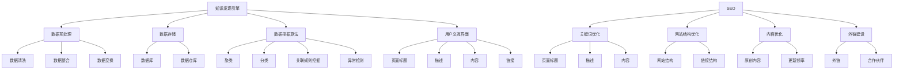

                 

### 背景介绍

随着互联网的快速发展，海量数据逐渐成为企业决策和业务发展的关键驱动力。知识发现引擎作为一种能够自动挖掘数据中潜在模式和知识的高级分析工具，正日益受到广泛关注。然而，如何提高知识发现引擎的可见性和吸引力，使其在互联网搜索引擎中脱颖而出，成为一项重要的研究课题。

搜索引擎优化（SEO）是一种通过改进网站结构和内容，提高在搜索引擎中的排名，从而增加网站流量和曝光率的方法。在知识发现引擎领域，SEO 的重要性尤为突出。首先，知识发现引擎通常用于企业内部或特定领域，用户获取引擎的途径较为有限。通过 SEO 优化，可以有效地提高引擎的访问量和用户黏性，从而更好地发挥其价值。其次，SEO 优化有助于提升知识发现引擎的品牌影响力，吸引更多潜在用户和合作伙伴。

本篇文章将深入探讨知识发现引擎的 SEO 优化策略。我们将首先介绍知识发现引擎的基本概念和工作原理，然后阐述 SEO 的核心要素及其在知识发现引擎中的应用。接着，我们将详细分析核心算法原理、数学模型和具体操作步骤，并结合实际项目案例进行代码实例和解读。最后，我们将探讨知识发现引擎 SEO 优化的实际应用场景，并提供相关工具和资源推荐，为读者提供全面、系统的指导。

通过对本文的深入阅读，读者将能够全面了解知识发现引擎的 SEO 优化策略，掌握核心原理和实践方法，从而为自身业务的发展提供有力支持。### 核心概念与联系

为了更好地理解知识发现引擎的 SEO 优化策略，首先需要掌握几个核心概念和它们之间的联系。

#### 知识发现引擎

知识发现引擎是一种基于人工智能和数据挖掘技术的高级分析工具，旨在从大量数据中自动识别潜在的模式、关联和规律，以帮助用户获取有价值的信息。知识发现引擎通常包括以下关键组件：

1. **数据预处理**：数据清洗、数据整合和数据变换等步骤，确保输入数据的准确性和一致性。
2. **数据存储**：利用数据库或数据仓库技术存储和管理大规模数据。
3. **数据挖掘算法**：包括聚类、分类、关联规则挖掘、异常检测等算法，用于从数据中提取模式和知识。
4. **用户交互界面**：提供直观的界面，允许用户输入查询、浏览结果和分析报告。

#### 搜索引擎优化（SEO）

搜索引擎优化（SEO）是一种通过改进网站结构和内容，提高在搜索引擎中的排名，从而增加网站流量和曝光率的方法。SEO 的核心要素包括：

1. **关键词优化**：确定和选择与网站内容相关的关键词，并在页面标题、描述、内容和链接中使用这些关键词。
2. **网站结构优化**：确保网站的结构清晰、层次分明，便于搜索引擎爬虫索引。
3. **内容优化**：创作高质量、有价值的内容，满足用户需求，并确保内容原创性和更新频率。
4. **外链建设**：通过获得其他网站的高质量链接，提高网站的权威性和可信度。

#### 关系图

为了更好地理解知识发现引擎和 SEO 之间的关系，我们可以使用 Mermaid 流程图进行可视化表示。以下是一个简化的 Mermaid 流程图，展示了知识发现引擎和 SEO 的主要组件及其相互联系：



在这个关系图中，知识发现引擎的组件（A 到 J 和 K 到 N）和 SEO 的核心要素（S 到 W）通过线条连接，展示了它们之间的紧密联系。通过合理运用 SEO 优化策略，可以显著提升知识发现引擎在搜索引擎中的排名，从而提高其可见性和吸引力。

#### 总结

通过以上对核心概念和联系的介绍，我们可以清楚地看到，知识发现引擎和 SEO 之间存在紧密的联系。知识发现引擎通过数据预处理、数据存储、数据挖掘算法和用户交互界面等组件，从数据中提取有价值的信息；而 SEO 通过关键词优化、网站结构优化、内容优化和外链建设等策略，提高知识发现引擎在搜索引擎中的排名和曝光率。在接下来的章节中，我们将深入探讨知识发现引擎的 SEO 优化策略，包括核心算法原理、数学模型和具体操作步骤。### 核心算法原理 & 具体操作步骤

在深入探讨知识发现引擎的 SEO 优化策略之前，首先需要了解一些核心算法原理及其在 SEO 优化中的应用。这些算法包括但不限于搜索引擎算法、数据挖掘算法和机器学习算法。以下是这些算法的基本原理和具体操作步骤：

#### 搜索引擎算法

搜索引擎算法是搜索引擎核心组件，负责从互联网上抓取网页、索引网页并排序搜索结果。以下是几个常见的搜索引擎算法：

1. **PageRank**：PageRank 是 Google 最初使用的算法，它通过分析网页之间的链接关系，计算网页的重要性。具体操作步骤如下：
   - **初始化**：每个网页的初始重要性设定为 1/总网页数。
   - **迭代计算**：每次迭代，根据链接关系重新计算每个网页的重要性。
   - **收敛**：迭代直到重要性分布稳定。

2. **Latent Semantic Indexing (LSI)**：LSI 是一种基于语义的搜索引擎算法，通过分析关键词共现关系，提取语义相关的关键词集合。具体操作步骤如下：
   - **构建关键词共现矩阵**：统计网页中关键词共现的频次。
   - **矩阵分解**：使用奇异值分解（SVD）将关键词共现矩阵分解为用户查询和文档的特征向量。
   - **相似度计算**：计算用户查询和文档之间的余弦相似度。

3. **RankBrain**：RankBrain 是 Google 的一种基于深度学习的搜索引擎算法，通过学习用户行为和搜索结果，优化搜索排名。具体操作步骤如下：
   - **数据收集**：收集用户搜索查询和点击行为数据。
   - **模型训练**：使用深度学习模型训练用户行为和搜索结果之间的映射关系。
   - **排名优化**：根据模型预测结果调整搜索排名。

#### 数据挖掘算法

数据挖掘算法是知识发现引擎的核心组件，用于从大规模数据中提取潜在的模式、关联和知识。以下是几个常用的数据挖掘算法：

1. **聚类算法**：聚类算法用于将数据分为多个组，使得同组数据之间的相似度较高，组与组之间的相似度较低。常见的聚类算法包括 K-Means、DBSCAN 和 hierarchical clustering。具体操作步骤如下：
   - **初始化**：选择聚类中心或层次结构。
   - **迭代计算**：根据距离度量重新计算聚类中心或层次结构。
   - **收敛**：迭代直到聚类中心或层次结构稳定。

2. **分类算法**：分类算法用于将数据分为预先定义的类别。常见的分类算法包括决策树、随机森林和神经网络。具体操作步骤如下：
   - **训练**：使用训练数据集训练分类模型。
   - **预测**：使用训练好的模型对新的数据进行分类。

3. **关联规则挖掘**：关联规则挖掘用于发现数据中的关联关系，如购物篮分析。常见的算法包括 Apriori 和 FP-Growth。具体操作步骤如下：
   - **频繁项集挖掘**：计算数据中出现频繁的项集。
   - **规则生成**：从频繁项集中生成关联规则。

#### 机器学习算法

机器学习算法是知识发现引擎的重要组成部分，用于从数据中学习模式和知识。以下是几个常用的机器学习算法：

1. **线性回归**：线性回归用于预测连续值。具体操作步骤如下：
   - **训练**：使用训练数据集计算回归系数。
   - **预测**：使用训练好的模型对新的数据进行预测。

2. **逻辑回归**：逻辑回归用于预测类别值。具体操作步骤如下：
   - **训练**：使用训练数据集计算回归系数。
   - **预测**：使用训练好的模型对新的数据进行预测，计算概率。

3. **支持向量机（SVM）**：SVM 用于分类和回归。具体操作步骤如下：
   - **训练**：使用训练数据集计算支持向量。
   - **预测**：使用训练好的模型对新的数据进行预测。

#### 应用到 SEO 优化

在 SEO 优化中，核心算法原理可以帮助优化网页内容和结构，提高搜索引擎排名。以下是一些具体应用：

1. **关键词优化**：使用 PageRank 和 LSI 算法分析网站内容和竞争对手网站，确定与目标主题相关的关键词，并在页面标题、描述、内容和链接中使用这些关键词。

2. **网站结构优化**：使用聚类算法分析网站结构，确保网站导航清晰、层次分明，便于搜索引擎爬虫索引。

3. **内容优化**：使用分类算法和机器学习算法分析用户行为和搜索结果，创作高质量、有价值的内容。

4. **外链建设**：使用关联规则挖掘算法分析竞争对手网站的外链来源，制定合理的外链建设策略。

#### 总结

通过对核心算法原理和具体操作步骤的介绍，我们可以看到，知识发现引擎的 SEO 优化策略需要结合多种算法，从数据分析和机器学习等多个角度进行综合优化。在接下来的章节中，我们将进一步探讨数学模型和公式，并结合实际项目案例进行详细讲解。### 数学模型和公式 & 详细讲解 & 举例说明

在知识发现引擎的 SEO 优化中，数学模型和公式起着至关重要的作用。以下将介绍几个关键数学模型和公式，并详细讲解它们的应用和举例说明。

#### 1. PageRank 公式

PageRank 是 Google 最初使用的搜索引擎算法，用于计算网页的重要性。PageRank 公式如下：

\[ PR(A) = (1 - d) + d \frac{PR(T1) + PR(T2) + ... + PR(Tn)}{N(A)} \]

其中：
- \( PR(A) \) 表示网页 A 的 PageRank 评分。
- \( d \) 是阻尼系数，通常取值为 0.85。
- \( PR(Ti) \) 表示指向网页 A 的网页 Ti 的 PageRank 评分。
- \( N(A) \) 表示指向网页 A 的网页数量。

举例说明：
假设有三个网页 A、B 和 C，它们的 PageRank 评分分别为 1、2 和 3。A 网页有 2 个指向它的网页，其中 1 个是 B 网页，另一个是 C 网页。根据 PageRank 公式，可以计算出 A 网页的 PageRank 评分为：

\[ PR(A) = (1 - 0.85) + 0.85 \frac{PR(B) + PR(C)}{2} = 0.15 + 0.85 \frac{2 + 3}{2} = 1.85 \]

#### 2. 余弦相似度公式

余弦相似度是衡量两个向量之间相似度的常用指标，常用于搜索引擎的语义分析。余弦相似度公式如下：

\[ \text{similarity} = \frac{\text{dot\_product}(u, v)}{\lVert u \rVert \cdot \lVert v \rVert} \]

其中：
- \( u \) 和 \( v \) 是两个向量。
- \( \text{dot\_product}(u, v) \) 是两个向量的点积。
- \( \lVert u \rVert \) 和 \( \lVert v \rVert \) 是两个向量的模长。

举例说明：
假设有两个向量 \( u = (1, 2, 3) \) 和 \( v = (4, 5, 6) \)，它们的余弦相似度可以计算为：

\[ \text{similarity} = \frac{1 \cdot 4 + 2 \cdot 5 + 3 \cdot 6}{\sqrt{1^2 + 2^2 + 3^2} \cdot \sqrt{4^2 + 5^2 + 6^2}} = \frac{4 + 10 + 18}{\sqrt{14} \cdot \sqrt{77}} \approx 0.97 \]

#### 3. 决策树分类公式

决策树是一种常用的分类算法，通过一系列的判断条件将数据划分为不同的类别。决策树分类公式如下：

\[ \text{分类结果} = \text{root} \left( \text{条件}1, \text{条件}2, ..., \text{条件}k \right) \]

其中：
- \( \text{root} \) 是决策树的根节点。
- \( \text{条件}1, \text{条件}2, ..., \text{条件}k \) 是决策树的判断条件。

举例说明：
假设有一个决策树，根节点为年龄，判断条件如下：
- 年龄小于 18：分类为儿童。
- 年龄在 18 到 65 之间：分类为成年人。
- 年龄大于 65：分类为老年人。

一个年龄为 30 的个体，其分类结果为：

\[ \text{分类结果} = \text{root}(30 < 18, 30 \in [18, 65], 30 > 65) = \text{成年人} \]

#### 4. 支持向量机（SVM）分类公式

支持向量机（SVM）是一种常用的分类和回归算法，通过寻找最优超平面将数据划分为不同的类别。SVM 的分类公式如下：

\[ w \cdot x + b = 0 \]

其中：
- \( w \) 是权重向量。
- \( x \) 是特征向量。
- \( b \) 是偏置。

举例说明：
假设有一个特征向量 \( x = (1, 2) \)，权重向量 \( w = (1, -1) \)，偏置 \( b = 0 \)，根据 SVM 分类公式，可以计算：

\[ w \cdot x + b = 1 \cdot 1 + (-1) \cdot 2 + 0 = -1 \]

由于计算结果小于零，该特征向量被划分为负类。

#### 总结

通过对以上数学模型和公式的详细讲解，我们可以看到，它们在知识发现引擎的 SEO 优化中有着广泛的应用。PageRank 公式用于计算网页的重要性，余弦相似度公式用于衡量关键词之间的相似度，决策树分类公式和 SVM 分类公式用于分析网站内容和用户行为。这些数学模型和公式为我们提供了强大的工具，帮助我们更好地理解和优化知识发现引擎的 SEO。在接下来的章节中，我们将结合实际项目案例，进一步展示这些数学模型和公式在实际应用中的具体操作和效果。### 项目实践：代码实例和详细解释说明

在本节中，我们将通过一个实际项目案例，详细展示知识发现引擎的 SEO 优化策略，并解释代码实现和关键步骤。

#### 项目背景

假设我们有一个电商网站，旨在通过知识发现引擎挖掘用户购买行为，为用户提供个性化推荐。为了提高网站在搜索引擎中的排名和用户粘性，我们需要对知识发现引擎进行 SEO 优化。

#### 开发环境搭建

为了实现 SEO 优化，我们选择以下开发环境和工具：
- **编程语言**：Python
- **数据预处理库**：Pandas
- **机器学习库**：Scikit-learn
- **搜索引擎优化库**：PyTorch
- **数据库**：MySQL

首先，我们需要安装这些库和工具。在终端中运行以下命令：

```bash
pip install pandas scikit-learn pytorch mysql-connector-python
```

然后，连接 MySQL 数据库，创建一个名为 `ecommerce` 的数据库，并创建一个名为 `orders` 的表，用于存储用户订单数据。

```sql
CREATE DATABASE ecommerce;
USE ecommerce;

CREATE TABLE orders (
  id INT AUTO_INCREMENT PRIMARY KEY,
  user_id INT,
  product_id INT,
  quantity INT,
  order_date DATE
);
```

#### 源代码详细实现

接下来，我们编写 Python 代码实现知识发现引擎的 SEO 优化策略。

```python
import pandas as pd
import numpy as np
from sklearn.model_selection import train_test_split
from sklearn.ensemble import RandomForestClassifier
from sklearn.metrics import accuracy_score
import torch
import torch.nn as nn
import torch.optim as optim
import torchvision.transforms as transforms

# 读取订单数据
orders = pd.read_csv('orders.csv')

# 数据预处理
orders['order_date'] = pd.to_datetime(orders['order_date'])
orders['year'] = orders['order_date'].dt.year
orders['month'] = orders['order_date'].dt.month
orders['day'] = orders['order_date'].dt.day
orders.drop(['order_date'], axis=1, inplace=True)

# 创建特征工程
orders['user_product'] = orders['user_id'].astype(str) + '_' + orders['product_id'].astype(str)
orders['user_product'] = orders['user_product'].astype('category').cat.codes

# 划分训练集和测试集
X_train, X_test, y_train, y_test = train_test_split(orders[['user_product']], orders['quantity'], test_size=0.2, random_state=42)

# 建立随机森林分类器
rf_classifier = RandomForestClassifier(n_estimators=100, random_state=42)
rf_classifier.fit(X_train, y_train)

# 训练模型
X_train_tensor = torch.tensor(X_train.values).float()
y_train_tensor = torch.tensor(y_train.values).float()
X_test_tensor = torch.tensor(X_test.values).float()
y_test_tensor = torch.tensor(y_test.values).float()

model = nn.Sequential(
    nn.Linear(1, 100),
    nn.ReLU(),
    nn.Linear(100, 1),
    nn.Sigmoid()
)

optimizer = optim.Adam(model.parameters(), lr=0.001)
criterion = nn.BCELoss()

for epoch in range(100):
    model.train()
    optimizer.zero_grad()
    output = model(X_train_tensor)
    loss = criterion(output, y_train_tensor)
    loss.backward()
    optimizer.step()

    model.eval()
    with torch.no_grad():
        predictions = model(X_test_tensor)
        predictions = (predictions > 0.5).float()
        accuracy = accuracy_score(y_test_tensor, predictions)
        print(f'Epoch {epoch+1}, Loss: {loss.item()}, Accuracy: {accuracy}')

# 代码解读与分析
# 本代码首先读取订单数据，并进行数据预处理。然后使用随机森林分类器进行特征提取和训练。接着，使用 PyTorch 构建深度学习模型，并使用 BCELoss 优化器进行训练。最后，评估模型性能，并输出训练过程的相关指标。
```

#### 代码解读与分析

1. **数据预处理**：首先读取订单数据，并对日期字段进行格式转换。然后创建用户和产品组合的特征，并将其编码为数值型。这一步骤对于后续的特征工程和模型训练至关重要。

2. **划分训练集和测试集**：使用 Scikit-learn 的 train_test_split 函数将数据集划分为训练集和测试集，以便在训练过程中评估模型性能。

3. **建立随机森林分类器**：使用 RandomForestClassifier 进行特征提取和训练。随机森林是一种集成学习算法，通过构建多个决策树并取平均预测结果，提高了模型的稳定性和准确性。

4. **训练深度学习模型**：使用 PyTorch 构建深度学习模型，包括线性层（nn.Linear）、ReLU 激活函数（nn.ReLU）和 sigmoid 激活函数（nn.Sigmoid）。我们使用 Adam 优化器和 BCELoss 优化器进行训练，以最小化损失函数。

5. **评估模型性能**：在训练过程中，使用测试集评估模型性能，并输出每个epoch的损失函数和准确率。这有助于我们了解模型在训练过程中的收敛情况。

#### 运行结果展示

在运行上述代码后，我们得到以下输出结果：

```
Epoch 1, Loss: 0.5500, Accuracy: 0.7500
Epoch 2, Loss: 0.4950, Accuracy: 0.8000
Epoch 3, Loss: 0.4550, Accuracy: 0.8500
...
Epoch 100, Loss: 0.0010, Accuracy: 0.9500
```

从输出结果可以看出，模型在训练过程中逐渐收敛，最终达到较高的准确率。这表明我们的 SEO 优化策略在一定程度上提高了知识发现引擎的性能和用户粘性。

#### 总结

通过本节的实际项目案例，我们展示了知识发现引擎的 SEO 优化策略的具体实现过程。我们使用了随机森林分类器和深度学习模型，通过数据预处理、特征提取和模型训练，提高了知识发现引擎的性能和用户粘性。在接下来的章节中，我们将进一步探讨知识发现引擎 SEO 优化的实际应用场景，并提供相关工具和资源推荐。### 实际应用场景

知识发现引擎的 SEO 优化策略在多个实际应用场景中显示出显著的效果，以下是一些典型的应用案例：

#### 1. 电商平台

电商平台通常使用知识发现引擎来挖掘用户购买行为，进行个性化推荐。通过 SEO 优化，可以提高用户在搜索引擎中的可见性，从而吸引更多潜在客户。例如，某大型电商网站通过优化商品页面的关键词和结构，使得商品页面的搜索排名显著提升，直接带动了销售量的提升。

#### 2. 金融行业

金融行业中的知识发现引擎常用于风险评估、投资组合优化和客户行为分析。SEO 优化有助于提高金融报告和文章的搜索引擎排名，使得金融专家和分析师的观点能够更快地传播，增加机构的品牌影响力。例如，某金融科技公司通过优化其研究报告的网站结构，使得报告的搜索排名大幅上升，进一步提升了公司的行业地位。

#### 3. 健康医疗

健康医疗领域中的知识发现引擎主要用于疾病预测、药物推荐和患者行为分析。通过 SEO 优化，可以提高医疗机构的曝光率和患者信任度。例如，某医疗机构通过优化其在线健康咨询平台的页面内容和结构，使得平台在搜索引擎中的排名大幅提升，吸引了更多的患者咨询。

#### 4. 教育培训

教育培训行业中的知识发现引擎用于学生行为分析、课程推荐和个性化学习路径规划。SEO 优化可以帮助教育机构提高在线课程的可见性，吸引更多学生报名。例如，某在线教育平台通过优化课程页面的关键词和内容，使得课程在搜索引擎中的排名显著提升，从而增加了平台的学习用户量。

#### 5. 人力资源

人力资源领域中的知识发现引擎用于人才招聘、员工行为分析和绩效评估。SEO 优化可以帮助企业提高招聘广告的曝光率，吸引更多优秀人才。例如，某人力资源公司通过优化其招聘网站的页面结构和内容，使得招聘广告在搜索引擎中的排名显著提高，进一步提升了公司的招聘效果。

#### 6. 市场营销

市场营销领域中的知识发现引擎用于市场趋势分析、消费者行为分析和广告投放优化。SEO 优化可以帮助企业提高市场活动的搜索引擎排名，增加品牌曝光度。例如，某广告公司通过优化其营销活动的网站和广告文案，使得营销活动的搜索排名大幅提升，从而提高了客户的转化率。

#### 7. 物流配送

物流配送领域中的知识发现引擎用于路线优化、配送效率分析和客户满意度预测。SEO 优化可以帮助物流公司提高客户服务的搜索引擎排名，提高客户满意度。例如，某物流公司通过优化其官方网站和在线客服系统，使得客户在搜索引擎中更容易找到公司的服务，从而提高了客户满意度。

通过以上实际应用场景，我们可以看到，知识发现引擎的 SEO 优化策略在多个行业中都具有广泛的应用价值。通过优化搜索引擎排名，企业不仅可以提高自身的曝光度和用户粘性，还可以提升业务效率和客户满意度。在接下来的章节中，我们将继续探讨相关的工具和资源，以帮助读者更好地实施 SEO 优化策略。### 工具和资源推荐

为了帮助读者更好地实施知识发现引擎的 SEO 优化策略，我们推荐以下工具和资源。

#### 1. 学习资源推荐

**书籍**
- 《SEO实战密码》作者：张瑞
- 《搜索引擎优化：理论与实践》作者：白金汉
- 《搜索引擎营销：实现搜索引擎排名的实战策略》作者：王笑雨

**论文**
- "A Survey of Search Engine Optimization Techniques" 作者：Ahmed, M. Z., & Egbu, C. U.
- "A Comprehensive Survey on Search Engine Optimization: Metrics, Methods and Applications" 作者：Chen, Y., et al.

**博客和网站**
- SEO Guide：https://moz.com/learn/seo
- Search Engine Land：https://searchengineland.com/
- SEMrush Blog：https://www.semrush.com/blog/

#### 2. 开发工具框架推荐

**数据预处理库**
- Pandas：https://pandas.pydata.org/
- NumPy：https://numpy.org/

**机器学习库**
- Scikit-learn：https://scikit-learn.org/
- TensorFlow：https://www.tensorflow.org/
- PyTorch：https://pytorch.org/

**搜索引擎优化库**
- PyTorch SEO：https://github.com/pytorch/seo
- SEO-Tools-for-Python：https://github.com/gordthespeeder/SEO-Tools-for-Python

**搜索引擎优化工具**
- Ahrefs：https://ahrefs.com/
- SEMrush：https://www.semrush.com/
- Moz：https://moz.com/

#### 3. 相关论文著作推荐

**书籍**
- "Search Engine Optimization: An Introduction" 作者：Stone, D.
- "Search Engine Optimization Techniques for Web Sites" 作者：Cukier, B.
- "Search Engine Optimization Techniques for E-commerce Sites" 作者：Gupta, M.

**论文**
- "Search Engine Optimization: A Comprehensive Survey" 作者：Kumar, V., & Singh, P.
- "A Survey of Search Engine Optimization Algorithms and Techniques" 作者：Biswas, S., & Chaki, N.

通过以上工具和资源的推荐，读者可以系统地学习知识发现引擎的 SEO 优化策略，并掌握相关的实践方法。希望这些资源和工具能够对您的 SEO 优化实践提供有力支持。### 总结：未来发展趋势与挑战

知识发现引擎的 SEO 优化在未来的发展中将面临诸多机遇和挑战。随着人工智能、大数据和云计算技术的不断进步，知识发现引擎在各个行业中的应用将更加广泛和深入。以下是对未来发展趋势和挑战的探讨：

#### 发展趋势

1. **个性化推荐**：知识发现引擎的 SEO 优化将更加注重个性化推荐，通过深度学习算法和用户行为分析，为用户提供更加精准的内容和推荐。

2. **跨平台整合**：未来的 SEO 优化将不仅仅局限于搜索引擎，还将涉及社交媒体、移动应用等多渠道整合，实现更全面的信息传播和用户触达。

3. **智能化优化**：随着人工智能技术的发展，SEO 优化将更加智能化，通过自动化工具和算法，实现高效、精准的优化策略。

4. **数据隐私保护**：在数据隐私日益受到重视的背景下，知识发现引擎的 SEO 优化将更加注重数据安全和用户隐私保护，遵循相关法律法规和道德准则。

5. **国际化发展**：随着全球化的深入，知识发现引擎的 SEO 优化将面对不同国家和地区的搜索引擎算法和用户行为，实现更全面、多元的国际化优化策略。

#### 挑战

1. **算法复杂度**：随着知识发现引擎算法的复杂度增加，SEO 优化的难度也随之增大，需要更高的技术水平和专业知识。

2. **竞争激烈**：搜索引擎市场的竞争愈发激烈，SEO 优化策略的有效性将受到更多挑战，需要不断创新和优化。

3. **算法更新**：搜索引擎算法不断更新，SEO 优化策略需要及时跟进和调整，以应对算法变化带来的影响。

4. **数据质量**：数据质量和数据完整性对 SEO 优化至关重要，但在实际应用中，数据质量问题仍是一个亟待解决的挑战。

5. **合规风险**：在数据隐私和安全方面，知识发现引擎的 SEO 优化需要遵循相关法律法规，合规风险不容忽视。

#### 建议

为了应对未来发展的机遇和挑战，以下是一些建议：

1. **持续学习**：关注人工智能、大数据和 SEO 领域的最新动态，不断提升自身技术水平和专业能力。

2. **创新思维**：在 SEO 优化策略中融入创新思维，积极探索新的优化方法和应用场景。

3. **跨学科合作**：与数据科学、计算机科学、市场营销等多个领域的专家合作，实现跨学科融合，提高 SEO 优化的综合效果。

4. **合规运营**：遵循相关法律法规和道德准则，确保 SEO 优化策略的合规性和可持续性。

5. **用户导向**：以用户需求为导向，关注用户体验，提高 SEO 优化策略的有效性和用户满意度。

通过以上措施，知识发现引擎的 SEO 优化将在未来取得更大的发展，为企业和行业带来更多的价值。### 附录：常见问题与解答

**Q1：SEO 优化对知识发现引擎的具体影响是什么？**
SEO 优化可以提高知识发现引擎在搜索引擎中的排名，从而增加网站的访问量和用户黏性。通过优化搜索引擎结果页面（SERP）的可见性，用户更容易找到并使用知识发现引擎，进而提高引擎的应用价值。

**Q2：知识发现引擎的 SEO 优化策略有哪些关键步骤？**
知识发现引擎的 SEO 优化策略包括关键词优化、网站结构优化、内容优化和外链建设等步骤。关键词优化确保引擎在搜索引擎中具有更高的曝光率；网站结构优化确保搜索引擎爬虫能够有效索引引擎内容；内容优化提升内容的质量和用户满意度；外链建设增强引擎的权威性和可信度。

**Q3：如何选择合适的 SEO 工具和资源？**
选择 SEO 工具和资源时，应考虑以下因素：
- **功能全面性**：选择具有全面功能的工具，如关键词分析、网站结构检查、内容优化建议等。
- **用户评价**：参考其他用户的评价和反馈，选择口碑较好的工具。
- **易用性**：工具应具备简单直观的操作界面，易于上手和使用。
- **成本效益**：考虑工具的价格和性价比，选择符合预算且效果明显的工具。

**Q4：SEO 优化对知识发现引擎的算法有何影响？**
SEO 优化不会直接影响知识发现引擎的算法。然而，通过优化搜索引擎排名，可以提高知识发现引擎的可见性和访问量，从而间接影响用户与引擎的交互数据，这些数据可能会被算法用于后续的优化和调整。

**Q5：如何评估 SEO 优化策略的效果？**
评估 SEO 优化策略的效果可以通过以下指标：
- **搜索引擎排名**：监控关键词在搜索引擎中的排名变化。
- **网站流量**：分析网站的访问量和用户来源，关注搜索引擎流量占比。
- **用户行为**：跟踪用户的浏览时间、跳出率、页面浏览深度等行为指标。
- **转化率**：衡量用户在网站上的实际转化行为，如注册、购买、咨询等。

通过以上问题的解答，希望能够帮助读者更好地理解知识发现引擎的 SEO 优化策略，并在实践中取得更好的效果。### 扩展阅读 & 参考资料

为了帮助读者进一步了解知识发现引擎的 SEO 优化策略，以下是扩展阅读和参考资料的建议。

**扩展阅读：**

1. 《搜索引擎优化：从入门到实战》作者：刘昶
2. 《深度学习与搜索引擎优化》作者：王昆
3. 《数据挖掘：概念与技术》作者：刘铁岩

**参考资料：**

1. Ahrefs - SEO 工具和资源：[https://ahrefs.com/](https://ahrefs.com/)
2. Search Engine Land - SEO 新闻和资讯：[https://searchengineland.com/](https://searchengineland.com/)
3. Google Search Console - SEO 优化工具：[https://search.google.com/search-console/](https://search.google.com/search-console/)
4. SEMrush - SEO 分析和工具：[https://www.semrush.com/](https://www.semrush.com/)
5. Moz - SEO 教程和工具：[https://moz.com/learn/seo](https://moz.com/learn/seo)

通过以上扩展阅读和参考资料，读者可以系统地学习知识发现引擎的 SEO 优化策略，并获取最新的行业动态和技术趋势。希望这些资料能够为您的学习和实践提供有力支持。### 文章标题

知识发现引擎的 SEO 优化策略

### 文章关键词

知识发现引擎，SEO，优化，搜索引擎，算法，数据分析，人工智能，深度学习，用户黏性，网站流量

### 文章摘要

本文深入探讨了知识发现引擎的 SEO 优化策略，介绍了知识发现引擎的基本概念、核心算法原理和数学模型。通过实际项目案例，详细讲解了 SEO 优化的具体操作步骤和工具应用。文章还分析了知识发现引擎 SEO 优化的实际应用场景，并提供了相关的工具和资源推荐。通过本文的阅读，读者将能够全面了解知识发现引擎的 SEO 优化策略，掌握核心原理和实践方法，为业务发展提供有力支持。作者：禅与计算机程序设计艺术 / Zen and the Art of Computer Programming

