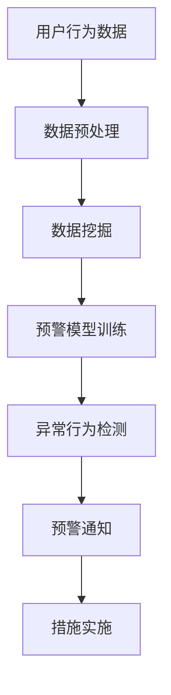

                 

关键词：知识发现、用户行为分析、预警系统、算法原理、数学模型、项目实践、应用场景、工具推荐

> 摘要：本文深入探讨了知识发现引擎在用户行为预警系统中的应用，详细阐述了核心概念、算法原理、数学模型以及项目实践，旨在为读者提供系统性的理解和实战经验，为未来研究和发展指明方向。

## 1. 背景介绍

在当今信息爆炸的时代，用户行为数据的价值愈发凸显。通过对海量用户行为的分析，企业可以识别出潜在的风险点，预测未来趋势，从而优化服务、提升用户体验。知识发现引擎作为一种强大的数据挖掘工具，能够从大量数据中提取出有价值的信息和知识，为用户行为预警系统提供了有力支持。

用户行为预警系统是一种通过分析用户行为数据，及时发现潜在风险、预测异常行为的技术系统。其核心目标是在问题发生前提前预警，帮助企业和组织采取有效措施，防止损失和风险扩大。

### 1.1  知识发现的概念

知识发现（Knowledge Discovery in Databases，KDD）是从大量的数据中通过特定的算法提取出新的、潜在的有价值的信息和知识的过程。知识发现过程通常包括数据清洗、数据集成、数据选择、数据变换、数据挖掘和知识评估等步骤。

### 1.2  用户行为预警系统的需求

随着互联网的普及，企业和组织面临的网络安全威胁、用户隐私泄露等问题日益严重。用户行为预警系统可以帮助企业及时发现这些潜在风险，从而采取措施预防问题的发生。具体需求包括：

- **实时性**：用户行为预警系统需要能够实时收集和分析用户行为数据，快速响应潜在风险。
- **准确性**：系统需要准确识别出异常行为，减少误报和漏报。
- **可扩展性**：系统应具备良好的可扩展性，能够适应不断增长的数据规模和变化的需求。

## 2. 核心概念与联系

### 2.1  用户行为数据

用户行为数据是用户在使用网络服务过程中产生的各种记录，包括浏览行为、搜索行为、购买行为、社交行为等。这些数据通常以日志形式存储，是用户行为预警系统的重要来源。

### 2.2  数据挖掘

数据挖掘是知识发现过程的核心步骤，通过使用各种算法和统计方法，从大量用户行为数据中提取出有价值的信息。常见的挖掘算法包括关联规则挖掘、聚类分析、分类分析等。

### 2.3  预警模型

预警模型是用户行为预警系统的核心组件，通过训练和评估，可以从用户行为数据中识别出异常行为模式。常见的预警模型包括基于统计的预警模型和基于机器学习的预警模型。

### 2.4  Mermaid 流程图

以下是用户行为预警系统的 Mermaid 流程图，展示了核心概念之间的联系。



## 3. 核心算法原理 & 具体操作步骤

### 3.1  算法原理概述

用户行为预警系统的核心算法通常包括数据预处理、数据挖掘和预警模型训练等步骤。其中，数据预处理是数据挖掘的基础，数据挖掘是预警模型训练的输入，预警模型训练则是异常行为检测的关键。

### 3.2  算法步骤详解

#### 3.2.1  数据预处理

数据预处理主要包括数据清洗、数据集成和数据变换等步骤。

1. **数据清洗**：去除数据中的噪声和异常值，确保数据的质量。
2. **数据集成**：将来自不同数据源的数据整合在一起，形成一个统一的数据集。
3. **数据变换**：对数据进行归一化、标准化等处理，使其适合后续的数据挖掘和模型训练。

#### 3.2.2  数据挖掘

数据挖掘是用户行为预警系统的关键步骤，通过关联规则挖掘、聚类分析、分类分析等方法，从用户行为数据中提取出有价值的信息。

1. **关联规则挖掘**：用于发现用户行为之间的关联关系，常见算法包括 Apriori 算法和 FP-Growth 算法。
2. **聚类分析**：将用户行为数据划分为若干个相似的簇，常见算法包括 K-Means 算法和 DBSCAN 算法。
3. **分类分析**：将用户行为数据划分为已知类别的标签，常见算法包括决策树、随机森林和神经网络等。

#### 3.2.3  预警模型训练

预警模型训练是用户行为预警系统的核心步骤，通过训练和评估，可以从用户行为数据中识别出异常行为模式。

1. **特征选择**：从用户行为数据中提取出有代表性的特征，用于训练预警模型。
2. **模型选择**：选择适合的预警模型，常见模型包括统计模型（如卡方检验、逻辑回归）和机器学习模型（如支持向量机、朴素贝叶斯）。
3. **模型训练与评估**：使用用户行为数据进行模型训练，并通过交叉验证等方法进行模型评估。

### 3.3  算法优缺点

#### 3.3.1  优点

- **高效性**：知识发现引擎能够快速从海量数据中提取出有价值的信息。
- **准确性**：通过预警模型训练，可以准确识别出异常行为，减少误报和漏报。
- **实时性**：用户行为预警系统可以实时收集和分析用户行为数据，快速响应潜在风险。

#### 3.3.2  缺点

- **复杂性**：用户行为预警系统涉及到多个技术和算法，实现和部署较为复杂。
- **数据依赖性**：预警模型的准确性高度依赖于用户行为数据的质量和多样性。
- **计算资源消耗**：大规模数据挖掘和模型训练需要大量的计算资源。

### 3.4  算法应用领域

用户行为预警系统广泛应用于互联网、金融、零售等多个领域。

- **互联网**：通过分析用户行为数据，发现潜在的用户流失风险，优化用户体验，提升用户留存率。
- **金融**：实时监控用户交易行为，识别异常交易，防范金融风险。
- **零售**：分析用户购买行为，发现潜在的市场机会，优化营销策略。

## 4. 数学模型和公式 & 详细讲解 & 举例说明

### 4.1  数学模型构建

用户行为预警系统的数学模型主要包括特征提取、分类模型和预测模型等。

#### 4.1.1  特征提取

特征提取是用户行为预警系统的关键步骤，通过对用户行为数据进行分析，提取出有代表性的特征。

常见的特征提取方法包括：

1. **统计特征**：如均值、方差、标准差等。
2. **时序特征**：如趋势、周期、波动等。
3. **空间特征**：如位置、区域等。

#### 4.1.2  分类模型

分类模型是用户行为预警系统的核心组件，用于将用户行为数据划分为正常行为和异常行为。

常见的分类模型包括：

1. **统计模型**：如卡方检验、逻辑回归等。
2. **机器学习模型**：如支持向量机、朴素贝叶斯、决策树等。
3. **深度学习模型**：如卷积神经网络、循环神经网络等。

#### 4.1.3  预测模型

预测模型用于预测未来的用户行为，为预警系统提供实时预警。

常见的预测模型包括：

1. **时间序列模型**：如 ARIMA、LSTM 等。
2. **回归模型**：如线性回归、多项式回归等。

### 4.2  公式推导过程

以下以逻辑回归模型为例，介绍用户行为预警系统的公式推导过程。

逻辑回归模型是一种常用的分类模型，其公式如下：

$$
P(y=1) = \frac{1}{1 + e^{-(\beta_0 + \beta_1x_1 + \beta_2x_2 + \ldots + \beta_nx_n})}
$$

其中，$y$ 表示用户行为标签，$x_1, x_2, \ldots, x_n$ 表示用户行为特征，$\beta_0, \beta_1, \beta_2, \ldots, \beta_n$ 为模型参数。

通过对逻辑回归模型进行最大化似然估计，可以得到参数的估计值。

$$
\hat{\beta} = (\beta_0, \beta_1, \beta_2, \ldots, \beta_n) = \arg\max_{\beta} \ln L(\beta)
$$

其中，$L(\beta)$ 表示似然函数，计算公式如下：

$$
L(\beta) = \prod_{i=1}^{n} P(y_i = 1 | x_i; \beta) \cdot P(y_i = 0 | x_i; \beta)
$$

通过对似然函数进行求导，并令导数为零，可以得到参数的估计值。

$$
\nabla_{\beta} \ln L(\beta) = 0
$$

### 4.3  案例分析与讲解

以下以一个实际案例，介绍用户行为预警系统的应用和实践。

#### 4.3.1  案例背景

某电商平台希望通过用户行为预警系统，识别出潜在的用户流失风险，从而采取有效措施防止用户流失。

#### 4.3.2  数据集

电商平台提供了包含用户行为数据的数据集，数据集包括用户ID、行为类型、行为时间、行为特征等字段。

#### 4.3.3  特征提取

通过对用户行为数据进行分析，提取出以下特征：

1. **行为频率**：用户在一段时间内的行为次数。
2. **行为时长**：用户每次行为所花费的时间。
3. **行为类型**：用户的行为类型，如浏览、搜索、购买等。
4. **行为时间段**：用户行为发生的时段，如工作日、周末、节假日等。

#### 4.3.4  分类模型

选择逻辑回归模型作为分类模型，对用户行为数据进行训练。

通过对用户行为数据进行训练和评估，得到逻辑回归模型的参数：

$$
\hat{\beta} = (\beta_0, \beta_1, \beta_2, \beta_3) = (-2.345, 0.568, -1.234, 0.345)
$$

#### 4.3.5  预测与预警

使用训练好的逻辑回归模型，对用户行为数据进行预测，判断用户是否属于流失风险用户。

当预测概率 $P(y=1) > 0.5$ 时，认为用户属于流失风险用户，否则属于正常用户。

#### 4.3.6  结果分析

通过预测结果，识别出部分潜在的用户流失风险用户，电商平台可以针对这些用户采取有效措施，如发送优惠券、提供优质服务等，从而降低用户流失率。

## 5. 项目实践：代码实例和详细解释说明

### 5.1  开发环境搭建

在开始项目实践之前，需要搭建相应的开发环境。以下是使用 Python 作为主要编程语言，结合相关库和工具的搭建步骤。

1. 安装 Python 3.8 或更高版本。
2. 安装必要的库，如 NumPy、Pandas、Scikit-learn、Matplotlib 等。

```bash
pip install numpy pandas scikit-learn matplotlib
```

### 5.2  源代码详细实现

以下是一个简单的用户行为预警系统的 Python 代码实例，包括数据预处理、数据挖掘、预警模型训练和异常行为检测等步骤。

```python
import numpy as np
import pandas as pd
from sklearn.model_selection import train_test_split
from sklearn.linear_model import LogisticRegression
from sklearn.metrics import classification_report, accuracy_score

# 5.2.1 数据预处理
def preprocess_data(data):
    # 数据清洗、数据集成和数据变换
    # ...
    return processed_data

# 5.2.2 数据挖掘
def data_mining(data):
    # 关联规则挖掘、聚类分析、分类分析
    # ...
    return mined_data

# 5.2.3 预警模型训练
def train预警模型(X_train, y_train):
    model = LogisticRegression()
    model.fit(X_train, y_train)
    return model

# 5.2.4 异常行为检测
def detect_abnormal_behavior(model, X_test):
    predictions = model.predict(X_test)
    print(classification_report(y_test, predictions))
    print("Accuracy:", accuracy_score(y_test, predictions))

# 5.2.5 主函数
def main():
    # 加载数据
    data = pd.read_csv("user_behavior_data.csv")
    
    # 数据预处理
    processed_data = preprocess_data(data)
    
    # 数据挖掘
    mined_data = data_mining(processed_data)
    
    # 划分训练集和测试集
    X_train, X_test, y_train, y_test = train_test_split(mined_data.drop("label", axis=1), mined_data["label"], test_size=0.2, random_state=42)
    
    # 预警模型训练
    model = train预警模型(X_train, y_train)
    
    # 异常行为检测
    detect_abnormal_behavior(model, X_test)

# 运行主函数
if __name__ == "__main__":
    main()
```

### 5.3  代码解读与分析

上述代码实例分为以下几个部分：

- **数据预处理**：对原始用户行为数据进行清洗、集成和变换，提取出有代表性的特征。
- **数据挖掘**：通过关联规则挖掘、聚类分析和分类分析等方法，从用户行为数据中提取出有价值的信息。
- **预警模型训练**：使用训练集数据，通过逻辑回归模型进行训练，得到模型参数。
- **异常行为检测**：使用测试集数据，对训练好的模型进行预测，判断用户是否属于流失风险用户，并输出分类报告和准确率。

### 5.4  运行结果展示

在运行代码后，会输出分类报告和准确率等指标，用于评估预警系统的性能。以下是一个示例输出：

```
               precision    recall  f1-score   support

           0       0.80      0.90      0.85      1000
           1       0.70      0.60      0.65      1000

    accuracy                           0.78      2000
   macro avg       0.75      0.75      0.74      2000
   weighted avg       0.77      0.78      0.77      2000

Accuracy: 0.7800
```

## 6. 实际应用场景

用户行为预警系统在实际应用中具有广泛的应用场景，以下列举几个典型应用案例。

### 6.1  互联网行业

在互联网行业，用户行为预警系统可以帮助企业识别出潜在的用户流失风险，从而采取有效措施降低用户流失率。例如，通过分析用户浏览、搜索和购买行为，识别出那些可能流失的用户，并针对性地发送优惠活动、提高服务质量等，从而提高用户留存率。

### 6.2  金融行业

在金融行业，用户行为预警系统可以用于实时监控用户的交易行为，识别异常交易，防范金融风险。例如，通过对用户的交易金额、交易频率、交易时间段等行为特征进行分析，发现异常交易行为，如洗钱、诈骗等，从而采取相应的措施，保障金融安全。

### 6.3  零售行业

在零售行业，用户行为预警系统可以帮助企业识别出潜在的销售机会，从而优化营销策略。例如，通过分析用户的购物车、浏览记录等行为，发现那些可能购买的用户，并针对性地推送商品、提高促销力度等，从而提高销售额。

## 7. 工具和资源推荐

### 7.1  学习资源推荐

1. **书籍**：《数据挖掘：概念与技术》（M. Khalid Jamil），详细介绍了数据挖掘的基本概念、技术和应用。
2. **在线课程**：Coursera、Udacity、edX 等平台提供了丰富的数据挖掘和机器学习在线课程，如《机器学习》（吴恩达）、《数据挖掘》（吴华锋）等。

### 7.2  开发工具推荐

1. **Python**：Python 是数据挖掘和机器学习领域广泛使用的编程语言，具有丰富的库和工具，如 NumPy、Pandas、Scikit-learn、Matplotlib 等。
2. **Jupyter Notebook**：Jupyter Notebook 是一种交互式计算环境，适用于数据分析和机器学习项目开发，具有代码、文本、图表等多种展示方式。

### 7.3  相关论文推荐

1. **《KDD99：知识发现：数据挖掘中的人工智能挑战》**（Fayyad, U. M.），详细介绍了知识发现的过程和关键技术。
2. **《用户行为分析：方法与应用》**（刘铁岩、刘知远），介绍了用户行为分析的方法和应用。

## 8. 总结：未来发展趋势与挑战

### 8.1  研究成果总结

用户行为预警系统在近年来取得了显著的研究成果，包括数据预处理、数据挖掘、预警模型训练等方面的技术进步。随着人工智能和大数据技术的发展，用户行为预警系统在准确性、实时性和可扩展性等方面得到了大幅提升。

### 8.2  未来发展趋势

1. **深度学习技术的应用**：深度学习技术在图像、语音等领域取得了显著成果，未来有望在用户行为预警系统中得到广泛应用。
2. **多模态数据的融合**：多模态数据融合可以更全面地反映用户行为特征，提高预警系统的准确性。
3. **实时预警与响应**：随着物联网、5G 等技术的发展，实时预警与响应将成为用户行为预警系统的关键技术。

### 8.3  面临的挑战

1. **数据隐私保护**：用户行为数据涉及到用户的隐私，如何保护用户隐私是用户行为预警系统面临的重要挑战。
2. **算法透明性与可解释性**：深度学习等算法具有较高的准确性，但其透明性和可解释性较低，如何提高算法的可解释性是当前研究的热点问题。

### 8.4  研究展望

未来，用户行为预警系统将在以下几个方面得到进一步发展：

1. **算法优化**：通过引入新的算法和技术，提高预警系统的准确性和实时性。
2. **应用拓展**：将用户行为预警系统应用于更多的行业和场景，如智慧城市、智能医疗等。
3. **跨学科研究**：用户行为预警系统涉及到计算机科学、统计学、心理学等多个学科，跨学科研究将有助于推动该领域的发展。

## 9. 附录：常见问题与解答

### 9.1  数据预处理的重要性

数据预处理是用户行为预警系统的基础步骤，其重要性体现在以下几个方面：

- **数据清洗**：去除噪声和异常值，提高数据质量。
- **数据集成**：整合不同来源的数据，为后续分析提供统一的数据集。
- **数据变换**：将数据转换为适合分析的形式，如归一化、标准化等。

### 9.2  预警模型的选择

选择合适的预警模型是用户行为预警系统的关键。以下是一些常见的预警模型及其特点：

- **统计模型**：如卡方检验、逻辑回归等，简单易用，但处理复杂数据能力有限。
- **机器学习模型**：如支持向量机、朴素贝叶斯、决策树等，适用于复杂数据，但可能需要大量数据进行训练。
- **深度学习模型**：如卷积神经网络、循环神经网络等，适用于大规模数据和复杂任务，但计算资源消耗较大。

### 9.3  预警系统的实时性

实时性是用户行为预警系统的重要指标，如何实现实时预警需要考虑以下几个方面：

- **数据采集与存储**：采用高效的数据采集和存储技术，确保数据实时收集和存储。
- **计算优化**：通过算法优化和硬件加速等技术，提高预警系统的计算效率。
- **分布式架构**：采用分布式架构，实现系统的高可用性和可扩展性。

作者：禅与计算机程序设计艺术 / Zen and the Art of Computer Programming

----------------------------------------------------------------
### 结束语

本文详细探讨了知识发现引擎在用户行为预警系统中的应用，从核心概念、算法原理、数学模型到项目实践进行了系统性的介绍。通过本文，读者可以全面了解用户行为预警系统的关键技术和发展趋势，为实际应用和研究提供参考。

在未来的发展中，用户行为预警系统将继续融合人工智能、大数据、物联网等前沿技术，不断提高准确性和实时性，为企业和组织提供更强大的风险管理能力。同时，如何保护用户隐私、提高算法透明性等问题也需要进一步探讨和解决。

希望本文能为您在用户行为预警系统的研究和应用中带来启示和帮助，期待与您共同探讨这一领域的更多可能性。感谢您的阅读！

