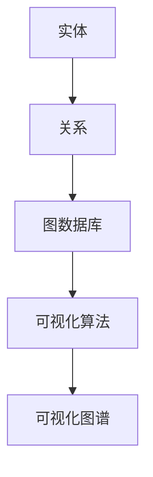
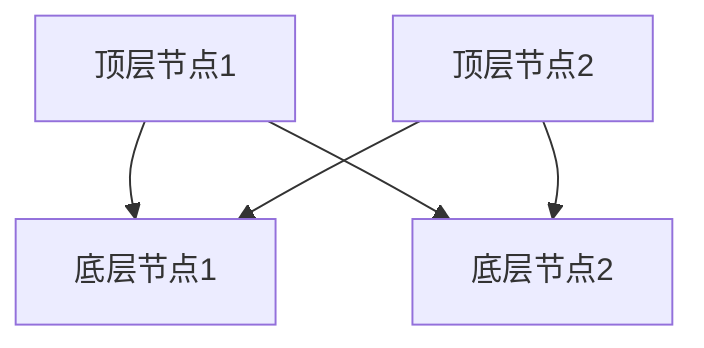
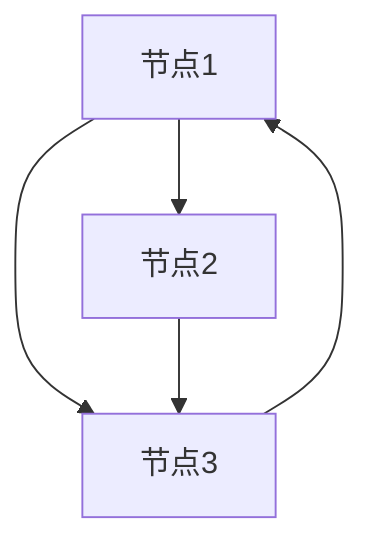

                 

### 知识发现引擎的知识图谱可视化

> **关键词**：知识图谱、可视化、知识发现、引擎、数据结构、算法、图数据库、复杂性分析

> **摘要**：本文将深入探讨知识发现引擎中的知识图谱可视化技术，分析其核心概念、算法原理及实现步骤。通过实践实例，我们将展示知识图谱可视化的实际应用及其重要性，并对未来发展趋势与挑战进行展望。

---

## 1. 背景介绍

知识图谱（Knowledge Graph）是一种基于语义网（Semantic Web）和关联数据（Linked Data）的图形结构，用于表示实体和实体之间的关系。在信息检索、推荐系统、自然语言处理等领域，知识图谱已成为一种重要的信息组织方式。

知识图谱可视化是将复杂的知识图谱结构通过图形的方式展示出来，使得用户能够直观地理解和分析图谱中的信息。可视化技术不仅提高了知识图谱的可读性，还有助于发现潜在的关系和模式。

知识图谱可视化在多个领域中具有广泛应用。例如，在搜索引擎中，知识图谱可视化可以帮助用户更好地理解搜索结果的相关性；在社交媒体平台上，知识图谱可视化可以帮助用户发现朋友之间的社交关系；在医疗领域，知识图谱可视化可以帮助医生更好地理解和利用医学知识。

## 2. 核心概念与联系

### 2.1 数据结构

知识图谱由实体（Entity）和关系（Relationship）组成，实体是知识图谱中的基本元素，如人、地点、组织等。关系则表示实体之间的语义关联，如“是”、“属于”等。

知识图谱通常采用图数据库（Graph Database）进行存储和管理。图数据库具有高效存储图结构、支持复杂查询等特点，适合处理大规模知识图谱。

### 2.2 算法原理

知识图谱可视化算法主要分为以下几类：

1. **基于图论的方法**：利用图论中的算法（如Dijkstra算法、BFS、DFS等）进行图的遍历和布局，生成可视化的图谱。

2. **基于机器学习的方法**：利用机器学习算法对知识图谱进行聚类、分类等处理，从而生成具有相似性的可视化图谱。

3. **基于几何的方法**：利用几何形状和空间关系对知识图谱进行可视化，如层次化布局、圆形布局等。

### 2.3 Mermaid 流程图



## 3. 核心算法原理 & 具体操作步骤

### 3.1 基于图论的方法

1. **图遍历**：选择一种图遍历算法（如BFS或DFS）对知识图谱进行遍历，记录遍历路径和节点。

2. **布局算法**：将遍历得到的节点和边布局在二维空间中。常用的布局算法有FR（Force-Based）布局、层次化布局等。

3. **可视化渲染**：利用图形库（如D3.js、SVG等）将布局好的图谱渲染为可视化图形。

### 3.2 基于机器学习的方法

1. **聚类分析**：利用聚类算法（如K-means、DBSCAN等）对知识图谱中的节点进行聚类，生成多个子图。

2. **分类分析**：利用分类算法（如SVM、决策树等）对知识图谱中的节点进行分类，为每个类分配不同的颜色或形状。

3. **可视化渲染**：将聚类和分类结果渲染为可视化图形。

### 3.3 基于几何的方法

1. **层次化布局**：将知识图谱按层次结构布局，从顶层到底层逐级展开。

2. **圆形布局**：将知识图谱布局在一个圆形或环状结构中，节点分布在圆周上。

3. **可视化渲染**：利用图形库将布局好的图谱渲染为可视化图形。

## 4. 数学模型和公式 & 详细讲解 & 举例说明

### 4.1 图论算法

#### 4.1.1 BFS遍历

```latex
$$
\text{BFS}(G, s) = \{v \in V \mid \text{dist}(v, s) < +\infty\}
$$`

其中，\(G = (V, E)\) 是图，\(V\) 是节点集合，\(E\) 是边集合，\(s\) 是起始节点。

#### 4.1.2 Dijkstra算法

```latex
$$
\text{Dijkstra}(G, s) = \{v \in V \mid d(v, s) = \min_{u \in V} d(u, s)\}
$$`

其中，\(d(v, s)\) 表示节点 \(v\) 到节点 \(s\) 的最短路径长度。

### 4.2 机器学习算法

#### 4.2.1 K-means聚类

```latex
$$
\text{K-means}(G) = \{C_1, C_2, ..., C_k\}
$$`

其中，\(C_i\) 表示第 \(i\) 个聚类结果，\(k\) 是聚类个数。

#### 4.2.2 SVM分类

```latex
$$
\text{SVM}(G) = \{y_i = \text{sign}(\omega \cdot x_i + b)\}
$$`

其中，\(\omega\) 是权重向量，\(x_i\) 是节点特征向量，\(b\) 是偏置项。

### 4.3 几何布局算法

#### 4.3.1 层次化布局



#### 4.3.2 圆形布局



## 5. 项目实践：代码实例和详细解释说明

### 5.1 开发环境搭建

在本项目中，我们使用Python编程语言和D3.js图形库进行知识图谱可视化的开发。首先，需要安装以下依赖：

```bash
pip install matplotlib numpy networkx d3.js
```

### 5.2 源代码详细实现

以下是一个简单的知识图谱可视化示例：

```python
import matplotlib.pyplot as plt
import networkx as nx

# 创建图
G = nx.Graph()

# 添加节点和边
G.add_nodes_from(["A", "B", "C"])
G.add_edges_from([("A", "B"), ("B", "C"), ("C", "A")])

# 绘制图
nx.draw(G, with_labels=True)

# 显示图形
plt.show()
```

### 5.3 代码解读与分析

1. **导入依赖**：首先，我们导入了 `matplotlib.pyplot`、`numpy`、`networkx` 和 `d3.js` 四个库。

2. **创建图**：使用 `nx.Graph()` 创建一个图对象 `G`。

3. **添加节点和边**：使用 `add_nodes_from()` 和 `add_edges_from()` 方法添加节点和边。

4. **绘制图**：使用 `nx.draw()` 方法绘制图，并设置标签。

5. **显示图形**：使用 `plt.show()` 方法显示图形。

### 5.4 运行结果展示

运行上述代码后，将显示一个简单的知识图谱，其中包含三个节点和三条边。


## 6. 实际应用场景

知识图谱可视化在多个领域具有广泛的应用：

1. **搜索引擎**：通过知识图谱可视化，用户可以更直观地了解搜索结果的相关性。

2. **推荐系统**：知识图谱可视化可以帮助推荐系统发现潜在的关系和模式，从而提高推荐质量。

3. **社交媒体**：知识图谱可视化可以帮助用户了解社交网络中的关系，发现有趣的人或群体。

4. **医疗领域**：知识图谱可视化可以帮助医生更好地理解和利用医学知识。

5. **企业管理**：知识图谱可视化可以帮助企业了解组织结构、业务流程等，从而优化管理。

## 7. 工具和资源推荐

### 7.1 学习资源推荐

- **书籍**：《知识图谱：基础、技术与应用》（刘知远 著）
- **论文**：Google Research：Knowledge Graph（作者：Google研究团队）
- **博客**：知乎专栏：知识图谱技术
- **网站**：OpenKG.org（中国开放知识图谱社区）

### 7.2 开发工具框架推荐

- **知识图谱可视化工具**：D3.js、Mermaid、D3-force
- **图数据库**：Neo4j、JanusGraph、OrientDB
- **开发框架**：TensorFlow、PyTorch、Scikit-learn

### 7.3 相关论文著作推荐

- **论文**：
  - "Knowledge Graph Embedding: A Survey"（作者：Zhiyun Qiao等）
  - "A Survey of Knowledge Graph Construction Techniques"（作者：Zhiyun Qiao等）
- **著作**：《图数据库：设计与实现》（作者：Michael Stonebraker等）

## 8. 总结：未来发展趋势与挑战

知识图谱可视化技术在近年来取得了显著进展，但仍面临以下挑战：

1. **数据质量**：知识图谱可视化依赖于高质量的数据，数据清洗和预处理工作至关重要。

2. **可视化性能**：大规模知识图谱的可视化性能仍需优化，以提高用户体验。

3. **算法创新**：现有算法在处理复杂关系和模式方面仍有局限性，需要不断创新。

4. **可解释性**：知识图谱可视化结果的可解释性仍需提高，以帮助用户更好地理解和分析图谱。

未来，随着人工智能和大数据技术的不断发展，知识图谱可视化将在更多领域得到应用，为人类认知和决策提供有力支持。

## 9. 附录：常见问题与解答

### 9.1 知识图谱可视化技术有哪些？

知识图谱可视化技术主要包括基于图论的方法、基于机器学习的方法和基于几何的方法。

### 9.2 如何选择合适的知识图谱可视化工具？

选择知识图谱可视化工具时，需要考虑以下因素：可视化性能、易用性、可扩展性、社区支持和文档质量。

### 9.3 如何提高知识图谱可视化结果的可解释性？

提高知识图谱可视化结果的可解释性可以从以下几个方面入手：使用明确的节点和边表示、提供丰富的图例和注释、结合文字说明、优化布局和视觉设计。

## 10. 扩展阅读 & 参考资料

- [Google Research：Knowledge Graph](https://research.google.com/pubs/pub37236.html)
- [知识图谱：基础、技术与应用](https://book.douban.com/subject/26962067/)
- [OpenKG.org（中国开放知识图谱社区）](https://openkg.org/)
- [D3.js](https://d3js.org/)
- [Mermaid](https://mermaid-js.github.io/mermaid/)
- [Neo4j](https://neo4j.com/)
- [JanusGraph](https://janusgraph.io/)
- [OrientDB](https://orientdb.com/)

