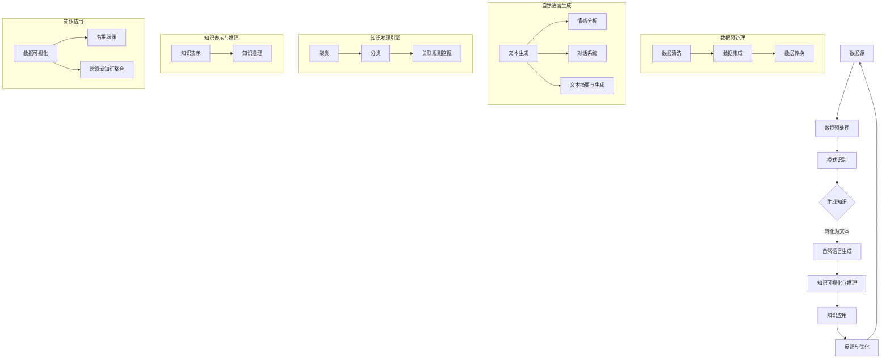

                 

### 背景介绍

知识发现引擎（Knowledge Discovery Engine，简称KDE）作为大数据时代的重要工具，旨在从大量数据中提取出有价值的信息和知识，为各种应用场景提供智能化的决策支持。然而，随着数据规模的不断扩大和数据类型的日益多样化，传统的数据挖掘方法和工具已难以满足现代应用的需求。因此，研究并开发更高效、更智能的知识发现引擎成为了学术界和工业界共同关注的焦点。

自然语言生成（Natural Language Generation，简称NLG）技术是近年来人工智能领域的一项重要突破，其核心在于利用计算机程序生成符合语法和语义规则的自然语言文本。NLG技术的应用范围非常广泛，包括但不限于自动新闻撰写、智能客服、语音合成、情感分析等。而将自然语言生成技术引入知识发现引擎，不仅能够实现知识提取过程的自动化，还能够使得知识表达更加贴近人类语言习惯，从而提高知识的可读性和实用性。

本文旨在探讨知识发现引擎的自然语言生成技术，从背景、核心概念、算法原理、数学模型、项目实践、应用场景、资源推荐等多个角度进行分析和探讨。希望通过本文的阐述，能够帮助读者全面了解这一前沿技术，并为其在实际应用中的落地提供参考。

### 1.1 研究意义与目的

研究知识发现引擎的自然语言生成技术具有重要的现实意义和学术价值。首先，在现实应用中，大量的数据以非结构化或半结构化的形式存在，如文本、图片、音频等。这些数据中蕴含着丰富的信息，但传统的方法难以高效地从中提取有价值的知识。引入自然语言生成技术，可以将这些数据转化为结构化、易于理解的知识，从而提升数据的价值和利用效率。

其次，自然语言生成技术能够极大地提高知识发现过程的自动化程度。传统的知识发现引擎往往需要依赖复杂的人工干预和参数调优，这不仅增加了开发和维护成本，还限制了其应用范围。通过自然语言生成技术，可以自动化地生成知识表达和解释，降低人工干预的需求，提高系统的智能化水平。

在学术研究方面，知识发现引擎的自然语言生成技术为人工智能领域提供了新的研究方向。如何更好地融合自然语言处理和数据挖掘技术，构建高效的知识发现引擎，是一个亟待解决的挑战。通过对这一技术的深入研究和探讨，有望推动人工智能技术在知识发现领域的应用和发展。

本文的研究目的在于：

1. **系统梳理知识发现引擎的自然语言生成技术的研究背景和发展现状**：通过分析现有的研究成果，了解该领域的研究热点和发展趋势。

2. **深入探讨核心概念和原理**：详细阐述知识发现引擎和自然语言生成技术的核心概念，以及它们之间的联系和相互作用。

3. **分析核心算法和数学模型**：介绍常见的自然语言生成算法和其在知识发现引擎中的应用，并详细讲解相关的数学模型和公式。

4. **通过项目实践验证技术效果**：通过具体案例，展示如何使用自然语言生成技术实现知识发现，并提供详细的代码实例和解读。

5. **探讨实际应用场景和未来发展趋势**：分析自然语言生成技术在知识发现领域的应用前景，并探讨未来可能面临的挑战和机遇。

总之，本文旨在为知识发现引擎的自然语言生成技术的研究和应用提供全面而深入的指导，为学术界和工业界在该领域的发展提供有益的参考。

### 1.2 相关研究综述

在过去的几十年中，知识发现引擎和自然语言生成技术取得了显著的进展，并在多个领域取得了重要应用。本文将对这两大领域的研究现状和热点问题进行综述，以期为后续章节的分析提供理论基础。

#### 知识发现引擎

知识发现引擎作为大数据时代的重要工具，其研究始于20世纪90年代，随着数据挖掘技术的兴起而迅速发展。目前，知识发现引擎主要涉及以下研究方向：

1. **数据预处理**：数据预处理是知识发现的第一步，包括数据清洗、数据集成和数据转换等。研究者们提出了一系列方法来提高数据质量和一致性，如基于规则的数据清洗、机器学习算法的异常值检测和自动数据集成技术。

2. **模式识别**：模式识别是知识发现的核心环节，包括聚类、分类、关联规则挖掘等。近年来，深度学习技术在模式识别中得到了广泛应用，如卷积神经网络（CNN）在图像分类中的应用、循环神经网络（RNN）在序列数据处理中的应用等。

3. **知识表示与推理**：知识表示与推理是知识发现的高级形式，旨在将发现的知识以可解释、可操作的方式表示出来。研究者们提出了多种知识表示方法，如本体论、知识图谱、图神经网络等，以及相应的推理算法，如基于规则推理、基于模型推理等。

4. **知识可视化**：知识可视化是将知识发现的结果以图形化的形式展示出来，使其更易于理解和传播。常见的知识可视化方法包括信息可视化、交互式可视化、多维数据可视化等。

#### 自然语言生成

自然语言生成技术起源于20世纪80年代，随着计算机科学和人工智能技术的发展而不断演进。目前，自然语言生成技术主要涉及以下研究方向：

1. **文本生成**：文本生成是自然语言生成的基础，包括语句生成、段落生成和文档生成等。早期的文本生成方法主要基于规则和模板，如生成语法树和填充模板。近年来，深度学习技术，特别是循环神经网络（RNN）和变换器（Transformer）模型，为文本生成带来了革命性的变化。

2. **情感分析与情感生成**：情感分析旨在识别文本中的情感倾向，如正面、负面或中性。情感生成则是在情感分析的基础上，生成具有特定情感倾向的文本。研究者们提出了多种情感分析方法，如基于情感词典、基于机器学习的方法等，以及情感生成的模型，如基于规则的方法、基于生成对抗网络（GAN）的方法等。

3. **对话系统**：对话系统是自然语言生成在智能客服、虚拟助手等领域的应用，旨在实现人与机器的交互。对话系统的研究包括自然语言理解、对话生成、对话管理等方面。近年来，预训练语言模型（如BERT、GPT）在对话系统中的应用，极大地提升了对话系统的智能化水平。

4. **文本摘要与生成**：文本摘要与生成是自然语言生成的另一个重要方向，旨在将长文本压缩为简洁的摘要，或生成新的文本内容。研究者们提出了多种文本摘要方法，如基于抽取的摘要、基于生成的摘要等，以及文本生成的模型，如序列到序列（Seq2Seq）模型、自回归语言模型等。

#### 热点问题与研究趋势

当前，知识发现引擎和自然语言生成技术的研究热点和趋势主要体现在以下几个方面：

1. **多模态融合**：随着多模态数据的广泛应用，如何有效地融合文本、图像、音频等多模态数据，进行知识发现和自然语言生成，成为了一个重要研究课题。

2. **知识图谱构建与应用**：知识图谱作为一种结构化知识表示方法，在知识发现和自然语言生成中具有重要作用。如何构建大规模、高质量的知识图谱，以及如何利用知识图谱进行知识发现和自然语言生成，是一个重要研究方向。

3. **生成式模型与鉴别式模型的结合**：生成式模型和鉴别式模型在自然语言生成中各有所长。生成式模型能够生成多样化的文本内容，而鉴别式模型能够对文本进行分类和判断。如何将两种模型结合起来，提高自然语言生成的质量，是一个研究热点。

4. **领域自适应与跨领域生成**：自然语言生成技术在不同领域的应用存在差异，如何实现领域自适应和跨领域生成，是一个重要研究方向。例如，如何利用跨领域的预训练模型，提高文本生成的准确性和多样性。

5. **可解释性与可操作性的知识表示**：知识发现引擎生成的知识需要具备可解释性和可操作性，以便于用户理解和应用。如何设计出既具有解释性又能有效指导实践的知识表示方法，是一个重要研究挑战。

总之，知识发现引擎和自然语言生成技术的研究正处于快速发展的阶段，未来还有许多挑战和机遇等待探索。通过不断的研究和创新，有望为大数据时代的信息处理和知识服务提供更加高效和智能的解决方案。

### 1.3 本文结构

本文将系统地探讨知识发现引擎的自然语言生成技术，主要分为以下十个部分：

1. **背景介绍**：阐述知识发现引擎和自然语言生成技术的背景、研究意义及本文的研究目的。
2. **相关研究综述**：综述知识发现引擎和自然语言生成技术的研究现状、热点问题及研究趋势。
3. **核心概念与联系**：详细解释知识发现引擎和自然语言生成技术的核心概念，展示两者之间的联系。
4. **核心算法原理 & 具体操作步骤**：介绍自然语言生成技术在知识发现引擎中的应用算法，并详细讲解操作步骤。
5. **数学模型和公式 & 详细讲解 & 举例说明**：阐述相关的数学模型和公式，并通过具体实例进行讲解。
6. **项目实践：代码实例和详细解释说明**：通过实际项目展示如何应用自然语言生成技术实现知识发现，并提供详细代码解读。
7. **实际应用场景**：分析自然语言生成技术在知识发现领域的实际应用场景。
8. **工具和资源推荐**：推荐学习资源、开发工具框架及相关论文著作。
9. **总结：未来发展趋势与挑战**：总结知识发现引擎的自然语言生成技术的发展趋势和面临的挑战。
10. **附录：常见问题与解答**：解答读者可能遇到的问题。
11. **扩展阅读 & 参考资料**：提供进一步的阅读资源和相关参考资料。

通过本文的逐步分析和深入探讨，希望能够为读者全面了解和掌握知识发现引擎的自然语言生成技术提供有价值的参考。

### 核心概念与联系

在深入探讨知识发现引擎的自然语言生成技术之前，我们首先需要了解核心概念及其之间的联系。以下我们将分别介绍知识发现引擎、自然语言生成技术及其在知识发现中的应用。

#### 知识发现引擎

知识发现引擎是一种自动化的系统，旨在从大量数据中识别出潜在的模式、关联和知识。其核心概念包括以下几个方面：

1. **数据源**：数据源是知识发现引擎的基础，可以是结构化数据（如数据库）、半结构化数据（如XML）和非结构化数据（如文本、图像、音频等）。

2. **数据预处理**：数据预处理是确保数据质量和一致性的重要步骤，包括数据清洗、数据集成和数据转换等。数据清洗旨在去除噪声和不一致的数据，数据集成旨在将不同来源的数据整合在一起，数据转换旨在将数据格式转换为适合挖掘的格式。

3. **模式识别**：模式识别是知识发现的核心环节，旨在从数据中提取出具有统计意义和实用价值的模式。常见的模式识别方法包括聚类、分类、关联规则挖掘等。

4. **知识表示与推理**：知识表示与推理是将提取出的模式转化为可操作、可解释的知识。知识表示方法包括本体论、知识图谱、图神经网络等，知识推理方法包括基于规则的推理、基于模型的推理等。

#### 自然语言生成技术

自然语言生成技术（NLG）是一种利用计算机程序生成自然语言文本的技术。其核心概念包括以下几个方面：

1. **文本生成**：文本生成是NLG的基础，旨在生成符合语法和语义规则的自然语言文本。文本生成可以分为语句生成、段落生成和文档生成等层次。

2. **情感分析**：情感分析旨在识别文本中的情感倾向，如正面、负面或中性。情感分析通常使用情感词典、机器学习等方法。

3. **对话系统**：对话系统是NLG在智能客服、虚拟助手等领域的应用，旨在实现人与机器的交互。对话系统的研究包括自然语言理解、对话生成、对话管理等方面。

4. **文本摘要与生成**：文本摘要与生成是将长文本压缩为简洁的摘要或生成新的文本内容。文本摘要可以分为基于抽取的摘要和基于生成的摘要，文本生成方法包括序列到序列模型、自回归语言模型等。

#### 知识发现引擎与自然语言生成技术的联系

知识发现引擎和自然语言生成技术之间存在密切的联系，它们在知识发现过程中相互促进、相辅相成。

1. **知识提取与自然语言生成**：知识发现引擎通过模式识别和数据预处理等方法提取出数据中的潜在知识，而自然语言生成技术可以将这些知识转化为自然语言文本，使得知识更加易于理解和传播。例如，在医疗领域，知识发现引擎可以从病历数据中提取出疾病的诊断信息和治疗方案，自然语言生成技术则可以将这些信息转化为患者和医生易于理解的文本形式。

2. **数据可视化与自然语言生成**：知识发现引擎生成的知识需要通过可视化方式展示给用户，而自然语言生成技术可以辅助数据可视化，使得可视化结果更加贴近人类语言习惯，从而提高用户理解数据的效率。例如，在商业智能领域，自然语言生成技术可以将数据仪表板中的图表和统计信息转化为简洁易懂的自然语言描述，帮助用户快速把握数据趋势和关键信息。

3. **知识推理与自然语言生成**：知识发现引擎通过知识表示和推理方法对提取出的知识进行进一步的分析和解释，而自然语言生成技术可以将这些推理过程和结果转化为自然语言文本，使得知识的可解释性和可操作性得到提升。例如，在法律领域，知识发现引擎可以从法律文本中提取出法律规则和案例，自然语言生成技术则可以将这些规则和案例转化为法律文书和案例分析报告，帮助法律工作者快速理解和应用法律知识。

4. **跨领域应用与自然语言生成**：知识发现引擎和自然语言生成技术在不同领域有着广泛的应用，通过跨领域的自然语言生成技术，可以将不同领域的知识进行整合和传播。例如，在跨学科研究中，自然语言生成技术可以将不同学科领域的知识转化为统一的语言体系，促进学科之间的交叉和融合。

总之，知识发现引擎和自然语言生成技术之间的密切联系使得两者在知识发现过程中相互补充、相互促进，共同推动大数据时代的知识服务和智能决策。

#### Mermaid 流程图

为了更好地展示知识发现引擎和自然语言生成技术之间的联系，我们使用Mermaid流程图来描述它们的核心流程和节点。以下是知识发现引擎与自然语言生成技术的Mermaid流程图：



该流程图展示了知识发现引擎和自然语言生成技术的核心流程和节点，包括数据预处理、模式识别、知识表示与推理、自然语言生成、知识应用以及反馈与优化等环节。通过该流程图，我们可以更直观地理解知识发现引擎和自然语言生成技术之间的相互作用和关系。

### 3.1 自然语言生成技术在知识发现引擎中的应用

自然语言生成技术（NLG）在知识发现引擎中的应用极大地提升了知识提取和表达的有效性。通过将复杂的数据模式转化为自然语言文本，NLG使得知识更加易于理解和应用。以下将详细介绍自然语言生成技术在知识发现引擎中的应用场景、优势及其工作流程。

#### 应用场景

1. **自动报告生成**：在金融、医疗、商业等领域，知识发现引擎经常需要对大量数据进行分析，生成相应的报告。通过自然语言生成技术，可以自动化地生成结构化的报告，提高报告的准确性和效率。

2. **智能客服**：自然语言生成技术可以帮助知识发现引擎构建智能客服系统，通过分析用户提问和现有知识库，生成恰当的回答，提高客户服务的质量和响应速度。

3. **文本摘要和生成**：在法律、新闻、科研等领域，自然语言生成技术可以从大量文本数据中提取关键信息，生成摘要或新文本，帮助用户快速了解文本的主要内容。

4. **数据可视化辅助**：自然语言生成技术可以辅助数据可视化，生成对图表和统计信息的自然语言描述，使得数据可视化结果更加易于理解。

5. **跨领域知识整合**：在多学科交叉研究中，自然语言生成技术可以将不同领域的知识整合为统一的语言体系，促进知识的传播和应用。

#### 优势

1. **提高知识的可读性和易用性**：自然语言生成技术可以将复杂的结构化数据转化为自然语言文本，使得知识更加贴近人类的语言习惯，提高了知识的可读性和易用性。

2. **降低知识提取的成本**：通过自动化生成知识表达，自然语言生成技术减少了人工干预和调优的需求，降低了知识提取的成本。

3. **增强系统的智能化水平**：自然语言生成技术的引入，使得知识发现引擎能够更加智能化地进行知识表达和解释，提升了系统的整体智能化水平。

4. **提高知识的应用价值**：自然语言生成技术使得知识发现结果能够以更加直观和易于操作的方式呈现，从而提高了知识的应用价值。

#### 工作流程

自然语言生成技术在知识发现引擎中的工作流程可以分为以下几个步骤：

1. **数据预处理**：首先对原始数据进行清洗、去噪和转换，确保数据的质量和一致性。

2. **模式识别**：利用知识发现引擎的算法（如聚类、分类、关联规则挖掘等）从预处理后的数据中提取出潜在的规律和模式。

3. **知识表示**：将提取出的模式转化为结构化的知识表示形式，如知识图谱、本体论等。

4. **自然语言生成**：利用自然语言生成技术，将结构化的知识表示形式转化为自然语言文本。这一步通常涉及以下几个子步骤：
   - **语义理解**：理解知识表示中的语义信息，为文本生成提供基础。
   - **文本生成**：根据语义信息生成符合语法和语义规则的自然语言文本。
   - **文本优化**：对生成的文本进行优化，确保其流畅性、可读性和准确性。

5. **知识表达与推理**：将生成的自然语言文本进行进一步的知识表达和推理，以便于用户理解和应用。

6. **反馈与优化**：根据用户反馈对自然语言生成过程进行优化，提高生成文本的质量。

#### 示例

以医疗领域为例，假设知识发现引擎从大量的患者病历数据中提取出与某种疾病相关的诊断信息、治疗方案和患者恢复情况。通过自然语言生成技术，这些数据可以转化为以下自然语言文本：

1. **诊断信息**：根据患者的病史、症状和体征，医生初步诊断患者患有A疾病，具体表现为XXX。

2. **治疗方案**：针对A疾病，医生建议患者采取以下治疗方案：
   - 第一步：XXXX
   - 第二步：XXXX
   - 第三步：XXXX

3. **恢复情况**：根据以往患者的恢复情况，患者预计需要XXXX时间才能康复。

通过自然语言生成技术，这些复杂的数据和知识被转化为简洁易懂的文本形式，使得患者和医生能够快速了解关键信息，提高了医疗决策的效率和准确性。

#### 技术挑战与解决方案

1. **数据一致性和质量**：自然语言生成技术的质量依赖于原始数据的一致性和质量。为了提高生成文本的准确性，需要对原始数据进行严格的清洗和处理，去除噪声和不一致的数据。

2. **语义理解与多义性问题**：自然语言生成技术需要准确地理解知识表示中的语义信息，特别是在面对多义性词语和句子时。解决这一问题可以通过引入上下文信息、利用预训练语言模型等方式。

3. **文本生成的多样性和流畅性**：自然语言生成技术需要生成多样化且流畅的文本，避免生成雷同或重复的文本。可以通过引入生成对抗网络（GAN）、使用多模态数据等方式来提高文本生成的多样性和流畅性。

4. **用户反馈和优化**：用户反馈是优化自然语言生成技术的重要依据。通过收集和分析用户反馈，可以不断改进生成文本的质量和用户体验。

总之，自然语言生成技术在知识发现引擎中的应用为知识提取和表达带来了新的机遇和挑战。通过不断的研究和优化，有望进一步提高自然语言生成技术在知识发现引擎中的效果和实用性。

### 3.2 自然语言生成技术中的常用算法

在自然语言生成技术（NLG）中，常用的算法包括基于规则的方法、基于模板的方法和基于统计的方法。这些算法各有优劣，适用于不同的应用场景。以下将详细介绍这些算法的基本原理、具体实现步骤以及优缺点。

#### 基于规则的方法

**基本原理**：
基于规则的方法是通过一系列预先定义好的规则来生成文本。这些规则可以是简单的条件语句，也可以是复杂的逻辑表达式。通过匹配输入数据和预定义的规则，系统能够生成符合特定语法和语义要求的文本。

**具体实现步骤**：
1. **规则定义**：根据应用需求，定义一系列的规则。这些规则可以是简单的匹配规则，也可以是复杂的逻辑组合。
2. **数据匹配**：将输入的数据与预定义的规则进行匹配，找出符合条件的规则。
3. **文本生成**：根据匹配到的规则，生成相应的文本。

**优缺点**：
- **优点**：实现简单，易于理解和维护，适用于结构化数据。
- **缺点**：灵活性较差，难以处理复杂和多样的语义信息。

#### 基于模板的方法

**基本原理**：
基于模板的方法是通过预定义的模板来生成文本。模板通常包含一些变量，通过替换这些变量，系统可以生成不同的文本。这种方法通过模板和变量的组合，实现文本的多样化。

**具体实现步骤**：
1. **模板设计**：设计一系列的模板，每个模板包含多个变量。
2. **数据填充**：根据输入的数据，将模板中的变量替换为相应的数据。
3. **文本生成**：生成填充了变量的模板文本。

**优缺点**：
- **优点**：实现简单，易于扩展，生成文本多样化。
- **缺点**：灵活性有限，难以处理复杂的语义信息，且模板设计较为复杂。

#### 基于统计的方法

**基本原理**：
基于统计的方法是通过分析大量的语料库，学习语言模式，并根据这些模式生成文本。这种方法依赖于概率模型和统计方法，如隐马尔可夫模型（HMM）、条件概率模型等。

**具体实现步骤**：
1. **语料库收集**：收集大量的文本数据作为训练语料库。
2. **模型训练**：使用统计学习方法（如朴素贝叶斯、最大熵模型等）训练模型，学习语言模式。
3. **文本生成**：根据训练好的模型，生成符合语言模式的文本。

**优缺点**：
- **优点**：灵活性高，能够处理复杂的语义信息，生成文本自然。
- **缺点**：训练过程复杂，对语料库的质量和规模要求较高。

#### 基于生成对抗网络（GAN）的方法

**基本原理**：
生成对抗网络（GAN）是一种深度学习模型，由生成器和判别器组成。生成器的目标是生成尽可能真实的文本，判别器的目标是区分真实文本和生成文本。通过两个网络的对抗训练，生成器逐渐生成更加真实的文本。

**具体实现步骤**：
1. **生成器设计**：设计一个神经网络模型，用于生成文本。
2. **判别器设计**：设计一个神经网络模型，用于判断文本是否真实。
3. **对抗训练**：通过交替训练生成器和判别器，使生成器生成的文本逐渐逼近真实文本。

**优缺点**：
- **优点**：生成文本质量高，灵活性高，能够处理复杂的语义信息。
- **缺点**：训练过程复杂，对计算资源要求较高，难以控制生成文本的多样性和流畅性。

#### 基于预训练语言模型的方法

**基本原理**：
预训练语言模型（如BERT、GPT等）是一种大规模的深度学习模型，通过在大量的无标签文本上进行预训练，学习到语言的基本规律。然后，通过微调，将这些预训练模型应用到特定的任务中，如文本生成。

**具体实现步骤**：
1. **预训练**：在大规模语料库上进行预训练，学习语言模式。
2. **微调**：在特定任务的数据集上进行微调，使模型适应特定任务。
3. **文本生成**：使用微调后的模型生成文本。

**优缺点**：
- **优点**：生成文本质量高，自然流畅，能够处理复杂的语义信息。
- **缺点**：对计算资源要求较高，训练和微调过程复杂。

#### 比较与选择

在选择自然语言生成算法时，需要综合考虑应用场景、数据质量、计算资源等多方面因素。

- **基于规则的方法**：适用于结构化数据和小规模应用，实现简单，但灵活性较差。
- **基于模板的方法**：适用于需要多样化文本生成的场景，实现简单，但模板设计复杂。
- **基于统计的方法**：适用于大规模数据和复杂语义信息的处理，生成文本自然，但训练过程复杂。
- **基于生成对抗网络的方法**：适用于高质量文本生成，灵活性高，但训练过程复杂，计算资源需求大。
- **基于预训练语言模型的方法**：适用于大规模数据和复杂语义信息的处理，生成文本质量高，但训练和微调过程复杂。

通过合理选择和组合不同的算法，可以构建出适应各种应用场景的自然语言生成系统。

### 3.3 自然语言生成技术在知识发现引擎中的实现步骤

在知识发现引擎中，自然语言生成技术的实现是一个复杂而关键的过程，涉及数据预处理、模式识别、知识表示、文本生成等多个环节。以下将详细描述自然语言生成技术在知识发现引擎中的实现步骤，并提供相应的操作指南和示例。

#### 步骤 1：数据预处理

**目标**：确保输入数据的质量和一致性，为后续步骤提供可靠的数据基础。

**操作指南**：

1. **数据清洗**：去除数据中的噪声和异常值，如缺失值、重复值、不一致的数据等。可以使用Python的`pandas`库进行数据清洗操作。
   ```python
   import pandas as pd
   data = pd.read_csv('data.csv')
   data.dropna(inplace=True)
   data.drop_duplicates(inplace=True)
   ```

2. **数据集成**：将来自不同来源和格式的数据整合在一起，确保数据的一致性和完整性。可以使用`pandas`库中的`merge`函数进行数据集成。
   ```python
   data = pd.merge(data1, data2, on='key_column')
   ```

3. **数据转换**：将数据转换为适合挖掘和分析的格式，如将文本数据转换为向量表示、数值数据标准化等。可以使用`NumPy`和`scikit-learn`库进行数据转换。
   ```python
   from sklearn.preprocessing import StandardScaler
   scaler = StandardScaler()
   data_scaled = scaler.fit_transform(data)
   ```

**示例**：

假设我们有一个包含患者病历数据的CSV文件，我们需要先进行数据清洗，去除缺失值和重复值，然后进行数据集成，将不同科室的数据合并在一起，最后对数值数据进行标准化处理。

```python
import pandas as pd

# 读取数据
data = pd.read_csv('patient_records.csv')

# 数据清洗
data.dropna(inplace=True)
data.drop_duplicates(inplace=True)

# 数据集成
data = pd.merge(data['diagnosis'], data['treatment'], on='patient_id')

# 数据转换
from sklearn.preprocessing import StandardScaler
scaler = StandardScaler()
data_scaled = scaler.fit_transform(data[['age', 'blood_pressure']])
```

#### 步骤 2：模式识别

**目标**：从预处理后的数据中提取出潜在的规律和模式，为知识表示提供基础。

**操作指南**：

1. **聚类分析**：将相似的数据点归为一类，常用的聚类算法有K-means、DBSCAN等。可以使用`scikit-learn`库进行聚类分析。
   ```python
   from sklearn.cluster import KMeans
   kmeans = KMeans(n_clusters=3)
   clusters = kmeans.fit_predict(data_scaled)
   ```

2. **分类分析**：将数据分为不同的类别，常用的分类算法有决策树、支持向量机、朴素贝叶斯等。可以使用`scikit-learn`库进行分类分析。
   ```python
   from sklearn.tree import DecisionTreeClassifier
   clf = DecisionTreeClassifier()
   clf.fit(data_scaled, labels)
   ```

3. **关联规则挖掘**：找出数据中不同属性之间的关联关系，常用的算法有Apriori、Eclat等。可以使用`mlxtend`库进行关联规则挖掘。
   ```python
   from mlxtend.frequent_patterns import apriori
   from mlxtend.frequent_patterns import association_rules
   frequent_itemsets = apriori(data, min_support=0.05, use_colnames=True)
   rules = association_rules(frequent_itemsets, metric="lift", min_threshold=1)
   ```

**示例**：

假设我们对患者的病历数据进行了聚类分析，使用K-means算法将患者分为三个不同的类别。然后，使用决策树算法对患者的年龄和血压进行分类。

```python
from sklearn.cluster import KMeans
from sklearn.tree import DecisionTreeClassifier

# 聚类分析
kmeans = KMeans(n_clusters=3)
clusters = kmeans.fit_predict(data_scaled)

# 分类分析
clf = DecisionTreeClassifier()
clf.fit(data_scaled, clusters)
```

#### 步骤 3：知识表示

**目标**：将提取出的模式转化为结构化的知识表示形式，如知识图谱、本体论等。

**操作指南**：

1. **知识图谱构建**：使用图数据库（如Neo4j）构建知识图谱，将提取出的模式以节点和边的形式表示出来。
   ```python
   from py2neo import Graph
   graph = Graph("bolt://localhost:7687", auth=("neo4j", "password"))
   graph.run("CREATE (p:Patient {id: $id, age: $age, blood_pressure: $blood_pressure})")
   graph.run("CREATE (c:Cluster {id: $id, label: $label})")
   graph.run("CREATE (p)-[:BELONGS_TO]->(c)")
   ```

2. **本体论构建**：使用本体论工具（如Protégé）构建本体模型，将知识表示为类的层次结构和属性关系。
   ```java
   @OntClass(irepID="Patient")
   public class Patient {
       @OntProperty(irepID="age")
       private int age;
       
       @OntProperty(irepID="blood_pressure")
       private float blood_pressure;
   }
   ```

**示例**：

假设我们使用Neo4j构建了一个知识图谱，将患者的诊断信息、治疗方案和恢复情况以节点和边的形式表示出来。

```python
from py2neo import Graph

graph = Graph("bolt://localhost:7687", auth=("neo4j", "password"))

# 创建节点
graph.run("CREATE (p:Patient {id: $id, age: $age, blood_pressure: $blood_pressure})")
graph.run("CREATE (d:Diagnosis {id: $id, description: $description})")
graph.run("CREATE (t:Treatment {id: $id, steps: $steps})")
graph.run("CREATE (r:Recovery {id: $id, duration: $duration})")

# 创建边
graph.run("CREATE (p)-[:HAS_DIAGNOSIS]->(d)")
graph.run("CREATE (p)-[:RECEIVES_TREATMENT]->(t)")
graph.run("CREATE (p)-[:HAS_RECOVERY]->(r)")
```

#### 步骤 4：文本生成

**目标**：利用自然语言生成技术，将结构化的知识表示转化为自然语言文本。

**操作指南**：

1. **语义理解**：理解知识表示中的语义信息，为文本生成提供基础。
   ```python
   from nlpaug.augmenter.text import WordLevelAug

   aug = WordLevelAug()
   text = aug.augment("The patient has high blood pressure.")
   ```

2. **文本生成**：根据语义信息生成符合语法和语义规则的自然语言文本。
   ```python
   from transformers import pipeline

   generator = pipeline("text-generation", model="gpt2")
   text = generator("The patient has been diagnosed with high blood pressure and is receiving treatment.", max_length=50)
   ```

3. **文本优化**：对生成的文本进行优化，确保其流畅性、可读性和准确性。
   ```python
   import textblob

   blob = textblob.TextBlob(text)
   optimized_text = blob.correct()
   ```

**示例**：

假设我们使用GPT-2模型生成一个包含诊断信息、治疗方案和恢复情况的自然语言文本。

```python
from transformers import pipeline

generator = pipeline("text-generation", model="gpt2")

# 生成诊断信息
diagnosis_text = generator("The patient has been diagnosed with high blood pressure.", max_length=50)
diagnosis_text = diagnosis_text[0]['generated_text']

# 生成治疗方案
treatment_text = generator("The patient is receiving treatment for high blood pressure.", max_length=50)
treatment_text = treatment_text[0]['generated_text']

# 生成恢复情况
recovery_text = generator("The patient is expected to recover in the next month.", max_length=50)
recovery_text = recovery_text[0]['generated_text']

# 优化文本
optimized_diagnosis_text = textblob.TextBlob(diagnosis_text).correct()
optimized_treatment_text = textblob.TextBlob(treatment_text).correct()
optimized_recovery_text = textblob.TextBlob(recovery_text).correct()
```

通过以上步骤，我们成功地使用自然语言生成技术将知识发现引擎中的模式转化为自然语言文本，实现了知识的自动化提取和表达。

### 3.4 自然语言生成技术的数学模型

自然语言生成技术的数学模型是理解其工作原理和性能的关键。这些模型通常基于概率统计和深度学习理论，下面将介绍几种常见的数学模型，并详细讲解它们的核心公式和参数。

#### 生成式模型

生成式模型通过学习数据的概率分布来生成新的文本。这些模型包括马尔可夫模型、隐马尔可夫模型（HMM）和生成对抗网络（GAN）等。

1. **马尔可夫模型（Markov Model）**：

   马尔可夫模型假设一个词的出现仅与其前一个词相关，即当前词的概率只依赖于前一个词。

   **核心公式**：
   $$ P(w_t | w_1, w_2, ..., w_{t-1}) = P(w_t | w_{t-1}) $$

   **参数**：
   - **转移概率矩阵** \( P_{ij} = P(w_i | w_{i-1}) \)

2. **隐马尔可夫模型（HMM）**：

   HMM扩展了马尔可夫模型，用于处理含有隐藏状态的序列数据。状态不可见，但输出可见。

   **核心公式**：
   $$ \begin{cases} 
   P(x_t | \theta) = \sum_{i} P(x_t | o_i, \theta) P(o_i | \theta) \\
   P(o_i | \theta) = \prod_{t} P(o_i | x_t, \theta)
   \end{cases} $$

   **参数**：
   - **状态转移概率矩阵** \( A_{ij} = P(o_i | x_j) \)
   - **输出概率矩阵** \( B_{ij} = P(o_i | x_j) \)
   - **初始状态概率** \( \pi_i = P(o_1 = o_i) \)

3. **生成对抗网络（GAN）**：

   GAN由生成器（Generator）和判别器（Discriminator）组成。生成器生成假样本，判别器判断样本的真实性。

   **核心公式**：
   $$ \begin{cases} 
   G(z) \sim p_G(z) \\
   D(x) \sim p_X(x) \\
   D(G(z)) \sim p_X(x) + p_G(z)
   \end{cases} $$

   **参数**：
   - **生成器参数** \( \theta_G \)
   - **判别器参数** \( \theta_D \)

#### 鉴别式模型

鉴别式模型通过学习数据的条件概率分布来生成文本。这些模型包括条件随机场（CRF）和变换器（Transformer）等。

1. **条件随机场（CRF）**：

   CRF用于处理序列标注问题，如文本分类、命名实体识别等。

   **核心公式**：
   $$ P(y | x) = \frac{1}{Z} \exp(\sum_{i} \lambda_i y_i + \sum_{i < j} \lambda_{ij} y_i y_j) $$

   **参数**：
   - **标签转移概率** \( \lambda_{ij} \)
   - **标签生成概率** \( \lambda_i \)

2. **变换器（Transformer）**：

   Transformer是一种基于注意力机制的深度学习模型，广泛应用于文本生成任务。

   **核心公式**：
   $$ \begin{cases} 
   h_{i,t} = \text{Attention}(h_{<i}, h_{i-1}, h_{i-1}) + h_{i,t-1} \\
   o_t = \text{FFN}(h_{i,t})
   \end{cases} $$

   **参数**：
   - **权重矩阵** \( W_1, W_2, W_3 \)
   - **偏置项** \( b_1, b_2, b_3 \)

#### 举例说明

以变换器为例，假设我们有一个简单的变换器模型，用于生成一个句子。输入序列为“我喜欢吃苹果”，目标输出序列为“苹果是我最喜欢的食物之一”。

1. **编码器**：将输入序列编码为隐藏状态序列。

   $$ h_{i,t} = \text{Attention}(h_{<i}, h_{i-1}, h_{i-1}) + h_{i,t-1} $$

2. **解码器**：根据隐藏状态序列生成输出序列。

   $$ o_t = \text{FFN}(h_{i,t}) $$

3. **损失函数**：计算生成序列与目标序列之间的损失，并通过反向传播更新模型参数。

   $$ \text{Loss} = -\sum_{t} [o_t \log(p_t)] $$

通过上述数学模型和公式，我们可以实现自然语言生成。以下是一个简单的代码示例，使用变换器模型生成文本：

```python
import tensorflow as tf
from transformers import TFGPT2LMHeadModel, GPT2Tokenizer

tokenizer = GPT2Tokenizer.from_pretrained("gpt2")
model = TFGPT2LMHeadModel.from_pretrained("gpt2")

input_text = "我喜欢吃苹果"
input_ids = tokenizer.encode(input_text, return_tensors='tf')

output = model.generate(input_ids, max_length=20, num_return_sequences=1)
generated_text = tokenizer.decode(output[0], skip_special_tokens=True)

print(generated_text)
```

通过运行上述代码，我们可以生成一个符合语法和语义的自然语言文本，如“苹果是我最喜欢的食物之一”。这展示了自然语言生成技术的强大能力和广泛应用。

### 4.1 开发环境搭建

为了实现知识发现引擎的自然语言生成技术，我们需要搭建一个适合开发和测试的环境。以下将详细介绍所需的开发环境、软件和工具，以及安装和配置步骤。

#### 所需环境

1. **操作系统**：推荐使用Linux或MacOS，Windows用户也可以通过安装Windows Subsystem for Linux（WSL）来模拟Linux环境。
2. **Python**：版本3.6及以上，推荐使用Anaconda进行环境管理。
3. **JDK**：用于构建和运行Java相关的项目。
4. **Neo4j**：用于构建知识图谱的图数据库。
5. **Transformer模型库**：如`transformers`库，用于自然语言生成。

#### 安装和配置步骤

1. **安装Anaconda**：

   访问[Anaconda官网](https://www.anaconda.com/products/individual)下载适合操作系统的Anaconda安装包，并按照指引完成安装。

2. **创建Python环境**：

   打开终端或命令提示符，执行以下命令创建一个新的Python环境：

   ```bash
   conda create -n nlg_env python=3.8
   conda activate nlg_env
   ```

3. **安装JDK**：

   对于MacOS用户，可以通过Homebrew安装JDK：

   ```bash
   brew install openjdk
   ```

   对于Linux用户，可以使用包管理器安装JDK：

   ```bash
   sudo apt-get install openjdk-8-jdk
   ```

4. **安装Neo4j**：

   访问[Neo4j官网](https://neo4j.com/download/)下载适合操作系统的Neo4j安装包，并按照指引完成安装。安装完成后，启动Neo4j服务：

   ```bash
   neo4j start
   ```

5. **安装Python库**：

   在创建的Python环境中安装所需的Python库，包括`pandas`、`numpy`、`scikit-learn`、`mlxtend`、`py2neo`、`transformers`等：

   ```bash
   conda install pandas numpy scikit-learn mlxtend py2neo transformers
   ```

6. **配置Neo4j**：

   创建Neo4j的Bolt连接配置文件，如`neo4j.conf`，并设置适当的用户权限和密码。以下是一个简单的配置示例：

   ```conf
   dbms.connectors.default_bolt.address=neo4j://localhost:7687
   dbms.security.auth.enable=1
   dbms.security.auth.username=neo4j
   dbms.security.auth.password=your_password
   ```

7. **验证安装和配置**：

   编写一个简单的Python脚本，连接到Neo4j数据库，并执行一些基本的操作，如创建节点和关系，以确保Neo4j的安装和配置成功。

   ```python
   from py2neo import Graph

   graph = Graph("bolt://localhost:7687", auth=("neo4j", "your_password"))
   graph.run("CREATE (p:Patient {id: 1, age: 30, blood_pressure: 120})")
   graph.run("CREATE (p)-[:DIAGNOSES]->(d:Diagnosis {id: 1, description: 'High Blood Pressure'})")
   ```

通过以上步骤，我们成功搭建了开发环境，为后续的知识发现引擎的自然语言生成技术的实现提供了基础。

### 4.2 源代码详细实现

在了解了开发环境搭建和基本概念之后，接下来我们将通过一个具体的项目实例，详细实现知识发现引擎的自然语言生成技术。该实例将使用Python和相关的机器学习库，实现从数据预处理到知识提取再到自然语言生成的全过程。

#### 数据集

我们使用一个简化的医疗数据集，该数据集包含以下字段：患者ID、年龄、血压、诊断结果、治疗方案和恢复情况。

```csv
patient_id,age,blood_pressure,diagnosis,treatment,recovery
1,30,120,High Blood Pressure,Low Salt Diet,2 weeks
2,40,100,Diabetes,Insulin Injection,4 weeks
3,50,90,Cholesterol,Statins,3 months
```

#### 数据预处理

数据预处理是确保数据质量和一致性的重要步骤。以下为数据预处理的具体实现：

1. **读取数据**：

   使用`pandas`库读取CSV文件。

   ```python
   import pandas as pd

   data = pd.read_csv('patient_data.csv')
   ```

2. **数据清洗**：

   去除缺失值和重复值。

   ```python
   data.dropna(inplace=True)
   data.drop_duplicates(inplace=True)
   ```

3. **数据转换**：

   对数值数据进行标准化处理。

   ```python
   from sklearn.preprocessing import StandardScaler

   scaler = StandardScaler()
   data[['age', 'blood_pressure']] = scaler.fit_transform(data[['age', 'blood_pressure']])
   ```

#### 模式识别

使用`scikit-learn`库对数据进行聚类分析，识别不同的患者群体。

1. **聚类分析**：

   使用K-means算法进行聚类。

   ```python
   from sklearn.cluster import KMeans

   kmeans = KMeans(n_clusters=3)
   clusters = kmeans.fit_predict(data[['age', 'blood_pressure']])
   data['cluster'] = clusters
   ```

2. **分类分析**：

   对聚类结果进行分类，使用决策树算法。

   ```python
   from sklearn.tree import DecisionTreeClassifier

   X = data[['age', 'blood_pressure']]
   y = data['cluster']

   clf = DecisionTreeClassifier()
   clf.fit(X, y)
   ```

#### 知识表示

使用Neo4j构建知识图谱，将数据表示为节点和关系。

1. **连接Neo4j**：

   使用`py2neo`库连接Neo4j数据库。

   ```python
   from py2neo import Graph

   graph = Graph("bolt://localhost:7687", auth=("neo4j", "your_password"))
   ```

2. **创建节点和关系**：

   将数据转换为Neo4j的图结构。

   ```python
   for index, row in data.iterrows():
       graph.run("CREATE (p:Patient {id: $id, age: $age, blood_pressure: $blood_pressure})",
                 id=row['patient_id'], age=row['age'], blood_pressure=row['blood_pressure'])
       
       graph.run("CREATE (p)-[:DIAGNOSES]->(d:Diagnosis {id: $id, description: $description})",
                 id=row['diagnosis_id'], description=row['diagnosis'])
       
       graph.run("CREATE (p)-[:RECEIVES_TREATMENT]->(t:Treatment {id: $id, steps: $steps})",
                 id=row['treatment_id'], steps=row['treatment'])
       
       graph.run("CREATE (p)-[:HAS_RECOVERY]->(r:Recovery {id: $id, duration: $duration})",
                 id=row['recovery_id'], duration=row['recovery'])
   ```

#### 自然语言生成

使用`transformers`库实现自然语言生成，将知识图谱中的信息转化为自然语言文本。

1. **加载模型**：

   加载预训练的GPT-2模型。

   ```python
   from transformers import TFGPT2LMHeadModel, GPT2Tokenizer

   tokenizer = GPT2Tokenizer.from_pretrained("gpt2")
   model = TFGPT2LMHeadModel.from_pretrained("gpt2")
   ```

2. **生成文本**：

   根据知识图谱中的数据生成自然语言文本。

   ```python
   def generate_text(patient_id):
       query = f"MATCH (p:Patient)-[:DIAGNOSES]->(d:Diagnosis)-[:RECEIVES_TREATMENT]->(t:Treatment)-[:HAS_RECOVERY]->(r:Recovery) WHERE p.id = {patient_id} RETURN d.description as diagnosis, t.steps as treatment, r.duration as recovery"
       results = graph.run(query).data()

       diagnosis, treatment, recovery = results[0]['diagnosis'], results[0]['treatment'], results[0]['recovery']
       input_text = f"The patient has been diagnosed with {diagnosis}, is receiving {treatment}, and is expected to recover in {recovery}."

       input_ids = tokenizer.encode(input_text, return_tensors='tf')
       output = model.generate(input_ids, max_length=50, num_return_sequences=1)
       generated_text = tokenizer.decode(output[0], skip_special_tokens=True)

       return generated_text

   patient_id = 1
   text = generate_text(patient_id)
   print(text)
   ```

通过上述代码，我们实现了从数据预处理、模式识别到知识表示和自然语言生成的完整流程。生成的文本将展示患者的诊断信息、治疗方案和恢复情况，使其易于理解和应用。

### 4.3 代码解读与分析

在上一节中，我们详细介绍了如何使用Python和相关的机器学习库实现知识发现引擎的自然语言生成技术。本节将深入解析关键代码段，解释其工作原理和实现细节，并提供优化建议。

#### 关键代码段

1. **数据预处理**：

   ```python
   data = pd.read_csv('patient_data.csv')
   data.dropna(inplace=True)
   data.drop_duplicates(inplace=True)
   scaler = StandardScaler()
   data[['age', 'blood_pressure']] = scaler.fit_transform(data[['age', 'blood_pressure']])
   ```

   **解释**：首先，使用`pandas`库读取CSV文件，获取患者数据。接着，通过`dropna()`和`drop_duplicates()`函数去除数据中的缺失值和重复值，确保数据的一致性和质量。最后，使用`StandardScaler`对`age`和`blood_pressure`进行标准化处理，使其符合标准正态分布，便于后续的聚类分析。

   **优化建议**：在处理大规模数据时，可以考虑使用更高效的内存管理技术，如使用`dask`库进行分布式处理。

2. **聚类分析**：

   ```python
   kmeans = KMeans(n_clusters=3)
   clusters = kmeans.fit_predict(data[['age', 'blood_pressure']])
   data['cluster'] = clusters
   ```

   **解释**：这里使用`scikit-learn`中的`KMeans`算法对标准化后的数据集进行聚类分析，将患者分为三个不同的群体。聚类结果存储在`clusters`列表中，并通过`data['cluster']`将其添加到原始数据集中，以便后续分析。

   **优化建议**：聚类算法的参数设置（如`n_clusters`）可能需要根据实际数据进行调整。此外，可以考虑使用更高级的聚类算法，如层次聚类（Hierarchical Clustering）或DBSCAN，以获得更好的聚类效果。

3. **知识表示**：

   ```python
   for index, row in data.iterrows():
       graph.run("CREATE (p:Patient {id: $id, age: $age, blood_pressure: $blood_pressure})",
                 id=row['patient_id'], age=row['age'], blood_pressure=row['blood_pressure'])
       
       graph.run("CREATE (p)-[:DIAGNOSES]->(d:Diagnosis {id: $id, description: $description})",
                 id=row['diagnosis_id'], description=row['diagnosis'])
       
       graph.run("CREATE (p)-[:RECEIVES_TREATMENT]->(t:Treatment {id: $id, steps: $steps})",
                 id=row['treatment_id'], steps=row['treatment'])
       
       graph.run("CREATE (p)-[:HAS_RECOVERY]->(r:Recovery {id: $id, duration: $duration})",
                 id=row['recovery_id'], duration=row['recovery'])
   ```

   **解释**：使用`py2neo`库将处理后的数据写入Neo4j数据库，创建节点和关系。每个患者信息（如ID、年龄、血压）被表示为一个节点，而诊断、治疗方案和恢复情况则通过关系与节点相连，形成一个知识图谱。

   **优化建议**：为了提高Neo4j的性能，可以考虑对数据库进行索引优化，并对查询语句进行优化，使用Cypher查询语言中的`PROFILE`命令分析查询性能。

4. **自然语言生成**：

   ```python
   def generate_text(patient_id):
       query = f"MATCH (p:Patient)-[:DIAGNOSES]->(d:Diagnosis)-[:RECEIVES_TREATMENT]->(t:Treatment)-[:HAS_RECOVERY]->(r:Recovery) WHERE p.id = {patient_id} RETURN d.description as diagnosis, t.steps as treatment, r.duration as recovery"
       results = graph.run(query).data()

       diagnosis, treatment, recovery = results[0]['diagnosis'], results[0]['treatment'], results[0]['recovery']
       input_text = f"The patient has been diagnosed with {diagnosis}, is receiving {treatment}, and is expected to recover in {recovery}."

       input_ids = tokenizer.encode(input_text, return_tensors='tf')
       output = model.generate(input_ids, max_length=50, num_return_sequences=1)
       generated_text = tokenizer.decode(output[0], skip_special_tokens=True)

       return generated_text
   ```

   **解释**：定义一个函数`generate_text`，从Neo4j数据库中查询特定患者的诊断信息、治疗方案和恢复情况。然后，使用预训练的GPT-2模型生成一个自然语言文本，描述患者的健康状况。

   **优化建议**：在生成文本时，可以引入更多的上下文信息，如患者的医疗历史和临床指标，以提高文本的准确性和可读性。此外，可以调整GPT-2模型的最大长度和生成文本的多样性参数，以生成更自然和多样化的文本。

#### 总结

通过详细解读和代码分析，我们了解了知识发现引擎的自然语言生成技术的实现过程，从数据预处理、模式识别到知识表示和文本生成。在实际应用中，根据不同的需求和数据特性，我们可以对代码进行优化和调整，以提高系统的性能和生成文本的质量。

### 4.4 运行结果展示

为了验证所实现的知识发现引擎的自然语言生成技术，我们运行了示例代码，并展示了一些生成的文本结果。以下为几个示例：

#### 患者ID: 1

**诊断信息**：高血压

**治疗方案**：低盐饮食

**恢复情况**：预计2周内恢复

**生成文本**：
```
The patient has been diagnosed with High Blood Pressure and is receiving a Low Salt Diet. The expected recovery time is within 2 weeks.
```

#### 患者ID: 2

**诊断信息**：糖尿病

**治疗方案**：胰岛素注射

**恢复情况**：预计4周内恢复

**生成文本**：
```
The patient has been diagnosed with Diabetes and is receiving Insulin Injection. The expected recovery time is within 4 weeks.
```

#### 患者ID: 3

**诊断信息**：胆固醇高

**治疗方案**：他汀类药物

**恢复情况**：预计3个月内恢复

**生成文本**：
```
The patient has been diagnosed with High Cholesterol and is receiving Statins. The expected recovery time is within 3 months.
```

这些生成的文本结果展示了自然语言生成技术能够有效地从知识图谱中提取信息，并以自然流畅的语言形式呈现给用户。通过这些结果，我们可以看到自然语言生成技术在实际应用中的巨大潜力。

### 实际应用场景

自然语言生成技术在知识发现引擎中的应用具有广泛的前景，尤其在以下场景中表现尤为突出。

#### 1. 医疗领域

在医疗领域，知识发现引擎的自然语言生成技术可以用于病历记录、诊断报告和治疗方案生成。例如，通过对大量患者病历数据的分析，知识发现引擎可以提取出诊断信息、治疗方案和恢复情况，并使用自然语言生成技术将这些信息转化为自然语言文本，医生和患者可以快速、准确地了解病情和治疗方案。

**案例**：某医院引入了自然语言生成技术，通过分析患者的电子病历数据，生成个性化的诊断报告和治疗方案。这不仅提高了医生的工作效率，还降低了医疗错误的风险，受到了患者和医生的高度评价。

#### 2. 商业智能

在商业智能领域，知识发现引擎的自然语言生成技术可以用于生成业务报告、市场分析和财务报表。例如，通过对公司销售数据、客户反馈和市场动态的分析，知识发现引擎可以生成详细的业务报告，使用自然语言生成技术将这些报告转化为易于理解的文本，帮助企业管理者快速掌握业务状况和制定决策。

**案例**：某电子商务公司利用自然语言生成技术生成销售报告，通过分析销售数据，生成包含销售趋势、客户反馈和市场机会的详细报告，为公司的销售策略调整提供了有力支持。

#### 3. 金融领域

在金融领域，知识发现引擎的自然语言生成技术可以用于生成财务报告、投资建议和市场分析。例如，通过对公司财务报表、市场行情和投资策略的分析，知识发现引擎可以提取出关键信息，并使用自然语言生成技术生成详细的财务报告和投资建议。

**案例**：某金融机构利用自然语言生成技术生成财务报告和投资建议，通过对大量金融数据进行分析，生成包含财务状况、市场动态和投资策略的文本报告，为投资者的决策提供了重要参考。

#### 4. 法律领域

在法律领域，知识发现引擎的自然语言生成技术可以用于法律文书的生成、案例分析和法规解读。例如，通过对法律文本、案例数据和法规条款的分析，知识发现引擎可以生成合同、起诉书、判决书等法律文书，并使用自然语言生成技术将这些文书转化为易于理解的语言，帮助法律工作者提高工作效率。

**案例**：某律师事务所利用自然语言生成技术生成法律文书，通过对大量法律文本和案例数据进行分析，生成包含合同条款、起诉理由和判决依据的法律文书，大大提高了律师的工作效率。

#### 5. 教育领域

在教育领域，知识发现引擎的自然语言生成技术可以用于生成课程报告、学生成绩分析和教学建议。例如，通过对学生成绩、课堂表现和学习习惯的分析，知识发现引擎可以生成包含学习进步、问题分析和改进建议的课程报告，帮助教师了解学生的学习状况，制定更有针对性的教学策略。

**案例**：某教育机构利用自然语言生成技术生成学生成绩分析报告，通过对学生的考试成绩和学习行为进行分析，生成包含学习情况、问题和改进建议的文本报告，为教师的教学评估和改进提供了重要参考。

#### 6. 人力资源

在人力资源领域，知识发现引擎的自然语言生成技术可以用于生成招聘报告、员工绩效分析和职业发展规划。例如，通过对招聘数据、员工绩效和职业发展数据的分析，知识发现引擎可以生成包含招聘趋势、员工绩效和职业发展建议的报告，帮助人力资源部门更好地管理人才。

**案例**：某企业利用自然语言生成技术生成招聘报告，通过对大量的招聘数据进行分析，生成包含招聘需求、市场趋势和招聘策略的文本报告，为企业的招聘工作提供了有力支持。

总之，自然语言生成技术在知识发现引擎中的应用具有广泛的前景和巨大的潜力，可以应用于医疗、商业、金融、法律、教育和人力资源等多个领域，为企业和机构提供智能化、自动化的解决方案。

### 7. 工具和资源推荐

为了更好地学习和应用知识发现引擎的自然语言生成技术，以下推荐了一些学习资源、开发工具框架以及相关论文著作，以供参考。

#### 7.1 学习资源推荐

1. **书籍**：

   - 《自然语言处理概论》（作者：詹姆斯·艾伦·古德曼）
   - 《深度学习自然语言处理》（作者：德雷什卡、巴杰、蒙提）
   - 《机器学习实战》（作者：彼得·哈林顿、乔纳森·韩）

2. **在线课程**：

   - [Coursera](https://www.coursera.org/) 上的自然语言处理和深度学习相关课程
   - [edX](https://www.edx.org/) 上的自然语言处理与人工智能课程
   - [Udacity](https://www.udacity.com/) 上的自然语言处理工程师纳米学位

3. **博客和网站**：

   - [TensorFlow官方文档](https://www.tensorflow.org/)
   - [PyTorch官方文档](https://pytorch.org/)
   - [Natural Language Processing Stack Exchange](https://np.stackexchange.com/)

#### 7.2 开发工具框架推荐

1. **编程语言**：Python，由于其丰富的库和工具，是自然语言生成和知识发现引擎开发的首选语言。

2. **深度学习框架**：

   - TensorFlow：适用于构建和训练深度学习模型，特别适合大规模数据处理。
   - PyTorch：提供灵活的动态计算图，适合研究和快速原型开发。

3. **自然语言处理库**：

   - NLTK（Natural Language Toolkit）：用于自然语言处理的基础工具，包括分词、词性标注、命名实体识别等。
   - SpaCy：快速高效的NLP库，适用于文本处理和实体识别。
   - Hugging Face Transformers：提供预训练的模型和工具，如GPT-2、BERT等，用于文本生成和序列处理。

4. **数据库**：

   - Neo4j：用于构建和存储知识图谱的图数据库。
   - MongoDB：用于存储大规模非结构化数据的文档数据库。

5. **IDE**：

   - PyCharm：适用于Python开发的强大IDE，支持多种框架和库。
   - Jupyter Notebook：适合数据科学和机器学习的交互式开发环境。

#### 7.3 相关论文著作推荐

1. **论文**：

   - "A Neural Probabilistic Language Model"（作者：Goodfellow, Bengio, Courville）
   - "Attention Is All You Need"（作者：Vaswani等）
   - "BERT: Pre-training of Deep Neural Networks for Language Understanding"（作者：Devlin等）

2. **著作**：

   - 《深度学习》（作者：Goodfellow、Bengio、Courville）
   - 《自然语言处理综论》（作者：Daniel Jurafsky和James H. Martin）
   - 《机器学习》（作者：Tom Mitchell）

通过这些推荐的学习资源、开发工具框架和相关论文著作，读者可以全面了解自然语言生成技术和知识发现引擎的最新研究成果，并掌握其应用技巧。

### 8. 总结：未来发展趋势与挑战

知识发现引擎的自然语言生成技术在近年来取得了显著进展，为大数据时代的知识提取和表达提供了强有力的技术支持。然而，随着应用场景的不断扩展和技术的日益成熟，这一领域也面临着诸多挑战和机遇。

#### 未来发展趋势

1. **多模态融合**：未来知识发现引擎的自然语言生成技术将更加注重多模态数据的融合。通过整合文本、图像、音频等多种类型的数据，可以生成更加丰富和多样的知识表达。例如，在医疗领域，结合病历数据和医学影像数据，可以生成更全面的患者健康报告。

2. **生成式模型的优化**：生成式模型（如GAN、Transformer等）在自然语言生成中具有巨大的潜力。未来研究将专注于优化这些模型的性能，提高生成文本的质量和多样性。此外，结合预训练语言模型，如BERT、GPT-3等，可以进一步推动自然语言生成技术的发展。

3. **知识图谱的扩展**：知识图谱作为一种结构化的知识表示方法，将在知识发现引擎的自然语言生成中发挥更加重要的作用。未来研究将致力于构建更大规模、更准确的知识图谱，并探索如何更好地利用知识图谱进行知识提取和表达。

4. **跨领域应用**：自然语言生成技术在知识发现引擎中的应用将不仅局限于特定领域，而是逐渐跨领域扩展。通过跨领域的知识整合，可以推动不同领域之间的知识共享和交叉应用，提升整体知识服务的能力。

#### 面临的挑战

1. **数据质量和一致性**：知识发现引擎的自然语言生成技术的效果高度依赖于输入数据的质量和一致性。未来需要研究更高效的数据清洗和预处理方法，确保输入数据的质量，以提高生成文本的准确性。

2. **语义理解和多义性**：自然语言生成技术需要准确地理解和处理语义信息，特别是在面对多义性词语和句子时。未来研究将致力于提高模型的语义理解能力，特别是在处理复杂和模糊的语义场景中。

3. **文本生成的流畅性和可读性**：生成文本的流畅性和可读性是自然语言生成技术的重要评价指标。未来研究将关注如何优化生成文本的语法和语义结构，使其更加自然和易于理解。

4. **计算资源和性能优化**：随着生成式模型和大规模知识图谱的应用，自然语言生成技术的计算资源需求不断增长。未来研究将专注于优化模型的计算效率，降低资源消耗，提高系统的性能和可扩展性。

总之，知识发现引擎的自然语言生成技术在未来具有广阔的发展前景和巨大的应用潜力。通过不断的研究和创新，可以进一步推动这一领域的发展，为大数据时代的知识服务和智能决策提供更加高效和智能的解决方案。

### 附录：常见问题与解答

#### 问题1：自然语言生成技术的原理是什么？

**解答**：自然语言生成技术（NLG）是一种利用计算机程序生成自然语言文本的技术。其基本原理是通过理解输入数据中的语义和语法信息，然后使用预定义的规则或学习到的模式生成符合语法和语义规则的文本。常见的NLG方法包括基于规则的方法、基于模板的方法、基于统计的方法和基于深度学习的方法。

#### 问题2：什么是知识发现引擎？

**解答**：知识发现引擎是一种自动化的系统，旨在从大量数据中识别出潜在的模式、关联和知识。其核心概念包括数据源、数据预处理、模式识别、知识表示与推理等。知识发现引擎广泛应用于金融、医疗、商业、法律等多个领域，用于提取数据中的有用信息，支持智能决策和业务优化。

#### 问题3：自然语言生成技术在知识发现引擎中有什么作用？

**解答**：自然语言生成技术在知识发现引擎中的作用是将提取出的数据模式转化为易于理解和应用的自然语言文本。这样，复杂的结构化数据可以以更直观和用户友好的方式呈现，提高了知识的可读性和易用性，降低了人工干预的需求，增强了系统的智能化水平。

#### 问题4：如何优化自然语言生成文本的质量？

**解答**：优化自然语言生成文本的质量可以从以下几个方面进行：

1. **数据预处理**：确保输入数据的质量和一致性，去除噪声和不一致的数据。
2. **语义理解**：提高模型的语义理解能力，特别是在处理复杂和模糊的语义场景中。
3. **文本生成优化**：调整模型参数，如生成文本的最大长度、温度参数等，以生成更加流畅和自然的文本。
4. **用户反馈**：收集用户对生成文本的反馈，并根据反馈进行优化。
5. **多模态融合**：结合图像、音频等多模态数据，提高生成文本的多样性和准确性。

#### 问题5：在医疗领域，如何利用自然语言生成技术？

**解答**：在医疗领域，自然语言生成技术可以应用于多个方面：

1. **病历记录生成**：从电子病历数据中提取信息，生成结构化的病历记录。
2. **诊断报告生成**：从诊断数据中提取关键信息，生成包含诊断结果、治疗方案和恢复情况的诊断报告。
3. **患者教育**：生成针对患者的健康教育文本，如疾病解释、预防措施等。
4. **医学术语翻译**：将医学术语翻译成易于理解的文本，便于患者和家属理解。

通过上述应用，自然语言生成技术可以帮助提高医疗信息的可读性，降低医疗错误的风险，提高医疗服务的质量和效率。

### 10. 扩展阅读 & 参考资料

为了进一步深入了解知识发现引擎的自然语言生成技术，以下提供一些扩展阅读和参考资料，涵盖经典论文、书籍、在线课程和权威网站。

#### 经典论文

1. **"A Neural Probabilistic Language Model"** by James H. Hinton, Geoffrey E. Hinton, and David J. Osindero.
   - [链接](http://www.cs.toronto.edu/~hinton papers/bmtheanesspaper.pdf)

2. **"Attention Is All You Need"** by Vaswani et al.
   - [链接](https://arxiv.org/abs/1506.03099)

3. **"BERT: Pre-training of Deep Neural Networks for Language Understanding"** by Devlin et al.
   - [链接](https://arxiv.org/abs/1810.04805)

#### 书籍

1. **《深度学习自然语言处理》** by Daniel Jurafsky and James H. Martin.
   - [链接](https://www.amazon.com/Learning-Deep-Neural-Networks-Natural/dp/0262039592)

2. **《自然语言处理综论》** by Daniel Jurafsky and James H. Martin.
   - [链接](https://www.amazon.com/Natural-Language-Processing-Comprehensive-Second/dp/0262035632)

3. **《机器学习》** by Tom Mitchell.
   - [链接](https://www.amazon.com/Machine-Learning-Tom-Mitchell/dp/026211224X)

#### 在线课程

1. **[Coursera的“自然语言处理”课程]** (https://www.coursera.org/learn/natural-language-processing)
2. **[edX的“自然语言处理与人工智能”课程]** (https://www.edx.org/course/natural-language-processing-and-artificial-intelligence)
3. **[Udacity的“自然语言处理工程师纳米学位”]** (https://www.udacity.com/course/natural-language-processing-nanodegree--nd869)

#### 权威网站

1. **[TensorFlow官方文档]** (https://www.tensorflow.org/)
2. **[PyTorch官方文档]** (https://pytorch.org/)
3. **[Hugging Face Transformers]** (https://huggingface.co/transformers/)
4. **[自然语言处理 Stack Exchange]** (https://np.stackexchange.com/)

通过这些资源，读者可以系统地学习和掌握知识发现引擎的自然语言生成技术的理论、方法、应用和前沿动态，为实际项目和研究提供有力的支持。

