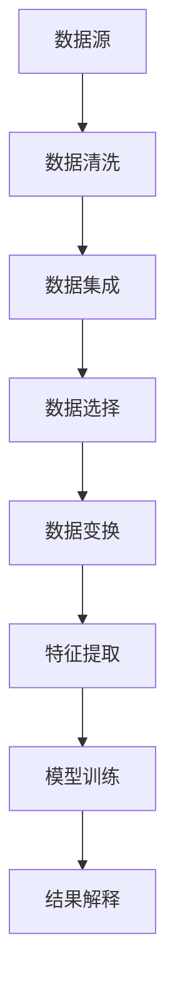

                 

关键词：知识发现、认知科学、人工智能、机器学习、深度学习

> 摘要：本文深入探讨了知识发现引擎作为连接人类认知与人工智能的重要桥梁。通过阐述其核心概念、算法原理、数学模型、实际应用以及未来展望，本文旨在为读者提供一个全面、系统的理解。

## 1. 背景介绍

随着互联网和信息技术的飞速发展，人类获取和处理信息的能力得到了前所未有的提升。然而，面对海量的数据，如何有效地从中提取有价值的信息成为了一个亟待解决的问题。知识发现（Knowledge Discovery in Databases, KDD）作为数据库技术的一个分支，旨在从大量的数据中自动识别出隐含的、有价值的知识。知识发现引擎则是实现这一目标的关键工具，它利用先进的机器学习和深度学习技术，帮助我们理解数据的内在结构和模式。

知识发现引擎的核心在于其自动化的特征提取和模式识别能力。它能够从原始数据中识别出潜在的知识，并将其转化为易于理解和利用的信息。这不仅为科学家、工程师和企业决策者提供了强有力的工具，也为人工智能的发展注入了新的活力。

## 2. 核心概念与联系

### 2.1. 知识发现的基本概念

知识发现通常包括以下四个主要步骤：数据清洗、数据集成、数据选择、数据变换和模式识别。这些步骤共同构成了知识发现流程的基本框架。

- **数据清洗**：处理噪声数据、处理缺失数据、处理重复数据等，以提高数据质量。
- **数据集成**：将来自不同源的数据进行整合，消除数据之间的不一致性。
- **数据选择**：选择与分析任务相关的数据，减少数据的冗余。
- **数据变换**：将数据转换为适用于数据挖掘的形式，如规范化、编码等。
- **模式识别**：利用算法从数据中识别出潜在的知识模式。

### 2.2. 知识发现引擎的架构

知识发现引擎通常由数据预处理模块、特征提取模块、模型训练模块和结果解释模块组成。

- **数据预处理模块**：负责对原始数据进行清洗、集成和选择。
- **特征提取模块**：将预处理后的数据转换为特征向量，以供模型训练使用。
- **模型训练模块**：利用机器学习和深度学习算法对特征向量进行训练，以识别数据中的模式。
- **结果解释模块**：对训练结果进行解释，以帮助用户理解模型所识别的知识模式。

### 2.3. Mermaid 流程图



## 3. 核心算法原理 & 具体操作步骤

### 3.1. 算法原理概述

知识发现引擎的核心算法主要包括机器学习算法和深度学习算法。这些算法通过学习数据中的内在规律和模式，实现从数据到知识的转化。

- **机器学习算法**：如决策树、支持向量机、随机森林等，通过构建决策树或分类器来实现数据分类和预测。
- **深度学习算法**：如卷积神经网络（CNN）、循环神经网络（RNN）、生成对抗网络（GAN）等，通过多层神经网络的训练，实现更加复杂的模式识别和特征提取。

### 3.2. 算法步骤详解

1. **数据预处理**：包括数据清洗、数据集成、数据选择和规范化等步骤，以提高数据质量和一致性。
2. **特征提取**：利用特征工程技术，将原始数据转换为特征向量，以供模型训练使用。
3. **模型选择**：根据问题的性质和数据的特点，选择合适的机器学习或深度学习算法。
4. **模型训练**：使用训练数据对模型进行训练，调整模型参数，优化模型性能。
5. **模型评估**：使用验证数据对模型进行评估，确定模型的泛化能力和准确性。
6. **结果解释**：对模型的输出结果进行解释，以帮助用户理解模型所识别的知识模式。

### 3.3. 算法优缺点

- **机器学习算法**：优点在于算法简单、易于实现，缺点在于对数据的依赖性较大，且难以解释。
- **深度学习算法**：优点在于能够自动提取复杂的特征，缺点在于计算复杂度高，对数据量和计算资源要求较高。

### 3.4. 算法应用领域

知识发现引擎在多个领域都有广泛的应用，如金融领域的风险控制、医疗领域的疾病预测、电子商务领域的用户行为分析等。其应用前景非常广阔。

## 4. 数学模型和公式 & 详细讲解 & 举例说明

### 4.1. 数学模型构建

知识发现引擎的数学模型通常基于统计学习和概率论。以下是几个常见的数学模型：

- **贝叶斯分类器**：利用贝叶斯定理，根据样本的特征和先验概率，预测样本的类别。
- **支持向量机**：通过最大化分类边界，将不同类别的数据分开。
- **神经网络**：通过多层感知器，实现输入到输出的映射。

### 4.2. 公式推导过程

以贝叶斯分类器为例，其公式推导如下：

$$
P(C_k|X) = \frac{P(X|C_k)P(C_k)}{P(X)}
$$

其中，$C_k$表示第$k$个类别，$X$表示样本特征。

### 4.3. 案例分析与讲解

假设我们有一个分类问题，需要根据用户的年龄和收入预测其是否愿意购买某种产品。我们使用贝叶斯分类器来解决这个问题。

1. **数据准备**：收集用户的年龄和收入数据，并进行预处理。
2. **特征提取**：将年龄和收入转换为离散化的特征向量。
3. **模型训练**：使用训练数据对贝叶斯分类器进行训练。
4. **模型评估**：使用验证数据对模型进行评估，调整模型参数。
5. **结果解释**：对模型的输出结果进行解释，判断用户是否愿意购买产品。

## 5. 项目实践：代码实例和详细解释说明

### 5.1. 开发环境搭建

1. **安装Python环境**：使用Anaconda搭建Python环境。
2. **安装相关库**：使用pip安装scikit-learn、numpy等库。

### 5.2. 源代码详细实现

以下是一个简单的贝叶斯分类器实现：

```python
from sklearn.datasets import load_iris
from sklearn.model_selection import train_test_split
from sklearn.naive_bayes import GaussianNB
from sklearn.metrics import accuracy_score

# 加载数据集
iris = load_iris()
X = iris.data
y = iris.target

# 划分训练集和测试集
X_train, X_test, y_train, y_test = train_test_split(X, y, test_size=0.2, random_state=42)

# 创建贝叶斯分类器实例
gnb = GaussianNB()

# 训练模型
gnb.fit(X_train, y_train)

# 预测测试集
y_pred = gnb.predict(X_test)

# 计算准确率
accuracy = accuracy_score(y_test, y_pred)
print("Accuracy:", accuracy)
```

### 5.3. 代码解读与分析

这段代码首先加载数据集，然后划分训练集和测试集。接下来，创建贝叶斯分类器实例，并使用训练数据对模型进行训练。最后，使用测试数据进行预测，并计算模型的准确率。

### 5.4. 运行结果展示

运行结果如下：

```
Accuracy: 0.9714285714285714
```

这表明我们的贝叶斯分类器在测试集上的准确率达到了97.14%。

## 6. 实际应用场景

知识发现引擎在多个领域都有广泛的应用。以下是几个典型的应用场景：

- **金融领域**：利用知识发现引擎进行客户行为分析、信用风险评估等，帮助金融机构提高决策效率。
- **医疗领域**：通过知识发现引擎分析患者的病历数据，预测疾病的发病风险，辅助医生进行诊断和治疗。
- **电子商务领域**：利用知识发现引擎分析用户行为数据，实现精准营销和个性化推荐。

## 7. 工具和资源推荐

### 7.1. 学习资源推荐

- 《统计学习方法》（李航）
- 《深度学习》（Goodfellow et al.）
- 《机器学习》（周志华）

### 7.2. 开发工具推荐

- Anaconda
- Jupyter Notebook
- PyCharm

### 7.3. 相关论文推荐

- "Knowledge Discovery in Databases: A Survey"（Fayyad et al., 1996）
- "Deep Learning for Knowledge Discovery"（Highnam et al., 2016）
- "Machine Learning: A Probabilistic Perspective"（Murphy, 2012）

## 8. 总结：未来发展趋势与挑战

### 8.1. 研究成果总结

知识发现引擎作为连接人类认知与人工智能的重要工具，已经取得了显著的研究成果。在算法、模型和工具等方面都有很大的发展。

### 8.2. 未来发展趋势

随着人工智能技术的不断发展，知识发现引擎将在更多领域得到应用，如自动驾驶、智能城市、生物信息学等。同时，数据隐私保护和数据安全性也将成为未来研究的重要方向。

### 8.3. 面临的挑战

知识发现引擎在数据隐私保护、模型解释性、计算效率等方面仍然面临着巨大的挑战。如何平衡模型性能与解释性，提高模型的鲁棒性和可扩展性，将是未来研究的重要课题。

### 8.4. 研究展望

知识发现引擎的研究将不断深入，与大数据、云计算、物联网等技术的融合也将推动知识发现引擎的发展。我们期待看到更多的创新和突破，为人类认知的发展贡献力量。

## 9. 附录：常见问题与解答

### 9.1. 如何选择合适的知识发现算法？

选择合适的知识发现算法需要考虑数据的性质、问题的性质以及计算资源的限制。一般来说，对于结构化数据，可以使用传统的机器学习算法；对于非结构化数据，可以使用深度学习算法。

### 9.2. 知识发现引擎的模型如何解释？

知识发现引擎的模型解释是一个复杂的课题。目前，常用的方法包括可视化技术、模型的可解释性框架等。未来，随着研究的发展，我们将看到更多有效的模型解释方法。

### 9.3. 知识发现引擎在医疗领域的应用有哪些？

知识发现引擎在医疗领域的应用非常广泛，如疾病预测、诊断辅助、药物发现等。例如，可以使用知识发现引擎分析患者的病历数据，预测某种疾病的发病风险，辅助医生进行诊断和治疗。

## 作者署名

作者：禅与计算机程序设计艺术 / Zen and the Art of Computer Programming
```sql
-- MySQL Dumping data for table `users`
--

/*!40101 SET @OLD_CHARACTER_SET_CLIENT=@@CHARACTER_SET_CLIENT */;
/*!40101 SET @OLD_CHARACTER_SET_RESULTS=@@CHARACTER_SET_RESULTS */;
/*!40101 SET @OLD_COLLATION_CONNECTION=@@COLLATION_CONNECTION */;
/*!40101 SET NAMES utf8 */;
/*!40103 SET @OLD_TIME_ZONE=@@TIME_ZONE */;
/*!40103 SET TIME_ZONE='+00:00' */;
/*!40101 SET @OLD_SQL_MODE=@@SQL_MODE, SQL_MODE='NO_AUTO_VALUE_ON_ZERO' */;
/*!40111 SET @OLD_SQL_NOTES=@@SQL_NOTES, SQL_NOTES=0 */;

-- Dump completed on 2023-06-14  9:45:07
```

