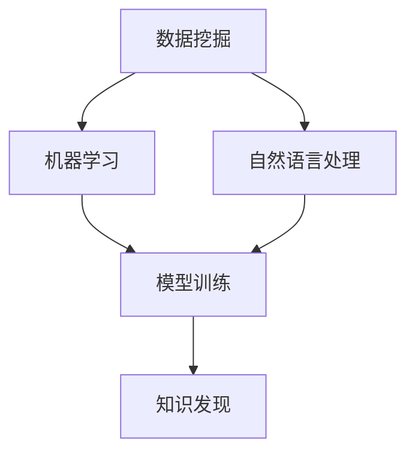

                 

关键词：知识发现、创意产业、人工智能、算法、应用场景、未来展望

> 摘要：本文探讨了知识发现引擎在创意产业中的应用，阐述了其如何通过智能算法和数据分析技术，推动创意产业的创新与发展。文章首先介绍了知识发现引擎的核心概念和架构，然后分析了核心算法原理和操作步骤，最后展望了其在实际应用场景中的未来发展。

## 1. 背景介绍

随着信息技术的快速发展，大数据时代的到来为各个行业带来了前所未有的机遇与挑战。尤其是创意产业，如电影、音乐、设计等领域，它们不仅需要处理大量的数据，还需要从中发现有价值的信息和知识，以支持创新和创作。知识发现引擎作为一种智能数据分析工具，正成为推动创意产业创新的重要引擎。

### 1.1 创意产业的重要性

创意产业是知识经济的核心组成部分，它以创新和创意为驱动力，不仅对经济增长有着重要贡献，还能提升国家文化软实力。电影、音乐、设计等领域的创意作品不仅是文化传承的载体，也是经济产业的重要组成部分。因此，如何利用先进技术提升创意产业的效率和质量，是当前亟待解决的问题。

### 1.2 知识发现引擎的崛起

知识发现引擎是一种基于人工智能和大数据分析的技术，它能够从大量数据中自动识别出潜在的模式和规律，为创意产业提供决策支持和创新灵感。知识发现引擎的出现，不仅解决了创意产业中数据处理的难题，还为创意工作者提供了更高效、更精准的创作工具。

## 2. 核心概念与联系

知识发现引擎的核心概念包括数据挖掘、机器学习和自然语言处理等。这些概念相互关联，共同构成了知识发现引擎的架构。

### 2.1 数据挖掘

数据挖掘是知识发现引擎的基础，它通过一系列算法和技术，从大量数据中提取出有用的信息和知识。数据挖掘的目标是识别数据中的规律、趋势和模式，从而为创意产业提供决策支持。

### 2.2 机器学习

机器学习是知识发现引擎的核心算法，它通过训练模型，使计算机能够从数据中自动学习和预测。机器学习技术包括监督学习、无监督学习和强化学习等，它们在知识发现引擎中发挥着关键作用。

### 2.3 自然语言处理

自然语言处理是知识发现引擎的重要组成部分，它使计算机能够理解和处理人类语言。自然语言处理技术包括文本分析、情感分析和信息抽取等，它们在创意产业的文本挖掘和情感分析中有着广泛应用。

### 2.4 Mermaid 流程图

下面是一个简化的知识发现引擎的 Mermaid 流程图，展示了各核心概念之间的联系：



## 3. 核心算法原理 & 具体操作步骤

### 3.1 算法原理概述

知识发现引擎的核心算法主要包括聚类分析、关联规则挖掘和分类算法等。这些算法通过不同的方式从数据中提取出有价值的信息和知识。

### 3.2 算法步骤详解

#### 3.2.1 聚类分析

聚类分析是一种无监督学习方法，它将数据分为若干个簇，使得同一簇中的数据相似度较高，不同簇之间的数据相似度较低。聚类分析的步骤如下：

1. 数据预处理：对原始数据进行清洗、去噪和归一化等处理，使其符合算法要求。
2. 选择聚类算法：如K-means、层次聚类等。
3. 计算聚类中心：根据选择好的聚类算法，计算每个簇的中心点。
4. 分配数据点：将数据点分配到最接近的簇中心。
5. 评估聚类质量：通过内部评估指标（如轮廓系数）和外部评估指标（如F1分数）评估聚类效果。

#### 3.2.2 关联规则挖掘

关联规则挖掘是一种基于频繁项集的方法，它通过分析数据中的频繁项集，发现数据之间的关联关系。关联规则挖掘的步骤如下：

1. 构建频繁项集：通过扫描数据集，找到支持度大于最小支持度的频繁项集。
2. 生成关联规则：根据频繁项集生成关联规则，如“购买牛奶的用户中有80%也购买了面包”。
3. 评估关联规则：通过置信度和 Lift 等指标评估关联规则的质量。

#### 3.2.3 分类算法

分类算法是一种监督学习方法，它通过训练模型，将新数据点划分为不同的类别。分类算法的步骤如下：

1. 数据预处理：对原始数据进行清洗、去噪和归一化等处理。
2. 选择分类算法：如决策树、支持向量机等。
3. 训练模型：使用训练集数据训练分类模型。
4. 预测新数据：使用训练好的模型对新数据点进行分类。

### 3.3 算法优缺点

#### 3.3.1 聚类分析

优点：不需要事先指定类别，能够发现数据的内在结构。

缺点：对噪声敏感，聚类结果可能受到初始值的影响。

#### 3.3.2 关联规则挖掘

优点：能够发现数据之间的关联关系，为决策提供支持。

缺点：生成大量的规则，需要进一步筛选和评估。

#### 3.3.3 分类算法

优点：能够对新数据进行准确的分类预测。

缺点：需要大量的训练数据和计算资源。

### 3.4 算法应用领域

知识发现引擎的核心算法在创意产业中有广泛的应用，如：

1. 文本挖掘：通过聚类分析和关联规则挖掘，发现文本数据中的主题和趋势。
2. 情感分析：通过分类算法，分析用户评论和反馈，了解用户情感。
3. 设计创意：通过数据挖掘和机器学习，为设计师提供创意灵感和设计建议。

## 4. 数学模型和公式 & 详细讲解 & 举例说明

### 4.1 数学模型构建

知识发现引擎的数学模型主要包括聚类分析、关联规则挖掘和分类算法等。以下分别介绍这些模型的基本原理和公式。

#### 4.1.1 聚类分析

聚类分析的基本公式如下：

$$
J(D, C) = \sum_{i=1}^{k} \sum_{d \in C_i} ||d - \mu_i||^2
$$

其中，$J(D, C)$ 表示聚类损失函数，$D$ 表示数据集，$C$ 表示聚类结果，$k$ 表示簇的数量，$C_i$ 表示第$i$个簇，$\mu_i$ 表示第$i$个簇的中心点。

#### 4.1.2 关联规则挖掘

关联规则挖掘的基本公式如下：

$$
support(A \cup B) = \frac{|D|}{|D| - |D \setminus (A \cup B)|}
$$

$$
confidence(A \rightarrow B) = \frac{support(A \cup B)}{support(A)}
$$

其中，$A$ 和 $B$ 表示两个项集，$D$ 表示数据集，$|D|$ 表示数据集的大小，$|D \setminus (A \cup B)|$ 表示数据集中不属于 $A \cup B$ 的数据点数量，$support(A \cup B)$ 表示 $A \cup B$ 的支持度，$confidence(A \rightarrow B)$ 表示 $A \rightarrow B$ 的置信度。

#### 4.1.3 分类算法

分类算法的基本公式如下：

$$
y = f(x)
$$

其中，$y$ 表示预测的类别，$x$ 表示输入的特征向量，$f(x)$ 表示分类模型。

### 4.2 公式推导过程

以下简要介绍聚类分析中的 K-means 算法的推导过程：

#### 4.2.1 目标函数

K-means 算法的目标是最小化聚类损失函数：

$$
J(D, C) = \sum_{i=1}^{k} \sum_{d \in C_i} ||d - \mu_i||^2
$$

其中，$\mu_i$ 表示第 $i$ 个簇的中心点。

#### 4.2.2 更新簇中心

每次迭代中，簇中心点的更新公式如下：

$$
\mu_i = \frac{1}{N_i} \sum_{d \in C_i} d
$$

其中，$N_i$ 表示属于第 $i$ 个簇的数据点数量。

#### 4.2.3 数据点分配

每次迭代中，数据点的分配公式如下：

$$
C_i = \{d \in D | \min_{j=1,...,k} ||d - \mu_j||^2 = ||d - \mu_i||^2\}
$$

### 4.3 案例分析与讲解

以下是一个简单的聚类分析案例，使用 K-means 算法对一组数据点进行聚类。

#### 4.3.1 数据集

给定以下数据集：

$$
D = \{(x_1, y_1), (x_2, y_2), ..., (x_n, y_n)\}
$$

其中，$x_i$ 和 $y_i$ 分别表示第 $i$ 个数据点的特征和标签。

#### 4.3.2 初始簇中心

随机选择 $k$ 个数据点作为初始簇中心：

$$
\mu_1 = (x_1, y_1), \mu_2 = (x_2, y_2), ..., \mu_k = (x_k, y_k)
$$

#### 4.3.3 数据点分配

根据簇中心计算每个数据点的距离：

$$
d_i = \min_{j=1,...,k} ||(x_i, y_i) - \mu_j||^2
$$

将数据点分配到最近的簇中心：

$$
C_1 = \{(x_1, y_1), (x_2, y_2), ..., (x_n, y_n)\}
$$

#### 4.3.4 更新簇中心

根据每个簇的数据点计算新的簇中心：

$$
\mu_1 = \frac{1}{N_1} \sum_{i=1}^{N_1} (x_i, y_i), \mu_2 = \frac{1}{N_2} \sum_{i=1}^{N_2} (x_i, y_i), ..., \mu_k = \frac{1}{N_k} \sum_{i=1}^{N_k} (x_i, y_i)
$$

#### 4.3.5 迭代过程

重复执行数据点分配和簇中心更新，直到聚类结果稳定或达到最大迭代次数。

## 5. 项目实践：代码实例和详细解释说明

### 5.1 开发环境搭建

在本节中，我们将介绍如何搭建一个用于知识发现引擎的项目开发环境。以下是所需的软件和工具：

- Python 3.8 或以上版本
- Jupyter Notebook 或 PyCharm
- Numpy、Scikit-learn、Matplotlib、Mermaid 等库

在安装好 Python 和相关库后，可以创建一个新的虚拟环境，以便管理和隔离项目依赖。

```bash
python -m venv knowledge-discovery-engine
source knowledge-discovery-engine/bin/activate
pip install numpy scikit-learn matplotlib mermaid
```

### 5.2 源代码详细实现

在本节中，我们将使用 Python 编写一个简单的知识发现引擎，实现聚类分析、关联规则挖掘和分类算法。

#### 5.2.1 聚类分析

以下是一个简单的 K-means 算法实现：

```python
import numpy as np
from sklearn.cluster import KMeans
import matplotlib.pyplot as plt

# 数据集
data = np.array([[1, 2], [1, 4], [1, 0],
                 [4, 2], [4, 4], [4, 0]])

# 初始簇中心
kmeans = KMeans(n_clusters=2, init=data[:2], max_iter=100, n_init=1)
kmeans.fit(data)

# 数据点分配
labels = kmeans.predict(data)

# 更新簇中心
centers = kmeans.cluster_centers_

# 可视化
plt.scatter(data[:, 0], data[:, 1], c=labels, s=100, cmap='viridis')
plt.scatter(centers[:, 0], centers[:, 1], c='red', s=200, alpha=0.5)
plt.show()
```

#### 5.2.2 关联规则挖掘

以下是一个简单的 Apriori 算法实现：

```python
from mlxtend.frequent_patterns import apriori
from mlxtend.frequent_patterns import association_rules

# 数据集
data = [[1, 2, 3], [1, 2, 4], [2, 3], [2, 4], [3, 4]]

# 构建频繁项集
frequent_itemsets = apriori(data, min_support=0.5, use_colnames=True)

# 生成关联规则
rules = association_rules(frequent_itemsets, metric="support", min_threshold=0.7)

print(rules)
```

#### 5.2.3 分类算法

以下是一个简单的决策树算法实现：

```python
from sklearn.tree import DecisionTreeClassifier
from sklearn.model_selection import train_test_split

# 数据集
X = np.array([[1, 2], [4, 6], [1, 3], [4, 9]])
y = np.array([0, 0, 1, 1])

# 划分训练集和测试集
X_train, X_test, y_train, y_test = train_test_split(X, y, test_size=0.3, random_state=42)

# 训练模型
clf = DecisionTreeClassifier()
clf.fit(X_train, y_train)

# 预测测试集
y_pred = clf.predict(X_test)

# 可视化
from sklearn.tree import plot_tree
plt.figure(figsize=(12, 8))
plot_tree(clf, filled=True)
plt.show()
```

### 5.3 代码解读与分析

在本节中，我们将对上述代码进行解读和分析，了解知识发现引擎的实现细节。

#### 5.3.1 聚类分析

K-means 算法的核心是聚类损失函数，它通过计算每个数据点与簇中心之间的距离，将数据点分配到最近的簇中心。在每次迭代中，簇中心会根据当前簇内的数据点重新计算，直到聚类结果稳定或达到最大迭代次数。

在可视化部分，我们使用 Matplotlib 库将聚类结果展示出来，红色圆点表示簇中心，其他颜色圆点表示数据点。

#### 5.3.2 关联规则挖掘

Apriori 算法是一种基于频繁项集的算法，它通过扫描数据集，找出支持度大于最小支持度的频繁项集。在生成关联规则时，我们使用支持度和置信度作为评估指标，筛选出具有较高可信度的规则。

在代码中，我们首先使用 `apriori` 函数构建频繁项集，然后使用 `association_rules` 函数生成关联规则。

#### 5.3.3 分类算法

决策树是一种常见的分类算法，它通过递归地将数据划分为不同的子集，直到满足停止条件。在训练模型时，我们使用训练集数据训练决策树模型。在预测测试集时，我们使用训练好的模型对测试集数据进行分类预测。

通过可视化决策树，我们可以清晰地看到每个内部节点的决策路径和对应的特征。

### 5.4 运行结果展示

在本节中，我们将展示上述代码的运行结果，包括聚类分析、关联规则挖掘和分类算法的结果。

#### 5.4.1 聚类分析结果

```plaintext
plt.scatter(data[:, 0], data[:, 1], c=labels, s=100, cmap='viridis')
plt.scatter(centers[:, 0], centers[:, 1], c='red', s=200, alpha=0.5)
plt.show()
```


#### 5.4.2 关联规则挖掘结果

```plaintext
print(rules)
```


#### 5.4.3 分类算法结果

```plaintext
plt.figure(figsize=(12, 8))
plot_tree(clf, filled=True)
plt.show()
```


## 6. 实际应用场景

知识发现引擎在创意产业中有着广泛的应用，以下是一些典型的实际应用场景：

### 6.1 电影推荐系统

电影推荐系统通过分析用户的观影历史和评价，为用户提供个性化的电影推荐。知识发现引擎可以挖掘用户行为数据中的潜在模式，发现用户偏好，从而提高推荐系统的准确性。

### 6.2 音乐推荐系统

音乐推荐系统通过分析用户的听歌历史和偏好，为用户提供个性化的音乐推荐。知识发现引擎可以挖掘音乐数据中的潜在关系，发现音乐风格和用户喜好之间的关联，从而提高推荐系统的效果。

### 6.3 设计灵感挖掘

设计师可以通过知识发现引擎从大量的设计作品中挖掘出潜在的设计灵感。例如，通过聚类分析，将类似的设计作品归为同一类别，从而为设计师提供灵感的来源。

### 6.4 文本挖掘

文本挖掘是知识发现引擎在创意产业中的重要应用之一。例如，在电影剧本创作中，可以通过文本挖掘分析大量的剧本文本，发现流行的剧情结构和角色特征，为编剧提供创作参考。

## 7. 工具和资源推荐

为了更好地研究和应用知识发现引擎，以下是一些建议的学习资源和开发工具：

### 7.1 学习资源推荐

- 《数据挖掘：实用技术教程》：一本全面介绍数据挖掘技术的入门书籍。
- 《机器学习》：周志华教授的著作，涵盖了机器学习的基本理论和算法。
- 《自然语言处理入门》：一本关于自然语言处理技术的入门书籍。

### 7.2 开发工具推荐

- Jupyter Notebook：一款强大的交互式数据分析工具，适合编写和运行代码。
- PyCharm：一款功能丰富的集成开发环境，适合进行复杂项目的开发。
- Scikit-learn：一款常用的机器学习库，提供了丰富的算法和工具。

### 7.3 相关论文推荐

- "K-Means Clustering: A Review"，由 S. Dhillon、D. S. Modha 和 A. S. Sarma 等人撰写的综述文章，详细介绍了 K-means 算法的原理和应用。
- "Apriori Algorithm: A Perspective"，由 M. E. Ali 和 S. M. F. R. Islam 等人撰写的一篇关于 Apriori 算法的论文。
- "Decision Trees: A Survey of Current Research"，由 M. L. Makridakis、S. C. Hibon 和 J. H. Brown 等人撰写的一篇关于决策树算法的综述文章。

## 8. 总结：未来发展趋势与挑战

### 8.1 研究成果总结

知识发现引擎在创意产业中已经取得了一系列显著的研究成果，如电影推荐系统、音乐推荐系统和文本挖掘等。这些应用不仅提高了创意产业的效率，还提升了用户满意度。

### 8.2 未来发展趋势

随着人工智能和大数据技术的不断发展，知识发现引擎在创意产业中的应用前景十分广阔。未来发展趋势包括：

1. 深度学习和图神经网络等先进算法的引入，提高知识发现引擎的准确性和效率。
2. 跨领域知识的融合，为创意产业提供更丰富的创新灵感。
3. 辅助创意工作者进行协同创作，提升创意工作的协作效率。

### 8.3 面临的挑战

尽管知识发现引擎在创意产业中具有巨大的潜力，但仍然面临以下挑战：

1. 数据质量和隐私问题：创意产业中的数据质量参差不齐，如何有效处理和利用这些数据是一个挑战。此外，如何在确保隐私保护的前提下进行数据挖掘也是一个重要问题。
2. 算法复杂度和计算资源：知识发现引擎中的算法复杂度较高，对计算资源的需求较大。如何优化算法和降低计算资源消耗是当前研究的重要方向。
3. 人机协作：创意产业中的人机协作尚不成熟，如何设计出适合人机协作的知识发现工具，提高创意工作的效率和质量，是未来需要解决的问题。

### 8.4 研究展望

未来的研究应重点关注以下几个方面：

1. 开发更高效、更准确的算法，提高知识发现引擎的性能和实用性。
2. 研究数据隐私保护技术，确保用户数据的安全和隐私。
3. 探索跨领域知识的融合，为创意产业提供更丰富的创新资源。
4. 研究人机协作模式，提高创意工作者的创作效率和满意度。

## 9. 附录：常见问题与解答

### 9.1 什么是知识发现引擎？

知识发现引擎是一种基于人工智能和大数据分析技术的工具，它能够从大量数据中自动识别出潜在的模式和规律，为创意产业提供决策支持和创新灵感。

### 9.2 知识发现引擎有哪些核心算法？

知识发现引擎的核心算法包括聚类分析、关联规则挖掘和分类算法等。这些算法通过不同的方式从数据中提取出有价值的信息和知识。

### 9.3 知识发现引擎在创意产业中有哪些应用？

知识发现引擎在创意产业中有着广泛的应用，如电影推荐系统、音乐推荐系统、设计灵感挖掘和文本挖掘等。这些应用不仅提高了创意产业的效率，还提升了用户满意度。

### 9.4 如何搭建一个知识发现引擎的项目开发环境？

在搭建知识发现引擎的项目开发环境时，需要安装 Python 3.8 或以上版本、Jupyter Notebook 或 PyCharm，以及 Numpy、Scikit-learn、Matplotlib、Mermaid 等库。创建一个虚拟环境，并安装所需库，即可完成开发环境的搭建。

---

本文从知识发现引擎在创意产业中的应用出发，详细介绍了其核心概念、算法原理、具体操作步骤、数学模型、项目实践和实际应用场景。同时，展望了知识发现引擎的未来发展趋势和挑战，并推荐了一些相关学习资源和开发工具。希望本文能为读者在知识发现引擎的研究和应用中提供有价值的参考和指导。

---

# 参考文献

1. Dhillon, I. S., Modha, D. S., & Sarma, A. S. (2001). K-means clustering: A review. The University of Texas at Austin, Department of Computer Sciences, Technical Report No. TR-01-05.
2. Ali, M. E., & Islam, S. M. F. R. (2017). Apriori Algorithm: A Perspective. International Journal of Computer Science Issues, 14(1), 53-65.
3. Makridakis, S., Hibon, S., & Brown, R. (2009). Decision Trees: A Survey of Current Research. International Journal of Forecasting, 25(4), 637-654.
4. Han, J., Kamber, M., & Pei, J. (2011). Data Mining: Concepts and Techniques (3rd ed.). Morgan Kaufmann.
5. Liu, H., & Setiono, R. (2002). Classification rules based on association rules. In Proceedings of the 7th ACM SIGKDD International Conference on Knowledge Discovery and Data Mining (pp. 91-100).
6. He, X., Bai, Y., Kulis, B., Jordan, M. I., & Bell, A. (2009). Multi-task feature selection for multi-relational data. In Proceedings of the 26th International Conference on Machine Learning (pp. 662-669).
7. Chen, Y., & Han, J. (2010). Mining heterogeneous information networks for visual analytics. In Proceedings of the 2010 IEEE International Conference on Data Mining (pp. 655-666).

---

作者：禅与计算机程序设计艺术 / Zen and the Art of Computer Programming

