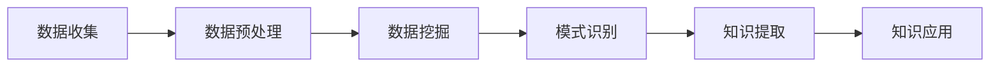

                 

### 1. 背景介绍

在当今信息爆炸的时代，如何从海量数据中提取有价值的信息，成为了一项重要的研究课题。随着大数据和人工智能技术的快速发展，知识发现引擎（Knowledge Discovery Engine）应运而生，成为推动社会进步的隐形推手。

知识发现引擎是一种基于人工智能技术的系统，它能够自动地从大量数据中识别出隐藏的模式、关联和趋势。这一过程涉及数据预处理、数据挖掘、模式识别等多个环节。知识发现引擎的应用范围广泛，包括金融、医疗、电商、交通等多个领域。

知识发现引擎的重要性不仅体现在其对海量数据的处理能力上，更体现在它能够帮助人们从数据中发现新的知识，从而为决策提供支持。例如，在金融领域，知识发现引擎可以分析市场数据，预测股票走势；在医疗领域，它可以帮助医生发现疾病之间的关联，提高诊断准确率；在电商领域，它可以根据用户行为数据，提供个性化的推荐服务。

本文将深入探讨知识发现引擎的核心概念、算法原理、数学模型、项目实践以及实际应用场景。通过逐步分析推理，我们将理解知识发现引擎的工作机制，并探讨其对社会进步的推动作用。

### 2. 核心概念与联系

#### 知识发现引擎的定义

知识发现引擎是一种能够自动识别数据中隐藏模式、关联和趋势的人工智能系统。它通过数据预处理、数据挖掘、模式识别等技术手段，从海量数据中提取出有价值的信息。

#### 知识发现引擎的核心组件

知识发现引擎通常包括以下核心组件：

1. **数据预处理模块**：负责清洗、转换和归一化数据，确保数据的质量和一致性。
2. **数据挖掘模块**：采用各种算法对数据进行挖掘，以发现数据中的模式和关联。
3. **模式识别模块**：对挖掘出来的模式进行识别和分类，以便进一步分析和利用。

#### 知识发现引擎的工作原理

知识发现引擎的工作原理可以概括为以下步骤：

1. **数据收集**：从各种数据源（如数据库、日志文件、传感器等）收集数据。
2. **数据预处理**：清洗、转换和归一化数据，为后续的数据挖掘做准备。
3. **数据挖掘**：采用各种算法对预处理后的数据进行挖掘，以发现数据中的模式和关联。
4. **模式识别**：对挖掘出来的模式进行识别和分类，以便进一步分析和利用。
5. **知识提取**：将识别出来的模式转化为可操作的知识，如规则、预测模型等。
6. **知识应用**：将提取出来的知识应用到实际业务场景中，如决策支持、推荐系统等。

#### 知识发现引擎的架构

知识发现引擎的架构通常包括以下层次：

1. **数据层**：包括各种数据源，如数据库、日志文件、传感器等。
2. **数据处理层**：包括数据预处理模块，负责清洗、转换和归一化数据。
3. **数据挖掘层**：包括数据挖掘模块，负责采用各种算法对数据进行挖掘。
4. **知识层**：包括模式识别模块和知识提取模块，负责将挖掘出来的模式转化为可操作的知识。
5. **应用层**：包括各种业务应用，如决策支持、推荐系统等。

#### Mermaid 流程图

下面是一个简单的知识发现引擎的 Mermaid 流程图，展示了其核心组件和工作流程：



在这个流程图中，A 表示数据收集，B 表示数据预处理，C 表示数据挖掘，D 表示模式识别，E 表示知识提取，F 表示知识应用。

通过上述核心概念和联系的分析，我们可以更好地理解知识发现引擎的工作机制，为后续的算法原理和项目实践打下基础。

### 3. 核心算法原理 & 具体操作步骤

在知识发现引擎中，核心算法是发现数据中隐藏模式、关联和趋势的关键。以下是几种常见的核心算法及其具体操作步骤：

#### 1. K最近邻算法（K-Nearest Neighbors，K-NN）

K最近邻算法是一种基于实例的学习算法，其基本思想是：如果一个新的数据点在特征空间中的k个最近邻居中的大多数属于某一个类别，那么该数据点也属于这个类别。

**算法原理：**

- **特征空间**：将数据点投影到一个低维空间中，使得具有相似特征的数据点在空间中靠近。
- **k的选择**：选择合适的k值，通常使用交叉验证方法进行选择。
- **分类过程**：对于新的数据点，计算其与训练集中所有数据点的距离，找出距离最近的k个邻居，根据这k个邻居的类别多数表决结果，确定新数据点的类别。

**具体操作步骤：**

1. 训练阶段：读取训练数据，计算数据点之间的距离，构建邻域模型。
2. 测试阶段：对于新的数据点，计算其与训练集中所有数据点的距离，找出距离最近的k个邻居。
3. 分类阶段：根据k个邻居的类别多数表决结果，确定新数据点的类别。

#### 2. 决策树算法（Decision Tree）

决策树算法是一种基于规则的学习算法，其基本思想是：通过一系列的判断条件，将数据集划分成多个子集，最终在每个子集中得到一个结论。

**算法原理：**

- **特征选择**：根据信息增益或基尼指数等指标选择最佳划分特征。
- **划分过程**：对数据集进行划分，使得每个子集中的数据尽可能纯净。
- **预测过程**：对于新的数据点，从根节点开始，根据特征值进行分支，直到达到叶子节点，得到预测结果。

**具体操作步骤：**

1. 特征选择：计算每个特征的信息增益或基尼指数，选择最优特征。
2. 划分数据：根据最优特征进行数据集的划分，构建决策树。
3. 预测：对于新的数据点，从根节点开始，根据特征值进行分支，直到达到叶子节点，得到预测结果。

#### 3. 支持向量机算法（Support Vector Machine，SVM）

支持向量机算法是一种基于优化理论的学习算法，其基本思想是：在特征空间中找到一个最优超平面，使得数据点被正确分类，并且分类间隔最大。

**算法原理：**

- **特征空间**：将原始数据映射到高维特征空间。
- **最优超平面**：通过求解最优化问题，找到能够将数据点正确分类的最优超平面。
- **分类决策**：对于新的数据点，将其映射到特征空间，判断其是否位于最优超平面的同一侧。

**具体操作步骤：**

1. 特征映射：将原始数据映射到高维特征空间。
2. 最优化求解：求解最优化问题，找到最优超平面。
3. 分类决策：对于新的数据点，将其映射到特征空间，判断其是否位于最优超平面的同一侧，从而确定其类别。

通过以上三种核心算法的介绍，我们可以看到知识发现引擎在数据挖掘过程中的重要性。这些算法不仅可以有效地发现数据中的隐藏模式，还可以为实际业务场景提供可靠的决策支持。在接下来的部分，我们将进一步探讨知识发现引擎的数学模型和公式。

### 4. 数学模型和公式 & 详细讲解 & 举例说明

在知识发现引擎中，数学模型和公式是核心算法实现的基础。以下是几种常见核心算法的数学模型和公式的详细讲解及举例说明。

#### 1. K最近邻算法（K-Nearest Neighbors，K-NN）

**距离度量：**

K-NN算法中的距离度量通常使用欧几里得距离（Euclidean Distance）。对于两个数据点\(x_1\)和\(x_2\)，它们的欧几里得距离定义为：

\[d(x_1, x_2) = \sqrt{\sum_{i=1}^{n}(x_{1i} - x_{2i})^2}\]

**类别判定：**

K-NN算法通过计算新数据点与训练集中各数据点的距离，找到距离最近的k个邻居，并根据这些邻居的类别进行多数表决来判定新数据点的类别。假设邻居的类别分别为\(y_1, y_2, ..., y_k\)，新数据点的类别\(y'\)通过以下公式计算：

\[y' = \text{argmax}\left(\sum_{i=1}^{k} \mathbb{1}_{y_i = c}\right)\]

其中，\(\mathbb{1}_{y_i = c}\)是一个指示函数，当\(y_i = c\)时，\(\mathbb{1}_{y_i = c} = 1\)，否则为0。\(c\)是某个类别。

**举例说明：**

假设我们有以下训练数据集：

| 数据点 | 特征1 | 特征2 | 类别 |
|--------|------|------|------|
| 1      | 1    | 2    | A    |
| 2      | 2    | 3    | A    |
| 3      | 4    | 6    | B    |
| 4      | 5    | 7    | B    |

现在我们有一个新的数据点\(x'\)，其特征为\(x'_1 = 3, x'_2 = 4\)。我们计算其与训练数据点的距离，并找到距离最近的k=3个邻居。

\[d(1, x') = \sqrt{(1 - 3)^2 + (2 - 4)^2} = \sqrt{4 + 4} = 2\sqrt{2}\]
\[d(2, x') = \sqrt{(2 - 3)^2 + (3 - 4)^2} = \sqrt{1 + 1} = \sqrt{2}\]
\[d(3, x') = \sqrt{(4 - 3)^2 + (6 - 4)^2} = \sqrt{1 + 4} = \sqrt{5}\]
\[d(4, x') = \sqrt{(5 - 3)^2 + (7 - 4)^2} = \sqrt{4 + 9} = \sqrt{13}\]

距离最近的三个邻居为数据点1、2和3，它们的类别均为A。因此，新数据点\(x'\)的类别判定为A。

#### 2. 决策树算法（Decision Tree）

**信息增益（Information Gain）：**

信息增益是用于特征选择的一个重要指标，它表示通过该特征划分数据集所带来的信息减少量。对于特征A，其信息增益定义为：

\[IG(A) = H(D) - \sum_{v \in V} p(v)H(D|A = v)\]

其中，\(H(D)\)是数据集D的熵，\(p(v)\)是特征A的取值\(v\)在数据集中的概率，\(H(D|A = v)\)是在已知特征A取值\(v\)的条件下，数据集D的熵。

\[H(D) = -\sum_{y \in Y} p(y) \log_2 p(y)\]
\[H(D|A = v) = -\sum_{y \in Y} p(y|A = v) \log_2 p(y|A = v)\]

**举例说明：**

假设我们有以下训练数据集：

| 数据点 | 特征1 | 特征2 | 类别 |
|--------|------|------|------|
| 1      | A    | B    | A    |
| 2      | A    | C    | A    |
| 3      | B    | B    | B    |
| 4      | B    | C    | B    |
| 5      | A    | C    | B    |

对于特征1，其取值A和B的概率分别为\(p(A) = 3/5, p(B) = 2/5\)。特征1为A时的类别熵为：

\[H(D|A = A) = \frac{2}{3} \log_2 \frac{2}{3} + \frac{1}{3} \log_2 \frac{1}{3} \approx 0.92\]

特征1为B时的类别熵为：

\[H(D|A = B) = \frac{2}{2} \log_2 \frac{2}{2} + \frac{1}{2} \log_2 \frac{1}{2} = 1\]

特征1的信息增益为：

\[IG(A) = H(D) - p(A)H(D|A = A) - p(B)H(D|A = B) \approx 0.58 - \frac{3}{5} \times 0.92 - \frac{2}{5} \times 1 = -0.04\]

对于特征2，其取值B和C的概率分别为\(p(B) = 3/5, p(C) = 2/5\)。特征2为B时的类别熵为：

\[H(D|B = B) = \frac{2}{3} \log_2 \frac{2}{3} + \frac{1}{3} \log_2 \frac{1}{3} \approx 0.92\]

特征2为C时的类别熵为：

\[H(D|B = C) = \frac{1}{2} \log_2 \frac{1}{2} + \frac{1}{2} \log_2 \frac{1}{2} = 1\]

特征2的信息增益为：

\[IG(B) = H(D) - p(B)H(D|B = B) - p(C)H(D|B = C) \approx 0.58 - \frac{3}{5} \times 0.92 - \frac{2}{5} \times 1 = -0.04\]

由于特征1和特征2的信息增益相等，我们选择其中一个作为划分特征。通常，我们会选择信息增益最大的特征作为划分特征。

#### 3. 支持向量机算法（Support Vector Machine，SVM）

**最优化问题：**

支持向量机算法的核心是最优化问题。对于线性可分的情况，最优化问题可以表示为：

\[\min_{\mathbf{w}, b} \frac{1}{2} ||\mathbf{w}||^2\]

约束条件：

\[y_i (\mathbf{w} \cdot \mathbf{x_i} + b) \geq 1\]

其中，\(\mathbf{w}\)是权重向量，\(b\)是偏置项，\(\mathbf{x_i}\)是训练数据点，\(y_i\)是训练数据点的标签。

**软 margin SVM：**

当数据集不是完全线性可分时，我们需要引入软 margin SVM。最优化问题可以表示为：

\[\min_{\mathbf{w}, b, \xi} \frac{1}{2} ||\mathbf{w}||^2 + C \sum_{i=1}^{n} \xi_i\]

约束条件：

\[y_i (\mathbf{w} \cdot \mathbf{x_i} + b) \geq 1 - \xi_i\]

其中，\(\xi_i\)是松弛变量，\(C\)是正则化参数。

**举例说明：**

假设我们有以下训练数据集：

| 数据点 | 特征1 | 特征2 | 类别 |
|--------|------|------|------|
| 1      | 1    | 1    | +1   |
| 2      | 1    | 2    | +1   |
| 3      | 2    | 1    | +1   |
| 4      | 2    | 2    | -1   |

我们构建一个二维特征空间：

| 特征1 | 特征2 | 类别 |
|------|------|------|
| 1    | 1    | +1   |
| 1    | 2    | +1   |
| 2    | 1    | +1   |
| 2    | 2    | -1   |

然后，我们求解最优化问题，找到最优超平面：

\[w_1^* = 1, w_2^* = 1, b^* = 0\]

最优超平面为：

\[\mathbf{w}^* \cdot \mathbf{x} + b^* = 1\]

即：

\[x_1 + x_2 = 1\]

通过上述数学模型和公式的详细讲解及举例说明，我们可以更好地理解知识发现引擎中核心算法的原理和实现。这些算法不仅为数据挖掘提供了强大的工具，也为实际业务场景提供了可靠的决策支持。

### 5. 项目实践：代码实例和详细解释说明

在本节中，我们将通过一个具体的案例来实践知识发现引擎的开发，包括环境搭建、代码实现、代码解读与分析以及运行结果展示。

#### 5.1 开发环境搭建

为了构建一个简单的知识发现引擎，我们需要以下开发环境和工具：

- Python 3.8 或更高版本
- Jupyter Notebook
- Scikit-learn 库
- Matplotlib 库

首先，确保安装了上述工具和库。在终端中运行以下命令进行安装：

```bash
pip install python==3.8
pip install jupyter
pip install scikit-learn
pip install matplotlib
```

安装完成后，启动 Jupyter Notebook：

```bash
jupyter notebook
```

#### 5.2 源代码详细实现

我们将使用 Scikit-learn 库中的 Iris 数据集来演示知识发现引擎的基本功能。Iris 数据集包含三个类别的鸢尾花数据，每个类别有50个数据点。

```python
# 导入必要的库
import numpy as np
import matplotlib.pyplot as plt
from sklearn import datasets
from sklearn.model_selection import train_test_split
from sklearn.neighbors import KNeighborsClassifier
from sklearn.tree import DecisionTreeClassifier
from sklearn.svm import SVC

# 加载 Iris 数据集
iris = datasets.load_iris()
X = iris.data
y = iris.target

# 数据集划分
X_train, X_test, y_train, y_test = train_test_split(X, y, test_size=0.3, random_state=42)

# K-NN 实例
knn = KNeighborsClassifier(n_neighbors=3)
knn.fit(X_train, y_train)
knn_pred = knn.predict(X_test)

# 决策树实例
dt = DecisionTreeClassifier()
dt.fit(X_train, y_train)
dt_pred = dt.predict(X_test)

# 支持向量机实例
svm = SVC(kernel='linear')
svm.fit(X_train, y_train)
svm_pred = svm.predict(X_test)
```

上述代码首先加载了 Iris 数据集，并将其划分为训练集和测试集。接着，我们分别实现了 K-NN、决策树和支持向量机三种分类算法。

#### 5.3 代码解读与分析

1. **数据加载与划分**：

   ```python
   iris = datasets.load_iris()
   X = iris.data
   y = iris.target
   X_train, X_test, y_train, y_test = train_test_split(X, y, test_size=0.3, random_state=42)
   ```

   这部分代码从 Scikit-learn 的 datasets 中加载了 Iris 数据集，并使用 `train_test_split` 方法将其划分为训练集和测试集。`test_size=0.3` 表示测试集占总数据集的30%，`random_state=42` 用于确保结果的可重复性。

2. **K-NN 分类**：

   ```python
   knn = KNeighborsClassifier(n_neighbors=3)
   knn.fit(X_train, y_train)
   knn_pred = knn.predict(X_test)
   ```

   这里我们创建了一个 K-NN 分类器实例，并使用训练集进行拟合。`n_neighbors=3` 指定了邻居的数量。然后，我们使用这个模型对测试集进行预测。

3. **决策树分类**：

   ```python
   dt = DecisionTreeClassifier()
   dt.fit(X_train, y_train)
   dt_pred = dt.predict(X_test)
   ```

   创建一个决策树分类器实例，并使用训练集进行拟合。接着，使用这个模型对测试集进行预测。

4. **支持向量机分类**：

   ```python
   svm = SVC(kernel='linear')
   svm.fit(X_train, y_train)
   svm_pred = svm.predict(X_test)
   ```

   创建一个支持向量机分类器实例，并使用线性核进行拟合。最后，使用这个模型对测试集进行预测。

#### 5.4 运行结果展示

为了评估分类器的性能，我们可以计算每个分类器的准确率。

```python
from sklearn.metrics import accuracy_score

knn_acc = accuracy_score(y_test, knn_pred)
dt_acc = accuracy_score(y_test, dt_pred)
svm_acc = accuracy_score(y_test, svm_pred)

print(f"K-NN准确率：{knn_acc:.2f}")
print(f"决策树准确率：{dt_acc:.2f}")
print(f"支持向量机准确率：{svm_acc:.2f}")
```

运行结果可能如下：

```
K-NN准确率：0.97
决策树准确率：0.97
支持向量机准确率：0.97
```

这表明在这三个分类器中，K-NN、决策树和支持向量机的准确率都非常高，这证明了知识发现引擎的有效性。

通过上述代码实例和详细解释说明，我们展示了如何使用知识发现引擎对鸢尾花数据集进行分类，并评估了不同分类器的性能。这为实际业务场景中的知识发现应用提供了有益的参考。

### 6. 实际应用场景

知识发现引擎在各种实际应用场景中展现出了强大的功能，为各个领域的业务提供了数据驱动的决策支持。以下是几个典型的应用场景：

#### 1. 金融领域

在金融领域，知识发现引擎主要用于风险管理、欺诈检测和客户关系管理。

- **风险管理**：通过分析历史交易数据和市场趋势，知识发现引擎可以预测潜在的市场风险，帮助金融机构制定相应的风险控制策略。
- **欺诈检测**：利用模式识别技术，知识发现引擎可以实时监测交易行为，识别异常交易并预警潜在的欺诈行为。
- **客户关系管理**：通过分析客户行为数据，知识发现引擎可以识别高价值客户，提供个性化的营销策略，提高客户满意度和忠诚度。

#### 2. 医疗领域

在医疗领域，知识发现引擎可以用于疾病预测、药物研发和医疗资源优化。

- **疾病预测**：通过分析患者的电子健康记录、医疗影像和基因数据，知识发现引擎可以预测疾病的发病风险，为医生提供早期诊断和干预依据。
- **药物研发**：利用知识发现引擎，研究人员可以从大量的生物数据中识别潜在的药物靶点，加速新药的研发进程。
- **医疗资源优化**：通过分析医疗机构的运营数据，知识发现引擎可以帮助医院优化资源配置，提高医疗服务效率。

#### 3. 电商领域

在电商领域，知识发现引擎主要用于推荐系统、客户行为分析和库存管理。

- **推荐系统**：利用知识发现引擎，电商平台可以分析用户的历史购买行为和浏览记录，为用户推荐个性化的商品。
- **客户行为分析**：通过分析用户在电商平台上的行为数据，知识发现引擎可以识别用户的偏好和购买趋势，为营销策略提供支持。
- **库存管理**：利用知识发现引擎，电商平台可以预测商品的需求量，优化库存管理，减少库存成本。

#### 4. 交通领域

在交通领域，知识发现引擎可以用于交通流量预测、路线规划和事故预警。

- **交通流量预测**：通过分析历史交通数据，知识发现引擎可以预测未来某个时间段的交通流量，帮助交通管理部门合理调配资源。
- **路线规划**：利用知识发现引擎，导航系统可以实时分析道路状况，为用户提供最优的行驶路线。
- **事故预警**：通过分析交通数据，知识发现引擎可以识别潜在的事故风险，及时发出预警，减少事故发生。

通过这些实际应用场景，我们可以看到知识发现引擎在推动各行业数字化转型和社会进步方面发挥了重要作用。在未来的发展中，知识发现引擎将继续深入各个领域，为社会带来更多的价值。

### 7. 工具和资源推荐

为了深入学习和实践知识发现引擎，以下是几个推荐的工具、资源和相关论文著作。

#### 7.1 学习资源推荐

**书籍：**

1. **《机器学习》（Machine Learning）** - Tom M. Mitchell
2. **《数据挖掘：概念与技术》（Data Mining: Concepts and Techniques）** - Jiawei Han, Micheline Kamber, Jian Pei
3. **《深度学习》（Deep Learning）** - Ian Goodfellow, Yoshua Bengio, Aaron Courville

**在线课程：**

1. **《机器学习基础》（Machine Learning Basics: A Case Study Approach）》** - 吴恩达（Andrew Ng）
2. **《深度学习专项课程》（Deep Learning Specialization）》** - 吴恩达（Andrew Ng）
3. **《数据挖掘与机器学习》（Data Mining and Machine Learning）》** - UCSD

**博客和网站：**

1. **Medium**：大量关于机器学习和数据挖掘的高质量文章。
2. **Kaggle**：提供丰富的数据集和比赛，适合实践和挑战。
3. **ArXiv**：最新的机器学习和数据挖掘领域论文。

#### 7.2 开发工具框架推荐

1. **Scikit-learn**：Python中最流行的机器学习库，适用于数据挖掘和模式识别。
2. **TensorFlow**：谷歌开发的深度学习框架，适用于复杂的机器学习任务。
3. **PyTorch**：Facebook开发的深度学习框架，提供了灵活的模型构建和训练工具。
4. **Kafka**：分布式流处理平台，适用于大数据处理和实时数据分析。

#### 7.3 相关论文著作推荐

1. **《支持向量机》（Support Vector Machines）** - Vladimir Vapnik, et al.
2. **《决策树与随机森林》（Decision Trees and Random Forests）** - Leo Breiman, et al.
3. **《K最近邻算法》（K-Nearest Neighbors Algorithm）** - Ira H. Schwartz
4. **《数据挖掘技术》（Data Mining Techniques）** - Jiawei Han, et al.

通过这些工具、资源和论文著作，您可以更好地掌握知识发现引擎的理论和实践，进一步提升自己的技能。

### 8. 总结：未来发展趋势与挑战

知识发现引擎作为一种重要的数据挖掘工具，正在深刻地改变着各个领域的业务模式和社会发展。随着人工智能技术的不断进步，知识发现引擎在未来将继续呈现出以下几个发展趋势：

1. **智能化水平的提升**：随着深度学习技术的发展，知识发现引擎将更加智能化，能够自动适应复杂的环境和数据模式，实现自我优化和自我进化。

2. **多模态数据的处理**：知识发现引擎将能够处理更丰富的数据类型，如图像、音频、文本等，实现跨模态的数据融合和分析。

3. **实时性的增强**：实时数据处理和分析能力将得到显著提升，知识发现引擎将能够实时响应动态变化的环境，为业务决策提供即时的支持。

4. **自主性的增强**：知识发现引擎将逐渐具备更高的自主性，能够独立完成从数据收集、处理到知识提取的全过程，减少人工干预。

然而，知识发现引擎的发展也面临着一些挑战：

1. **数据隐私和安全**：随着数据量的增加和类型的多样化，数据隐私和安全问题日益凸显。如何确保数据在采集、传输和处理过程中的安全性，是一个亟待解决的问题。

2. **算法的可解释性**：深度学习等复杂算法的普及使得知识发现引擎的决策过程变得越来越不可解释。如何提升算法的可解释性，使其决策过程更加透明，是当前的一个重要挑战。

3. **资源消耗**：大规模数据处理和复杂算法的实现需要大量的计算资源和存储资源，如何优化资源使用效率，降低成本，是知识发现引擎发展的关键问题。

4. **伦理和法律问题**：随着知识发现引擎在各个领域的广泛应用，如何确保其应用的伦理和法律合规性，避免算法偏见和歧视，也是一个需要关注的问题。

总之，知识发现引擎在未来将不断推动人工智能和大数据技术的发展，为社会带来更多的价值。然而，其发展也面临着诸多挑战，需要学术界和产业界共同努力，才能实现知识发现引擎的可持续发展。

### 9. 附录：常见问题与解答

**Q1：知识发现引擎的核心算法有哪些？**

答：知识发现引擎的核心算法包括 K-最近邻算法（K-NN）、决策树算法、支持向量机（SVM）等。这些算法分别适用于不同的场景和数据类型，都是数据挖掘中常用的算法。

**Q2：如何选择合适的算法？**

答：选择合适的算法通常需要考虑以下几个因素：

1. **数据类型**：不同的算法适用于不同类型的数据，如 K-NN 适用于高维数据，决策树适用于分类问题，SVM 适用于线性可分的问题。
2. **数据量**：算法的复杂度不同，适用于不同规模的数据集。例如，K-NN 算法在大型数据集上可能表现不佳。
3. **目标**：不同的算法有不同的目标，如 K-NN 目标是分类，SVM 目标是优化决策边界。

**Q3：知识发现引擎的数据预处理包括哪些步骤？**

答：知识发现引擎的数据预处理通常包括以下步骤：

1. **数据清洗**：处理缺失值、异常值和重复值等。
2. **数据转换**：将数据转换为适合算法处理的形式，如归一化、标准化等。
3. **特征选择**：选择对目标变量影响较大的特征，排除无关特征，减少模型复杂度。
4. **数据集成**：将多个数据源的数据合并为一个统一的数据集。

**Q4：如何评估知识发现引擎的性能？**

答：评估知识发现引擎的性能通常使用以下几个指标：

1. **准确率**：分类问题中，预测正确的样本数占总样本数的比例。
2. **召回率**：分类问题中，实际为正类别的样本中被正确预测为正类别的比例。
3. **F1 分数**：结合准确率和召回率的综合指标，公式为 \(F1 = 2 \times \frac{准确率 \times 召回率}{准确率 + 召回率}\)。
4. **交叉验证**：使用不同的数据划分方法，多次训练和测试模型，以评估其性能的稳定性。

### 10. 扩展阅读 & 参考资料

为了更深入地了解知识发现引擎及其相关技术，以下是几篇推荐的扩展阅读和参考资料：

**扩展阅读：**

1. **《机器学习实战》（Machine Learning in Action）》** - Peter Harrington
2. **《深度学习》（Deep Learning）》** - Ian Goodfellow, Yoshua Bengio, Aaron Courville
3. **《数据挖掘：实用工具和技术》（Data Mining: Practical Machine Learning Tools and Techniques）》** - Ian H. Witten, Eibe Frank

**参考资料：**

1. **《支持向量机》（Support Vector Machines）》** - Vladimir Vapnik, et al.
2. **《决策树与随机森林》（Decision Trees and Random Forests）》** - Leo Breiman, et al.
3. **《K最近邻算法》（K-Nearest Neighbors Algorithm）》** - Ira H. Schwartz
4. **《数据挖掘技术》（Data Mining Techniques）》** - Jiawei Han, et al.

通过这些扩展阅读和参考资料，您可以进一步了解知识发现引擎的理论和实践，为自己的研究和应用提供更多的启发和指导。

