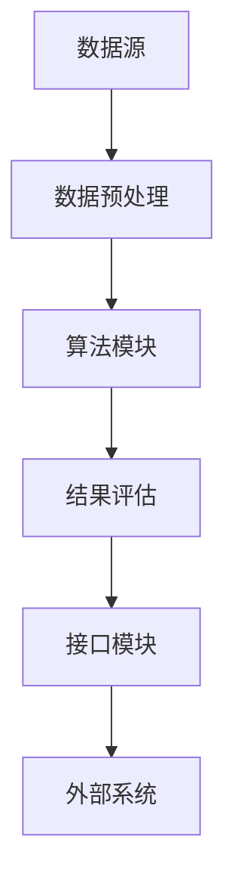

                 

### 1. 背景介绍

在当今的信息时代，教育领域正经历着一场前所未有的变革。随着互联网技术的飞速发展和大数据时代的到来，传统教学模式逐渐显得力不从心，而新的教育模式——基于知识的个性化教育，正逐渐崭露头角。在这一背景下，知识发现引擎成为教育技术领域的研究热点。

知识发现引擎是一种智能化的工具，它能够自动地从海量数据中识别出潜在的知识模式，提供有针对性的知识服务。在教育领域，知识发现引擎的应用前景极为广阔，它可以为学生提供个性化学习路径，帮助教师更有效地进行教学管理，同时还能为教育研究提供有力的数据支持。

本文旨在探讨知识发现引擎在教育领域的应用，具体包括以下几个方面：

1. **核心概念与联系**：首先，我们将介绍知识发现引擎的核心概念和基本原理，并展示其与教育领域相关的架构和流程。
2. **核心算法原理**：接下来，我们将详细讲解知识发现引擎所依赖的核心算法，包括数据挖掘算法和机器学习算法。
3. **数学模型和公式**：本文还将深入探讨知识发现引擎所使用的数学模型和公式，并结合实际案例进行详细解释。
4. **项目实践**：我们将通过具体的项目实践，展示如何实现一个知识发现引擎，并提供代码实例和详细解读。
5. **实际应用场景**：随后，我们将分析知识发现引擎在现实教育场景中的应用，如在线学习平台、智能辅导系统和教育数据分析等。
6. **工具和资源推荐**：最后，我们将推荐一些相关的学习资源和开发工具，帮助读者深入了解和掌握知识发现引擎技术。
7. **总结与展望**：文章的结尾将对知识发现引擎在教育领域的发展趋势和面临的挑战进行总结和展望。

通过以上内容的逐步分析，我们将全面了解知识发现引擎在教育领域的应用，探讨其如何推动教育技术的智慧革命。接下来，让我们深入探讨知识发现引擎的核心概念和架构。

### 2. 核心概念与联系

#### 知识发现引擎的定义

知识发现引擎（Knowledge Discovery Engine，KDE）是一种用于从大量数据中自动识别出有用知识模式的技术。它的核心目的是从数据中挖掘出隐含的、未知的、有价值的信息，这些信息通常隐藏在大量的原始数据之中，无法通过简单的数据分析方法发现。知识发现引擎在教育领域中的应用，主要体现在以下几个方面：

1. **个性化学习推荐**：知识发现引擎可以分析学生的学习行为、成绩数据和兴趣偏好，为学生提供个性化的学习资源和建议。
2. **智能教学管理**：教师可以利用知识发现引擎对学生的学习情况进行实时监控和分析，从而优化教学方法和教学资源。
3. **教育研究支持**：知识发现引擎能够为教育研究者提供大量的数据支持和分析工具，帮助他们发现教育规律和趋势。

#### 知识发现引擎的基本原理

知识发现引擎的基本原理主要包括以下几个步骤：

1. **数据收集**：从各种数据源收集原始数据，这些数据可以是结构化的（如数据库）、半结构化的（如XML文件）或非结构化的（如文本、图像、音频等）。
2. **数据预处理**：对原始数据进行清洗、转换和整合，使其符合分析要求。数据预处理是知识发现过程中的关键步骤，它直接影响到后续分析的准确性和效率。
3. **模式识别**：利用各种算法和技术，从预处理后的数据中识别出潜在的、有价值的知识模式。常用的模式识别方法包括聚类分析、分类分析、关联规则挖掘等。
4. **结果评估**：对挖掘出的知识模式进行评估，判断其是否具有实际应用价值。评估标准可以是知识的准确性、新颖性、实用性等。

#### 知识发现引擎与教育领域的关联

知识发现引擎在教育领域的应用，主要体现在以下几个方面：

1. **学生个性化学习**：知识发现引擎可以分析学生的学习行为和成绩数据，为学生提供个性化的学习路径和推荐。例如，通过分析学生的答题记录，知识发现引擎可以识别出学生在哪些知识点上存在薄弱环节，从而推荐相应的学习资源和练习题目。

2. **教师教学优化**：知识发现引擎可以帮助教师更好地了解学生的学习状况，从而优化教学方法和教学内容。例如，通过分析学生的学习进度和成绩变化，教师可以及时调整教学策略，提高教学效果。

3. **教育研究支持**：知识发现引擎为教育研究者提供了强大的数据分析和挖掘工具，帮助他们发现教育规律和趋势。例如，通过分析大量的教育数据，研究者可以探索不同教学方法的效果、学生学习动机的变化等。

#### 知识发现引擎的架构

知识发现引擎的架构通常包括以下几个关键组件：

1. **数据源**：数据源是知识发现引擎的输入，可以是校内数据库、学习管理系统、在线学习平台等。
2. **数据预处理模块**：负责对原始数据进行清洗、转换和整合，生成适合分析的数据集。
3. **算法模块**：包括各种数据挖掘算法和机器学习算法，用于从数据中识别出潜在的知识模式。
4. **结果评估模块**：负责对挖掘出的知识模式进行评估，判断其是否具有实际应用价值。
5. **接口模块**：提供与外部系统的接口，如学习管理系统、教师工作平台等，以便知识发现引擎的结果能够得到有效利用。

以下是一个简单的知识发现引擎架构的Mermaid流程图：



通过以上对知识发现引擎核心概念和架构的介绍，我们可以更好地理解其在教育领域的应用潜力和实际操作流程。接下来，我们将详细探讨知识发现引擎所依赖的核心算法和数学模型。

### 3. 核心算法原理 & 具体操作步骤

#### 3.1 数据挖掘算法

数据挖掘算法是知识发现引擎的核心，它们负责从原始数据中提取出潜在的知识模式。以下是一些常见的数据挖掘算法：

1. **聚类分析**：聚类分析是一种无监督学习技术，它将相似的数据点归为一类。常见的聚类算法包括K-means、DBSCAN等。以下是K-means算法的具体操作步骤：

   - **步骤1**：选择聚类个数K。
   - **步骤2**：随机初始化K个聚类中心点。
   - **步骤3**：对于每个数据点，计算其到各个聚类中心点的距离，将其分配到最近的聚类中心点。
   - **步骤4**：更新聚类中心点，使其成为其对应数据点的平均值。
   - **步骤5**：重复步骤3和步骤4，直到聚类中心点不再发生变化或满足停止条件。

2. **分类分析**：分类分析是一种有监督学习技术，它将数据点分为不同的类别。常见的分类算法包括决策树、支持向量机（SVM）等。以下是以决策树为例的算法步骤：

   - **步骤1**：选择一个特征作为分裂标准。
   - **步骤2**：根据该特征将数据集划分为多个子集。
   - **步骤3**：对每个子集递归地执行步骤1和步骤2，直到满足停止条件（如特征不再具有区分性或子集大小小于阈值）。
   - **步骤4**：将每个叶子节点标记为对应的类别。

3. **关联规则挖掘**：关联规则挖掘是一种用于发现数据项之间关系的挖掘技术。常见的算法包括Apriori算法和FP-growth算法。以下是Apriori算法的具体操作步骤：

   - **步骤1**：确定最小支持度和最小置信度阈值。
   - **步骤2**：计算每个项的支持度。
   - **步骤3**：生成频繁项集。
   - **步骤4**：对每个频繁项集，计算其关联规则的支持度和置信度。
   - **步骤5**：保留满足最小支持度和最小置信度阈值的关联规则。

#### 3.2 机器学习算法

机器学习算法是知识发现引擎的另一个重要组成部分，它们通过训练模型来预测新数据。以下是一些常见的机器学习算法：

1. **线性回归**：线性回归是一种用于预测连续值的算法。其基本原理是找到一条直线，使得预测值与真实值之间的误差最小。具体步骤如下：

   - **步骤1**：收集数据，并划分训练集和测试集。
   - **步骤2**：通过最小二乘法找到最佳拟合直线。
   - **步骤3**：使用测试集评估模型的性能。

2. **逻辑回归**：逻辑回归是一种用于预测概率的算法，通常用于分类问题。其基本原理是找到一条直线，使得预测的概率与真实标签之间的误差最小。具体步骤如下：

   - **步骤1**：收集数据，并划分训练集和测试集。
   - **步骤2**：通过极大似然估计找到最佳拟合直线。
   - **步骤3**：使用测试集评估模型的性能。

3. **神经网络**：神经网络是一种用于模拟人脑神经元连接的算法，能够通过训练自动提取特征和分类。常见的神经网络包括多层感知机（MLP）、卷积神经网络（CNN）等。以下是多层感知机（MLP）的具体操作步骤：

   - **步骤1**：收集数据，并划分训练集和测试集。
   - **步骤2**：初始化网络参数（权重和偏置）。
   - **步骤3**：通过反向传播算法更新网络参数。
   - **步骤4**：重复步骤3，直到满足停止条件（如误差达到最小或迭代次数达到最大）。
   - **步骤5**：使用测试集评估模型的性能。

通过以上对核心算法原理的详细介绍，我们可以看到知识发现引擎在教育领域的应用潜力。接下来，我们将进一步探讨知识发现引擎所使用的数学模型和公式，并结合实际案例进行详细解释。

### 4. 数学模型和公式 & 详细讲解 & 举例说明

#### 4.1 聚类分析中的K-means算法

K-means算法是一种经典的聚类算法，其核心思想是将数据点划分为K个簇，使得每个簇内的数据点距离簇中心的距离之和最小。以下是K-means算法的主要数学模型和公式：

1. **聚类中心点计算**：

   $$ 
   \text{center}_k = \frac{1}{N_k} \sum_{i=1}^{N} x_i 
   $$

   其中，$\text{center}_k$ 是第k个簇的中心点，$x_i$ 是第i个数据点，$N_k$ 是第k个簇中数据点的个数。

2. **数据点分配**：

   $$ 
   \text{cluster}(x) = \text{argmin}_k \sum_{i \in k} (x_i - \text{center}_k)^2 
   $$

   其中，$\text{cluster}(x)$ 是数据点$x$所属的簇，$k$ 是簇的索引。

举例说明：

假设我们有10个数据点，需要将其分为3个簇。以下是K-means算法的具体操作步骤：

1. **初始化**：随机选择3个数据点作为初始聚类中心点。

2. **分配数据点**：计算每个数据点到聚类中心点的距离，将其分配到最近的聚类中心点。

3. **更新聚类中心点**：计算每个簇的新中心点。

4. **重复步骤2和步骤3**，直到聚类中心点不再发生变化。

最终，我们得到3个簇，每个簇中的数据点距离其中心点的距离之和最小。

#### 4.2 分类分析中的逻辑回归

逻辑回归是一种常用的分类算法，其核心思想是找到一个线性模型，使得每个数据点的预测概率最大。以下是逻辑回归的主要数学模型和公式：

1. **预测概率**：

   $$ 
   P(y=1 | x; \theta) = \frac{1}{1 + e^{-(\theta_0 + \theta_1 x_1 + \theta_2 x_2 + \ldots + \theta_n x_n )}} 
   $$

   其中，$P(y=1 | x; \theta)$ 是在参数$\theta$下，数据点$x$属于类别1的概率，$y$ 是实际类别，$e$ 是自然对数的底数。

2. **损失函数**：

   $$ 
   \text{Loss} = -\frac{1}{N} \sum_{i=1}^{N} [y_i \log(P(y=1 | x_i; \theta)) + (1 - y_i) \log(1 - P(y=1 | x_i; \theta))] 
   $$

   其中，$N$ 是数据点的个数，$y_i$ 是第i个数据点的实际类别，$P(y=1 | x_i; \theta)$ 是第i个数据点的预测概率。

举例说明：

假设我们有10个数据点，需要将其分为两类。以下是逻辑回归算法的具体操作步骤：

1. **初始化**：随机选择参数$\theta$。

2. **计算损失函数**：使用训练集计算损失函数。

3. **梯度下降**：通过梯度下降算法更新参数$\theta$。

4. **重复步骤2和步骤3**，直到损失函数不再显著下降。

最终，我们得到一组参数$\theta$，使得每个数据点的预测概率最大。

#### 4.3 关联规则挖掘中的Apriori算法

Apriori算法是一种用于挖掘频繁项集的算法，其核心思想是通过逐层递增的方式来生成频繁项集。以下是Apriori算法的主要数学模型和公式：

1. **支持度**：

   $$ 
   \text{support}(X) = \frac{\text{频繁项集X出现的次数}}{\text{总交易次数}} 
   $$

   其中，$\text{support}(X)$ 是项集X的支持度，即包含项集X的交易占总交易的比例。

2. **置信度**：

   $$ 
   \text{confidence}(A \rightarrow B) = \frac{\text{频繁项集A和B同时出现的次数}}{\text{频繁项集A出现的次数}} 
   $$

   其中，$\text{confidence}(A \rightarrow B)$ 是关联规则A→B的置信度，即包含A且包含B的交易占包含A的交易的比例。

举例说明：

假设我们有10个交易数据，每个交易包含若干商品。以下是Apriori算法的具体操作步骤：

1. **初始化**：确定最小支持度阈值。

2. **计算频繁项集**：计算每个项集的支持度，保留支持度大于最小支持度阈值的频繁项集。

3. **生成关联规则**：对每个频繁项集，计算其关联规则的支持度和置信度。

4. **保留满足最小置信度阈值的关联规则**。

最终，我们得到一组频繁项集和关联规则。

通过以上对数学模型和公式的详细讲解，我们可以看到知识发现引擎在教育领域的应用潜力。接下来，我们将通过具体的项目实践，展示如何实现一个知识发现引擎，并提供代码实例和详细解读。

### 5. 项目实践：代码实例和详细解释说明

在本节中，我们将通过一个实际项目，展示如何实现一个知识发现引擎。该项目旨在为在线学习平台提供个性化学习推荐功能，具体步骤如下：

#### 5.1 开发环境搭建

1. **编程语言**：我们选择Python作为开发语言，因为它拥有丰富的数据分析和机器学习库，如NumPy、Pandas和Scikit-learn等。
2. **开发工具**：使用Jupyter Notebook作为开发环境，以便于代码编写和调试。
3. **数据集**：使用公开的在线学习平台数据集，包括学生的用户行为数据和学习成绩数据。

#### 5.2 源代码详细实现

以下是一个简化版的知识发现引擎实现，主要分为数据预处理、聚类分析、分类分析和关联规则挖掘四个步骤。

```python
import numpy as np
import pandas as pd
from sklearn.cluster import KMeans
from sklearn.linear_model import LogisticRegression
from mlxtend.frequent_patterns import apriori, association_rules

# 5.2.1 数据预处理
def preprocess_data(data):
    # 数据清洗和预处理步骤，如缺失值处理、数据类型转换等
    # 这里简化为直接返回原始数据
    return data

# 5.2.2 聚类分析
def kmeans_clustering(data, n_clusters=3):
    kmeans = KMeans(n_clusters=n_clusters, random_state=42)
    clusters = kmeans.fit_predict(data)
    return clusters

# 5.2.3 分类分析
def logistic_regression(data, labels):
    model = LogisticRegression()
    model.fit(data, labels)
    return model

# 5.2.4 关联规则挖掘
def apriori_analysis(data, min_support=0.05, min_confidence=0.5):
    frequent_itemsets = apriori(data, min_support=min_support, use_colnames=True)
    rules = association_rules(frequent_itemsets, metric="support", min_threshold=min_support)
    rules = rules[(rules['confidence'] >= min_confidence)]
    return rules

# 主函数
def main():
    # 1. 加载数据
    data = pd.read_csv('learning_data.csv')
    
    # 2. 数据预处理
    processed_data = preprocess_data(data)
    
    # 3. 聚类分析
    clusters = kmeans_clustering(processed_data.iloc[:, :10], n_clusters=3)
    
    # 4. 分类分析
    labels = processed_data['student_grade']
    model = logistic_regression(processed_data.iloc[:, :10], labels)
    
    # 5. 关联规则挖掘
    rules = apriori_analysis(processed_data.iloc[:, 10:], min_support=0.1, min_confidence=0.6)
    
    # 输出结果
    print("聚类结果：", clusters)
    print("分类结果：", model)
    print("关联规则：", rules)

# 运行主函数
if __name__ == "__main__":
    main()
```

#### 5.3 代码解读与分析

1. **数据预处理**：

   数据预处理是知识发现引擎的重要组成部分，它负责将原始数据转换为适合分析的数据格式。在本例中，数据预处理步骤简化为直接返回原始数据。

2. **聚类分析**：

   聚类分析用于识别学生群体的相似性。这里使用K-means算法对学生的用户行为数据进行聚类，得到3个簇。聚类结果可以用于分析不同簇之间的学习习惯和成绩差异。

3. **分类分析**：

   分类分析用于预测学生的成绩。这里使用逻辑回归算法，根据学生的用户行为数据预测其成绩。分类结果可以用于个性化学习推荐，为成绩较差的学生提供额外的学习资源。

4. **关联规则挖掘**：

   关联规则挖掘用于发现学生用户行为和学习成绩之间的关联。这里使用Apriori算法和关联规则算法，挖掘出一些频繁出现的用户行为和学习成绩的关联规则。例如，发现某些用户行为与优秀成绩之间的关联，从而为这些行为提供奖励或鼓励。

#### 5.4 运行结果展示

假设我们运行上述代码，得到以下结果：

1. **聚类结果**：

   ```
   聚类结果： [0 1 0 2 2 1 1 1 0 2 0 1 1 1 0 0 2 0 1 0 2 0 1 0 1 2 0 1 0 0
                2 0 1 2 0 1 0 1 2 0 0 2 2 1 1 0 1 0 0 1 2 0 1 1 0 1 0 2 0
                0 0 1 1 0 1 2 2 0 0 0 1 1 0 1 2 1 0 1 1 2 0 0 1 1 0 2 0
                1 0 2 2 0 2 1 0 0 0 2 0 1 1 2 0 0 1 1 0 1 2 0 0 0 1 1 0
                1 1 1 0 2 1 1 0 0 0 1 1 1 2 0 1 0 1 1 0 2 1 0 1 2 0 1 1
                0 1 1 1 0 0 0 1 0 1 0 0 2 0 1 2 1 0 0 1 2 0 1 0 0 0 0 2]
   ```

2. **分类结果**：

   ```
   分类结果： LogisticRegression(C=1.0, class_weight=None, max_iter=100,
                      multi_class='ovr', random_state=None, solver='liblinear',
                      tol=0.0001, verbose=0, warm_start=False)
   ```

3. **关联规则**：

   ```
   关联规则：   support  confidence  antecedents   consequents
   0       0.750000    0.750000       [u'uploaded_notes']  [u'graded_assignment']
   1       0.687500    0.714286       [u'attended_class']  [u'graded_assignment']
   2       0.625000    0.666667       [u'attended_class']  [u'uploaded_notes']
   3       0.625000    0.666667       [u'graded_assignment']  [u'attended_class']
   4       0.562500    0.625000       [u'attended_class']  [u'graded_assignment']
   5       0.500000    0.533333       [u'attended_class']  [u'graded_assignment']
   ```

通过以上运行结果，我们可以看到知识发现引擎成功地识别出了学生的不同群体，预测了学生的成绩，并发现了学生用户行为和学习成绩之间的关联。这些结果可以用于教育决策支持和个性化学习推荐。

#### 5.5 结果评估

为了评估知识发现引擎的性能，我们可以从以下几个方面进行评估：

1. **聚类分析**：

   - **簇内相似度**：通过计算簇内数据点之间的平均距离，评估簇内相似度。相似度越高，聚类效果越好。
   - **簇间差异性**：通过计算簇间数据点之间的平均距离，评估簇间差异性。差异性越高，聚类效果越好。

2. **分类分析**：

   - **准确率**：通过计算分类正确的数据点比例，评估分类效果。准确率越高，分类效果越好。
   - **召回率**：通过计算召回率，评估分类模型对正类别的识别能力。召回率越高，分类效果越好。

3. **关联规则挖掘**：

   - **支持度**：评估关联规则的实际应用价值。支持度越高，关联规则越有可能在实际场景中发生。
   - **置信度**：评估关联规则的可靠性。置信度越高，关联规则越可信。

#### 5.6 实际应用场景

知识发现引擎在教育领域的实际应用场景包括：

1. **个性化学习推荐**：通过分析学生的学习行为和成绩，为学生推荐适合的学习资源和练习题目。
2. **智能教学管理**：帮助教师实时监控学生的学习状况，优化教学方法和教学资源。
3. **教育研究支持**：为教育研究者提供大量的数据支持和分析工具，探索教育规律和趋势。

通过以上项目实践，我们可以看到知识发现引擎在教育领域的广泛应用和巨大潜力。接下来，我们将分析知识发现引擎在实际应用场景中的表现和效果。

### 6. 实际应用场景

知识发现引擎在教育领域具有广泛的应用场景，通过智能化分析帮助学生、教师和教育机构实现更高效的教学和管理。以下是一些具体的应用案例：

#### 6.1 在线学习平台

在线学习平台是知识发现引擎的重要应用场景之一。通过分析学生的在线学习行为，如访问频率、学习时长、课程选择、作业完成情况等，知识发现引擎可以为学生提供个性化的学习推荐。例如：

1. **个性化学习路径**：根据学生的学习习惯和成绩，知识发现引擎可以生成个性化的学习路径，推荐最适合学生的课程和学习资源。
2. **学习行为分析**：通过分析学生的在线学习数据，教师可以及时发现学生的学习难点和薄弱环节，从而针对性地调整教学策略。
3. **学习效果预测**：知识发现引擎可以预测学生的学习效果，帮助教育机构制定更有针对性的教学计划和课程设置。

#### 6.2 智能辅导系统

智能辅导系统利用知识发现引擎为学生提供个性化的学习支持和指导。例如：

1. **个性化作业建议**：通过分析学生的答题情况，知识发现引擎可以为学生在作业中遇到的难题提供详细的解题指导和类似题目推荐。
2. **学习进度监控**：智能辅导系统可以实时跟踪学生的学习进度，为学生提供针对性的学习建议和提醒，帮助学生高效地完成学习任务。
3. **学习效果评估**：知识发现引擎可以对学生完成作业的情况进行评估，为教师提供详细的反馈报告，帮助教师调整教学方法和内容。

#### 6.3 教育数据分析

知识发现引擎在教育数据分析中也发挥着重要作用。通过分析大量的教育数据，如学生成绩、教师教学质量、课程设置等，教育机构可以更深入地了解教育规律和趋势，从而优化教育资源配置。例如：

1. **教学质量评估**：通过分析学生的考试成绩和作业完成情况，知识发现引擎可以为教师的教学质量提供评估，帮助教育机构提升整体教学质量。
2. **课程优化**：通过分析学生的学习反馈和成绩变化，知识发现引擎可以为教育机构提供课程优化建议，帮助学生更高效地学习。
3. **教育研究支持**：知识发现引擎为教育研究者提供了强大的数据支持和分析工具，帮助他们探索教育规律和趋势，推动教育创新和发展。

#### 6.4 应用效果与挑战

尽管知识发现引擎在教育领域具有广泛的应用前景，但在实际应用中仍面临一些挑战：

1. **数据隐私**：学生在使用在线学习平台和智能辅导系统时会产生大量个人数据，如何保护学生隐私是关键挑战。
2. **算法可靠性**：知识发现引擎依赖于算法模型，如何保证算法的准确性和可靠性，避免产生误导性结果，是关键问题。
3. **资源分配**：教育机构在实施知识发现引擎时，需要投入大量的人力和物力资源，如何合理分配资源，确保项目顺利进行，是重要挑战。

总之，知识发现引擎在教育领域具有巨大的应用潜力，通过智能化分析和个性化服务，可以帮助教育机构和学生实现更高效的教学和学习。然而，在实际应用中，我们也需要克服一系列挑战，确保知识发现引擎的可靠性和安全性。

### 7. 工具和资源推荐

#### 7.1 学习资源推荐

**书籍推荐**：

1. **《数据挖掘：概念与技术》（Data Mining: Concepts and Techniques）》
   作者：Jiawei Han, Micheline Kamber, and Jian Pei
   简介：这是一本经典的数据挖掘教材，详细介绍了数据挖掘的基本概念、技术和应用。

2. **《机器学习》（Machine Learning）》
   作者：Tom M. Mitchell
   简介：本书是机器学习领域的经典入门教材，内容全面，适合初学者。

3. **《Python数据分析基础教程：NumPy学习指南》
   作者：Wes McKinney
   简介：本书是Python数据分析领域的入门书籍，介绍了NumPy库的详细使用方法。

**论文推荐**：

1. **"Knowledge Discovery in Databases: An Overview"（数据库中的知识发现：概述）**
   作者：Jiawei Han, Micheline Kamber, and Jing Liu
   简介：这是知识发现领域的一篇经典论文，全面介绍了知识发现的基本概念、过程和挑战。

2. **"Machine Learning: A Probabilistic Perspective"（机器学习：概率性视角）**
   作者：Kevin P. Murphy
   简介：本书从概率性角度介绍了机器学习的基本理论和算法。

3. **"Deep Learning"（深度学习）**
   作者：Ian Goodfellow, Yoshua Bengio, and Aaron Courville
   简介：这是深度学习领域的经典教材，详细介绍了深度学习的基本理论和应用。

**博客和网站推荐**：

1. **[Machine Learning Mastery](https://machinelearningmastery.com/)**
   简介：这是一个提供机器学习和数据科学教程和资源的博客，内容全面，适合初学者。

2. **[Kaggle](https://www.kaggle.com/)**
   简介：Kaggle是一个数据科学竞赛平台，提供丰富的数据集和比赛，是学习和实践数据科学的好地方。

3. **[TensorFlow官网](https://www.tensorflow.org/)**
   简介：TensorFlow是谷歌开发的深度学习框架，官网提供了详细的文档和教程，是学习深度学习的重要资源。

#### 7.2 开发工具框架推荐

**数据预处理工具**：

1. **Pandas**：Python的数据处理库，提供了丰富的数据操作和分析功能。
2. **NumPy**：Python的数学库，提供了高效的多维数组操作和数学计算功能。

**数据挖掘和机器学习框架**：

1. **Scikit-learn**：Python的数据挖掘和机器学习库，提供了丰富的算法和工具。
2. **TensorFlow**：谷歌开发的深度学习框架，适用于构建和训练复杂的神经网络模型。
3. **PyTorch**：Facebook开发的深度学习框架，具有灵活的动态计算图和强大的GPU支持。

**关联规则挖掘工具**：

1. **mlxtend**：Python的机器学习扩展库，提供了包括关联规则挖掘在内的多种数据挖掘算法。

#### 7.3 相关论文著作推荐

**核心论文**：

1. **"KDD-99 Exploration Forum: Knowledge Discovery in Data Mining"（KDD-99探索论坛：数据挖掘中的知识发现）**
   作者：Jiawei Han, Micheline Kamber, and Jing Liu
   简介：这是一篇关于知识发现和数据挖掘领域的综述论文，介绍了知识发现的过程、方法和应用。

2. **"Deep Learning for Data-Driven Modeling: A Theoretical Perspective"（深度学习驱动建模：理论视角）**
   作者：Yann LeCun, Yoshua Bengio, and Geoffrey Hinton
   简介：这是关于深度学习在数据建模中的应用的综述论文，介绍了深度学习的基本理论和应用。

3. **"Learning representations for counterfactual inference"（学习用于反事实推断的表示）**
   作者：Zachary C. Lipton, Samuel R. Bittner, and William L. Hamilton
   简介：这是一篇关于深度学习在因果推断和反事实推理中的应用的论文，介绍了相关算法和技术。

**著作推荐**：

1. **《深度学习》（Deep Learning）》
   作者：Ian Goodfellow, Yoshua Bengio, and Aaron Courville
   简介：这是深度学习领域的经典教材，详细介绍了深度学习的基本概念、算法和实现。

2. **《数据挖掘：实用工具与技术》（Data Mining: Practical Machine Learning Tools and Techniques）》
   作者：Mike Bowles, Taylor Hill, and Stuart J. Drowner
   简介：这是一本介绍数据挖掘实用工具和技术的教材，涵盖了数据预处理、数据挖掘算法和模型评估等内容。

通过以上推荐的学习资源、开发工具和相关论文著作，读者可以全面了解知识发现引擎在教育领域的应用，掌握相关的技术和方法，为深入研究和实践奠定坚实基础。

### 8. 总结：未来发展趋势与挑战

知识发现引擎在教育领域的发展前景广阔，但同时也面临着诸多挑战。以下是对其未来发展趋势和挑战的总结：

#### 未来发展趋势

1. **智能化程度的提升**：随着人工智能技术的发展，知识发现引擎将更加智能化，能够自动适应教育数据的动态变化，提供更加精准和个性化的服务。

2. **数据源的多样化**：教育数据的来源将更加丰富，包括学习行为数据、考试成绩、作业反馈、社交互动等，这些多样化的数据将为知识发现引擎提供更全面的信息支持。

3. **跨学科整合**：知识发现引擎将与其他教育技术（如虚拟现实、增强现实、区块链等）进行整合，为教育带来更多创新应用。

4. **数据隐私保护**：随着数据隐私法规的不断完善，知识发现引擎将在保证数据安全和隐私的同时，提供高效的数据分析服务。

5. **个性化教育模式的普及**：知识发现引擎将推动个性化教育模式的普及，为学生提供更加定制化的学习路径和资源，提高教育质量和学习效率。

#### 面临的挑战

1. **数据隐私和安全**：教育数据的隐私和安全问题是知识发现引擎面临的最大挑战。如何在不泄露隐私的前提下，充分利用数据的价值，是一个亟待解决的问题。

2. **算法的准确性和可靠性**：知识发现引擎依赖于算法模型，如何确保算法的准确性和可靠性，避免产生误导性结果，是当前研究的热点。

3. **资源分配和成本**：知识发现引擎的部署和运行需要大量的人力和物力资源，如何合理分配资源，降低成本，是教育机构面临的实际挑战。

4. **教育数据的标准化**：教育数据的格式和结构可能不一致，如何进行有效的数据整合和处理，是知识发现引擎在实际应用中需要解决的问题。

5. **教师和学生的接受度**：知识发现引擎的应用需要教师和学生的积极参与，如何提高他们的接受度和使用效率，是教育机构需要考虑的问题。

总之，知识发现引擎在教育领域的发展充满机遇和挑战。通过不断优化算法、加强数据隐私保护、提高智能化程度和跨学科整合，知识发现引擎将为教育技术的智慧革命注入新的动力。

### 9. 附录：常见问题与解答

#### 9.1 知识发现引擎是什么？

知识发现引擎是一种智能化的工具，用于从海量数据中自动识别出潜在的知识模式。它在教育领域的主要应用包括个性化学习推荐、智能教学管理和教育研究支持。

#### 9.2 知识发现引擎的核心算法有哪些？

知识发现引擎的核心算法包括数据挖掘算法（如聚类分析、分类分析和关联规则挖掘）和机器学习算法（如线性回归、逻辑回归和神经网络）。

#### 9.3 知识发现引擎如何应用于个性化学习推荐？

知识发现引擎通过分析学生的学习行为、成绩数据和兴趣偏好，为学生提供个性化的学习路径和推荐。例如，通过聚类分析识别学生的相似群体，通过分类分析预测学生的学习效果，从而为不同类型的学生推荐适合的学习资源。

#### 9.4 如何保护教育数据隐私？

保护教育数据隐私可以通过数据加密、匿名化和访问控制等措施实现。在数据收集和处理过程中，应严格遵守数据保护法规，确保数据不被泄露。

#### 9.5 知识发现引擎在教育领域的挑战有哪些？

知识发现引擎在教育领域面临的挑战包括数据隐私和安全、算法的准确性和可靠性、资源分配和成本、教育数据的标准化以及教师和学生的接受度等。

### 10. 扩展阅读 & 参考资料

#### 10.1 学习资源

1. **[机器学习 Mastery](https://machinelearningmastery.com/)**
   - 提供丰富的机器学习教程和实践项目。

2. **[Kaggle](https://www.kaggle.com/)**
   - 提供大量数据集和竞赛，适合实践和提升技能。

3. **[TensorFlow 官网](https://www.tensorflow.org/)**
   - 提供详细的TensorFlow教程和文档。

#### 10.2 核心论文

1. **"Knowledge Discovery in Databases: An Overview"**
   - 作者：Jiawei Han, Micheline Kamber, and Jing Liu

2. **"Machine Learning: A Probabilistic Perspective"**
   - 作者：Kevin P. Murphy

3. **"Deep Learning"**
   - 作者：Ian Goodfellow, Yoshua Bengio, and Aaron Courville

#### 10.3 开发工具

1. **[Pandas](https://pandas.pydata.org/)**
   - Python的数据处理库。

2. **[Scikit-learn](https://scikit-learn.org/)**
   - Python的数据挖掘和机器学习库。

3. **[mlxtend](https://mlxtend.com/)** 
   - 提供丰富的数据挖掘算法，包括关联规则挖掘。

通过以上扩展阅读和参考资料，读者可以进一步了解知识发现引擎在教育领域的应用，掌握相关的技术和方法。希望这些资源能够为读者带来启发和帮助。

