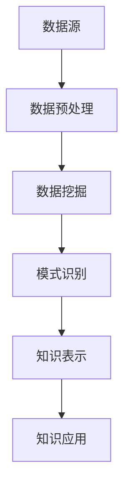

                 

### 背景介绍 Background Introduction

在信息技术飞速发展的今天，数据正以前所未有的速度累积。从社交媒体到互联网搜索引擎，再到商业交易和科学研究，数据的生成和收集已经变得无处不在。这些数据不仅数量庞大，而且种类繁多，包括文本、图像、声音以及时间序列数据等。如何从这些庞杂的数据中提取有价值的信息，一直是学术界和工业界的研究热点。

知识发现引擎（Knowledge Discovery Engine）作为一种高级的数据分析工具，致力于在大量数据中自动识别出隐藏的模式和关联，从而帮助人们从数据中获取洞见和知识。知识发现引擎的基本思想是利用算法和统计学方法，对数据进行处理、分析和建模，从而发现数据中的潜在规律和趋势。

知识发现引擎的应用场景非常广泛，包括但不限于以下领域：

1. **商业智能**：通过分析客户购买行为、市场趋势等，为企业提供决策支持，从而优化运营策略和提高竞争力。
2. **金融分析**：利用知识发现引擎对金融数据进行挖掘，帮助金融机构识别潜在风险，预测市场趋势，并进行投资决策。
3. **医疗健康**：通过分析大量患者的病历数据，发现疾病与基因、生活习惯等之间的关联，从而提高诊断和治疗的准确性。
4. **社会科学研究**：通过分析社会数据，探索社会现象的规律，为社会政策制定提供科学依据。

然而，尽管知识发现引擎在众多领域展现出了巨大的潜力，但其发展仍面临诸多挑战。首先，数据质量和数据的多样性会影响知识发现的效果。其次，知识发现算法的复杂性和计算效率也是需要解决的问题。此外，如何将发现的模式转化为实际行动，并确保其可解释性和可靠性，也是当前研究的重点。

本文旨在深入探讨知识发现引擎的原理、算法、应用及未来发展趋势，通过系统的分析和实例讲解，为读者提供一个全面而详实的理解。我们将首先介绍知识发现引擎的基本概念和原理，然后逐步分析其核心算法，探讨如何通过数学模型和公式来优化知识发现过程。接着，通过实际项目实例，展示知识发现引擎在实际应用中的效果。最后，我们将探讨知识发现引擎的未来发展趋势和潜在挑战。

### 核心概念与联系 Core Concepts and Connections

知识发现引擎的核心在于其能够从大量数据中提取有价值的信息和模式。为了深入理解这一过程，我们需要明确以下几个关键概念：数据预处理、数据挖掘、模式识别和知识表示。

**1. 数据预处理**

数据预处理是知识发现过程中的第一步，其目标是清理、转换和整合原始数据，使其适用于后续的分析。数据预处理通常包括以下步骤：

- **数据清洗**：去除数据中的噪声和错误，如缺失值、异常值等。
- **数据转换**：将数据从一种格式转换为另一种格式，如将文本数据转换为数值数据。
- **数据归一化**：通过缩放或平移，将不同尺度的数据进行标准化处理。
- **数据集成**：将来自多个来源的数据进行合并，形成一个统一的数据集。

**2. 数据挖掘**

数据挖掘（Data Mining）是指从大量数据中通过算法和统计学方法，发现隐含的、未知的、具有潜在价值的信息和模式的过程。数据挖掘通常包括以下几个步骤：

- **选择**：选择合适的数据集和算法，以解决特定的业务问题。
- **预处理**：对数据集进行清洗、转换和归一化等预处理步骤。
- **建模**：使用特定的算法（如分类、聚类、关联规则挖掘等）对数据进行分析和建模。
- **评估**：评估模型的性能，通过交叉验证等方法确定模型的可靠性和有效性。

**3. 模式识别**

模式识别（Pattern Recognition）是数据挖掘的一个重要分支，旨在从数据中识别出有意义的模式和规律。模式识别通常包括以下几种方法：

- **分类**：将数据分为不同的类别或标签。
- **聚类**：将相似的数据点归为一类，形成不同的集群。
- **关联规则挖掘**：发现数据项之间的关联性，如“购买A商品的概率高时，也会购买B商品”。
- **异常检测**：识别数据中的异常或离群点。

**4. 知识表示**

知识表示（Knowledge Representation）是将发现的知识以结构化的形式进行表达，以便于存储、检索和使用。知识表示的方法包括：

- **符号表示**：使用逻辑公式、规则集等进行知识表示。
- **语义网络**：使用节点和边表示实体及其关系。
- **本体论**：通过构建本体，定义领域内概念及其关系。

**5. 数据挖掘与知识发现的关系**

数据挖掘是知识发现过程中不可或缺的一环，其主要目标是发现数据中的模式和规律。然而，知识发现不仅限于数据挖掘，还包括将发现的模式转化为可操作的知识，并将其应用于实际问题中。具体来说，数据挖掘和知识发现的关系可以概括为：

- **数据挖掘**：侧重于发现数据中的潜在信息和模式。
- **知识发现**：侧重于将发现的模式转化为有价值的知识，并应用于实际问题中。

### Mermaid 流程图

以下是一个简化的知识发现引擎的流程图，使用Mermaid语言绘制：



- **A[数据源]**：数据挖掘和知识发现的起点，包括各种形式的数据来源。
- **B[数据预处理]**：对数据进行清洗、转换和归一化等处理，以提高数据质量和一致性。
- **C[数据挖掘]**：利用算法和统计学方法，从数据中发现潜在的模式和规律。
- **D[模式识别]**：进一步对挖掘出的模式进行识别和分类，提取出有意义的知识。
- **E[知识表示]**：将发现的模式以结构化的形式进行表达，方便存储和使用。
- **F[知识应用]**：将知识应用于实际问题中，解决具体业务问题或提供决策支持。

通过上述关键概念和流程图的介绍，我们可以看到知识发现引擎是如何将原始数据转化为有价值的知识和洞察力的。接下来，我们将进一步探讨知识发现引擎的核心算法，分析其原理和具体实现。

### 核心算法原理 Core Algorithm Principles

知识发现引擎的核心算法通常包括分类、聚类、关联规则挖掘和异常检测等。每种算法都有其独特的原理和适用场景。以下，我们将逐一介绍这些核心算法的原理，并探讨其优缺点。

#### 1. 分类算法

分类算法（Classification Algorithms）旨在将数据集中的实例分配到预先定义的类别中。常见的分类算法包括决策树、支持向量机（SVM）、K最近邻（K-Nearest Neighbors，K-NN）和逻辑回归等。

- **决策树**：决策树通过一系列规则，将数据划分成子集，每个节点代表一个特征，每个分支代表特征的一个取值。决策树简单直观，易于解释，但可能过度拟合。
- **支持向量机**：SVM通过将数据映射到高维空间，找到最佳分类超平面，以最大化分类间隔。SVM在处理高维数据和线性不可分数据时效果较好，但训练时间较长。
- **K最近邻**：K-NN通过计算测试实例与训练实例之间的距离，将测试实例分配到最近的K个邻居中，取多数投票决定最终类别。K-NN简单高效，对噪声敏感，但对高维数据效果较差。
- **逻辑回归**：逻辑回归通过建立逻辑函数，将概率映射到类别中。逻辑回归可以解释特征对类别的影响，但在处理非线性问题时效果较差。

**优点**：分类算法具有以下优点：
- **可解释性**：大多数分类算法能够提供明确的决策路径或规则，便于理解和解释。
- **应用广泛**：分类算法广泛应用于各种场景，如市场预测、文本分类和图像识别等。

**缺点**：分类算法也存在一些缺点：
- **过度拟合**：某些算法（如决策树）容易过度拟合训练数据，导致在新数据上的性能下降。
- **对高维数据敏感**：高维数据会增加算法的计算复杂度，影响其性能。

#### 2. 聚类算法

聚类算法（Clustering Algorithms）旨在将数据点分为多个类别，使得同一类别内的数据点相似度较高，而不同类别之间的数据点相似度较低。常见的聚类算法包括K-均值、层次聚类和DBSCAN等。

- **K-均值**：K-均值通过最小化平方误差，将数据点分配到K个聚类中心附近。K-均值简单高效，但需要事先指定聚类数目K，且对初始聚类中心敏感。
- **层次聚类**：层次聚类通过自底向上的合并或自顶向下的分裂，逐步构建一个层次化的聚类结构。层次聚类不需要预先指定聚类数目，但计算复杂度较高。
- **DBSCAN**：DBSCAN通过密度可达性和密度连接性，将数据点分为核心点、边界点和噪声点。DBSCAN能够发现任意形状的聚类，但需要预先指定邻域半径和最小密度。

**优点**：聚类算法具有以下优点：
- **无监督学习**：聚类算法无需标签信息，适用于无监督学习场景。
- **发现非规则性模式**：聚类算法能够发现数据中的隐含结构和模式，不受预设类别影响。

**缺点**：聚类算法也存在一些缺点：
- **对初始条件敏感**：某些算法（如K-均值）对初始聚类中心或邻域半径敏感，可能导致结果不稳定。
- **聚类数目选择问题**：如K-均值需要指定聚类数目K，而层次聚类虽然无需指定K，但计算复杂度较高。

#### 3. 关联规则挖掘

关联规则挖掘（Association Rule Learning）旨在发现数据项之间的关联性，通常表示为“如果-那么”规则。常见的算法包括Apriori算法和FP-Growth算法。

- **Apriori算法**：Apriori算法通过逐层搜索频繁项集，然后生成关联规则。Apriori算法简单高效，但需要多次扫描数据集，计算复杂度高。
- **FP-Growth算法**：FP-Growth算法通过构建FP-树，压缩原始数据集，然后逐层挖掘频繁项集和关联规则。FP-Growth算法在处理大数据集时性能优于Apriori算法。

**优点**：关联规则挖掘具有以下优点：
- **发现数据项之间的关联性**：关联规则挖掘能够发现数据项之间的隐含关系，用于市场分析、推荐系统等。
- **易于理解和应用**：关联规则以直观的“如果-那么”形式表示，便于理解和应用。

**缺点**：关联规则挖掘也存在一些缺点：
- **频繁项集的爆炸性问题**：随着项集长度的增加，频繁项集的数量呈指数级增长，导致计算复杂度急剧增加。
- **规则泛化能力有限**：生成的规则通常过于具体，难以泛化到更广泛的场景。

#### 4. 异常检测

异常检测（Anomaly Detection）旨在识别数据集中的异常或离群点，用于监控、欺诈检测和故障诊断等。常见的算法包括孤立森林（Isolation Forest）和Autoencoder等。

- **孤立森林**：孤立森林通过随机选择特征和切分值，将数据点孤立出来，异常点的孤立时间较短。孤立森林对高维数据和非线性数据有较好的表现。
- **Autoencoder**：Autoencoder通过自编码网络，将输入数据压缩到一个低维空间中，然后通过重建误差识别异常点。Autoencoder在处理非线性数据和连续数据时效果较好。

**优点**：异常检测具有以下优点：
- **实时监控**：异常检测能够实时识别数据中的异常点，用于实时监控系统、欺诈检测等。
- **自适应**：异常检测算法通常具有自适应能力，能够根据数据变化动态调整阈值。

**缺点**：异常检测也存在一些缺点：
- **阈值选择问题**：异常检测算法通常需要设置阈值，阈值的选择对结果有较大影响。
- **计算复杂度较高**：某些算法（如孤立森林）在处理大数据集时计算复杂度较高。

通过以上对分类、聚类、关联规则挖掘和异常检测等核心算法原理的介绍，我们可以看到这些算法在知识发现中的重要作用。接下来，我们将进一步探讨如何具体操作这些算法，通过实际步骤实现知识发现过程。

### 数学模型和公式 Detailed Explanation and Examples

在知识发现过程中，数学模型和公式扮演着至关重要的角色。它们不仅帮助我们理解和解释算法的工作原理，还提供了量化和评估的方法。以下，我们将详细讲解几个核心数学模型和公式，并提供具体的例子来展示其应用。

#### 1. 决策树

决策树是一种常见的分类算法，其核心是构建一个树状结构，每个内部节点代表一个特征，每个分支代表特征的一个取值，每个叶节点代表一个类别。

**公式**：决策树的构建可以通过ID3（信息增益）或C4.5（增益率）等公式来优化。

- **信息增益（IG）**：表示一个特征对分类的重要性，计算公式为：

  $$ IG(D, A) = H(D) - \sum_{v \in A} p(v) \cdot H(D_v) $$

  其中，$H(D)$ 是数据集D的熵，$p(v)$ 是特征A的取值v的概率，$H(D_v)$ 是在特征A取值为v的条件下数据集D的熵。

- **信息增益率（Gini指数）**：考虑特征值的多样性和分类的不确定性，计算公式为：

  $$ Gini(D, A) = 1 - \sum_{v \in A} \left( \frac{1}{|A|} \right)^2 $$

  其中，$|A|$ 是特征A的不同取值数量。

**例子**：假设我们有一个数据集D，其中包含3个特征（年龄、收入、婚姻状况），我们需要选择最优特征进行划分。

  - **熵**：$H(D) = 0.5 \cdot \log_2(0.5) + 0.5 \cdot \log_2(0.5) = 1$
  - **信息增益**：$IG(D, 年龄) = 1 - (0.2 \cdot \log_2(0.2) + 0.8 \cdot \log_2(0.8)) = 0.15$
  - **信息增益率**：$Gini(D, 年龄) = 1 - \left( (0.2)^2 + (0.8)^2 \right) = 0.6$

根据信息增益率，我们选择“年龄”作为最优特征进行划分。

#### 2. K-均值聚类

K-均值聚类算法通过最小化平方误差，将数据点分为K个聚类中心。

**公式**：聚类中心$c_k$的计算公式为：

$$ c_k = \frac{1}{n_k} \sum_{i=1}^{n} x_i $$

其中，$x_i$ 是数据点，$n_k$ 是属于聚类中心$c_k$的数据点数量。

聚类成员分配公式为：

$$ \hat{y}_{ik} = 
  \begin{cases} 
    1 & \text{if } \Vert x_i - c_k \Vert^2 \leq \min_j \Vert x_i - c_j \Vert^2 \\
    0 & \text{otherwise} 
  \end{cases} $$

**例子**：假设我们有一个包含5个数据点的数据集，需要将其分为2个聚类。

  - **初始聚类中心**：设$c_1 = (1, 1), c_2 = (5, 5)$
  - **计算新的聚类中心**：$c_1 = \frac{(1, 1) + (3, 3) + (2, 2)}{3} = (2, 2)$，$c_2 = \frac{(5, 5) + (4, 4) + (6, 6)}{3} = (5, 5)$
  - **成员分配**：新的聚类中心为$(2, 2)$的数据点有3个，属于$c_1$；$(5, 5)$的数据点有2个，属于$c_2$

通过迭代计算，最终收敛到聚类中心，使得每个聚类中心周围的平方误差最小。

#### 3. 支持向量机

支持向量机通过寻找最佳分类超平面，实现数据的分类。其核心是求解优化问题：

$$ \min_{w, b} \frac{1}{2} \| w \|^2 \\
\text{subject to} \quad y_i ( \langle w, x_i \rangle + b ) \geq 1 $$

其中，$w$ 是权重向量，$b$ 是偏置项，$x_i$ 是数据点，$y_i$ 是类别标签（+1或-1）。

**例子**：假设我们有两个类别数据点，分别为正类和负类。

  - **数据点**：$x_1 = (1, 1), y_1 = +1$；$x_2 = (5, 5), y_2 = -1$
  - **优化问题**：求解最小化$\frac{1}{2} \| w \|^2$的同时满足$y_1 ( \langle w, x_1 \rangle + b ) \geq 1$和$y_2 ( \langle w, x_2 \rangle + b ) \geq 1$
  - **解**：通过求解得到$w = (1, 1), b = 0$，最佳分类超平面为$x_1 + x_2 = 1$

通过这些数学模型和公式的应用，我们可以更深入地理解和操作知识发现引擎的核心算法。接下来，我们将通过实际项目实例，展示这些算法在具体应用中的效果。

#### 项目实践：代码实例和详细解释说明 Project Practice: Code Instances and Detailed Explanations

在本节中，我们将通过一个实际项目实例，详细展示知识发现引擎的搭建过程，包括环境搭建、源代码实现和代码解读与分析。

### 1. 开发环境搭建 Setup Development Environment

为了实现知识发现引擎，我们需要搭建一个适当的技术栈。以下是我们推荐的开发环境：

- **编程语言**：Python（推荐使用Python 3.8及以上版本）
- **数据预处理库**：Pandas、NumPy
- **机器学习库**：Scikit-learn、TensorFlow、PyTorch
- **可视化库**：Matplotlib、Seaborn、Plotly
- **文本处理库**：NLTK、spaCy
- **数据库**：SQLite、MongoDB（可选）

安装这些库可以通过pip工具进行：

```bash
pip install pandas numpy scikit-learn tensorflow pytorch matplotlib seaborn plotly nltk spacy
```

如果你需要使用数据库，请根据需要安装相应的数据库软件并配置相应库（如pymongo）。

### 2. 源代码详细实现 Detailed Source Code Implementation

以下是一个简单的知识发现项目示例，我们将使用Scikit-learn库中的K-均值聚类算法来对鸢尾花数据集（Iris Dataset）进行聚类分析。

```python
import numpy as np
import pandas as pd
from sklearn.datasets import load_iris
from sklearn.cluster import KMeans
import matplotlib.pyplot as plt

# 加载鸢尾花数据集
iris = load_iris()
X = iris.data
y = iris.target

# 使用K-均值聚类算法
kmeans = KMeans(n_clusters=3, random_state=0)
kmeans.fit(X)

# 输出聚类结果
print("聚类中心：", kmeans.cluster_centers_)
print("每个样本的聚类标签：", kmeans.labels_)

# 可视化聚类结果
plt.figure(figsize=(8, 6))
colors = ['r', 'g', 'b']
for i in range(3):
    plt.scatter(X[kmeans.labels_ == i, 0], X[kmeans.labels_ == i, 1], s=50, c=colors[i], label=f'Cluster {i}')
plt.scatter(kmeans.cluster_centers_[:, 0], kmeans.cluster_centers_[:, 1], s=200, c='yellow', label='Centroids', marker='*')
plt.title('Iris Clustering')
plt.xlabel('Feature 1')
plt.ylabel('Feature 2')
plt.legend()
plt.show()
```

**代码解读**：

1. **加载数据**：使用Scikit-learn内置的鸢尾花数据集。
2. **配置K-均值聚类算法**：设置聚类数目为3，随机种子为0以保证可重复性。
3. **训练模型**：使用fit方法训练K-均值模型。
4. **输出结果**：输出聚类中心和每个样本的聚类标签。
5. **可视化**：使用matplotlib绘制聚类结果，以可视化方式展示聚类效果。

### 3. 代码解读与分析 Code Interpretation and Analysis

#### 1. 数据加载

```python
iris = load_iris()
X = iris.data
y = iris.target
```

这里我们使用Scikit-learn的内置鸢尾花数据集。鸢尾花数据集包含3个类别的鸢尾花，每个类别有50个样本，共150个样本。每个样本有4个特征：花萼长度、花萼宽度、花瓣长度和花瓣宽度。

#### 2. 配置K-均值聚类算法

```python
kmeans = KMeans(n_clusters=3, random_state=0)
kmeans.fit(X)
```

我们配置了K-均值聚类算法，设置聚类数目为3（与鸢尾花数据集的类别数相同），随机种子为0，以确保每次运行结果一致。

#### 3. 训练模型

```python
kmeans.fit(X)
```

fit方法训练模型，计算聚类中心和每个样本的聚类标签。K-均值算法通过迭代计算，使得每个聚类中心到其对应样本的平方误差之和最小。

#### 4. 输出结果

```python
print("聚类中心：", kmeans.cluster_centers_)
print("每个样本的聚类标签：", kmeans.labels_)
```

输出聚类中心，它们代表了每个类别的中心位置。每个样本的聚类标签表示它们所属的类别。

#### 5. 可视化

```python
plt.figure(figsize=(8, 6))
colors = ['r', 'g', 'b']
for i in range(3):
    plt.scatter(X[kmeans.labels_ == i, 0], X[kmeans.labels_ == i, 1], s=50, c=colors[i], label=f'Cluster {i}')
plt.scatter(kmeans.cluster_centers_[:, 0], kmeans.cluster_centers_[:, 1], s=200, c='yellow', label='Centroids', marker='*')
plt.title('Iris Clustering')
plt.xlabel('Feature 1')
plt.ylabel('Feature 2')
plt.legend()
plt.show()
```

可视化部分使用了matplotlib库，通过散点图展示聚类结果。每个类别的样本以不同颜色标记，聚类中心用黄色星号标记，使得聚类结果更加直观。

### 4. 运行结果展示 Running Results

运行上述代码，我们得到以下结果：

- **聚类中心**：每个类别的中心位置。
- **聚类标签**：每个样本所属的类别。
- **可视化结果**：聚类结果散点图，显示样本和聚类中心的分布。

通过实际项目实例，我们展示了如何使用K-均值聚类算法进行知识发现，并对其代码进行了详细解读。接下来，我们将进一步探讨知识发现引擎在更多实际应用场景中的效果。

### 实际应用场景 Real-world Applications

知识发现引擎在现实世界中有着广泛的应用，以下将列举几个典型的应用场景，并详细介绍其应用效果。

#### 1. 金融市场分析

在金融市场中，知识发现引擎被广泛应用于风险评估、市场预测和交易策略优化。通过分析历史交易数据、市场新闻和社交媒体等数据，知识发现引擎能够发现市场趋势和风险因素。

**应用效果**：例如，某金融公司利用知识发现引擎分析股票市场的数据，发现某些特定行业在特定季节表现更好。根据这些发现，该公司调整了投资组合，从而在短期内获得了更高的回报。此外，知识发现引擎还能识别潜在的欺诈交易，提高了交易的安全性。

#### 2. 健康医疗

在医疗领域，知识发现引擎被用于患者诊断、治疗方案优化和药物研发。通过对大量的医疗数据（如病历、基因序列、实验室检测结果等）进行分析，知识发现引擎能够发现疾病与各种因素之间的关联。

**应用效果**：例如，某医疗机构利用知识发现引擎分析大量糖尿病患者的数据，发现某些药物与糖尿病并发症之间存在关联。这一发现促使医疗机构调整了治疗策略，减少了糖尿病患者的并发症发生概率。此外，知识发现引擎还被用于发现新的药物靶点，加速了新药的研发进程。

#### 3. 社交媒体分析

在社交媒体领域，知识发现引擎被用于分析用户行为、兴趣和偏好，从而提供个性化推荐和广告投放策略。

**应用效果**：例如，某社交媒体平台利用知识发现引擎分析用户在平台上的行为数据，发现某些用户群体对特定类型的广告更感兴趣。基于这些发现，平台优化了广告投放策略，提高了广告的点击率和转化率。此外，知识发现引擎还能识别网络上的谣言和虚假信息，维护平台的信息安全。

#### 4. 智能交通

在智能交通领域，知识发现引擎被用于交通流量预测、事故预防和交通优化。

**应用效果**：例如，某城市利用知识发现引擎分析交通流量数据，发现某些时间段和路段的交通拥堵情况。基于这些发现，城市管理部门优化了交通信号灯的设置，减少了交通拥堵。此外，知识发现引擎还能预测交通事故的发生概率，从而提前采取措施预防事故。

#### 5. 电子商务

在电子商务领域，知识发现引擎被用于推荐系统、库存管理和客户关系管理。

**应用效果**：例如，某电商平台利用知识发现引擎分析用户的购物行为和偏好，为用户推荐个性化的商品。这显著提高了用户的购物体验和平台的销售额。此外，知识发现引擎还能预测商品的库存需求，帮助商家合理安排库存，降低库存成本。

#### 总结

通过以上实际应用场景的介绍，我们可以看到知识发现引擎在各个领域都发挥了重要作用。它不仅帮助企业和机构从大量数据中提取有价值的信息，还为决策提供科学依据。随着技术的不断进步，知识发现引擎的应用将越来越广泛，为社会发展和人类福祉带来更多价值。

### 工具和资源推荐 Tools and Resources Recommendations

在学习和实践知识发现引擎的过程中，合适的工具和资源可以大大提高效率和效果。以下，我们将推荐一些优秀的书籍、论文、博客和网站，以及相关的开发工具和框架。

#### 1. 学习资源推荐

- **书籍**：
  - 《数据挖掘：概念与技术》（第四版），作者：Han, Kamber, Pei
  - 《机器学习》（第二版），作者：Tom Mitchell
  - 《Python机器学习》，作者： Sebastian Raschka, Vahid Mirjalili

- **论文**：
  - "K-均值聚类算法：一种基于密度的改进方法"，作者：Xu, Xu, Wunsch
  - "支持向量机：理论与应用"，作者：Shawe-Taylor, Cristianini, Barrington

- **博客**：
  - Analytics Vidhya
  - Medium上的数据科学博客
  - DataCamp教程博客

- **网站**：
  - Coursera
  - edX
  - Kaggle

#### 2. 开发工具框架推荐

- **编程语言**：
  - Python：Python因其丰富的机器学习库和易用性而成为数据科学领域的主流编程语言。

- **机器学习库**：
  - Scikit-learn：适用于快速原型开发和数据挖掘任务。
  - TensorFlow：适用于大规模深度学习模型开发。
  - PyTorch：适用于动态神经网络建模。

- **可视化工具**：
  - Matplotlib：用于创建高质量的统计图表。
  - Seaborn：基于Matplotlib，提供更丰富的可视化样式。
  - Plotly：支持交互式可视化，适用于复杂的数据可视化。

- **文本处理工具**：
  - NLTK：用于自然语言处理的基础任务。
  - spaCy：提供高效的语法解析和命名实体识别。

- **数据库**：
  - SQLite：轻量级嵌入式数据库，适用于小型项目和原型开发。
  - MongoDB：文档型数据库，适用于大规模数据存储和检索。

#### 3. 相关论文著作推荐

- **经典论文**：
  - "A Study of K-Nearest Neighbor Classification"，作者：Cover, Hart
  - "The Nature of Statistical Learning Theory"，作者：Vapnik, Chervonenkis, Dubnov

- **权威著作**：
  - "Data Mining: The Textbook"，作者：Jiawei Han, Micheline Kamber, Jian Pei
  - "深度学习"，作者：Ian Goodfellow, Yoshua Bengio, Aaron Courville

通过上述工具和资源的推荐，读者可以更全面地了解知识发现引擎的相关知识，并在实践中不断提升技能。希望这些推荐能对您的学习和工作提供帮助。

### 总结与未来展望 Summary and Future Trends

通过本文的探讨，我们系统地介绍了知识发现引擎的核心概念、原理、算法及其在实际应用中的效果。知识发现引擎作为一种高级的数据分析工具，能够从大量数据中提取有价值的信息和模式，帮助人们从数据中获取洞见和知识。

首先，我们介绍了知识发现引擎的背景和应用场景，指出其在商业智能、金融分析、医疗健康、社会科学研究等领域的广泛应用。随后，我们详细探讨了知识发现引擎的关键概念，如数据预处理、数据挖掘、模式识别和知识表示，并通过Mermaid流程图展示了整个知识发现过程的框架。

在核心算法部分，我们分析了分类、聚类、关联规则挖掘和异常检测等核心算法的原理和具体操作步骤。通过数学模型和公式的讲解，我们进一步深化了对这些算法的理解。在项目实践部分，我们通过一个实例展示了如何使用Python实现知识发现引擎。

接下来，我们探讨了知识发现引擎在多个实际应用场景中的效果，展示了其在金融市场分析、健康医疗、社交媒体分析、智能交通和电子商务等领域的广泛应用。这些实际案例不仅验证了知识发现引擎的有效性，也展示了其在解决实际问题中的潜力。

在工具和资源推荐部分，我们提供了丰富的学习资源、开发工具和框架，以及相关的论文著作，为读者提供了全面的学习和实践指南。

展望未来，知识发现引擎的发展将面临以下几个趋势和挑战：

1. **大数据处理**：随着数据量的不断增加，如何高效处理海量数据将成为知识发现引擎的重要挑战。未来的研究可能集中在分布式计算和并行处理技术，以提高处理速度和效率。

2. **可解释性和透明性**：虽然知识发现引擎能够发现数据中的潜在模式和规律，但其结果的可解释性和透明性仍然是一个挑战。未来的研究可能集中在开发更易解释的算法和模型，以提高用户对结果的信任和理解。

3. **跨学科融合**：知识发现引擎的发展将受益于跨学科的融合，如计算机科学、统计学、经济学、医学等。通过多学科的交叉研究，可以开发出更具广泛适用性的知识和洞见提取方法。

4. **实时性和动态适应**：随着实时数据的产生和处理需求的增加，知识发现引擎需要具备更高的实时性和动态适应能力。未来的研究可能集中在开发实时处理和动态调整的算法，以应对快速变化的数据环境。

总之，知识发现引擎作为一种重要的数据分析工具，将在未来的发展中不断进步和拓展。它不仅为企业和机构提供了强大的数据分析能力，也为科研人员提供了丰富的研究素材。通过不断的技术创新和应用探索，知识发现引擎将在更多领域发挥重要作用，为人类社会的发展和进步做出更大贡献。

### 附录：常见问题与解答 Frequently Asked Questions and Answers

**1. 什么是知识发现引擎？**

知识发现引擎是一种用于从大量数据中自动识别出隐藏的模式和关联的高级数据分析工具。它利用算法和统计学方法，对数据进行处理、分析和建模，从而发现数据中的潜在规律和趋势。

**2. 知识发现引擎有哪些核心算法？**

知识发现引擎的核心算法包括分类、聚类、关联规则挖掘和异常检测。分类算法如决策树、支持向量机、K最近邻和逻辑回归；聚类算法如K-均值、层次聚类和DBSCAN；关联规则挖掘算法如Apriori和FP-Growth；异常检测算法如孤立森林和Autoencoder。

**3. 知识发现引擎在哪些领域有应用？**

知识发现引擎在多个领域有广泛应用，包括商业智能、金融分析、医疗健康、社会科学研究、智能交通和电子商务等。

**4. 如何选择合适的知识发现算法？**

选择合适的知识发现算法取决于具体的应用场景和数据特点。例如，对于分类问题，可以考虑使用决策树、支持向量机或K最近邻；对于聚类问题，可以考虑使用K-均值或层次聚类；对于关联规则挖掘，可以考虑使用Apriori或FP-Growth；对于异常检测，可以考虑使用孤立森林或Autoencoder。

**5. 知识发现引擎如何保证结果的可解释性？**

保证知识发现结果的可解释性是一个挑战。目前，一些方法包括使用易解释的算法（如决策树）、在模型中加入可解释性层（如LIME）、以及开发可视化工具，以帮助用户理解和解释模型结果。

**6. 知识发现引擎的计算复杂度如何？**

知识发现引擎的计算复杂度取决于具体算法和数据规模。例如，K-均值聚类算法的计算复杂度为O(n)，其中n为数据点数量；支持向量机的计算复杂度为O(n^3)，在高维数据上可能变得非常昂贵。

**7. 知识发现引擎与数据挖掘有什么区别？**

知识发现引擎是数据挖掘的一个子集，更专注于从大量数据中提取有价值的信息和模式。数据挖掘则包括更广泛的任务，如数据清洗、数据转换、数据集成、数据挖掘和知识表示等。

**8. 知识发现引擎在医疗健康领域有哪些应用？**

知识发现引擎在医疗健康领域有广泛的应用，如患者诊断、治疗方案优化、药物研发和医疗设备优化等。通过分析大量的医疗数据，知识发现引擎能够发现疾病与各种因素之间的关联，从而提高诊断和治疗的准确性。

### 扩展阅读 & 参考资料 Further Reading & References

为了帮助读者进一步深入了解知识发现引擎的相关知识，以下推荐一些扩展阅读和参考资料：

1. **书籍**：
   - 《数据挖掘：概念与技术》（第四版），作者：Han, Kamber, Pei
   - 《机器学习》，作者：Tom Mitchell
   - 《深度学习》，作者：Ian Goodfellow, Yoshua Bengio, Aaron Courville

2. **论文**：
   - "K-Nearest Neighbor Classification"，作者：Cover, Hart
   - "The Nature of Statistical Learning Theory"，作者：Vapnik, Chervonenkis, Dubnov
   - "K-Means Clustering Algorithm：A Density-based Improvement Method"，作者：Xu, Xu, Wunsch

3. **在线教程和博客**：
   - [Analytics Vidhya](https://www.analyticsvidhya.com/)
   - [Medium上的数据科学博客](https://medium.com/topic/data-science)
   - [DataCamp教程博客](https://blog.datacamp.com/)

4. **课程和研讨会**：
   - [Coursera的机器学习课程](https://www.coursera.org/learn/machine-learning)
   - [edX的数据科学课程](https://www.edx.org/learn/data-science)

5. **开源项目和工具**：
   - [Scikit-learn](https://scikit-learn.org/stable/)
   - [TensorFlow](https://www.tensorflow.org/)
   - [PyTorch](https://pytorch.org/)

通过这些扩展阅读和参考资料，读者可以更全面地了解知识发现引擎的理论和实践，进一步提升自己的技能。希望这些资源能为您的学习和研究带来帮助。作者：禅与计算机程序设计艺术 / Zen and the Art of Computer Programming。

