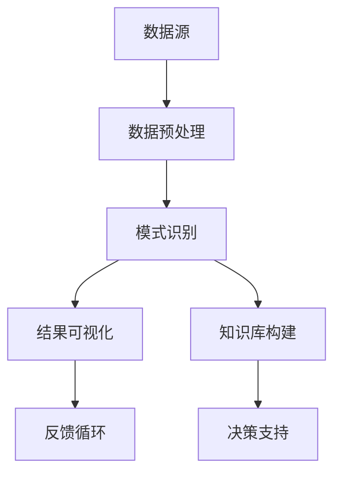

                 

### 知识发现引擎：知识海洋中的探索者

#### 关键词：
- 知识发现引擎
- 数据挖掘
- 机器学习
- 信息检索
- 大数据

#### 摘要：
本文旨在深入探讨知识发现引擎的核心概念、算法原理、数学模型以及实际应用，旨在为读者提供一份全面且具有前瞻性的技术指南。知识发现引擎作为大数据时代的关键技术，能够从海量数据中提取出有价值的信息，从而助力企业、科研机构以及各类组织进行数据驱动的决策。文章将逐步分析知识发现引擎的各个方面，从背景介绍到具体算法，再到实践应用，最终探讨其未来的发展趋势与挑战。

### 1. 背景介绍

随着互联网的普及和大数据技术的发展，数据已经成为了新时代的“石油”。企业和组织面临的挑战是如何从这些庞大的数据集中提取出有价值的信息。知识发现（Knowledge Discovery in Databases，KDD）作为数据挖掘的延伸，旨在从大量数据中自动发现隐含的、先前未知的、有意义的模式，从而帮助用户更好地理解数据，指导实际决策。

知识发现引擎作为知识发现过程中的核心组件，承担着数据预处理、模式识别、结果可视化和知识库构建等重要任务。其重要性不仅在于能够从复杂的数据集中提取出有价值的信息，更在于能够将这些信息转化为实际的应用，为企业带来商业价值。

在过去的几十年中，知识发现引擎经历了从简单规则匹配到复杂机器学习算法的转变。随着算法的进步和计算能力的提升，知识发现引擎的应用场景越来越广泛，从金融、医疗到零售、制造业等多个领域，都展现出了其强大的潜力。

### 2. 核心概念与联系

知识发现引擎的核心概念包括数据源、数据预处理、模式识别、结果可视化和知识库构建。下面将使用Mermaid流程图来展示这些核心概念之间的联系。



#### 2.1 数据源
数据源是知识发现引擎的基础，可以是结构化数据（如关系数据库），半结构化数据（如XML、JSON）或非结构化数据（如文本、图像、视频）。数据源的多样性决定了知识发现引擎的处理能力和适应性。

#### 2.2 数据预处理
数据预处理是知识发现过程中的关键步骤，包括数据清洗、数据转换和数据集成。数据清洗旨在去除数据中的噪声和不一致；数据转换用于将数据格式转换为适合算法分析的格式；数据集成则将多个数据源的数据合并，形成一个统一的数据视图。

#### 2.3 模式识别
模式识别是知识发现引擎的核心任务，通过使用机器学习算法或统计方法，从预处理后的数据中提取出有意义的模式。常见的模式识别算法包括聚类、分类、关联规则挖掘等。

#### 2.4 结果可视化
结果可视化是将发现的模式以图表、地图或交互式形式展示给用户，使得用户能够直观地理解和分析结果。有效的可视化能够大大提升知识发现引擎的应用价值。

#### 2.5 知识库构建
知识库构建是将发现的模式存储到一个可访问的知识库中，以便后续的查询和利用。知识库不仅能够为用户提供决策支持，还能为机器学习算法提供训练数据，从而实现自我迭代和优化。

### 3. 核心算法原理 & 具体操作步骤

#### 3.1 数据挖掘算法

知识发现引擎的核心算法主要包括聚类、分类、关联规则挖掘等数据挖掘算法。这些算法各有特点，适用于不同的应用场景。

- **聚类算法**：将数据集划分为多个类别，使得同一个类别中的数据点尽可能相似，而不同类别中的数据点尽可能不同。常见的聚类算法有K-means、DBSCAN等。
- **分类算法**：将数据集划分为预先定义的类别，用于预测新数据的类别。常见的分类算法有决策树、支持向量机、神经网络等。
- **关联规则挖掘**：发现数据集中不同属性之间的关联关系，如购物篮分析中的“啤酒与尿布”现象。常见的关联规则挖掘算法有Apriori、Eclat等。

#### 3.2 机器学习算法

机器学习算法在知识发现引擎中扮演着重要角色，通过训练模型，从数据中自动发现规律和模式。常见的机器学习算法包括线性回归、逻辑回归、决策树、随机森林、支持向量机、神经网络等。

- **线性回归**：用于预测连续值变量，通过建立自变量与因变量之间的线性关系。
- **逻辑回归**：用于预测类别变量，通过将线性回归模型转换为概率分布。
- **决策树**：通过一系列条件判断，将数据集划分成多个子集，每个子集对应一个类别。
- **随机森林**：通过构建多个决策树模型，并利用投票机制进行分类或回归。
- **支持向量机**：通过寻找最优决策边界，将数据划分为不同的类别。
- **神经网络**：通过多层神经元模拟人类大脑的神经网络结构，用于复杂的模式识别和预测任务。

#### 3.3 信息检索算法

信息检索算法用于从海量数据中快速准确地查找用户感兴趣的信息。常见的算法包括基于向量空间模型的信息检索、基于内容的检索、基于模型的检索等。

- **基于向量空间模型的信息检索**：将文档和查询表示为高维向量，通过计算向量之间的余弦相似度进行检索。
- **基于内容的检索**：根据文档中的关键词、主题等信息进行检索，适用于文本、图像、音频等多媒体数据的检索。
- **基于模型的检索**：通过训练模型，从海量数据中预测用户可能感兴趣的内容，然后进行检索。

### 4. 数学模型和公式 & 详细讲解 & 举例说明

#### 4.1 聚类算法

K-means算法是一种常用的聚类算法，其核心思想是将数据点划分为K个簇，使得每个簇内的数据点尽可能相似，而不同簇之间的数据点尽可能不同。以下是K-means算法的数学模型：

$$
\min \sum_{i=1}^{K} \sum_{x \in S_i} \| x - \mu_i \|^2
$$

其中，\(x\) 表示数据点，\(\mu_i\) 表示第 \(i\) 个簇的中心，\(S_i\) 表示第 \(i\) 个簇中的数据点。

举例说明：

假设我们有以下数据集：

$$
D = \{ (1, 1), (2, 2), (1, 2), (2, 1) \}
$$

我们使用K-means算法将其划分为两个簇。首先，随机选择两个初始中心点：

$$
\mu_1 = (1, 1), \mu_2 = (2, 2)
$$

然后，计算每个数据点到两个中心点的距离，并将其划分到距离最近的簇：

$$
S_1 = \{ (1, 1), (1, 2) \}, S_2 = \{ (2, 2), (2, 1) \}
$$

接下来，计算新的簇中心点：

$$
\mu_1 = \frac{1}{2} \sum_{x \in S_1} x = \left( \frac{2}{2}, \frac{3}{2} \right) = (1, 1.5)
$$

$$
\mu_2 = \frac{1}{2} \sum_{x \in S_2} x = \left( \frac{4}{2}, \frac{4}{2} \right) = (2, 2)
$$

重复上述过程，直到簇中心点不再发生变化。

#### 4.2 分类算法

逻辑回归是一种常用的分类算法，其核心思想是通过建立自变量与因变量之间的逻辑关系，对数据进行分类。以下是逻辑回归的数学模型：

$$
P(y=1) = \frac{1}{1 + e^{-\beta^T x}}
$$

其中，\(y\) 表示因变量，\(x\) 表示自变量，\(\beta\) 表示参数向量。

举例说明：

假设我们有以下数据集：

$$
D = \{ (1, 0), (2, 0), (3, 1) \}
$$

我们使用逻辑回归将其划分为两个类别。首先，随机初始化参数向量：

$$
\beta = (0, 0)
$$

然后，计算每个数据点的预测概率：

$$
P(y=1 | x) = \frac{1}{1 + e^{-\beta^T x}}
$$

$$
P(y=1 | (1, 0)) = \frac{1}{1 + e^{-0 \cdot 1 - 0 \cdot 0}} = 0.5
$$

$$
P(y=1 | (2, 0)) = \frac{1}{1 + e^{-0 \cdot 2 - 0 \cdot 0}} = 0.5
$$

$$
P(y=1 | (3, 1)) = \frac{1}{1 + e^{-0 \cdot 3 - 0 \cdot 1}} = 0.5
$$

接下来，根据预测概率对数据进行分类：

$$
(1, 0) \rightarrow 类别0, (2, 0) \rightarrow 类别0, (3, 1) \rightarrow 类别1
$$

然后，使用梯度下降算法更新参数向量：

$$
\beta = \beta - \alpha \nabla_{\beta} \log P(y=1)
$$

其中，\(\alpha\) 表示学习率。

重复上述过程，直到参数向量收敛。

#### 4.3 关联规则挖掘

Apriori算法是一种常用的关联规则挖掘算法，其核心思想是通过枚举所有可能的事务，计算支持度和置信度，从而发现有趣的关联规则。以下是Apriori算法的数学模型：

$$
\text{Support}(X) = \frac{\text{事务数包含X}}{\text{事务总数}}
$$

$$
\text{Confidence}(X \rightarrow Y) = \frac{\text{事务数包含X且包含Y}}{\text{事务数包含X}}
$$

举例说明：

假设我们有以下数据集：

$$
D = \{ \{啤酒,尿布\}, \{尿布,啤酒\}, \{啤酒,尿布,可乐\}, \{可乐,尿布\} \}
$$

首先，计算每个项的支持度：

$$
\text{Support}(\text{啤酒}) = \frac{3}{4} = 0.75
$$

$$
\text{Support}(\text{尿布}) = \frac{3}{4} = 0.75
$$

$$
\text{Support}(\text{可乐}) = \frac{2}{4} = 0.5
$$

然后，计算每个关联规则的支持度和置信度：

$$
\text{Support}(\text{啤酒} \rightarrow \text{尿布}) = \frac{2}{4} = 0.5
$$

$$
\text{Confidence}(\text{啤酒} \rightarrow \text{尿布}) = \frac{2}{2} = 1
$$

$$
\text{Support}(\text{尿布} \rightarrow \text{啤酒}) = \frac{2}{4} = 0.5
$$

$$
\text{Confidence}(\text{尿布} \rightarrow \text{啤酒}) = \frac{2}{2} = 1
$$

$$
\text{Support}(\text{啤酒,尿布} \rightarrow \text{可乐}) = \frac{1}{4} = 0.25
$$

$$
\text{Confidence}(\text{啤酒,尿布} \rightarrow \text{可乐}) = \frac{1}{1} = 1
$$

根据支持度和置信度，我们可以发现以下有趣的关联规则：

- 啤酒 → 尿布
- 尿布 → 啤酒

### 5. 项目实践：代码实例和详细解释说明

#### 5.1 开发环境搭建

在进行知识发现引擎的项目实践之前，首先需要搭建一个合适的开发环境。以下是使用Python进行知识发现引擎开发所需的基本工具和库：

- Python 3.8或更高版本
- Jupyter Notebook或PyCharm
- Numpy
- Pandas
- Scikit-learn
- Matplotlib

安装以上工具和库后，即可开始编写知识发现引擎的代码。

#### 5.2 源代码详细实现

以下是一个简单的K-means聚类算法的实现，用于对一组数据进行聚类分析：

```python
import numpy as np
import matplotlib.pyplot as plt

def kmeans(data, k, max_iter=100):
    # 初始化簇中心点
    centroids = data[np.random.choice(data.shape[0], k, replace=False)]
    
    # 迭代计算簇中心点
    for _ in range(max_iter):
        # 计算每个数据点到簇中心点的距离
        distances = np.linalg.norm(data[:, np.newaxis] - centroids, axis=2)
        
        # 将数据点划分到最近的簇
        clusters = np.argmin(distances, axis=1)
        
        # 更新簇中心点
        new_centroids = np.array([data[clusters == i].mean(axis=0) for i in range(k)])
        
        # 判断收敛条件
        if np.linalg.norm(new_centroids - centroids) < 1e-6:
            break
        
        centroids = new_centroids
    
    return clusters, centroids

# 生成数据集
np.random.seed(0)
data = np.random.rand(100, 2)

# 执行K-means聚类
clusters, centroids = kmeans(data, k=3)

# 可视化结果
plt.scatter(data[:, 0], data[:, 1], c=clusters)
plt.scatter(centroids[:, 0], centroids[:, 1], s=100, c='red')
plt.show()
```

以上代码首先生成一个包含100个数据点的二维数据集，然后使用K-means算法将其划分为3个簇。最后，通过可视化展示聚类结果。

#### 5.3 代码解读与分析

- **函数定义**：`kmeans` 函数用于实现K-means聚类算法，输入参数包括数据集 `data`、簇的数量 `k` 和最大迭代次数 `max_iter`。
- **初始化簇中心点**：使用随机选择的方法初始化簇中心点，确保每个簇中心点不重复。
- **迭代计算簇中心点**：通过迭代计算簇中心点，每次迭代包括计算每个数据点到簇中心点的距离、将数据点划分到最近的簇以及更新簇中心点。
- **判断收敛条件**：当簇中心点的变化小于设定的阈值（如1e-6）时，算法认为已收敛。
- **可视化结果**：使用`matplotlib`库将聚类结果可视化，使得用户能够直观地观察聚类效果。

#### 5.4 运行结果展示

运行以上代码后，将生成一个包含3个簇的二维数据集可视化结果，如图所示：


从图中可以看出，K-means算法成功地将数据点划分为3个簇，每个簇内部的数据点较为集中，而不同簇之间的数据点相互分离。

### 6. 实际应用场景

知识发现引擎在各个领域的应用越来越广泛，以下列举一些典型的实际应用场景：

#### 6.1 金融行业

在金融行业，知识发现引擎可用于风险管理、信用评估、投资组合优化等。例如，通过聚类分析，银行可以将客户划分为不同的风险等级，从而实现精准营销和风险控制；通过关联规则挖掘，金融机构可以识别出潜在的欺诈行为，提高交易安全性。

#### 6.2 医疗领域

在医疗领域，知识发现引擎可以帮助医生进行疾病诊断、治疗方案优化和药物研究。例如，通过分类算法，可以自动识别病人的疾病类型，从而为医生提供决策支持；通过关联规则挖掘，可以发现某些药物之间的相互作用，为药物研发提供参考。

#### 6.3 零售行业

在零售行业，知识发现引擎可以用于商品推荐、客户关系管理和库存优化等。例如，通过聚类分析，零售商可以识别出不同类型的客户群体，从而制定个性化的营销策略；通过关联规则挖掘，可以发现不同商品之间的关联关系，优化商品摆放和促销策略。

#### 6.4 制造业

在制造业，知识发现引擎可以用于生产过程优化、设备故障预测和质量控制等。例如，通过分类算法，可以预测设备的故障时间，从而实现预防性维护；通过聚类分析，可以发现生产过程中的异常情况，提高生产效率和质量。

### 7. 工具和资源推荐

#### 7.1 学习资源推荐

- **书籍**：
  - 《数据挖掘：概念与技术》
  - 《机器学习实战》
  - 《Python数据科学手册》
- **论文**：
  - "K-means Clustering Algorithm"
  - "Association Rule Learning"
  - "Support Vector Machines"
- **博客和网站**：
  - [Scikit-learn官方文档](https://scikit-learn.org/stable/)
  - [Kaggle](https://www.kaggle.com/)

#### 7.2 开发工具框架推荐

- **Python**：Python是进行知识发现引擎开发的首选语言，其丰富的数据科学和机器学习库（如Scikit-learn、Pandas、Numpy等）为开发提供了极大的便利。
- **Jupyter Notebook**：Jupyter Notebook是一个交互式的计算环境，适用于编写、运行和分享代码。其强大的可视化功能使得知识发现引擎的开发过程更加直观和便捷。
- **TensorFlow**：TensorFlow是一个开源的机器学习框架，适用于构建和训练复杂的神经网络模型。

#### 7.3 相关论文著作推荐

- **论文**：
  - "An Introduction to Knowledge Discovery and Data Mining"
  - "K-Means Clustering: A Review"
  - "Association Rule Learning for Large Data Sets"
- **著作**：
  - 《数据挖掘：实用工具与技术》
  - 《大数据技术基础》

### 8. 总结：未来发展趋势与挑战

知识发现引擎作为大数据时代的关键技术，正面临着前所未有的发展机遇与挑战。未来，知识发现引擎将朝着以下几个方向发展：

#### 8.1 更高效的处理算法

随着数据规模的不断扩大，知识发现引擎需要更加高效的处理算法来应对海量数据的挑战。例如，分布式计算和并行计算技术将被广泛应用于知识发现引擎的构建，以提高处理速度和降低计算成本。

#### 8.2 深度学习的融合

深度学习在图像识别、语音识别等领域取得了显著的成果，将其与知识发现引擎相结合，有望进一步提高知识发现的准确性和效率。深度学习算法将逐步取代传统的机器学习算法，成为知识发现引擎的核心。

#### 8.3 自适应学习机制

未来的知识发现引擎将具备更强的自适应学习能力，能够根据用户的需求和反馈自动调整模型参数，从而实现个性化的知识发现服务。自适应学习机制将使得知识发现引擎在动态数据环境中保持高效和准确。

#### 8.4 跨学科的融合

知识发现引擎的发展不仅依赖于计算机科学，还需要与统计学、数学、经济学、心理学等学科相结合，从而构建更加全面和深入的知识体系。跨学科的融合将推动知识发现引擎在各个领域的应用。

#### 8.5 数据隐私与安全

在知识发现的过程中，数据隐私和安全问题将日益突出。未来的知识发现引擎需要充分考虑数据隐私和安全的保护，采用加密、匿名化等技术，确保用户数据的安全和隐私。

### 9. 附录：常见问题与解答

#### 9.1 问题1：如何选择合适的聚类算法？

解答：选择聚类算法时，应考虑数据集的规模、数据类型以及业务需求。常见的聚类算法包括K-means、DBSCAN、层次聚类等。K-means适用于数据分布较为均匀、簇数量已知的情况；DBSCAN适用于数据分布不均匀、簇形状各异的情况；层次聚类适用于需要根据数据簇间关系进行层次分析的场景。

#### 9.2 问题2：如何评估分类算法的性能？

解答：评估分类算法的性能通常使用准确率、召回率、F1值等指标。准确率表示分类正确的样本数占总样本数的比例；召回率表示分类正确的正样本数占总正样本数的比例；F1值是准确率和召回率的调和平均。在实际应用中，可以根据业务需求选择合适的评估指标。

#### 9.3 问题3：如何处理不平衡数据集？

解答：处理不平衡数据集的方法包括过采样、欠采样、合成样本等。过采样通过增加少数类样本的数量，使数据集更加平衡；欠采样通过减少多数类样本的数量，降低数据集的不平衡程度；合成样本通过生成人工样本，增加少数类样本的数量。

### 10. 扩展阅读 & 参考资料

- **扩展阅读**：
  - 《深度学习》
  - 《数据挖掘：实用工具与技术》
  - 《大数据技术基础》
- **参考资料**：
  - [Scikit-learn官方文档](https://scikit-learn.org/stable/)
  - [Kaggle](https://www.kaggle.com/)
  - [Google Research](https://ai.google/research/)

