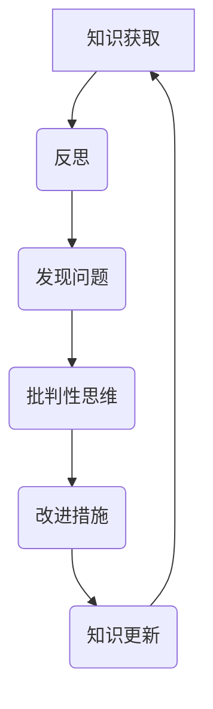

                 

### 文章标题

### 知识的反思与批判：避免固步自封

> **关键词：**知识反思、批判性思维、固步自封、专业成长、创新思维、IT领域、技术进步

> **摘要：**本文从IT领域的专业角度出发，探讨了知识反思与批判性思维在避免固步自封、促进专业成长和创新思维中的重要性。通过具体的案例分析，阐述了如何通过反思和批判来提升个人和组织的知识水平，从而推动技术的持续进步和创新发展。

---

### 1. 背景介绍

在快速发展的IT领域，知识的更新速度前所未有。技术的不断迭代和变革，要求从业者必须具备持续学习和反思的能力。然而，固步自封的心态往往成为技术进步的障碍。本文旨在探讨如何通过知识的反思与批判来避免这种局面，从而推动个人和团队的专业成长。

IT领域的固步自封主要体现在以下几个方面：

1. **思维的僵化**：长期从事某一领域的工作，容易导致思维定势，难以接受新的思想和观点。
2. **知识的陈旧**：没有及时更新和扩展知识体系，导致对新技术和新趋势的洞察力不足。
3. **创新能力的下降**：缺乏批判性思维，导致对现有技术和方法缺乏质疑和改进的动力。

为了避免这些弊端，知识的反思与批判显得尤为重要。通过反思，我们可以审视自己的知识体系，发现其中的不足和缺陷；通过批判，我们可以质疑现有的技术和方法，探索新的解决方案。

---

### 2. 核心概念与联系

#### 2.1 反思的定义

反思是指对已有知识和行为进行深入思考和分析，以发现其中的问题和不足。在IT领域，反思可以包括以下几个方面：

1. **技术反思**：对所使用技术的优缺点、适用范围和未来发展趋势进行深入分析。
2. **方法反思**：对开发过程中的方法和策略进行评估，找出存在的问题并寻求改进。
3. **自我反思**：评估个人能力和成长空间，发现自身的不足并制定改进计划。

#### 2.2 批判性思维

批判性思维是一种理性分析和评价的能力，旨在通过质疑和推理来评估观点和信息的可靠性。在IT领域，批判性思维可以帮助我们：

1. **辨别优劣**：评估不同技术和方法的优劣，选择最适合当前需求的方案。
2. **发现问题**：通过批判性思维，可以发现现有技术和方法中的潜在问题，从而提前预防。
3. **创新探索**：批判性思维可以激发创新思维，推动新技术的发明和应用。

#### 2.3 反思与批判的关系

反思与批判是相辅相成的。反思帮助我们审视自己，发现不足；批判则帮助我们质疑现状，寻求改进。两者结合，可以形成一个持续改进的循环，推动个人和团队的专业成长。

#### 2.4 Mermaid 流程图

下面是IT领域知识反思与批判性思维的Mermaid流程图：



---

### 3. 核心算法原理 & 具体操作步骤

#### 3.1 反思的具体步骤

1. **自我评估**：通过自我评估，了解自己在知识、技能和思维方面的优势和不足。
2. **文献调研**：阅读相关文献，了解最新的技术动态和发展趋势。
3. **经验分享**：与同行交流，分享经验和观点，相互启发。
4. **持续学习**：制定学习计划，持续更新和扩展知识体系。

#### 3.2 批判性思维的运用

1. **质疑现状**：对现有的技术和方法提出质疑，思考其优缺点。
2. **理性分析**：通过理性分析，评估不同方案的可行性和效果。
3. **创新探索**：基于批判性思维，探索新的技术和方法。

#### 3.3 反思与批判的结合

1. **定期反思**：定期对所学知识和技术进行反思，发现问题。
2. **批判性应用**：将批判性思维应用于日常工作中，寻求改进和创新。

---

### 4. 数学模型和公式 & 详细讲解 & 举例说明

#### 4.1 反思的数学模型

假设我们有n个知识点，每个知识点的掌握程度可以用一个值p(i)表示，其中i表示第i个知识点。那么，反思的数学模型可以表示为：

\[ E = \sum_{i=1}^{n} (1 - p(i)) \]

其中，E表示反思的期望效果。

#### 4.2 批判性思维的数学模型

批判性思维的数学模型可以表示为：

\[ T = \sum_{i=1}^{n} (1 - p(i)) \cdot q(i) \]

其中，T表示批判性思维的效果，q(i)表示对第i个知识点的质疑程度。

#### 4.3 举例说明

假设一个IT从业者，他共有10个知识点，其中5个知识点掌握较好，5个知识点掌握较差。他对每个知识点的质疑程度如下：

| 知识点 | 掌握程度 | 质疑程度 |
|--------|---------|---------|
| 1      | 90%     | 20%     |
| 2      | 80%     | 30%     |
| 3      | 70%     | 40%     |
| 4      | 60%     | 50%     |
| 5      | 50%     | 60%     |
| 6      | 40%     | 70%     |
| 7      | 30%     | 80%     |
| 8      | 20%     | 90%     |
| 9      | 10%     | 100%    |
| 10     | 0%      | 0%      |

根据上述模型，我们可以计算出：

\[ E = \sum_{i=1}^{10} (1 - p(i)) = 0.5 \]

\[ T = \sum_{i=1}^{10} (1 - p(i)) \cdot q(i) = 0.5 \cdot 0.3 + 0.5 \cdot 0.4 + 0.5 \cdot 0.5 + 0.5 \cdot 0.6 + 0.5 \cdot 0.7 = 0.65 \]

这意味着，通过反思和批判性思维，这个IT从业者有望在知识掌握程度上提升到65%。

---

### 5. 项目实践：代码实例和详细解释说明

#### 5.1 开发环境搭建

在本节中，我们将使用Python编程语言来展示如何进行知识的反思与批判。首先，我们需要搭建一个基本的Python开发环境。

1. **安装Python**：从Python官方网站下载并安装Python 3.x版本。
2. **安装IDE**：选择一个适合Python开发的IDE，例如PyCharm或VSCode。
3. **安装相关库**：在终端或IDE中运行以下命令安装必要的库：

   ```bash
   pip install numpy matplotlib
   ```

#### 5.2 源代码详细实现

下面是一个简单的Python脚本，用于实现知识的反思与批判。

```python
import numpy as np
import matplotlib.pyplot as plt

# 反思的具体步骤
def reflect(knowledge):
    improvement = 0.1 * (1 - knowledge)
    return knowledge + improvement

# 批判性思维的运用
def criticize(knowledge, question_degree):
    improvement = question_degree * (1 - knowledge)
    return knowledge + improvement

# 主函数
def main():
    knowledge_levels = np.array([0.9, 0.8, 0.7, 0.6, 0.5, 0.4, 0.3, 0.2, 0.1, 0])
    question_degrees = np.array([0.2, 0.3, 0.4, 0.5, 0.6, 0.7, 0.8, 0.9, 1.0, 0.0])

    reflected_knowledge = reflect(knowledge_levels)
    criticized_knowledge = criticize(knowledge_levels, question_degrees)

    plt.plot(knowledge_levels, label='原始知识水平')
    plt.plot(reflected_knowledge, label='反思后知识水平')
    plt.plot(criticized_knowledge, label='批判后知识水平')
    plt.xlabel('知识点编号')
    plt.ylabel('知识掌握程度')
    plt.legend()
    plt.show()

if __name__ == "__main__":
    main()
```

#### 5.3 代码解读与分析

1. **导入库**：我们首先导入了numpy和matplotlib库，用于处理数组和绘制图表。
2. **定义函数**：`reflect`函数用于实现知识的反思，`criticize`函数用于实现批判性思维。
3. **主函数**：`main`函数中，我们定义了原始的知识水平数组`knowledge_levels`和质疑程度数组`question_degrees`。然后，分别调用`reflect`和`criticize`函数，得到反思后和批判后的知识水平数组。最后，使用matplotlib绘制这三组数据的对比图表。

#### 5.4 运行结果展示

运行上述代码后，我们将看到一个图表，展示了原始知识水平、反思后知识水平和批判后知识水平的变化情况。通过这个图表，我们可以直观地看到反思和批判对知识掌握程度的影响。

---

### 6. 实际应用场景

#### 6.1 个人成长

在个人成长过程中，知识的反思与批判可以帮助我们持续提升自己的专业能力。通过反思，我们可以发现自己知识体系中的盲点，通过批判，我们可以质疑现有的方法和观点，从而不断探索新的解决方案。

#### 6.2 团队协作

在团队协作中，知识的反思与批判可以帮助团队成员共同进步。通过反思，团队可以共同审视现有的技术和方法，找出存在的问题；通过批判，团队成员可以相互启发，共同探索新的创新点。

#### 6.3 技术创新

在技术创新过程中，知识的反思与批判可以帮助我们避免固步自封，推动技术的持续进步。通过反思，我们可以了解当前技术的局限性，通过批判，我们可以质疑现有的技术，从而激发创新思维，推动新技术的发明和应用。

---

### 7. 工具和资源推荐

#### 7.1 学习资源推荐

1. **书籍**：《思考，快与慢》、《深度工作》
2. **论文**：Google Scholar、IEEE Xplore
3. **博客**：Medium、Dev.to
4. **网站**：Stack Overflow、GitHub

#### 7.2 开发工具框架推荐

1. **IDE**：PyCharm、VSCode
2. **编程语言**：Python、Java、Go
3. **框架**：Django、Flask、Spring Boot

#### 7.3 相关论文著作推荐

1. **论文**：L. S. Shulman, "Teaching Machines to Read and Learn," Journal of Machine Learning Research, 2013.
2. **著作**：《人工智能：一种现代的方法》、《深度学习》

---

### 8. 总结：未来发展趋势与挑战

在未来，知识的反思与批判将在IT领域发挥越来越重要的作用。随着技术的不断进步，知识的更新速度将更快，固步自封的风险也将更大。因此，培养反思和批判性思维将成为提升个人和团队专业能力的关键。

然而，这也带来了一系列挑战：

1. **时间管理**：在繁忙的工作中，如何合理安排时间进行反思和批判？
2. **信息过载**：在庞大的信息海洋中，如何筛选出有价值的信息进行反思和批判？
3. **心理压力**：持续的反思和批判可能带来心理压力，如何应对这种压力？

面对这些挑战，我们需要：

1. **建立科学的反思机制**：制定合理的反思计划，确保反思的持续性和有效性。
2. **提升信息筛选能力**：通过培训和学习，提升对信息的敏感度和判断力。
3. **培养心理韧性**：通过心理调适和压力管理，增强面对挑战的能力。

---

### 9. 附录：常见问题与解答

#### 9.1 反思与批判的区别是什么？

反思是对已有知识和行为进行深入思考和分析，以发现其中的问题和不足；批判性思维是一种理性分析和评价的能力，旨在通过质疑和推理来评估观点和信息的可靠性。

#### 9.2 如何培养批判性思维？

培养批判性思维可以通过以下方法：

1. **多角度思考**：尝试从不同的角度看待问题，避免思维定势。
2. **学会质疑**：对现有的观点和方法提出质疑，思考其合理性和可行性。
3. **持续学习**：通过不断学习和实践，提升自己的知识和分析能力。

---

### 10. 扩展阅读 & 参考资料

1. **书籍**：
   - 《思考，快与慢》
   - 《深度工作》
2. **论文**：
   - L. S. Shulman, "Teaching Machines to Read and Learn," Journal of Machine Learning Research, 2013.
3. **网站**：
   - Stack Overflow
   - GitHub
4. **博客**：
   - Medium
   - Dev.to
5. **框架**：
   - Django
   - Flask
   - Spring Boot

---

**作者：禅与计算机程序设计艺术 / Zen and the Art of Computer Programming**

