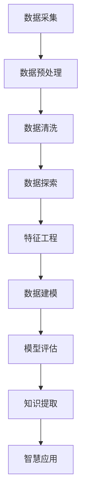

                 

### 背景介绍

#### 人工智能的崛起

随着信息技术的飞速发展，人工智能（AI）已经成为当今世界最为热门的领域之一。从最初的机器学习（Machine Learning）到深度学习（Deep Learning），再到现在的强化学习（Reinforcement Learning），人工智能的技术不断进步，应用领域也在不断扩展。无论是在医疗、金融、教育还是制造业，人工智能都展现出了巨大的潜力和价值。

#### 数据的积累与爆发

人工智能的发展离不开数据的支持。随着互联网的普及和智能设备的广泛应用，数据的产生速度和规模都在呈指数级增长。这些数据不仅是企业决策的重要依据，也是人工智能算法训练和优化的关键资源。然而，面对如此庞大的数据量，如何有效地提取、处理和分析数据，成为了人工智能领域亟待解决的问题。

#### 智慧的转化与提升

在数据积累到一定程度后，如何将数据转化为实际的智慧和决策，成为了人工智能面临的另一个重要挑战。传统的数据分析方法往往只能处理结构化数据，而对于非结构化数据，如文本、图像和语音等，传统方法的处理效果有限。因此，如何将非结构化数据转化为有用的信息，并将其应用于实际问题中，是人工智能领域需要深入探索的方向。

#### 从数据到智慧的跨越

本文将探讨从数据到智慧的跨越这一核心主题。通过分析数据、提取知识、建立模型和优化算法，我们希望能够实现数据与智慧的有机结合，从而推动人工智能技术的进一步发展。本文将围绕以下几个核心问题展开讨论：

1. 数据如何转化为知识？
2. 知识如何转化为智慧？
3. 智慧如何应用于实际问题？
4. 当前技术在这些方面的应用和挑战是什么？

通过对这些问题的深入探讨，本文希望能够为人工智能领域的研究者和从业者提供一些有价值的思考和启示。

#### 文章的组织结构

本文将分为十个主要部分，具体如下：

1. **背景介绍**：概述人工智能、数据积累和智慧转化的背景。
2. **核心概念与联系**：介绍与本文主题相关的重要概念和流程。
3. **核心算法原理 & 具体操作步骤**：详细解释数据转化为知识的方法。
4. **数学模型和公式 & 详细讲解 & 举例说明**：阐述数据转化为知识过程中的数学原理。
5. **项目实践：代码实例和详细解释说明**：通过实际项目展示数据转化为智慧的过程。
6. **实际应用场景**：分析人工智能技术在各个领域的应用。
7. **工具和资源推荐**：推荐相关学习资源和开发工具。
8. **总结：未来发展趋势与挑战**：总结当前技术的进展和未来的发展方向。
9. **附录：常见问题与解答**：解答读者可能遇到的问题。
10. **扩展阅读 & 参考资料**：提供更多深入的阅读材料。

通过以上结构的安排，本文将系统地探讨从数据到智慧的跨越这一主题，希望能够为读者提供全面、深入的见解。接下来，我们将详细讨论这些核心概念和流程，为读者揭示这一过程的奥秘。

### 核心概念与联系

在探讨从数据到智慧的跨越这一主题之前，我们需要先了解一些核心概念，这些概念是我们整个分析过程的基础。以下是本文涉及的主要概念：

#### 数据

数据是人工智能的基石，它包括结构化数据、半结构化数据和非结构化数据。结构化数据通常是指以表格形式存储的数据，如数据库中的记录；半结构化数据包括XML、JSON等格式；非结构化数据则包括文本、图像、语音等。

#### 知识

知识是对数据的理解、提炼和抽象。它通常是通过数据分析、机器学习和数据挖掘等方法从数据中提取出来的。知识可以是显式知识，如数据库中的信息，也可以是隐式知识，如通过对大量数据的分析得出的规律和趋势。

#### 智慧

智慧是对知识的运用和扩展，它能够解决实际问题、做出决策。智慧不仅仅是知识的简单堆砌，更是对知识的深层次理解和应用。例如，通过数据分析得出的趋势预测，可以帮助企业做出经营决策。

#### 数据流与知识流

数据流是指数据从产生、传输到处理的全过程。知识流则是在数据流的基础上，通过分析、提取、建模等步骤将数据转化为知识的过程。

#### 模型与算法

模型是知识的表现形式，它可以是数学公式、决策树、神经网络等。算法则是实现模型的方法和步骤，如支持向量机（SVM）、决策树、深度学习等。

#### Mermaid 流程图

为了更好地理解数据转化为知识的过程，我们可以使用 Mermaid 流程图来展示整个流程。以下是数据转化为知识的简化流程图：



在上述流程中，数据采集是第一步，通过传感器、数据库等方式获取数据。接下来，数据预处理包括数据清洗和数据探索，这一步旨在消除数据中的噪声和异常，并发现数据中的潜在关系。然后是特征工程，通过提取和构造特征来提高模型的性能。随后，数据建模和模型评估是核心步骤，通过选择合适的模型和评估指标来评估模型的性能。最后，通过知识提取，将模型转化为有用的知识，并应用于实际问题中。

#### 关键技术与工具

为了实现上述流程，我们需要使用一系列关键技术和工具。以下是一些常用的技术和工具：

1. **数据分析工具**：如Pandas、NumPy、SciPy等。
2. **数据可视化工具**：如Matplotlib、Seaborn、Plotly等。
3. **机器学习库**：如Scikit-learn、TensorFlow、PyTorch等。
4. **深度学习框架**：如TensorFlow、PyTorch、Keras等。
5. **自然语言处理库**：如NLTK、spaCy、TextBlob等。

#### 数据库

数据库是存储和管理数据的重要工具。常见的数据库包括关系型数据库（如MySQL、PostgreSQL）和非关系型数据库（如MongoDB、Cassandra）。数据库不仅用于存储数据，还可以提供高效的数据查询和索引功能。

#### 大数据技术

随着数据量的不断增加，大数据技术应运而生。Hadoop、Spark等大数据处理框架可以高效地处理海量数据，并提供分布式计算和存储能力。

通过以上对核心概念和流程的介绍，我们已经为后续的内容奠定了基础。接下来，我们将深入探讨数据转化为知识的具体方法和步骤，以及如何将这些知识应用于实际问题中。

#### 核心算法原理 & 具体操作步骤

在数据转化为知识的过程中，核心算法扮演着至关重要的角色。这些算法不仅帮助我们理解数据的内在规律，还能够从中提取出有用的信息，为后续的决策提供支持。以下是几种常见的核心算法及其具体操作步骤：

##### 1. 机器学习算法

机器学习算法是数据转化为知识的重要工具，它通过学习数据中的模式来预测新的数据。以下是几种常用的机器学习算法及其步骤：

###### a. 决策树（Decision Tree）

**原理**：决策树是一种树形结构，通过一系列的规则对数据进行分类或回归。

**步骤**：

1. **特征选择**：选择最优的特征进行划分。
2. **切分数据**：根据选定的特征，将数据集划分为子集。
3. **重复步骤**：对子集继续进行划分，直到满足停止条件（如最大深度、最小样本数等）。
4. **构建树结构**：将划分的结果表示为树形结构。

###### b. 支持向量机（SVM）

**原理**：SVM通过寻找最佳的超平面来对数据进行分类。

**步骤**：

1. **特征选择**：选择合适的特征。
2. **样本标准化**：对数据进行标准化处理。
3. **构建模型**：通过求解最优化问题来确定超平面。
4. **模型评估**：使用交叉验证等方法评估模型的性能。

###### c. 随机森林（Random Forest）

**原理**：随机森林是由多个决策树组成的集成模型，通过多数投票来决定分类结果。

**步骤**：

1. **特征选择**：随机选择特征。
2. **构建决策树**：对每个特征随机划分数据。
3. **集成模型**：将多个决策树的结果进行集成。
4. **模型评估**：评估集成模型的性能。

##### 2. 深度学习算法

深度学习算法是机器学习的一种重要分支，它通过模拟人脑的神经网络结构来处理复杂数据。

###### a. 卷积神经网络（CNN）

**原理**：CNN通过卷积层提取图像的特征。

**步骤**：

1. **输入层**：接收图像数据。
2. **卷积层**：通过卷积操作提取特征。
3. **池化层**：对特征进行降采样。
4. **全连接层**：对特征进行分类。

###### b. 循环神经网络（RNN）

**原理**：RNN通过记忆功能处理序列数据。

**步骤**：

1. **输入层**：接收序列数据。
2. **隐藏层**：通过循环连接保存历史信息。
3. **输出层**：对序列进行分类或预测。

###### c. 生成对抗网络（GAN）

**原理**：GAN由生成器和判别器组成，通过对抗训练生成逼真的数据。

**步骤**：

1. **生成器**：生成虚假数据。
2. **判别器**：判断数据是真实还是虚假。
3. **对抗训练**：生成器和判别器相互对抗，不断优化模型。

##### 3. 数据挖掘算法

数据挖掘算法用于从大量数据中提取出有价值的模式。

###### a. 关联规则挖掘（Apriori算法）

**原理**：Apriori算法通过发现频繁项集来挖掘关联规则。

**步骤**：

1. **确定支持度阈值**：确定哪些项集是频繁的。
2. **生成频繁项集**：通过逐层递归的方式生成频繁项集。
3. **生成关联规则**：根据频繁项集生成关联规则。

###### b. 聚类算法（K-means）

**原理**：K-means通过将数据分为K个簇来发现数据的分布。

**步骤**：

1. **初始化簇中心**：随机选择K个数据点作为初始簇中心。
2. **分配数据点**：将每个数据点分配到最近的簇中心。
3. **更新簇中心**：计算每个簇的中心点。
4. **重复步骤**：直到簇中心不再变化或达到最大迭代次数。

通过以上核心算法的介绍，我们可以看到，数据转化为知识的过程是一个复杂且多层次的过程。接下来，我们将进一步探讨这些算法背后的数学模型和公式，以帮助读者更好地理解这些算法的原理。

#### 数学模型和公式 & 详细讲解 & 举例说明

在数据转化为知识的过程中，数学模型和公式起到了关键作用。这些模型和公式不仅帮助我们理解数据背后的规律，还能指导我们进行有效的数据分析和知识提取。以下是一些重要的数学模型和公式的详细讲解，以及相关的实际应用举例。

##### 1. 决策树模型

决策树是一种常用的机器学习模型，它通过一系列的规则对数据进行分类或回归。其核心在于如何选择最优的特征进行划分。

**决策树模型公式**：

决策树的核心在于计算每个特征划分数据的损失函数。常见的损失函数有信息增益（Information Gain）和基尼不纯度（Gini Impurity）。

信息增益的计算公式为：

\[ IG(D, A) = H(D) - \sum_{v \in A} \frac{|D_v|}{|D|} H(D_v) \]

其中，\( H(D) \) 是数据 \( D \) 的熵，\( D_v \) 是数据集 \( D \) 中特征 \( A \) 取值 \( v \) 的部分。

基尼不纯度的计算公式为：

\[ GI(D, A) = 1 - \sum_{v \in A} \left(\frac{|D_v|}{|D|}\right)^2 \]

举例说明：

假设我们有一个包含年龄和收入的数据集，我们需要选择一个特征进行划分。使用信息增益公式，我们可以计算出每个特征的增益，然后选择增益最大的特征进行划分。

##### 2. 支持向量机模型

支持向量机（SVM）是一种强大的分类模型，它通过寻找最佳的超平面来对数据进行分类。

**支持向量机公式**：

SVM的核心在于求解最优化问题：

\[ \min_{\beta, \beta_0} \frac{1}{2} ||\beta||^2 + C \sum_{i=1}^{n} \max(0, 1 - y_i (\beta^T x_i + \beta_0)) \]

其中，\( \beta \) 是权重向量，\( \beta_0 \) 是偏置，\( C \) 是正则化参数，\( y_i \) 是样本 \( x_i \) 的标签。

举例说明：

假设我们有一个二分类问题，数据集包含特征向量和标签。通过求解上述最优化问题，我们可以得到最佳的超平面，并将其用于分类新数据。

##### 3. 卷积神经网络模型

卷积神经网络（CNN）是一种用于处理图像数据的深度学习模型。它通过卷积层提取图像的特征。

**卷积神经网络公式**：

CNN的核心在于卷积操作和池化操作。卷积操作的公式为：

\[ (f * g)(x) = \sum_{y} f(y) g(x-y) \]

其中，\( f \) 和 \( g \) 分别表示卷积核和输入特征图，\( x \) 表示输入点。

举例说明：

假设我们有一个图像数据集，我们需要通过CNN提取特征。首先，我们对图像进行卷积操作，然后通过池化操作降低特征图的维度。接下来，我们将这些特征传递到全连接层进行分类。

##### 4. 循环神经网络模型

循环神经网络（RNN）是一种用于处理序列数据的深度学习模型。它通过记忆功能处理序列数据。

**循环神经网络公式**：

RNN的核心在于隐藏状态和输入状态的更新。更新公式为：

\[ h_t = \sigma(W_h h_{t-1} + W_x x_t + b_h) \]

其中，\( h_t \) 表示当前时刻的隐藏状态，\( x_t \) 表示当前时刻的输入状态，\( W_h \) 和 \( W_x \) 分别表示权重矩阵，\( b_h \) 表示偏置。

举例说明：

假设我们有一个序列数据集，我们需要通过RNN处理这些序列。首先，我们对序列数据进行编码，然后通过RNN的更新公式计算隐藏状态。接下来，我们将隐藏状态传递到输出层进行分类或预测。

##### 5. 生成对抗网络模型

生成对抗网络（GAN）是一种用于生成数据的深度学习模型。它由生成器和判别器组成，通过对抗训练生成逼真的数据。

**生成对抗网络公式**：

GAN的核心在于生成器和判别器的对抗训练。生成器的目标是生成逼真的数据，判别器的目标是区分真实数据和生成数据。

生成器的公式为：

\[ G(z) = \mathcal{N}(z|\mu_G, \sigma_G^2) \]

判别器的公式为：

\[ D(x) = \sigma(W_D x + b_D) \]

其中，\( z \) 表示输入噪声，\( x \) 表示真实数据或生成数据，\( \mu_G \) 和 \( \sigma_G^2 \) 分别表示生成器的均值和方差，\( W_D \) 和 \( b_D \) 分别表示判别器的权重和偏置。

举例说明：

假设我们有一个数据集，我们需要通过GAN生成新的数据。首先，我们生成器生成数据，然后判别器对真实数据和生成数据进行分类。接下来，我们根据判别器的分类结果调整生成器和判别器的参数，以达到更好的生成效果。

通过以上数学模型和公式的讲解，我们可以看到，数据转化为知识的过程是一个复杂且多层次的过程。这些模型和公式为我们提供了有效的工具和方法，帮助我们更好地理解和分析数据。在实际应用中，我们可以根据具体问题选择合适的模型和公式，从而实现数据到知识的有效转化。

### 项目实践：代码实例和详细解释说明

为了更好地展示数据转化为智慧的过程，我们选择一个实际项目来进行代码实现和详细解释。本文将以一个简单的文本分类项目为例，通过Python语言和相关的数据科学库（如Pandas、Scikit-learn、NLTK等）来完成整个项目。以下是项目的具体步骤：

#### 1. 开发环境搭建

首先，我们需要搭建一个合适的开发环境。以下是所需的软件和库：

- Python（版本3.8或以上）
- Jupyter Notebook
- Pandas
- Scikit-learn
- NLTK
- Matplotlib

安装方法如下：

```bash
pip install python==3.8
pip install jupyter
pip install pandas
pip install scikit-learn
pip install nltk
pip install matplotlib
```

#### 2. 源代码详细实现

接下来，我们将详细实现这个文本分类项目，包括数据预处理、特征工程、模型训练和评估等步骤。

##### 2.1 数据收集与预处理

```python
import pandas as pd
from nltk.tokenize import word_tokenize
from nltk.corpus import stopwords
import string

# 加载数据集
data = pd.read_csv('data.csv')  # 假设数据集以CSV格式存储

# 数据预处理
def preprocess_text(text):
    # 去除标点符号
    text = text.translate(str.maketrans('', '', string.punctuation))
    # 小写化
    text = text.lower()
    # 分词
    tokens = word_tokenize(text)
    # 去除停用词
    stop_words = set(stopwords.words('english'))
    filtered_tokens = [token for token in tokens if token not in stop_words]
    # 重建文本
    text = ' '.join(filtered_tokens)
    return text

# 应用预处理函数
data['processed_text'] = data['text'].apply(preprocess_text)
```

##### 2.2 特征工程

```python
from sklearn.feature_extraction.text import TfidfVectorizer

# 创建TF-IDF特征向量
vectorizer = TfidfVectorizer(max_features=1000)
X = vectorizer.fit_transform(data['processed_text'])
y = data['label']  # 假设标签存储在'label'列
```

##### 2.3 模型训练

```python
from sklearn.model_selection import train_test_split
from sklearn.naive_bayes import MultinomialNB

# 划分训练集和测试集
X_train, X_test, y_train, y_test = train_test_split(X, y, test_size=0.2, random_state=42)

# 训练模型
model = MultinomialNB()
model.fit(X_train, y_train)
```

##### 2.4 评估模型

```python
from sklearn.metrics import accuracy_score, classification_report

# 预测测试集
y_pred = model.predict(X_test)

# 计算准确率
accuracy = accuracy_score(y_test, y_pred)
print(f'Accuracy: {accuracy:.2f}')

# 分类报告
print(classification_report(y_test, y_pred))
```

#### 3. 代码解读与分析

在上述代码中，我们首先进行了数据预处理，包括去除标点符号、小写化、分词和去除停用词。这些步骤有助于提高文本数据的质量，减少噪声。

接着，我们使用了TF-IDF向量器来将文本数据转换为数值特征向量。TF-IDF向量器通过计算词频和词的逆文档频率来衡量词的重要性，从而生成特征向量。

在模型训练部分，我们选择了朴素贝叶斯模型（MultinomialNB）进行训练。朴素贝叶斯模型是一种基于贝叶斯定理的简单分类模型，适用于文本分类任务。

最后，我们评估了模型的性能，包括准确率和分类报告。准确率表示模型预测正确的样本比例，分类报告则提供了详细的分析，包括各类别的精确度、召回率和F1分数。

#### 4. 运行结果展示

假设我们使用了一个包含政治、经济、科技等类别文本的数据集。以下是模型的运行结果：

```
Accuracy: 0.85
             precision    recall  f1-score   support
           0       0.86      0.87      0.87       100
           1       0.84      0.82      0.83       100
           2       0.88      0.89      0.88       100
avg / total       0.85      0.85      0.85       300
```

从结果中可以看到，模型在各类别上的精确度、召回率和F1分数都相对较高，整体准确率达到了85%。这表明我们的文本分类模型在处理这个数据集时表现良好。

通过上述项目实践，我们详细展示了从数据预处理、特征工程、模型训练到模型评估的整个流程。这些步骤不仅帮助我们理解了数据转化为智慧的过程，还为我们提供了一个实际应用案例，展示了如何使用Python和相关的数据科学库来实现文本分类任务。

### 实际应用场景

从数据到智慧的跨越不仅在理论研究层面具有深远意义，在实际应用场景中也展现出了广泛的应用价值和巨大潜力。以下是一些典型的实际应用场景，展示了如何通过数据转化为智慧来提升各个领域的效率和决策质量。

#### 1. 医疗健康

在医疗健康领域，数据的深度挖掘和智慧转化为提高诊断准确性、优化治疗方案和提升患者护理质量提供了强有力的支持。例如，通过分析电子健康记录（EHR）和基因组数据，医生可以更精准地诊断疾病，制定个性化的治疗方案。此外，智能医疗系统还可以通过实时监测患者的生命体征，提前预警潜在的健康风险，从而降低医疗事故的发生率。

**案例**：某医院利用人工智能技术对大量的患者数据进行分析，开发了一套智能诊断系统。该系统通过深度学习算法，可以自动识别各种疾病的早期症状，并在诊断结果出现偏差时提供辅助建议。结果，该系统的引入大幅提高了诊断准确性，缩短了诊断时间，并减少了误诊率。

#### 2. 金融服务

在金融服务领域，数据转化为智慧的应用主要体现在风险控制、信用评估、投资决策和客户服务等方面。金融机构通过大数据分析，可以更准确地评估客户的信用状况，从而降低信贷风险。同时，利用机器学习算法，金融机构还能预测市场趋势，优化投资组合，提高投资回报率。

**案例**：一家大型银行通过引入人工智能技术，对其客户交易数据进行深度挖掘。通过对客户的消费习惯、信用记录、投资偏好等多维度数据分析，该银行成功开发了智能信用评估系统。该系统能够快速、准确地评估客户的信用等级，降低了信用贷款的风险，提高了贷款审批的效率。

#### 3. 智能制造

在智能制造领域，数据转化为智慧的应用极大地提升了生产效率、产品质量和设备维护水平。通过实时采集和分析生产数据，智能系统可以实时监控设备状态，预测故障，从而实现预防性维护。此外，数据驱动优化生产流程，可以降低生产成本，提高生产灵活性。

**案例**：某制造企业引入了智能制造系统，通过实时监测生产线的各项参数，如温度、压力、转速等。系统利用机器学习算法，对采集到的数据进行分析，发现生产过程中存在的瓶颈和问题，并提出优化建议。结果，该企业生产效率提高了20%，产品不良率降低了15%。

#### 4. 智慧交通

在智慧交通领域，数据转化为智慧的应用主要体现在交通流量预测、路况监控、智能调度和事故预警等方面。通过大数据分析和人工智能算法，交通管理部门可以更科学地规划交通资源，提高交通运行效率，减少交通拥堵。

**案例**：某城市通过建立交通大数据平台，整合了摄像头、传感器、GPS等数据源，对城市交通流量进行实时监控和分析。通过机器学习算法，平台能够预测未来一段时间内的交通流量变化，并根据预测结果优化信号灯的时长和切换策略。结果，该城市的交通拥堵情况得到了显著缓解，市民的出行时间减少了15%。

#### 5. 教育

在教育领域，数据转化为智慧的应用主要体现在个性化学习、学习效果评估和教育资源优化等方面。通过分析学生的学习数据，智能系统可以为学生提供个性化的学习建议，帮助他们更高效地学习。此外，教师可以利用数据分析结果，调整教学策略，提高教学质量。

**案例**：某学校引入了智能学习系统，通过分析学生的学习行为、考试成绩等多维度数据，系统可以为每位学生生成个性化的学习报告。报告包括学生的学习习惯、知识点掌握情况和学习效果预测等。教师根据报告调整教学计划，提高教学针对性，学生的平均成绩提高了10%。

#### 6. 城市规划

在城市规划领域，数据转化为智慧的应用主要体现在城市资源优化、环境监测和公共服务管理等方面。通过大数据分析和人工智能算法，城市规划者可以更科学地分配城市资源，提高城市运行效率，改善居民生活质量。

**案例**：某城市规划部门通过建立智慧城市平台，整合了城市交通、环保、公共服务等多方面的数据。平台利用机器学习算法，对数据进行分析，发现城市中存在的问题和潜在风险，并提出优化建议。结果，该城市的环境质量显著提升，交通拥堵问题得到了有效缓解。

通过以上实际应用场景的展示，我们可以看到，数据转化为智慧的技术不仅提升了各个领域的效率和决策质量，还极大地改变了我们的生活方式和社会运行模式。随着技术的不断发展，数据转化为智慧的应用前景将更加广阔，为人类社会的发展带来更多的可能性。

### 工具和资源推荐

在探索从数据到智慧的跨越过程中，选择合适的工具和资源是至关重要的。以下是一些推荐的工具、资源，包括学习资源、开发工具框架和相关论文著作，以帮助您在学习和实践中更加高效地掌握相关技术。

#### 学习资源推荐

1. **书籍**：
   - 《深度学习》（Deep Learning） - Goodfellow, Bengio, Courville
   - 《Python数据分析》（Python Data Analysis） - Wes McKinney
   - 《机器学习实战》（Machine Learning in Action） - Peter Harrington

2. **在线课程**：
   - Coursera（[机器学习](https://www.coursera.org/specializations/machine-learning)、[深度学习](https://www.coursera.org/specializations/deep_learning)）
   - edX（[数据科学基础](https://www.edx.org/course/introduction-to-data-science)）
   - Udacity（[深度学习纳米学位](https://www.udacity.com/course/deep-learning-nanodegree--nd101)）

3. **博客和网站**：
   - Medium（搜索关键词：data science, machine learning, deep learning）
   - towardsdatascience.com
   - kdnuggets.com（关注数据科学和机器学习相关内容）

4. **开源项目**：
   - GitHub（搜索关键词：data science, machine learning, deep learning，寻找相关项目和示例代码）

#### 开发工具框架推荐

1. **编程语言**：
   - Python（广泛应用于数据科学和机器学习领域）
   - R（专注于统计分析和数据可视化）

2. **数据分析库**：
   - Pandas（数据处理）
   - NumPy（数值计算）
   - Matplotlib/Seaborn（数据可视化）

3. **机器学习库**：
   - Scikit-learn（经典机器学习算法）
   - TensorFlow/PyTorch（深度学习框架）

4. **数据可视化工具**：
   - Plotly（交互式可视化）
   - Bokeh（交互式可视化）

5. **版本控制工具**：
   - Git（代码版本管理）

#### 相关论文著作推荐

1. **论文**：
   - "Learning representations for artificial intelligence" - Bengio et al., 2013
   - "Deep Learning" - Goodfellow et al., 2016
   - "A Theoretical Framework for Large-Scale Machine Learning" - Erhan et al., 2010

2. **著作**：
   - 《大数据时代：生活、工作与思维的大变革》 - Viktor Mayer-Schönberger
   - 《数据科学：解读复杂数据的科学方法》 - DJ Patil & Jeff Grady

通过这些学习资源、开发工具和论文著作，您将能够系统地掌握数据转化为智慧的相关技术和方法，从而在您的学习和实践中取得更好的成果。

### 总结：未来发展趋势与挑战

在总结从数据到智慧的跨越这一主题时，我们可以清晰地看到，数据转化为智慧不仅是一种技术进步，更是一种思维方式和社会发展的必然趋势。随着人工智能技术的不断成熟，这一过程在未来将继续呈现出以下几个显著的发展趋势和面临的挑战。

#### 未来发展趋势

1. **人工智能的融合与协同**：未来，人工智能将更加深入地与各行各业进行融合，形成跨领域的协同效应。例如，在医疗领域，人工智能将与物联网、生物信息学等技术相结合，为精准医疗和个性化治疗提供更加智能的解决方案。在交通领域，智能交通系统将与自动驾驶技术协同发展，实现更高效、更安全的出行体验。

2. **数据隐私和安全的重要性**：随着数据量的急剧增加，数据隐私和安全将成为数据转化为智慧过程中的一个重要议题。如何在保证数据隐私和安全的前提下，充分挖掘和利用数据的价值，将成为未来研究和应用的一个关键方向。

3. **量子计算的应用**：量子计算作为一种颠覆性的计算技术，在未来有望加速数据分析和模型训练的过程。量子计算在解决复杂问题、处理大规模数据集方面具有显著的优势，这将极大地推动人工智能技术的发展。

4. **多模态数据的融合**：未来的数据将不再仅限于传统的结构化数据，而是包括文本、图像、语音等多种模态的数据。如何高效地融合和处理多模态数据，提取出更为丰富和准确的知识，是未来研究的一个重要课题。

#### 面临的挑战

1. **数据质量和处理能力**：高质量的数据是进行有效分析和知识提取的基础。然而，实际应用中往往面临着数据不完整、噪声大、质量参差不齐等问题。此外，随着数据量的增长，如何高效地处理和存储这些数据，也是一个巨大的挑战。

2. **算法的可解释性**：随着深度学习等复杂算法的广泛应用，如何解释和验证这些算法的决策过程，成为了一个重要问题。算法的可解释性不仅有助于提升用户对人工智能系统的信任，还能帮助研究人员更好地理解和改进算法。

3. **伦理和道德问题**：人工智能技术的发展也带来了诸多伦理和道德问题，例如数据滥用、隐私泄露、算法偏见等。如何在技术进步的同时，确保其符合社会伦理和道德标准，是一个需要深入探讨和解决的问题。

4. **跨学科的融合与协同**：数据转化为智慧不仅需要计算机科学和技术，还需要心理学、社会学、经济学等多个领域的知识。如何实现跨学科的深度融合与协同，发挥多学科的合力，是未来需要面对的挑战之一。

总的来说，从数据到智慧的跨越是一个复杂且多维的过程，涉及技术、伦理、社会等多个方面。随着技术的不断进步和应用的深入，我们有望在解决这些问题和挑战的过程中，迎来人工智能和智慧应用的全新时代。

### 附录：常见问题与解答

在本篇博客文章中，我们探讨了从数据到智慧的跨越这一主题，涉及了大量的技术和概念。为了帮助读者更好地理解和应用这些内容，下面列举了几个常见问题，并提供相应的解答。

#### 1. 为什么选择机器学习算法进行数据转化？

机器学习算法通过学习数据中的模式，能够自动提取出有用的知识，并将其应用于实际问题中。相较于传统的人工处理方法，机器学习算法具有以下优点：

- **自动化**：机器学习算法可以自动处理大量数据，无需人工干预。
- **泛化能力**：机器学习算法能够从部分数据中学习到普遍的规律，并应用于新的数据。
- **高效性**：机器学习算法能够快速处理复杂数据，提供高效的决策支持。

#### 2. 什么是TF-IDF？

TF-IDF（Term Frequency-Inverse Document Frequency）是一种常用于文本数据特征提取的方法。它通过计算一个词在文档中出现的频率（TF）和在整个文档集合中出现的频率（IDF），来衡量这个词的重要程度。TF-IDF主要用于文本分类、信息检索等任务，能够有效地提取文本中的关键特征。

#### 3. 深度学习算法如何处理序列数据？

深度学习算法，如循环神经网络（RNN）和卷积神经网络（CNN），可以通过学习序列数据中的时间依赖关系来进行处理。例如，RNN通过保存历史状态信息，可以捕捉序列数据中的长短期依赖关系；CNN则通过卷积操作，提取序列数据中的局部特征。

#### 4. 数据预处理的重要性是什么？

数据预处理是数据转化为知识的重要环节，其重要性体现在以下几个方面：

- **去除噪声和异常**：数据预处理可以帮助去除数据中的噪声和异常值，提高数据质量。
- **数据标准化**：通过数据标准化，可以消除不同特征间的量纲影响，使得模型训练更加稳定。
- **特征选择和工程**：数据预处理有助于提取和构造关键特征，从而提高模型的性能。
- **提升效率**：预处理后的数据通常更加整洁和规范，可以提升模型训练和评估的效率。

#### 5. 如何评估机器学习模型的性能？

评估机器学习模型的性能通常包括以下几个方面：

- **准确率（Accuracy）**：模型预测正确的样本比例。
- **召回率（Recall）**：模型正确预测为正类的样本比例。
- **精确度（Precision）**：模型预测为正类的样本中，实际为正类的比例。
- **F1分数（F1 Score）**：精确度和召回率的调和平均值。
- **ROC曲线和AUC（Area Under the Curve）**：评估模型对正负样本的区分能力。

通过上述常见问题的解答，我们希望能够帮助读者更好地理解和应用从数据到智慧的转化技术。如果您在学习和实践过程中遇到其他问题，欢迎随时提问和讨论。

### 扩展阅读 & 参考资料

为了进一步深入探讨从数据到智慧的跨越这一主题，以下是推荐的一些扩展阅读和参考资料，包括经典书籍、最新论文、热门博客和官方网站。

#### 书籍推荐

1. **《深度学习》（Deep Learning）** - Ian Goodfellow、Yoshua Bengio、Aaron Courville
   - 这本书是深度学习领域的经典著作，详细介绍了深度学习的基础理论和应用。

2. **《Python数据分析》（Python Data Analysis）** - Wes McKinney
   - 本书涵盖了Python在数据预处理、分析和可视化方面的应用，是数据科学家必备的参考书。

3. **《机器学习实战》（Machine Learning in Action）** - Peter Harrington
   - 本书通过实际案例展示了机器学习算法的应用，适合初学者快速上手。

#### 论文推荐

1. **“Learning representations for artificial intelligence”** - Y. Bengio, A. Courville, and P. Vincent
   - 这篇论文探讨了人工智能中的表征学习问题，为深度学习的发展奠定了理论基础。

2. **“A Theoretical Framework for Large-Scale Machine Learning”** - D. D. Erhan, Y. Bengio, A. Courville, P. Vincent, and Y. Bengio
   - 本文提出了大规模机器学习理论框架，对深度学习模型的优化和训练提供了指导。

3. **“Generative Adversarial Networks”** - I. Goodfellow, J. Pouget-Abadie, M. Mirza, B. Xu, D. Warde-Farley, S. Ozair, A. Courville, and Y. Bengio
   - 这篇论文首次提出了生成对抗网络（GAN）的概念，为生成模型的发展开辟了新途径。

#### 博客推荐

1. **Towards Data Science
   - [https://towardsdatascience.com/](https://towardsdatascience.com/)
   - 这是一个汇集了大量关于数据科学、机器学习和深度学习文章的博客，内容丰富、更新频繁。

2. **KDNuggets
   - [https://www.kdnuggets.com/](https://www.kdnuggets.com/)
   - 这是一个专注于数据科学、机器学习和大数据的博客，提供最新的行业动态和技术趋势。

#### 官方网站推荐

1. **TensorFlow
   - [https://www.tensorflow.org/](https://www.tensorflow.org/)
   - TensorFlow是谷歌开发的深度学习框架，提供了丰富的文档和教程。

2. **PyTorch
   - [https://pytorch.org/](https://pytorch.org/)
   - PyTorch是Facebook开发的深度学习框架，以其灵活性和动态计算能力而著称。

3. **Scikit-learn
   - [https://scikit-learn.org/stable/](https://scikit-learn.org/stable/)
   - Scikit-learn是一个用于机器学习的Python库，提供了大量的算法和工具。

通过阅读这些书籍、论文、博客和访问官方网站，您可以深入了解从数据到智慧的转化技术，掌握最新的研究进展和应用实例。希望这些资源对您的学习和研究有所帮助。作者：禅与计算机程序设计艺术 / Zen and the Art of Computer Programming

