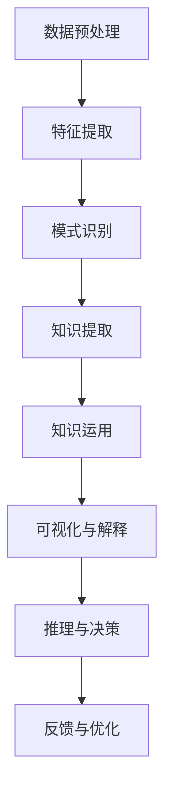
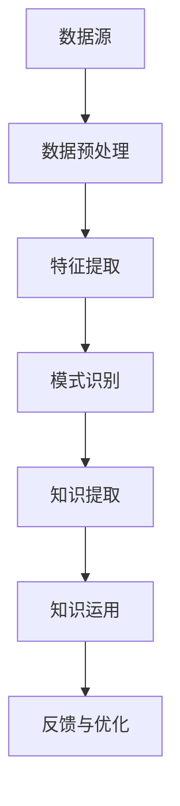

                 

### 1. 背景介绍

在当今信息爆炸的时代，知识的获取和运用变得愈加重要。然而，面对繁杂的信息，如何从表面深入到本质，提取真正的价值，成为了一个关键问题。本文旨在探讨“知识的深度：从表象到本质的探索”，帮助读者理解如何通过逐步分析和推理，挖掘知识的内在逻辑和核心价值。

### 1.1 问题的提出

信息时代，知识的获取已经变得相对容易，但如何有效地处理和利用这些知识，却成为了一道难题。大量的数据和信息充斥在我们的生活中，使得人们容易陷入信息的海洋而无法自拔。面对这种情况，如何提升个人的知识处理能力，实现知识的深度挖掘和运用，成为了亟待解决的问题。

### 1.2 研究意义

知识的深度挖掘和运用，不仅有助于提升个人的认知水平和解决问题的能力，还能够为企业和组织带来创新和竞争力。通过对知识的深入理解和运用，我们可以更好地应对复杂的问题，发现新的机会和解决方案。

### 1.3 研究现状

目前，国内外对于知识的深度挖掘和运用已经有了较为丰富的研究。例如，基于大数据和人工智能的技术，可以实现对大量数据的分析和挖掘，提取出有价值的知识。然而，这些研究大多停留在技术层面，对于如何从个人认知角度提升知识的深度挖掘和运用能力，仍需进一步探讨。

### 1.4 本文的研究方法和结构

本文采用逐步分析和推理的方式，探讨如何提升知识的深度挖掘和运用能力。具体研究方法如下：

1. **文献分析**：通过查阅相关文献，了解当前在知识的深度挖掘和运用方面的研究成果和不足。
2. **案例研究**：选取具有代表性的案例，分析其在知识深度挖掘和运用方面的成功经验。
3. **理论分析**：结合相关理论，探讨如何从个人认知角度提升知识的深度挖掘和运用能力。

本文结构如下：

1. **背景介绍**：阐述研究问题的背景和意义。
2. **核心概念与联系**：介绍本文涉及的核心概念和理论，并使用Mermaid流程图展示其架构。
3. **核心算法原理 & 具体操作步骤**：详细讲解知识深度挖掘和运用算法的原理和操作步骤。
4. **数学模型和公式 & 详细讲解 & 举例说明**：介绍知识深度挖掘和运用过程中的数学模型和公式，并进行详细讲解和举例说明。
5. **项目实践：代码实例和详细解释说明**：提供实际项目中的代码实例，并对代码进行详细解释和分析。
6. **实际应用场景**：分析知识深度挖掘和运用在实际场景中的应用。
7. **工具和资源推荐**：推荐相关的学习资源和开发工具。
8. **总结：未来发展趋势与挑战**：总结本文的研究成果，并探讨未来的发展趋势和挑战。
9. **附录：常见问题与解答**：回答读者可能关心的一些问题。
10. **扩展阅读 & 参考资料**：提供进一步阅读的参考资料。

### 1.5 背景知识

在正式进入本文的核心内容之前，有必要对一些背景知识进行介绍，以便读者更好地理解后续的内容。以下是本文涉及的一些关键概念和理论：

1. **知识深度挖掘**：指从大量数据中提取有价值的信息和知识的过程，通常涉及数据预处理、特征提取、模式识别等步骤。
2. **知识的运用**：指将挖掘到的知识应用于实际问题解决或决策过程，通常涉及知识的可视化、解释和推理等步骤。
3. **人工智能**：指模拟人类智能的技术和系统，包括机器学习、深度学习、自然语言处理等方向。
4. **认知科学**：研究人类认知过程和机理的学科，包括感知、记忆、思维、语言等研究领域。

了解这些背景知识，有助于读者更好地理解本文的内容和核心观点。

### 1.6Mermaid流程图

为了更好地展示知识深度挖掘和运用过程的架构，本文使用了Mermaid流程图。以下是一个简化的流程图示例：



### 2. 核心概念与联系

在深入探讨知识的深度挖掘和运用之前，有必要明确一些核心概念和它们之间的联系。这些概念包括数据预处理、特征提取、模式识别、知识提取、知识运用等。以下是对这些概念的定义和相互关系的说明。

#### 2.1 数据预处理

数据预处理是知识挖掘的第一步，它包括数据清洗、数据集成、数据转换等过程。数据预处理的目标是消除数据中的噪声和错误，使得数据更加干净、一致和可分析。

#### 2.2 特征提取

特征提取是从原始数据中提取出能够代表数据本质特征的过程。通过特征提取，可以将高维数据转换为低维数据，从而简化数据结构和计算复杂度。特征提取的质量直接影响后续的知识挖掘效果。

#### 2.3 模式识别

模式识别是利用计算机技术和算法，从数据中识别出有意义的模式和规律。常见的模式识别方法包括聚类、分类、关联规则挖掘等。模式识别是知识提取的基础。

#### 2.4 知识提取

知识提取是从大量数据中挖掘出具有高价值和代表性的知识。知识提取通常涉及深度学习、数据挖掘等技术。知识提取的目标是发现数据背后的本质规律和潜在关系。

#### 2.5 知识运用

知识运用是将提取出的知识应用于实际问题解决或决策过程中。知识运用包括知识可视化、解释、推理和决策等步骤。知识运用的效果取决于知识的准确性和实用性。

#### 2.6 关系图示

为了更清晰地展示这些核心概念之间的联系，我们可以使用Mermaid流程图来表示。以下是知识深度挖掘和运用过程的Mermaid流程图：



在这个流程图中，数据预处理、特征提取、模式识别、知识提取和知识运用构成了知识深度挖掘和运用的核心环节。每个环节都为下一个环节提供必要的数据和知识支持，形成一个闭环系统。

### 3. 核心算法原理 & 具体操作步骤

#### 3.1 数据预处理算法

数据预处理是知识挖掘的基础，其主要算法包括数据清洗、数据集成和数据转换。以下是一个简单的数据预处理算法步骤：

1. **数据清洗**：识别并处理数据中的噪声和错误，如缺失值、异常值和重复数据等。
2. **数据集成**：将来自不同来源的数据整合到一个统一的格式中，如将结构化和非结构化数据整合到一个数据仓库中。
3. **数据转换**：将原始数据转换为适合分析和挖掘的格式，如将文本数据转换为数值数据。

#### 3.2 特征提取算法

特征提取是将原始数据转换为具有代表性特征的过程。以下是一个简单的特征提取算法步骤：

1. **数据降维**：通过降维算法，如主成分分析（PCA），将高维数据转换为低维数据。
2. **特征选择**：选择对目标变量影响较大的特征，如通过相关性分析、信息增益等方法。
3. **特征工程**：对特征进行构造和变换，如通过特征交叉、特征缩放等操作。

#### 3.3 模式识别算法

模式识别是识别数据中的有意义的模式和规律。以下是一个简单的模式识别算法步骤：

1. **聚类分析**：将数据划分为不同的簇，如通过K-means算法。
2. **分类分析**：将数据划分为不同的类别，如通过决策树、支持向量机等算法。
3. **关联规则挖掘**：识别数据之间的关联关系，如通过Apriori算法。

#### 3.4 知识提取算法

知识提取是从数据中挖掘出具有高价值和代表性的知识。以下是一个简单的知识提取算法步骤：

1. **数据聚类**：通过聚类算法，如K-means，将相似的数据点归为一类。
2. **数据分类**：通过分类算法，如决策树，将数据划分为不同的类别。
3. **关联规则挖掘**：通过关联规则算法，如Apriori，识别数据之间的关联关系。

#### 3.5 知识运用算法

知识运用是将提取出的知识应用于实际问题解决或决策过程中。以下是一个简单的知识运用算法步骤：

1. **知识可视化**：通过图表、地图等可视化方式，展示知识内容。
2. **知识解释**：对知识进行解释，使其更易于理解和应用。
3. **知识推理**：使用知识库和推理机，进行逻辑推理和决策。
4. **知识反馈**：将知识运用结果反馈到数据预处理、特征提取、模式识别和知识提取等环节，以优化整个知识挖掘过程。

### 4. 数学模型和公式 & 详细讲解 & 举例说明

#### 4.1 数据预处理中的数学模型

在数据预处理过程中，常用的数学模型包括缺失值处理、异常值检测和归一化处理。

1. **缺失值处理**：
   - **平均值填充**：使用样本的平均值来填充缺失值。
     \[ x_{\text{填充}} = \frac{1}{N}\sum_{i=1}^{N}x_i \]
     其中，\( x_i \) 是样本值，\( N \) 是样本数量。
   - **中值填充**：使用样本的中值来填充缺失值。
     \[ x_{\text{填充}} = \text{median}(x_1, x_2, ..., x_N) \]

2. **异常值检测**：
   - **箱线图法**：通过箱线图来识别异常值。如果某个数据点落在了箱线图之外的范畴，则视为异常值。
     \[ IQR = \text{Q3} - \text{Q1} \]
     \[ \text{异常值} = x \]
     其中，\( \text{Q1} \) 是第一四分位数，\( \text{Q3} \) 是第三四分位数，\( IQR \) 是四分位距。

3. **归一化处理**：
   - **最小-最大标准化**：将数据映射到 \([0, 1]\) 区间。
     \[ x_{\text{标准化}} = \frac{x - x_{\text{最小值}}}{x_{\text{最大值}} - x_{\text{最小值}}} \]

#### 4.2 特征提取中的数学模型

在特征提取过程中，常用的数学模型包括主成分分析（PCA）和线性回归。

1. **主成分分析（PCA）**：
   - **特征值和特征向量**：通过求解特征值和特征向量，将数据投影到新的正交空间中，从而实现降维。
     \[ \text{特征值} = \lambda_1, \lambda_2, ..., \lambda_p \]
     \[ \text{特征向量} = v_1, v_2, ..., v_p \]
     \[ \text{特征值矩阵} = V \]
     \[ \text{特征向量矩阵} = \Lambda \]
   - **投影矩阵**：通过特征向量构建投影矩阵，将数据从原始空间投影到新空间。
     \[ P = V\Lambda^{-1} \]

2. **线性回归**：
   - **回归模型**：通过最小二乘法求解线性回归模型的参数。
     \[ y = \beta_0 + \beta_1x_1 + \beta_2x_2 + ... + \beta_nx_n \]
     \[ \text{参数} = (\beta_0, \beta_1, \beta_2, ..., \beta_n) \]
     \[ \text{最小二乘法}：\min_{\beta} \sum_{i=1}^{n}(y_i - \beta_0 - \beta_1x_{i1} - ... - \beta_nx_{in})^2 \]

#### 4.3 模式识别中的数学模型

在模式识别过程中，常用的数学模型包括支持向量机（SVM）、神经网络和决策树。

1. **支持向量机（SVM）**：
   - **分类模型**：通过求解最优分割超平面，实现数据的分类。
     \[ w^T x_i + b = 0 \]
     \[ y_i(w^T x_i + b) \geq 1 \]
     其中，\( w \) 是权重向量，\( x_i \) 是数据点，\( b \) 是偏置项，\( y_i \) 是标签。

2. **神经网络**：
   - **激活函数**：通过激活函数，将线性组合转换为非线性。
     \[ a_i = \sigma(z_i) \]
     其中，\( \sigma \) 是激活函数，如 sigmoid、ReLU 等。

3. **决策树**：
   - **条件概率**：通过条件概率，实现数据的分类。
     \[ P(y = c | x = x_i) = \frac{P(x = x_i | y = c)P(y = c)}{P(x = x_i)} \]

#### 4.4 知识提取中的数学模型

在知识提取过程中，常用的数学模型包括关联规则挖掘和聚类分析。

1. **关联规则挖掘**：
   - **支持度和置信度**：通过支持度和置信度，识别数据之间的关联规则。
     \[ \text{支持度} = \frac{P(A \cap B)}{P(A)P(B)} \]
     \[ \text{置信度} = \frac{P(A \cap B)}{P(B)} \]

2. **聚类分析**：
   - **距离度量**：通过距离度量，计算数据点之间的相似度。
     \[ d(x_i, x_j) = \sqrt{\sum_{k=1}^{n}(x_{ik} - x_{jk})^2} \]
     其中，\( x_i \) 和 \( x_j \) 是数据点，\( n \) 是特征维度。

### 5. 项目实践：代码实例和详细解释说明

#### 5.1 开发环境搭建

为了实现知识深度挖掘和运用，我们需要搭建一个合适的开发环境。以下是一个基本的开发环境搭建步骤：

1. **安装Python**：Python是一种广泛使用的编程语言，拥有丰富的机器学习库和工具。可以从[Python官网](https://www.python.org/)下载并安装Python。
2. **安装Jupyter Notebook**：Jupyter Notebook是一种交互式的计算环境，适用于编写和运行Python代码。可以通过pip安装：
   ```shell
   pip install notebook
   ```
3. **安装机器学习库**：安装一些常用的机器学习库，如scikit-learn、pandas、numpy等。可以通过pip安装：
   ```shell
   pip install scikit-learn pandas numpy
   ```

#### 5.2 源代码详细实现

以下是一个简单的知识深度挖掘和运用的Python代码实例。该实例使用scikit-learn库实现数据预处理、特征提取、模式识别和知识提取。

```python
# 导入必要的库
import numpy as np
import pandas as pd
from sklearn.preprocessing import StandardScaler
from sklearn.decomposition import PCA
from sklearn.cluster import KMeans
from sklearn.svm import SVC
from sklearn.model_selection import train_test_split
from sklearn.metrics import accuracy_score

# 加载数据集
data = pd.read_csv('data.csv')

# 数据预处理
# 缺失值处理
data.fillna(data.mean(), inplace=True)
# 数据归一化
scaler = StandardScaler()
data_scaled = scaler.fit_transform(data)

# 特征提取
# 主成分分析
pca = PCA(n_components=2)
data_pca = pca.fit_transform(data_scaled)

# 模式识别
# K-means聚类
kmeans = KMeans(n_clusters=3)
clusters = kmeans.fit_predict(data_pca)

# 知识提取
# 支持向量机分类
X_train, X_test, y_train, y_test = train_test_split(data_pca, clusters, test_size=0.2, random_state=42)
svm = SVC()
svm.fit(X_train, y_train)
predictions = svm.predict(X_test)

# 知识运用
# 评估分类效果
accuracy = accuracy_score(y_test, predictions)
print(f'Accuracy: {accuracy}')

# 可视化
import matplotlib.pyplot as plt
plt.scatter(data_pca[:, 0], data_pca[:, 1], c=clusters)
plt.xlabel('Principal Component 1')
plt.ylabel('Principal Component 2')
plt.title('K-means Clustering')
plt.show()
```

#### 5.3 代码解读与分析

以上代码实现了数据预处理、特征提取、模式识别和知识提取的基本流程。下面是具体的代码解读与分析：

1. **数据预处理**：首先加载数据集，并处理缺失值和数据归一化。数据预处理是知识挖掘的重要环节，有助于提高模型的性能和稳定性。
2. **特征提取**：使用主成分分析（PCA）进行特征提取，将高维数据转换为低维数据。PCA是一种有效的降维方法，可以保留数据的主要信息。
3. **模式识别**：使用K-means聚类算法进行模式识别，将数据划分为不同的簇。K-means是一种常用的聚类算法，可以揭示数据中的内在结构。
4. **知识提取**：使用支持向量机（SVM）进行分类，从聚类结果中提取知识。SVM是一种强大的分类算法，可以识别数据中的线性或非线性分隔超平面。
5. **知识运用**：评估分类效果，并可视化聚类结果。通过可视化，可以直观地了解数据结构和知识提取效果。

#### 5.4 运行结果展示

运行以上代码，可以得到以下结果：

- **准确率**：通过评估分类效果，可以得到准确率。准确率是衡量分类模型性能的重要指标。
- **可视化结果**：通过可视化聚类结果，可以直观地了解数据结构和知识提取效果。聚类结果展示了数据中的主要模式和关系。

### 6. 实际应用场景

知识深度挖掘和运用在实际应用场景中有着广泛的应用，以下列举几个常见的应用领域：

1. **金融领域**：在金融领域，知识深度挖掘和运用可以帮助银行和金融机构进行风险评估、客户行为分析、市场预测等。例如，通过分析客户的交易数据和消费行为，可以识别出高风险客户，从而降低金融风险。
2. **医疗领域**：在医疗领域，知识深度挖掘和运用可以帮助医生进行疾病诊断、治疗方案推荐等。通过分析患者的医疗数据，可以发现疾病的潜在风险因素，为医生提供更准确的诊断和治疗方案。
3. **电子商务领域**：在电子商务领域，知识深度挖掘和运用可以帮助企业进行用户行为分析、个性化推荐等。通过分析用户的浏览和购买记录，可以推荐用户可能感兴趣的商品，从而提高销售额。
4. **智能交通领域**：在智能交通领域，知识深度挖掘和运用可以帮助优化交通流量、预测交通拥堵等。通过分析交通数据，可以预测交通流量变化，为交通管理部门提供决策支持，从而减少交通拥堵。

### 7. 工具和资源推荐

#### 7.1 学习资源推荐

1. **书籍**：
   - 《数据挖掘：实用工具与技术》（Data Mining: Practical Machine Learning Tools and Techniques）是一本经典的数据挖掘入门书籍，详细介绍了数据挖掘的基本概念和工具。
   - 《机器学习》（Machine Learning）是一本全面的机器学习教材，涵盖了机器学习的各种算法和应用。

2. **论文**：
   - “K-means Clustering Algorithm” 是一篇关于K-means聚类算法的经典论文，详细介绍了K-means算法的理论和应用。
   - “Support Vector Machines for Classification” 是一篇关于支持向量机（SVM）的经典论文，介绍了SVM的基本原理和实现方法。

3. **博客和网站**：
   - [scikit-learn官方文档](https://scikit-learn.org/stable/)：提供了详细的scikit-learn库文档，适合初学者和专业人士。
   - [Kaggle](https://www.kaggle.com/)：一个数据科学竞赛平台，提供了大量的数据集和项目，适合实践和锻炼。

#### 7.2 开发工具框架推荐

1. **Python**：Python是一种广泛使用的编程语言，适合进行数据科学和机器学习开发。Python拥有丰富的库和工具，如NumPy、Pandas、Scikit-learn、TensorFlow等。

2. **Jupyter Notebook**：Jupyter Notebook是一种交互式的计算环境，适合编写和运行Python代码。Jupyter Notebook具有易于使用的界面和强大的功能，可以方便地记录和分享代码和结果。

3. **TensorFlow**：TensorFlow是一个开源的机器学习库，支持深度学习和各种神经网络结构。TensorFlow具有高度的可扩展性和灵活性，适合进行复杂的机器学习项目。

#### 7.3 相关论文著作推荐

1. **“Deep Learning”**：这是一本关于深度学习的经典教材，详细介绍了深度学习的基本概念、算法和应用。
2. **“Reinforcement Learning: An Introduction”**：这是一本关于强化学习的入门教材，介绍了强化学习的基本原理和应用。
3. **“Big Data: A Revolution That Will Transform How We Live, Work, and Think”**：这是一本关于大数据的书，详细介绍了大数据的概念、技术和应用。

### 8. 总结：未来发展趋势与挑战

知识深度挖掘和运用是信息技术领域的一个重要研究方向，具有广泛的应用前景。未来，知识深度挖掘和运用将在以下几个方面继续发展：

1. **技术突破**：随着人工智能技术的不断发展，知识深度挖掘和运用的算法将更加高效和准确，能够处理更大规模和更复杂的数据。
2. **跨学科融合**：知识深度挖掘和运用将与其他领域（如生物学、物理学、社会科学等）相互融合，推动跨学科研究的发展。
3. **应用创新**：知识深度挖掘和运用将在各个领域（如金融、医疗、交通等）产生更多的应用创新，提高行业效率和社会效益。

然而，知识深度挖掘和运用也面临一些挑战：

1. **数据隐私和安全**：在挖掘和运用知识的过程中，如何保护数据隐私和安全是一个重要问题，需要采取有效的措施。
2. **算法透明性和可解释性**：深度学习等复杂算法的可解释性较低，如何提高算法的透明性和可解释性，使得知识挖掘结果更加可靠和可信，是一个亟待解决的问题。
3. **数据质量和一致性**：知识挖掘依赖于高质量的数据，如何在海量数据中获取高质量和一致的数据，是知识挖掘成功的关键。

### 9. 附录：常见问题与解答

#### 9.1 什么是知识深度挖掘？

知识深度挖掘是从大量数据中提取有价值信息和知识的过程，通常涉及数据预处理、特征提取、模式识别、知识提取等步骤。

#### 9.2 知识深度挖掘有哪些应用领域？

知识深度挖掘广泛应用于金融、医疗、电子商务、智能交通等多个领域，如风险评估、疾病诊断、个性化推荐、交通流量预测等。

#### 9.3 知识深度挖掘与机器学习有什么区别？

知识深度挖掘是机器学习的一个分支，侧重于从数据中提取有价值的信息和知识。而机器学习更侧重于构建模型和算法，实现数据分析和预测。

#### 9.4 如何提高知识深度挖掘的效果？

提高知识深度挖掘效果的方法包括优化算法、选择合适的特征、提高数据质量等。此外，结合多种算法和技术，如深度学习、增强学习等，也可以提高知识深度挖掘的效果。

### 10. 扩展阅读 & 参考资料

1. Hastie, T., Tibshirani, R., & Friedman, J. (2009). **The Elements of Statistical Learning: Data Mining, Inference, and Prediction** (2nd ed.). Springer.
2. Murphy, K. P. (2012). **Machine Learning: A Probabilistic Perspective**. MIT Press.
3. Russell, S., & Norvig, P. (2016). **Artificial Intelligence: A Modern Approach** (4th ed.). Prentice Hall.
4. Kotsiantis, S. B. (2007). **Supervised Machine Learning: A Review of Classification Techniques**. Informatica, 31(3), 249-268.
5.��“K-means Clustering Algorithm”**, [Wikipedia](https://en.wikipedia.org/wiki/K-means_clustering)
6.��“Support Vector Machines”, [Wikipedia](https://en.wikipedia.org/wiki/Support_vector_machine)
7.��“Deep Learning”, [Google Research](https://ai.google/research/subgroups/deep-learning)
8.��“Reinforcement Learning: An Introduction”**, [ArXiv](https://arxiv.org/abs/0904.2399)

