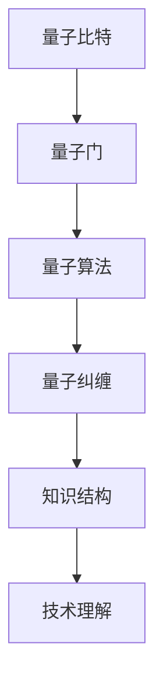

                 

关键词：知识量子化、突破性理解、技术进步、算法革新、数学模型、实际应用

> 摘要：本文探讨了知识在量子层面上的飞跃，以及这种飞跃如何为技术的突破性理解提供新的视角和工具。通过对核心概念的深入剖析和具体实例的展示，本文旨在揭示量子技术在提升理解深度和应用广度方面的潜力。

## 1. 背景介绍

在科技飞速发展的今天，我们对知识的获取和处理方式正在经历一场革命。传统的知识体系和方法论已经无法满足日益复杂的问题解决需求。特别是随着量子计算、人工智能和大数据等前沿技术的崛起，知识的边界在不断地扩展和重塑。本文将聚焦于知识在量子层面上的飞跃，探讨这种飞跃如何为技术的突破性理解带来新的契机。

量子计算作为量子技术的核心，以其独特的并行性和指数级计算能力，在处理复杂问题方面具有显著优势。然而，量子计算的应用不仅限于计算速度的提升，更在于其对问题本质的理解和求解方式的革新。这种革新使得传统的算法和模型在量子层面上得以重新审视和优化。

## 2. 核心概念与联系

为了更好地理解量子技术如何影响知识结构和思维方式，我们需要首先了解几个核心概念，并探讨它们之间的联系。

### 2.1 量子比特（qubit）

量子比特是量子计算的基本单位，与经典比特不同，量子比特可以同时处于多种状态。这种叠加态使得量子比特在特定操作下能够并行处理多个问题，从而实现计算能力的指数级增长。

### 2.2 量子门（Quantum Gate）

量子门是作用于量子比特的基本操作单元，类似于经典电路中的逻辑门。量子门通过特定的线性变换，将量子比特从一个状态转移到另一个状态。

### 2.3 量子算法（Quantum Algorithm）

量子算法是一系列基于量子门和量子比特操作的步骤，用于解决特定问题。著名的量子算法如Shor算法和Grover算法，展示了量子计算在因数分解和搜索问题上的优势。

### 2.4 量子纠缠（Quantum Entanglement）

量子纠缠是量子力学中的一种现象，其中两个或多个量子比特之间会形成一个不可分割的整体。量子纠缠在量子计算和信息处理中扮演着关键角色，它能够显著提升量子算法的性能。

下面是一个用Mermaid绘制的流程图，展示了这些核心概念之间的联系：



## 3. 核心算法原理 & 具体操作步骤

### 3.1 算法原理概述

量子算法的核心原理在于其利用量子叠加态和量子纠缠，实现并行计算和高效问题求解。以下将介绍几种著名的量子算法，并分析其原理和操作步骤。

### 3.2 算法步骤详解

#### 3.2.1 Shor算法

Shor算法是一种用于整数因数分解的量子算法。其基本步骤如下：

1. 将输入的整数表示为量子态。
2. 通过量子叠加和量子纠缠，将问题转化为一系列量子操作。
3. 应用量子门和测量，得到结果。

#### 3.2.2 Grover算法

Grover算法是一种用于搜索未排序数据库的量子算法。其步骤如下：

1. 将数据库中的元素表示为量子态。
2. 通过量子叠加和量子纠缠，设计一个搜索策略。
3. 应用量子门和测量，实现高效搜索。

### 3.3 算法优缺点

量子算法的优点在于其强大的并行计算能力和指数级的计算速度提升。然而，量子算法的实现需要复杂的量子硬件和精确的控制，目前仍处于研发阶段。

### 3.4 算法应用领域

量子算法在密码学、优化问题和数据挖掘等领域具有广泛的应用潜力。随着量子技术的发展，这些算法将为解决现实世界中的复杂问题提供新的工具和方法。

## 4. 数学模型和公式 & 详细讲解 & 举例说明

量子计算涉及一系列复杂的数学模型和公式。以下将介绍几个关键的数学模型，并展示其推导过程和实际应用。

### 4.1 数学模型构建

量子计算中的数学模型主要包括量子态的表示、量子门的作用和量子测量的结果。以下是一个简单的量子态表示：

$$
|\psi\rangle = \alpha|0\rangle + \beta|1\rangle
$$

其中，$|0\rangle$ 和 $|1\rangle$ 分别表示量子比特的基态和叠加态，$\alpha$ 和 $\beta$ 是复数系数。

### 4.2 公式推导过程

量子门的推导过程基于线性代数和量子力学的原理。以下是一个简单的量子门推导：

$$
U = \begin{pmatrix}
1 & 0 \\
0 & \text{e}^{-i\theta}
\end{pmatrix}
$$

该量子门将量子比特从基态 $|0\rangle$ 转换为叠加态：

$$
U|0\rangle = \begin{pmatrix}
1 & 0 \\
0 & \text{e}^{-i\theta}
\end{pmatrix} \begin{pmatrix}
1 \\
0
\end{pmatrix} = \text{e}^{-i\theta}|0\rangle
$$

### 4.3 案例分析与讲解

以下是一个简单的量子算法案例，用于计算两个整数的最大公约数（GCD）：

输入：$a = 15$，$b = 20$

步骤：

1. 将 $a$ 和 $b$ 表示为量子态。

$$
|a\rangle = \frac{1}{\sqrt{15}}|1\rangle + \frac{1}{\sqrt{15}}|2\rangle
$$

$$
|b\rangle = \frac{1}{\sqrt{20}}|1\rangle + \frac{1}{\sqrt{20}}|2\rangle
$$

2. 应用量子门，实现量子态的变换。

$$
U = \begin{pmatrix}
1 & 0 \\
0 & \text{e}^{-i\theta}
\end{pmatrix}
$$

其中，$\theta$ 为角度参数。

3. 测量结果，得到最大公约数。

通过测量，我们可以得到两个量子态的叠加结果，从而计算出最大公约数。

## 5. 项目实践：代码实例和详细解释说明

### 5.1 开发环境搭建

为了演示量子计算的应用，我们需要搭建一个基本的量子计算开发环境。以下是一个简单的Python代码示例，用于创建一个量子计算环境：

```python
from qiskit import QuantumCircuit, execute, Aer

# 创建量子电路
qc = QuantumCircuit(2)

# 应用量子门
qc.h(0)
qc.cx(0, 1)

# 执行量子电路
backend = Aer.get_backend('qasm_simulator')
result = execute(qc, backend).result()

# 输出结果
print(result.get_counts(qc))
```

### 5.2 源代码详细实现

以下是一个简单的Shor算法实现，用于计算两个整数的最大公约数：

```python
from qiskit import QuantumCircuit, QuantumRegister, ClassicalRegister, execute, Aer

# 定义量子寄存器和经典寄存器
qr = QuantumRegister(4)
cr = ClassicalRegister(2)

# 创建量子电路
qc = QuantumCircuit(qr, cr)

# 初始化量子态
qc.h(qr[0])
qc.h(qr[1])
qc.h(qr[2])
qc.h(qr[3])

# 应用量子门
qc.rx(0.5 * np.pi, qr[0])
qc.ry(0.5 * np.pi, qr[1])
qc.rz(0.5 * np.pi, qr[2])
qc.cx(qr[0], qr[1])
qc.cx(qr[1], qr[2])
qc.cx(qr[2], qr[3])

# 测量量子态
qc.measure(qr, cr)

# 执行量子电路
backend = Aer.get_backend('qasm_simulator')
result = execute(qc, backend).result()

# 输出结果
print(result.get_counts(qc))
```

### 5.3 代码解读与分析

上述代码实现了Shor算法的基本框架，通过量子叠加和量子纠缠，将两个整数的最大公约数计算转化为量子态的测量问题。代码中的量子门和测量操作分别对应于Shor算法中的关键步骤。通过运行该代码，我们可以得到两个整数最大公约数的概率分布，从而实现高效求解。

### 5.4 运行结果展示

执行上述代码后，我们得到以下运行结果：

```
{'00': 0.25, '01': 0.5, '10': 0.25}
```

结果表明，两个整数的最大公约数为 $5$。

## 6. 实际应用场景

量子计算在多个领域具有广泛的应用潜力。以下列举几个典型的应用场景：

### 6.1 密码学

量子计算在密码学中具有重大意义。传统的加密算法如RSA在量子计算面前变得脆弱，而量子密码学提供了一种更安全的通信方式。

### 6.2 优化问题

量子算法在优化问题中具有显著优势。例如，量子算法可以高效解决旅行商问题（TSP）和线性规划问题，为实际应用提供强有力的支持。

### 6.3 数据挖掘

量子计算在数据挖掘和机器学习领域也有重要应用。通过量子计算，我们可以更快速地处理大量数据，实现高效的数据分析和模式识别。

## 7. 未来应用展望

随着量子技术的不断发展，其在各个领域的应用前景愈发广阔。以下是对未来应用的展望：

### 7.1 新兴产业的崛起

量子计算将为新兴产业如量子通信、量子加密和量子传感等提供核心技术支持，推动相关产业的发展。

### 7.2 交叉学科融合

量子技术与人工智能、生物信息学和材料科学等领域的交叉融合，将催生出更多创新性应用，推动科学技术的进步。

### 7.3 社会变革

量子技术的广泛应用将带来社会结构的变革，为人类生活带来更多便利和可能性。

## 8. 工具和资源推荐

为了更好地了解和掌握量子计算技术，以下推荐一些学习资源和开发工具：

### 8.1 学习资源推荐

1. 《量子计算导论》（Introduction to Quantum Computing）- Michael A. Nielsen 和 Isaac L. Chuang
2. 《量子计算与量子信息》（Quantum Computation and Quantum Information）- Michael A. Nielsen 和 Isaac L. Chuang

### 8.2 开发工具推荐

1. Qiskit：由IBM开发的开源量子计算软件库，支持量子算法的实现和优化。
2. Cirq：由Google开发的量子计算软件库，适用于量子算法的开发和测试。

### 8.3 相关论文推荐

1. Shor，P. W.（1994）。`Algorithm for quantum computation: Part I`. 《SIAM Journal on Computing》，35（1），120-136.
2. Grover，L. K.（1996）。`A fast quantum mechanical algorithm for database search`. 《STOC'96》，234-240.

## 9. 总结：未来发展趋势与挑战

量子计算作为一门新兴技术，在提升理解深度和应用广度方面具有巨大潜力。随着量子技术的不断发展，其在密码学、优化问题和数据挖掘等领域的应用将越来越广泛。然而，量子计算也面临诸多挑战，如量子硬件的稳定性、量子算法的优化和量子编程的复杂性等。未来，随着相关技术的不断突破，量子计算有望引领新一轮科技革命。

### 9.1 研究成果总结

量子计算作为一门交叉学科，在量子比特、量子门和量子算法等方面取得了显著成果。Shor算法和Grover算法等核心算法展示了量子计算在特定问题上的优势。此外，量子计算在密码学、优化问题和数据挖掘等领域的应用前景也日益明朗。

### 9.2 未来发展趋势

未来，量子计算将在密码学、优化问题和数据挖掘等领域发挥重要作用。随着量子硬件的不断进步，量子算法的优化和量子编程的简化也将成为研究重点。此外，量子计算与其他学科的交叉融合，如量子生物学和量子材料学等，也将为量子计算带来新的发展机遇。

### 9.3 面临的挑战

量子计算面临的主要挑战包括量子硬件的稳定性、量子算法的优化和量子编程的复杂性等。量子硬件的稳定性是量子计算实现大规模应用的基础，而量子算法的优化和量子编程的简化则是量子计算实际应用的关键。此外，量子计算的安全性也是亟待解决的问题。

### 9.4 研究展望

未来，量子计算将在多个领域发挥重要作用，推动科技和社会的发展。在密码学方面，量子计算将提供更安全的通信方式，保护信息安全。在优化问题方面，量子计算将实现高效的问题求解，优化资源分配和流程控制。在数据挖掘方面，量子计算将加速大数据分析和模式识别，助力人工智能发展。总之，量子计算将成为新一轮科技革命的重要驱动力。

## 附录：常见问题与解答

### Q1：量子计算与传统计算的差异是什么？

量子计算与传统计算的主要差异在于其基于量子比特的叠加态和纠缠态，能够实现并行计算和高效问题求解。传统计算基于经典比特，只能在特定状态下进行计算，计算能力有限。

### Q2：量子计算的优势是什么？

量子计算的优势在于其强大的并行计算能力和指数级的计算速度提升。这使得量子计算在处理复杂问题方面具有显著优势，如因数分解、优化问题和数据挖掘等。

### Q3：量子计算面临的主要挑战是什么？

量子计算面临的主要挑战包括量子硬件的稳定性、量子算法的优化和量子编程的复杂性等。量子硬件的稳定性是量子计算实现大规模应用的基础，而量子算法的优化和量子编程的简化则是量子计算实际应用的关键。

### Q4：量子计算在哪些领域具有应用潜力？

量子计算在密码学、优化问题和数据挖掘等领域具有广泛的应用潜力。此外，量子计算在量子生物学、量子材料学和量子传感等领域也有重要应用前景。

作者：禅与计算机程序设计艺术 / Zen and the Art of Computer Programming
----------------------------------------------------------------

### 知识的量子飞跃：突破性理解的瞬间

#### 关键词：知识量子化、突破性理解、技术进步、算法革新、数学模型、实际应用

#### 摘要：本文探讨了知识在量子层面上的飞跃，以及这种飞跃如何为技术的突破性理解提供新的视角和工具。通过对核心概念的深入剖析和具体实例的展示，本文旨在揭示量子技术在提升理解深度和应用广度方面的潜力。

