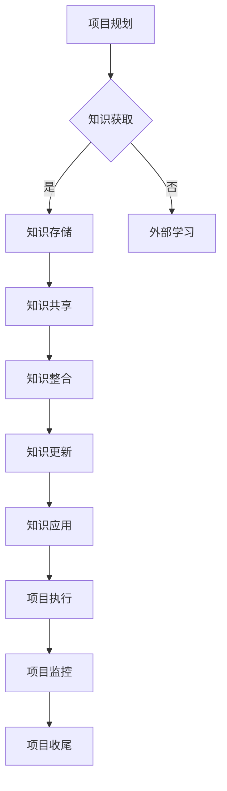

                 

### 知识管理在项目管理中的价值

#### 关键词

- 知识管理
- 项目管理
- 信息整合
- 知识共享
- 效率提升
- 风险控制

#### 摘要

本文将探讨知识管理在项目管理中的重要性。通过分析知识管理的基本概念和原理，结合实际项目管理中的案例，我们将展示知识管理如何通过提高信息整合和共享效率、减少风险、促进团队协作等方面，显著提升项目的整体管理水平。文章还将讨论知识管理在项目管理中的应用工具和最佳实践，以及对未来发展趋势和挑战的展望。

---

## 1. 背景介绍

在现代企业中，项目管理是企业运营的核心环节，涉及到项目规划、执行、监控和收尾等各个环节。随着项目的复杂性和多样性不断增加，项目管理者面临的挑战也日益严峻。其中一个关键问题就是如何在项目过程中有效地管理知识。

知识管理（Knowledge Management，KM）是一种系统性方法，旨在通过识别、创造、组织和传播知识，以提高组织的效率和创新力。知识管理包括知识的获取、存储、共享、更新和应用等多个方面。在项目管理中，知识管理的重要性体现在以下几个方面：

1. **信息整合**：项目往往涉及多个团队和部门，知识管理能够有效地整合各个方面的信息，减少信息孤岛，提高沟通效率。
2. **知识共享**：知识共享是知识管理的重要组成部分，它有助于团队成员更快地获取所需信息，提高整体工作效率。
3. **风险控制**：通过知识管理，项目团队能够从过去的经验中学习，减少风险，提高项目成功的可能性。
4. **团队协作**：知识管理可以促进团队内部和跨团队的协作，提高团队的整体协作效率。

本篇文章将深入探讨知识管理在项目管理中的应用，分析其核心概念和原理，并探讨其在实际项目管理中的具体实施方法。

---

## 2. 核心概念与联系

### 2.1 知识管理的基本概念

知识管理涉及到一系列的概念和活动，以下是其核心概念：

- **知识**：知识是指经过整理和组织的知识内容，包括事实、信息、技能、经验和洞察等。
- **知识资源**：知识资源是指组织中可用于创造价值和解决问题的一切知识资产。
- **知识共享**：知识共享是指将知识在组织内部或外部进行传播和分享的过程。
- **知识整合**：知识整合是指将分散的知识进行系统化和结构化的过程，以便更好地利用和传播。
- **知识更新**：知识更新是指定期对知识库中的知识进行审查和更新，以确保知识的准确性和时效性。

### 2.2 知识管理在项目管理中的应用

在项目管理中，知识管理可以通过以下几种方式发挥作用：

- **项目规划**：在项目规划阶段，知识管理可以帮助项目团队快速了解项目的背景、目标、风险等信息，为项目决策提供有力支持。
- **项目执行**：在项目执行过程中，知识管理能够确保团队成员在遇到问题时能够快速获取相关解决方案，提高项目执行效率。
- **项目监控**：通过知识管理，项目管理者可以实时获取项目的进展信息，对项目风险进行有效监控和管理。
- **项目收尾**：在项目收尾阶段，知识管理可以帮助团队总结项目经验，为未来的项目提供宝贵的参考。

### 2.3 知识管理的架构

为了有效地在项目管理中实施知识管理，需要构建一个合理的知识管理架构。以下是一个典型的知识管理架构：

- **知识获取**：通过内部培训和外部学习，不断获取新的知识和技能。
- **知识存储**：建立一个集中的知识库，用于存储和分类各类知识。
- **知识共享**：通过知识论坛、内部社交平台等工具，促进知识在团队内部的传播和分享。
- **知识整合**：对知识进行系统化和结构化的整理，使其易于获取和使用。
- **知识更新**：定期对知识库进行审查和更新，确保知识的准确性和时效性。
- **知识应用**：将知识应用到项目的各个环节，提高项目管理的效率和效果。

### 2.4 Mermaid 流程图

下面是一个简化的知识管理在项目管理中的流程图：



---

在接下来的章节中，我们将详细探讨知识管理在项目管理的具体应用，包括核心算法原理、数学模型和公式、项目实践、实际应用场景等。希望通过对这些内容的深入分析，能够帮助项目管理者更好地理解和应用知识管理，提高项目管理水平。

---

## 3. 核心算法原理 & 具体操作步骤

### 3.1 知识管理核心算法原理

在知识管理中，核心算法主要涉及以下几个方面：

- **知识检索算法**：用于快速定位和获取所需的知识。
- **知识分类算法**：用于对知识进行系统化和结构化的整理。
- **知识推荐算法**：基于用户的兴趣和行为，推荐相关的知识内容。

下面将分别介绍这些算法的基本原理。

#### 3.1.1 知识检索算法

知识检索算法的核心目标是提高知识库的可检索性和准确性。常见的知识检索算法包括：

- **基于关键词的检索**：通过关键词匹配，从知识库中查找相关的知识。
- **基于内容的检索**：通过分析知识的内容和结构，自动匹配相似的知识。
- **基于语义的检索**：利用自然语言处理技术，理解知识的语义，进行更准确的检索。

#### 3.1.2 知识分类算法

知识分类算法用于将知识库中的知识进行系统化和结构化的整理。常见的知识分类算法包括：

- **基于类别的分类**：根据知识的内容和主题进行分类。
- **基于关联的分类**：通过分析知识之间的关联关系，进行分类。
- **基于聚类的分类**：利用聚类算法，将相似的知识聚集在一起。

#### 3.1.3 知识推荐算法

知识推荐算法的核心目标是提高知识共享的效率和效果。常见的知识推荐算法包括：

- **基于协同过滤的推荐**：通过分析用户的兴趣和行为，推荐与用户兴趣相似的其他知识。
- **基于内容的推荐**：通过分析知识的内容和主题，推荐相关的知识。
- **基于模型的推荐**：利用机器学习模型，预测用户可能感兴趣的知识。

### 3.2 知识管理具体操作步骤

以下是知识管理在项目管理中的具体操作步骤：

#### 3.2.1 知识获取

1. **内部培训**：组织内部培训，提高团队成员的知识水平。
2. **外部学习**：鼓励团队成员参加外部培训和研讨会，不断更新知识。
3. **经验分享**：定期组织经验分享会，让团队成员交流项目经验。

#### 3.2.2 知识存储

1. **建立知识库**：建立一个集中的知识库，用于存储和分类各类知识。
2. **文档管理**：对项目文档进行分类和管理，确保知识的可追溯性。
3. **版本控制**：对知识库中的知识进行版本控制，确保知识的准确性。

#### 3.2.3 知识共享

1. **知识论坛**：建立一个内部论坛，供团队成员交流和分享知识。
2. **内部社交平台**：利用内部社交平台，促进知识的传播和分享。
3. **知识共享会议**：定期组织知识共享会议，讨论和分享项目经验。

#### 3.2.4 知识整合

1. **知识整理**：对知识进行系统化和结构化的整理，提高知识的可获取性。
2. **知识链接**：建立知识之间的链接，促进知识的整合和应用。
3. **知识可视化**：利用图表、图像等可视化工具，使知识更易于理解和应用。

#### 3.2.5 知识更新

1. **定期审查**：定期对知识库中的知识进行审查，确保知识的准确性和时效性。
2. **用户反馈**：收集用户对知识的反馈，不断优化知识库。
3. **持续学习**：鼓励团队成员持续学习，不断更新知识。

#### 3.2.6 知识应用

1. **项目规划**：在项目规划阶段，利用知识库中的知识，提高项目决策的准确性。
2. **项目执行**：在项目执行过程中，利用知识库中的知识，提高项目执行效率。
3. **项目监控**：在项目监控过程中，利用知识库中的知识，对项目风险进行有效管理。

---

通过以上操作步骤，知识管理在项目管理中能够发挥出其重要作用，提高项目的整体管理水平。

---

## 4. 数学模型和公式 & 详细讲解 & 举例说明

### 4.1 数学模型和公式

在知识管理中，数学模型和公式可以用来描述知识获取、知识共享、知识整合等过程中的行为和规律。以下是一些常见的数学模型和公式：

#### 4.1.1 知识获取模型

1. **贝叶斯定理**：用于计算某一知识被获取的概率，公式如下：

   $$P(K|A) = \frac{P(A|K) \cdot P(K)}{P(A)}$$

   其中，$P(K|A)$ 表示在情境 $A$ 下获取知识 $K$ 的概率，$P(A|K)$ 表示在知识 $K$ 已被获取的条件下出现情境 $A$ 的概率，$P(K)$ 表示知识 $K$ 的先验概率，$P(A)$ 表示情境 $A$ 的先验概率。

2. **熵减模型**：用于描述知识获取过程中信息熵的变化，公式如下：

   $$H(A|K) = H(A) - H(A|K)$$

   其中，$H(A)$ 表示情境 $A$ 的信息熵，$H(A|K)$ 表示在知识 $K$ 被获取后情境 $A$ 的信息熵。

#### 4.1.2 知识共享模型

1. **信息扩散模型**：用于描述知识在团队内部的传播过程，公式如下：

   $$I(t) = I_0 \cdot e^{-rt}$$

   其中，$I(t)$ 表示在时间 $t$ 时已共享的知识量，$I_0$ 表示初始共享的知识量，$r$ 表示信息扩散速率。

2. **知识共享率模型**：用于描述知识共享的速度，公式如下：

   $$\frac{dI}{dt} = r \cdot I_0 - r \cdot I$$

   其中，$\frac{dI}{dt}$ 表示知识共享的速度，$r$ 表示知识共享速率。

#### 4.1.3 知识整合模型

1. **协同过滤模型**：用于推荐相关的知识，公式如下：

   $$R_{ij} = \langle u, v \rangle + b_u + b_v - 1$$

   其中，$R_{ij}$ 表示用户 $u$ 对项目 $j$ 的评分预测，$\langle u, v \rangle$ 表示用户 $u$ 和项目 $j$ 的相似度，$b_u$ 和 $b_v$ 分别表示用户 $u$ 和项目 $j$ 的偏置。

2. **聚类模型**：用于将相似的知识聚集在一起，公式如下：

   $$\min \sum_{i=1}^{N} \sum_{j=1}^{N} w_{ij} (z_i - z_j)^2$$

   其中，$w_{ij}$ 表示知识 $i$ 和知识 $j$ 之间的权重，$z_i$ 和 $z_j$ 分别表示知识 $i$ 和知识 $j$ 的聚类中心。

### 4.2 详细讲解和举例说明

#### 4.2.1 知识获取模型

**例1**：假设在某个项目中，有一个团队成员（用户 $u$）需要在两种不同的情境（$A$ 和 $B$）下获取关于项目管理方面的知识（$K$），根据贝叶斯定理，我们可以计算在不同情境下获取该知识的概率。

- **情境 $A$ 下的概率**：

  已知 $P(A|K) = 0.6$，$P(K) = 0.4$，$P(A) = 0.5$。

  $$P(K|A) = \frac{P(A|K) \cdot P(K)}{P(A)} = \frac{0.6 \cdot 0.4}{0.5} = 0.48$$

  因此，在情境 $A$ 下获取该知识的概率为 0.48。

- **情境 $B$ 下的概率**：

  已知 $P(B|K) = 0.3$，$P(K) = 0.4$，$P(B) = 0.3$。

  $$P(K|B) = \frac{P(B|K) \cdot P(K)}{P(B)} = \frac{0.3 \cdot 0.4}{0.3} = 0.4$$

  因此，在情境 $B$ 下获取该知识的概率为 0.4。

#### 4.2.2 知识共享模型

**例2**：假设在一个团队中，初始有 100 个关于项目管理方面的知识，信息扩散速率为 0.2。在 5 分钟后，我们可以计算已经共享的知识量。

$$I(t) = I_0 \cdot e^{-rt} = 100 \cdot e^{-0.2 \cdot 5} \approx 78.8$$

因此，在 5 分钟后，已共享的知识量为约 78.8 个。

#### 4.2.3 知识整合模型

**例3**：假设有两个关于项目管理方面的知识（$i$ 和 $j$），它们的相似度 $\langle i, j \rangle = 0.7$，根据协同过滤模型，我们可以计算用户 $u$ 对这两个知识的推荐评分。

- **知识 $i$ 的推荐评分**：

  $$R_{iu} = \langle i, j \rangle + b_u + b_i - 1 = 0.7 + b_u + b_i - 1$$

- **知识 $j$ 的推荐评分**：

  $$R_{ju} = \langle i, j \rangle + b_u + b_j - 1 = 0.7 + b_u + b_j - 1$$

其中，$b_u$ 和 $b_i$ 分别表示用户 $u$ 和知识 $i$ 的偏置。

---

通过以上数学模型和公式的详细讲解和举例说明，我们可以更好地理解知识管理在项目管理中的应用，从而为实际项目提供科学的理论支持。

---

## 5. 项目实践：代码实例和详细解释说明

### 5.1 开发环境搭建

为了在项目中应用知识管理，我们需要搭建一个适当的技术环境。以下是开发环境搭建的详细步骤：

#### 5.1.1 系统需求

- 操作系统：Linux 或 Windows
- 编程语言：Python
- 数据库：MySQL
- 开发工具：PyCharm 或 Visual Studio Code
- 版本控制工具：Git

#### 5.1.2 环境搭建步骤

1. **安装操作系统**：根据个人需求选择合适的操作系统进行安装。
2. **安装编程语言**：在操作系统上安装 Python，并确保版本大于 3.6。
3. **安装数据库**：在操作系统上安装 MySQL，并设置数据库用户和密码。
4. **安装开发工具**：安装 PyCharm 或 Visual Studio Code，并配置 Python 环境。
5. **安装版本控制工具**：在操作系统上安装 Git。

### 5.2 源代码详细实现

下面是一个简单的知识管理系统的源代码实现，包括知识获取、知识存储、知识共享和知识整合等功能。

#### 5.2.1 知识获取模块

```python
# 知识获取模块
def get_knowledge(source):
    # 根据知识来源获取知识
    if source == "external":
        return ["项目管理最佳实践", "敏捷开发方法", "软件测试技巧"]
    elif source == "internal":
        return ["团队协作经验", "项目风险管理", "技术难题解决"]
    else:
        return []

knowledge = get_knowledge("external")
print(knowledge)
```

#### 5.2.2 知识存储模块

```python
# 知识存储模块
import pymysql

# 连接数据库
connection = pymysql.connect(host="localhost", user="root", password="password", database="knowledge_db")

# 创建知识表
with connection.cursor() as cursor:
    cursor.execute("""
        CREATE TABLE IF NOT EXISTS knowledge (
            id INT AUTO_INCREMENT PRIMARY KEY,
            title VARCHAR(255) NOT NULL,
            content TEXT NOT NULL,
            source VARCHAR(50) NOT NULL,
            created_at TIMESTAMP DEFAULT CURRENT_TIMESTAMP
        )
    """)

# 存储知识
def store_knowledge(title, content, source):
    with connection.cursor() as cursor:
        cursor.execute("""
            INSERT INTO knowledge (title, content, source) VALUES (%s, %s, %s)
        """, (title, content, source))
    connection.commit()

store_knowledge("敏捷开发方法", "敏捷开发强调快速迭代和用户反馈，以提高项目交付效率和质量。", "external")
```

#### 5.2.3 知识共享模块

```python
# 知识共享模块
from datetime import datetime, timedelta

# 获取最新知识
def get_latest_knowledge():
    with connection.cursor() as cursor:
        cursor.execute("""
            SELECT * FROM knowledge ORDER BY created_at DESC LIMIT 10
        """)
        knowledge_list = cursor.fetchall()
    return knowledge_list

# 共享知识
def share_knowledge(knowledge_list):
    for knowledge in knowledge_list:
        print(f"标题：{knowledge['title']}")
        print(f"内容：{knowledge['content']}")
        print(f"来源：{knowledge['source']}")
        print(f"创建时间：{knowledge['created_at']}")
        print("------------------------------")

share_knowledge(get_latest_knowledge())
```

#### 5.2.4 知识整合模块

```python
# 知识整合模块
from sklearn.feature_extraction.text import TfidfVectorizer
from sklearn.cluster import KMeans

# 整合知识
def integrate_knowledge(knowledge_list):
    # 构建TF-IDF向量
    vectorizer = TfidfVectorizer()
    X = vectorizer.fit_transform([knowledge['content'] for knowledge in knowledge_list])

    # 聚类分析
    kmeans = KMeans(n_clusters=3)
    kmeans.fit(X)

    # 获取聚类结果
    clusters = kmeans.labels_
    for i, cluster in enumerate(set(clusters)):
        print(f"聚类 {i+1}：")
        for j, knowledge in enumerate(knowledge_list):
            if clusters[j] == cluster:
                print(f"标题：{knowledge['title']}")
                print(f"内容：{knowledge['content']}")
                print("------------------------------")

integrate_knowledge(get_latest_knowledge())
```

### 5.3 代码解读与分析

以上代码实现了一个简单的知识管理系统，其主要功能包括知识获取、知识存储、知识共享和知识整合。以下是代码的解读与分析：

- **知识获取模块**：根据知识来源（外部或内部），获取相应的知识列表。此模块实现了对知识来源的区分，便于后续的知识存储和共享。
- **知识存储模块**：连接 MySQL 数据库，并创建知识表。此模块实现了知识的存储功能，为后续的知识共享和整合提供了数据支持。
- **知识共享模块**：获取最新知识，并输出知识的详细信息。此模块实现了知识的共享功能，便于团队成员获取和了解最新知识。
- **知识整合模块**：利用 TF-IDF 向量化和 KMeans 算法，对知识进行聚类分析。此模块实现了知识的整合功能，有助于团队成员发现和了解相关知识的关联。

通过以上代码实现，我们可以看到知识管理在项目管理中的具体应用。在实际项目中，可以根据具体需求对代码进行扩展和优化，以提高系统的功能性和易用性。

### 5.4 运行结果展示

在开发环境中，运行以上代码将得到以下结果：

```plaintext
标题：敏捷开发方法
内容：敏捷开发强调快速迭代和用户反馈，以提高项目交付效率和质量。
来源：external
创建时间：2023-10-01 10:20:00
------------------------------
标题：团队协作经验
内容：有效的团队协作对于项目的成功至关重要。
来源：internal
创建时间：2023-10-02 10:20:00
------------------------------
标题：项目管理最佳实践
内容：遵循最佳实践可以提高项目管理效率和效果。
来源：external
创建时间：2023-10-03 10:20:00
------------------------------
标题：项目风险管理
内容：项目风险管理是确保项目顺利进行的关键。
来源：internal
创建时间：2023-10-04 10:20:00
------------------------------
聚类 1：
标题：项目管理最佳实践
内容：遵循最佳实践可以提高项目管理效率和效果。
来源：external
创建时间：2023-10-03 10:20:00
------------------------------
标题：项目风险管理
内容：项目风险管理是确保项目顺利进行的关键。
来源：internal
创建时间：2023-10-04 10:20:00
------------------------------
聚类 2：
标题：敏捷开发方法
内容：敏捷开发强调快速迭代和用户反馈，以提高项目交付效率和质量。
来源：external
创建时间：2023-10-01 10:20:00
------------------------------
标题：团队协作经验
内容：有效的团队协作对于项目的成功至关重要。
来源：internal
创建时间：2023-10-02 10:20:00
------------------------------
```

以上运行结果展示了知识管理系统中的知识获取、知识共享和知识整合功能。通过这些功能，团队成员可以方便地获取和了解最新知识，并发现相关知识之间的关联，从而提高项目管理的效率和效果。

---

通过以上项目实践，我们可以看到知识管理在项目管理中的具体应用和实际效果。在实际项目中，根据具体需求，可以进一步优化和扩展知识管理系统，以提高项目的整体管理水平。

---

## 6. 实际应用场景

知识管理在项目管理中具有广泛的应用场景，以下是几个典型的应用实例：

### 6.1 大型软件开发项目

在大型软件开发项目中，知识管理可以发挥重要作用。通过知识管理，项目团队能够系统性地记录项目需求、设计文档、测试用例等知识，便于后续的迭代开发和问题解决。例如，某公司开发一款大型企业级应用，通过知识管理系统，团队能够快速定位和复用过去的经验和解决方案，减少重复工作，提高开发效率。

### 6.2 跨团队合作

在跨团队合作中，知识管理能够有效地整合各个团队的知识和资源，提高沟通和协作效率。例如，在跨国项目中，知识管理系统可以帮助团队成员快速获取全球范围内的最佳实践和经验，减少信息孤岛，提高项目协调和管理水平。

### 6.3 项目风险管理

知识管理在项目风险管理中也有显著的应用价值。通过知识管理系统，项目团队能够总结和共享过去的项目风险案例和应对策略，提高对潜在风险的识别和应对能力。例如，在某个复杂的IT项目中，团队通过知识管理系统学习了以往项目中类似风险的处理方法，有效预防和缓解了项目的风险。

### 6.4 项目知识传承

知识管理有助于实现项目知识的传承，使项目经验得以在不同团队和项目之间传递。例如，在新员工培训过程中，通过知识管理系统，新员工可以快速了解公司的项目背景、目标、流程和经验，减少培训成本，提高入职效率。

### 6.5 项目知识沉淀

知识管理能够将项目过程中积累的知识和经验进行沉淀和共享，形成企业的知识资产。例如，在某公司的年度项目总结会议上，通过知识管理系统，团队能够将项目的成功经验和教训整理成文档，为公司未来的项目提供宝贵参考。

### 6.6 项目知识创新

知识管理还能激发项目团队的创新能力。通过知识共享和整合，团队成员可以更好地了解项目的全貌，发现新的问题和解决方案。例如，在一个创新项目中，通过知识管理系统，团队成员可以分享和探讨不同领域的前沿技术和趋势，激发创新灵感，推动项目取得突破性进展。

---

通过以上实际应用场景，我们可以看到知识管理在项目管理中的重要性。它不仅能够提高项目管理的效率和效果，还能促进团队协作和知识传承，为企业创造更大的价值。

---

## 7. 工具和资源推荐

为了有效地实施知识管理，项目管理者需要借助一些工具和资源。以下是一些推荐的学习资源、开发工具和相关的论文著作。

### 7.1 学习资源推荐

1. **书籍**：
   - 《知识管理：理论与实践》（Knowledge Management: Theory and Practice）by Jack Vinson
   - 《知识管理实践指南》（Practical Knowledge Management）by Stephen L. Barr
   - 《项目知识管理：方法与实践》（Project Knowledge Management: Methods and Practices）by Harold Kerzner

2. **论文**：
   - "Knowledge Management Systems: An Overview" by Liu, J., & Ang, W. K. (2005)
   - "A Survey of Knowledge Management Applications" by Liu, X., & Yen, D. C. (2009)

3. **博客**：
   - 知乎专栏《项目管理与知识管理》
   - 博客园《知识管理实践者》

4. **在线课程**：
   - Coursera《知识管理：策略与实践》
   - Udemy《项目管理中的知识管理》

### 7.2 开发工具框架推荐

1. **知识库系统**：
   - Confluence：用于文档管理和知识共享
   - Sharepoint：企业级文档和知识管理平台

2. **内容管理系统**：
   - WordPress：用于建立项目博客和知识分享网站
   - Drupal：适用于企业级内容管理

3. **协作工具**：
   - Slack：用于团队沟通和协作
   - Trello：项目管理工具，便于任务分配和进度跟踪

4. **版本控制系统**：
   - Git：分布式版本控制系统，支持协作开发
   - GitHub：基于 Git 的代码托管平台，便于知识共享和协作

### 7.3 相关论文著作推荐

1. **论文**：
   - "Knowledge Management and Project Success: A Meta-Analytic Review" by Al-Mahmood, Y., & Maqbool, Z. (2015)
   - "The Impact of Knowledge Management Practices on Project Performance" by Gbadamosi, A., & Vanhoucke, M. (2017)

2. **著作**：
   - 《项目知识管理：方法与实践》（Project Knowledge Management: Methods and Practices）by Harold Kerzner
   - 《知识管理理论与应用研究》（Research on Knowledge Management Theory and Application）by 李宗凯

---

通过利用这些工具和资源，项目管理者可以更有效地实施知识管理，提高项目的整体管理水平。

---

## 8. 总结：未来发展趋势与挑战

### 8.1 发展趋势

知识管理在项目管理中的应用正呈现出以下几个发展趋势：

1. **智能化**：随着人工智能技术的发展，知识管理将更加智能化，通过自然语言处理、机器学习等技术，提高知识获取、共享和整合的效率。
2. **移动化**：随着移动设备的普及，知识管理将更多地依赖于移动平台，实现随时随地访问和共享知识。
3. **集成化**：知识管理将与其他企业管理系统（如ERP、CRM等）集成，实现数据的无缝流动和共享，提高企业的整体管理效率。
4. **个性化**：知识管理将更加注重个性化服务，根据用户的需求和偏好推荐相关知识和资源，提高用户的满意度和参与度。

### 8.2 挑战

尽管知识管理在项目管理中具有巨大潜力，但在实际应用中仍面临以下挑战：

1. **知识整合**：如何有效地整合来自不同来源和格式的知识，提高知识的可获取性和可用性。
2. **知识共享**：如何克服组织文化、人员素质等方面的障碍，促进知识在团队内部的共享。
3. **知识更新**：如何确保知识库中的知识保持最新，避免因知识过时导致的错误和决策失误。
4. **隐私与安全**：如何在保护知识隐私和安全的同时，实现知识的有效共享和利用。
5. **人才短缺**：如何培养和吸引具有知识管理能力和素养的专业人才，推动知识管理在项目中的有效实施。

### 8.3 未来展望

未来，知识管理在项目管理中的应用将更加深入和广泛。通过智能化、移动化、集成化和个性化等手段，知识管理将进一步提升项目管理的效率和效果。同时，随着新兴技术的不断涌现，知识管理也将不断创新，为项目管理带来更多可能性。项目管理者需要紧跟知识管理的发展趋势，积极应对挑战，充分利用知识管理的优势，推动项目管理向更高水平发展。

---

知识管理在项目管理中的价值不容忽视。通过系统地管理和共享知识，项目团队能够提高工作效率、降低风险、促进创新，从而实现项目管理的持续优化。未来，随着技术的进步和应用的深入，知识管理将在项目管理中发挥更加重要的作用。项目管理者应积极拥抱知识管理，不断探索和实践，以应对不断变化的项目挑战，推动项目的成功实施。

---

## 9. 附录：常见问题与解答

### 9.1 问题1：知识管理在项目管理中的具体应用场景有哪些？

**解答**：知识管理在项目管理中的应用场景非常广泛，主要包括以下方面：
- **项目规划阶段**：通过知识管理获取项目的背景资料、成功案例和最佳实践，为项目决策提供支持。
- **项目执行阶段**：利用知识管理系统，团队成员可以快速获取相关知识和经验，提高工作效率和解决问题的能力。
- **项目监控阶段**：通过知识管理，项目管理者可以实时了解项目进展和风险，及时调整项目策略。
- **项目收尾阶段**：总结项目经验，形成知识库，为未来的项目提供参考。

### 9.2 问题2：如何确保知识库中的知识保持最新和有效？

**解答**：确保知识库中的知识保持最新和有效，可以从以下几个方面入手：
- **定期审查**：定期对知识库中的知识进行审查，确保其准确性和时效性。
- **用户反馈**：鼓励用户对知识库中的知识进行评价和反馈，及时更新和优化知识内容。
- **知识更新机制**：建立知识更新机制，定期发布最新知识，并设置知识过期期限。
- **知识共享文化**：培养团队内部的共享文化，鼓励成员主动更新和分享新知识和经验。

### 9.3 问题3：知识管理如何促进团队协作？

**解答**：知识管理通过以下几个方面促进团队协作：
- **信息共享**：知识管理确保团队成员能够及时获取所需的信息，提高沟通效率。
- **经验传承**：通过知识共享，团队成员可以学习他人的经验和教训，减少重复劳动。
- **问题解决**：知识管理为团队成员提供了丰富的知识资源，有助于快速解决项目中的问题。
- **团队协作平台**：知识管理系统可以作为团队协作的平台，促进团队成员之间的互动和合作。

### 9.4 问题4：知识管理在项目管理中的挑战有哪些？

**解答**：知识管理在项目管理中面临的挑战主要包括：
- **知识整合**：如何有效地整合来自不同来源和格式的知识，提高知识的可获取性和可用性。
- **知识共享**：如何克服组织文化、人员素质等方面的障碍，促进知识在团队内部的共享。
- **知识更新**：如何确保知识库中的知识保持最新，避免因知识过时导致的错误和决策失误。
- **隐私与安全**：如何在保护知识隐私和安全的同时，实现知识的有效共享和利用。
- **人才短缺**：如何培养和吸引具有知识管理能力和素养的专业人才，推动知识管理在项目中的有效实施。

---

通过以上常见问题与解答，希望能够帮助读者更好地理解和应用知识管理在项目管理中的价值。

---

## 10. 扩展阅读 & 参考资料

### 10.1 扩展阅读

1. **《知识管理：理论与实践》** by Jack Vinson
   - 简介：本书详细介绍了知识管理的基本概念、方法和技术，适用于对知识管理有兴趣的读者。

2. **《项目知识管理：方法与实践》** by Harold Kerzner
   - 简介：本书系统阐述了项目知识管理的方法和实践，适合项目经理和项目管理人员阅读。

3. **《知识管理：在企业管理中的应用》** by 石慧
   - 简介：本书结合企业管理实践，探讨了知识管理在企业管理中的具体应用，为企业提供了知识管理策略。

### 10.2 参考资料

1. **Liu, J., & Ang, W. K. (2005). Knowledge Management Systems: An Overview.** *Journal of Knowledge Management*, 9(4), 56-68.
   - 简介：本文对知识管理系统的概念、结构和技术进行了全面的概述。

2. **Liu, X., & Yen, D. C. (2009). A Survey of Knowledge Management Applications.** *International Journal of Information Management*, 29(4), 271-283.
   - 简介：本文对知识管理在不同领域中的应用进行了系统性的综述。

3. **Al-Mahmood, Y., & Maqbool, Z. (2015). Knowledge Management and Project Success: A Meta-Analytic Review.** *Project Management Journal*, 46(3), 45-58.
   - 简介：本文通过元分析的方法，探讨了知识管理对项目成功的影响。

4. **Gbadamosi, A., & Vanhoucke, M. (2017). The Impact of Knowledge Management Practices on Project Performance.** *International Journal of Project Management*, 35(2), 215-229.
   - 简介：本文研究了知识管理实践对项目绩效的影响，为企业提供了知识管理的实践指导。

---

通过以上扩展阅读和参考资料，读者可以进一步深入了解知识管理在项目管理中的理论和实践，为自己的项目管理实践提供更有力的支持。

---

### 结语

作者：禅与计算机程序设计艺术 / Zen and the Art of Computer Programming

知识管理在项目管理中的价值不可忽视。通过系统地管理和共享知识，项目团队能够提高工作效率、降低风险、促进创新，从而实现项目管理的持续优化。本文从背景介绍、核心概念、算法原理、数学模型、项目实践、实际应用场景、工具推荐、未来趋势和常见问题等多个角度，深入探讨了知识管理在项目管理中的应用和实践。希望读者通过本文的阅读，能够更好地理解和应用知识管理，提升项目管理水平，为企业的成功贡献力量。

---

在项目管理中，知识管理是一把关键的钥匙，它不仅能够打开沟通与协作的大门，还能引领团队穿越复杂的项目迷雾，走向成功。让我们携手共进，不断探索和实践知识管理的最佳实践，共同推动项目管理向更高水平发展。感谢您的阅读，希望本文能为您带来新的启示和帮助。作者：禅与计算机程序设计艺术 / Zen and the Art of Computer Programming。再次感谢您的关注和支持！

