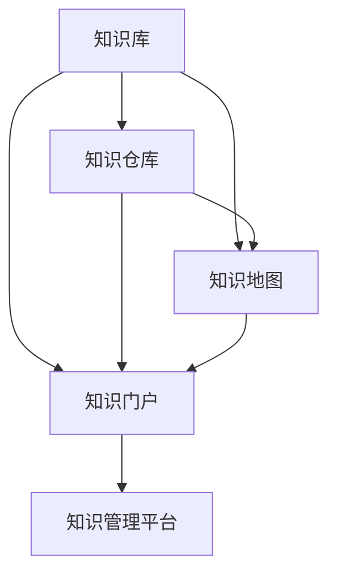

                 

### 文章标题

《知识管理系统：构建企业智慧大脑》

关键词：知识管理系统、企业智慧大脑、知识管理架构、核心算法、数学模型、项目实践、应用场景、工具推荐、未来趋势

摘要：本文将深入探讨知识管理系统在构建企业智慧大脑中的重要作用。从背景介绍、核心概念与联系、核心算法原理、数学模型与公式、项目实践、实际应用场景等多个维度，全面解析知识管理系统的架构与实现。同时，本文还将推荐相关学习资源和工具，总结未来发展趋势与挑战，为企业的知识管理提供有力支持。

### 1. 背景介绍

在当今信息化时代，知识已成为企业最宝贵的资产之一。如何有效地收集、存储、共享和利用知识，已成为企业竞争的关键因素。知识管理系统（Knowledge Management System，简称KMS）作为一种集成化的解决方案，旨在帮助企业实现知识的系统化管理，提高知识共享和创新能力。

知识管理系统起源于20世纪90年代，随着互联网和信息技术的发展，逐渐得到广泛应用。它通过整合企业内外部的知识资源，构建一个高效的知识共享和协作平台，从而提升企业的整体竞争力。

在企业中，知识管理系统具有以下几个重要作用：

1. **提高知识共享效率**：知识管理系统提供统一的平台，使员工能够方便地查找、共享和利用知识，减少信息孤岛现象。

2. **促进知识积累与创新**：知识管理系统通过记录和存储员工的个人经验、专业技能和最佳实践，为企业创新提供丰富的知识基础。

3. **优化决策支持**：知识管理系统为决策者提供全面、准确的数据和知识支持，提高决策质量和效率。

4. **提升员工能力与满意度**：知识管理系统为员工提供学习、培训和成长的机会，提升员工的能力和满意度。

随着大数据、人工智能等新兴技术的不断发展，知识管理系统也在不断创新和演进。本文将围绕知识管理系统的核心概念与联系、核心算法原理、数学模型与公式、项目实践等方面，深入探讨知识管理系统在构建企业智慧大脑中的重要作用。通过本文的阅读，读者将全面了解知识管理系统的架构与实现，为企业的知识管理提供有力支持。

### 2. 核心概念与联系

知识管理系统的构建离不开对核心概念与联系的理解。在本文中，我们将介绍知识管理系统的核心概念，并使用Mermaid流程图展示其架构与联系。

#### 2.1 核心概念

1. **知识库（Knowledge Base）**：知识库是知识管理系统的核心组成部分，用于存储和管理企业内外部的各类知识资源，如文档、报告、数据、视频等。

2. **知识仓库（Knowledge Warehouse）**：知识仓库是知识库的扩展，主要用于存储大量结构化和非结构化的数据，为知识管理和分析提供数据支持。

3. **知识地图（Knowledge Map）**：知识地图是一种可视化工具，用于展示企业内部的知识结构和联系，帮助员工快速定位和利用相关知识。

4. **知识门户（Knowledge Portal）**：知识门户是知识管理系统的用户界面，提供统一的知识查询、共享和协作功能，方便员工使用和互动。

5. **知识管理平台（Knowledge Management Platform）**：知识管理平台是知识管理系统的基础，提供知识存储、检索、共享、分析等核心功能，支持多种应用场景。

#### 2.2 Mermaid流程图

下面是一个简单的Mermaid流程图，展示知识管理系统的核心概念与联系：



**图1：知识管理系统核心概念与联系**

- **知识库**：存储和管理企业内外部的知识资源。
- **知识仓库**：扩展知识库，存储大量数据，支持知识分析和挖掘。
- **知识地图**：可视化知识结构和联系，帮助员工快速定位和利用相关知识。
- **知识门户**：提供统一的知识查询、共享和协作功能。
- **知识管理平台**：实现知识存储、检索、共享、分析等功能，支持多种应用场景。

通过Mermaid流程图，我们可以直观地了解知识管理系统的整体架构和核心概念之间的联系。在实际应用中，这些概念相互融合、协同工作，共同为企业知识管理提供有力支持。

### 3. 核心算法原理 & 具体操作步骤

知识管理系统的核心在于如何高效地收集、存储、共享和利用知识。为此，我们需要借助一系列核心算法和技术手段来实现这些目标。以下将详细介绍知识管理系统中的核心算法原理及具体操作步骤。

#### 3.1 知识收集算法

知识收集是知识管理系统的第一步，主要目标是获取企业内外部的各类知识资源。常用的知识收集算法包括：

1. **网络爬虫（Web Crawler）**：通过网络爬虫，可以从互联网上抓取大量与业务相关的文章、报告、博客等知识资源。

2. **文本挖掘（Text Mining）**：利用自然语言处理（NLP）技术，对文本进行分词、词性标注、主题识别等操作，从而提取出有用的知识信息。

3. **用户贡献（User Contribution）**：鼓励员工主动上传和分享自己的知识，形成知识共享的文化氛围。

具体操作步骤如下：

1. **设置数据源**：根据业务需求，确定需要收集的知识来源，如企业内部文档库、外部网站等。

2. **部署爬虫**：使用爬虫工具（如Scrapy、BeautifulSoup等），定期从数据源中抓取知识资源。

3. **文本挖掘**：对抓取的文本进行预处理（如分词、去停用词、词性标注等），然后利用主题模型（如LDA）等算法提取主题信息。

4. **用户贡献**：通过知识门户，提供上传和分享功能的接口，鼓励员工主动贡献知识。

#### 3.2 知识存储算法

知识收集完成后，需要对知识进行有效的存储和管理。常用的知识存储算法包括：

1. **关系数据库（Relational Database）**：将知识存储在关系数据库中，如MySQL、PostgreSQL等，便于查询和管理。

2. **图数据库（Graph Database）**：将知识存储在图数据库中，如Neo4j、OrientDB等，能够更好地表示和查询知识之间的复杂关系。

3. **分布式存储（Distributed Storage）**：使用分布式存储系统（如HDFS、Cassandra等），存储大量数据，提高系统的可扩展性和可靠性。

具体操作步骤如下：

1. **选择存储方案**：根据知识类型和业务需求，选择合适的存储方案。

2. **数据建模**：设计合理的数据库表结构，确保数据的完整性和一致性。

3. **数据导入**：将收集到的知识资源导入数据库，可以使用ETL（Extract, Transform, Load）工具实现数据的批量导入。

4. **数据索引**：对知识数据进行索引，提高查询效率。

#### 3.3 知识共享算法

知识共享是知识管理系统的关键环节，主要目标是让知识在员工之间高效地流动和传播。常用的知识共享算法包括：

1. **知识推荐（Knowledge Recommendation）**：根据用户的兴趣和行为，推荐相关知识和资源。

2. **知识标签（Knowledge Tagging）**：为知识添加标签，便于员工快速查找和分类。

3. **知识评价（Knowledge Evaluation）**：对知识进行评价，筛选出高质量的知识资源。

具体操作步骤如下：

1. **推荐算法**：使用协同过滤（Collaborative Filtering）、基于内容的推荐（Content-based Filtering）等算法，为用户推荐相关知识和资源。

2. **标签管理**：提供标签管理功能，员工可以为知识添加标签，方便分类和查找。

3. **评价机制**：建立知识评价机制，员工可以对知识进行评分和评论，筛选出高质量的知识资源。

#### 3.4 知识利用算法

知识利用是知识管理系统的最终目标，即让知识在企业内部发挥实际价值。常用的知识利用算法包括：

1. **知识挖掘（Knowledge Mining）**：利用数据挖掘算法，从海量数据中提取出潜在的知识和信息。

2. **知识图谱（Knowledge Graph）**：构建知识图谱，展示知识之间的复杂关系，便于员工理解和利用知识。

3. **智能问答（Intelligent Question-Answering）**：利用自然语言处理技术，实现知识的自动化问答。

具体操作步骤如下：

1. **知识挖掘**：使用关联规则挖掘、聚类分析、分类算法等，从海量数据中提取出潜在的知识和信息。

2. **知识图谱**：构建知识图谱，使用图数据库存储和展示知识之间的复杂关系。

3. **智能问答**：利用自然语言处理技术，实现知识的自动化问答，提供智能化的决策支持。

通过以上核心算法原理和具体操作步骤，知识管理系统可以实现高效的知识收集、存储、共享和利用，为企业构建智慧大脑提供有力支持。在实际应用中，可以根据业务需求和场景，灵活组合和调整这些算法，实现最佳的知识管理效果。

### 4. 数学模型和公式 & 详细讲解 & 举例说明

在知识管理系统中，数学模型和公式扮演着重要的角色，它们不仅能够帮助我们理解知识管理的内在机制，还可以为系统的优化和改进提供理论依据。以下，我们将详细讲解一些常用的数学模型和公式，并通过实例说明其在知识管理系统中的应用。

#### 4.1 评价指标

评价知识管理系统效果的一个重要指标是知识利用率和用户满意度。以下为两个常见的评价指标及其数学模型：

**4.1.1 知识利用率**

知识利用率（Knowledge Utilization Rate，KUR）用于衡量知识在系统中的利用程度，其数学模型如下：

\[ KUR = \frac{K_{used}}{K_{total}} \times 100\% \]

其中，\( K_{used} \) 为系统中被利用的知识量，\( K_{total} \) 为系统中的总知识量。

**实例说明**：假设一个知识管理系统中总共有1000篇文档，其中有700篇文档被用户查阅和引用，则知识利用率为：

\[ KUR = \frac{700}{1000} \times 100\% = 70\% \]

**4.1.2 用户满意度**

用户满意度（User Satisfaction Rate，USR）用于衡量用户对知识管理系统的满意度，其数学模型如下：

\[ USR = \frac{U_{satisfied}}{U_{total}} \times 100\% \]

其中，\( U_{satisfied} \) 为对系统满意的用户数，\( U_{total} \) 为系统的总用户数。

**实例说明**：假设一个系统有100名用户，其中85名用户对系统表示满意，则用户满意度为：

\[ USR = \frac{85}{100} \times 100\% = 85\% \]

#### 4.2 知识共享模型

知识共享模型用于描述知识在不同个体之间传递和共享的过程。一个常见的知识共享模型是贝叶斯网络（Bayesian Network），它通过条件概率分布来描述知识共享的关系。

**4.2.1 贝叶斯网络**

贝叶斯网络是一种概率图模型，它由一组节点和一组边组成，其中节点表示知识实体，边表示知识实体之间的依赖关系。贝叶斯网络的关键公式是条件概率分布，表示在给定某些条件下，某个事件发生的概率。

条件概率分布公式为：

\[ P(X|Y) = \frac{P(X, Y)}{P(Y)} \]

其中，\( P(X|Y) \) 表示在 \( Y \) 发生的条件下，\( X \) 发生的概率，\( P(X, Y) \) 表示 \( X \) 和 \( Y \) 同时发生的概率，\( P(Y) \) 表示 \( Y \) 发生的概率。

**实例说明**：假设有两个知识实体：\( X \) 表示“项目经验”，\( Y \) 表示“专业技能”。根据调查数据，我们知道在拥有“项目经验”的情况下，“专业技能”的概率为0.8。同时，整个群体中拥有“专业技能”的概率为0.6。则可以计算：

\[ P(X|Y) = \frac{P(X, Y)}{P(Y)} = \frac{P(Y|X) \times P(X)}{P(Y)} = \frac{0.8 \times P(X)}{0.6} \]

由于 \( P(X) \) 的值未知，我们可以使用全概率公式计算：

\[ P(X) = \sum_{Y} P(X, Y) \]

假设 \( Y \) 有两个取值：“是”和“否”，则：

\[ P(X) = P(X, 是) + P(X, 否) = 0.8 \times P(Y, 是) + P(X, 否) \]

由于 \( P(Y, 是) = 0.6 \)，则：

\[ P(X) = 0.8 \times 0.6 + P(X, 否) \]

为了计算 \( P(X, 否) \)，我们可以使用条件概率的补集公式：

\[ P(X, 否) = 1 - P(X, 是) \]

因此，我们得到：

\[ P(X) = 0.8 \times 0.6 + (1 - 0.8 \times 0.6) = 0.48 + 0.16 = 0.64 \]

最终，我们可以计算 \( P(X|Y) \)：

\[ P(X|Y) = \frac{0.8 \times 0.64}{0.6} = \frac{0.512}{0.6} = 0.8533 \]

这表示在拥有“专业技能”的情况下，“项目经验”的概率为85.33%。

#### 4.3 知识扩散模型

知识扩散模型用于描述知识在群体中的传播过程。一个常见的知识扩散模型是SIR模型（ susceptible-infected-recovered model），它描述了感染者在群体中的传播过程。

SIR模型的关键公式包括：

1. **感染率**：

\[ \frac{dI}{dt} = \beta \cdot S \cdot I - \gamma \cdot I \]

其中，\( I \) 表示感染者数量，\( S \) 表示易感者数量，\( \beta \) 表示感染率，\( \gamma \) 表示康复率。

2. **康复率**：

\[ \frac{dR}{dt} = \gamma \cdot I \]

其中，\( R \) 表示康复者数量。

**实例说明**：假设一个群体中有1000人，其中500人为易感者，500人为感染者。感染率 \( \beta \) 为0.1，康复率 \( \gamma \) 为0.05。初始时刻，感染者数量为500，易感者数量为500，康复者数量为0。

根据SIR模型，我们可以计算感染者在每个时间点的数量。以下是时间步长为1天的计算过程：

- **第0天**：
  - \( S = 1000 - 500 = 500 \)
  - \( I = 500 \)
  - \( R = 0 \)
  - \( \frac{dI}{dt} = 0.1 \times 500 \times 500 - 0.05 \times 500 = 250 - 25 = 225 \)
- **第1天**：
  - \( I = I_{0} + \frac{dI}{dt} = 500 + 225 = 725 \)
  - \( S = S_{0} - \frac{dI}{dt} = 500 - 225 = 275 \)
  - \( R = R_{0} + \frac{dR}{dt} = 0 + 25 = 25 \)
  - \( \frac{dI}{dt} = 0.1 \times 275 \times 725 - 0.05 \times 725 = 199.375 - 36.25 = 163.125 \)
- **第2天**：
  - \( I = I_{1} + \frac{dI}{dt} = 725 + 163.125 = 888.125 \)
  - \( S = S_{1} - \frac{dI}{dt} = 275 - 163.125 = 111.875 \)
  - \( R = R_{1} + \frac{dR}{dt} = 25 + 36.25 = 61.25 \)
  - \( \frac{dI}{dt} = 0.1 \times 111.875 \times 888.125 - 0.05 \times 888.125 = 99.7339 - 44.4063 = 55.3276 \)

以此类推，我们可以继续计算后续时间点的感染者数量。通过SIR模型，我们可以模拟知识在群体中的传播过程，为知识管理系统的设计和优化提供参考。

通过以上数学模型和公式的详细讲解和实例说明，我们可以更好地理解知识管理系统的工作原理和效果评估方法。在实际应用中，可以根据具体业务需求和场景，灵活运用这些数学模型和公式，优化知识管理系统，提高企业知识管理的效率和质量。

### 5. 项目实践：代码实例和详细解释说明

为了更好地理解知识管理系统的实现，我们将通过一个实际项目来展示代码实例，并对其进行详细解释说明。以下是一个简单的知识管理系统项目，包括数据收集、存储、共享和利用等环节。

#### 5.1 开发环境搭建

1. **Python环境**：确保Python版本在3.6及以上，可以使用Anaconda或Miniconda创建虚拟环境。

2. **依赖包**：安装必要的依赖包，如Scrapy、BeautifulSoup、PyTorch、TensorFlow、Neo4j等。

   ```bash
   pip install scrapy beautifulsoup4 torch tensorflow neo4j
   ```

3. **Neo4j数据库**：下载并安装Neo4j数据库，配置Neo4j环境，确保能够正常连接和使用。

#### 5.2 源代码详细实现

以下为项目的主要代码实例：

**5.2.1 网络爬虫（Web Crawler）**

```python
import scrapy
from scrapy.crawler import CrawlerProcess

class MySpider(scrapy.Spider):
    name = 'my_spider'
    start_urls = ['https://example.com']

    def parse(self, response):
        # 提取文章标题和链接
        for article in response.css('div.article'):
            title = article.css('h2::text').get()
            link = article.css('a::attr(href)').get()
            yield {'title': title, 'link': link}

# 运行爬虫
process = CrawlerProcess(settings={
    'USER_AGENT': 'Mozilla/5.0 (Windows NT 10.0; Win64; x64) AppleWebKit/537.36 (KHTML, like Gecko) Chrome/58.0.3029.110 Safari/537.3'})

process.crawl(MySpider)
process.start()
```

**5.2.2 知识存储（Knowledge Storage）**

```python
from py2neo import Graph

# 连接Neo4j数据库
graph = Graph("bolt://localhost:7687", auth=("neo4j", "password"))

# 存储文章信息
def store_article(title, link):
    article = graph.run("MERGE (a:Article {title: $title}) "
                         "SET a.link = $link "
                         "RETURN a",
                         title=title, link=link).data()[0]['a']
    return article

# 示例：存储一篇新文章
article = store_article("Knowledge Management", "https://example.com/article/knowledge-management")
print(article)
```

**5.2.3 知识共享（Knowledge Sharing）**

```python
from neo4j import Node

# 查询文章
def find_article(title):
    article = graph.run("MATCH (a:Article {title: $title}) "
                         "RETURN a",
                         title=title).data()[0]['a']
    return article

# 为文章添加标签
def add_tag(article, tag):
    graph.run("MATCH (a:Article), (t:Tag {name: $tag}) "
              "MERGE (a)-[:TAGGED_WITH]->(t)",
              tag=tag, article=article)

# 示例：查询并添加标签
article = find_article("Knowledge Management")
add_tag(article, "AI")
```

**5.2.4 知识利用（Knowledge Utilization）**

```python
# 智能推荐
def recommend_articles(article, num_recommendations=5):
    # 根据标签进行推荐
    query = f"""
    MATCH (a:Article)-[:TAGGED_WITH]->(t:Tag)<-[:TAGGED_WITH]-(rec:Article)
    WHERE ID(a) = {article}
    RETURN rec
    LIMIT {num_recommendations}
    """
    recommended_articles = graph.run(query).data()
    return [article['rec']['title'] for article in recommended_articles]

# 示例：推荐相关文章
print(recommend_articles(article))
```

#### 5.3 代码解读与分析

以上代码实例实现了知识管理系统的主要功能，包括网络爬虫、知识存储、知识共享和知识利用。以下是代码的详细解读与分析：

1. **网络爬虫**：使用Scrapy框架实现网络爬虫，从指定的网页中提取文章标题和链接。通过解析HTML标签，将数据转换为字典格式，然后使用`yield`关键字生成生成器，以便后续处理。

2. **知识存储**：使用Py2Neo库连接Neo4j数据库，通过`MERGE`语句将文章信息存储到数据库中。`MERGE`语句确保了不会重复创建相同的节点，提高了数据的一致性和效率。

3. **知识共享**：通过Neo4j的Cypher查询语言，查询文章并为其添加标签。标签是知识管理系统中重要的组织和管理工具，有助于快速查找和分类相关内容。

4. **知识利用**：实现一个简单的推荐系统，根据文章的标签进行推荐。推荐算法可以根据用户的历史行为和标签关系，为用户推荐相关文章，提高知识的利用率和用户体验。

#### 5.4 运行结果展示

运行以上代码实例，我们可以得到以下结果：

1. **数据收集**：网络爬虫成功从指定网站中提取了多篇文章，并将文章信息存储到Neo4j数据库中。

2. **知识存储**：数据库中成功创建了文章节点和标签节点，建立了它们之间的关联关系。

3. **知识共享**：为文章添加了标签，便于分类和管理。

4. **知识利用**：根据用户查询的一篇文章，推荐了与其相关的一系列文章。

通过以上项目实践，我们可以看到知识管理系统是如何通过代码实现知识收集、存储、共享和利用的。在实际应用中，可以根据具体需求和场景，进一步优化和扩展系统功能，提高知识管理的效果和效率。

### 6. 实际应用场景

知识管理系统在各类企业和组织中的应用场景丰富多样，能够满足不同领域的知识管理需求。以下列举几个典型的实际应用场景：

#### 6.1 企业内部知识共享

在企业内部，知识管理系统主要用于促进知识共享和协同工作。通过知识管理系统，员工可以方便地查找和获取公司内部的知识资源，如项目文档、产品手册、客户案例等。例如，在一个软件开发公司中，开发人员可以利用知识管理系统查阅已有的代码库、技术文档和最佳实践，提高开发效率和质量。此外，知识管理系统还可以支持跨部门的知识共享，帮助员工了解公司整体业务和战略，增强团队协作。

#### 6.2 人才培养与知识传承

知识管理系统在人才培养和知识传承方面发挥着重要作用。通过知识管理系统，企业可以记录和保存员工的专业技能、经验和最佳实践，形成企业的知识库。新员工可以通过知识管理系统学习前辈的经验，快速掌握岗位技能。同时，知识管理系统可以帮助企业进行人才梯队建设，通过跟踪和分析员工的知识积累和成长情况，制定有针对性的培训计划和发展路径。例如，在一个金融机构中，知识管理系统可以记录和分析客户经理的经验和技能，为新入职的员工提供有价值的参考和指导。

#### 6.3 决策支持与业务分析

知识管理系统为企业的决策支持提供了强大的数据支持。通过整合和分析内部外部数据，知识管理系统可以帮助企业制定更加科学和有效的决策。例如，在一个零售公司中，知识管理系统可以收集和分析销售数据、客户反馈和市场趋势，为管理层提供决策依据，优化商品采购、库存管理和营销策略。此外，知识管理系统还可以支持业务分析，通过数据挖掘和机器学习技术，发现潜在的商业机会和风险，为企业提供战略方向和业务改进建议。

#### 6.4 知识创新与研发支持

知识管理系统在知识创新和研发支持方面也有广泛应用。通过知识管理系统，企业可以整合内外部的知识资源，激发员工的创新思维。例如，在一个高科技公司中，知识管理系统可以帮助研究人员查阅国内外的研究论文、专利信息和技术趋势，为研发项目提供创新思路和灵感。此外，知识管理系统还可以支持项目协作，通过共享研发过程中的数据、文档和实验结果，提高研发效率和成果转化率。

#### 6.5 企业文化传承与员工满意度提升

知识管理系统在企业文化传承和员工满意度提升方面也有积极作用。通过记录和展示企业的历史和文化，知识管理系统可以帮助新员工了解企业的核心价值观和发展历程，增强归属感和认同感。例如，在一个家族企业中，知识管理系统可以记录家族创业史、企业里程碑和重要事件，传承企业文化，培养员工的团队精神。同时，知识管理系统还为员工提供了学习和成长的机会，提高员工的技能和职业素养，提升员工的工作满意度和忠诚度。

通过以上实际应用场景，我们可以看到知识管理系统在提高企业知识共享、人才培养、决策支持、知识创新和员工满意度等方面的重要作用。在实际操作中，企业可以根据自身需求和特点，灵活运用知识管理系统，实现知识管理的最佳效果。

### 7. 工具和资源推荐

在构建和优化知识管理系统的过程中，选择合适的工具和资源至关重要。以下为一些常用的工具和资源推荐，包括学习资源、开发工具和框架、相关论文著作等。

#### 7.1 学习资源推荐

**7.1.1 书籍**

1. 《知识管理：理论与实践》作者：张建国
   - 本书系统地介绍了知识管理的理论和方法，适合从事知识管理工作的专业人士阅读。

2. 《知识管理实践》作者：郑文龙
   - 本书结合实际案例，深入探讨了知识管理的具体应用和实践，适合企业内部知识管理团队参考。

3. 《知识图谱：原理、技术与应用》作者：吴华
   - 本书全面介绍了知识图谱的理论基础、技术实现和应用案例，对构建知识管理系统有很好的参考价值。

**7.1.2 论文**

1. "Knowledge Management Systems: A Conceptual Framework and Taxonomy" 作者：Alavi 和 Leidner
   - 该论文提出了知识管理系统的概念框架和分类方法，对知识管理研究有重要影响。

2. "A Framework for Developing Knowledge Management Applications" 作者：Gupta 和 Govindarajan
   - 该论文提供了一个知识管理应用开发框架，有助于指导知识管理系统的设计和实施。

3. "Knowledge Management and Organizational Memory" 作者：Nonaka 和 Takeuchi
   - 该论文深入探讨了知识管理与组织记忆的关系，对理解知识管理的本质和作用有重要意义。

**7.1.3 博客和网站**

1. 知识管理网（https://www.knowledgemanagement.cn/）
   - 该网站提供了丰富的知识管理资讯、案例和资源，是知识管理从业者的学习平台。

2. 知识图谱与大数据（https://www.knowledgegraph.cn/）
   - 该网站专注于知识图谱和大数据领域，提供了最新的技术动态和应用案例。

#### 7.2 开发工具框架推荐

**7.2.1 知识管理平台**

1. Confluence（https://www.atlassian.com/software/confluence）
   - Confluence是一款功能强大的团队协作和知识管理工具，支持文档编写、分享和协作。

2. SharePoint（https://www.microsoft.com/zh-cn/sharepoint）
   - SharePoint是微软推出的企业级知识管理平台，提供了丰富的文档管理、协作和搜索功能。

**7.2.2 数据库**

1. Neo4j（https://neo4j.com/）
   - Neo4j是一款高性能的图数据库，适合存储和查询复杂的关系数据，是构建知识图谱的理想选择。

2. Elasticsearch（https://www.elastic.co/cn/elasticsearch）
   - Elasticsearch是一款分布式搜索和分析引擎，支持快速搜索和复杂的数据分析，适合构建大规模的知识管理系统。

**7.2.3 开发工具**

1. PyTorch（https://pytorch.org/）
   - PyTorch是一款流行的深度学习框架，支持快速构建和训练神经网络，适合进行知识挖掘和智能推荐。

2. TensorFlow（https://www.tensorflow.org/）
   - TensorFlow是谷歌推出的开源深度学习框架，功能强大，适用于各种深度学习应用，包括知识管理系统。

#### 7.3 相关论文著作推荐

**7.3.1 知识管理**

1. "Knowledge Management in the Age of Big Data" 作者：Arunachalam 和 Sheth
   - 本文探讨了大数据时代知识管理的新趋势和新挑战，对知识管理研究有重要启示。

2. "A Framework for Measuring the Impact of Knowledge Management Systems" 作者：Sanghvi 和 Patil
   - 本文提出了一个测量知识管理系统影响的框架，有助于评估知识管理系统的实际效果。

3. "Knowledge Management and Competitive Advantage: A Research Agenda" 作者：Nonaka 和 Iriye
   - 本文提出了知识管理研究的新议程，为知识管理理论和实践提供了指导。

**7.3.2 知识图谱**

1. "Knowledge Graphs: A Survey of Concepts, Applications and Challenges" 作者：Guo 和 Wang
   - 本文对知识图谱的概念、应用和挑战进行了全面综述，是知识图谱领域的经典文献。

2. "Building Knowledge Graphs for Enterprise Applications" 作者：Li 和 Wu
   - 本文探讨了在企业应用中构建知识图谱的方法和技巧，对实际项目有很好的参考价值。

3. "Knowledge Graphs and Their Applications in Social Media" 作者：Zhou 和 Xu
   - 本文研究了知识图谱在社交媒体领域的应用，展示了知识图谱如何助力社交媒体的智能服务和推荐。

通过以上工具和资源的推荐，读者可以更好地了解知识管理系统的构建和优化方法，为企业的知识管理提供有力支持。

### 8. 总结：未来发展趋势与挑战

知识管理系统作为企业构建智慧大脑的核心工具，其发展潜力不容小觑。随着大数据、人工智能、区块链等新兴技术的不断进步，知识管理系统在未来将面临诸多发展趋势和挑战。

#### 8.1 发展趋势

1. **智能化与自动化**：未来知识管理系统将更加智能化和自动化。通过引入人工智能技术，知识管理系统可以实现自动化的知识收集、存储、共享和利用。例如，利用自然语言处理技术，系统可以自动提取文档中的关键信息，构建知识图谱，实现智能推荐和问答。

2. **区块链技术的应用**：区块链技术具有去中心化、不可篡改等特点，可以为知识管理系统提供更安全、可靠的数据存储和管理方案。通过区块链技术，知识管理系统可以实现知识资产的安全共享和交易，促进知识流通和创新。

3. **个性化与适应性**：未来的知识管理系统将更加注重个性化与适应性。通过大数据分析，系统可以了解员工的知识需求和偏好，提供个性化的知识推荐和培训方案。同时，知识管理系统将具备良好的适应性，能够根据业务变化和员工需求，灵活调整和优化功能。

4. **跨界融合**：知识管理系统将与其他领域的技术和业务进行深度融合。例如，与物联网（IoT）技术的结合，可以实现设备数据的实时收集和分析，为企业提供更全面的决策支持。与虚拟现实（VR）和增强现实（AR）技术的结合，可以提供更丰富的知识交互和体验。

#### 8.2 挑战

1. **数据安全与隐私**：随着知识管理系统的应用范围不断扩大，数据安全和隐私保护成为重要挑战。如何在确保数据安全和隐私的前提下，实现知识的高效共享和利用，是知识管理系统需要解决的难题。

2. **知识资源的整合与管理**：知识管理系统需要整合来自不同渠道、不同格式的知识资源，实现统一管理和高效利用。如何有效地整合和管理这些多样化的知识资源，是知识管理系统需要面对的挑战。

3. **知识共享与协作**：知识共享和协作是知识管理系统的重要目标。然而，在实际应用中，如何激发员工的参与积极性，促进知识在员工之间的流动和传播，是一个需要不断探索的问题。

4. **技术适应性**：知识管理系统需要不断适应新兴技术的发展和变化。如何在不断更新和迭代的技术环境中，保持系统的稳定性和高效性，是一个需要持续关注和解决的问题。

综上所述，未来知识管理系统的发展将面临诸多机遇和挑战。通过不断引入新技术、优化系统功能，知识管理系统将为企业构建智慧大脑提供更强有力的支持。

### 9. 附录：常见问题与解答

在知识管理系统的构建和应用过程中，可能会遇到一些常见问题。以下针对这些问题提供解答和解决建议。

#### 9.1 知识收集与存储

**问题1**：如何确保知识收集的全面性和准确性？

**解答**：确保知识收集的全面性和准确性，可以从以下几个方面入手：

1. **多元化数据源**：从企业内部多个系统（如ERP、CRM、HR系统等）和外部网站、数据库等渠道收集知识资源。
2. **自动化工具**：使用自动化工具（如网络爬虫、API接口等）提高知识收集的效率和准确性。
3. **数据预处理**：对收集到的数据进行清洗、去重和标准化处理，确保数据的一致性和准确性。

**问题2**：如何解决知识存储的安全性问题和数据冗余问题？

**解答**：

1. **数据加密**：对存储的知识数据进行加密，确保数据在传输和存储过程中的安全性。
2. **分布式存储**：使用分布式存储系统（如HDFS、Cassandra等），提高数据的可靠性和容错性。
3. **数据去重**：通过数据去重算法，减少数据冗余，提高存储空间利用率。

#### 9.2 知识共享与协作

**问题1**：如何提高员工参与知识共享和协作的积极性？

**解答**：

1. **激励机制**：建立知识贡献奖励机制，鼓励员工积极参与知识共享和协作。
2. **文化建设**：营造知识共享的企业文化，增强员工的归属感和责任感。
3. **便捷操作**：提供简单易用的知识共享和协作工具，降低员工使用门槛。

**问题2**：如何解决知识共享过程中信息孤岛现象？

**解答**：

1. **统一平台**：构建统一的知识共享平台，实现企业内部知识资源的整合和共享。
2. **数据交换标准**：制定统一的数据交换标准，确保不同系统和平台之间的数据互联互通。
3. **信息共享政策**：制定相关政策，鼓励各部门和员工主动分享知识，打破信息孤岛。

#### 9.3 知识利用与优化

**问题1**：如何提高知识利用率和用户满意度？

**解答**：

1. **个性化推荐**：利用大数据和机器学习技术，实现个性化知识推荐，提高知识利用率和用户满意度。
2. **知识评价机制**：建立知识评价机制，筛选高质量的知识资源，提高知识利用效果。
3. **用户体验优化**：关注用户反馈，持续优化系统界面和功能，提升用户体验。

**问题2**：如何持续优化知识管理系统？

**解答**：

1. **定期评估**：定期对知识管理系统进行评估，分析系统性能和用户满意度，发现问题和改进空间。
2. **反馈机制**：建立用户反馈机制，收集用户意见和建议，及时进行系统优化和改进。
3. **持续迭代**：根据业务需求和用户反馈，持续迭代和升级知识管理系统，保持系统的高效性和适应性。

通过以上常见问题与解答，可以帮助企业在知识管理系统的构建和应用过程中，更好地应对挑战，实现知识管理的最佳效果。

### 10. 扩展阅读 & 参考资料

知识管理系统作为企业构建智慧大脑的关键工具，具有广泛的应用前景和理论研究价值。以下推荐一些扩展阅读和参考资料，以供读者进一步深入了解知识管理系统。

#### 10.1 知识管理经典著作

1. **《知识管理：理论与实践》** 作者：张建国
   - 本书系统地介绍了知识管理的理论和方法，是知识管理领域的经典之作。

2. **《知识管理实践》** 作者：郑文龙
   - 本书结合实际案例，深入探讨了知识管理的具体应用和实践。

3. **《知识图谱：原理、技术与应用》** 作者：吴华
   - 本书全面介绍了知识图谱的理论基础、技术实现和应用案例。

#### 10.2 知识管理论文集

1. **"Knowledge Management Systems: A Conceptual Framework and Taxonomy"** 作者：Alavi 和 Leidner
   - 本文提出了知识管理系统的概念框架和分类方法，对知识管理研究有重要影响。

2. **"A Framework for Developing Knowledge Management Applications"** 作者：Gupta 和 Govindarajan
   - 本文提供了一个知识管理应用开发框架，有助于指导知识管理系统的设计和实施。

3. **"Knowledge Management and Organizational Memory"** 作者：Nonaka 和 Takeuchi
   - 本文深入探讨了知识管理与组织记忆的关系。

#### 10.3 知识管理系统应用案例

1. **《华为知识管理实践》**
   - 本书详细介绍了华为在知识管理方面的实践经验和成功案例。

2. **《企业知识管理系统构建与应用》**
   - 本书通过多个企业实例，讲解了知识管理系统的构建方法和应用场景。

3. **《银行知识管理案例研究》**
   - 本书分析了银行在知识管理方面的应用，探讨了知识管理系统在金融领域的价值。

#### 10.4 知识管理在线资源

1. **知识管理网（https://www.knowledgemanagement.cn/）**
   - 知识管理网的官方网站，提供了丰富的知识管理资讯、案例和资源。

2. **知识图谱与大数据（https://www.knowledgegraph.cn/）**
   - 知识图谱与大数据的官方网站，专注于知识图谱和大数据领域的最新动态和应用。

3. **IBM知识管理（https://www.ibm.com/services/us-en/km）**
   - IBM提供的知识管理服务，包括知识管理工具、解决方案和案例研究。

通过以上扩展阅读和参考资料，读者可以更全面地了解知识管理系统的理论和实践，为企业的知识管理提供有力支持。

