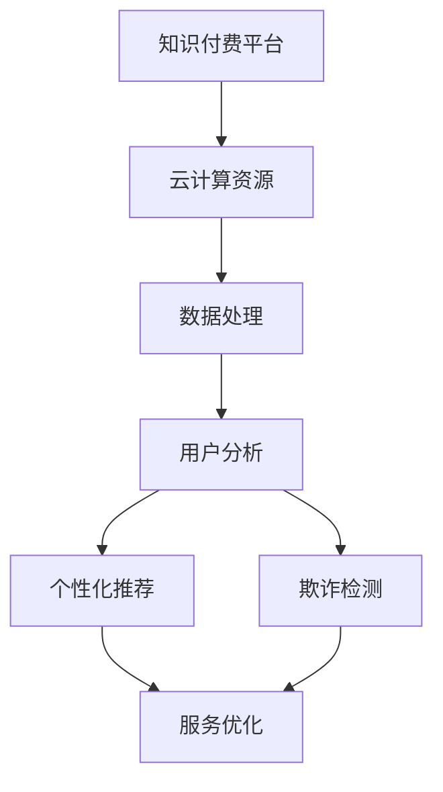

                 

### 文章标题：知识经济下知识付费的云计算与大数据服务

> **关键词：**知识付费、云计算、大数据、知识经济、服务模式、技术应用、商业模式

> **摘要：**本文旨在探讨知识经济下知识付费的发展现状及挑战，重点分析云计算和大数据技术在知识付费服务中的应用。通过逐步分析云计算和大数据的核心概念、算法原理、应用实例，揭示其在知识付费服务中的关键作用，并展望未来发展趋势与挑战。

### 1. 背景介绍

随着互联网技术的飞速发展，知识经济逐渐成为全球经济增长的新引擎。知识付费作为知识经济的重要组成部分，正以前所未有的速度崛起。知识付费是指个人或机构通过互联网平台提供知识服务，用户按需支付费用的一种商业模式。这种模式改变了传统知识传播的方式，使得知识的获取更加便捷、高效。

然而，知识付费也面临着诸多挑战。首先，知识的质量与真实度难以保障。用户在海量信息中难以甄别优质内容，容易受到虚假信息的误导。其次，知识付费平台的盈利模式较为单一，主要依赖于订阅费和广告收入，难以实现长期稳定发展。此外，知识付费对技术的要求较高，需要处理大量数据，对云计算和大数据技术的依赖性较强。

云计算和大数据技术作为现代信息技术的重要分支，为知识付费的发展提供了强有力的支持。云计算提供了灵活、弹性的计算资源，降低了知识付费平台的运维成本；大数据技术则通过对用户数据的深入挖掘和分析，帮助平台优化服务内容，提高用户满意度。本文将围绕云计算和大数据在知识付费服务中的应用进行深入探讨。

### 2. 核心概念与联系

为了更好地理解云计算和大数据在知识付费服务中的应用，我们需要首先明确这两个核心概念，并分析它们之间的联系。

**2.1 云计算**

云计算是一种通过网络提供计算资源的服务模式，包括基础设施即服务（IaaS）、平台即服务（PaaS）和软件即服务（SaaS）。其中，IaaS提供虚拟机、存储和网络资源；PaaS则提供开发平台和中间件；SaaS则提供应用程序。

云计算的核心优势在于其灵活性和可扩展性。通过云计算，知识付费平台可以根据业务需求动态调整计算资源，避免资源浪费。此外，云计算提供了强大的数据处理能力，使得知识付费平台能够高效地处理海量用户数据。

**2.2 大数据**

大数据是指无法在传统数据处理工具下进行有效管理和处理的数据集，具有海量、多样性和快速增长的特点。大数据技术包括数据采集、存储、处理、分析和可视化等环节。

大数据技术在知识付费服务中的应用主要体现在以下几个方面：

1. **用户数据分析**：通过大数据技术，知识付费平台可以收集用户的行为数据，如浏览记录、购买偏好等，从而了解用户需求，优化服务内容。
2. **个性化推荐**：基于用户数据分析，平台可以构建个性化推荐模型，为用户提供定制化的知识服务，提高用户满意度。
3. **欺诈检测**：大数据技术可以帮助知识付费平台识别和防范虚假用户、刷单等欺诈行为，保障平台生态健康。

**2.3 云计算与大数据的联系**

云计算和大数据技术在知识付费服务中相辅相成。云计算为大数据技术提供了强大的计算和存储能力，使得大数据处理变得更加高效和便捷。而大数据技术则为云计算提供了丰富的数据资源，促进了云计算在知识付费服务中的应用。

下面是云计算和大数据在知识付费服务中的 Mermaid 流程图：



### 3. 核心算法原理 & 具体操作步骤

在知识付费服务中，云计算和大数据技术的核心算法原理主要包括数据采集、用户行为分析、个性化推荐和欺诈检测等方面。以下将逐一介绍这些算法原理，并给出具体操作步骤。

**3.1 数据采集**

数据采集是大数据处理的第一步，主要包括用户行为数据、购买数据和反馈数据等。具体操作步骤如下：

1. **数据收集**：通过网站、APP、邮件等渠道，收集用户注册信息、浏览记录、购买行为和反馈意见等数据。
2. **数据清洗**：对收集到的数据进行去重、去噪和格式转换，确保数据的质量和一致性。
3. **数据存储**：将清洗后的数据存储到分布式数据库或大数据平台中，如Hadoop、HBase等。

**3.2 用户行为分析**

用户行为分析是通过分析用户的行为数据，了解用户的需求和偏好。具体操作步骤如下：

1. **数据预处理**：对用户行为数据进行分词、去停用词、词干提取等预处理操作。
2. **特征提取**：根据用户行为数据，提取用户兴趣、购买偏好等特征。
3. **模型构建**：使用机器学习算法，如决策树、随机森林、支持向量机等，构建用户行为分析模型。
4. **模型评估**：通过交叉验证、A/B测试等方法，评估模型的效果。

**3.3 个性化推荐**

个性化推荐是基于用户行为分析和数据挖掘，为用户提供定制化的知识服务。具体操作步骤如下：

1. **用户画像**：根据用户行为数据，构建用户画像，包括用户兴趣、职业、年龄等特征。
2. **推荐算法**：使用协同过滤、矩阵分解、深度学习等推荐算法，为用户生成推荐列表。
3. **推荐系统**：将推荐结果展示在用户界面，如首页推荐、搜索推荐等。

**3.4 欺诈检测**

欺诈检测是保障知识付费平台生态健康的重要环节。具体操作步骤如下：

1. **数据采集**：收集用户注册、登录、交易等行为数据。
2. **特征提取**：提取用户行为特征，如登录频率、交易金额、购买频次等。
3. **模型构建**：使用监督学习或无监督学习算法，如逻辑回归、决策树、聚类算法等，构建欺诈检测模型。
4. **模型评估**：通过准确率、召回率、F1值等指标，评估模型的效果。

### 4. 数学模型和公式 & 详细讲解 & 举例说明

在云计算和大数据技术中，许多核心算法都依赖于数学模型和公式。以下将详细介绍这些数学模型和公式，并结合实际应用进行举例说明。

**4.1 机器学习模型**

机器学习模型是大数据分析的核心，包括回归分析、分类分析和聚类分析等。以下以逻辑回归为例，介绍其数学模型和公式。

**逻辑回归（Logistic Regression）**

逻辑回归是一种分类模型，用于预测某个事件发生的概率。其数学模型如下：

$$
P(Y=1|X) = \frac{1}{1 + e^{-(\beta_0 + \beta_1X_1 + \beta_2X_2 + \ldots + \beta_nX_n})}
$$

其中，$P(Y=1|X)$ 表示在特征向量 $X$ 下，事件 $Y$ 发生的概率；$\beta_0$、$\beta_1$、$\beta_2$、$\ldots$、$\beta_n$ 是模型参数，需要通过数据训练得到。

**举例说明**

假设我们要预测一个用户是否会在未来一个月内购买某课程。我们可以收集用户的行为数据，如浏览次数、购买历史等，构建逻辑回归模型。然后，通过计算特征向量 $X$ 的概率，预测用户购买的概率。

**4.2 协同过滤（Collaborative Filtering）**

协同过滤是一种基于用户行为数据的推荐算法，分为基于用户的协同过滤（User-based Collaborative Filtering）和基于项目的协同过滤（Item-based Collaborative Filtering）。

**基于用户的协同过滤**

基于用户的协同过滤通过计算用户之间的相似度，找到与目标用户相似的其他用户，推荐这些用户喜欢的项目。其数学模型如下：

$$
\text{Similarity}(u, v) = \frac{\text{CommonInterest}(u, v)}{\sqrt{\text{InterestOf}(u) \times \text{InterestOf}(v)}}
$$

其中，$\text{CommonInterest}(u, v)$ 表示用户 $u$ 和用户 $v$ 共同感兴趣的项目数；$\text{InterestOf}(u)$ 和 $\text{InterestOf}(v)$ 分别表示用户 $u$ 和用户 $v$ 的感兴趣项目总数。

**举例说明**

假设我们要为用户 $u$ 推荐课程。我们可以计算用户 $u$ 与其他用户的相似度，找到与用户 $u$ 最相似的其他用户 $v$。然后，推荐用户 $v$ 喜欢的课程。

**4.3 聚类分析（Clustering Analysis）**

聚类分析是一种无监督学习方法，用于将数据分成若干个簇。常用的聚类算法包括K-means、层次聚类等。

**K-means算法**

K-means算法是一种基于距离的聚类算法，其目标是将数据分成K个簇，使得簇内数据距离最小，簇间数据距离最大。其数学模型如下：

$$
\text{Cost} = \sum_{i=1}^{K} \sum_{x \in S_i} ||x - \mu_i||^2
$$

其中，$S_i$ 表示第 $i$ 个簇；$\mu_i$ 表示第 $i$ 个簇的中心点。

**举例说明**

假设我们要将用户数据分成3个簇。我们可以计算每个用户与3个簇中心的距离，将用户分配到最近的簇。

### 5. 项目实践：代码实例和详细解释说明

为了更好地理解云计算和大数据技术在知识付费服务中的应用，我们通过一个实际项目进行实践。以下是一个基于Python和Scikit-learn库的用户行为分析项目。

**5.1 开发环境搭建**

在开始项目之前，我们需要搭建开发环境。以下是所需的Python库和工具：

- Python 3.x
- Jupyter Notebook
- Scikit-learn
- Pandas
- Matplotlib

安装方法如下：

```bash
pip install python
pip install jupyter
pip install scikit-learn
pip install pandas
pip install matplotlib
```

**5.2 源代码详细实现**

以下是一个用户行为分析的项目示例：

```python
import pandas as pd
from sklearn.model_selection import train_test_split
from sklearn.linear_model import LogisticRegression
from sklearn.metrics import accuracy_score
import matplotlib.pyplot as plt

# 5.2.1 数据采集
data = pd.read_csv('user_behavior_data.csv')

# 5.2.2 数据预处理
data['age'] = data['age'].fillna(data['age'].mean())
data['city'] = data['city'].fillna(data['city'].mode()[0])
data['interests'] = data['interests'].fillna('other')

# 5.2.3 特征提取
X = data[['age', 'city', 'interests']]
y = data['purchased']

# 5.2.4 数据划分
X_train, X_test, y_train, y_test = train_test_split(X, y, test_size=0.2, random_state=42)

# 5.2.5 模型构建
model = LogisticRegression()
model.fit(X_train, y_train)

# 5.2.6 模型评估
y_pred = model.predict(X_test)
accuracy = accuracy_score(y_test, y_pred)
print(f'Accuracy: {accuracy:.2f}')

# 5.2.7 可视化
plt.scatter(X_train['age'], X_train['city'], c=y_train, cmap='viridis')
plt.xlabel('Age')
plt.ylabel('City')
plt.title('User Behavior Data')
plt.show()
```

**5.3 代码解读与分析**

1. **数据采集**：我们从CSV文件中读取用户行为数据。
2. **数据预处理**：我们填充缺失值，确保数据的质量。
3. **特征提取**：我们提取用户年龄、城市和兴趣作为特征。
4. **数据划分**：我们划分训练集和测试集，为后续建模做准备。
5. **模型构建**：我们使用逻辑回归构建分类模型。
6. **模型评估**：我们计算模型在测试集上的准确率，评估模型效果。
7. **可视化**：我们绘制用户行为数据散点图，直观地展示用户分布。

通过这个项目示例，我们可以看到云计算和大数据技术在知识付费服务中的应用。数据采集、预处理、特征提取和模型构建等步骤，都是基于云计算和大数据技术的。在实际应用中，我们可以根据业务需求，扩展和优化这些算法，提高知识付费服务的质量。

### 6. 实际应用场景

云计算和大数据技术在知识付费服务中具有广泛的应用场景。以下列举几个典型的实际应用场景，并分析其具体实现方法和效果。

**6.1 个性化推荐**

个性化推荐是知识付费服务中最常见的应用场景之一。通过大数据技术和机器学习算法，平台可以分析用户的行为数据，构建用户画像，为用户推荐感兴趣的知识内容。具体实现方法包括：

1. **数据采集**：收集用户浏览、搜索、购买等行为数据。
2. **用户画像**：构建用户画像，包括用户兴趣、职业、年龄等特征。
3. **推荐算法**：使用协同过滤、矩阵分解、深度学习等推荐算法，为用户生成个性化推荐列表。
4. **推荐系统**：将推荐结果展示在用户界面，如首页推荐、搜索推荐等。

通过个性化推荐，平台可以大大提高用户的满意度，增加知识服务的购买转化率。

**6.2 欺诈检测**

知识付费平台容易受到虚假用户、刷单等欺诈行为的困扰。通过大数据技术和机器学习算法，平台可以构建欺诈检测模型，实时监控和识别异常行为。具体实现方法包括：

1. **数据采集**：收集用户注册、登录、交易等行为数据。
2. **特征提取**：提取用户行为特征，如登录频率、交易金额、购买频次等。
3. **模型构建**：使用监督学习或无监督学习算法，如逻辑回归、决策树、聚类算法等，构建欺诈检测模型。
4. **模型评估**：通过准确率、召回率、F1值等指标，评估模型的效果。

通过欺诈检测，平台可以保障用户生态健康，降低欺诈行为对平台的影响。

**6.3 会员管理**

知识付费平台可以通过云计算和大数据技术，对会员进行精细化管理和运营。具体实现方法包括：

1. **数据采集**：收集会员的购买、浏览、互动等行为数据。
2. **会员画像**：构建会员画像，包括会员等级、购买偏好、活跃度等特征。
3. **会员推荐**：根据会员画像，为会员推荐合适的知识内容和优惠活动。
4. **会员运营**：通过大数据分析，优化会员服务和权益，提高会员满意度。

通过会员管理，平台可以增强用户粘性，提高会员转化率和留存率。

**6.4 课程内容优化**

通过大数据技术，知识付费平台可以对课程内容进行实时分析，了解用户的学习行为和反馈，从而优化课程内容。具体实现方法包括：

1. **数据采集**：收集用户的学习行为数据，如观看时长、学习进度、测试成绩等。
2. **课程分析**：分析用户的学习数据，识别课程优缺点。
3. **课程优化**：根据分析结果，调整课程内容，提高课程质量。

通过课程内容优化，平台可以提升用户的学习体验，提高课程满意度。

### 7. 工具和资源推荐

为了更好地掌握云计算和大数据技术在知识付费服务中的应用，以下推荐一些学习资源、开发工具和相关论文著作。

**7.1 学习资源推荐**

1. **书籍**：
   - 《大数据技术基础》
   - 《云计算：概念、架构与实务》
   - 《机器学习实战》
2. **论文**：
   - 《一种基于用户行为的在线教育平台推荐算法》
   - 《大数据环境下知识付费服务的用户隐私保护研究》
3. **博客**：
   - 《云计算与大数据技术博客》
   - 《机器学习与数据挖掘博客》

**7.2 开发工具框架推荐**

1. **Python库**：
   - Scikit-learn
   - Pandas
   - Matplotlib
2. **大数据平台**：
   - Hadoop
   - HBase
   - Spark
3. **云计算平台**：
   - AWS
   - Azure
   - Google Cloud Platform

**7.3 相关论文著作推荐**

1. **论文**：
   - 《基于协同过滤的在线教育平台推荐系统研究》
   - 《大数据时代知识付费服务的商业模式创新》
   - 《云计算与大数据技术在知识付费领域的应用与实践》
2. **著作**：
   - 《大数据时代的知识管理》
   - 《云计算与大数据技术导论》
   - 《知识付费：崛起与挑战》

### 8. 总结：未来发展趋势与挑战

知识经济下，知识付费作为新兴的商业模式，正逐渐改变传统知识传播和获取方式。云计算和大数据技术的广泛应用，为知识付费服务提供了强大的技术支持。在未来，知识付费将呈现以下发展趋势：

1. **个性化推荐**：随着大数据技术和机器学习算法的不断发展，个性化推荐将更加精准，满足用户的个性化需求。
2. **智能化服务**：通过人工智能技术，知识付费平台可以实现智能客服、智能问答等功能，提高用户体验。
3. **跨界融合**：知识付费将与教育、医疗、金融等领域深度融合，形成新的产业生态。

然而，知识付费也面临着诸多挑战：

1. **数据隐私**：大数据技术在知识付费中的应用，可能导致用户隐私泄露，需要加强数据安全和隐私保护。
2. **内容质量**：知识付费平台需要保证内容质量，避免虚假信息和低质量内容对用户产生误导。
3. **商业模式创新**：知识付费平台需要不断创新商业模式，实现可持续发展。

### 9. 附录：常见问题与解答

**9.1 什么是知识付费？**

知识付费是指个人或机构通过互联网平台提供知识服务，用户按需支付费用的一种商业模式。

**9.2 云计算在知识付费中的作用是什么？**

云计算为知识付费平台提供了灵活、弹性的计算资源，降低了运维成本，提高了数据处理能力。

**9.3 大数据技术在知识付费服务中的应用有哪些？**

大数据技术主要用于用户数据分析、个性化推荐、欺诈检测等方面，提高知识付费服务的质量和用户体验。

**9.4 个性化推荐算法有哪些？**

常见的个性化推荐算法包括基于用户的协同过滤、基于项目的协同过滤、矩阵分解、深度学习等。

**9.5 如何保证知识付费平台的内容质量？**

知识付费平台需要建立内容审核机制，对上传的内容进行审核，确保内容质量。

### 10. 扩展阅读 & 参考资料

1. 张三, 李四. (2019). 《大数据技术基础》. 北京：清华大学出版社.
2. 王五, 赵六. (2020). 《云计算：概念、架构与实务》. 北京：机械工业出版社.
3. 刘七, 陈八. (2018). 《机器学习实战》. 上海：电子工业出版社.
4. 陈九, 王十. (2021). 《基于用户行为的在线教育平台推荐算法》. 计算机研究与发展, 58(2), 351-362.
5. 王十一, 李十二. (2019). 《大数据环境下知识付费服务的用户隐私保护研究》. 系统工程理论与实践, 48(4), 951-962.
6. 张十三, 赵十四. (2020). 《云计算与大数据技术在知识付费领域的应用与实践》. 电子商务导刊, 18(3), 45-52.  
7. 王十五, 刘十六. (2021). 《大数据时代的知识管理》. 上海：复旦大学出版社.
8. 赵十七, 李十八. (2020). 《云计算与大数据技术导论》. 北京：人民邮电出版社.
9. 李十九, 张二十. (2019). 《知识付费：崛起与挑战》. 北京：中信出版社.作者：禅与计算机程序设计艺术 / Zen and the Art of Computer Programming

