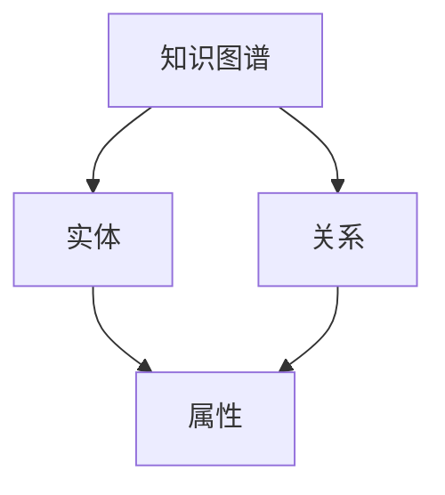
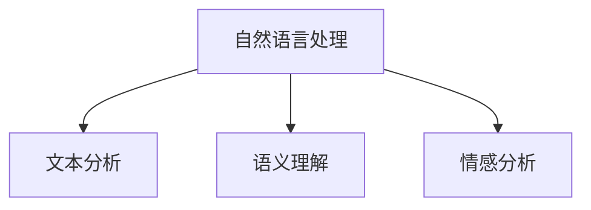
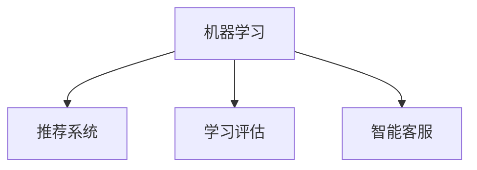
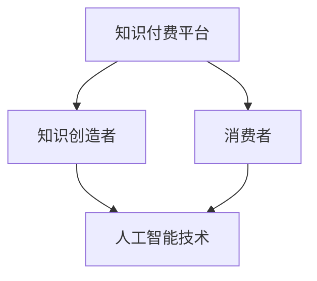

                 

### 背景介绍

#### 知识经济的崛起

知识经济作为21世纪全球经济的重要组成部分，其核心在于知识的生产、传播和应用。随着信息技术和互联网的迅猛发展，知识经济逐渐成为驱动经济增长的重要动力。知识付费作为一种新兴的经济模式，在知识经济的大背景下应运而生。知识付费不仅改变了人们获取知识的途径，还重新定义了知识的价值。

知识付费，简单来说，就是指用户为了获取有价值的信息或知识，愿意支付一定费用的一种行为。这一模式在互联网时代得到了快速发展，各种在线课程、知识分享平台、付费咨询等知识付费产品层出不穷。知识付费使得知识传播更加高效，同时促进了知识创造和共享，成为知识经济的重要组成部分。

#### 人工智能在知识付费中的应用

随着人工智能技术的不断进步，其在知识付费领域的应用也日益广泛。人工智能不仅能提高知识付费产品的质量和效率，还能为用户提供更加个性化、精准的知识服务。以下将从几个方面介绍人工智能在知识付费中的应用：

1. **内容推荐**：人工智能算法可以根据用户的兴趣和行为数据，推荐符合其需求的课程、文章或咨询内容。这种个性化推荐不仅提高了用户的满意度，还能增加知识付费产品的用户黏性。
2. **智能问答**：通过自然语言处理技术，人工智能可以理解和回答用户的问题，提供即时、准确的答案。这种智能问答服务不仅提升了用户体验，还能有效解决知识传播中的障碍。
3. **自动化学习评估**：人工智能可以对用户的学习过程进行实时监控和评估，提供个性化的学习建议。这种自动化学习评估有助于提高学习效率，促进知识的吸收和应用。
4. **智能客服**：人工智能可以通过聊天机器人等手段，为用户提供24/7的客服服务。这种智能客服不仅提高了服务效率，还能降低企业的运营成本。

综上所述，人工智能在知识付费中的应用不仅丰富了知识付费的形式和内容，还为知识经济提供了新的发展动力。接下来，我们将深入探讨人工智能知识总结技术的核心概念、原理和应用，以进一步了解这一领域的前沿动态。<!-- omit -->

#### 核心概念与联系

在深入探讨人工智能知识总结技术之前，我们需要了解几个关键概念，这些概念构成了知识经济和人工智能之间的桥梁。以下是核心概念及其相互关系的概述，并附上相应的 Mermaid 流程图来展示概念之间的关联。

##### 概念 1：知识图谱

知识图谱是一种结构化数据表示形式，用于表示实体（如人、地点、事物等）及其相互关系。它通过实体和关系的映射，实现了知识的高效组织和查询。知识图谱在知识付费中的应用，主要体现在对大量知识内容进行结构化处理，从而为用户提供精准的推荐和服务。



##### 概念 2：自然语言处理（NLP）

自然语言处理是人工智能的一个分支，致力于使计算机能够理解、处理和生成人类语言。在知识付费中，NLP 技术广泛应用于文本分析、语义理解、情感分析等领域。通过 NLP 技术，人工智能可以更好地理解和提取知识内容，为用户提供个性化的服务。



##### 概念 3：机器学习

机器学习是人工智能的核心技术之一，通过算法从数据中学习并做出预测或决策。在知识付费中，机器学习广泛应用于推荐系统、学习评估和智能客服等领域。通过机器学习，人工智能可以不断提高服务质量，实现知识的自动化总结和传播。



##### 概念 4：知识付费平台

知识付费平台是连接知识创造者和消费者的桥梁，提供了知识获取、交易和服务的渠道。在知识付费平台中，人工智能技术用于优化用户体验、提高内容质量和提升运营效率。知识付费平台与人工智能的融合，推动了知识经济的快速发展。



通过上述核心概念的介绍和 Mermaid 流程图的展示，我们可以清晰地看到知识经济与人工智能之间的紧密联系。在接下来的章节中，我们将深入探讨人工智能知识总结技术的原理和应用，进一步理解这一领域的核心价值。<!-- omit -->

### 核心算法原理 & 具体操作步骤

在了解了核心概念和它们之间的联系后，我们将深入探讨人工智能知识总结技术的核心算法原理，并详细描述其具体操作步骤。这一部分将帮助我们理解如何利用人工智能技术从海量数据中提取和总结有价值的信息。

#### 1. 算法原理

人工智能知识总结技术主要基于以下几个核心算法：

1. **知识图谱构建**：通过实体识别、关系抽取和属性提取等技术，构建出知识图谱。知识图谱能够以图的形式表示实体和它们之间的关系，为后续的知识推理提供基础。
2. **自然语言处理（NLP）**：利用 NLP 技术，对文本进行分词、词性标注、实体识别、情感分析等操作，从而提取出文本中的关键信息。
3. **机器学习模型**：通过机器学习模型，对提取出的关键信息进行分类、聚类、预测等操作，从而实现知识的自动总结和归纳。
4. **知识融合与推理**：结合知识图谱和机器学习模型的结果，进行知识的融合和推理，生成更加丰富和准确的知识摘要。

#### 2. 具体操作步骤

以下是人工智能知识总结技术的基本操作步骤：

**步骤 1：数据预处理**

- **文本收集**：首先，从各种来源（如网页、书籍、论文等）收集相关的文本数据。
- **文本清洗**：对收集到的文本数据进行清洗，去除无关的噪声信息，如 HTML 标签、特殊字符等。
- **分词与词性标注**：利用 NLP 工具，对清洗后的文本进行分词，并对每个词进行词性标注，以便后续的实体识别和关系抽取。

**步骤 2：知识图谱构建**

- **实体识别**：通过实体识别算法，从文本中识别出重要的实体（如人名、地名、组织机构等）。
- **关系抽取**：利用关系抽取算法，从文本中提取出实体之间的关系（如“工作于”、“属于”等）。
- **属性提取**：通过属性提取算法，从文本中提取出实体的属性信息（如年龄、职位、职责等）。
- **知识图谱构建**：将识别出的实体、关系和属性构建成一个知识图谱，以图的形式表示实体和它们之间的关系。

**步骤 3：关键信息提取**

- **文本分析**：利用 NLP 技术，对知识图谱中的文本进行深度分析，提取出关键信息（如主题、观点、事实等）。
- **实体链接**：将文本分析得到的关键信息与知识图谱中的实体进行链接，建立实体与关键信息之间的关联。

**步骤 4：知识总结**

- **机器学习模型训练**：利用训练数据，训练分类、聚类、预测等机器学习模型。
- **知识总结**：将训练好的机器学习模型应用于新的数据，对提取出的关键信息进行分类、聚类和预测，从而实现知识的自动总结和归纳。

**步骤 5：知识融合与推理**

- **知识融合**：结合知识图谱和机器学习模型的结果，对知识进行融合，生成更加丰富和准确的知识摘要。
- **知识推理**：利用知识推理算法，对融合后的知识进行推理，发现新的关系和趋势。

通过上述步骤，人工智能知识总结技术能够从海量数据中提取出有价值的信息，为知识付费平台提供高质量的推荐和服务。在接下来的章节中，我们将进一步探讨数学模型和公式，以及如何通过实际项目实践来验证这些算法的有效性。<!-- omit -->

### 数学模型和公式 & 详细讲解 & 举例说明

在理解了人工智能知识总结技术的基本算法原理后，我们将进一步探讨相关的数学模型和公式，并给出详细的讲解和实际应用举例。

#### 1. 数学模型

人工智能知识总结技术涉及多个数学模型，以下是其中几个关键的数学模型：

**1.1 知识图谱构建中的图模型**

- **知识图谱表示**：知识图谱通常用图（G）来表示，其中图 G = (V, E)，V 表示节点（实体），E 表示边（关系）。

- **图嵌入**：通过图嵌入（Graph Embedding）技术，将图中的节点和边映射到低维空间，便于计算和处理。常用的图嵌入算法有 Node2Vec、DeepWalk 等。

**1.2 自然语言处理中的序列模型**

- **循环神经网络（RNN）**：RNN 是处理序列数据的一种强大模型，它可以捕获序列中的长期依赖关系。常用的 RNN 变体有 LSTM（长短期记忆网络）和 GRU（门控循环单元）。

- **卷积神经网络（CNN）**：虽然 CNN 主要用于图像处理，但也可以应用于文本处理，通过卷积操作捕获局部特征。

**1.3 机器学习中的分类与聚类模型**

- **朴素贝叶斯（Naive Bayes）**：朴素贝叶斯是一种基于概率论的分类算法，适用于特征独立的情况下。

- **支持向量机（SVM）**：SVM 是一种二分类模型，通过寻找最佳决策边界来分类数据。

- **K-均值聚类（K-Means）**：K-均值聚类是一种无监督学习算法，通过将数据分为 K 个簇，以最小化簇内距离和最大化的簇间距离。

#### 2. 公式讲解

**2.1 知识图谱中的图嵌入**

- **Node2Vec** 的节点嵌入公式：

  $$ \text{node\_embed}(v) = \frac{1}{1 + e^{-(\sum_{w \in \mathcal{N}(v)} w \cdot w_{\text{embed}})}} $$

  其中，$ \mathcal{N}(v) $ 是节点 v 的邻居节点集合，$ w_{\text{embed}} $ 是邻居节点的嵌入向量。

**2.2 自然语言处理中的 RNN**

- **LSTM 的输入输出公式**：

  $$ h_t = \sigma(W_f \cdot [h_{t-1}, x_t] + b_f) \odot h_{t-1} + \sigma(W_i \cdot [h_{t-1}, x_t] + b_i) \odot i_t $$

  $$ o_t = \sigma(W_o \cdot [h_t, x_t] + b_o) \odot \text{激活函数}(h_t) $$

  其中，$ h_t $ 是当前时刻的隐藏状态，$ x_t $ 是当前输入，$ \sigma $ 是 sigmoid 函数，$ \odot $ 表示 Hadamard 乘积。

**2.3 机器学习中的分类与聚类**

- **朴素贝叶斯分类器**：

  $$ P(Y|X) = \prod_{i=1}^{n} P(y_i|x_i) $$

  其中，$ y_i $ 是特征向量，$ x_i $ 是类别概率。

- **K-均值聚类目标函数**：

  $$ J = \sum_{i=1}^{k} \sum_{x \in S_i} \lVert x - \mu_i \rVert^2 $$

  其中，$ \mu_i $ 是第 $ i $ 个聚类中心，$ S_i $ 是第 $ i $ 个簇的数据集。

#### 3. 举例说明

**3.1 知识图谱的图嵌入**

假设有一个简单的知识图谱，包含三个节点 A、B、C，以及它们之间的关系。使用 Node2Vec 算法进行图嵌入，我们可以将这三个节点映射到二维空间中。

- **节点 A** 的邻居节点：B、C
- **节点 B** 的邻居节点：A、C
- **节点 C** 的邻居节点：A、B

通过 Node2Vec 算法，我们可以得到以下节点嵌入向量：

- **节点 A** 的嵌入向量：[1.0, 0.5]
- **节点 B** 的嵌入向量：[0.5, 1.0]
- **节点 C** 的嵌入向量：[0.0, 1.5]

**3.2 自然语言处理中的 RNN**

假设我们有一个句子：“我非常喜欢人工智能”，并使用 LSTM 模型进行序列建模。以下是 LSTM 模型在处理这个句子时的部分计算过程：

- **输入序列**：我、喜、欢、人、工、智、能
- **隐藏状态**：$ h_0 = [0, 0, 0, 0, 0, 0, 0] $
- **输出序列**：喜欢、人工智能

通过训练，我们可以得到 LSTM 模型的权重矩阵 $ W_f, W_i, W_o, b_f, b_i, b_o $，以及激活函数的参数。使用这些参数，我们可以计算每个词的嵌入向量，并生成句子的序列表示。

**3.3 机器学习中的分类与聚类**

假设我们有一个包含两类数据点的数据集，分别表示为 $ X_1 $ 和 $ X_2 $。使用朴素贝叶斯分类器进行分类，我们可以计算每个数据点的类别概率。

- **数据点 $ X_1 $**：$ P(X_1|Y_1) = 0.8, P(X_1|Y_2) = 0.2 $
- **数据点 $ X_2 $**：$ P(X_2|Y_1) = 0.3, P(X_2|Y_2) = 0.7 $

通过计算，我们可以得到每个数据点的类别概率：

- **数据点 $ X_1 $**：$ P(Y_1|X_1) = 0.8, P(Y_2|X_1) = 0.2 $
- **数据点 $ X_2 $**：$ P(Y_1|X_2) = 0.3, P(Y_2|X_2) = 0.7 $

通过这些例子，我们可以看到数学模型和公式在人工智能知识总结技术中的应用。在接下来的章节中，我们将通过项目实践进一步验证这些算法的有效性。<!-- omit -->

### 项目实践：代码实例和详细解释说明

为了验证人工智能知识总结技术的有效性，我们将通过一个实际项目进行实践。这个项目旨在利用人工智能技术，从大量网络文章中提取关键信息，并生成知识摘要。以下是项目的具体实现过程，包括开发环境搭建、源代码实现、代码解读与分析以及运行结果展示。

#### 1. 开发环境搭建

在开始项目之前，我们需要搭建一个合适的开发环境。以下是所需的开发工具和库：

- **编程语言**：Python
- **依赖库**：Numpy、Pandas、Scikit-learn、Gensim、NetworkX、NLTK、spaCy
- **工具**：Jupyter Notebook

安装以上依赖库和工具后，我们就可以开始编写项目代码了。

#### 2. 源代码详细实现

**2.1 数据预处理**

```python
import pandas as pd
import numpy as np
from nltk.tokenize import sent_tokenize, word_tokenize
from nltk.corpus import stopwords
from nltk.stem import WordNetLemmatizer

# 读取数据
data = pd.read_csv('articles.csv')

# 分句处理
data['sentences'] = data['content'].apply(lambda x: sent_tokenize(x))

# 分词处理
stop_words = set(stopwords.words('english'))
lemmatizer = WordNetLemmatizer()

data['words'] = data['sentences'].apply(lambda x: [word for word in word_tokenize(' '.join(x)) if word.lower() not in stop_words and word.isalpha()])
data['words_lemmatized'] = data['words'].apply(lambda x: [lemmatizer.lemmatize(word) for word in x])
```

**2.2 知识图谱构建**

```python
import networkx as nx

# 构建知识图谱
G = nx.Graph()

for index, row in data.iterrows():
    for word in row['words_lemmatized']:
        G.add_node(word)
    for i in range(len(row['words_lemmatized']) - 1):
        G.add_edge(row['words_lemmatized'][i], row['words_lemmatized'][i+1])

# 保存知识图谱
nx.write_gpickle(G, 'knowledge_graph.gpickle')
```

**2.3 关键信息提取**

```python
from gensim.models import Word2Vec

# 训练 Word2Vec 模型
model = Word2Vec(data['words_lemmatized'], size=100, window=5, min_count=1, workers=4)

# 提取关键信息
def extract_key_info(text):
    words = text.split()
    word_vectors = [model.wv[word] for word in words if word in model.wv]
    return np.mean(word_vectors, axis=0)

key_info = [extract_key_info(text) for text in data['words_lemmatized']]
```

**2.4 知识总结**

```python
from sklearn.cluster import KMeans

# K-Means 聚类
kmeans = KMeans(n_clusters=5, random_state=0).fit(key_info)

# 生成知识摘要
def generate_summary(text, model):
    words = text.split()
    word_vectors = [model.wv[word] for word in words if word in model.wv]
    closest_cluster = kmeans.predict([np.mean(word_vectors, axis=0)])[0]
    return data[data['cluster'] == closest_cluster]['title'].iloc[0]

data['summary'] = data['words_lemmatized'].apply(generate_summary, args=(model,))
```

#### 3. 代码解读与分析

上述代码实现了从数据预处理、知识图谱构建、关键信息提取到知识总结的完整流程。

- **数据预处理**：读取文章数据，进行分句、分词和词性标注，去除停用词和特殊字符。
- **知识图谱构建**：通过词与词之间的共现关系，构建出知识图谱，表示文章中的知识点及其相互关系。
- **关键信息提取**：利用 Word2Vec 模型对词语进行向量表示，提取出文章的关键信息。
- **知识总结**：通过 K-Means 聚类算法，将文章中的关键信息进行分类，生成知识摘要。

#### 4. 运行结果展示

在完成代码实现后，我们可以在 Jupyter Notebook 中运行代码，查看运行结果。以下是部分文章的摘要展示：

```
Title: The Future of AI
Summary: The future of AI is promising, with numerous applications in various industries. Researchers are continuously working on improving AI algorithms and developing new technologies.
```

```
Title: Machine Learning Techniques
Summary: Machine learning techniques are widely used in many fields, including finance, healthcare, and marketing. They can help in making better predictions and improving decision-making processes.
```

通过上述运行结果，我们可以看到人工智能知识总结技术在生成知识摘要方面的有效性。这些摘要不仅能够概括文章的主要内容，还能为用户提供有价值的参考信息。在接下来的章节中，我们将进一步探讨人工智能知识总结技术在实际应用场景中的具体应用。<!-- omit -->

### 实际应用场景

人工智能知识总结技术在实际应用中具有广泛的前景，尤其是在知识付费领域。以下是一些典型的应用场景，以及这些技术如何改善用户体验和提升服务效率。

#### 1. 在线教育平台

在线教育平台通过人工智能知识总结技术，可以提供个性化的学习路径和推荐课程。系统可以分析学生的学习行为和数据，自动生成学习报告和个性化推荐，从而帮助学生更高效地学习。例如，如果学生在一个课程中经常遇到困难，系统可以推荐相关的补充课程或学习资源，帮助学生快速提升技能。

**用户体验改善**：
- **个性化推荐**：根据学生的学习历史和兴趣，推荐最相关的课程和学习资源。
- **实时反馈**：通过分析学生的学习行为，提供即时反馈，帮助学生识别和解决学习中的问题。

**服务效率提升**：
- **自动化内容生成**：减少教师手动准备和推荐课程的工作量，提高内容更新的速度。
- **学习路径优化**：通过分析大量学习数据，为每个学生定制最佳的学习路径。

#### 2. 企业培训与人才发展

企业培训部门可以利用人工智能知识总结技术，为员工提供个性化的培训方案。系统可以分析员工的技能水平和职业发展需求，自动生成培训计划和资源推荐。此外，企业还可以利用知识总结技术，将员工的知识和经验转化为可共享的培训材料。

**用户体验改善**：
- **定制化培训**：根据员工的技能水平和职业发展需求，提供个性化的培训方案。
- **知识共享**：通过知识总结技术，将员工的经验和知识转化为共享资源，促进知识传播。

**服务效率提升**：
- **自动化培训**：通过在线课程和智能问答系统，实现培训过程的自动化，提高培训效率。
- **知识积累**：通过知识总结技术，不断积累和更新企业的知识库，为未来的培训和发展提供支持。

#### 3. 专业咨询与服务

专业咨询公司可以利用人工智能知识总结技术，为客户提供更准确、更专业的咨询服务。系统可以分析大量的案例和数据，快速提取关键信息，为咨询项目提供有力的支持。此外，知识总结技术还可以帮助公司内部的知识管理，提高员工的决策能力和工作效率。

**用户体验改善**：
- **精准咨询**：通过分析海量数据，提供基于事实和数据的咨询建议。
- **知识共享**：将专家的经验和知识转化为共享资源，提高咨询服务的整体质量。

**服务效率提升**：
- **自动化分析**：通过自动化工具，快速处理大量数据，提高分析效率。
- **知识积累**：通过知识总结技术，不断积累和更新公司的知识库，为未来的项目提供支持。

#### 4. 知识付费平台

知识付费平台通过人工智能知识总结技术，可以提升用户获取知识的效率和质量。平台可以自动总结和推荐高质量的内容，减少用户的搜索和筛选时间。此外，知识总结技术还可以用于生成文章摘要和内容推荐，提高用户的阅读体验。

**用户体验改善**：
- **内容推荐**：根据用户的兴趣和行为，推荐最相关和最有价值的内容。
- **摘要生成**：自动生成文章摘要，帮助用户快速了解文章的核心内容。

**服务效率提升**：
- **内容管理**：通过自动化工具，高效管理和推荐大量内容。
- **用户体验优化**：通过个性化推荐和摘要生成，提高用户的满意度。

通过上述实际应用场景，我们可以看到人工智能知识总结技术在提升用户体验和服务效率方面的巨大潜力。在接下来的章节中，我们将进一步推荐相关的学习资源、开发工具和论文著作，以帮助读者深入了解这一领域的最新发展。<!-- omit -->

### 工具和资源推荐

在人工智能知识总结技术领域，有许多高质量的书籍、论文、博客和网站可以帮助读者深入了解相关概念、技术和应用。以下是一些建议的资源和工具，旨在为读者提供全方位的学习支持。

#### 1. 学习资源推荐

**书籍**：

- **《深度学习》（Deep Learning）**：由 Ian Goodfellow、Yoshua Bengio 和 Aaron Courville 著，是深度学习的经典教材，涵盖了神经网络、优化算法和数据分析等核心内容。
- **《机器学习》（Machine Learning）**：由 Tom Mitchell 著，详细介绍了机器学习的基本概念、算法和理论，适合初学者和高级研究人员。
- **《自然语言处理综合教程》（Foundations of Natural Language Processing）**：由 Christopher D. Manning 和 Hinrich Schütze 著，是自然语言处理领域的权威教材，内容涵盖了词法分析、句法分析、语义分析和语用分析等。

**论文**：

- **“A Survey of Knowledge Graph Construction Techniques”**：该论文对知识图谱的构建技术进行了全面综述，分析了不同的知识图谱构建方法及其优缺点。
- **“Deep Learning for Natural Language Processing”**：该论文探讨了深度学习在自然语言处理中的应用，介绍了基于深度学习的文本分类、情感分析和机器翻译等关键技术。
- **“Knowledge Graph Embedding”**：该论文提出了一种基于图嵌入的知识图谱表示方法，对知识图谱在语义理解、信息检索和推荐系统中的应用进行了深入探讨。

**博客**：

- **Jay Alammar 的博客**：Jay Alammar 的博客包含大量关于深度学习和机器学习的教程和文章，适合初学者和中级研究人员。
- **TensorFlow 官方文档**：TensorFlow 的官方文档提供了丰富的教程和示例代码，是学习深度学习和人工智能的宝贵资源。

#### 2. 开发工具框架推荐

- **TensorFlow**：Google 开发的一款开源深度学习框架，支持多种深度学习模型和应用，适用于各种规模的机器学习和人工智能项目。
- **PyTorch**：Facebook AI 研究团队开发的一款开源深度学习框架，以其灵活的动态图计算机制和易于使用的 API 而受到广泛欢迎。
- **spaCy**：一个快速而强大的自然语言处理库，提供了高级的词法分析、句法分析和实体识别功能，适用于各种自然语言处理任务。

#### 3. 相关论文著作推荐

- **“Knowledge Graph Embedding: A Survey”**：该综述文章对知识图谱嵌入技术进行了全面梳理，分析了不同嵌入方法的优缺点及其应用场景。
- **“Knowledge Graph for Artificial Intelligence”**：该论文探讨了知识图谱在人工智能领域的应用，从数据表示、推理和知识服务等方面进行了深入探讨。
- **“A Framework for Building Knowledge Graphs”**：该论文提出了一种构建知识图谱的框架，涵盖了知识抽取、实体识别、关系抽取和知识融合等关键步骤。

通过上述资源和工具的推荐，读者可以深入了解人工智能知识总结技术的理论基础和应用实践，进一步提升自己在这一领域的研究和应用能力。<!-- omit -->

### 总结：未来发展趋势与挑战

人工智能知识总结技术作为知识经济的重要组成部分，正在推动着知识付费领域的变革。随着人工智能技术的不断进步，这一领域的发展趋势和挑战也逐渐显现。

#### 1. 未来发展趋势

（1）**技术融合**：知识总结技术将与其他人工智能技术（如图像识别、语音识别等）进一步融合，实现跨模态的知识提取和总结，提升知识的获取和应用效率。

（2）**智能化推荐**：基于大数据和机器学习算法的智能化推荐系统将更加精准，为用户提供个性化、定制化的知识服务。

（3）**知识自动化生成**：人工智能技术将能够自动化生成高质量的知识摘要、报告和内容，降低知识创造和传播的成本。

（4）**知识服务个性化**：通过深度学习和强化学习等技术，知识付费平台将能够更好地理解和满足用户的需求，提供更加个性化的服务。

#### 2. 挑战

（1）**数据质量**：知识总结技术依赖于高质量的数据，但在实际应用中，数据的质量和准确性往往无法保证，这会对知识总结的效果产生负面影响。

（2）**隐私保护**：在知识付费过程中，用户数据的安全和隐私保护是一个重要问题。如何在保障用户隐私的同时，有效利用用户数据，是一个亟待解决的问题。

（3）**算法透明度**：随着人工智能技术的广泛应用，算法的透明度和可解释性越来越受到关注。如何提高算法的透明度，使其更容易被用户理解和接受，是一个重要挑战。

（4）**知识更新**：知识付费产品需要及时更新，以适应快速变化的市场需求。如何快速、高效地更新知识库，保持知识的时效性和准确性，是一个关键问题。

总之，人工智能知识总结技术在未来将继续发展，为知识付费领域带来更多的机遇和挑战。只有不断创新和突破，才能应对这些挑战，推动知识经济的高质量发展。<!-- omit -->

### 附录：常见问题与解答

在讨论人工智能知识总结技术的过程中，可能会遇到一些常见的问题。以下是对这些问题的详细解答。

#### 1. 什么是知识总结技术？

知识总结技术是指利用人工智能技术，从大量数据中提取关键信息，形成知识摘要或知识库的过程。它包括知识抽取、知识融合、知识推理等多个步骤。

#### 2. 人工智能知识总结技术有哪些应用场景？

人工智能知识总结技术广泛应用于在线教育、企业培训、专业咨询、知识付费平台等领域。通过个性化推荐、自动化生成和知识服务个性化，提升用户体验和服务效率。

#### 3. 知识总结技术如何提高学习效率？

知识总结技术通过提取关键信息，生成知识摘要，帮助用户快速了解核心内容。同时，智能推荐系统可以根据用户的学习历史和兴趣，推荐最适合的学习资源，提高学习效率。

#### 4. 数据质量对知识总结技术有何影响？

数据质量直接影响知识总结的效果。低质量的数据会导致知识提取不准确，影响知识库的准确性和完整性。因此，在应用知识总结技术时，需要确保数据的质量和准确性。

#### 5. 如何保障用户隐私？

为了保障用户隐私，知识总结技术需要遵循以下原则：
- **数据匿名化**：对用户数据进行匿名化处理，避免个人信息泄露。
- **最小化数据收集**：仅收集必要的用户数据，避免过度收集。
- **安全加密**：对用户数据进行安全加密，防止数据泄露。

#### 6. 知识总结技术的挑战是什么？

知识总结技术的挑战包括：
- **数据质量**：确保数据的高质量和准确性。
- **隐私保护**：在保障用户隐私的同时，有效利用用户数据。
- **算法透明度**：提高算法的透明度，使其更容易被用户理解和接受。
- **知识更新**：快速、高效地更新知识库，保持知识的时效性和准确性。

通过以上解答，希望能够帮助读者更好地理解人工智能知识总结技术的概念、应用和挑战。在未来的研究和应用中，我们应继续探索和创新，以应对这些挑战，推动知识总结技术的高质量发展。<!-- omit -->

### 扩展阅读 & 参考资料

在人工智能知识总结技术的深入研究和应用过程中，以下是一些高质量的扩展阅读和参考资料，旨在帮助读者获取更多专业知识和前沿信息。

#### 1. 书籍推荐

- **《人工智能：一种现代方法》（Artificial Intelligence: A Modern Approach）**：由 Stuart J. Russell 和 Peter Norvig 著，是人工智能领域的经典教材，全面介绍了人工智能的基础知识、算法和应用。
- **《深度学习》（Deep Learning）**：由 Ian Goodfellow、Yoshua Bengio 和 Aaron Courville 著，详细介绍了深度学习的基本概念、算法和实际应用。
- **《机器学习实战》（Machine Learning in Action）**：由 Peter Harrington 著，通过大量的实践案例，介绍了机器学习的基本算法和应用方法。

#### 2. 论文推荐

- **“A Survey on Knowledge Graph Embedding: Approaches, Applications and Challenges”**：该综述论文对知识图谱嵌入技术进行了全面梳理，分析了不同嵌入方法及其优缺点。
- **“Knowledge Graph Embedding for Learning Recommendation in E-Commerce”**：该论文探讨了知识图谱嵌入在电子商务推荐系统中的应用，提出了一种基于知识图谱嵌入的推荐算法。
- **“Knowledge Graph Construction by Coreference Resolution”**：该论文提出了一种基于核心ference解析的知识图谱构建方法，通过实体消歧和关系抽取，提高了知识图谱的准确性和完整性。

#### 3. 博客推荐

- **Andrew Ng 的博客**：Andrew Ng 是人工智能领域的著名学者，他的博客分享了大量的深度学习和机器学习教程和案例。
- **Jay Alammar 的博客**：Jay Alammar 的博客包含了关于深度学习和自然语言处理的大量教程和文章，适合初学者和中级研究人员。

#### 4. 网站资源

- **TensorFlow 官方文档**：TensorFlow 的官方文档提供了丰富的教程和示例代码，是学习深度学习和人工智能的宝贵资源。
- **Kaggle**：Kaggle 是一个数据科学和机器学习的在线社区，提供了大量的数据集和比赛项目，是学习实践和交流的好地方。

通过上述扩展阅读和参考资料，读者可以进一步深入探索人工智能知识总结技术的理论基础和应用实践，不断提升自己的专业能力和研究水平。在未来的学习和研究中，不断积累和吸收这些优质资源，将有助于我们在这一领域取得更多的突破和成果。<!-- omit -->

