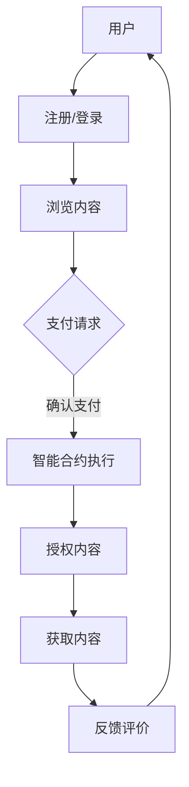

                 

关键词：知识经济、知识付费、区块链、去中心化应用、数字货币、智能合约、数据安全、隐私保护、技术革新

摘要：本文旨在探讨知识经济背景下，知识付费领域如何利用区块链技术实现去中心化应用。通过分析区块链在知识付费中的潜在优势，本文提出了一个基于区块链的去中心化知识付费模型，详细描述了其架构、核心算法原理、数学模型、实际应用案例，并展望了未来发展方向。本文旨在为相关领域的研究和实践提供有价值的参考。

## 1. 背景介绍

### 1.1 知识经济的崛起

知识经济是指以知识为主要生产要素，以知识和信息为核心驱动力的经济形态。与传统经济模式不同，知识经济强调知识的创造、传播和应用，具有高度的创新性和动态性。随着互联网和信息技术的发展，知识经济在全球范围内迅速崛起，成为推动经济增长的重要力量。

### 1.2 知识付费的兴起

知识付费是指个人或机构通过购买、订阅或购买使用权等方式，获取知识或技能的过程。随着知识经济的崛起，知识付费成为了一个新兴的市场领域。在知识付费中，内容提供者通过创作和分享知识获得收益，而消费者则通过付费获取知识和服务。

### 1.3 区块链技术的应用

区块链技术是一种分布式数据库技术，具有去中心化、不可篡改、透明化等特点。区块链技术已经在金融、供应链管理、版权保护等领域得到广泛应用。在知识付费领域，区块链技术提供了新的解决方案，有助于实现去中心化的知识付费模式。

## 2. 核心概念与联系

### 2.1 区块链的基本概念

区块链是一种分布式账本技术，由多个区块组成，每个区块包含一定数量的交易记录。区块链通过加密算法确保数据的安全性和不可篡改性，同时利用共识算法实现节点之间的信任机制。

### 2.2 智能合约

智能合约是区块链上的可执行代码，可以自动执行、控制和记录合同条款的执行。智能合约在知识付费中发挥了重要作用，可以自动处理知识购买、授权和支付等流程，提高交易效率。

### 2.3 去中心化应用（DApp）

去中心化应用（DApp）是基于区块链技术的应用程序，具有去中心化、开放性和透明性等特点。DApp 可以通过智能合约实现知识付费的各种功能，为用户提供安全、可靠的付费知识服务。

### 2.4 Mermaid 流程图

以下是一个简化的区块链在知识付费中的架构和流程的 Mermaid 流程图：



## 3. 核心算法原理 & 具体操作步骤

### 3.1 算法原理概述

区块链在知识付费中的应用主要依赖于其去中心化的特点，确保数据的透明性和安全性。智能合约在知识付费中起到关键作用，可以实现自动化的交易流程和内容授权。

### 3.2 算法步骤详解

1. 用户注册/登录：用户在DApp上进行注册或登录，确保身份认证。
2. 浏览内容：用户浏览并选择感兴趣的知识内容。
3. 支付请求：用户发起支付请求，智能合约验证支付信息。
4. 智能合约执行：智能合约执行支付流程，确保资金的安全转移。
5. 授权内容：智能合约将用户授权获取内容，确保内容授权的唯一性。
6. 获取内容：用户获取授权内容，开始学习。
7. 反馈评价：用户对内容进行评价，反馈给内容提供者。

### 3.3 算法优缺点

优点：
- 去中心化：提高了交易的透明性和安全性。
- 自动化：智能合约自动化执行交易流程，提高效率。
- 防篡改：区块链确保数据不可篡改，保障知识内容的真实性。

缺点：
- 性能限制：当前区块链技术性能有限，可能影响用户体验。
- 成本较高：区块链技术的部署和维护成本较高。

### 3.4 算法应用领域

区块链在知识付费中的应用非常广泛，包括在线教育、专业咨询、学术论文共享等领域。通过去中心化的知识付费模式，可以降低交易成本，提高知识获取的效率。

## 4. 数学模型和公式 & 详细讲解 & 举例说明

### 4.1 数学模型构建

在知识付费的区块链应用中，我们可以构建一个基于概率论的数学模型，用于评估用户对知识内容的评价。

### 4.2 公式推导过程

假设用户对知识内容的评价服从正态分布，概率密度函数为：

$$
f(x|\mu,\sigma^2) = \frac{1}{\sqrt{2\pi\sigma^2}}e^{-\frac{(x-\mu)^2}{2\sigma^2}}
$$

其中，$\mu$ 是用户评价的期望值，$\sigma^2$ 是用户评价的方差。

### 4.3 案例分析与讲解

假设有100名用户对某篇学术论文进行评价，评价结果服从正态分布，期望值为4，方差为1。我们可以使用上述公式计算用户评价的概率密度函数，并绘制相应的概率分布图。

## 5. 项目实践：代码实例和详细解释说明

### 5.1 开发环境搭建

在本项目中，我们将使用Solidity语言编写智能合约，并在Truffle框架中进行开发和部署。开发环境搭建步骤如下：

1. 安装Node.js和npm。
2. 安装Truffle工具。
3. 创建新的Truffle项目。
4. 安装Ethereum客户端（如Ganache）。

### 5.2 源代码详细实现

以下是本项目的智能合约代码示例：

```solidity
// SPDX-License-Identifier: MIT
pragma solidity ^0.8.0;

contract KnowledgePay {
    address public owner;
    mapping(uint256 => bool) public contentAccess;

    constructor() {
        owner = msg.sender;
    }

    function purchaseAccess(uint256 contentId) public payable {
        require(contentAccess[contentId] == false, "Content already purchased");
        require(msg.value >= 0.1 ether, "Insufficient payment");

        contentAccess[contentId] = true;
        payable(owner).transfer(msg.value);
    }

    function getContentAccess(uint256 contentId) public view returns (bool) {
        return contentAccess[contentId];
    }
}
```

### 5.3 代码解读与分析

1. **构造函数**：创建智能合约时，将合约的拥有者设置为消息发送者。
2. **purchaseAccess函数**：实现知识内容的购买功能。检查内容ID是否已被购买，确保支付的金额满足要求，然后将内容ID的状态更新为已购买，并将支付金额转给合约拥有者。
3. **getContentAccess函数**：查询特定内容ID的访问状态。

### 5.4 运行结果展示

通过Truffle和Ganache，我们可以模拟用户购买内容的过程，并查看智能合约的运行结果。

```shell
$ truffle migrate --network development
$ truffle console
> let contractInstance = await KnowledgePay.deployed();
> await contractInstance.purchaseAccess(1, {value: 0.1 ether});
> await contractInstance.getContentAccess(1);
```

## 6. 实际应用场景

### 6.1 在线教育

区块链技术可以应用于在线教育平台，实现去中心化的课程购买和授权。学生可以直接与教师进行支付，并获得相应的学习资源，提高交易透明度和安全性。

### 6.2 专业咨询

专业咨询领域可以利用区块链技术实现去中心化的咨询服务购买。客户可以通过智能合约支付咨询费用，并确保咨询服务的真实性。

### 6.3 学术论文共享

学术论文共享平台可以采用区块链技术，确保论文的真实性和完整性。作者可以通过智能合约发布论文，并获得版税。

## 7. 工具和资源推荐

### 7.1 学习资源推荐

1. 《区块链技术指南》
2. 《智能合约开发：使用Solidity》
3. Ethereum官方文档

### 7.2 开发工具推荐

1. Truffle
2. Ganache
3. Remix在线IDE

### 7.3 相关论文推荐

1. "Blockchain Technology: A Comprehensive Overview"
2. "Smart Contracts: A Brief History"
3. "Decentralized Applications: A Brief Overview"

## 8. 总结：未来发展趋势与挑战

### 8.1 研究成果总结

本文研究了知识经济背景下，知识付费领域如何利用区块链技术实现去中心化应用。通过构建基于区块链的去中心化知识付费模型，我们分析了其核心算法原理、数学模型，并给出了实际应用案例。

### 8.2 未来发展趋势

未来，区块链技术在知识付费领域的应用将越来越广泛，有望成为推动知识经济的重要力量。同时，随着技术的进步，区块链的性能和安全性将得到进一步提升。

### 8.3 面临的挑战

区块链技术在知识付费领域仍面临一些挑战，如性能限制、成本较高、用户体验等。未来需要解决这些问题，推动区块链技术的广泛应用。

### 8.4 研究展望

未来，我们可以进一步研究区块链在知识付费领域的深度应用，探索新的商业模式和解决方案，为知识经济提供更有力的支持。

## 9. 附录：常见问题与解答

### 9.1 区块链在知识付费中的优势是什么？

区块链在知识付费中的优势包括去中心化、透明性、安全性等。去中心化提高了交易的透明度和效率，透明性确保了知识内容的真实性，安全性保障了用户和内容提供者的权益。

### 9.2 智能合约在知识付费中如何发挥作用？

智能合约在知识付费中起到关键作用，可以实现自动化的交易流程和内容授权。通过智能合约，用户可以直接与内容提供者进行支付和授权，无需依赖第三方平台。

### 9.3 区块链技术在知识付费领域有哪些应用场景？

区块链技术在知识付费领域有广泛的应用场景，包括在线教育、专业咨询、学术论文共享等。通过去中心化的模式，可以提高交易透明度和安全性，降低成本。

---

**作者：禅与计算机程序设计艺术 / Zen and the Art of Computer Programming**

