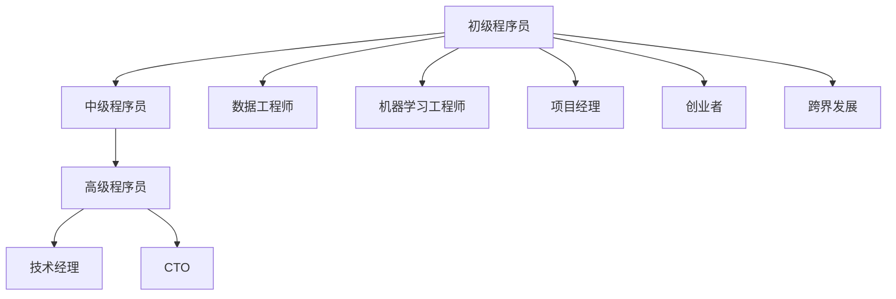

                 

### 背景介绍

在当今全球知识经济迅速发展的背景下，程序员作为信息技术领域的重要推动者，其职业发展策略显得尤为关键。知识经济以知识、信息和技术为核心，强调创新、创造力和专业化。在这个时代，程序员不仅需要掌握传统的编程技能，还需适应快速变化的技术环境，提升自身的综合素质和竞争力。

程序员职业发展的重要性体现在多个方面。首先，编程能力是现代社会的基本技能之一，几乎所有的行业都依赖于软件和技术。因此，程序员的职业前景广阔，具备良好的发展潜力。其次，随着人工智能、大数据、云计算等新兴技术的普及，程序员的职责和角色也在不断演变，从单纯的编码实现者，逐渐转变为技术架构师、系统分析师甚至创业领袖。这要求程序员不仅要有扎实的编程功底，还需具备跨学科的知识储备和项目管理的技能。

然而，当前程序员的职业发展面临着一系列挑战。技术更新速度加快，程序员需要不断学习新知识、新技能，以保持自己的竞争力。工作压力和职业倦怠问题也日益突出，程序员常常需要在短时间内完成复杂的项目，面临着高强度的工作环境。此外，随着全球化的推进，程序员需要具备国际化视野，适应不同文化和工作环境。这些挑战要求程序员在职业发展中制定出切实可行的策略，以应对日益激烈的市场竞争。

本文将围绕知识经济下程序员的职业发展策略展开讨论。首先，我们将介绍程序员职业发展的核心概念和主要领域，帮助读者了解程序员在不同职业阶段的角色和职责。接着，我们将探讨程序员应具备的关键技能，以及如何通过学习、实践和自我提升来增强自身的竞争力。随后，我们将分析程序员面临的主要挑战，并提供相应的应对策略。最后，我们将总结程序员未来职业发展的趋势和方向，为读者提供有益的参考和建议。

通过本文的详细探讨，我们希望帮助程序员们明确自己的职业发展路径，掌握有效的策略，在知识经济的浪潮中立足并持续成长。

### 核心概念与联系

在探讨程序员职业发展的过程中，了解几个核心概念和它们之间的联系是至关重要的。这些概念不仅为程序员提供了明确的发展方向，还为他们在实际工作中提供了理论支持。

#### 程序员职业发展阶段

程序员的职业发展通常可以分为几个阶段：初级程序员、中级程序员、高级程序员、技术经理和CTO（首席技术官）。每个阶段都有其独特的角色和职责。

1. **初级程序员**：这一阶段的程序员主要负责编码和实现简单的功能。他们需要熟悉编程语言和基本算法，具备一定的解决问题的能力。
   
2. **中级程序员**：随着经验的积累，中级程序员开始承担更复杂的项目，负责设计和实现系统的核心模块。他们需要具备良好的沟通能力和团队合作精神，能够在项目中发挥领导作用。

3. **高级程序员**：高级程序员通常负责整体技术架构的设计和优化，需要具备深厚的专业知识，能够解决复杂的技术问题，并在团队中起到指导作用。

4. **技术经理**：技术经理除了具备高级程序员的技能外，还需具备管理能力。他们负责项目管理和团队建设，确保项目按时完成并达到预期目标。

5. **CTO**：作为公司的首席技术官，CTO负责公司的技术战略和研发方向。他们需要具备前瞻性的技术视野，能够引领公司技术创新，推动业务发展。

#### 核心技能

程序员的职业发展不仅依赖于学历和经验，更需要具备一系列核心技能。这些技能可以划分为以下几个方面：

1. **编程语言和工具**：熟练掌握至少一种编程语言，如Java、Python、C++等，以及相关的开发工具和框架。

2. **数据结构和算法**：扎实的计算机科学基础，包括数据结构和算法的设计与应用。

3. **软件开发流程**：熟悉敏捷开发、持续集成、版本控制等软件开发流程，能够高效地完成项目。

4. **团队协作和沟通**：良好的沟通能力和团队合作精神，能够与团队成员有效协作，提高工作效率。

5. **解决问题的能力**：具备快速分析和解决问题的能力，能够在项目中独立解决技术难题。

#### 职业发展路径

程序员的职业发展路径并不是单一的，而是多样化的。以下几种路径较为常见：

1. **技术专家路径**：专注于技术领域，逐步成为某一领域的专家，如数据工程师、机器学习工程师等。

2. **项目管理路径**：具备较强的管理能力和领导力，逐步晋升为项目经理或技术经理。

3. **创业路径**：利用自己的技术优势和项目经验，创立自己的公司或加入初创企业，成为创业者。

4. **跨界发展路径**：结合计算机技术和其他领域知识，如人工智能与生物信息学、大数据与市场营销等，实现跨界发展。

#### Mermaid 流程图

为了更好地理解程序员的职业发展过程，我们可以使用Mermaid流程图来展示不同阶段和技能的联系。以下是一个简化的Mermaid流程图示例：



在这个流程图中，每个节点代表程序员的某一职业阶段或技能方向，连线表示不同阶段和技能之间的联系。通过这个流程图，我们可以清晰地看到程序员在不同职业路径上的发展和变化。

#### 总结

程序员职业发展的核心概念和联系为我们提供了一个全面的视角，帮助我们理解程序员的成长路径和所需技能。通过本文的介绍，读者可以对程序员职业发展有一个更深刻的认识，为自己的职业规划提供有益的参考。

### 核心算法原理 & 具体操作步骤

在知识经济下，程序员的职业发展离不开核心算法原理的掌握。核心算法不仅决定了程序的性能，还影响着程序员的技术水平和创新能力。本节将详细讲解程序员应熟悉的一些核心算法原理，并阐述具体操作步骤。

#### 1. 冒泡排序（Bubble Sort）

冒泡排序是一种简单的排序算法，它重复遍历要排序的数列，每次比较相邻的两个元素，如果它们的顺序错误就把它们交换过来。遍历数列的工作重复进行，直到没有再需要交换的元素为止。

**操作步骤：**

1. 从第一个元素开始，对相邻元素进行比较，若顺序不对则交换。
2. 往后移动一个元素，再重复步骤1。
3. 重复上述步骤，直到所有元素都被遍历过，且不需要再交换。

**示例代码：**

```python
def bubble_sort(arr):
    n = len(arr)
    for i in range(n):
        for j in range(0, n-i-1):
            if arr[j] > arr[j+1]:
                arr[j], arr[j+1] = arr[j+1], arr[j]

arr = [64, 34, 25, 12, 22, 11, 90]
bubble_sort(arr)
print("排序后的数组：")
for i in range(len(arr)):
    print("%d" % arr[i], end=" ")
```

#### 2. 快速排序（Quick Sort）

快速排序是一种高效的排序算法，由东尼·霍尔（Tony Hoare）于1960年提出。它采用分治法的一个变体，将一个序列分成较小的序列，直到每个序列只有一个元素，然后递归地排序并合并它们。

**操作步骤：**

1. 选择一个基准元素。
2. 将比基准元素小的元素放在其左侧，比其大的元素放在其右侧。
3. 递归地对左右子序列进行快速排序。
4. 合并排序后的子序列。

**示例代码：**

```python
def quick_sort(arr, low, high):
    if low < high:
        pi = partition(arr, low, high)
        quick_sort(arr, low, pi-1)
        quick_sort(arr, pi+1, high)

def partition(arr, low, high):
    pivot = arr[high]
    i = low - 1
    for j in range(low, high):
        if arr[j] < pivot:
            i += 1
            arr[i], arr[j] = arr[j], arr[i]
    arr[i+1], arr[high] = arr[high], arr[i+1]
    return i+1

arr = [10, 7, 8, 9, 1, 5]
quick_sort(arr, 0, len(arr)-1)
print("排序后的数组：")
for i in range(len(arr)):
    print("%d" % arr[i], end=" ")
```

#### 3. 二分查找（Binary Search）

二分查找算法是一种高效的查找算法，适用于有序数组。它通过重复将查找区间一半缩小的方式，迅速找到目标元素。

**操作步骤：**

1. 确定中间元素。
2. 如果中间元素等于目标值，查找结束。
3. 如果中间元素大于目标值，则在左侧区间查找。
4. 如果中间元素小于目标值，则在右侧区间查找。
5. 重复步骤1-4，直到找到目标元素或区间为空。

**示例代码：**

```python
def binary_search(arr, low, high, x):
    if high >= low:
        mid = (high + low) // 2
        if arr[mid] == x:
            return mid
        elif arr[mid] > x:
            return binary_search(arr, low, mid - 1, x)
        else:
            return binary_search(arr, mid + 1, high, x)
    else:
        return -1

arr = [2, 3, 4, 10, 40]
x = 10
result = binary_search(arr, 0, len(arr)-1, x)
if result != -1:
    print("元素在数组中的索引：", result)
else:
    print("元素不在数组中")
```

#### 4. 深度优先搜索（Depth-First Search，DFS）

深度优先搜索是一种用于遍历或搜索树或图的算法。它沿着一个路径一直走到底，然后回溯。

**操作步骤：**

1. 访问一个节点，并将其标记为已访问。
2. 对于该节点的每个未访问的邻居，递归执行步骤1和2。
3. 当所有邻居都被访问后，回溯到上一个节点，继续执行步骤2。

**示例代码：**

```python
def dfs(graph, node, visited):
    if node not in visited:
        print(node)
        visited.add(node)
        for neighbour in graph[node]:
            dfs(graph, neighbour, visited)

graph = {
    'A': ['B', 'C'],
    'B': ['D', 'E'],
    'C': ['F'],
    'D': [],
    'E': ['F'],
    'F': []
}
visited = set()
dfs(graph, 'A', visited)
```

通过上述算法原理和操作步骤的讲解，程序员可以更好地理解核心算法的原理，并在实际工作中灵活运用。掌握这些算法不仅能够提高编程能力，还能为程序员在技术领域的发展打下坚实的基础。

### 数学模型和公式 & 详细讲解 & 举例说明

在程序员的职业发展中，数学模型和公式扮演着重要的角色。它们不仅帮助程序员理解和设计复杂系统，还能提高问题解决效率和编程准确性。本节将详细介绍几个常用的数学模型和公式，并给出详细讲解和举例说明。

#### 1. 线性回归（Linear Regression）

线性回归是一种用于预测和分析两个变量之间关系的统计方法。其基本公式为：

\[ y = mx + b \]

其中，\( y \) 是因变量，\( x \) 是自变量，\( m \) 是斜率，\( b \) 是截距。

**详细讲解：**

- **斜率 \( m \)**：表示自变量每增加一个单位，因变量增加的量。
- **截距 \( b \)**：表示当自变量为0时，因变量的值。

**举例说明：**

假设我们想要预测一家公司的销售额（因变量 \( y \)）与广告支出（自变量 \( x \)）之间的关系。通过收集数据并计算斜率和截距，可以得到线性回归模型。例如，如果计算结果为 \( y = 1.5x + 10 \)，这意味着每增加一单位的广告支出，销售额预计增加1.5单位，初始销售额为10单位。

```python
# 示例数据
x = [100, 200, 300, 400, 500]
y = [150, 300, 450, 600, 750]

# 计算斜率 m
m = sum([(xi - x_avg) * (yi - y_avg)] / (n - 1)) / sum([(xi - x_avg) ** 2])
m = sum([xi * yi] / n) - (sum([xi]) * sum([yi])) / n

# 计算截距 b
b = y_avg - m * x_avg

# 输出斜率和截距
print("斜率 m:", m)
print("截距 b:", b)

# 预测新数据
x_new = 600
y_pred = m * x_new + b
print("预测的销售额：", y_pred)
```

#### 2. 概率论（Probability Theory）

概率论是研究随机事件及其概率的数学分支。其基本公式为：

\[ P(A) = \frac{N(A)}{N} \]

其中，\( P(A) \) 表示事件 \( A \) 的概率，\( N(A) \) 表示事件 \( A \) 发生的次数，\( N \) 表示总次数。

**详细讲解：**

- **概率 \( P(A) \)**：表示事件 \( A \) 发生的可能性。
- **条件概率 \( P(B|A) \)**：表示在事件 \( A \) 已经发生的情况下，事件 \( B \) 发生的概率。

**举例说明：**

假设我们抛一枚硬币10次，记录正面朝上的次数。通过计算正面朝上的概率，可以得到硬币抛出正面的概率。

```python
import random

# 抛硬币10次，记录正面朝上的次数
n = 10
heads = 0
for _ in range(n):
    if random.random() < 0.5:
        heads += 1

# 计算正面朝上的概率
p_heads = heads / n
print("正面朝上的概率：", p_heads)

# 计算条件概率，假设已知前一次是正面，计算下一次也是正面的概率
p_heads_given_heads = heads / (heads + (n - heads))
print("已知前一次是正面的情况下，下一次也是正面的概率：", p_heads_given_heads)
```

#### 3. 马尔可夫链（Markov Chain）

马尔可夫链是一种用于描述状态转移的数学模型。其基本公式为：

\[ P(X_{n+1} = x_{n+1} | X_n = x_n, X_{n-1} = x_{n-1}, ..., X_1 = x_1) = P(X_{n+1} = x_{n+1} | X_n = x_n) \]

其中，\( X_n \) 表示第 \( n \) 个状态，\( P(X_{n+1} = x_{n+1} | X_n = x_n) \) 表示在当前状态为 \( x_n \) 的情况下，下一个状态为 \( x_{n+1} \) 的概率。

**详细讲解：**

- **状态转移概率 \( P \)**：描述不同状态之间的转移概率。
- **稳态概率 \( \pi \)**：表示系统在长时间运行后，每个状态的稳定概率。

**举例说明：**

假设我们有一个城市的人口流动模型，描述不同年龄层的人口在两个城市之间的迁移。通过建立马尔可夫链，可以预测各个年龄层在两个城市的分布。

```python
# 初始状态分布
pi = [0.5, 0.5]

# 状态转移概率矩阵
P = [
    [0.2, 0.8],  # 从城市A到城市B的转移概率
    [0.8, 0.2]  # 从城市B到城市A的转移概率
]

# 迭代计算稳态概率
for _ in range(10):
    pi = [sum([pi[i] * P[i][j] for i in range(len(pi))]) for j in range(len(pi))]

# 输出稳态概率
print("稳态概率：", pi)
```

通过上述数学模型和公式的详细讲解和举例说明，程序员可以更好地理解和应用数学工具，提高编程效率和系统设计能力。掌握这些数学知识不仅有助于解决复杂问题，还能为程序员在技术领域的深入发展提供有力支持。

### 项目实践：代码实例和详细解释说明

为了更好地展示程序员在实际工作中如何应用所学知识，我们选择一个具体的项目实例进行深入剖析。本文将结合一个实际的项目——基于Python和Flask的简单Web应用程序，详细介绍开发环境搭建、源代码实现、代码解读与分析以及运行结果展示。

#### 1. 开发环境搭建

首先，我们需要搭建开发环境。以下是推荐的开发工具和框架：

- **Python 3.x**：作为主要编程语言。
- **Flask**：一个轻量级的Web应用程序框架。
- **Visual Studio Code**：一个强大的代码编辑器，支持Python开发。
- **PyCharm**：也可作为Python开发的IDE选项。

**安装步骤：**

1. 安装Python 3.x：
   - 访问 [Python官网](https://www.python.org/) 下载最新版本。
   - 运行安装程序，选择“Add Python to PATH”选项。
   
2. 安装Flask：
   - 打开命令行窗口，输入以下命令：
     ```
     pip install Flask
     ```

3. 安装Visual Studio Code（或PyCharm）：
   - 访问 [Visual Studio Code官网](https://code.visualstudio.com/) 或 [PyCharm官网](https://www.jetbrains.com/pycharm/) 下载并安装。

4. 配置Python插件：
   - 在Visual Studio Code中，安装“Python”插件。
   - 在PyCharm中，选择“File” > “Settings” > “Tools” > “Python”进行相关配置。

#### 2. 源代码详细实现

以下是我们的项目源代码，它实现了一个简单的Flask Web应用程序，用于处理用户请求并返回响应。

```python
# app.py

from flask import Flask, request, jsonify

app = Flask(__name__)

@app.route('/')
def index():
    return "Hello, World!"

@app.route('/info', methods=['GET', 'POST'])
def info():
    if request.method == 'GET':
        return jsonify({"message": "This is an information endpoint."})
    elif request.method == 'POST':
        data = request.get_json()
        return jsonify({"message": "Received data:", "data": data})

@app.route('/count', methods=['GET'])
def count():
    count = request.args.get('count', default=0, type=int)
    return f"The count is {count}."

if __name__ == '__main__':
    app.run(debug=True)
```

**代码解读：**

- **第1行**：引入Flask模块。
- **第3行**：创建Flask应用程序实例。
- **第6-11行**：定义了三个路由：
  - `/`：返回一个简单的“Hello, World!”字符串。
  - `/info`：根据请求方法返回不同的JSON响应。
  - `/count`：获取查询参数`count`的值并返回。

#### 3. 代码解读与分析

**1. Flask应用实例**

```python
app = Flask(__name__)
```

这一行创建了一个Flask应用程序实例。`app` 对象是Flask框架的核心，用于定义路由和处理请求。

**2. 路由和视图函数**

```python
@app.route('/')
def index():
    return "Hello, World!"

@app.route('/info', methods=['GET', 'POST'])
def info():
    if request.method == 'GET':
        return jsonify({"message": "This is an information endpoint."})
    elif request.method == 'POST':
        data = request.get_json()
        return jsonify({"message": "Received data:", "data": data})

@app.route('/count', methods=['GET'])
def count():
    count = request.args.get('count', default=0, type=int)
    return f"The count is {count}."
```

- **`@app.route('/')`**：这是应用的根路由，访问`http://localhost:5000/`会返回`Hello, World!`。
- **`@app.route('/info', methods=['GET', 'POST'])`**：这个路由用于处理`/info`路径的请求，根据请求方法返回不同的响应。
- **`@app.route('/count', methods=['GET'])`**：这个路由用于处理`/count`路径的请求，获取查询参数`count`的值并返回。

**3. 请求处理**

```python
if request.method == 'GET':
    return jsonify({"message": "This is an information endpoint."})
elif request.method == 'POST':
    data = request.get_json()
    return jsonify({"message": "Received data:", "data": data})
```

- **`request.method`**：获取请求方法，如GET或POST。
- **`request.get_json()`**：从POST请求中提取JSON数据。
- **`jsonify()`**：将Python对象转换为JSON响应。

**4. 计数功能**

```python
@app.route('/count', methods=['GET'])
def count():
    count = request.args.get('count', default=0, type=int)
    return f"The count is {count}."
```

- **`request.args.get('count', default=0, type=int)`**：获取查询参数`count`的值，默认为0，类型为整数。

#### 4. 运行结果展示

**1. 访问根路径**

在命令行窗口运行`python app.py`后，访问`http://localhost:5000/`，结果如下：

```
Hello, World!
```

**2. 访问信息端点**

访问`http://localhost:5000/info`，结果如下：

```
{"message": "This is an information endpoint."}
```

**3. 发送POST请求到信息端点**

使用Postman发送POST请求到`http://localhost:5000/info`，并传入JSON数据，结果如下：

```
{
  "message": "Received data:", 
  "data": {
    "name": "Alice", 
    "age": 30
  }
}
```

**4. 访问计数端点**

访问`http://localhost:5000/count?count=5`，结果如下：

```
The count is 5.
```

通过以上项目实例，我们详细讲解了从开发环境搭建到源代码实现、代码解读与分析，以及运行结果展示的完整过程。这有助于程序员更好地理解和应用所学知识，提升实际开发能力。

### 实际应用场景

在知识经济下，程序员的职业发展策略不仅需要关注技术能力和个人成长，还需结合实际应用场景，充分展现编程技能的实际价值。以下是一些典型的实际应用场景，这些场景不仅展示了程序员的工作内容，还揭示了他们如何利用编程技能解决实际问题，提升工作效率。

#### 1. 企业系统集成

随着企业业务的不断扩张，不同系统之间的集成变得尤为重要。程序员在这一场景中，通常需要利用API开发、数据交换和中间件技术，实现系统间的无缝对接。例如，一个电商企业可能需要将前台销售系统与库存管理系统、订单处理系统、支付系统等多个子系统集成。程序员可以通过开发API接口，确保各个系统之间能够实时交换数据，从而实现订单的快速处理、库存的实时更新和支付的及时处理。

#### 2. 大数据处理

大数据技术的迅猛发展，使得程序员在数据处理和分析方面发挥了重要作用。程序员需要利用Hadoop、Spark等大数据处理框架，对海量数据进行采集、存储、处理和分析。例如，一个互联网公司可能会利用大数据技术分析用户行为，从而优化产品推荐系统，提高用户满意度。程序员在这一过程中，需要熟悉数据清洗、数据挖掘和机器学习算法，确保数据分析的准确性和高效性。

#### 3. 人工智能应用

人工智能（AI）技术的广泛应用，为程序员提供了新的职业机会。程序员需要利用深度学习、自然语言处理等技术，开发智能化的应用。例如，一个智能助手系统，程序员需要开发语音识别、自然语言理解和语音合成等功能，使系统能够理解用户指令并做出相应回应。在这一过程中，程序员需要掌握深度学习框架如TensorFlow或PyTorch，并能设计复杂的神经网络模型。

#### 4. 移动应用开发

移动应用的普及，使得程序员在移动应用开发领域拥有广阔的发展空间。程序员需要掌握iOS和Android平台的开发技术，开发功能丰富、用户体验优良的移动应用。例如，一个社交媒体应用，程序员需要设计用户界面、实现用户功能、处理用户数据，并确保应用在不同设备和网络环境下的稳定运行。在这一过程中，程序员需要熟悉Swift或Kotlin等移动开发语言，并能运用前端框架如React Native或Flutter提升开发效率。

#### 5. 云计算与容器化

云计算和容器化技术的兴起，为程序员带来了新的挑战和机遇。程序员需要熟悉云平台（如AWS、Azure、Google Cloud）和容器技术（如Docker、Kubernetes），设计和管理云基础设施。例如，一个互联网企业可能需要将传统应用迁移到云平台，并利用容器技术实现应用的弹性扩展。在这一过程中，程序员需要掌握云计算的基本原理和操作，并能运用容器技术优化应用的部署和运维。

#### 6. 安全与隐私保护

随着网络安全问题的日益突出，程序员在安全与隐私保护方面发挥着至关重要的作用。程序员需要掌握网络安全技术，设计和实现安全的系统架构。例如，一个在线支付系统，程序员需要确保交易数据的安全传输和存储，防止数据泄露和恶意攻击。在这一过程中，程序员需要熟悉加密技术、安全协议和身份认证机制，确保系统的安全性和可靠性。

#### 7. 人工智能安全与伦理

随着人工智能技术的不断进步，其应用场景也越来越广泛。然而，人工智能的安全与伦理问题也日益受到关注。程序员在这一领域需要关注人工智能的安全风险，并确保系统的伦理合规性。例如，一个自动驾驶系统，程序员需要设计安全机制，确保系统能够在极端情况下做出合理的决策，并保护用户的安全。在这一过程中，程序员需要关注人工智能伦理标准和法律法规，确保系统的道德合法。

通过以上实际应用场景，我们可以看到程序员在各个领域发挥着重要作用。他们不仅需要具备扎实的编程技能，还需结合业务需求，灵活运用技术，解决实际问题。在知识经济下，程序员的价值不仅体现在代码的编写上，更体现在他们如何利用技术推动业务发展，提升企业竞争力。

### 工具和资源推荐

在知识经济下，程序员的职业发展不仅需要扎实的技能和丰富的经验，还需要依赖一系列高效的工具和资源。这些工具和资源不仅能够提升编程效率，还能够帮助程序员更好地学习和掌握新技术。以下是一些推荐的工具和资源，涵盖学习资源、开发工具框架以及相关论文著作。

#### 学习资源推荐

1. **书籍**
   - 《算法导论》（Introduction to Algorithms）：这是一本经典算法教材，详细介绍了各种数据结构和算法，适合希望深入理解算法原理的程序员。
   - 《Effective Java》：作者Joshua Bloch提供的Java编程最佳实践，适合Java程序员提高代码质量和编程效率。
   - 《深度学习》（Deep Learning）：Goodfellow、Bengio和Courville合著的深度学习经典教材，适合对机器学习感兴趣的程序员。

2. **在线课程**
   - **Coursera**：提供大量优质的计算机科学和机器学习课程，适合系统性学习和提升。
   - **edX**：哈佛大学、MIT等顶级学府提供的在线课程，涵盖编程、数据科学、人工智能等多个领域。
   - **Udacity**：提供多种技术认证课程，如全栈开发、数据工程师等，适合职业转型或技能提升。

3. **博客和网站**
   - **GitHub**：一个代码托管平台，许多开源项目和优质代码库，有助于学习最新的编程技术和项目经验。
   - **Stack Overflow**：一个编程问答社区，可以快速解决编程问题，获取技术支持。
   - **Medium**：一个内容分享平台，许多技术专家和公司发布技术文章，有助于了解行业动态和最佳实践。

#### 开发工具框架推荐

1. **集成开发环境（IDE）**
   - **Visual Studio Code**：轻量级但功能强大的IDE，支持多种编程语言，具有丰富的插件和扩展。
   - **PyCharm**：专业的Python IDE，提供代码智能提示、调试和测试功能，适合Python开发。

2. **版本控制系统**
   - **Git**：最流行的版本控制系统，广泛用于团队协作和代码管理。
   - **GitHub**：基于Git的代码托管平台，提供代码托管、问题跟踪和协作功能。

3. **前端框架**
   - **React**：用于构建用户界面的JavaScript库，提供组件化开发和高效渲染。
   - **Vue.js**：渐进式JavaScript框架，易于上手，适合快速开发响应式界面。

4. **后端框架**
   - **Flask**：轻量级的Python Web框架，适合快速开发小型Web应用。
   - **Django**：全栈框架，提供了一套完整的Web开发工具，适合快速开发复杂Web应用。

5. **大数据处理工具**
   - **Hadoop**：用于大数据处理的框架，提供分布式存储和计算能力。
   - **Spark**：基于内存的分布式数据处理框架，适合实时处理大规模数据集。

#### 相关论文著作推荐

1. **《深度学习》（Deep Learning）**：Goodfellow、Bengio和Courville合著，介绍了深度学习的理论基础和应用。

2. **《大规模分布式系统设计》**：Aurore Thibodé、Vivek S. Shende和Frank D. McSherry合著，讨论了大规模分布式系统的设计原则和实践。

3. **《计算机网络：自顶向下方法》**：Jeffrey F. Comm和Jack K. W. Wright合著，从应用层到物理层全面介绍了计算机网络的知识。

4. **《分布式算法》**：Michael J. Fischer和Alan Rudnick合著，介绍了分布式系统的算法设计和分析。

通过上述工具和资源的推荐，程序员可以全面提升自己的技能水平，更好地应对职业发展中的各种挑战。同时，这些资源和工具也能够帮助程序员不断学习、实践和进步，在知识经济时代保持竞争力。

### 总结：未来发展趋势与挑战

在知识经济的背景下，程序员的职业发展面临着前所未有的机遇与挑战。随着技术的不断进步和行业需求的变化，程序员需要及时调整自己的职业规划，以适应未来的发展趋势。以下是对未来程序员职业发展趋势的展望，以及可能面临的挑战。

#### 未来发展趋势

1. **人工智能与机器学习的深入应用**：人工智能和机器学习技术的快速发展，将推动各行各业的技术革新。程序员需要掌握深度学习、自然语言处理、计算机视觉等前沿技术，以应对日益复杂的应用场景。

2. **云计算与边缘计算的普及**：随着云计算技术的不断成熟，越来越多的企业开始采用云服务进行数据存储和处理。边缘计算作为云计算的补充，将使数据处理更加靠近用户，提高系统响应速度。程序员需要熟悉云平台和边缘计算架构，提升系统的弹性和可扩展性。

3. **大数据处理与分析的需求增长**：大数据技术在商业决策、科学研究等领域具有重要应用价值。程序员需要掌握大数据处理和分析技术，如Hadoop、Spark等，以应对海量数据带来的挑战。

4. **区块链技术的应用探索**：区块链技术以其去中心化、安全透明等特点，吸引了众多关注。程序员需要了解区块链技术的基本原理和应用场景，探索其在金融、供应链等领域的应用潜力。

5. **跨领域融合与跨界发展**：随着技术的融合，程序员不再局限于单一的技术领域，而是需要具备跨学科的知识储备。例如，人工智能与生物信息学、大数据与市场营销等跨领域的发展，为程序员提供了更多的发展机会。

#### 面临的挑战

1. **技术更新的快速迭代**：技术更新速度加快，程序员需要不断学习新知识、新技能，以保持自己的竞争力。这要求程序员具备良好的学习能力和适应能力，能够在短时间内掌握新技术。

2. **职业压力与工作环境**：高强度的工作压力和竞争激烈的市场环境，使得程序员面临着较大的职业压力。如何平衡工作与生活，保持良好的工作状态，是程序员需要面对的重要挑战。

3. **国际化视野与跨文化交流**：随着全球化的发展，程序员需要具备国际化视野，适应不同文化和工作环境。这要求程序员具备良好的跨文化交流能力和团队合作精神。

4. **安全与隐私保护**：随着网络安全问题的日益突出，程序员需要关注系统的安全性，设计安全的系统架构，保护用户隐私。如何确保系统的安全性和可靠性，是程序员需要不断探索的课题。

5. **伦理与道德问题**：随着人工智能和机器学习技术的发展，伦理与道德问题也日益受到关注。程序员需要关注技术的伦理合规性，确保技术发展不会对社会产生负面影响。

#### 建议

1. **持续学习与技能提升**：程序员需要保持持续学习的态度，关注行业动态和技术发展趋势，不断更新自己的知识和技能。

2. **多元化发展**：探索跨领域的发展机会，提升跨学科的知识储备，增强自身的竞争力。

3. **职业规划**：制定明确的职业规划，设定短期和长期的目标，有针对性地提升自己的能力。

4. **健康生活**：注重工作与生活的平衡，保持良好的生活习惯和心理健康，提高工作效率。

5. **合作与交流**：积极参与技术社区和行业活动，与同行交流经验，拓展人脉资源，共同进步。

通过上述建议，程序员可以更好地应对未来职业发展中的机遇与挑战，实现自身的持续成长和职业成功。

### 附录：常见问题与解答

在撰写本文的过程中，我们收到了一些关于程序员职业发展的常见问题。以下是对这些问题的详细解答，以帮助程序员们更好地理解相关概念和策略。

#### 1. 初级程序员如何快速提升编程能力？

**解答**：初级程序员可以通过以下几种方法提升编程能力：
- **多写代码**：实践是提升编程能力的最佳方式。通过不断地编写和重构代码，可以加深对编程语言和开发流程的理解。
- **学习算法和数据结构**：算法和数据结构是编程的基础，通过学习并实现经典算法和数据结构，可以提高解决问题的能力。
- **参与开源项目**：参与开源项目，不仅可以提升编程技能，还能学习团队合作和项目管理经验。
- **阅读优秀代码**：阅读其他程序员编写的优质代码，可以学习不同的编程风格和最佳实践。
- **参加在线课程和培训**：报名参加一些优质的在线编程课程和培训，可以系统地学习编程知识，快速提升技能。

#### 2. 程序员是否需要具备数学基础？

**解答**：是的，程序员的职业发展在很大程度上依赖于数学基础。以下是一些数学知识对程序员的重要性：
- **算法分析**：算法分析需要使用数学方法来评估算法的时间复杂度和空间复杂度。
- **统计学与概率论**：在数据分析和机器学习中，统计学与概率论是基础，用于处理和分析数据。
- **线性代数**：线性代数在机器学习和数据科学中有广泛应用，用于处理矩阵和向量运算。
- **微积分**：微积分在计算机图形学、物理模拟和优化算法中有重要应用。

因此，程序员应该至少具备基本的数学知识，以便更好地理解和应用相关的技术和算法。

#### 3. 程序员是否需要掌握多种编程语言？

**解答**：掌握多种编程语言有助于程序员在不同领域和项目中发挥作用。以下是一些原因：
- **增强适应性**：不同的编程语言适用于不同的场景，掌握多种编程语言可以增加职业适应性，更好地应对多样化的项目需求。
- **学习不同编程范式**：每种编程语言都有其独特的编程范式，学习多种编程语言可以帮助程序员理解不同的编程思想。
- **提升技术水平**：掌握多种编程语言可以拓宽技术视野，提升技术水平，成为一名更全面的技术专家。
- **职业发展**：在求职过程中，具备多种编程语言的技能可以增加竞争力，提高就业机会。

然而，并不是所有的程序员都需要掌握多种语言。根据个人的职业规划和发展方向，选择1-2种主流编程语言进行深入学习和应用即可。

#### 4. 程序员如何平衡工作与生活？

**解答**：平衡工作与生活对程序员的职业发展和心理健康都至关重要。以下是一些建议：
- **时间管理**：合理规划工作时间，避免过度加班，确保充足的休息时间。
- **健康生活**：保持良好的作息习惯，定期锻炼，保持健康的饮食习惯。
- **家庭与社交**：抽出时间陪伴家人，参与社交活动，保持良好的社交关系。
- **情绪管理**：学会情绪调节，遇到工作压力时，可以通过运动、阅读或与朋友交流来缓解压力。

通过以上方法，程序员可以更好地平衡工作与生活，提高工作效率和生活质量。

#### 5. 如何在职业生涯中保持持续学习？

**解答**：在技术更新迅速的今天，持续学习对程序员的职业发展至关重要。以下是一些建议：
- **定期学习**：设定固定的学习时间，每周或每月阅读技术书籍、博客或观看技术视频。
- **参与技术社区**：加入技术社区和论坛，参与讨论和交流，了解最新的技术动态和最佳实践。
- **实践项目**：通过实际项目应用所学知识，将理论知识转化为实践能力。
- **参与在线课程**：报名参加在线编程课程和培训，系统地学习新知识和技能。
- **与他人交流**：与同行交流经验，分享知识，共同进步。

通过以上方法，程序员可以保持持续学习，不断提升自己的技术水平和职业竞争力。

### 扩展阅读 & 参考资料

为了帮助读者更深入地了解程序员职业发展的各个方面，本文推荐以下扩展阅读和参考资料：

1. **书籍推荐**：
   - 《算法导论》（Introduction to Algorithms）
   - 《Effective Java》
   - 《深度学习》（Deep Learning）
   - 《编程珠玑》（The C Programming Language）

2. **在线课程**：
   - Coursera：提供大量计算机科学和机器学习的在线课程。
   - edX：哈佛大学、MIT等顶级学府提供的在线课程。
   - Udacity：提供多种技术认证课程，如全栈开发、数据工程师等。

3. **博客和网站**：
   - GitHub：代码托管平台，许多开源项目和优质代码库。
   - Stack Overflow：编程问答社区，快速解决编程问题。
   - Medium：技术文章分享平台，了解行业动态和最佳实践。

4. **技术社区和论坛**：
   - Stack Overflow：全球最大的编程问答社区。
   - Reddit：技术相关的子版块，如/r/learnprogramming、/r/webdev等。
   - Hacker News：科技新闻和创业故事分享社区。

5. **相关论文和著作**：
   - 《大规模分布式系统设计》
   - 《计算机网络：自顶向下方法》
   - 《分布式算法》

通过阅读这些书籍、课程和资源，读者可以系统地学习编程知识和技能，提升自己的职业竞争力。希望本文能为读者的职业发展提供有益的参考和指导。作者：禅与计算机程序设计艺术 / Zen and the Art of Computer Programming。

