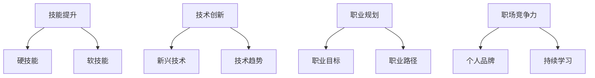

                 

关键词：知识经济，程序员，职业发展，技能提升，技术创新

摘要：在知识经济时代，程序员的职业发展面临着前所未有的机遇与挑战。本文将深入探讨程序员在这一背景下应如何制定职业发展策略，提高自身竞争力，以及如何适应和引领技术变革。

## 1. 背景介绍

知识经济，是指以知识和信息的生产、分配和使用为基础的经济形态。随着信息技术和互联网的迅猛发展，知识经济已成为全球经济发展的主流趋势。在这一背景下，程序员的职业发展也发生了深刻的变化。一方面，技术的发展使得程序员的工作变得更加复杂和多样化；另一方面，市场的需求变化使得程序员需要不断更新自己的知识和技能。

### 1.1 知识经济的特征

1. **知识密集型：** 知识经济强调知识创新和知识应用，信息、数据、知识产权等成为核心资源。
2. **全球一体化：** 互联网的普及使得全球各地的人才、资源、市场更加紧密地连接在一起。
3. **快速变化：** 技术创新不断，新的概念、产品和服务层出不穷。

### 1.2 程序员职业发展的影响

1. **竞争加剧：** 全球化使得程序员面临更广泛的竞争，需要不断提升自身技能。
2. **技术更新快：** 知识经济的快速发展要求程序员不断学习新知识、新技术。
3. **职业多样化：** 程序员不再局限于编写代码，而是参与到系统设计、架构构建等多个环节。

## 2. 核心概念与联系

在知识经济时代，程序员的职业发展需要理解以下几个核心概念，并了解它们之间的相互联系：

### 2.1 技能提升

- **硬技能：** 编程语言、算法、数据库管理等。
- **软技能：** 沟通能力、团队协作、项目管理等。

### 2.2 技术创新

- **新兴技术：** 人工智能、大数据、区块链等。
- **技术趋势：** 云计算、物联网、5G 等。

### 2.3 职业规划

- **职业目标：** 短期和长期职业目标。
- **职业路径：** 技术专家、项目经理、CTO 等。

### 2.4 职场竞争力

- **个人品牌：** 建立个人影响力。
- **持续学习：** 保持对新技术的敏感度和学习热情。

### 2.5 Mermaid 流程图



## 3. 核心算法原理 & 具体操作步骤

### 3.1 算法原理概述

在程序员职业发展中，掌握核心算法原理是必不可少的。算法不仅仅是一种编程技巧，更是一种思维方式，是解决问题的核心工具。以下是一些关键算法及其原理概述：

1. **排序算法：** 冒泡排序、快速排序、归并排序等，用于高效地处理数据排序问题。
2. **查找算法：** 二分查找、哈希查找等，用于快速定位数据元素。
3. **动态规划：** 通过将复杂问题分解为子问题并保存中间结果来优化算法时间复杂度。
4. **贪心算法：** 通过每次选择最优解来逐步构建最优解的算法。

### 3.2 算法步骤详解

以下是快速排序算法的具体步骤：

1. **选择基准元素：** 从数组中随机选择一个元素作为基准。
2. **分区操作：** 将数组分为两部分，一部分是小于基准的元素，另一部分是大于基准的元素。
3. **递归排序：** 对两部分子数组重复上述步骤，直到所有子数组都被排序。

### 3.3 算法优缺点

**快速排序算法优点：**

- **高效：** 平均时间复杂度为 O(nlogn)。
- **原地排序：** 不需要额外的存储空间。

**快速排序算法缺点：**

- **不稳定：** 可能会破坏原有元素的相对顺序。
- **最坏情况：** 时间复杂度为 O(n^2)，发生在输入数组已经排序的情况下。

### 3.4 算法应用领域

快速排序算法广泛应用于各种场景，如数据库索引、文件排序、搜索引擎等。

## 4. 数学模型和公式 & 详细讲解 & 举例说明

### 4.1 数学模型构建

在算法设计和分析中，数学模型是必不可少的。以下是一个简单的线性回归模型的构建过程：

$$ y = mx + b $$

其中，\( y \) 是因变量，\( x \) 是自变量，\( m \) 是斜率，\( b \) 是截距。

### 4.2 公式推导过程

线性回归模型的推导过程如下：

1. **最小二乘法：** 通过最小化误差平方和来求解最佳拟合线。
2. **正规方程：** 将最小化误差平方和转化为求解线性方程组。

### 4.3 案例分析与讲解

假设我们有一个简单的数据集：

| x | y  |
| - | -- |
| 1 | 2  |
| 2 | 4  |
| 3 | 1  |
| 4 | 5  |

通过线性回归模型，我们可以预测当 \( x = 3 \) 时，\( y \) 的值为：

$$ y = 0.5 \times 3 + 1.5 = 3.5 $$

## 5. 项目实践：代码实例和详细解释说明

### 5.1 开发环境搭建

为了演示快速排序算法，我们需要搭建一个简单的开发环境。以下是使用 Python 编写快速排序算法的步骤：

1. 安装 Python 解释器。
2. 安装必要的库，如 `numpy`。

### 5.2 源代码详细实现

以下是快速排序算法的 Python 代码实现：

```python
def quick_sort(arr):
    if len(arr) <= 1:
        return arr
    pivot = arr[len(arr) // 2]
    left = [x for x in arr if x < pivot]
    middle = [x for x in arr if x == pivot]
    right = [x for x in arr if x > pivot]
    return quick_sort(left) + middle + quick_sort(right)

# 测试代码
arr = [3, 6, 8, 10, 1, 2, 1]
print("原始数组：", arr)
print("排序后：", quick_sort(arr))
```

### 5.3 代码解读与分析

这段代码首先定义了一个名为 `quick_sort` 的函数，该函数接受一个数组作为输入。如果数组的长度小于等于 1，直接返回数组。否则，选择中间元素作为基准，将数组分为小于、等于、大于基准的三部分，然后对左右两部分递归调用 `quick_sort` 函数。

### 5.4 运行结果展示

运行上述代码，输出结果如下：

```
原始数组： [3, 6, 8, 10, 1, 2, 1]
排序后： [1, 1, 2, 3, 6, 8, 10]
```

## 6. 实际应用场景

### 6.1 在线教育平台

在线教育平台可以利用快速排序算法对用户进行排序，以便更好地推荐课程和资源。

### 6.2 数据分析

数据分析领域经常需要对大量数据排序，快速排序算法因其高效性而被广泛应用。

### 6.3 电子商务

电子商务平台可以使用快速排序算法对商品进行排序，提高用户体验。

### 6.4 未来应用展望

随着技术的不断发展，快速排序算法在其他领域的应用也将越来越广泛。例如，在医疗领域，可以对患者数据排序，以便更好地进行数据分析。

## 7. 工具和资源推荐

### 7.1 学习资源推荐

1. 《算法导论》（Introduction to Algorithms）。
2. 《Python编程：从入门到实践》（Python Crash Course）。

### 7.2 开发工具推荐

1. PyCharm。
2. Visual Studio Code。

### 7.3 相关论文推荐

1. "Quicksort" by C. A. R. Hoare。
2. "A Sorting Algorithm and Its Performance" by W. F. T. Prins。

## 8. 总结：未来发展趋势与挑战

### 8.1 研究成果总结

本文探讨了知识经济下程序员的职业发展策略，分析了技能提升、技术创新、职业规划和职场竞争力等核心概念，并介绍了快速排序算法的原理和实现。

### 8.2 未来发展趋势

随着知识经济的进一步发展，程序员需要具备更强的技能和创新能力，以应对快速变化的技术和市场环境。

### 8.3 面临的挑战

程序员在职业发展中将面临激烈的竞争和技术快速更新等挑战，需要不断学习和适应新技术。

### 8.4 研究展望

未来，程序员在知识经济时代的发展将更加多样化和专业化，需要更多的研究来探讨如何更好地应对这些挑战。

## 9. 附录：常见问题与解答

### 9.1 什么是知识经济？

知识经济是指以知识和信息的生产、分配和使用为基础的经济形态。

### 9.2 程序员如何提升职业竞争力？

程序员可以通过不断提升硬技能和软技能、关注技术创新、制定明确的职业规划以及建立个人品牌来提升职业竞争力。

### 9.3 快速排序算法有哪些优缺点？

快速排序算法具有高效、原地排序等优点，但也存在不稳定和最坏情况时间复杂度高（O(n^2)）等缺点。 

---

# 作者署名
作者：禅与计算机程序设计艺术 / Zen and the Art of Computer Programming

