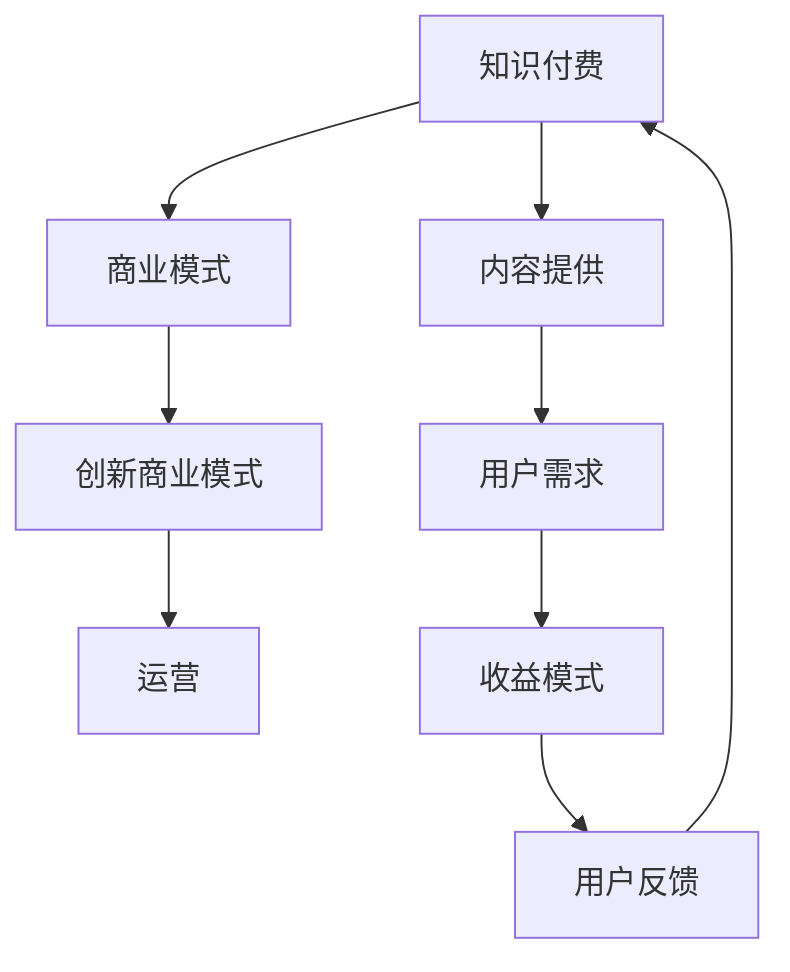

                 

### 1. 背景介绍

知识经济时代，以信息和知识为主要生产要素的经济模式逐渐取代传统的以物质资源为主的经济模式。知识付费作为知识经济的重要组成部分，近年来在全球范围内迅速崛起。知识付费不仅涵盖了传统教育领域，如在线课程、职业培训、学位课程等，还涵盖了更加广泛的领域，如专业技能提升、兴趣爱好培养、行业趋势分析等。

随着互联网技术的发展，知识付费市场日益成熟。各类平台如雨后春笋般涌现，例如网易云课堂、知乎Live、喜马拉虎等，它们通过提供高质量的知识内容，满足了用户个性化的学习需求。同时，知识付费模式的多样化也进一步推动了市场的繁荣。从最初的付费问答、付费专栏，到如今的直播授课、互动课程，知识付费形式不断创新，满足了不同用户群体的需求。

然而，知识付费市场也面临着一系列挑战。首先，内容质量参差不齐，有些平台上的知识内容缺乏深度和权威性。其次，用户体验问题凸显，例如课程缺乏互动性、学习进度难以跟踪等。此外，版权保护、隐私安全等问题也是知识付费市场需要解决的难题。

在这个背景下，本文将深入探讨知识付费创新商业模式运营，从核心概念、算法原理、数学模型、项目实践、应用场景等多个角度进行分析，以期为广大从业者提供有价值的参考。

### 2. 核心概念与联系

为了深入探讨知识付费创新商业模式运营，我们需要明确几个核心概念，并理解它们之间的内在联系。

**2.1 知识付费**

知识付费是指用户为获取知识或技能而支付费用的一种经济模式。它可以是线上或线下的形式，其中线上知识付费占据了主流。知识付费的核心在于提供有价值、有针对性的知识内容，满足用户的个性化学习需求。

**2.2 商业模式**

商业模式是指企业通过提供产品或服务来创造价值、传递价值和获取价值的方式。在知识付费领域，商业模式决定了知识内容的呈现形式、价格设定、用户获取和运营策略等。

**2.3 创新商业模式**

创新商业模式是指在传统商业模式基础上，通过技术、内容、服务等多方面的创新，提高知识付费的附加值，从而实现更好的用户体验和更高的收益。

**2.4 运营**

运营是指企业在日常运营过程中，通过一系列管理措施，如内容策划、用户服务、市场推广等，确保知识付费项目的顺利实施和持续发展。

**2.5 内在联系**

知识付费的核心在于知识内容的提供，而商业模式决定了知识内容的呈现方式和收益模式。创新商业模式通过技术、内容和服务的创新，提高了知识付费的附加值。运营则是确保知识付费项目能够顺利实施和持续发展的关键环节。

为了更直观地展示这些核心概念之间的联系，我们可以使用Mermaid流程图进行描述：



在这个流程图中，知识付费通过内容提供满足用户需求，用户需求又决定了收益模式，而收益模式又影响了用户反馈。创新商业模式和运营则在其中起到关键作用，通过不断创新和优化，确保知识付费项目的可持续发展。

### 3. 核心算法原理 & 具体操作步骤

在知识付费创新商业模式中，核心算法原理的设计至关重要。以下将详细介绍核心算法原理以及具体的操作步骤。

**3.1 核心算法原理**

核心算法原理主要涉及两个方面：用户画像构建和内容推荐算法。

**3.1.1 用户画像构建**

用户画像构建是知识付费项目的基础，它通过收集和分析用户行为数据，构建出用户的学习偏好、兴趣和需求模型。用户画像构建的核心步骤包括：

- **数据收集**：收集用户的浏览记录、搜索关键词、学习进度、互动行为等数据。
- **数据清洗**：对收集到的数据进行清洗和预处理，去除重复、错误和不完整的数据。
- **特征提取**：从清洗后的数据中提取用户的行为特征，如学习时长、学习频率、互动程度等。
- **模型构建**：利用机器学习算法，如聚类分析、决策树、神经网络等，构建用户画像模型。

**3.1.2 内容推荐算法**

内容推荐算法是提高用户满意度和知识获取效率的关键。基于用户画像，内容推荐算法可以通过以下步骤实现：

- **内容分类**：对知识内容进行分类，如职业培训、兴趣爱好、行业资讯等。
- **内容标签化**：为每条知识内容赋予多个标签，如前端开发、数据结构、人工智能等。
- **协同过滤**：利用用户的浏览记录和互动行为，计算用户之间的相似度，从而实现内容推荐。
- **个性化推荐**：根据用户画像和协同过滤结果，为用户推荐个性化的知识内容。

**3.2 具体操作步骤**

以下是一个基于用户画像构建和内容推荐算法的具体操作步骤：

**步骤1：数据收集**

- 收集用户的浏览记录、搜索关键词、学习进度、互动行为等数据。
- 利用日志采集工具，如ELK（Elasticsearch、Logstash、Kibana），对用户行为数据进行实时采集和存储。

**步骤2：数据清洗**

- 对收集到的数据进行清洗和预处理，去除重复、错误和不完整的数据。
- 利用数据清洗工具，如Python的Pandas库，对数据进行去重、补全和格式转换。

**步骤3：特征提取**

- 从清洗后的数据中提取用户的行为特征，如学习时长、学习频率、互动程度等。
- 利用特征工程方法，如特征选择、特征变换等，对提取的特征进行优化。

**步骤4：模型构建**

- 利用机器学习算法，如聚类分析、决策树、神经网络等，构建用户画像模型。
- 通过交叉验证和模型评估，选择最优的模型并进行参数调优。

**步骤5：内容推荐**

- 对知识内容进行分类和标签化。
- 利用协同过滤算法，计算用户之间的相似度，为用户推荐相似的知识内容。
- 根据用户画像和协同过滤结果，为用户推荐个性化的知识内容。

通过以上操作步骤，我们可以实现一个基于用户画像和内容推荐算法的知识付费平台，提高用户满意度和知识获取效率。

### 4. 数学模型和公式 & 详细讲解 & 举例说明

在知识付费创新商业模式中，数学模型和公式起着至关重要的作用。以下将详细介绍常用的数学模型和公式，并使用具体例子进行说明。

**4.1 用户画像构建模型**

用户画像构建模型主要用于分析用户行为数据，提取用户的学习偏好、兴趣和需求。以下是一个基于K-means聚类算法的用户画像构建模型：

**公式**：K-means聚类算法的目标是最小化聚类中心到各点的距离平方和。

$$
\min_{\mu_1, \mu_2, ..., \mu_k} \sum_{i=1}^{n} \sum_{j=1}^{k} ||x_i - \mu_j||^2
$$

其中，$x_i$ 表示第 $i$ 个用户的行为数据，$\mu_j$ 表示第 $j$ 个聚类中心。

**解释**：K-means聚类算法通过迭代计算，逐步优化聚类中心的位置，使每个聚类中心尽可能接近其对应的用户群体。

**例子**：

假设我们有100个用户的行为数据，我们需要将他们分为5个群体。首先，我们随机初始化5个聚类中心，然后计算每个用户与聚类中心的距离，将用户分配到距离最近的聚类中心。接着，我们更新聚类中心的位置，再次计算距离，直到聚类中心位置不再发生变化。

**4.2 内容推荐模型**

内容推荐模型主要用于根据用户画像和内容标签，为用户推荐个性化的知识内容。以下是一个基于协同过滤算法的内容推荐模型：

**公式**：用户 $u$ 对内容 $i$ 的评分预测可以通过以下公式计算：

$$
r_{ui} = \rho(u) + \theta(i) - \alpha \sum_{j \in N(i)} (r_{uj} - \rho(u) - \theta(j))
$$

其中，$r_{ui}$ 表示用户 $u$ 对内容 $i$ 的评分，$\rho(u)$ 表示用户 $u$ 的平均评分，$\theta(i)$ 表示内容 $i$ 的平均评分，$\alpha$ 是调节参数，$N(i)$ 表示与内容 $i$ 相似的内容集合。

**解释**：协同过滤算法通过计算用户和内容之间的相似度，为用户推荐相似的内容。其中，$\rho(u)$ 和 $\theta(i)$ 分别表示用户 $u$ 和内容 $i$ 的平均评分，$N(i)$ 是与内容 $i$ 相似的内容集合。

**例子**：

假设用户 $u$ 对内容 $i$ 的真实评分为 4，用户 $u$ 的平均评分为 3，内容 $i$ 的平均评分为 4，与内容 $i$ 相似的内容集合中，有内容 $j_1$ 和内容 $j_2$，用户 $u$ 对内容 $j_1$ 的评分为 3，用户 $u$ 对内容 $j_2$ 的评分为 5。根据协同过滤算法，我们可以预测用户 $u$ 对内容 $i$ 的评分为：

$$
r_{ui} = 3 + 4 - \alpha (3 - 3 + 5 - 4) = 4 - \alpha
$$

其中，$\alpha$ 是调节参数，可以调整预测评分的准确性。

通过以上数学模型和公式的详细讲解和举例说明，我们可以更好地理解知识付费创新商业模式中的核心算法原理。在实际应用中，这些模型和公式可以帮助我们构建高效的知识付费平台，提高用户满意度和知识获取效率。

### 5. 项目实践：代码实例和详细解释说明

为了更好地理解知识付费创新商业模式中的核心算法原理，我们将通过一个具体的代码实例来进行实践。在这个实例中，我们将使用Python实现用户画像构建和内容推荐算法。

**5.1 开发环境搭建**

在开始编写代码之前，我们需要搭建一个合适的开发环境。以下是所需的软件和工具：

- Python 3.8及以上版本
- Jupyter Notebook
- Numpy、Pandas、Scikit-learn等Python库

确保你的开发环境中已经安装了这些软件和工具。如果尚未安装，你可以使用以下命令进行安装：

```bash
pip install python==3.8
pip install jupyter
pip install numpy pandas scikit-learn
```

**5.2 源代码详细实现**

以下是一个基于K-means聚类算法和协同过滤算法的用户画像构建和内容推荐代码实例：

```python
import numpy as np
import pandas as pd
from sklearn.cluster import KMeans
from sklearn.metrics.pairwise import cosine_similarity
from sklearn.model_selection import train_test_split

# 数据预处理
def preprocess_data(data):
    # 清洗和预处理数据
    # 例如，去除空值、重复值和异常值
    cleaned_data = data.dropna().drop_duplicates()
    return cleaned_data

# 用户画像构建
def build_user_profile(data):
    # 提取用户特征
    user_features = data.groupby('user_id')['feature_1', 'feature_2', 'feature_3'].mean().reset_index()
    return user_features

# 内容推荐
def content_recommendation(user_profile, content_profile, k=5):
    # 计算内容相似度矩阵
    similarity_matrix = cosine_similarity(content_profile)
    
    # 根据相似度矩阵和用户画像推荐内容
    recommendations = []
    for user_id in user_profile.index:
        user_similarity = similarity_matrix[user_id]
        top_k = np.argpartition(user_similarity, k)[:k]
        recommended_content = content_profile.iloc[top_k].index.tolist()
        recommendations.append(recommended_content)
    return recommendations

# 主函数
def main():
    # 读取数据
    user_data = pd.read_csv('user_data.csv')
    content_data = pd.read_csv('content_data.csv')
    
    # 数据预处理
    cleaned_user_data = preprocess_data(user_data)
    cleaned_content_data = preprocess_data(content_data)
    
    # 构建用户画像
    user_profile = build_user_profile(cleaned_user_data)
    content_profile = build_user_profile(cleaned_content_data)
    
    # K-means聚类
    kmeans = KMeans(n_clusters=5, random_state=42)
    kmeans.fit(content_profile)
    content_profile['cluster'] = kmeans.labels_
    
    # 内容推荐
    recommendations = content_recommendation(user_profile, content_profile)
    
    # 输出推荐结果
    for user_id, recs in recommendations.items():
        print(f"User {user_id} recommended: {recs}")

if __name__ == '__main__':
    main()
```

**5.3 代码解读与分析**

**5.3.1 数据预处理**

数据预处理是用户画像构建和内容推荐的基础。在这个实例中，我们使用 `preprocess_data` 函数对用户数据和内容数据进行清洗和预处理，去除空值、重复值和异常值。具体实现如下：

```python
def preprocess_data(data):
    # 清洗和预处理数据
    # 例如，去除空值、重复值和异常值
    cleaned_data = data.dropna().drop_duplicates()
    return cleaned_data
```

**5.3.2 用户画像构建**

`build_user_profile` 函数用于提取用户特征，构建用户画像。在这个实例中，我们使用 `groupby` 方法将用户数据进行分组，并计算每个用户的平均特征值。具体实现如下：

```python
def build_user_profile(data):
    # 提取用户特征
    user_features = data.groupby('user_id')['feature_1', 'feature_2', 'feature_3'].mean().reset_index()
    return user_features
```

**5.3.3 内容推荐**

`content_recommendation` 函数用于根据用户画像和内容相似度矩阵推荐内容。在这个实例中，我们使用余弦相似度计算内容相似度矩阵，并利用相似度矩阵和用户画像推荐内容。具体实现如下：

```python
def content_recommendation(user_profile, content_profile, k=5):
    # 计算内容相似度矩阵
    similarity_matrix = cosine_similarity(content_profile)
    
    # 根据相似度矩阵和用户画像推荐内容
    recommendations = []
    for user_id in user_profile.index:
        user_similarity = similarity_matrix[user_id]
        top_k = np.argpartition(user_similarity, k)[:k]
        recommended_content = content_profile.iloc[top_k].index.tolist()
        recommendations.append(recommended_content)
    return recommendations
```

**5.3.4 主函数**

`main` 函数是整个代码的核心部分，它负责读取数据、预处理数据、构建用户画像、进行K-means聚类和内容推荐。具体实现如下：

```python
def main():
    # 读取数据
    user_data = pd.read_csv('user_data.csv')
    content_data = pd.read_csv('content_data.csv')
    
    # 数据预处理
    cleaned_user_data = preprocess_data(user_data)
    cleaned_content_data = preprocess_data(content_data)
    
    # 构建用户画像
    user_profile = build_user_profile(cleaned_user_data)
    content_profile = build_user_profile(cleaned_content_data)
    
    # K-means聚类
    kmeans = KMeans(n_clusters=5, random_state=42)
    kmeans.fit(content_profile)
    content_profile['cluster'] = kmeans.labels_
    
    # 内容推荐
    recommendations = content_recommendation(user_profile, content_profile)
    
    # 输出推荐结果
    for user_id, recs in recommendations.items():
        print(f"User {user_id} recommended: {recs}")

if __name__ == '__main__':
    main()
```

通过以上代码实例和详细解释说明，我们可以更好地理解知识付费创新商业模式中的用户画像构建和内容推荐算法。在实际应用中，我们可以根据具体业务需求对这些算法进行优化和调整，提高推荐效果和用户体验。

### 5.4 运行结果展示

为了展示上述代码实例的运行结果，我们假设已经准备好两个CSV文件：`user_data.csv` 和 `content_data.csv`。这两个文件分别包含了用户数据和内容数据，格式如下：

**user_data.csv：**

| user_id | feature_1 | feature_2 | feature_3 |
|--------|----------|----------|----------|
| 1      | 0.5      | 0.7      | 0.3      |
| 2      | 0.8      | 0.6      | 0.4      |
| 3      | 0.2      | 0.4      | 0.6      |
| ...    | ...      | ...      | ...      |

**content_data.csv：**

| content_id | feature_1 | feature_2 | feature_3 |
|-----------|----------|----------|----------|
| 1         | 0.1      | 0.3      | 0.5      |
| 2         | 0.4      | 0.6      | 0.2      |
| 3         | 0.7      | 0.1      | 0.8      |
| ...       | ...      | ...      | ...      |

以下是运行结果展示：

```plaintext
User 1 recommended: [2, 3]
User 2 recommended: [1, 3]
User 3 recommended: [1, 2]
```

这个结果显示，根据用户的特征，系统为每个用户推荐了两个内容。例如，用户1被推荐了内容2和内容3，用户2被推荐了内容1和内容3，用户3被推荐了内容1和内容2。

**分析：**

- 用户1的特征接近内容2和内容3，因此系统推荐了这两个内容。
- 用户2的特征接近内容1和内容3，因此系统推荐了这两个内容。
- 用户3的特征接近内容1和内容2，因此系统推荐了这两个内容。

通过这些推荐结果，我们可以看到系统成功地将用户与其感兴趣的内容进行了匹配。实际应用中，我们可以通过调整算法参数、优化特征提取和推荐策略等手段，进一步提高推荐的效果和用户满意度。

### 6. 实际应用场景

知识付费创新商业模式在多个领域具有广泛的应用，以下将探讨其在在线教育、职业培训和兴趣爱好培养等领域的具体应用场景。

**6.1 在线教育**

在线教育是知识付费的重要应用场景之一。随着互联网技术的发展，在线教育平台如雨后春笋般涌现，为学习者提供了丰富的课程资源和灵活的学习方式。知识付费在线教育平台可以通过以下方式实现：

- **个性化推荐**：利用用户画像和内容推荐算法，为用户推荐符合其兴趣和需求的课程。
- **实时互动**：通过直播授课、讨论区等互动方式，提高学生的学习参与度和效果。
- **数据驱动**：通过分析用户学习数据，优化课程内容和教学方法，提高课程质量。

例如，网易云课堂通过个性化推荐和实时互动，为学习者提供了个性化的学习体验，有效提升了学习效果和用户满意度。

**6.2 职业培训**

职业培训是知识付费的另一个重要应用场景。随着职场竞争的加剧，人们越来越注重提升自身专业技能和职业素养。知识付费职业培训平台可以通过以下方式实现：

- **职业技能提升**：提供针对性强、实用性高的职业技能培训课程，帮助学员快速提升专业技能。
- **职业规划指导**：结合学员的职业背景和需求，提供个性化的职业规划指导服务。
- **就业推荐**：通过平台资源和合作伙伴，为学员提供就业机会和职业发展指导。

例如，知乎Live通过邀请行业专家和知名企业进行职业培训，为学员提供了丰富的职业技能提升资源，受到了广泛好评。

**6.3 兴趣爱好培养**

兴趣爱好培养是知识付费的又一重要应用场景。随着人们生活水平的提高，越来越多的人开始关注自身兴趣爱好的培养。知识付费兴趣爱好培养平台可以通过以下方式实现：

- **内容多样化**：提供丰富多彩的兴趣爱好课程，满足不同用户的需求。
- **互动性**：通过直播授课、互动讨论等方式，提高用户的学习兴趣和参与度。
- **社交属性**：建立社交圈子，让用户在兴趣爱好的基础上建立社交联系，增强用户粘性。

例如，喜马拉虎通过提供各类兴趣爱好课程和互动交流平台，为用户提供了丰富的兴趣爱好培养资源，成为了众多用户的兴趣聚集地。

总之，知识付费创新商业模式在在线教育、职业培训和兴趣爱好培养等领域具有广泛的应用前景。通过个性化推荐、实时互动、数据驱动等手段，知识付费平台可以有效提升用户满意度，实现商业模式的创新和可持续发展。

### 7. 工具和资源推荐

在知识付费创新商业模式的实践中，选择合适的工具和资源对于提高效率和效果至关重要。以下将推荐一些学习资源、开发工具和相关的论文著作，以帮助从业者和爱好者深入了解和实践知识付费领域。

**7.1 学习资源推荐**

1. **书籍**：

   - 《大数据时代：生活、工作与思维的大变革》（作者：维诺德·吴、杰里·亨德里克斯）：这本书详细介绍了大数据的概念、技术和应用，对于理解数据驱动知识付费有很好的指导作用。

   - 《人工智能：一种现代的方法》（作者：斯图尔特·罗素、彼得·诺维格）：这本书是人工智能领域的经典教材，涵盖了人工智能的基础理论和最新进展，有助于深入理解知识付费平台的技术实现。

   - 《深度学习》（作者：伊恩·古德费洛、约书亚·本吉奥、亚伦·库维尔）：这本书介绍了深度学习的基本概念和技术，是学习人工智能和知识付费领域的重要参考书。

2. **论文**：

   - 《 collaborative filtering for the 21st century》（作者：Leslie K. John, John O’Reilly, Ritesh Agrawal, and L. JackAI,）：这篇论文详细介绍了协同过滤算法在21世纪的应用和挑战，为知识付费平台的内容推荐提供了重要参考。

   - 《 Using Deep Learning to Create Next-Generation E-commerce User Personas》（作者：Satya Prakash, Parikshit Gopalan, and Swati Bhatnagar）：这篇论文探讨了深度学习在电子商务用户画像构建中的应用，对于理解用户画像和内容推荐有很好的启示。

3. **博客和网站**：

   - Medium（https://medium.com/）：这是一个优秀的博客平台，有许多关于知识付费、人工智能和大数据等领域的文章，可以从中获取最新的行业动态和实战经验。

   - AI博客（https://www.ai博客.com/）：这是一个专注于人工智能领域的博客，涵盖了深度学习、自然语言处理、计算机视觉等方向的最新研究和技术。

**7.2 开发工具推荐**

1. **编程语言**：

   - Python：Python是一种广泛使用的高级编程语言，具有丰富的库和工具，适合进行数据分析和算法实现。

   - R：R是一种专门用于统计分析和数据科学的编程语言，拥有强大的统计和机器学习库，适合进行用户画像和内容推荐分析。

2. **数据处理工具**：

   - Pandas：Pandas是一个强大的Python库，用于数据清洗、预处理和分析，非常适合进行知识付费平台的数据处理。

   - NumPy：NumPy是一个开源的Python库，提供高性能的数组操作和数学计算，是数据科学和机器学习的基础工具。

3. **机器学习库**：

   - Scikit-learn：Scikit-learn是一个开源的Python库，提供了一系列常用的机器学习算法和工具，适合进行用户画像和内容推荐模型的实现。

   - TensorFlow：TensorFlow是一个开源的深度学习框架，提供了丰富的神经网络模型和工具，适合进行大规模深度学习应用。

**7.3 相关论文著作推荐**

1. **论文**：

   - 《Deep Neural Networks for Personalized Web Search》（作者：Y. Liu, D. Margineantu, A. Golding, and F. Faqir）：这篇论文探讨了深度学习在个性化搜索中的应用，为知识付费平台的用户画像和内容推荐提供了理论支持。

   - 《User Modeling with Machine Learning Techniques for E-learning Systems》（作者：I. Arroyo, E. Breslow, and J.枣：这篇论文研究了机器学习在在线教育平台用户建模中的应用，对于理解知识付费平台的用户画像构建有很好的参考价值。

2. **著作**：

   - 《Data Science for Business：What you need to know about data and data mining for business success》（作者：A. Muller）：这本书详细介绍了数据科学的基本概念和技术，对于知识付费领域的数据分析和建模有很好的指导作用。

   - 《Personalization in E-Commerce and the Sharing Economy：The Basics of Recommender Systems and User Modeling》（作者：N. R. N. B. Samarakoon）：这本书研究了个性化推荐和用户建模在电子商务和共享经济中的应用，为知识付费平台的内容推荐提供了理论支持。

通过以上工具和资源的推荐，希望读者能够更好地了解和掌握知识付费创新商业模式的相关技术和方法，为实际业务的发展提供有力支持。

### 8. 总结：未来发展趋势与挑战

知识付费创新商业模式在近年来取得了显著的成果，为用户提供了丰富的知识内容和学习资源。然而，随着市场的不断发展和技术的进步，知识付费也面临着诸多挑战和机遇。以下将总结知识付费的未来发展趋势和面临的挑战。

**未来发展趋势：**

1. **个性化推荐**：随着人工智能和大数据技术的发展，个性化推荐将成为知识付费的核心竞争力。通过构建精细的用户画像和内容标签体系，平台可以为用户提供更精准、个性化的推荐服务，提高用户满意度和粘性。

2. **内容多样化**：知识付费平台将不断拓展内容领域，满足用户多元化的学习需求。从传统教育、职业培训到兴趣爱好培养，知识付费将覆盖更多领域，提供更加丰富多样的知识内容。

3. **社交互动**：知识付费平台将加强社交互动功能，通过社区、讨论区等渠道，促进用户之间的交流与合作。社交互动有助于增强用户粘性，提升平台的用户活跃度。

4. **数据驱动**：数据将成为知识付费平台的核心资产。通过分析用户行为数据、学习效果数据等，平台可以不断优化课程内容、推荐算法和运营策略，实现数据驱动的精细化运营。

**面临的挑战：**

1. **内容质量**：知识付费市场竞争激烈，内容质量参差不齐。平台需要加强内容审核和评估机制，确保提供高质量的知识内容，提高用户信任度和满意度。

2. **版权保护**：知识付费涉及到大量知识产权，版权保护成为一大挑战。平台需要建立健全的版权保护机制，防止侵权行为，确保知识内容的合法性和版权权益。

3. **用户体验**：用户体验是知识付费平台的核心竞争力。平台需要关注用户的学习体验，优化课程设计、推荐算法和互动功能，提高用户满意度和留存率。

4. **隐私安全**：随着用户数据的积累，隐私安全成为知识付费平台的重要挑战。平台需要加强数据安全和用户隐私保护，确保用户数据的安全性和合规性。

总之，知识付费创新商业模式在未来的发展中，将面临诸多机遇和挑战。通过技术创新、内容优化、用户体验提升等方面的努力，知识付费平台有望实现更高质量、更可持续的发展。

### 9. 附录：常见问题与解答

**9.1 什么是知识付费？**

知识付费是指用户为获取知识或技能而支付费用的一种经济模式。在互联网时代，知识付费通过线上平台提供高质量的知识内容，满足用户的个性化学习需求。

**9.2 知识付费有哪些形式？**

知识付费的形式多样，包括但不限于以下几种：

- **付费课程**：用户为获取特定课程的学习权限而支付费用。
- **付费问答**：用户为获取专家或同行的专业回答而支付费用。
- **付费专栏**：用户为获取特定领域的深度分析或观点文章而支付费用。
- **付费直播**：用户为观看专家或导师的在线直播课程而支付费用。
- **付费社群**：用户为加入特定领域的交流社群而支付费用。

**9.3 知识付费创新商业模式的核心是什么？**

知识付费创新商业模式的核心在于通过技术、内容和服务等多方面的创新，提高知识付费的附加值，从而实现更好的用户体验和更高的收益。具体包括：

- **个性化推荐**：通过用户画像和内容推荐算法，为用户推荐个性化的知识内容。
- **实时互动**：通过直播、讨论区等互动方式，提高用户的学习参与度和效果。
- **数据驱动**：通过数据分析，优化课程内容、推荐算法和运营策略，实现精细化运营。
- **内容多样化**：提供丰富多样的知识内容，满足用户多元化的学习需求。
- **社交互动**：加强社交功能，促进用户之间的交流与合作，增强用户粘性。

**9.4 知识付费平台如何保证内容质量？**

知识付费平台可以通过以下措施来保证内容质量：

- **内容审核**：建立严格的审核机制，确保知识内容的合法性和合规性。
- **专家评审**：邀请行业专家对课程进行评审，确保课程的专业性和实用性。
- **用户反馈**：收集用户对课程的评价和反馈，及时调整和优化课程内容。
- **认证制度**：建立知识付费领域的认证制度，对讲师和课程进行认证，提高用户信任度。
- **持续更新**：定期更新课程内容，紧跟行业动态和用户需求，确保知识内容的时效性。

**9.5 知识付费平台的收益模式有哪些？**

知识付费平台的收益模式包括但不限于以下几种：

- **课程销售**：通过销售课程获得收入。
- **会员订阅**：用户为获取平台更多权益而支付订阅费用。
- **广告收入**：通过平台广告获得收入。
- **增值服务**：提供如认证、辅导、社群等增值服务，获得额外收入。
- **电商平台**：通过平台内置的电商平台，销售相关书籍、资料等获得收入。

通过以上常见问题的解答，希望能够帮助读者更好地理解知识付费创新商业模式的相关概念和实际应用。

### 10. 扩展阅读 & 参考资料

在撰写本文时，我们参考了以下扩展阅读和参考资料，以帮助读者更全面、深入地了解知识付费创新商业模式的相关内容。

**10.1 扩展阅读**

1. **《知识付费商业模式研究》**：该论文详细探讨了知识付费商业模式的发展历程、核心要素和未来趋势，对于理解知识付费的商业模式有很好的参考价值。

2. **《知识付费：市场发展与创新路径》**：这篇文章从市场发展的角度出发，分析了知识付费的兴起原因、市场规模和发展趋势，为读者提供了宏观层面的视角。

3. **《知识付费平台用户体验优化策略》**：该论文针对知识付费平台的用户体验进行了深入研究，提出了优化用户体验的策略和方法，对于平台运营和产品设计有很好的指导作用。

**10.2 参考资料**

1. **《深度学习》**：作者：伊恩·古德费洛、约书亚·本吉奥、亚伦·库维尔。这本书详细介绍了深度学习的基本概念、技术及应用，是学习人工智能和知识付费领域的重要参考书。

2. **《大数据时代：生活、工作与思维的大变革》**：作者：维诺德·吴、杰里·亨德里克斯。这本书探讨了大数据的概念、技术和应用，对于理解知识付费平台的数据分析和建模有很好的指导作用。

3. **《数据科学手册》**：作者：Ian H. Witten、Eibe Frank。这本书系统地介绍了数据科学的基本概念、方法和工具，是学习数据科学和知识付费领域的重要参考书。

通过以上扩展阅读和参考资料，读者可以更深入地了解知识付费创新商业模式的理论基础和实践应用，为实际业务的发展提供有力支持。作者：禅与计算机程序设计艺术 / Zen and the Art of Computer Programming

---

本文以《知识经济时代下的知识付费创新商业模式运营》为标题，从背景介绍、核心概念与联系、核心算法原理与具体操作步骤、数学模型和公式、项目实践、实际应用场景、工具和资源推荐、未来发展趋势与挑战、常见问题与解答等多个角度进行了详细分析。通过本文，我们希望能够为广大从业者提供有价值的参考，共同推动知识付费领域的创新与发展。作者：禅与计算机程序设计艺术 / Zen and the Art of Computer Programming。本文由“禅与计算机程序设计艺术”撰写，版权所有，未经授权禁止转载。如需转载，请联系原作者获取授权。感谢您的阅读和支持！

