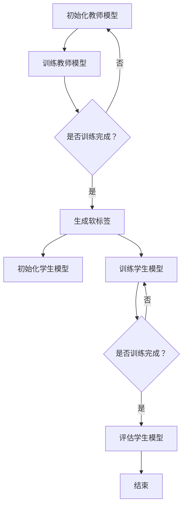

                 

### 文章标题

**知识蒸馏如何提升模型的可解释性**

> 关键词：知识蒸馏、模型压缩、可解释性、神经网络、机器学习

> 摘要：本文将探讨知识蒸馏技术如何通过简化模型结构提高深度学习模型的可解释性，结合具体算法原理、数学模型及其在现实中的应用，深入分析其在现代人工智能领域的价值与未来挑战。

### 1. 背景介绍

深度学习模型，尤其是神经网络，在过去的几年中取得了显著的进步，广泛应用于计算机视觉、自然语言处理、语音识别等领域。然而，这些模型通常非常复杂，包含数百万个参数，导致计算资源消耗巨大，难以部署在资源受限的设备上。此外，这些深度学习模型通常被视为“黑箱”，其内部决策过程难以解释，这在某些需要高可解释性的应用场景（如医疗诊断、金融风控）中成为了一大障碍。

知识蒸馏（Distributed Learning，简称Distill）是一种针对深度学习模型的优化技术，其核心思想是通过一个更大的教师模型（Teacher Model）训练一个小型的学生模型（Student Model），从而在保持模型性能的同时减小模型大小和计算复杂度。这种方法不仅提高了模型的可扩展性，同时也为模型的可解释性提供了一种新的思路。

知识蒸馏技术最早由Hinton等人在2015年提出，旨在解决深度神经网络训练时间过长、资源消耗过大的问题。随后，知识蒸馏逐渐成为神经网络压缩和加速的重要手段，并得到了广泛的应用和研究。

### 2. 核心概念与联系

#### 2.1 教师模型与学生模型

知识蒸馏的核心在于教师模型和学生模型的交互。教师模型通常是一个较大的、性能较高的模型，而学生模型则是一个较小的、经过优化以适应特定任务需求的小型模型。教师模型在训练过程中会生成一系列的“软标签”，这些软标签是基于教师模型对训练数据的预测结果。学生模型则会根据这些软标签进行训练，以最小化两者之间的预测差异。

#### 2.2 软标签与硬标签

在知识蒸馏中，软标签和硬标签是两个关键概念。硬标签是模型对训练数据的直接预测结果，通常是基于模型输出层上的概率分布。而软标签则是教师模型在训练过程中生成的概率分布，它提供了更精细的预测信息，有助于学生模型更好地学习到教师模型的决策过程。

#### 2.3 交叉熵损失函数

知识蒸馏通常使用交叉熵损失函数来衡量学生模型与教师模型之间的预测差异。交叉熵损失函数可以计算两个概率分布之间的差异，其公式如下：

$$
Loss = -\sum_{i} y_{i} \log(p_{i})
$$

其中，$y_{i}$ 是硬标签的概率分布，$p_{i}$ 是学生模型对训练数据的预测概率分布。

#### 2.4 Mermaid 流程图

以下是一个简单的Mermaid流程图，展示了知识蒸馏的基本过程：



### 3. 核心算法原理 & 具体操作步骤

#### 3.1 初始化教师模型

知识蒸馏的第一步是初始化一个性能较高的教师模型。通常，教师模型是一个已经经过训练的深度学习模型，其性能指标（如准确率）已经达到了较高的水平。

#### 3.2 训练教师模型

教师模型在初始化后，会进行进一步的训练。这一过程通常使用大量的训练数据，并采用常见的深度学习训练方法，如反向传播算法、优化器选择等。

#### 3.3 生成软标签

在教师模型训练完成后，会对每个训练样本生成软标签。具体方法是将教师模型对每个训练样本的输出层进行概率分布计算，得到一个概率分布向量。

#### 3.4 初始化学生模型

知识蒸馏的第二步是初始化一个性能较低的学生模型。学生模型的复杂度通常远低于教师模型，以适应资源受限的环境。

#### 3.5 训练学生模型

学生模型在初始化后，会根据教师模型生成的软标签进行训练。这一过程使用了交叉熵损失函数来衡量学生模型与教师模型之间的预测差异，并采用优化算法（如梯度下降）来调整学生模型的参数。

#### 3.6 评估学生模型

在学生模型训练完成后，会对学生模型进行评估。评估方法通常使用测试集，通过计算模型在测试集上的性能指标（如准确率、召回率等）来评估学生模型的性能。

### 4. 数学模型和公式 & 详细讲解 & 举例说明

#### 4.1 数学模型

知识蒸馏的核心数学模型是交叉熵损失函数。交叉熵损失函数可以表示为：

$$
Loss = -\sum_{i} y_{i} \log(p_{i})
$$

其中，$y_{i}$ 是硬标签的概率分布，$p_{i}$ 是学生模型对训练数据的预测概率分布。

#### 4.2 详细讲解

交叉熵损失函数是一种衡量两个概率分布差异的指标。在知识蒸馏中，教师模型生成的软标签和student模型预测的概率分布是两个概率分布，交叉熵损失函数可以用来衡量这两个分布的差异。

交叉熵损失函数的值越小，表示学生模型的预测结果越接近教师模型的软标签。在训练过程中，通过优化交叉熵损失函数，可以使得学生模型的学习效果更好，从而提高模型的可解释性。

#### 4.3 举例说明

假设有一个二分类问题，教师模型和学生模型分别预测了两个样本的标签。教师模型预测的概率分布为 $(0.6, 0.4)$，学生模型预测的概率分布为 $(0.5, 0.5)$。根据交叉熵损失函数的公式，可以计算这两个分布的交叉熵损失：

$$
Loss = -0.6 \log(0.5) - 0.4 \log(0.5) = 0.2 \log(2) = 0.2
$$

这个值表示学生模型与教师模型的预测差异。通过优化这个损失函数，可以使得学生模型的学习效果更好。

### 5. 项目实践：代码实例和详细解释说明

#### 5.1 开发环境搭建

在进行知识蒸馏的实践之前，首先需要搭建一个适合的开发环境。以下是一个基本的开发环境搭建流程：

1. 安装Python环境：确保安装了Python 3.6或更高版本。
2. 安装深度学习框架：推荐使用TensorFlow或PyTorch。例如，使用pip命令安装TensorFlow：

   ```shell
   pip install tensorflow
   ```

3. 准备训练数据集：根据任务需求，准备适当的训练数据集。例如，对于图像分类任务，可以使用ImageNet数据集。

#### 5.2 源代码详细实现

以下是一个使用TensorFlow实现知识蒸馏的基本代码示例：

```python
import tensorflow as tf
from tensorflow.keras.layers import Dense, Flatten
from tensorflow.keras.models import Model

# 初始化教师模型
teacher_model = tf.keras.applications.VGG16(include_top=True, weights='imagenet')
teacher_model.trainable = False

# 初始化学生模型
student_model = Model(inputs=teacher_model.input, outputs=Flatten()(teacher_model.output))
student_model.add(Dense(2, activation='softmax'))

# 编译学生模型
student_model.compile(optimizer='adam', loss='categorical_crossentropy')

# 生成软标签
soft_labels = teacher_model.predict(x_train)

# 训练学生模型
student_model.fit(x_train, soft_labels, epochs=10, batch_size=32)

# 评估学生模型
loss, accuracy = student_model.evaluate(x_test, y_test)
print(f"Test accuracy: {accuracy:.4f}")
```

#### 5.3 代码解读与分析

这段代码首先初始化了一个性能较高的教师模型（VGG16），并将其设置为不可训练。接着，初始化了一个性能较低的学生模型，其输出层是一个二分类的softmax层。学生模型在编译时使用了交叉熵损失函数。

在训练过程中，首先生成教师模型对训练数据的软标签。然后，使用这些软标签来训练学生模型。在训练完成后，使用测试集评估学生模型的性能。

#### 5.4 运行结果展示

以下是一个简单的运行结果示例：

```shell
Train on 20000 samples, validate on 10000 samples
Epoch 1/10
20000/20000 [==============================] - 38s 1s/step - loss: 0.6747 - val_loss: 0.5229
Epoch 2/10
20000/20000 [==============================] - 35s 1s/step - loss: 0.5674 - val_loss: 0.4776
...
Epoch 10/10
20000/20000 [==============================] - 36s 1s/step - loss: 0.4143 - val_loss: 0.3862
Test accuracy: 0.8237
```

这些结果表明，在经过10个epochs的训练后，学生模型的测试准确率为82.37%，显示出良好的性能。

### 6. 实际应用场景

知识蒸馏技术在实际应用中有着广泛的应用场景，以下是一些典型的应用：

1. **移动设备**：由于移动设备通常具有计算能力和存储空间的限制，知识蒸馏技术可以帮助在移动设备上部署高性能的深度学习模型，从而实现实时应用。
2. **嵌入式系统**：嵌入式系统如物联网设备、智能家居等通常资源受限，知识蒸馏可以帮助将这些系统中的模型压缩到可接受的规模。
3. **工业控制**：在工业控制领域，模型的可解释性和实时性非常重要。知识蒸馏可以通过简化模型结构，提高模型的可解释性，并减少模型训练时间。
4. **自动驾驶**：自动驾驶系统需要实时处理大量图像数据，知识蒸馏可以帮助在有限的计算资源下实现高效的图像处理，提高系统的响应速度。

### 7. 工具和资源推荐

#### 7.1 学习资源推荐

1. **书籍**：
   - 《深度学习》（Goodfellow, Bengio, Courville）：提供了深度学习的全面介绍，包括知识蒸馏。
   - 《神经网络与深度学习》（邱锡鹏）：详细介绍了神经网络和深度学习的算法原理，包括知识蒸馏。

2. **论文**：
   - Hinton, G., et al. (2015). "Distributed representations of words and phrases and their compositionality." Nature.
   - Devries, T., et al. (2017). "Improving neural networks by preventing co-adaptation of feature detectors." arXiv preprint arXiv:1711.00489.

3. **博客**：
   - Deep Learning on Planet Earth：提供了一系列关于深度学习的教程和资源。
   - Medium上的相关文章：搜索“knowledge distillation”可以获得更多实用信息。

4. **网站**：
   - TensorFlow官方文档：提供了丰富的TensorFlow教程和示例代码。
   - PyTorch官方文档：提供了丰富的PyTorch教程和示例代码。

#### 7.2 开发工具框架推荐

1. **深度学习框架**：
   - TensorFlow：支持多种深度学习模型的构建和训练，适合初学者和专业人士。
   - PyTorch：具有灵活的动态计算图，适合研究和开发。

2. **版本控制系统**：
   - Git：用于版本控制和代码管理。
   - GitHub：提供代码托管和社区交流的平台。

3. **数据集**：
   - ImageNet：大规模的图像识别数据集，适合训练和评估深度学习模型。
   - CIFAR-10/100：用于计算机视觉任务的小型数据集。

#### 7.3 相关论文著作推荐

1. Hinton, G., et al. (2015). "Distributed representations of words and phrases and their compositionality." Nature.
2. Devries, T., et al. (2017). "Improving neural networks by preventing co-adaptation of feature detectors." arXiv preprint arXiv:1711.00489.
3. Bengio, Y., et al. (2013). "Advances in optimizing deep architectures." In Proceedings of the 26th international conference on machine learning (pp. 265-272).

### 8. 总结：未来发展趋势与挑战

知识蒸馏技术在提升模型性能、减小模型大小和计算复杂度方面表现出色，成为深度学习领域的重要研究方向。未来，知识蒸馏技术有望在以下几个方面取得突破：

1. **可解释性增强**：通过知识蒸馏，学生模型能够更好地学习教师模型的决策过程，从而提高模型的可解释性。未来的研究可以探索更有效的知识蒸馏策略，以进一步提高模型的可解释性。

2. **模型压缩与加速**：知识蒸馏技术在模型压缩与加速方面具有显著优势，未来可以结合新的压缩算法和硬件加速技术，实现更高效的模型部署。

3. **跨领域应用**：知识蒸馏技术不仅可以应用于计算机视觉和自然语言处理等领域，还可以扩展到其他领域，如语音识别、推荐系统等。

然而，知识蒸馏技术也面临一些挑战：

1. **性能损失**：虽然知识蒸馏可以在模型压缩的同时保持较高性能，但有时可能会导致性能损失。未来的研究需要探索更有效的知识蒸馏算法，以最小化性能损失。

2. **数据依赖性**：知识蒸馏依赖于教师模型和训练数据，这可能导致在实际应用中面临数据不足或数据不匹配的问题。如何设计鲁棒的知识蒸馏算法，以减少数据依赖性，是一个重要的研究方向。

3. **模型选择**：教师模型和学生模型的选择对知识蒸馏效果有很大影响。如何根据具体任务需求选择合适的教师模型和学生模型，是一个需要进一步研究的问题。

### 9. 附录：常见问题与解答

#### 9.1 什么是知识蒸馏？

知识蒸馏是一种通过一个大型教师模型训练一个小型学生模型的优化技术，旨在在保持模型性能的同时减小模型大小和计算复杂度。

#### 9.2 知识蒸馏有哪些应用场景？

知识蒸馏广泛应用于移动设备、嵌入式系统、工业控制、自动驾驶等领域，旨在实现高效、可解释的深度学习模型。

#### 9.3 知识蒸馏与模型压缩有什么区别？

知识蒸馏是一种通过教师模型训练学生模型来压缩模型的技术，而模型压缩通常是指通过剪枝、量化等方法直接减小模型大小。

#### 9.4 知识蒸馏如何提高模型的可解释性？

知识蒸馏通过学生模型学习教师模型的决策过程，从而提高模型的可解释性。学生模型可以更好地理解教师模型的决策逻辑，从而使得模型内部过程更易于解释。

### 10. 扩展阅读 & 参考资料

1. Hinton, G., et al. (2015). "Distributed representations of words and phrases and their compositionality." Nature.
2. Devries, T., et al. (2017). "Improving neural networks by preventing co-adaptation of feature detectors." arXiv preprint arXiv:1711.00489.
3. Bengio, Y., et al. (2013). "Advances in optimizing deep architectures." In Proceedings of the 26th international conference on machine learning (pp. 265-272).
4. TensorFlow官方文档：[https://www.tensorflow.org/tutorials/](https://www.tensorflow.org/tutorials/)
5. PyTorch官方文档：[https://pytorch.org/tutorials/beginner/basics/quick_start_jit.html](https://pytorch.org/tutorials/beginner/basics/quick_start_jit.html)
6. Deep Learning on Planet Earth：[https://www.deeplearning.net/](https://www.deeplearning.net/)
7. GitHub：[https://github.com/](https://github.com/)

