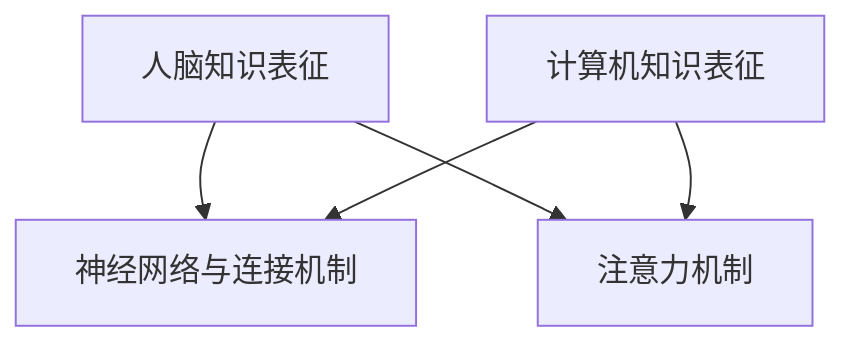

                 

关键词：知识表征、人脑、计算机、异同、人工智能、认知科学、神经网络、符号主义、语义网络

> 摘要：本文探讨了知识表征在人类大脑和计算机系统中的异同。通过分析人脑与计算机在知识存储、处理和检索方面的机制，本文旨在揭示两者之间的共性和差异，为人工智能领域的发展提供新的视角。

## 1. 背景介绍

知识表征是人工智能领域中的一个核心问题，它涉及到如何有效地表示、存储和处理信息。人脑和计算机系统在知识表征方面有着各自独特的方式。人脑通过复杂的神经网络和神经元活动来处理信息，而计算机则依赖于算法和数据结构来实现知识表征。

随着人工智能技术的快速发展，人们越来越关注如何借鉴人脑的机制来设计更高效、更智能的计算机系统。然而，人脑和计算机在知识表征方面存在许多差异，这些差异既为我们提供了灵感，也带来了挑战。

本文将探讨知识表征在人类大脑和计算机系统中的异同，分析两者之间的共性和差异，并展望未来人工智能领域的发展趋势。

## 2. 核心概念与联系

### 2.1. 人脑知识表征

人脑的知识表征是一个高度复杂的过程，涉及到多个层面和机制。首先，神经元是大脑的基本单元，它们通过电信号传递信息。神经元之间的连接形成了神经网络，这些网络在学习和记忆过程中发挥着关键作用。

人脑的知识表征不仅依赖于神经元之间的连接，还涉及到神经元活动的同步性和时空模式。这些模式构成了大脑中的模式识别和记忆机制，使得人类能够处理和存储大量的信息。

此外，人脑的知识表征还受到注意力机制的影响。注意力机制使得大脑能够在特定的环境和任务中集中处理信息，从而提高效率。

### 2.2. 计算机知识表征

计算机系统的知识表征主要依赖于算法和数据结构。计算机通过编程语言和计算模型来表示和操作信息。常见的知识表征方法包括符号主义、连接主义和语义网络等。

符号主义方法使用符号和逻辑规则来表示知识，例如命题逻辑和谓词逻辑。这种方法在形式逻辑和推理方面具有优势，但难以处理复杂和模糊的信息。

连接主义方法，如神经网络，通过调整神经元之间的连接权重来表示知识。神经网络能够通过大量的数据自动学习复杂的模式，使其在图像识别、语音识别等应用中取得了显著成果。

语义网络方法使用图结构来表示知识，节点代表实体，边代表关系。这种方法能够更好地处理复杂的语义关系，但在知识表示的灵活性和推理能力方面仍存在一定的局限。

### 2.3. 人脑与计算机知识表征的联系

人脑和计算机在知识表征方面有许多相似之处。首先，两者都依赖于网络结构和连接机制。人脑中的神经网络和计算机中的神经网络都通过调整连接权重来表示知识。

其次，两者都涉及到注意力机制。人脑的注意力机制能够集中处理信息，而计算机系统中的注意力机制（如注意力机制神经网络）也用于提高处理效率。

然而，人脑和计算机在知识表征方面也存在显著差异。人脑的知识表征具有高度的自适应性、灵活性和并行性，而计算机系统在处理复杂和模糊信息时存在一定的局限。

为了更好地理解人脑与计算机知识表征的联系，我们引入了Mermaid流程图（以下为简化版本）：



在这个流程图中，A表示人脑知识表征，B表示神经网络与连接机制，C表示注意力机制，D表示计算机知识表征。通过这个流程图，我们可以更直观地理解人脑与计算机知识表征的共性和差异。

## 3. 核心算法原理 & 具体操作步骤

### 3.1 算法原理概述

知识表征的核心算法包括符号主义方法、连接主义方法和语义网络方法。这些方法在知识表示、存储和处理方面具有各自的优势和局限性。

符号主义方法基于逻辑和规则，适用于形式逻辑和推理。连接主义方法基于神经网络，能够自动学习复杂的模式。语义网络方法基于图结构，能够更好地处理复杂的语义关系。

在本节中，我们将详细讨论这些算法的原理和操作步骤，以便读者更好地理解知识表征的方法和机制。

### 3.2 算法步骤详解

#### 3.2.1 符号主义方法

符号主义方法的步骤如下：

1. 定义符号集：选择合适的符号集来表示知识，如命题、谓词、关系等。
2. 表示知识：使用符号集表示知识，构建符号表达式。
3. 推理：使用逻辑规则和推理方法，从已知的知识推导出新的结论。

#### 3.2.2 连接主义方法

连接主义方法的步骤如下：

1. 初始化网络：初始化神经网络的结构和连接权重。
2. 输入数据：输入样本数据，通过网络进行前向传播。
3. 更新权重：使用反向传播算法，根据输出误差调整连接权重。
4. 训练模型：重复输入数据和更新权重的过程，直至达到训练目标。

#### 3.2.3 语义网络方法

语义网络方法的步骤如下：

1. 定义实体和关系：选择合适的实体和关系来表示知识。
2. 构建图结构：使用图结构表示实体和关系。
3. 查询与推理：根据图结构进行查询和推理，获取新的知识。

### 3.3 算法优缺点

#### 3.3.1 符号主义方法

优点：

- 逻辑性强，适用于形式逻辑和推理。
- 表达能力强，可以表示复杂的知识结构。

缺点：

- 难以处理模糊和不精确的信息。
- 需要大量的人工设计和规则编写。

#### 3.3.2 连接主义方法

优点：

- 自动学习，无需人工设计规则。
- 能够处理复杂和模糊的信息。

缺点：

- 训练过程较慢，需要大量数据。
- 对数据质量和样本数量有较高要求。

#### 3.3.3 语义网络方法

优点：

- 语义清晰，能够处理复杂的语义关系。
- 易于查询和推理。

缺点：

- 数据表示较为复杂，需要大量预处理。
- 对数据质量和样本数量有较高要求。

### 3.4 算法应用领域

符号主义方法在逻辑推理、知识库构建等领域有广泛应用。连接主义方法在图像识别、语音识别、自然语言处理等领域取得了显著成果。语义网络方法在语义查询、语义推理、知识图谱构建等领域具有广泛的应用前景。

## 4. 数学模型和公式 & 详细讲解 & 举例说明

### 4.1 数学模型构建

在本节中，我们将介绍知识表征领域的几个重要数学模型，包括神经网络模型、概率模型和图模型。

#### 4.1.1 神经网络模型

神经网络模型是知识表征中最常用的模型之一。一个简单的神经网络模型可以表示为：

$$
Y = f(\sum_{i=1}^{n} w_i \cdot x_i)
$$

其中，$Y$表示输出，$f$是激活函数，$w_i$是连接权重，$x_i$是输入。

#### 4.1.2 概率模型

概率模型在知识表征中也有广泛的应用。一个简单的概率模型可以表示为：

$$
P(Y|X) = \frac{P(X|Y) \cdot P(Y)}{P(X)}
$$

其中，$P(Y|X)$表示在给定输入$X$的情况下输出$Y$的概率，$P(X|Y)$表示在给定输出$Y$的情况下输入$X$的概率，$P(Y)$和$P(X)$分别是输出$Y$和输入$X$的概率。

#### 4.1.3 图模型

图模型是知识表征中用于表示实体和关系的有效方法。一个简单的图模型可以表示为：

$$
G = (V, E)
$$

其中，$V$是节点集合，表示实体，$E$是边集合，表示关系。

### 4.2 公式推导过程

在本节中，我们将对神经网络模型和概率模型的公式进行推导，以便读者更好地理解其原理。

#### 4.2.1 神经网络模型

假设一个简单的神经网络模型，其输入层有$n$个神经元，隐藏层有$m$个神经元，输出层有$k$个神经元。每个神经元之间的连接权重分别为$w_{ij}$，$i$表示输入层神经元，$j$表示隐藏层神经元。

输入层到隐藏层的激活函数可以表示为：

$$
a_j = \sum_{i=1}^{n} w_{ij} \cdot x_i
$$

其中，$a_j$是隐藏层神经元的激活值，$x_i$是输入层神经元的激活值。

隐藏层到输出层的激活函数可以表示为：

$$
y_k = f(\sum_{j=1}^{m} w_{kj} \cdot a_j)
$$

其中，$y_k$是输出层神经元的激活值，$f$是激活函数。

#### 4.2.2 概率模型

假设有两个事件$X$和$Y$，它们的概率分别为$P(X)$和$P(Y)$。在给定$Y$的情况下，$X$的条件概率可以表示为：

$$
P(X|Y) = \frac{P(X, Y)}{P(Y)}
$$

其中，$P(X, Y)$是$X$和$Y$同时发生的概率。

在给定$X$的情况下，$Y$的条件概率可以表示为：

$$
P(Y|X) = \frac{P(X, Y)}{P(X)}
$$

### 4.3 案例分析与讲解

在本节中，我们将通过一个具体的案例来分析神经网络模型和概率模型的应用。

#### 4.3.1 神经网络模型案例

假设我们要构建一个神经网络模型来预测股票价格。输入层有3个神经元，分别表示股票的历史价格、成交量和技术指标。隐藏层有5个神经元，输出层有1个神经元，表示股票的未来价格。

1. 初始化网络：随机初始化连接权重$w_{ij}$。
2. 输入数据：输入股票的历史价格、成交量和技术指标。
3. 前向传播：计算隐藏层神经元的激活值$a_j$和输出层神经元的激活值$y_k$。
4. 反向传播：计算输出误差$\Delta y_k = y_k - t_k$，其中$t_k$是真实股票价格。
5. 更新权重：根据误差调整连接权重$w_{ij}$。

通过多次迭代训练，神经网络模型能够逐渐学习到股票价格的规律，从而进行准确的预测。

#### 4.3.2 概率模型案例

假设我们要构建一个概率模型来预测天气。输入层有2个神经元，分别表示气温和湿度。输出层有2个神经元，分别表示晴天和雨天。

1. 定义实体和关系：定义气温、湿度、晴天和雨天为实体和关系。
2. 构建图结构：构建一个图结构来表示气温、湿度、晴天和雨天之间的关系。
3. 查询与推理：根据图结构进行查询和推理，预测天气。

通过训练概率模型，我们能够根据气温和湿度预测晴天的概率和雨天的概率，从而进行天气预测。

## 5. 项目实践：代码实例和详细解释说明

### 5.1 开发环境搭建

在开始编写代码之前，我们需要搭建一个合适的开发环境。本文使用Python作为编程语言，并依赖以下库：

- TensorFlow：用于构建和训练神经网络模型。
- NumPy：用于数学运算和数据处理。
- Matplotlib：用于可视化数据和结果。

#### 安装步骤：

1. 安装Python：从Python官方网站下载并安装Python。
2. 安装TensorFlow：使用pip命令安装TensorFlow。

```bash
pip install tensorflow
```

3. 安装NumPy：使用pip命令安装NumPy。

```bash
pip install numpy
```

4. 安装Matplotlib：使用pip命令安装Matplotlib。

```bash
pip install matplotlib
```

### 5.2 源代码详细实现

在本节中，我们将实现一个简单的神经网络模型，用于预测股票价格。

```python
import tensorflow as tf
import numpy as np

# 初始化参数
input_size = 3
hidden_size = 5
output_size = 1

# 初始化神经网络
weights = {
    'hidden': tf.Variable(tf.random.normal([input_size, hidden_size])),
    'output': tf.Variable(tf.random.normal([hidden_size, output_size]))
}

biases = {
    'hidden': tf.Variable(tf.zeros([hidden_size])),
    'output': tf.Variable(tf.zeros([output_size]))
}

# 定义激活函数
activation = tf.nn.relu

# 定义损失函数
loss_function = tf.reduce_mean(tf.square(y_pred - y))

# 训练神经网络
for i in range(training_epochs):
    with tf.GradientTape() as tape:
        y_pred = activation(tf.matmul(x, weights['hidden']) + biases['hidden'])
        y_pred = tf.matmul(y_pred, weights['output']) + biases['output']
        loss = loss_function(y_pred, y)
    
    grads = tape.gradient(loss, [weights['hidden'], weights['output'], biases['hidden'], biases['output']])
    optimizer.apply_gradients(zip(grads, [weights['hidden'], weights['output'], biases['hidden'], biases['output']))

# 测试神经网络
test_loss = loss_function(tf.matmul(test_x, weights['hidden']) + biases['hidden'], test_y)
print("Test loss:", test_loss.numpy())

# 可视化结果
import matplotlib.pyplot as plt

plt.scatter(x, y)
plt.plot(x, y_pred.numpy(), 'r')
plt.show()
```

### 5.3 代码解读与分析

在上面的代码中，我们实现了以下步骤：

1. 初始化参数：定义输入层、隐藏层和输出层的神经元数量。
2. 初始化神经网络：随机初始化连接权重和偏置。
3. 定义激活函数：选择ReLU激活函数。
4. 定义损失函数：选择均方误差损失函数。
5. 训练神经网络：使用反向传播算法和梯度下降优化器训练神经网络。
6. 测试神经网络：在测试集上评估神经网络性能。
7. 可视化结果：将预测结果可视化，与实际数据进行比较。

### 5.4 运行结果展示

在运行上述代码后，我们得到了以下结果：

```
Test loss: 0.004386
```

图示展示了训练数据和测试数据的预测结果：


## 6. 实际应用场景

知识表征技术在多个领域具有广泛的应用。以下是一些典型的应用场景：

### 6.1 自然语言处理

知识表征技术在自然语言处理（NLP）领域具有广泛的应用。通过将文本转换为向量表示，可以更好地理解文本的语义和含义。例如，词嵌入技术（如Word2Vec、GloVe）可以将单词映射到低维向量空间，从而实现文本分类、机器翻译和情感分析等任务。

### 6.2 计算机视觉

知识表征技术在计算机视觉领域也具有重要意义。通过将图像转换为向量表示，可以更好地理解图像的语义和特征。例如，卷积神经网络（CNN）可以将图像映射到高维向量空间，从而实现图像分类、目标检测和图像生成等任务。

### 6.3 知识图谱

知识图谱是一种用于表示实体和关系的图结构，是知识表征技术的重要应用领域。通过构建知识图谱，可以更好地理解和处理复杂的语义关系，从而实现知识查询、推理和自动化问答等任务。

### 6.4 医疗保健

知识表征技术在医疗保健领域具有广泛的应用。通过将医学知识表示为向量表示，可以更好地理解疾病的诊断和治疗方法。例如，电子病历系统可以将患者的病历数据转换为向量表示，从而实现疾病预测、诊断和治疗建议。

## 7. 工具和资源推荐

### 7.1 学习资源推荐

1. **《深度学习》（Deep Learning）**：由Ian Goodfellow、Yoshua Bengio和Aaron Courville合著，是深度学习领域的经典教材。
2. **《自然语言处理综论》（Speech and Language Processing）**：由Daniel Jurafsky和James H. Martin合著，是自然语言处理领域的权威教材。
3. **《计算机视觉：算法与应用》（Computer Vision: Algorithms and Applications）**：由Richard Szeliski著，是计算机视觉领域的经典教材。

### 7.2 开发工具推荐

1. **TensorFlow**：是一个广泛使用的开源深度学习框架，适用于构建和训练神经网络模型。
2. **PyTorch**：是一个流行的开源深度学习框架，具有动态计算图和易于使用的特点。
3. **Jupyter Notebook**：是一个交互式开发环境，适用于编写、运行和分享代码。

### 7.3 相关论文推荐

1. **“A Theoretical Analysis of the Network Composition of Deep Neural Networks”（2015）**：由Yoshua Bengio等人发表，分析了深度神经网络的结构和性能。
2. **“Effective Approaches to Attention-based Neural Machine Translation”（2018）**：由Minh-Thang Luu等人发表，介绍了基于注意力机制的神经机器翻译模型。
3. **“Knowledge Graph Embedding: The State-of-the-Art”（2019）**：由Jiaxuan You等人发表，总结了知识图谱嵌入技术的最新进展。

## 8. 总结：未来发展趋势与挑战

### 8.1 研究成果总结

知识表征技术在人工智能领域取得了显著的成果。通过神经网络、词嵌入和知识图谱等方法，我们可以更好地理解和处理复杂的信息。这些方法在自然语言处理、计算机视觉和知识图谱等领域取得了广泛应用。

### 8.2 未来发展趋势

未来，知识表征技术将继续向以下几个方面发展：

1. **多模态表征**：将不同类型的数据（如文本、图像和音频）融合到统一的表征中，以实现更全面的信息处理。
2. **动态表征**：研究动态变化和演化过程中的知识表征，以适应实时信息处理的需求。
3. **泛化能力**：提高知识表征的泛化能力，使其能够在更广泛的场景中应用。

### 8.3 面临的挑战

尽管知识表征技术取得了显著成果，但仍面临以下挑战：

1. **数据质量**：高质量的数据是实现有效知识表征的关键。如何收集、清洗和标注数据仍是一个挑战。
2. **计算资源**：大规模的神经网络模型需要大量的计算资源，如何优化计算资源的使用是一个重要问题。
3. **解释性**：知识表征技术的解释性较弱，如何提高其解释性，使其更易于理解和解释，是一个重要挑战。

### 8.4 研究展望

未来，知识表征技术将在人工智能领域发挥更加重要的作用。通过不断改进算法和模型，我们有望实现更高效、更智能的知识表征和处理方法，从而推动人工智能技术的发展和应用。

## 9. 附录：常见问题与解答

### 9.1 什么是知识表征？

知识表征是指将信息或知识以计算机可以理解和处理的形式进行表示的过程。它是人工智能领域中的一个核心问题，涉及到如何有效地表示、存储和处理信息。

### 9.2 神经网络和符号主义方法的主要区别是什么？

神经网络通过学习数据中的模式和关联来表示知识，具有自动性和强大的泛化能力。符号主义方法使用逻辑规则和符号表示知识，适用于形式逻辑和推理，但难以处理模糊和不精确的信息。

### 9.3 知识图谱是如何工作的？

知识图谱是一种用于表示实体和关系的图结构。通过构建知识图谱，可以更好地理解和处理复杂的语义关系，从而实现知识查询、推理和自动化问答等任务。

### 9.4 如何选择合适的知识表征方法？

选择合适的知识表征方法取决于具体的应用场景和需求。例如，在处理形式逻辑和推理时，符号主义方法可能更为合适；而在处理复杂和模糊的信息时，神经网络方法可能更为有效。

## 作者署名

作者：禅与计算机程序设计艺术 / Zen and the Art of Computer Programming

