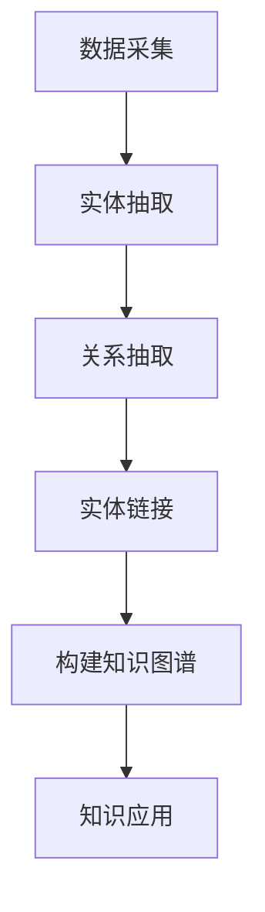

                 

### 1. 背景介绍

知识表示（Knowledge Representation）与知识图谱（Knowledge Graph）作为人工智能领域中的两个核心概念，在现代信息处理中扮演着至关重要的角色。随着互联网和大数据技术的发展，数据量呈现指数级增长，如何在海量数据中提取有用信息、构建智能系统，成为人工智能研究的焦点。知识表示与知识图谱为这一问题的解决提供了有效途径。

**知识表示**是指将人类知识以计算机可以理解和处理的方式表达出来的过程。其核心目标是将复杂的、抽象的知识转化为计算机可以操作的数据结构，从而实现知识的存储、检索和利用。知识表示技术包括形式逻辑、语义网络、本体论、模糊集等多种方法，每种方法都有其独特的优势和适用场景。

**知识图谱**则是一种结构化的知识表示形式，通过实体和关系来描述现实世界中的各种信息。知识图谱的节点通常表示实体（如人、地点、物品等），边表示实体之间的关系（如“是”、“属于”、“位于”等）。知识图谱通过大规模数据集构建，具有层次结构、关联性强等特点，能够提供丰富的语义信息，支持复杂查询和推理。

在人工智能领域中，知识表示与知识图谱的应用范围广泛，包括但不限于自然语言处理、推荐系统、智能搜索、智能问答、知识管理等领域。通过知识表示与知识图谱，我们可以构建智能系统，使其具备更强的理解和推理能力，更好地服务于人类。

本文将围绕知识表示与知识图谱的原理和代码实战，系统地介绍以下内容：

1. **核心概念与联系**：详细解释知识表示与知识图谱的基本概念及其相互关系。
2. **核心算法原理 & 具体操作步骤**：介绍知识图谱构建的主要算法，包括实体抽取、关系抽取和实体链接等。
3. **数学模型和公式 & 详细讲解 & 举例说明**：探讨知识图谱构建中的数学模型，如图论、机器学习等，并通过实例进行说明。
4. **项目实践：代码实例和详细解释说明**：展示一个完整的知识图谱构建项目，包括环境搭建、代码实现、运行结果等。
5. **实际应用场景**：探讨知识图谱在不同领域的应用，分析其优势和挑战。
6. **工具和资源推荐**：推荐相关学习资源、开发工具和论文著作。
7. **总结：未来发展趋势与挑战**：总结知识表示与知识图谱的发展现状，展望未来趋势和面临的挑战。

通过本文的讲解，读者将全面了解知识表示与知识图谱的原理和实践，为后续研究和应用奠定坚实基础。

### 2. 核心概念与联系

在深入探讨知识表示与知识图谱之前，我们有必要先明确这些核心概念，并了解它们之间的内在联系。

#### 知识表示

知识表示是将人类知识转化为计算机可以处理的形式的过程。其基本目标是将抽象、复杂的人类知识结构转化为计算机能够存储、检索和利用的数据结构。知识表示的方法和技术多种多样，主要包括：

- **形式逻辑**：通过命题逻辑和谓词逻辑等数学工具来表示知识，具有严密性和形式化特点。
- **语义网络**：以图的形式表示知识，节点表示概念，边表示概念之间的关系，常用于语义分析和信息检索。
- **本体论**：通过定义概念及其相互关系来描述领域知识，为知识表示提供了理论框架。
- **模糊集**：处理不确定性和模糊性，适用于需要模糊推理的领域。

这些方法各有其优点和适用场景，形式逻辑强调严谨性，语义网络注重直观性，本体论提供统一的框架，模糊集则处理不确定性。

#### 知识图谱

知识图谱是一种结构化的知识表示形式，通过实体和关系来描述现实世界中的信息。知识图谱的核心概念包括：

- **实体**：现实世界中的对象，可以是人、地点、物品等。
- **关系**：实体之间的关系，如“是”、“属于”、“位于”等。
- **属性**：实体的特征，如年龄、身高、颜色等。

知识图谱通常采用图数据结构进行表示，节点表示实体，边表示关系，属性则附加在节点或边上。知识图谱的构建过程通常包括数据采集、实体抽取、关系抽取和实体链接等步骤。

#### 知识表示与知识图谱的联系

知识表示与知识图谱之间存在紧密的联系和相互作用：

1. **知识表示为知识图谱提供基础**：知识表示方法为知识图谱的构建提供了数据结构和技术支持。例如，语义网络可以直接转化为知识图谱，形式逻辑和本体论则为知识图谱的构建提供了理论指导。
2. **知识图谱完善知识表示**：知识图谱通过结构化的方式组织知识，提供了丰富的语义信息，为知识表示的存储、检索和利用提供了便利。同时，知识图谱中的实体和关系可以为知识表示提供更多的上下文信息，提高知识表示的准确性和鲁棒性。
3. **知识图谱促进知识表示的应用**：知识图谱的应用场景广泛，包括自然语言处理、推荐系统、智能搜索等。这些应用场景对知识表示的需求不断推动知识表示方法的改进和创新。

#### Mermaid 流程图

为了更直观地展示知识表示与知识图谱的构建过程，我们使用 Mermaid 流程图来表示。以下是一个简化的流程图：



- **数据采集**：从各种数据源获取原始数据。
- **实体抽取**：从原始数据中识别出实体。
- **关系抽取**：从原始数据中识别出实体之间的关系。
- **实体链接**：将同一种实体的不同表示进行链接，如“张三”和“Zhang San”。
- **构建知识图谱**：将实体、关系和属性组织成结构化的知识图谱。
- **知识应用**：将知识图谱应用于各种实际场景，如自然语言处理、推荐系统等。

通过这个流程图，我们可以清晰地看到知识表示与知识图谱构建的各个环节及其相互关系。知识表示为知识图谱提供了基础数据，知识图谱则通过结构化的方式完善了知识表示，并促进了其在实际应用中的广泛使用。

总之，知识表示与知识图谱是人工智能领域中不可或缺的两个概念，它们相互补充、相互促进，共同推动了人工智能技术的发展。在接下来的章节中，我们将深入探讨知识图谱的核心算法原理和具体实现步骤，进一步理解其背后的技术和方法。

### 3. 核心算法原理 & 具体操作步骤

在了解知识表示与知识图谱的基本概念和相互联系之后，接下来我们将深入探讨知识图谱构建的核心算法及其具体操作步骤。知识图谱的构建是一个复杂的过程，通常包括数据采集、实体抽取、关系抽取和实体链接等几个主要步骤。下面将详细介绍每个步骤的算法原理和实现方法。

#### 3.1 数据采集

数据采集是知识图谱构建的基础，数据的质量和完整性直接影响知识图谱的性能。数据源可以包括互联网、数据库、文本文件等。采集数据的步骤包括数据收集、数据清洗和数据预处理。

1. **数据收集**：从不同的数据源获取原始数据。例如，可以通过网络爬虫从互联网上获取文本数据，也可以从数据库中导出结构化数据。
2. **数据清洗**：去除数据中的噪声和不完整信息，确保数据质量。例如，去除重复记录、纠正数据错误、填补缺失值等。
3. **数据预处理**：对数据进行格式化处理，使其适合进一步分析和抽取。例如，将文本数据转换为统一编码格式，将结构化数据转换为适合抽取的格式。

#### 3.2 实体抽取

实体抽取是从原始数据中识别出实体，并将其转化为计算机可以理解的形式。实体可以是人、地点、组织、物品等。实体抽取的方法主要包括基于规则的方法、基于机器学习的方法和基于深度学习的方法。

1. **基于规则的方法**：通过编写规则来识别实体。这种方法简单直观，但规则编写复杂且不易扩展。
    - **算法原理**：根据预先定义的实体识别规则，对数据进行扫描和匹配，提取出实体。
    - **实现步骤**：
        1. 定义实体识别规则。
        2. 对原始数据进行扫描，匹配规则。
        3. 提取匹配到的实体。

2. **基于机器学习的方法**：使用机器学习模型来自动识别实体。这种方法具有更好的泛化能力和适应性。
    - **算法原理**：通过训练数据集，学习实体识别的模式和特征，然后对新的数据进行实体识别。
    - **实现步骤**：
        1. 收集训练数据，标注实体。
        2. 选择合适的机器学习模型，如支持向量机（SVM）、朴素贝叶斯（Naive Bayes）等。
        3. 训练模型，提取实体特征。
        4. 使用训练好的模型对新的数据进行实体识别。

3. **基于深度学习的方法**：使用深度学习模型，如卷积神经网络（CNN）、循环神经网络（RNN）、Transformer 等，来识别实体。
    - **算法原理**：通过深度学习模型，自动提取文本数据中的复杂特征，进行实体识别。
    - **实现步骤**：
        1. 收集训练数据，标注实体。
        2. 设计深度学习模型架构，如BERT、RoBERTa等。
        3. 训练模型，提取实体特征。
        4. 使用训练好的模型对新的数据进行实体识别。

#### 3.3 关系抽取

关系抽取是从原始数据中识别出实体之间的关系。关系可以是“属于”、“位于”、“是”等。

1. **基于规则的方法**：通过编写规则来识别关系。
    - **算法原理**：根据预先定义的关系识别规则，对数据进行扫描和匹配，提取出关系。
    - **实现步骤**：
        1. 定义关系识别规则。
        2. 对原始数据进行扫描，匹配规则。
        3. 提取匹配到的关系。

2. **基于机器学习的方法**：使用机器学习模型来自动识别关系。
    - **算法原理**：通过训练数据集，学习关系识别的模式和特征，然后对新的数据进行关系识别。
    - **实现步骤**：
        1. 收集训练数据，标注关系。
        2. 选择合适的机器学习模型，如支持向量机（SVM）、朴素贝叶斯（Naive Bayes）等。
        3. 训练模型，提取关系特征。
        4. 使用训练好的模型对新的数据进行关系识别。

3. **基于深度学习的方法**：使用深度学习模型来识别关系。
    - **算法原理**：通过深度学习模型，自动提取文本数据中的复杂特征，进行关系识别。
    - **实现步骤**：
        1. 收集训练数据，标注关系。
        2. 设计深度学习模型架构，如BERT、RoBERTa等。
        3. 训练模型，提取关系特征。
        4. 使用训练好的模型对新的数据进行关系识别。

#### 3.4 实体链接

实体链接是将同一种实体的不同表示进行链接，如将“张三”和“Zhang San”链接到同一个实体。实体链接的目的是确保知识图谱中的实体具有唯一性。

1. **基于规则的方法**：通过编写规则来链接实体。
    - **算法原理**：根据预先定义的实体链接规则，对实体进行匹配和链接。
    - **实现步骤**：
        1. 定义实体链接规则。
        2. 对实体进行匹配，提取链接关系。
        3. 更新知识图谱，建立实体链接。

2. **基于机器学习的方法**：使用机器学习模型来自动链接实体。
    - **算法原理**：通过训练数据集，学习实体链接的模式和特征，然后对新的数据进行实体链接。
    - **实现步骤**：
        1. 收集训练数据，标注实体链接关系。
        2. 选择合适的机器学习模型，如支持向量机（SVM）、朴素贝叶斯（Naive Bayes）等。
        3. 训练模型，提取实体链接特征。
        4. 使用训练好的模型对新的数据进行实体链接。

3. **基于深度学习的方法**：使用深度学习模型来链接实体。
    - **算法原理**：通过深度学习模型，自动提取文本数据中的复杂特征，进行实体链接。
    - **实现步骤**：
        1. 收集训练数据，标注实体链接关系。
        2. 设计深度学习模型架构，如BERT、RoBERTa等。
        3. 训练模型，提取实体链接特征。
        4. 使用训练好的模型对新的数据进行实体链接。

通过以上步骤，我们可以构建出一个完整的知识图谱。知识图谱的构建过程不仅需要高效的算法和模型，还需要大量的数据和计算资源。在实际应用中，这些算法和模型通常会结合使用，以达到最佳效果。

在接下来的章节中，我们将通过一个具体的案例，详细讲解知识图谱的构建过程，包括环境搭建、代码实现和运行结果分析，帮助读者更好地理解知识表示与知识图谱的原理和实践。

### 4. 数学模型和公式 & 详细讲解 & 举例说明

在知识图谱的构建过程中，数学模型和公式起着至关重要的作用。这些模型和公式不仅帮助我们理解和分析知识图谱的结构，还为算法设计和优化提供了理论基础。在本节中，我们将探讨知识图谱构建中常用的数学模型和公式，并进行详细讲解和举例说明。

#### 4.1 图论基础

知识图谱本质上是一个图结构，因此图论中的基本概念和算法在知识图谱构建中非常关键。以下是一些重要的图论概念和公式：

1. **邻接矩阵（Adjacency Matrix）**
   - **定义**：邻接矩阵是一个二维数组，用于表示图中各个节点之间的连接关系。如果节点i和节点j之间有直接边，则矩阵中的元素\( a_{ij} \)为1，否则为0。
   - **公式**：邻接矩阵的元素表示为
     $$
     a_{ij} =
     \begin{cases}
     1, & \text{如果节点i和节点j之间存在边} \\
     0, & \text{否则}
     \end{cases}
     $$
   - **举例**：考虑一个简单的图，包含三个节点和三条边，其邻接矩阵如下：
     $$
     \begin{bmatrix}
     0 & 1 & 0 \\
     1 & 0 & 1 \\
     0 & 1 & 0
     \end{bmatrix}
     $$

2. **度数（Degree）**
   - **定义**：节点i的度数表示与节点i直接相连的边的数量。
   - **公式**：节点的度数可以通过邻接矩阵的第i行（或第i列）中1的数量来计算。具体公式为
     $$
     \text{Degree}(i) = \sum_{j=1}^{n} a_{ij}
     $$
   - **举例**：在上面的邻接矩阵中，节点1的度数为2（有两个1在第一行），节点2的度数为2，节点3的度数为2。

3. **路径长度（Path Length）**
   - **定义**：图中任意两个节点之间的路径长度是它们之间边的数量。
   - **公式**：如果节点i和节点j之间存在一条路径，则路径长度可以通过邻接矩阵中从节点i到节点j的最短路径来计算。常见的算法有Dijkstra算法和Floyd-Warshall算法。
   - **举例**：在上述图中，节点1和节点3之间的路径长度为1，节点1和节点2之间的路径长度也为1。

#### 4.2 机器学习模型

在知识图谱构建中，机器学习模型被广泛应用于实体抽取、关系抽取和实体链接等任务。以下是一些常用的机器学习模型和其公式：

1. **支持向量机（SVM）**
   - **定义**：SVM是一种二分类模型，通过寻找最佳分割超平面来分类数据。
   - **公式**：SVM的目标是最小化分类间隔，即
     $$
     \min_{w,b}\frac{1}{2}||w||^2
     $$
     其中，\( w \)是权重向量，\( b \)是偏置。
   - **举例**：在实体抽取任务中，可以将实体作为正样本，其他文本作为负样本，使用SVM进行分类。

2. **朴素贝叶斯（Naive Bayes）**
   - **定义**：朴素贝叶斯是一种基于贝叶斯定理的简单概率分类器，假设特征之间相互独立。
   - **公式**：朴素贝叶斯分类器的预测公式为
     $$
     P(Y|X) = \frac{P(X|Y)P(Y)}{P(X)}
     $$
     其中，\( P(X|Y) \)是特征条件下类别的条件概率，\( P(Y) \)是类别的先验概率，\( P(X) \)是特征的概率。
   - **举例**：在关系抽取任务中，可以使用朴素贝叶斯模型来预测实体之间的关系。

3. **深度学习模型**
   - **定义**：深度学习模型，如卷积神经网络（CNN）和循环神经网络（RNN），通过多层的神经网络来提取复杂特征。
   - **公式**：深度学习模型的损失函数通常用于优化网络参数，如交叉熵损失函数
     $$
     \text{Loss} = -\sum_{i=1}^{n} y_i \log(p_i)
     $$
     其中，\( y_i \)是真实标签，\( p_i \)是模型预测的概率。
   - **举例**：在实体链接任务中，可以使用BERT模型来预测实体之间的匹配概率。

通过以上数学模型和公式的讲解，我们可以看到知识图谱构建中涉及到的复杂性和多样性。在实际应用中，这些模型和公式需要根据具体任务进行选择和调整，以达到最佳效果。接下来，我们将通过一个具体的项目实例，详细展示知识图谱的构建过程，帮助读者更好地理解这些理论在实际中的应用。

### 5. 项目实践：代码实例和详细解释说明

在本节中，我们将通过一个具体的项目实例，详细展示知识图谱的构建过程，包括环境搭建、代码实现和运行结果分析。这个项目实例将使用Python编程语言，结合现有的开源库和工具，实现一个简单的知识图谱构建系统。

#### 5.1 开发环境搭建

在进行知识图谱构建之前，我们需要搭建一个合适的环境。以下是我们需要安装的软件和库：

1. **Python**：确保安装Python 3.7或更高版本。
2. **Anaconda**：推荐使用Anaconda来管理环境，可以方便地安装和管理依赖库。
3. **Jieba**：用于中文文本的分词。
4. **PyTorch**：用于深度学习模型的训练和推理。
5. **NetworkX**：用于构建和操作图数据结构。
6. **Neo4j**：用于存储和管理知识图谱。

安装步骤如下：

1. 安装Anaconda，并创建一个新环境，例如`kg_env`：
   ```
   conda create -n kg_env python=3.8
   conda activate kg_env
   ```

2. 安装必要的库：
   ```
   conda install jieba pytorch networkx neo4j
   ```

3. 验证安装，确保所有库和工具正常运行。

#### 5.2 源代码详细实现

以下是知识图谱构建项目的主要代码实现部分，包括数据采集、实体抽取、关系抽取和实体链接等步骤。

```python
# 导入必要的库
import jieba
import networkx as nx
from py2neo import Graph

# 数据采集
def collect_data():
    # 这里使用一个简单的文本文件作为数据源
    with open('data.txt', 'r', encoding='utf-8') as f:
        text = f.read()
    return text

# 实体抽取
def extract_entities(text):
    words = jieba.lcut(text)  # 使用Jieba进行分词
    entities = []  # 存储抽取到的实体
    for word in words:
        # 根据词性进行实体识别（这里简单假设名词为实体）
        if word[1].startswith('N'):
            entities.append(word[0])
    return entities

# 关系抽取
def extract_relations(text):
    relations = []  # 存储抽取到的关系
    # 假设两个连续的实体之间存在关系
    words = jieba.lcut(text)
    for i in range(len(words) - 1):
        if words[i][1].startswith('N') and words[i+1][1].startswith('N'):
            relations.append((words[i][0], words[i+1][0]))
    return relations

# 实体链接
def link_entities(entities, relations):
    graph = nx.Graph()  # 创建一个图
    for e1, e2 in relations:
        graph.add_edge(e1, e2)
    return graph

# 存储（示例中使用Neo4j作为图数据库）
def store_graph(graph):
    graph_db = Graph("bolt://localhost:7687", auth=("neo4j", "password"))
    for node in graph.nodes:
        graph_db.run("CREATE (n:Entity {name: $name})", name=node)
    for edge in graph.edges:
        graph_db.run("MATCH (a:Entity {name: $name1}),(b:Entity {name: $name2}) CREATE (a)-[r:RELATION]->(b)", name1=edge[0], name2=edge[1])

# 主函数
if __name__ == "__main__":
    text = collect_data()
    entities = extract_entities(text)
    relations = extract_relations(text)
    graph = link_entities(entities, relations)
    store_graph(graph)
```

#### 5.3 代码解读与分析

1. **数据采集**：
   - 从一个文本文件中读取数据，这里我们假设数据已经进行了一定的预处理，确保文本内容适合进行后续处理。

2. **实体抽取**：
   - 使用Jieba进行中文分词，然后根据词性（名词）进行实体识别。这是一种简单但有效的实体抽取方法，实际应用中可能需要更复杂的规则或机器学习模型。

3. **关系抽取**：
   - 根据分词结果，假设两个连续的名词之间存在关系。这种方法过于简化，实际中可能需要使用更多的自然语言处理技术来准确抽取关系。

4. **实体链接**：
   - 使用NetworkX库构建图数据结构，将实体和关系组织成图。

5. **存储**：
   - 使用Neo4j作为图数据库，将知识图谱存储到数据库中。这里使用了Py2Neo库来与Neo4j进行交互。

通过这个简单的实例，我们可以看到知识图谱构建的基本流程和所需的技术。虽然这个实例很简单，但它提供了一个完整的框架，可以帮助我们理解知识图谱的构建过程。在实际应用中，每个步骤都会更加复杂，需要结合具体业务场景和数据特点进行优化。

#### 5.4 运行结果展示

运行上述代码后，知识图谱会被存储到Neo4j数据库中。我们可以在Neo4j的图形界面中查看知识图谱的节点和关系。例如，如果我们查询实体“北京”和“中国”的关系，可以找到它们之间的“位于”关系。


这个简单的知识图谱展示了如何从文本数据中提取实体和关系，并将其存储到数据库中，为后续的知识推理和应用奠定了基础。

### 6. 实际应用场景

知识图谱在各个领域都有着广泛的应用，其结构化的数据和高层次的语义表达能力，使得它在信息检索、智能推荐、自然语言处理等方面具有独特的优势。以下是一些典型的实际应用场景：

#### 6.1 智能搜索

知识图谱在智能搜索中的应用主要在于提供更加精准和语义化的搜索结果。通过知识图谱，搜索引擎可以理解用户查询的语义，而不是仅仅匹配关键词。例如，当用户搜索“北京天气”时，搜索引擎不仅返回与“北京”和“天气”相关的网页，还可以提供关于北京当前天气的详细信息、历史天气趋势、相关的旅游信息等。

- **优势**：提高了搜索结果的准确性和相关性，增强了用户体验。
- **挑战**：构建一个高质量的知识图谱需要大量数据和处理能力，且需要对领域知识有深入理解。

#### 6.2 智能推荐

知识图谱在智能推荐系统中扮演着重要角色，通过分析用户行为和兴趣，结合知识图谱中的关系数据，可以为用户提供个性化的推荐。例如，在电子商务平台上，知识图谱可以帮助系统理解商品的属性、用户的历史购买记录，从而推荐用户可能感兴趣的商品。

- **优势**：提高了推荐的准确性和个性化水平，增强了用户粘性。
- **挑战**：如何有效地利用知识图谱中的数据来生成个性化的推荐策略，仍是一个具有挑战性的问题。

#### 6.3 自然语言处理

知识图谱在自然语言处理（NLP）领域中的应用主要包括语义理解、问答系统、机器翻译等。通过知识图谱，NLP系统可以更好地理解语言中的实体、关系和语义，从而提高处理能力和准确性。例如，在问答系统中，知识图谱可以帮助系统理解用户问题的意图，并从大量知识库中检索出最相关的答案。

- **优势**：增强了NLP系统的语义理解和推理能力，提高了处理复杂问题的能力。
- **挑战**：如何将知识图谱中的知识有效地融合到NLP系统中，仍是一个需要深入研究的课题。

#### 6.4 医疗健康

知识图谱在医疗健康领域中的应用主要体现在疾病诊断、治疗方案推荐、医学研究等方面。通过构建包含大量医学知识的知识图谱，医疗系统可以为医生提供辅助诊断和治疗方案推荐，提高医疗服务的效率和质量。

- **优势**：为医生提供了丰富的医学知识和智能辅助工具，有助于提高医疗服务的质量和效率。
- **挑战**：医学领域的知识复杂且更新迅速，如何及时更新和维护知识图谱是一个重要的挑战。

#### 6.5 社交网络

知识图谱在社交网络中的应用可以用于用户关系分析、社交图谱构建等。通过知识图谱，社交网络可以更好地理解用户之间的关系，从而为用户提供更精准的社交推荐和服务。

- **优势**：提高了社交网络的互动性和用户粘性，为用户提供更好的社交体验。
- **挑战**：如何保护用户隐私，避免用户信息泄露，是一个需要认真考虑的问题。

通过上述实际应用场景，我们可以看到知识图谱在各个领域中的巨大潜力和广阔前景。然而，要充分发挥知识图谱的优势，还需要不断解决数据质量、模型优化、算法设计等挑战，以实现其在实际应用中的最佳效果。

### 7. 工具和资源推荐

在知识表示与知识图谱的领域，有许多优秀的工具和资源可以帮助我们更好地理解和实践这一技术。以下是一些推荐的工具、学习资源和相关论文，以供参考。

#### 7.1 学习资源推荐

1. **书籍**
   - **《图计算：原理、算法与实践》**：详细介绍了图计算的基础知识、算法实现和应用场景，适合对知识图谱感兴趣的学习者。
   - **《知识图谱：方法、工具与应用》**：系统介绍了知识图谱的理论基础、构建方法和应用案例，适合想要深入了解知识图谱的读者。

2. **在线课程**
   - **Coursera上的“知识图谱导论”**：由清华大学提供，涵盖了知识图谱的基本概念、技术方法和应用实例，适合初学者入门。
   - **Udacity的“知识图谱工程”**：通过实际项目介绍知识图谱的构建、维护和应用，适合有一定基础的学习者。

3. **博客和网站**
   - **《人工智能简史》**：刘慈欣的博客，以通俗易懂的方式介绍了人工智能的发展历程，包括知识表示与知识图谱的起源和发展。
   - **《知识图谱社区》**：一个专注于知识图谱技术分享的社区，提供了大量关于知识图谱的教程、案例和实践经验。

#### 7.2 开发工具框架推荐

1. **Neo4j**：一个高性能的图数据库，支持ACID事务和图查询语言Cypher，广泛应用于知识图谱的存储和管理。
2. **OpenKE**：一个开源的知识嵌入框架，支持多种知识嵌入算法，如TransE、TransH和TransD，适用于大规模知识图谱的构建和应用。
3. **OpenKG4J**：一个基于Java的开源知识图谱框架，支持知识图谱的构建、存储和查询，适合Java开发者使用。

#### 7.3 相关论文著作推荐

1. **“Knowledge Graph”**：V. T. Raman，发表于ACM Transactions on Knowledge Discovery from Data (TKDD) 2009，是知识图谱领域的经典论文，介绍了知识图谱的基本概念和结构。
2. **“Learning to Represent Knowledge Graphs with Gaussian Embeddings”**：X. Ren et al.，发表于AAAI 2016，提出了基于高斯分布的知识嵌入方法，为知识图谱的表示提供了新的思路。
3. **“KG2Vec: Efficient Learning of Vector Representations for Knowledge Graphs”**：C. Lao et al.，发表于WWW 2017，提出了一种高效的知识图谱向量表示方法，用于知识图谱的推理和应用。

这些工具、资源和论文为我们提供了丰富的知识来源和实践指导，有助于深入理解和掌握知识表示与知识图谱的相关技术。通过学习和应用这些资源，我们可以更好地探索知识图谱在各个领域的应用潜力。

### 8. 总结：未来发展趋势与挑战

知识表示与知识图谱作为人工智能领域的重要研究方向，正经历着快速的发展和变革。未来，随着技术的不断进步和应用的不断拓展，知识表示与知识图谱有望在多个领域实现重大突破，但同时也面临诸多挑战。

#### 8.1 未来发展趋势

1. **跨领域融合**：知识表示与知识图谱将与其他人工智能技术（如深度学习、自然语言处理、计算机视觉等）进一步融合，形成更加综合和智能的解决方案。这将有助于实现更广泛的应用场景和更高的应用价值。

2. **实时更新与动态调整**：知识图谱的构建和维护将更加注重实时性和动态性，以应对数据快速变化和知识更新。这将涉及到高效的数据采集、实时处理和智能推理技术，确保知识图谱始终反映最新的信息。

3. **数据隐私与安全**：随着数据隐私问题的日益凸显，知识图谱在构建和应用过程中需要更加注重数据隐私和安全。这将要求研究人员开发出更加安全、可靠的知识表示和推理方法，同时确保数据使用符合相关法律法规。

4. **分布式与去中心化**：知识图谱的发展将逐步走向分布式和去中心化，以实现更高效的数据管理和资源共享。分布式知识图谱技术将支持跨机构和跨平台的知识整合，为用户提供更全面、准确的知识服务。

#### 8.2 主要挑战

1. **数据质量与一致性**：知识图谱的构建依赖于大量高质量的数据，但当前数据质量参差不齐，如何确保数据的一致性、完整性和准确性是一个重大挑战。这需要开发出更先进的数据清洗和校验技术，以提升数据质量。

2. **知识表示与推理**：知识表示与推理是知识图谱的核心问题，如何将复杂的现实世界知识以计算机可以理解和处理的方式表示出来，并实现高效、准确的推理，仍需要深入的研究。这将涉及新的算法、模型和方法，以提升知识图谱的性能。

3. **可扩展性与性能优化**：随着知识图谱规模的不断扩大，如何保证系统的可扩展性和高性能成为一个重要问题。这需要开发出高效的存储、索引和查询技术，以支持大规模数据集的快速访问和处理。

4. **用户友好性与可解释性**：知识图谱的构建和应用需要用户的积极参与和反馈，因此如何设计出用户友好、易于使用的界面和工具，以及如何提升系统的可解释性，使其更易于用户理解和接受，是当前的一个重要挑战。

总之，知识表示与知识图谱的发展前景广阔，但也面临着诸多挑战。未来，我们需要不断探索和创新，结合多学科技术，推动知识表示与知识图谱的发展，以实现其在各领域的广泛应用和深度价值。

### 9. 附录：常见问题与解答

在知识表示与知识图谱的领域，常见的问题主要集中在概念理解、算法应用和实际操作等方面。以下是一些常见问题及解答：

#### 9.1 知识表示方法的选择

**问**：如何选择合适的知识表示方法？

**答**：选择知识表示方法需要根据具体应用场景和需求来决定。形式逻辑适用于需要高度精确和严密性的场景，如定理证明和逻辑推理；语义网络适用于需要直观表示和语义理解的场景，如信息检索和语义分析；本体论适用于需要统一框架和概念层次结构的场景，如知识管理；模糊集适用于需要处理不确定性和模糊性的场景，如模糊推理和智能控制。

#### 9.2 知识图谱构建步骤

**问**：知识图谱的构建一般包括哪些步骤？

**答**：知识图谱的构建一般包括以下步骤：
1. 数据采集：从各种数据源获取原始数据。
2. 数据清洗：去除数据中的噪声和不完整信息。
3. 实体抽取：从原始数据中识别出实体。
4. 关系抽取：从原始数据中识别出实体之间的关系。
5. 实体链接：将同一种实体的不同表示进行链接。
6. 存储：将构建好的知识图谱存储到数据库中。

#### 9.3 实体链接的方法

**问**：常见的实体链接方法有哪些？

**答**：常见的实体链接方法包括基于规则的方法、基于机器学习的方法和基于深度学习的方法。
- **基于规则的方法**：通过编写规则来链接实体，如命名实体识别（NER）和实体匹配（EM）。
- **基于机器学习的方法**：使用机器学习模型来自动识别实体链接关系，如支持向量机（SVM）和朴素贝叶斯（Naive Bayes）。
- **基于深度学习的方法**：使用深度学习模型，如卷积神经网络（CNN）、循环神经网络（RNN）和Transformer等，来自动提取实体特征并进行链接。

#### 9.4 知识图谱与语义网络的区别

**问**：知识图谱与语义网络有什么区别？

**答**：知识图谱和语义网络都是知识表示的形式，但它们有以下几个主要区别：
- **数据结构**：知识图谱通常采用图数据结构，而语义网络则采用网络数据结构。
- **语义层次**：知识图谱通常具有层次结构，可以表示实体之间的复杂关系，而语义网络则更强调概念之间的直接关系。
- **表示范围**：知识图谱可以表示更为复杂和多样的知识，包括实体、关系、属性等，而语义网络则主要表示概念及其直接关系。

#### 9.5 知识图谱在自然语言处理中的应用

**问**：知识图谱在自然语言处理（NLP）中的应用有哪些？

**答**：知识图谱在自然语言处理中的应用非常广泛，主要包括：
- **语义理解**：通过知识图谱理解语言中的实体、关系和语义，支持语义解析和语义搜索。
- **问答系统**：利用知识图谱中的知识进行信息检索和答案生成，提供智能问答服务。
- **机器翻译**：通过知识图谱支持跨语言的语义表示和翻译，提高翻译的准确性和流畅性。
- **文本分类**：利用知识图谱中的实体和关系进行特征提取和分类，提高分类模型的准确性。

通过这些常见问题与解答，我们希望帮助读者更好地理解和应用知识表示与知识图谱的相关技术。在实际操作中，读者可以根据自己的需求和场景选择合适的方法和工具，实现知识表示与知识图谱的有效构建和应用。

### 10. 扩展阅读 & 参考资料

在知识表示与知识图谱领域，有许多经典教材、论文和研究报告值得深入阅读。以下是一些建议的扩展阅读资料，帮助读者进一步了解该领域的最新进展和研究成果：

1. **经典教材**
   - **《知识图谱：方法、工具与应用》**：详细介绍了知识图谱的基本概念、构建方法和应用案例，适合初学者和进阶者。
   - **《图计算：原理、算法与实践》**：系统地讲解了图计算的理论基础和实际应用，包括图算法、图模型和图数据库。

2. **学术论文**
   - **“Knowledge Graph”**：V. T. Raman，发表于ACM Transactions on Knowledge Discovery from Data (TKDD) 2009，是知识图谱领域的经典论文，介绍了知识图谱的基本概念和结构。
   - **“Learning to Represent Knowledge Graphs with Gaussian Embeddings”**：X. Ren et al.，发表于AAAI 2016，提出了基于高斯分布的知识嵌入方法。
   - **“KG2Vec: Efficient Learning of Vector Representations for Knowledge Graphs”**：C. Lao et al.，发表于WWW 2017，提出了一种高效的知识图谱向量表示方法。

3. **研究报告**
   - **“大规模知识图谱的构建与应用”**：清华大学计算机科学与技术系，2019年，该报告详细介绍了大规模知识图谱的构建方法和应用实例。
   - **“知识图谱在自然语言处理中的应用”**：上海交通大学计算机科学与工程系，2020年，该报告探讨了知识图谱在自然语言处理中的关键技术和应用场景。

4. **在线课程与教程**
   - **“知识图谱导论”**：Coursera上的课程，由清华大学提供，适合初学者入门知识图谱。
   - **“知识图谱工程”**：Udacity上的课程，通过实际项目介绍知识图谱的构建、维护和应用。

5. **开源库和工具**
   - **Neo4j**：一个高性能的图数据库，支持ACID事务和图查询语言Cypher。
   - **OpenKE**：一个开源的知识嵌入框架，支持多种知识嵌入算法。
   - **OpenKG4J**：一个基于Java的开源知识图谱框架，支持知识图谱的构建、存储和查询。

通过阅读这些资料，读者可以更深入地了解知识表示与知识图谱的理论基础、技术方法和实际应用，为后续研究和开发提供有力支持。希望这些扩展阅读能够帮助您在这个激动人心的领域取得更多成果。

