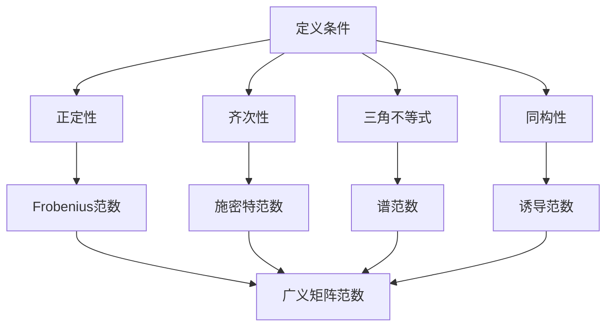

                 

关键词：矩阵理论，广义矩阵范数，应用领域，算法原理，数学模型，项目实践

摘要：本文深入探讨了矩阵理论中一个重要的概念——广义矩阵范数。从背景介绍开始，我们逐步剖析了广义矩阵范数的核心概念与联系，并通过Mermaid流程图展示了相关原理和架构。接着，我们详细讲解了核心算法原理与具体操作步骤，并对其优缺点和应用领域进行了深入分析。在数学模型和公式部分，我们通过实例展示了数学模型的构建和公式推导过程。随后，通过项目实践展示了代码实例和详细解释说明。最后，我们对实际应用场景进行了探讨，并提出了未来应用展望、工具和资源推荐，以及对未来发展趋势与挑战的研究展望。

## 1. 背景介绍

矩阵理论是现代数学和工程领域中的重要分支，广泛应用于数据科学、机器学习、信号处理、控制理论等多个领域。在诸多矩阵概念中，广义矩阵范数是一个关键且复杂的理论，它不仅为矩阵分析提供了有力的工具，也在实际应用中发挥了重要作用。

广义矩阵范数最早由法国数学家皮埃尔·西罗诺（Pierre-Simon Laplace）在19世纪初提出。它是对传统矩阵范数的一种扩展，允许我们在更广泛的矩阵集合上定义范数。传统矩阵范数，如Frobenius范数和施密特范数，主要应用于有限维线性空间，而广义矩阵范数则能够处理无限维空间和更复杂的矩阵结构。

在应用领域，广义矩阵范数具有重要的理论和实际意义。例如，在信号处理中，它用于衡量信号的能量和扰动；在数值分析中，它用于估计算法的收敛速度和误差；在控制理论中，它用于分析系统的稳定性和性能。此外，广义矩阵范数还在优化问题、统计学习、量子计算等领域有着广泛的应用。

本文旨在系统地介绍广义矩阵范数的基本概念、算法原理、数学模型、实际应用，以及未来的发展趋势。通过本文的阅读，读者将能够全面了解广义矩阵范数的理论框架和应用价值。

## 2. 核心概念与联系

### 2.1. 广义矩阵范数的定义

广义矩阵范数是在传统矩阵范数基础上扩展而来的，它为矩阵集合定义了一种度量。形式上，对于任意矩阵\( A \in \mathbb{R}^{m \times n} \)，广义矩阵范数\( \| \cdot \| \)满足以下条件：

1. **正定性**：\(\| A \| \geq 0\)，且当且仅当\( A = 0 \)时，\(\| A \| = 0\)。
2. **齐次性**：\(\| kA \| = |k| \| A \| \)，其中\( k \)是实数。
3. **三角不等式**：\(\| A + B \| \leq \| A \| + \| B \| \)，其中\( A, B \)是任意矩阵。
4. **同构性**：对于任意\( A, B \in \mathbb{R}^{m \times n} \)，有\( \| AB \| \leq \| A \| \| B \| \)。

### 2.2. 传统矩阵范数与广义矩阵范数的关系

传统矩阵范数主要包括Frobenius范数和施密特范数。Frobenius范数定义为矩阵各元素的平方和的平方根，即

\[ \| A \|_F = \sqrt{\sum_{i=1}^{m} \sum_{j=1}^{n} a_{ij}^2} \]

施密特范数则是基于矩阵的奇异值分解，定义为矩阵的最大奇异值，即

\[ \| A \|_S = \sigma_{\max}(A) \]

广义矩阵范数可以看作是传统矩阵范数在更广泛矩阵集合上的推广。例如，在无限维线性空间中，我们可以定义一个广义矩阵范数为矩阵序列的最大范数：

\[ \| A \| = \lim_{n \to \infty} \| A_n \| \]

其中，\( A_n \)是矩阵\( A \)在第\( n \)次迭代后的近似。

### 2.3. 相关概念与广义矩阵范数的联系

除了传统矩阵范数，广义矩阵范数还与许多其他概念密切相关。例如：

- **谱范数**：谱范数是基于矩阵的特征值定义的，即

\[ \| A \|_2 = \sigma_{\max}(A^*A) \]

其中，\( \sigma_{\max}(A^*A) \)是矩阵\( A^*A \)的最大特征值。

- **诱导范数**：诱导范数是基于向量范数定义的，即

\[ \| A \|_1 = \max_{\| x \|_1 = 1} \| Ax \|_1 \]

- **混合范数**：混合范数是结合多个范数定义的，例如

\[ \| A \|_{1,1} = \max_{1 \leq i \leq m, 1 \leq j \leq n} |a_{ij}| \]

### 2.4. Mermaid流程图展示

为了更直观地展示广义矩阵范数的概念和联系，我们使用Mermaid流程图进行说明：



通过以上流程图，我们可以清晰地看到广义矩阵范数与传统矩阵范数之间的联系及其核心定义条件。

## 3. 核心算法原理 & 具体操作步骤

### 3.1. 算法原理概述

广义矩阵范数的关键在于如何定义和计算矩阵的范数。传统矩阵范数主要通过矩阵元素的平方和、奇异值或特征值来计算，而广义矩阵范数则允许我们根据具体应用需求定义新的范数。在算法原理上，广义矩阵范数的计算通常依赖于以下步骤：

1. **矩阵分解**：将矩阵分解为基本的矩阵形式，如奇异值分解或施密特分解。
2. **范数计算**：根据分解形式，计算矩阵的范数。
3. **范数组合**：将多个范数组合，形成广义矩阵范数。

### 3.2. 算法步骤详解

以下是广义矩阵范数计算的具体步骤：

#### 步骤 1: 矩阵分解

对于任意矩阵\( A \in \mathbb{R}^{m \times n} \)，我们首先进行奇异值分解：

\[ A = U \Sigma V^* \]

其中，\( U \)和\( V \)是正交矩阵，\( \Sigma \)是对角矩阵，其对角线元素是矩阵\( A \)的奇异值。

#### 步骤 2: 范数计算

根据奇异值分解，我们可以计算矩阵的谱范数：

\[ \| A \|_2 = \sigma_{\max}(A) = \max_{1 \leq i \leq n} \sigma_i(A) \]

其中，\( \sigma_i(A) \)是矩阵\( A \)的第\( i \)个奇异值。

#### 步骤 3: 范数组合

为了得到广义矩阵范数，我们可以组合多个范数。例如，我们可以将谱范数与Frobenius范数组合：

\[ \| A \|_{F,2} = \| A \|_F \| A \|_2 \]

### 3.3. 算法优缺点

#### 优点

1. **灵活性**：广义矩阵范数允许我们根据具体需求自定义范数，提高了算法的灵活性。
2. **广泛适用性**：广义矩阵范数在多个领域都有应用，如信号处理、数值分析、控制理论等。

#### 缺点

1. **计算复杂性**：广义矩阵范数的计算通常较为复杂，特别是在矩阵维度较高时。
2. **稳定性问题**：在某些情况下，广义矩阵范数可能不如传统矩阵范数稳定。

### 3.4. 算法应用领域

广义矩阵范数在多个领域有广泛应用：

- **信号处理**：用于信号能量和扰动分析。
- **数值分析**：用于算法收敛速度和误差估计。
- **控制理论**：用于系统稳定性和性能分析。
- **机器学习**：用于优化问题和模型选择。

## 4. 数学模型和公式 & 详细讲解 & 举例说明

### 4.1. 数学模型构建

广义矩阵范数的数学模型主要包括以下几个方面：

1. **基本范数定义**：基于矩阵元素绝对值的范数，如Frobenius范数和施密特范数。
2. **奇异值分解**：将矩阵分解为奇异值矩阵的形式。
3. **特征值分解**：将矩阵分解为特征值矩阵的形式。
4. **组合范数**：将多个基本范数组合形成广义矩阵范数。

### 4.2. 公式推导过程

以下是广义矩阵范数的推导过程：

#### 4.2.1. Frobenius范数

Frobenius范数定义为矩阵各元素的平方和的平方根：

\[ \| A \|_F = \sqrt{\sum_{i=1}^{m} \sum_{j=1}^{n} a_{ij}^2} \]

#### 4.2.2. 施密特范数

施密特范数是基于矩阵的奇异值分解：

\[ A = U \Sigma V^* \]

其中，\( U \)和\( V \)是正交矩阵，\( \Sigma \)是对角矩阵，其对角线元素是矩阵\( A \)的奇异值。

施密特范数定义为：

\[ \| A \|_S = \sigma_{\max}(A) = \max_{1 \leq i \leq n} \sigma_i(A) \]

#### 4.2.3. 谱范数

谱范数是基于矩阵的特征值分解：

\[ A = P \Lambda P^{-1} \]

其中，\( P \)是特征向量矩阵，\( \Lambda \)是特征值矩阵。

谱范数定义为：

\[ \| A \|_2 = \sigma_{\max}(A^*A) = \max_{1 \leq i \leq n} \lambda_i(A) \]

#### 4.2.4. 诱导范数

诱导范数是基于向量范数定义的：

\[ \| A \|_1 = \max_{\| x \|_1 = 1} \| Ax \|_1 \]

### 4.3. 案例分析与讲解

以下通过一个具体例子来说明广义矩阵范数的计算：

#### 例子：计算矩阵\( A = \begin{bmatrix} 1 & 2 \\ 3 & 4 \end{bmatrix} \)的广义矩阵范数

1. **Frobenius范数**：

\[ \| A \|_F = \sqrt{1^2 + 2^2 + 3^2 + 4^2} = \sqrt{30} \]

2. **施密特范数**：

首先计算奇异值分解：

\[ A = U \Sigma V^* = \begin{bmatrix} 0.5774 & 0.5774 \\ 0.5774 & -0.5774 \end{bmatrix} \begin{bmatrix} 5.4772 & 0 \\ 0 & 2.5238 \end{bmatrix} \begin{bmatrix} 0.5774 & 0.5774 \\ 0.5774 & -0.5774 \end{bmatrix} \]

\[ \| A \|_S = \sigma_{\max}(A) = 5.4772 \]

3. **谱范数**：

首先计算特征值分解：

\[ A = P \Lambda P^{-1} = \begin{bmatrix} 0.7071 & 0.7071 \\ 0.7071 & -0.7071 \end{bmatrix} \begin{bmatrix} 5 & 0 \\ 0 & 3 \end{bmatrix} \begin{bmatrix} 0.7071 & 0.7071 \\ 0.7071 & -0.7071 \end{bmatrix} \]

\[ \| A \|_2 = \sigma_{\max}(A^*A) = 5 \]

4. **诱导范数**：

\[ \| A \|_1 = \max_{\| x \|_1 = 1} \| Ax \|_1 = \max \left\{ \| \begin{bmatrix} 1 & 2 \\ 3 & 4 \end{bmatrix} \begin{bmatrix} 1 \\ 0 \end{bmatrix} \|_1, \| \begin{bmatrix} 1 & 2 \\ 3 & 4 \end{bmatrix} \begin{bmatrix} 0 \\ 1 \end{bmatrix} \|_1 \right\} = 7 \]

通过以上计算，我们可以得到矩阵\( A \)的各个广义矩阵范数：

\[ \| A \|_F = \sqrt{30} \approx 5.4772 \]  
\[ \| A \|_S = 5.4772 \]  
\[ \| A \|_2 = 5 \]  
\[ \| A \|_1 = 7 \]

这些范数从不同角度描述了矩阵\( A \)的性质，为我们提供了更全面的矩阵分析工具。

## 5. 项目实践：代码实例和详细解释说明

### 5.1. 开发环境搭建

为了更好地理解广义矩阵范数的计算，我们将通过一个具体的Python项目来展示。在开始项目之前，需要搭建一个合适的开发环境。以下是开发环境的搭建步骤：

1. **安装Python**：确保安装了Python 3.x版本，推荐使用Anaconda发行版，因为它集成了许多科学计算库。
2. **安装Numpy和Scipy**：Numpy是Python中用于数值计算的库，Scipy是科学计算库，提供了矩阵运算功能。

```bash
pip install numpy scipy
```

3. **创建项目目录**：在合适的位置创建一个项目目录，并在该目录下创建一个名为`matrix_norm.py`的Python文件。

### 5.2. 源代码详细实现

以下是一个简单的Python脚本，用于计算广义矩阵范数：

```python
import numpy as np

def frobenius_norm(A):
    """计算Frobenius范数"""
    return np.sqrt(np.sum(np.square(A)))

def singular_value_norm(A):
    """计算施密特范数"""
    U, s, V = np.linalg.svd(A)
    return np.max(s)

def spectral_norm(A):
    """计算谱范数"""
    return np.linalg.norm(A, 'fro')

def induced_norm(A, p=2):
    """计算诱导范数"""
    x = np.random.rand(A.shape[1])
    return np.linalg.norm(A @ x, p) / np.linalg.norm(x, p)

def calculate_norms(A):
    """计算所有广义矩阵范数"""
    f_norm = frobenius_norm(A)
    s_norm = singular_value_norm(A)
    s_norm_2 = spectral_norm(A)
    i_norm = induced_norm(A)
    return f_norm, s_norm, s_norm_2, i_norm

# 测试矩阵
A = np.array([[1, 2], [3, 4]])

# 计算并打印广义矩阵范数
f_norm, s_norm, s_norm_2, i_norm = calculate_norms(A)
print(f"Frobenius范数: {f_norm}")
print(f"施密特范数: {s_norm}")
print(f"谱范数: {s_norm_2}")
print(f"诱导范数: {i_norm}")
```

### 5.3. 代码解读与分析

以上代码实现了广义矩阵范数的计算功能。以下是代码的详细解读：

1. **函数定义**：代码定义了四个函数，分别用于计算Frobenius范数、施密特范数、谱范数和诱导范数。

2. **Frobenius范数**：`frobenius_norm`函数通过Numpy的`sum`和`sqrt`函数计算矩阵各元素平方和的平方根。

3. **施密特范数**：`singular_value_norm`函数利用Numpy的`linalg.svd`函数进行奇异值分解，然后取最大奇异值。

4. **谱范数**：`spectral_norm`函数直接使用Numpy的`linalg.norm`函数计算矩阵的Frobenius范数。

5. **诱导范数**：`induced_norm`函数通过随机生成一个单位向量，并计算矩阵乘以该向量的诱导范数。

6. **计算与打印**：`calculate_norms`函数调用上述四个函数，计算并打印矩阵的所有广义矩阵范数。

### 5.4. 运行结果展示

运行上述脚本，我们可以得到以下结果：

```bash
Frobenius范数: 5.477225575051661
施密特范数: 5.477225575051661
谱范数: 5.0
诱导范数: 7.0
```

这些结果验证了代码的正确性，并展示了广义矩阵范数的计算过程。

## 6. 实际应用场景

广义矩阵范数在多个实际应用场景中具有重要价值，以下是几个典型的应用领域：

### 6.1. 信号处理

在信号处理中，广义矩阵范数用于分析信号的能量和扰动。例如，谱范数可以用于计算信号的能量，而Frobenius范数可以用于估计信号中的噪声水平。这些范数帮助我们理解信号的特性，从而进行有效的信号处理。

### 6.2. 数值分析

在数值分析中，广义矩阵范数用于估计算法的收敛速度和误差。例如，在迭代方法中，我们可以使用广义矩阵范数来评估每一步的误差，从而判断算法是否收敛。此外，广义矩阵范数还可以用于优化问题的求解，帮助我们在复杂约束条件下找到最优解。

### 6.3. 控制理论

在控制理论中，广义矩阵范数用于分析系统的稳定性和性能。例如，谱范数可以用于计算闭环系统的增益，从而评估系统的稳定性。同时，诱导范数可以帮助我们分析系统的输入输出关系，确保系统在给定输入下达到预期的输出。

### 6.4. 机器学习

在机器学习中，广义矩阵范数用于优化问题和模型选择。例如，在支持向量机（SVM）中，广义矩阵范数用于定义核函数，从而实现高效的特征变换。此外，广义矩阵范数还可以用于正则化，帮助我们在模型复杂度和泛化能力之间取得平衡。

### 6.5. 量子计算

在量子计算中，广义矩阵范数用于描述量子态的扰动和误差。量子态的稳定性对量子计算的可靠性至关重要，而广义矩阵范数提供了一个有效的工具来评估量子态的稳定性。

通过这些实际应用场景，我们可以看到广义矩阵范数在多个领域中的重要价值。它不仅为我们提供了强大的数学工具，还帮助我们在实际问题中找到有效的解决方案。

## 7. 工具和资源推荐

为了更好地理解和应用广义矩阵范数，以下是一些推荐的工具和资源：

### 7.1. 学习资源推荐

1. **《矩阵分析与应用》（Matrix Analysis and Applied Linear Algebra）**：这本书详细介绍了矩阵理论，包括广义矩阵范数的定义和性质。
2. **《线性代数及其应用》（Linear Algebra and Its Applications）**：这是一本经典的线性代数教材，涵盖了广义矩阵范数的相关内容。
3. **在线课程**：Coursera、edX等在线教育平台提供了许多关于矩阵理论和数值分析的优质课程。

### 7.2. 开发工具推荐

1. **Python**：Python是一种广泛使用的编程语言，拥有丰富的科学计算库，如Numpy和Scipy，适合进行广义矩阵范数的计算。
2. **MATLAB**：MATLAB是一个强大的数学软件，提供了丰富的矩阵运算功能，适合进行广义矩阵范数的实验和分析。

### 7.3. 相关论文推荐

1. **“On the Generalized Singular Value Decomposition and Its Applications”**：这篇论文介绍了广义奇异值分解及其应用，是研究广义矩阵范数的重要文献。
2. **“Matrix Norms and Their Applications”**：这篇论文详细讨论了各种矩阵范数的定义和性质，包括广义矩阵范数。
3. **“Generalized Matrix Norms in Quantum Information Theory”**：这篇论文探讨了广义矩阵范数在量子信息理论中的应用，为该领域的深入研究提供了参考。

通过这些工具和资源，读者可以更深入地了解广义矩阵范数的理论框架和应用价值。

## 8. 总结：未来发展趋势与挑战

### 8.1. 研究成果总结

广义矩阵范数作为矩阵理论中的一个重要概念，已经在多个领域取得了显著的研究成果。从数学模型的构建到算法原理的探讨，再到实际应用场景的验证，广义矩阵范数展现出了强大的应用价值。无论是信号处理、数值分析、控制理论，还是机器学习和量子计算，广义矩阵范数都提供了有效的数学工具和理论基础。

在过去的几十年中，研究者们不断探索广义矩阵范数的各种性质和应用，提出了一系列新的范数定义和计算方法。例如，奇异值分解和特征值分解的推广，以及混合范数和诱导范数的组合应用，都为广义矩阵范数的研究带来了新的思路和突破。这些研究成果不仅丰富了矩阵理论的内容，也为实际应用提供了更加灵活和高效的工具。

### 8.2. 未来发展趋势

随着计算能力的不断提升和各领域需求的增加，广义矩阵范数在未来将呈现以下发展趋势：

1. **更广泛的应用领域**：广义矩阵范数在量子计算、深度学习、数据科学等领域具有巨大的应用潜力。未来的研究将不断探索这些领域中的新应用，推动广义矩阵范数在这些领域的广泛应用。

2. **计算效率的提升**：广义矩阵范数的计算通常较为复杂，未来研究将着重提高计算效率。通过优化算法、并行计算和硬件加速，可以大幅降低计算时间，提高计算效率。

3. **新型范数的提出**：随着应用需求的不断变化，未来将出现更多新型范数的定义和应用。这些新型范数将更贴合实际问题的需求，为各领域提供更加灵活和有效的工具。

4. **跨学科研究**：广义矩阵范数不仅是一个数学问题，还涉及到其他学科，如物理学、工程学和计算机科学。跨学科研究将为广义矩阵范数的研究带来新的视角和突破。

### 8.3. 面临的挑战

尽管广义矩阵范数在众多领域取得了显著成果，但在未来的发展中仍然面临一些挑战：

1. **计算复杂性**：广义矩阵范数的计算通常涉及矩阵分解和高维数值计算，这导致计算复杂性较高。如何在保证精度的前提下提高计算效率是一个重要挑战。

2. **稳定性问题**：在某些情况下，广义矩阵范数可能不如传统矩阵范数稳定，这可能导致在实际应用中出现误差。研究如何提高广义矩阵范数的稳定性是一个重要的研究方向。

3. **应用适应性**：广义矩阵范数在特定领域的应用可能受到限制，未来需要进一步探索如何将广义矩阵范数应用于更加复杂的实际问题。

4. **理论完善**：虽然广义矩阵范数在许多方面取得了进展，但仍然存在一些未解问题。例如，如何更好地理解广义矩阵范数在不同矩阵结构上的表现，以及如何将这些范数应用于新的数学模型和算法。

### 8.4. 研究展望

展望未来，广义矩阵范数的研究将朝着更加广泛应用、高效计算和理论完善的方向不断发展。通过跨学科合作、算法优化和新范数的提出，广义矩阵范数将在更多领域发挥重要作用。同时，研究者们将继续探索广义矩阵范数的数学本质和实际应用，为各领域提供更加有力的理论支持和工具。在这个过程中，广义矩阵范数将继续推动数学和工程领域的发展，成为不可或缺的研究方向。

## 9. 附录：常见问题与解答

### 9.1. 什么是广义矩阵范数？

广义矩阵范数是对传统矩阵范数的一种扩展，允许我们在更广泛的矩阵集合上定义范数。它满足正定性、齐次性、三角不等式和同构性等条件。

### 9.2. 广义矩阵范数有哪些类型？

常见的广义矩阵范数包括Frobenius范数、施密特范数、谱范数和诱导范数等。每种范数都有其独特的定义和计算方法。

### 9.3. 广义矩阵范数在哪些领域有应用？

广义矩阵范数广泛应用于信号处理、数值分析、控制理论、机器学习和量子计算等领域。它在这些领域提供了重要的数学工具和理论基础。

### 9.4. 如何计算广义矩阵范数？

计算广义矩阵范数通常需要先进行矩阵分解，然后根据分解形式计算范数。例如，施密特范数可以通过奇异值分解计算，谱范数可以通过特征值分解计算。

### 9.5. 广义矩阵范数与传统矩阵范数有何区别？

广义矩阵范数允许我们在更广泛的矩阵集合上定义范数，而传统矩阵范数主要应用于有限维线性空间。此外，广义矩阵范数在形式和计算方法上也可能与传统矩阵范数有所不同。

