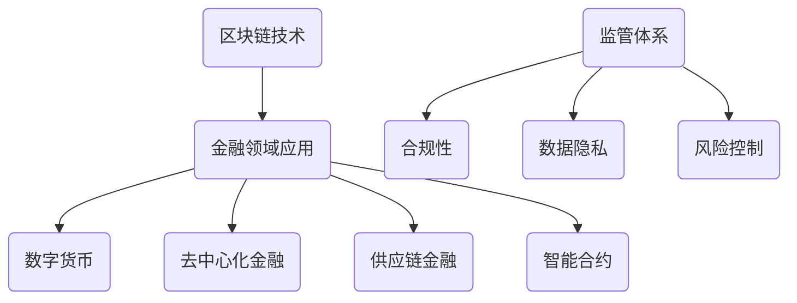

                 

### 文章标题

**硅谷区块链金融创新的监管挑战**

> **关键词**：区块链，金融创新，监管挑战，硅谷，合规性，风险控制
> 
> **摘要**：本文探讨了硅谷区块链金融创新的监管挑战。通过分析区块链技术的本质和其在金融领域的应用，深入探讨了金融监管的必要性，并从合规性、风险控制、数据隐私等多个维度分析了监管面临的挑战。文章最后提出了可能的解决方案和未来发展趋势。

---

### 1. 背景介绍

#### 1.1 区块链技术的发展背景

区块链技术起源于2008年，当时一位化名为中本聪（Satoshi Nakamoto）的人发布了比特币白皮书。比特币作为一种去中心化的数字货币，利用区块链技术解决了传统金融系统中的一些痛点，如跨境支付的低成本和安全性。随着比特币的成功，区块链技术迅速在金融领域引起了广泛关注。

硅谷作为全球科技创新的孵化器，自然成为了区块链技术创新的重要阵地。众多区块链初创公司和金融科技公司如雨后春笋般涌现，推动了区块链在金融领域的深度应用。例如，数字货币交易所、去中心化金融（DeFi）、智能合约等都在硅谷得到了快速发展。

#### 1.2 金融创新的必要性

金融创新是推动金融市场发展的重要动力。传统的金融系统往往存在一些固有的问题，如交易成本高、信息不对称、风险集中等。区块链技术以其去中心化、透明性、不可篡改等特点，为解决这些问题提供了新的思路。

例如，去中心化金融（DeFi）利用区块链技术实现了传统金融服务的去中介化，降低了交易成本和风险。智能合约则通过代码自动执行交易，提高了交易效率和安全性。

然而，金融创新也带来了新的监管挑战。如何在保证金融创新的同时，确保金融市场的稳定和合规性，成为监管机构面临的重要问题。

#### 1.3 监管的重要性

金融监管的目的是确保金融市场的稳定和公平，保护投资者的利益。随着区块链金融创新的兴起，传统的金融监管框架逐渐暴露出其局限性。

首先，区块链技术的去中心化特性使得监管机构难以追踪和监控交易行为。其次，数字货币的跨境交易使得监管的跨境合作变得复杂。此外，智能合约的自主执行特性也使得监管难以干预交易。

因此，建立一套适应区块链金融创新的监管体系，成为金融监管机构的重要任务。这不仅有助于保障金融市场的稳定，也有利于推动区块链技术的健康发展。

### 2. 核心概念与联系

#### 2.1 区块链技术的基本原理

区块链技术是一种分布式数据库技术，通过去中心化的方式实现数据的安全存储和传输。其核心概念包括：

- **节点**：区块链中的每一个参与者都是一个节点，节点之间通过共识机制达成一致。
- **区块**：区块是区块链中的数据结构，包含了交易记录等信息。
- **链**：多个区块按照时间顺序链接形成的链条，形成了区块链。

#### 2.2 区块链在金融领域的应用

区块链技术在金融领域有着广泛的应用，主要包括：

- **数字货币**：如比特币、以太坊等，实现了去中心化的数字货币交易。
- **去中心化金融（DeFi）**：通过智能合约实现传统金融服务的去中介化。
- **供应链金融**：利用区块链实现供应链中的实时支付和信用管理。
- **智能合约**：通过代码自动执行交易，提高了交易效率和安全性。

#### 2.3 监管体系与区块链技术的联系

监管体系与区块链技术的联系主要体现在以下几个方面：

- **合规性**：区块链技术的应用需要遵守相关金融法规，如反洗钱法规、证券交易法规等。
- **数据隐私**：区块链技术的透明性使得监管机构难以保护投资者的隐私。
- **风险控制**：区块链技术的自主执行特性使得监管机构难以干预交易，增加了风险控制难度。

为了解决这些挑战，需要从以下几个方面进行思考：

- **合规性**：建立适应区块链技术的监管法规，确保区块链金融创新的合法性和合规性。
- **数据隐私**：通过技术手段保护投资者的隐私，如使用零知识证明等。
- **风险控制**：通过监管科技（RegTech）手段提高风险控制能力，如实时监控交易行为等。

#### 2.4 Mermaid 流程图



### 3. 核心算法原理 & 具体操作步骤

#### 3.1 共识算法原理

共识算法是区块链技术中最为核心的算法之一，它确保了区块链中的所有节点能够达成一致。常见的共识算法包括工作量证明（PoW）、权益证明（PoS）和委托权益证明（DPoS）等。

- **PoW**：节点通过解决复杂的数学难题来获得记账权，解决了双花问题。
- **PoS**：节点根据持有的代币数量和质押时间来获得记账权，降低了能源消耗。
- **DPoS**：节点通过投票选举出记账节点，记账节点负责生成区块。

#### 3.2 智能合约原理

智能合约是一种自动执行合约条款的计算机程序，它基于区块链技术。智能合约的执行具有以下几个特点：

- **不可篡改**：智能合约一旦部署，其代码和数据将被永久存储在区块链上，无法篡改。
- **自动执行**：智能合约根据预定的条件自动执行，无需人工干预。
- **透明性**：智能合约的执行过程对所有节点可见，提高了交易的透明度和信任度。

#### 3.3 具体操作步骤

以智能合约的部署为例，具体操作步骤如下：

1. **编写智能合约代码**：使用Solidity等智能合约编程语言编写智能合约代码。
2. **编译智能合约**：将智能合约代码编译成以太坊虚拟机（EVM）可执行的字节码。
3. **部署智能合约**：使用以太坊客户端（如Geth、Parity等）将编译后的智能合约部署到区块链上。
4. **调用智能合约**：通过区块链客户端调用智能合约的函数，执行智能合约的逻辑。

### 4. 数学模型和公式 & 详细讲解 & 举例说明

#### 4.1 工作量证明（PoW）算法

工作量证明（PoW）算法是区块链技术中最为常见的共识算法。其核心思想是通过解决复杂的数学难题来获得记账权，从而防止双花攻击。

- **哈希函数**：哈希函数是一种将任意长度的输入映射为固定长度的输出的函数，具有不可逆性和抗碰撞性。
- ** nonce（随机数）**：在PoW算法中，节点通过不断尝试不同的随机数（nonce），计算出满足特定条件的哈希值。

#### 4.2 公式

PoW算法中的公式如下：

$$
H(nonce, previous_hash) \leq target
$$

其中，$H$ 表示哈希函数，$nonce$ 表示随机数，$previous_hash$ 表示前一个区块的哈希值，$target$ 表示目标哈希值。

#### 4.3 举例说明

假设目标哈希值 $target$ 为 $0000...00$（前8位为0），随机数 $nonce$ 为1，前一个区块的哈希值 $previous_hash$ 为 $abcdef...$。

- 第一次尝试：$H(1, previous_hash) = H(1, abcdef...) = XYZ...$（假设为 $123456...$）
- 第二次尝试：$H(2, previous_hash) = H(2, abcdef...) = XYZ...$（假设为 $234567...$）
- 第三次尝试：$H(3, previous_hash) = H(3, abcdef...) = XYZ...$（假设为 $345678...$）

直到满足 $H(3, previous_hash) \leq target$，此时随机数 $nonce$ 为3，对应的哈希值为 $345678...$。

#### 4.4 结果分析

通过上述过程，我们可以看到PoW算法如何通过不断尝试不同的随机数来获得满足条件的哈希值。这个过程被称为“挖矿”，成功找到满足条件的哈希值的节点将获得记账权，并获得一定数量的奖励。

### 5. 项目实践：代码实例和详细解释说明

#### 5.1 开发环境搭建

在进行智能合约开发之前，需要搭建合适的开发环境。以下是具体的步骤：

1. **安装Node.js**：Node.js 是一个基于Chrome V8引擎的JavaScript运行环境，用于编译智能合约。
2. **安装Truffle**：Truffle 是一个智能合约开发框架，提供了合约的编译、部署和交互等功能。
3. **安装Ganache**：Ganache 是一个本地以太坊区块链的节点，用于模拟主链网络。
4. **创建项目**：在合适的目录下创建一个新的Truffle项目，并初始化项目结构。

#### 5.2 源代码详细实现

以下是一个简单的智能合约示例，实现了存储和获取整数的功能。

```solidity
// SPDX-License-Identifier: MIT
pragma solidity ^0.8.0;

contract SimpleStorage {
    uint256 private storageValue;

    function store(uint256 value) public {
        storageValue = value;
    }

    function retrieve() public view returns (uint256) {
        return storageValue;
    }
}
```

#### 5.3 代码解读与分析

1. ** SPDX-License-Identifier**：声明智能合约的许可协议。
2. **pragma**：指定智能合约的编译器版本。
3. **contract**：定义智能合约的名称和结构。
4. **uint256**：定义存储变量的数据类型。
5. **private**：声明变量只能在合约内部访问。
6. **store**：定义一个公共函数，用于存储整数。
7. **retrieve**：定义一个公共函数，用于获取存储的整数。

#### 5.4 运行结果展示

在Ganache中部署上述智能合约后，可以使用Truffle对其进行调用。以下是一个示例：

```bash
$ truffle migrate --network development
```

部署成功后，可以使用Truffle进行交互：

```bash
$ truffle console
```

在控制台中，可以调用智能合约的函数：

```javascript
> contractInstance = await SimpleStorage.at('合约地址');
> await contractInstance.store(10);
> console.log(await contractInstance.retrieve());
```

输出结果为10，表示成功存储和获取了整数。

### 6. 实际应用场景

#### 6.1 去中心化金融（DeFi）

去中心化金融（DeFi）是区块链技术在金融领域的重要应用。DeFi通过智能合约实现了传统金融服务的去中介化，降低了交易成本和提高了交易效率。

- **借贷平台**：如Aave、Compound等，用户可以在不需要中介机构的情况下进行借贷。
- **交易平台**：如Uniswap、SushiSwap等，用户可以匿名进行数字货币的交易。
- **保险平台**：如Kleros、Cover等，用户可以通过智能合约购买保险，实现了去中心化的保险服务。

#### 6.2 数字货币交易所

数字货币交易所是区块链金融创新的重要场景。交易所通过区块链技术实现了快速、安全、透明的数字货币交易。

- **交易平台**：如Binance、Coinbase等，为用户提供数字货币的交易服务。
- **钱包服务**：如MetaMask、MyEtherWallet等，为用户提供数字货币的存储和转账服务。

#### 6.3 供应链金融

供应链金融利用区块链技术实现了供应链中的实时支付和信用管理，提高了供应链的效率和透明度。

- **支付结算**：利用区块链实现供应链中的实时支付，提高了支付速度和降低了交易成本。
- **信用管理**：通过智能合约实现供应链中的信用管理，降低了信用风险。

#### 6.4 智能合约审计

智能合约审计是确保智能合约安全性和合规性的重要环节。通过智能合约审计，可以及时发现和修复潜在的安全漏洞。

- **代码审计**：对智能合约的代码进行逐行审查，查找潜在的安全漏洞。
- **自动化审计**：利用工具对智能合约进行自动化审计，提高审计效率和准确性。

### 7. 工具和资源推荐

#### 7.1 学习资源推荐

- **书籍**：《区块链：从数字货币到智能合约》
- **论文**：《比特币：一种点对点的电子现金系统》
- **博客**：以太坊官方博客、Chainlink官方博客
- **网站**：Ethereum.org、Binance Academy

#### 7.2 开发工具框架推荐

- **开发工具**：Truffle、Hardhat
- **区块链浏览器**：Etherscan、BscScan
- **智能合约审计工具**：Slither、Oyente

#### 7.3 相关论文著作推荐

- **论文**：《以太坊黄皮书》、《去中心化金融：理论与实践》
- **著作**：《智能合约安全指南》、《区块链技术指南》

### 8. 总结：未来发展趋势与挑战

#### 8.1 发展趋势

- **监管适应性**：随着区块链技术的发展，金融监管将逐渐适应区块链金融创新的特性，制定更加灵活和适应性的监管政策。
- **合规性提升**：区块链金融创新将更加注重合规性，通过技术手段实现合规性的自动验证和监管。
- **风险控制加强**：通过监管科技（RegTech）手段，提高风险控制能力，确保金融市场的稳定。
- **跨境合作加强**：随着区块链技术的普及，跨境金融合作将更加紧密，实现跨境支付的快速和低成本。

#### 8.2 挑战

- **技术难题**：区块链技术在性能、可扩展性等方面仍面临挑战，需要不断优化和升级。
- **数据隐私**：如何在保护投资者隐私的同时，实现监管机构对交易行为的监控，仍是一个难题。
- **法律法规完善**：现有的金融法律法规难以完全适应区块链金融创新的特性，需要进一步完善和更新。

### 9. 附录：常见问题与解答

#### 9.1 区块链技术的基本原理是什么？

区块链技术是一种分布式数据库技术，通过去中心化的方式实现数据的安全存储和传输。区块链中的每个参与者都是一个节点，节点之间通过共识机制达成一致。区块链的核心概念包括区块、链和节点。

#### 9.2 智能合约是什么？

智能合约是一种自动执行合约条款的计算机程序，基于区块链技术。智能合约具有不可篡改、自动执行和透明性等特点，通过代码自动执行交易，提高了交易效率和安全性。

#### 9.3 去中心化金融（DeFi）是什么？

去中心化金融（DeFi）是一种利用区块链技术实现传统金融服务的去中介化。DeFi通过智能合约实现了借贷、交易、保险等金融功能，降低了交易成本和提高了交易效率。

#### 9.4 区块链金融创新面临的监管挑战有哪些？

区块链金融创新面临的监管挑战主要包括合规性、数据隐私和风险控制等方面。如何确保区块链金融创新的合规性，如何在保护投资者隐私的同时实现监管机构的监控，以及如何提高风险控制能力，都是监管面临的重要问题。

### 10. 扩展阅读 & 参考资料

- **参考资料**：
  - [Ethereum.org](https://ethereum.org/)
  - [Binance Academy](https://academy.binance.com/en/articles/what-is-defi)
  - [Chainlink](https://chainlink.org/)
  - [Slither](https://slither.io/)
  - [Oyente](https://github.com/kaitai-io/oyente)

- **扩展阅读**：
  - [《区块链：从数字货币到智能合约》](https://www.amazon.com/Blockchain-Cryptocurrency-Intelligent-Contracts-Second/dp/0321972206)
  - [《智能合约安全指南》](https://www.amazon.com/Smart-Contract-Security-Guide-Mark-Dantonio/dp/1789340578)
  - [《区块链技术指南》](https://www.amazon.com/Blockchain-Technology-Guide-Understand-Infrastructure/dp/1484249644)

通过以上详细的步骤和分析，我们可以看到硅谷区块链金融创新在监管方面面临的挑战，以及可能的解决方案和未来发展趋势。希望本文能为读者提供有价值的参考和思考。作者：禅与计算机程序设计艺术 / Zen and the Art of Computer Programming。

