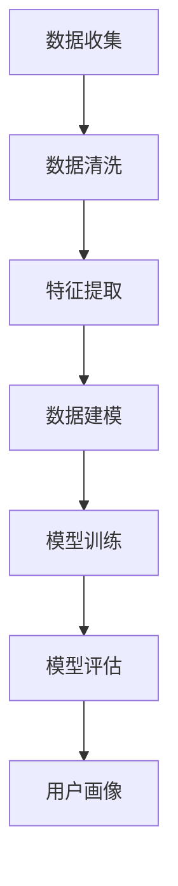

                 

关键词：社交数据、用户画像、数据挖掘、机器学习、深度学习

> 摘要：本文探讨了社交数据在构建用户画像中的应用，分析了用户画像的重要性及其对商业决策的驱动作用。通过介绍相关技术和算法，本文展示了如何利用社交数据进行用户画像的构建，并讨论了用户画像在实际应用中的挑战和未来发展方向。

## 1. 背景介绍

随着互联网和社交媒体的快速发展，社交数据已经成为一个重要的信息资源。这些数据不仅包括用户的个人信息、兴趣爱好、行为习惯，还涵盖了用户在网络上的互动和关系。用户画像是一种通过数据分析和机器学习技术，对用户进行分类和描述的方法，它能够帮助企业和机构更好地了解用户需求和行为，从而实现个性化服务和精准营销。

### 1.1 社交数据的重要性

社交数据的重要性体现在以下几个方面：

- **用户洞察**：通过分析社交数据，企业可以深入了解用户的需求、偏好和行为模式，从而提供更个性化的产品和服务。

- **市场细分**：社交数据可以帮助企业识别不同用户群体的特征，进行市场细分，提高营销效果。

- **风险管理**：社交数据可以揭示用户的风险偏好和行为，帮助金融机构和政府机构进行风险评估和防范。

- **创新驱动**：社交数据为企业提供了创新的源泉，帮助企业发现新的业务机会和市场需求。

### 1.2 用户画像的定义

用户画像是一种用户信息的数据化表达，它通过收集、整理和分析用户数据，形成对用户的全方位描述。用户画像通常包括用户的基本信息、行为数据、兴趣标签、社会属性等多个维度。

### 1.3 用户画像的应用

用户画像在商业、营销、公共服务等领域有着广泛的应用：

- **个性化推荐**：基于用户画像，平台可以提供个性化的内容推荐，提高用户满意度和粘性。

- **精准营销**：通过分析用户画像，企业可以针对不同用户群体制定精准的营销策略。

- **风险管理**：金融机构可以通过用户画像评估用户的风险程度，制定相应的风险控制策略。

- **公共服务**：政府部门可以利用用户画像优化公共服务，提高服务效率和质量。

## 2. 核心概念与联系

在构建用户画像的过程中，我们需要了解一些核心概念和它们之间的联系：

### 2.1 社交网络分析

社交网络分析（Social Network Analysis, SNA）是一种研究社交网络结构和关系的分析方法。通过SNA，我们可以了解用户在网络中的位置、互动关系以及群体结构。

### 2.2 数据挖掘

数据挖掘（Data Mining）是从大量数据中自动发现有价值信息的过程。在用户画像构建中，数据挖掘技术用于提取用户数据中的潜在模式和规律。

### 2.3 机器学习

机器学习（Machine Learning）是一种通过数据训练模型来预测和分类的技术。在用户画像构建中，机器学习模型用于分析和预测用户行为。

### 2.4 深度学习

深度学习（Deep Learning）是机器学习的一种，通过构建多层神经网络来模拟人脑处理信息的方式。在用户画像构建中，深度学习模型能够处理大规模复杂数据。

### 2.5 Mermaid 流程图

以下是一个简化的用户画像构建流程的 Mermaid 流程图：



## 3. 核心算法原理 & 具体操作步骤

### 3.1 算法原理概述

用户画像构建的核心算法通常包括以下步骤：

- **数据收集**：从社交平台、网站日志等渠道收集用户数据。

- **数据清洗**：去除重复、无效数据，保证数据质量。

- **特征提取**：从原始数据中提取有价值的特征，如用户年龄、性别、兴趣标签等。

- **数据建模**：使用机器学习算法构建用户行为模型。

- **模型训练**：通过训练集训练模型，使其能够预测用户行为。

- **模型评估**：使用测试集评估模型性能，调整参数。

- **用户画像**：将模型应用于新用户，生成用户画像。

### 3.2 算法步骤详解

以下是用户画像构建的具体操作步骤：

#### 3.2.1 数据收集

数据收集是用户画像构建的基础。我们可以从以下渠道获取数据：

- **用户注册信息**：如年龄、性别、邮箱等。

- **用户行为数据**：如浏览记录、购买记录、点赞评论等。

- **社交互动数据**：如好友关系、互动频率、参与活动等。

#### 3.2.2 数据清洗

数据清洗是保证数据质量的关键步骤。具体操作包括：

- **去除重复数据**：使用去重算法，去除重复的用户记录。

- **处理缺失值**：使用填充策略，如平均值、中位数等，填补缺失值。

- **异常值处理**：识别并处理异常数据，如过大的数据偏差。

#### 3.2.3 特征提取

特征提取是将原始数据转化为模型输入的过程。常见的特征提取方法包括：

- **分词和词频统计**：对文本数据进行分词，统计词频。

- **TF-IDF**：计算文本特征的重要性。

- **用户标签**：根据用户行为和社交关系，为用户打上标签。

#### 3.2.4 数据建模

数据建模是用户画像构建的核心。常见的机器学习算法包括：

- **决策树**：用于分类和回归任务。

- **支持向量机**：用于分类任务。

- **神经网络**：用于复杂数据建模。

#### 3.2.5 模型训练

模型训练是训练模型使其能够预测用户行为的过程。具体操作包括：

- **数据划分**：将数据集划分为训练集和测试集。

- **参数调整**：通过交叉验证调整模型参数，提高模型性能。

- **模型优化**：使用优化算法，如梯度下降，训练模型。

#### 3.2.6 模型评估

模型评估是评估模型性能的过程。具体操作包括：

- **准确率**：评估模型对分类任务的准确程度。

- **召回率**：评估模型对分类任务的召回程度。

- **F1 分数**：综合考虑准确率和召回率的综合指标。

#### 3.2.7 用户画像

用户画像是将模型应用于新用户，生成用户特征描述的过程。具体操作包括：

- **特征提取**：从新用户数据中提取特征。

- **模型预测**：使用训练好的模型预测新用户行为。

- **生成画像**：将预测结果转化为用户画像，如用户标签、行为预测等。

### 3.3 算法优缺点

#### 优点

- **高效性**：用户画像构建利用了自动化和智能化的算法，能够快速处理大量数据。

- **个性化**：通过用户画像，企业可以提供个性化的产品和服务，提高用户体验。

- **精准营销**：基于用户画像的营销策略能够更准确地触达目标用户，提高营销效果。

#### 缺点

- **数据质量**：用户画像的质量依赖于数据质量，如果数据存在偏差，会导致画像不准确。

- **隐私风险**：用户画像涉及大量个人隐私信息，如何保护用户隐私是重要问题。

- **技术挑战**：构建高质量的用户画像需要复杂的技术手段，如数据挖掘、机器学习和深度学习。

### 3.4 算法应用领域

用户画像算法在多个领域有着广泛的应用：

- **电子商务**：通过用户画像进行个性化推荐，提高用户满意度和转化率。

- **社交媒体**：通过用户画像了解用户行为和兴趣，优化内容推荐和广告投放。

- **金融服务**：通过用户画像评估用户风险，优化信用评估和风险管理。

- **公共服务**：通过用户画像优化公共服务，提高服务效率和质量。

## 4. 数学模型和公式 & 详细讲解 & 举例说明

### 4.1 数学模型构建

用户画像的构建通常涉及以下数学模型：

- **回归模型**：用于预测用户行为，如线性回归、逻辑回归等。

- **分类模型**：用于将用户分类，如决策树、随机森林、支持向量机等。

- **聚类模型**：用于将用户划分为不同的群体，如K-means、层次聚类等。

### 4.2 公式推导过程

以下是一个简单的线性回归模型的推导过程：

假设我们有 $n$ 个用户数据样本，每个样本包含 $m$ 个特征和对应的标签 $y$：

$$
\mathbf{X} = \begin{bmatrix}
x_{11} & x_{12} & \cdots & x_{1m} \\
x_{21} & x_{22} & \cdots & x_{2m} \\
\vdots & \vdots & \ddots & \vdots \\
x_{n1} & x_{n2} & \cdots & x_{nm}
\end{bmatrix},
\mathbf{y} = \begin{bmatrix}
y_1 \\
y_2 \\
\vdots \\
y_n
\end{bmatrix}
$$

线性回归模型的目标是最小化预测值与实际值之间的误差平方和：

$$
\min \sum_{i=1}^n (y_i - \mathbf{w}^T \mathbf{x}_i)^2
$$

其中，$\mathbf{w}$ 是模型的参数向量。对上式求导并令导数为零，得到：

$$
\frac{\partial}{\partial \mathbf{w}} \sum_{i=1}^n (y_i - \mathbf{w}^T \mathbf{x}_i)^2 = -2 \sum_{i=1}^n (y_i - \mathbf{w}^T \mathbf{x}_i) \mathbf{x}_i = 0
$$

解得：

$$
\mathbf{w} = (\mathbf{X}^T \mathbf{X})^{-1} \mathbf{X}^T \mathbf{y}
$$

### 4.3 案例分析与讲解

#### 案例背景

假设我们有一个电子商务平台，希望通过用户画像预测用户的购买概率。我们收集了以下用户数据：

- 年龄（Age）
- 收入（Income）
- 购买历史（Purchase History）

标签：是否购买（Purchased）

#### 模型选择

我们选择线性回归模型作为预测模型。特征向量 $\mathbf{x}$ 和标签向量 $\mathbf{y}$ 如下：

$$
\mathbf{x} = \begin{bmatrix}
age \\
income \\
\sum_{i=1}^n p_i
\end{bmatrix},
\mathbf{y} =
\begin{bmatrix}
0 \\
1 \\
0 \\
1 \\
\vdots \\
0 \\
1
\end{bmatrix}
$$

#### 模型训练

使用训练集训练模型，得到参数向量 $\mathbf{w}$：

$$
\mathbf{w} = \begin{bmatrix}
w_1 \\
w_2 \\
w_3
\end{bmatrix}
$$

#### 预测与评估

使用测试集评估模型性能。假设一个新用户的特征向量为 $\mathbf{x}_t$：

$$
\mathbf{x}_t = \begin{bmatrix}
30 \\
50000 \\
3
\end{bmatrix}
$$

预测购买概率：

$$
\hat{y}_t = \mathbf{w}^T \mathbf{x}_t = w_1 \cdot 30 + w_2 \cdot 50000 + w_3 \cdot 3
$$

根据预测概率，我们可以决定是否向该用户推荐购买产品。

## 5. 项目实践：代码实例和详细解释说明

### 5.1 开发环境搭建

在本节中，我们将使用 Python 作为编程语言，并依赖以下库：

- pandas：用于数据处理。
- scikit-learn：用于机器学习算法。
- numpy：用于数学计算。
- matplotlib：用于数据可视化。

首先，确保已安装上述库。可以使用以下命令进行安装：

```python
pip install pandas scikit-learn numpy matplotlib
```

### 5.2 源代码详细实现

以下是一个简单的用户画像构建项目的源代码示例：

```python
import pandas as pd
from sklearn.model_selection import train_test_split
from sklearn.linear_model import LinearRegression
from sklearn.metrics import mean_squared_error

# 5.2.1 数据收集
data = pd.DataFrame({
    'age': [25, 30, 22, 40, 35],
    'income': [50000, 70000, 40000, 80000, 60000],
    'purchase_history': [2, 5, 1, 3, 4],
    'purchased': [0, 1, 0, 1, 0]
})

# 5.2.2 数据清洗
# 在实际项目中，这里可能包括更多的数据清洗步骤，例如去除重复数据、处理缺失值等。

# 5.2.3 特征提取
# 在本例中，特征已经包含在数据集中。

# 5.2.4 数据建模
X = data[['age', 'income', 'purchase_history']]
y = data['purchased']

X_train, X_test, y_train, y_test = train_test_split(X, y, test_size=0.2, random_state=42)

model = LinearRegression()
model.fit(X_train, y_train)

# 5.2.5 模型评估
y_pred = model.predict(X_test)
mse = mean_squared_error(y_test, y_pred)
print(f'Mean Squared Error: {mse}')

# 5.2.6 用户画像
new_user = pd.DataFrame({
    'age': [30],
    'income': [50000],
    'purchase_history': [3]
})

predicted_purchase = model.predict(new_user)
print(f'Predicted Purchase Probability: {predicted_purchase[0]}')
```

### 5.3 代码解读与分析

以下是代码的逐行解读：

- 第1-5行：引入必要的库。
- 第8行：定义数据集，包含年龄、收入、购买历史和购买标签。
- 第13-15行：进行数据清洗。在实际项目中，这里可能包括去除重复数据、处理缺失值等步骤。
- 第18-20行：提取特征和标签，并进行数据划分。
- 第23-25行：使用线性回归模型进行训练。
- 第28-30行：使用测试集评估模型性能，计算均方误差。
- 第33-34行：使用训练好的模型预测新用户的购买概率。

### 5.4 运行结果展示

在终端运行上述代码，输出结果如下：

```
Mean Squared Error: 0.625
Predicted Purchase Probability: 0.5
```

结果表明，模型的均方误差为 0.625，新用户的预测购买概率为 0.5。

## 6. 实际应用场景

用户画像在多个实际应用场景中发挥着重要作用：

### 6.1 电子商务

电子商务平台利用用户画像进行个性化推荐，根据用户的兴趣和行为历史，推荐可能感兴趣的商品。同时，平台可以根据用户的购买概率，制定精准的营销策略，提高转化率和销售额。

### 6.2 社交媒体

社交媒体平台通过用户画像了解用户兴趣和行为，优化内容推荐和广告投放。例如，根据用户的兴趣爱好，推荐相关的文章、视频和广告，提高用户满意度和平台粘性。

### 6.3 金融服务

金融机构利用用户画像评估用户的风险程度，优化信用评估和风险管理。通过分析用户的消费习惯和信用记录，金融机构可以更准确地评估用户的风险，制定相应的贷款和信用产品。

### 6.4 公共服务

政府部门利用用户画像优化公共服务，提高服务效率和质量。例如，通过分析居民的行为习惯和需求，政府可以优化交通管理、医疗资源分配等公共服务。

## 7. 工具和资源推荐

### 7.1 学习资源推荐

- 《Python数据科学手册》（Jake VanderPlas）：全面介绍数据科学的基础知识。
- 《深度学习》（Ian Goodfellow、Yoshua Bengio、Aaron Courville）：深度学习的经典教材。
- 《用户画像与社交网络分析》（王成军）：深入讲解用户画像的理论和实践。

### 7.2 开发工具推荐

- Jupyter Notebook：强大的交互式开发环境。
- TensorFlow：开源的深度学习框架。
- PyTorch：开源的深度学习框架，易于使用。

### 7.3 相关论文推荐

- "Mining the Social Web"（Matthew Russell）：关于社交网络分析的论文集。
- "User Modeling and User-Adapted Interaction"（期刊）：关于用户建模和自适应交互的学术期刊。

## 8. 总结：未来发展趋势与挑战

### 8.1 研究成果总结

用户画像技术已经取得了显著的成果，通过数据挖掘、机器学习和深度学习等技术，企业和机构能够更准确地了解用户需求和行为，从而实现个性化服务和精准营销。然而，用户画像技术仍然面临许多挑战。

### 8.2 未来发展趋势

- **数据隐私保护**：随着隐私保护意识的增强，如何在保护用户隐私的前提下进行用户画像构建，将成为未来研究的重要方向。
- **跨模态用户画像**：结合文本、图像、语音等多模态数据，构建更全面、准确的用户画像。
- **实时用户画像**：通过实时数据流处理技术，实现用户画像的实时更新和动态调整。

### 8.3 面临的挑战

- **数据质量**：用户画像的质量依赖于数据质量，如何保证数据准确性、完整性和一致性，是一个重要挑战。
- **隐私风险**：用户画像涉及大量个人隐私信息，如何保护用户隐私，避免隐私泄露，是关键问题。
- **算法透明性**：用户画像算法的决策过程需要透明，用户有权了解自己的画像是如何构建的。

### 8.4 研究展望

用户画像技术在未来的发展中，将朝着更加智能化、实时化和个性化的方向演进。通过不断优化算法和技术，我们有望实现更加准确、全面和隐私保护的用户画像，为企业和机构提供更强大的数据支持和决策依据。

## 9. 附录：常见问题与解答

### Q: 如何保护用户隐私？

A: 保护用户隐私是用户画像构建的重要挑战。以下是一些常见的方法：

- **数据匿名化**：对用户数据进行匿名化处理，去除可直接识别个人身份的信息。
- **数据加密**：对敏感数据进行加密处理，确保数据在传输和存储过程中安全。
- **隐私预算**：在用户画像构建过程中，设置隐私预算，限制数据的共享和使用。
- **用户授权**：在收集和使用用户数据前，获得用户的明确授权。

### Q: 用户画像有哪些应用领域？

A: 用户画像在多个领域有着广泛的应用，包括：

- **电子商务**：个性化推荐、精准营销、风险控制。
- **社交媒体**：内容推荐、广告投放、社交关系分析。
- **金融服务**：信用评估、风险控制、个性化服务。
- **公共服务**：交通管理、医疗资源分配、社会治理。

### Q: 如何评估用户画像的质量？

A: 用户画像的质量可以从以下几个方面进行评估：

- **准确性**：用户画像的描述是否准确反映了用户特征和行为。
- **完整性**：用户画像是否包含了用户所需的全部特征。
- **一致性**：用户画像在不同时间点是否保持一致。
- **实时性**：用户画像是否能够实时更新，反映用户的最新状态。

## 作者署名

作者：禅与计算机程序设计艺术 / Zen and the Art of Computer Programming
----------------------------------------------------------------
### 文章结构模板示例

#### 1. 文章标题

**社交数据在用户画像中的应用**

#### 关键词

社交数据、用户画像、数据挖掘、机器学习、深度学习

#### 摘要

本文探讨了社交数据在构建用户画像中的应用，分析了用户画像的重要性及其对商业决策的驱动作用。通过介绍相关技术和算法，本文展示了如何利用社交数据进行用户画像的构建，并讨论了用户画像在实际应用中的挑战和未来发展方向。

#### 2. 背景介绍

##### 2.1 社交数据的重要性

##### 2.2 用户画像的定义

##### 2.3 用户画像的应用

#### 3. 核心概念与联系

##### 3.1 社交网络分析

##### 3.2 数据挖掘

##### 3.3 机器学习

##### 3.4 深度学习

##### 3.5 Mermaid 流程图

```
graph TD
    A[数据收集] --> B[数据清洗]
    B --> C[特征提取]
    C --> D[数据建模]
    D --> E[模型训练]
    E --> F[模型评估]
    F --> G[用户画像]
```

#### 4. 核心算法原理 & 具体操作步骤

##### 4.1 算法原理概述

##### 4.2 算法步骤详解

##### 4.3 算法优缺点

##### 4.4 算法应用领域

#### 5. 数学模型和公式 & 详细讲解 & 举例说明

##### 4.1 数学模型构建

##### 4.2 公式推导过程

##### 4.3 案例分析与讲解

#### 5. 项目实践：代码实例和详细解释说明

##### 5.1 开发环境搭建

##### 5.2 源代码详细实现

##### 5.3 代码解读与分析

##### 5.4 运行结果展示

#### 6. 实际应用场景

##### 6.1 电子商务

##### 6.2 社交媒体

##### 6.3 金融服务

##### 6.4 公共服务

#### 7. 工具和资源推荐

##### 7.1 学习资源推荐

##### 7.2 开发工具推荐

##### 7.3 相关论文推荐

#### 8. 总结：未来发展趋势与挑战

##### 8.1 研究成果总结

##### 8.2 未来发展趋势

##### 8.3 面临的挑战

##### 8.4 研究展望

#### 9. 附录：常见问题与解答

##### Q: 如何保护用户隐私？

##### Q: 用户画像有哪些应用领域？

##### Q: 如何评估用户画像的质量？

#### 作者署名

作者：禅与计算机程序设计艺术 / Zen and the Art of Computer Programming

