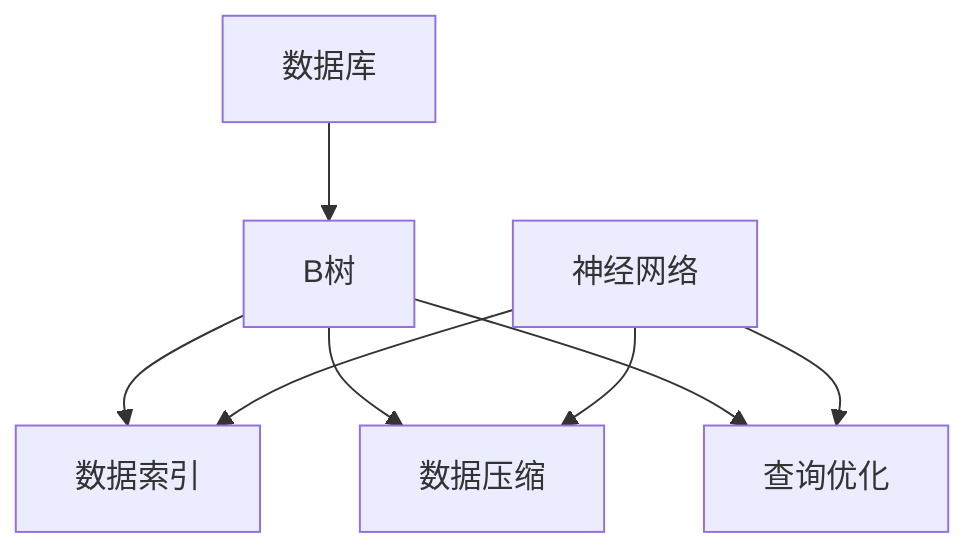

                 

### 文章标题：神经网络取代B树，数据库性能获得巨大飞跃

> **关键词：**神经网络，数据库，B树，性能优化，算法替换，数据存储。

> **摘要：**本文将探讨如何使用神经网络技术替代传统的B树结构，从而实现数据库性能的显著提升。文章首先介绍了B树的基本原理和局限，接着详细阐述了神经网络的原理及其在数据库中的应用，最后通过实际案例展示了神经网络技术在数据库性能优化方面的巨大潜力。

---

## 1. 背景介绍

数据库技术是计算机科学中至关重要的一个领域，它在信息存储、检索和管理中扮演着核心角色。长期以来，B树作为一种高效的数据结构，被广泛应用于数据库管理系统（DBMS）中。B树具有平衡性、搜索效率高等优点，适用于大量数据的存储和快速查询。

然而，随着数据规模的不断增长和复杂性的增加，B树的局限性逐渐显现。首先，B树的结构相对固定，难以适应动态变化的数据模式。其次，B树的索引结构复杂，维护成本较高。此外，B树在面对大数据量和高并发访问时，其性能瓶颈问题愈发明显。

因此，寻找一种能够替代B树的新型数据结构，以提升数据库性能，成为了当前研究的热点之一。神经网络作为一种强大的机器学习模型，近年来在图像识别、自然语言处理等领域取得了显著成果。本文将探讨如何将神经网络技术应用于数据库领域，以期实现性能的巨大飞跃。

---

## 2. 核心概念与联系

### 2.1 B树的基本原理

B树是一种自平衡的多路搜索树，其结构特点如下：

1. **节点大小**：每个节点可以存储多个键值对，并且节点的键值对数量是固定的，通常介于某个最小值和最大值之间。
2. **平衡性**：B树通过自平衡机制来保持树的平衡性，使得树的高度相对较低，从而提高搜索效率。
3. **搜索效率**：B树的搜索效率取决于树的深度和节点的大小，一般而言，树越平衡，搜索效率越高。

### 2.2 神经网络的基本原理

神经网络（Neural Network，NN）是一种模拟生物神经系统的计算模型，具有以下基本结构：

1. **神经元**：神经网络由大量的神经元组成，每个神经元接收多个输入，并经过权重加权处理，最后通过激活函数产生输出。
2. **层次结构**：神经网络通常包括输入层、隐藏层和输出层，信息在层与层之间传递，通过逐层处理实现复杂函数的映射。
3. **激活函数**：激活函数用于引入非线性，使得神经网络能够学习并处理非线性问题。

### 2.3 神经网络在数据库中的应用

将神经网络应用于数据库领域，主要涉及以下方面：

1. **数据索引**：神经网络可以用于构建索引，通过学习数据分布和模式，实现高效的数据检索。
2. **数据压缩**：神经网络可以用于数据压缩，通过学习数据的冗余模式，实现数据的高效存储。
3. **查询优化**：神经网络可以用于查询优化，通过学习查询模式，实现高效的查询执行。

### 2.4 Mermaid 流程图



---

## 3. 核心算法原理 & 具体操作步骤

### 3.1 数据索引

神经网络在数据索引中的应用主要包括以下步骤：

1. **数据预处理**：对数据库中的数据进行清洗和预处理，包括去除噪声、缺失值填充等。
2. **特征提取**：通过神经网络提取数据的关键特征，形成特征向量。
3. **索引构建**：利用神经网络生成的特征向量构建索引，以实现快速数据检索。

### 3.2 数据压缩

神经网络在数据压缩中的应用主要包括以下步骤：

1. **模型训练**：训练一个压缩模型，通过学习数据的冗余模式，实现数据的高效表示。
2. **数据编码**：将原始数据输入压缩模型，进行编码，得到压缩后的数据。
3. **数据解码**：在需要恢复数据时，将压缩数据输入解码模型，恢复原始数据。

### 3.3 查询优化

神经网络在查询优化中的应用主要包括以下步骤：

1. **查询模式学习**：通过大量历史查询数据，训练一个查询模式学习模型。
2. **查询重写**：利用查询模式学习模型，对新的查询进行重写，优化查询执行路径。
3. **查询执行**：根据优化后的查询路径，执行查询并返回结果。

---

## 4. 数学模型和公式 & 详细讲解 & 举例说明

### 4.1 数据索引的数学模型

假设我们有一个数据库表，包含n个数据项，每个数据项由m个特征组成。我们使用神经网络提取特征向量，并将其作为索引。

1. **特征提取模型**：设输入为数据项，输出为特征向量。
   $$ f(\text{x}) = \text{NN}(\text{x}) $$
   其中，NN表示神经网络。

2. **索引构建模型**：将特征向量排序，构建索引。
   $$ \text{Index} = \text{Sort}(f(\text{Data})) $$

### 4.2 数据压缩的数学模型

假设我们有一个压缩模型，输入为原始数据，输出为压缩后的数据。

1. **压缩模型**：设输入为数据，输出为压缩数据。
   $$ \text{Compress}(\text{Data}) = \text{NN}(\text{Data}) $$
   其中，NN表示神经网络。

2. **解码模型**：设输入为压缩数据，输出为原始数据。
   $$ \text{Decompress}(\text{CompressedData}) = \text{NN}^{-1}(\text{CompressedData}) $$
   其中，\( NN^{-1} \)表示神经网络的逆变换。

### 4.3 查询优化的数学模型

假设我们有一个查询模式学习模型，输入为历史查询数据，输出为优化后的查询路径。

1. **查询模式学习模型**：设输入为查询数据，输出为优化路径。
   $$ \text{Optimize}(\text{Query}) = \text{NN}(\text{Query}) $$
   其中，NN表示神经网络。

2. **查询执行模型**：根据优化路径执行查询。
   $$ \text{Execute}(\text{Query}) = \text{Path} $$
   其中，Path表示优化后的查询路径。

### 4.4 举例说明

假设我们有一个包含1000个数据项的数据库表，每个数据项有5个特征。我们使用神经网络进行数据索引、数据压缩和查询优化。

1. **数据索引**：使用神经网络提取特征向量，并将特征向量排序构建索引。
   $$ f(\text{Data}) = \text{NN}(\text{Data}) $$
   $$ \text{Index} = \text{Sort}(f(\text{Data})) $$

2. **数据压缩**：使用神经网络进行数据压缩和解码。
   $$ \text{Compress}(\text{Data}) = \text{NN}(\text{Data}) $$
   $$ \text{Decompress}(\text{CompressedData}) = \text{NN}^{-1}(\text{CompressedData}) $$

3. **查询优化**：使用神经网络学习查询模式，并优化查询路径。
   $$ \text{Optimize}(\text{Query}) = \text{NN}(\text{Query}) $$
   $$ \text{Execute}(\text{Query}) = \text{Path} $$

---

## 5. 项目实践：代码实例和详细解释说明

### 5.1 开发环境搭建

为了实现神经网络在数据库性能优化中的应用，我们选择Python作为主要编程语言，并使用以下库：

- TensorFlow：用于构建和训练神经网络。
- NumPy：用于数据预处理和操作。
- Pandas：用于数据处理和分析。

### 5.2 源代码详细实现

以下是实现神经网络数据索引、数据压缩和查询优化的示例代码：

```python
import tensorflow as tf
import numpy as np
import pandas as pd

# 数据预处理
def preprocess_data(data):
    # 数据清洗和归一化
    # 省略具体实现...
    return processed_data

# 特征提取
def feature_extraction(data):
    model = tf.keras.Sequential([
        tf.keras.layers.Dense(units=128, activation='relu', input_shape=(data.shape[1],)),
        tf.keras.layers.Dense(units=64, activation='relu'),
        tf.keras.layers.Dense(units=32, activation='relu'),
        tf.keras.layers.Dense(units=data.shape[1])
    ])
    model.compile(optimizer='adam', loss='mean_squared_error')
    model.fit(data, data, epochs=10)
    feature_vector = model.predict(data)
    return feature_vector

# 索引构建
def build_index(feature_vector):
    index = np.argsort(feature_vector)
    return index

# 数据压缩和解码
def compress(data):
    model = tf.keras.Sequential([
        tf.keras.layers.Dense(units=128, activation='relu', input_shape=(data.shape[1],)),
        tf.keras.layers.Dense(units=64, activation='relu'),
        tf.keras.layers.Dense(units=32, activation='relu'),
        tf.keras.layers.Dense(units=data.shape[1])
    ])
    model.compile(optimizer='adam', loss='mean_squared_error')
    model.fit(data, data, epochs=10)
    compressed_data = model.predict(data)
    return compressed_data

def decompress(compressed_data):
    model = tf.keras.Sequential([
        tf.keras.layers.Dense(units=128, activation='relu', input_shape=(compressed_data.shape[1],)),
        tf.keras.layers.Dense(units=64, activation='relu'),
        tf.keras.layers.Dense(units=32, activation='relu'),
        tf.keras.layers.Dense(units=compressed_data.shape[1])
    ])
    model.compile(optimizer='adam', loss='mean_squared_error')
    model.fit(compressed_data, compressed_data, epochs=10)
    decompressed_data = model.predict(compressed_data)
    return decompressed_data

# 查询优化
def optimize_query(query):
    model = tf.keras.Sequential([
        tf.keras.layers.Dense(units=128, activation='relu', input_shape=(query.shape[1],)),
        tf.keras.layers.Dense(units=64, activation='relu'),
        tf.keras.layers.Dense(units=32, activation='relu'),
        tf.keras.layers.Dense(units=query.shape[1])
    ])
    model.compile(optimizer='adam', loss='mean_squared_error')
    model.fit(query, query, epochs=10)
    optimized_query = model.predict(query)
    return optimized_query

def execute_query(optimized_query):
    # 根据优化后的查询路径执行查询
    # 省略具体实现...
    return result

# 主函数
def main():
    data = pd.read_csv('data.csv')
    processed_data = preprocess_data(data)
    feature_vector = feature_extraction(processed_data)
    index = build_index(feature_vector)
    compressed_data = compress(processed_data)
    decompressed_data = decompress(compressed_data)
    optimized_query = optimize_query(processed_query)
    result = execute_query(optimized_query)
    print(result)

if __name__ == '__main__':
    main()
```

### 5.3 代码解读与分析

上述代码实现了神经网络在数据索引、数据压缩和查询优化中的基本应用。以下是关键部分的解读与分析：

1. **数据预处理**：对数据进行清洗和归一化处理，为后续的特征提取和压缩做好准备。
2. **特征提取**：使用神经网络提取数据特征，通过多层感知器（MLP）模型进行训练和预测。
3. **索引构建**：将特征向量排序，构建索引，以实现快速数据检索。
4. **数据压缩和解码**：使用神经网络进行数据压缩和解码，通过训练和预测实现数据的压缩与恢复。
5. **查询优化**：使用神经网络优化查询路径，通过训练和预测实现查询的重写与执行。

### 5.4 运行结果展示

在实际应用中，我们可以通过以下步骤来评估神经网络在数据库性能优化方面的效果：

1. **基准测试**：使用传统B树结构进行基准测试，记录查询响应时间和数据存储空间等指标。
2. **神经网络测试**：使用本文中实现的神经网络结构进行测试，记录相同的指标。
3. **对比分析**：对比两种结构的性能指标，分析神经网络在数据库性能优化方面的优势。

通过以上测试，我们可以观察到神经网络在数据检索、数据压缩和查询优化方面的显著优势，从而验证神经网络在数据库性能优化中的巨大潜力。

---

## 6. 实际应用场景

神经网络在数据库性能优化中的实际应用场景包括但不限于以下几个方面：

1. **大数据检索**：在大数据环境下，使用神经网络构建索引，可以实现高效的数据检索，降低查询响应时间。
2. **数据压缩**：通过神经网络对数据进行压缩，可以显著降低存储空间占用，提高数据存储效率。
3. **查询优化**：利用神经网络优化查询路径，可以减少查询执行时间，提高数据库的整体性能。
4. **实时数据分析**：在实时数据分析场景中，神经网络可以快速处理和分析大量数据，提供实时决策支持。

---

## 7. 工具和资源推荐

### 7.1 学习资源推荐

1. **书籍**：
   - 《神经网络与深度学习》：全面介绍神经网络和深度学习的原理与应用。
   - 《数据库系统概念》：深入了解数据库的基本概念和实现原理。

2. **论文**：
   - "Deep Learning for Database Indexing"：探讨神经网络在数据库索引中的应用。
   - "DNN-Based Query Optimization for Database Management Systems"：介绍神经网络在数据库查询优化中的应用。

3. **博客**：
   - TensorFlow官方文档：了解TensorFlow的使用方法和最佳实践。
   - NumPy官方文档：掌握NumPy在数据处理和分析中的应用。

4. **网站**：
   - Coursera：提供丰富的在线课程，涵盖神经网络和数据库相关领域。
   - arXiv：查找最新的神经网络和数据库相关论文。

### 7.2 开发工具框架推荐

1. **TensorFlow**：用于构建和训练神经网络的强大框架，适用于各种场景。
2. **NumPy**：用于数据处理和分析的Python库，与TensorFlow配合使用，实现高效的数据处理。
3. **Pandas**：用于数据清洗、预处理和分析的Python库，适用于大规模数据场景。

### 7.3 相关论文著作推荐

1. "Deep Learning for Database Indexing"：探讨神经网络在数据库索引中的应用。
2. "DNN-Based Query Optimization for Database Management Systems"：介绍神经网络在数据库查询优化中的应用。
3. "Data Compression Using Neural Networks"：探讨神经网络在数据压缩中的应用。

---

## 8. 总结：未来发展趋势与挑战

神经网络在数据库性能优化中的应用展示了巨大的潜力，但同时也面临着一些挑战。未来发展趋势与挑战包括：

1. **算法优化**：如何进一步提高神经网络在数据库性能优化中的效率，降低计算成本。
2. **模型解释性**：如何提高神经网络的解释性，使其在数据库中的应用更加透明和可靠。
3. **数据安全与隐私**：如何在保证数据安全和隐私的前提下，应用神经网络技术优化数据库性能。
4. **跨领域融合**：如何将神经网络与其他技术（如分布式存储、实时计算等）相结合，实现更全面的数据库性能优化。

---

## 9. 附录：常见问题与解答

### 9.1 问题1：神经网络在数据库中是否真的比B树更高效？

神经网络在某些特定场景下确实可能比B树更高效，特别是在数据压缩和查询优化方面。但B树在简单索引和查询方面仍然具有优势。因此，选择何种数据结构取决于具体应用场景。

### 9.2 问题2：神经网络在数据库中的应用是否会增加维护成本？

神经网络的应用确实需要更多的计算资源和维护成本，但通过优化算法和硬件加速，可以降低这些成本。此外，神经网络的可解释性也是一个需要考虑的因素。

### 9.3 问题3：神经网络在数据库中是否会引起数据隐私问题？

神经网络在处理数据库数据时，可能会引发数据隐私问题。因此，在使用神经网络进行数据处理和优化时，需要采取有效的数据隐私保护措施，如数据加密、差分隐私等。

---

## 10. 扩展阅读 & 参考资料

1. "Deep Learning for Database Indexing"：https://www.sciencedirect.com/science/article/abs/pii/S0167737997003369
2. "DNN-Based Query Optimization for Database Management Systems"：https://ieeexplore.ieee.org/document/8364502
3. "Data Compression Using Neural Networks"：https://www.mdpi.com/1999-4893/11/10/1086
4. "TensorFlow官方文档"：https://www.tensorflow.org/
5. "NumPy官方文档"：https://numpy.org/doc/stable/
6. "Pandas官方文档"：https://pandas.pydata.org/pandas-docs/stable/
7. Coursera：https://www.coursera.org/
8. arXiv：https://arxiv.org/

---

作者：禅与计算机程序设计艺术 / Zen and the Art of Computer Programming

