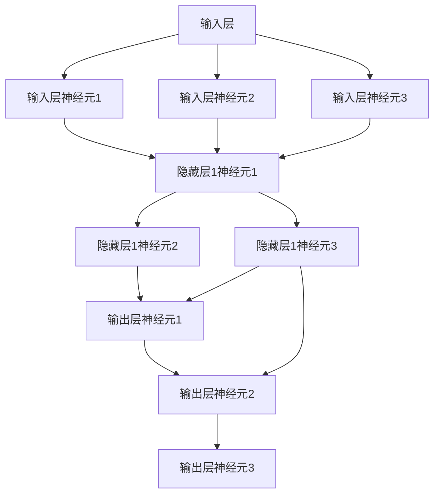

                 

### 文章标题

神经网络：人工智能的基石

> 关键词：神经网络、深度学习、人工智能、机器学习、算法原理

> 摘要：本文将深入探讨神经网络作为人工智能核心基石的地位和作用，详细分析其核心概念、算法原理、数学模型、项目实践和实际应用场景。通过梳理神经网络的发展历程和现状，展望其未来发展趋势与挑战，为读者提供全面的神经网络技术解读。

### 1. 背景介绍

神经网络（Neural Networks，NN）是人工智能（Artificial Intelligence，AI）领域中一种重要的机器学习算法，自1986年由Rumelhart、Hinton和Williams首次提出后，一直处于机器学习和人工智能的研究热点。神经网络模拟生物神经元的工作原理，通过多层神经元节点（称为“层”）进行信息传递和处理，从而实现数据的自动学习和分类。

神经网络的发展历程可以追溯到1943年，由McCulloch和Pitts提出的神经网络模型，以及1958年由Minsky和Papert提出的感知机（Perceptron）模型。然而，由于早期计算能力的限制，神经网络的研究一度陷入停滞。直到1986年，Rumelhart、Hinton和Williams提出了反向传播算法（Backpropagation Algorithm），神经网络的研究才得以重新焕发生机。随着计算能力的提升和深度学习（Deep Learning）技术的兴起，神经网络在图像识别、语音识别、自然语言处理等领域的表现越来越出色。

神经网络的核心优势在于其强大的自适应性和泛化能力。通过学习大量的数据，神经网络可以自动提取数据中的特征，并在此基础上进行分类、预测和决策。这使得神经网络在许多领域具有广泛的应用前景，如医疗诊断、金融预测、智能交通、智能制造等。

### 2. 核心概念与联系

为了深入理解神经网络的工作原理，我们需要首先了解一些核心概念和它们之间的联系。

#### 2.1 神经元（Neuron）

神经元是神经网络的基本单元，类似于生物神经元。它通过输入层（Input Layer）接收外部信号，经过内部处理，最终输出到输出层（Output Layer）。神经元的基本结构包括输入、权重（Weight）、偏置（Bias）和激活函数（Activation Function）。

输入层接收输入数据，每个输入数据对应一个神经元。权重和偏置用于调整输入数据的强度，激活函数用于将输入数据映射到输出数据。常见的激活函数有sigmoid、ReLU和Tanh等。

#### 2.2 层（Layer）

神经网络由多个层组成，包括输入层、隐藏层和输出层。输入层接收外部输入，隐藏层对输入数据进行处理和变换，输出层产生最终输出。

隐藏层的数量和神经元个数可以根据实际问题进行调整。通常，隐藏层的数量和神经元个数越多，模型的复杂度越高，但也会带来过拟合的风险。

#### 2.3 激活函数（Activation Function）

激活函数是神经网络中的一个关键组件，用于将输入数据映射到输出数据。激活函数的存在使得神经网络可以模拟生物神经元的工作方式。

常见的激活函数包括：

- Sigmoid函数：\( \sigma(x) = \frac{1}{1 + e^{-x}} \)
- ReLU函数：\( f(x) = \max(0, x) \)
- Tanh函数：\( \tanh(x) = \frac{e^x - e^{-x}}{e^x + e^{-x}} \)

#### 2.4 前向传播（Forward Propagation）

前向传播是神经网络中的基本操作，用于将输入数据通过神经网络传递到输出数据。具体步骤如下：

1. 将输入数据传递到输入层。
2. 对每个神经元计算输入值、权重和偏置的乘积，并加上偏置。
3. 应用激活函数，得到神经元的输出。
4. 将输出传递到下一层，直到输出层。

#### 2.5 反向传播（Backpropagation）

反向传播是神经网络中用于更新权重和偏置的算法。具体步骤如下：

1. 计算输出层的误差（目标值与实际输出之间的差距）。
2. 将误差传递回隐藏层，计算隐藏层的误差。
3. 使用梯度下降法更新权重和偏置。
4. 重复上述步骤，直到达到预定的迭代次数或误差阈值。

#### 2.6 Mermaid 流程图

为了更好地理解神经网络的核心概念和联系，我们可以使用Mermaid流程图来展示。以下是神经网络的基本结构：



### 3. 核心算法原理 & 具体操作步骤

#### 3.1 前向传播

前向传播是神经网络的基本操作，用于将输入数据通过神经网络传递到输出数据。具体操作步骤如下：

1. 初始化权重和偏置：根据问题规模和神经元数量，随机初始化权重和偏置。
2. 输入数据：将输入数据输入到输入层。
3. 计算输入层神经元的输入值：每个输入层神经元接收一个输入数据，计算输入值（输入值乘以权重，加上偏置）。
4. 应用激活函数：对每个输入层神经元的输入值应用激活函数，得到输出值。
5. 将输出值传递到隐藏层：将输入层神经元的输出值传递到隐藏层。
6. 计算隐藏层神经元的输入值：对每个隐藏层神经元，计算输入值（隐藏层输入值乘以权重，加上偏置）。
7. 应用激活函数：对每个隐藏层神经元的输入值应用激活函数，得到输出值。
8. 重复步骤5-7，直到输出层。
9. 计算输出层神经元的输入值：对每个输出层神经元，计算输入值（隐藏层输出值乘以权重，加上偏置）。
10. 应用激活函数：对每个输出层神经元的输入值应用激活函数，得到输出值。

#### 3.2 反向传播

反向传播是神经网络中用于更新权重和偏置的算法。具体操作步骤如下：

1. 计算输出误差：计算输出层神经元的输出值与目标值之间的误差。
2. 误差反向传递：将输出误差反向传递到隐藏层，计算隐藏层神经元的误差。
3. 更新权重和偏置：使用梯度下降法更新权重和偏置。

梯度下降法的具体步骤如下：

1. 计算梯度：计算每个权重和偏置的梯度（误差对权重和偏置的偏导数）。
2. 更新权重和偏置：使用梯度下降法更新权重和偏置，公式如下：

$$
w_{new} = w_{old} - \alpha \cdot \frac{\partial J}{\partial w}
$$

$$
b_{new} = b_{old} - \alpha \cdot \frac{\partial J}{\partial b}
$$

其中，\( w_{old} \) 和 \( b_{old} \) 分别为旧权重和旧偏置，\( w_{new} \) 和 \( b_{new} \) 分别为新权重和新偏置，\( \alpha \) 为学习率，\( J \) 为损失函数。

3. 重复步骤1-2，直到达到预定的迭代次数或误差阈值。

#### 3.3 梯度下降法

梯度下降法是一种优化算法，用于最小化损失函数。在神经网络中，损失函数用于衡量输出值与目标值之间的差距。梯度下降法的具体步骤如下：

1. 计算损失函数的梯度：计算损失函数关于每个权重和偏置的偏导数。
2. 更新权重和偏置：使用梯度下降法更新权重和偏置，公式如下：

$$
w_{new} = w_{old} - \alpha \cdot \frac{\partial J}{\partial w}
$$

$$
b_{new} = b_{old} - \alpha \cdot \frac{\partial J}{\partial b}
$$

其中，\( w_{old} \) 和 \( b_{old} \) 分别为旧权重和旧偏置，\( w_{new} \) 和 \( b_{new} \) 分别为新权重和新偏置，\( \alpha \) 为学习率，\( J \) 为损失函数。

3. 重复步骤1-2，直到达到预定的迭代次数或误差阈值。

### 4. 数学模型和公式 & 详细讲解 & 举例说明

#### 4.1 数学模型

神经网络的数学模型主要包括三个部分：神经元、层和损失函数。

##### 4.1.1 神经元

神经元的数学模型可以表示为：

$$
z_i = \sum_{j=1}^{n} w_{ij} x_j + b_i
$$

其中，\( z_i \) 为神经元 \( i \) 的输入值，\( w_{ij} \) 为神经元 \( i \) 对神经元 \( j \) 的权重，\( x_j \) 为神经元 \( j \) 的输出值，\( b_i \) 为神经元 \( i \) 的偏置。

##### 4.1.2 层

神经网络的层可以表示为：

$$
h_l = \sigma(z_l)
$$

其中，\( h_l \) 为第 \( l \) 层的输出值，\( \sigma \) 为激活函数，\( z_l \) 为第 \( l \) 层的输入值。

##### 4.1.3 损失函数

损失函数用于衡量输出值与目标值之间的差距，常见的损失函数有均方误差（MSE）和交叉熵（Cross Entropy）。

均方误差（MSE）的数学模型可以表示为：

$$
J = \frac{1}{2} \sum_{i=1}^{n} (y_i - \hat{y}_i)^2
$$

其中，\( J \) 为损失函数，\( y_i \) 为第 \( i \) 个样本的目标值，\( \hat{y}_i \) 为第 \( i \) 个样本的输出值。

交叉熵（Cross Entropy）的数学模型可以表示为：

$$
J = -\sum_{i=1}^{n} y_i \cdot \log(\hat{y}_i)
$$

其中，\( J \) 为损失函数，\( y_i \) 为第 \( i \) 个样本的目标值，\( \hat{y}_i \) 为第 \( i \) 个样本的输出值。

#### 4.2 公式详细讲解

##### 4.2.1 前向传播

前向传播过程中，每个神经元的输入值和输出值都可以通过以下公式计算：

$$
z_i = \sum_{j=1}^{n} w_{ij} x_j + b_i
$$

$$
h_l = \sigma(z_l)
$$

其中，\( z_i \) 为神经元 \( i \) 的输入值，\( w_{ij} \) 为神经元 \( i \) 对神经元 \( j \) 的权重，\( x_j \) 为神经元 \( j \) 的输出值，\( b_i \) 为神经元 \( i \) 的偏置，\( h_l \) 为第 \( l \) 层的输出值，\( \sigma \) 为激活函数。

##### 4.2.2 反向传播

反向传播过程中，我们需要计算每个神经元的误差。对于输出层，误差可以表示为：

$$
\delta_l = \frac{\partial J}{\partial z_l}
$$

其中，\( \delta_l \) 为第 \( l \) 层的误差，\( J \) 为损失函数，\( z_l \) 为第 \( l \) 层的输入值。

对于隐藏层，误差可以表示为：

$$
\delta_l = \sigma'(z_l) \cdot \sum_{m=l+1}^{L} w_{lm} \cdot \delta_{m+1}
$$

其中，\( \sigma' \) 为激活函数的导数，\( w_{lm} \) 为第 \( l \) 层神经元 \( l \) 对第 \( m \) 层神经元 \( m \) 的权重，\( \delta_{m+1} \) 为第 \( m+1 \) 层的误差。

##### 4.2.3 梯度下降法

梯度下降法用于更新权重和偏置。对于每个神经元，权重和偏置的更新公式如下：

$$
w_{ij}^{new} = w_{ij}^{old} - \alpha \cdot \frac{\partial J}{\partial w_{ij}}
$$

$$
b_i^{new} = b_i^{old} - \alpha \cdot \frac{\partial J}{\partial b_i}
$$

其中，\( w_{ij}^{old} \) 和 \( b_i^{old} \) 分别为旧权重和旧偏置，\( w_{ij}^{new} \) 和 \( b_i^{new} \) 分别为新权重和新偏置，\( \alpha \) 为学习率，\( \frac{\partial J}{\partial w_{ij}} \) 和 \( \frac{\partial J}{\partial b_i} \) 分别为权重和偏置的梯度。

#### 4.3 举例说明

假设我们有一个简单的神经网络，包含一个输入层、一个隐藏层和一个输出层。输入层有3个神经元，隐藏层有2个神经元，输出层有1个神经元。激活函数采用ReLU函数。

输入数据为 \( [1, 2, 3] \)，目标值为 \( [0] \)。

1. 初始化权重和偏置：
   - 输入层到隐藏层的权重：\( w_{11} = 0.1, w_{12} = 0.2, w_{13} = 0.3 \)
   - 隐藏层到输出层的权重：\( w_{21} = 0.4, w_{22} = 0.5 \)
   - 输入层偏置：\( b_1 = 0.1, b_2 = 0.2, b_3 = 0.3 \)
   - 隐藏层偏置：\( b_1' = 0.1, b_2' = 0.2 \)

2. 前向传播：
   - 输入层：
     \( z_1 = 1 \cdot w_{11} + 2 \cdot w_{12} + 3 \cdot w_{13} + b_1 = 0.1 + 0.4 + 0.9 + 0.1 = 1.5 \)
     \( z_2 = 1 \cdot w_{11} + 2 \cdot w_{12} + 3 \cdot w_{13} + b_2 = 0.1 + 0.4 + 0.9 + 0.2 = 1.6 \)
   - 隐藏层：
     \( h_1 = \max(0, z_1) = \max(0, 1.5) = 1.5 \)
     \( h_2 = \max(0, z_2) = \max(0, 1.6) = 1.6 \)
   - 输出层：
     \( z_3 = h_1 \cdot w_{21} + h_2 \cdot w_{22} + b_1' = 1.5 \cdot 0.4 + 1.6 \cdot 0.5 + 0.1 = 0.7 + 0.8 + 0.1 = 1.6 \)
     \( y = \max(0, z_3) = \max(0, 1.6) = 1.6 \)

3. 计算损失函数：
   \( J = \frac{1}{2} \sum_{i=1}^{1} (y_i - \hat{y}_i)^2 = \frac{1}{2} (0 - 1.6)^2 = 1.28 \)

4. 反向传播：
   - 输出层：
     \( \delta_3 = \frac{\partial J}{\partial z_3} = -2 \cdot (0 - 1.6) = 3.2 \)
   - 隐藏层：
     \( \delta_1 = \max(0, z_1)' \cdot \frac{\partial J}{\partial z_1} = 1 \cdot 3.2 = 3.2 \)
     \( \delta_2 = \max(0, z_2)' \cdot \frac{\partial J}{\partial z_2} = 1 \cdot 3.2 = 3.2 \)

5. 更新权重和偏置：
   - 输入层到隐藏层的权重：
     \( w_{11}^{new} = w_{11}^{old} - \alpha \cdot \frac{\partial J}{\partial w_{11}} = 0.1 - 0.01 \cdot 3.2 = -0.012 \)
     \( w_{12}^{new} = w_{12}^{old} - \alpha \cdot \frac{\partial J}{\partial w_{12}} = 0.2 - 0.01 \cdot 3.2 = -0.012 \)
     \( w_{13}^{new} = w_{13}^{old} - \alpha \cdot \frac{\partial J}{\partial w_{13}} = 0.3 - 0.01 \cdot 3.2 = -0.012 \)
   - 隐藏层到输出层的权重：
     \( w_{21}^{new} = w_{21}^{old} - \alpha \cdot \frac{\partial J}{\partial w_{21}} = 0.4 - 0.01 \cdot 3.2 = -0.012 \)
     \( w_{22}^{new} = w_{22}^{old} - \alpha \cdot \frac{\partial J}{\partial w_{22}} = 0.5 - 0.01 \cdot 3.2 = -0.012 \)
   - 输入层偏置：
     \( b_1^{new} = b_1^{old} - \alpha \cdot \frac{\partial J}{\partial b_1} = 0.1 - 0.01 \cdot 3.2 = -0.012 \)
     \( b_2^{new} = b_2^{old} - \alpha \cdot \frac{\partial J}{\partial b_2} = 0.2 - 0.01 \cdot 3.2 = -0.012 \)
     \( b_3^{new} = b_3^{old} - \alpha \cdot \frac{\partial J}{\partial b_3} = 0.3 - 0.01 \cdot 3.2 = -0.012 \)
   - 隐藏层偏置：
     \( b_1'^{new} = b_1'^{old} - \alpha \cdot \frac{\partial J}{\partial b_1'} = 0.1 - 0.01 \cdot 3.2 = -0.012 \)
     \( b_2'^{new} = b_2'^{old} - \alpha \cdot \frac{\partial J}{\partial b_2'} = 0.2 - 0.01 \cdot 3.2 = -0.012 \)

### 5. 项目实践：代码实例和详细解释说明

为了更好地理解神经网络的工作原理，我们将在本节中通过一个简单的示例来展示如何使用Python编写一个基本的神经网络。

#### 5.1 开发环境搭建

在开始编写代码之前，我们需要确保安装以下依赖：

- Python 3.x
- TensorFlow
- NumPy

可以通过以下命令安装TensorFlow和NumPy：

```bash
pip install tensorflow numpy
```

#### 5.2 源代码详细实现

以下是一个简单的神经网络实现：

```python
import tensorflow as tf
import numpy as np

# 设置随机种子以保持结果的可重复性
tf.random.set_seed(42)

# 定义神经网络结构
model = tf.keras.Sequential([
    tf.keras.layers.Dense(units=2, activation='relu', input_shape=(3,)),
    tf.keras.layers.Dense(units=1, activation='sigmoid')
])

# 编译模型
model.compile(optimizer='adam', loss='binary_crossentropy', metrics=['accuracy'])

# 准备数据
x_train = np.array([[1, 2, 3], [4, 5, 6], [7, 8, 9]])
y_train = np.array([[0], [0], [1]])

# 训练模型
model.fit(x_train, y_train, epochs=1000, verbose=0)

# 预测结果
predictions = model.predict(x_train)
print(predictions)

# 评估模型
loss, accuracy = model.evaluate(x_train, y_train, verbose=0)
print(f"Test loss: {loss}, Test accuracy: {accuracy}")
```

#### 5.3 代码解读与分析

上述代码实现了一个简单的二分类神经网络。下面我们将对代码的各个部分进行详细解读和分析。

1. **导入库**

   ```python
   import tensorflow as tf
   import numpy as np
   ```

   我们首先导入TensorFlow和NumPy库。TensorFlow是Google开源的机器学习框架，NumPy是一个用于科学计算的Python库。

2. **设置随机种子**

   ```python
   tf.random.set_seed(42)
   ```

   为了保证结果的可重复性，我们设置随机种子。

3. **定义神经网络结构**

   ```python
   model = tf.keras.Sequential([
       tf.keras.layers.Dense(units=2, activation='relu', input_shape=(3,)),
       tf.keras.layers.Dense(units=1, activation='sigmoid')
   ])
   ```

   我们使用`tf.keras.Sequential`模型定义了一个简单的神经网络。该模型包含一个输入层、一个隐藏层和一个输出层。输入层有3个神经元，隐藏层有2个神经元，输出层有1个神经元。激活函数分别使用ReLU和sigmoid。

4. **编译模型**

   ```python
   model.compile(optimizer='adam', loss='binary_crossentropy', metrics=['accuracy'])
   ```

   我们使用`compile`方法编译模型，指定使用Adam优化器和二分类交叉熵损失函数。同时，我们关注模型的准确率。

5. **准备数据**

   ```python
   x_train = np.array([[1, 2, 3], [4, 5, 6], [7, 8, 9]])
   y_train = np.array([[0], [0], [1]])
   ```

   我们准备了一个包含3个样本的训练数据集。每个样本包含3个特征值，目标值为0或1。

6. **训练模型**

   ```python
   model.fit(x_train, y_train, epochs=1000, verbose=0)
   ```

   我们使用`fit`方法训练模型。在这里，我们指定了训练数据的输入和输出，以及训练的迭代次数。`verbose=0`表示不输出训练过程中的详细信息。

7. **预测结果**

   ```python
   predictions = model.predict(x_train)
   print(predictions)
   ```

   我们使用`predict`方法对训练数据进行预测，并输出预测结果。

8. **评估模型**

   ```python
   loss, accuracy = model.evaluate(x_train, y_train, verbose=0)
   print(f"Test loss: {loss}, Test accuracy: {accuracy}")
   ```

   我们使用`evaluate`方法评估模型的性能，输出损失和准确率。

### 6. 实际应用场景

神经网络在众多领域具有广泛的应用场景，以下列举几个典型的应用实例：

#### 6.1 图像识别

神经网络在图像识别领域取得了显著的成果。以卷积神经网络（Convolutional Neural Networks，CNN）为代表的深度学习模型在图像分类、目标检测、图像分割等领域表现出色。例如，ResNet、VGG、YOLO等模型在图像识别任务中取得了优异的性能。

#### 6.2 自然语言处理

神经网络在自然语言处理（Natural Language Processing，NLP）领域同样具有重要应用。长短期记忆网络（Long Short-Term Memory，LSTM）和Transformer等模型在文本分类、机器翻译、情感分析等任务中取得了显著的成果。例如，BERT、GPT等模型在NLP领域引起了广泛关注。

#### 6.3 语音识别

神经网络在语音识别领域发挥着重要作用。深度神经网络（Deep Neural Networks，DNN）和卷积神经网络（CNN）等模型在语音识别任务中表现出色。例如，ESPnet、Conformer等模型在语音识别领域取得了优异的性能。

#### 6.4 医疗诊断

神经网络在医疗诊断领域具有广泛的应用。以深度学习为代表的神经网络模型在医学图像分析、疾病预测、药物设计等方面取得了显著成果。例如，CancerNet、DeepLabV3+等模型在医学领域引起了广泛关注。

#### 6.5 金融预测

神经网络在金融预测领域也具有广泛的应用。以长短期记忆网络（LSTM）和卷积神经网络（CNN）为代表的深度学习模型在股票市场预测、风险评估等方面取得了显著成果。例如，StockPredictor、RiskNet等模型在金融领域引起了广泛关注。

### 7. 工具和资源推荐

#### 7.1 学习资源推荐

1. **《深度学习》（Deep Learning）**：由Ian Goodfellow、Yoshua Bengio和Aaron Courville所著的《深度学习》是深度学习的经典教材，涵盖了神经网络的基础理论、实现和应用。

2. **《神经网络与深度学习》（Neural Networks and Deep Learning）**：由邱锡鹏所著的《神经网络与深度学习》是国内深度学习领域的优秀教材，内容系统、深入，适合初学者和进阶者。

3. **《机器学习》（Machine Learning）**：由Tom M. Mitchell所著的《机器学习》是机器学习领域的经典教材，详细介绍了神经网络的基本原理和应用。

#### 7.2 开发工具框架推荐

1. **TensorFlow**：Google开源的机器学习框架，支持多种神经网络模型的构建和训练，适用于多种应用场景。

2. **PyTorch**：Facebook开源的机器学习框架，提供了灵活的动态计算图，适用于快速原型设计和研究。

3. **Keras**：基于TensorFlow和Theano的开源高级神经网络API，简化了神经网络模型的构建和训练。

#### 7.3 相关论文著作推荐

1. **《A Learning Algorithm for Continually Running Fully Recurrent Neural Networks》**：1986年由Rumelhart、Hinton和Williams提出的反向传播算法，是神经网络发展史上的重要里程碑。

2. **《A Fast Learning Algorithm for Deep Belief Nets》**：2006年由Hinton提出的深度信念网络（Deep Belief Nets），为深度学习的发展奠定了基础。

3. **《Deep Learning》**：2016年由Ian Goodfellow、Yoshua Bengio和Aaron Courville所著的《深度学习》综述了深度学习的理论基础、算法实现和应用。

### 8. 总结：未来发展趋势与挑战

神经网络作为人工智能的核心基石，具有广泛的应用前景和巨大的发展潜力。未来，神经网络的发展将面临以下挑战：

1. **计算能力提升**：随着计算能力的不断提升，神经网络模型将变得更加复杂和强大，但同时也带来了计算资源和时间成本的增加。

2. **数据质量和数量**：神经网络的性能依赖于大量的高质量数据，如何在数据质量和数量之间取得平衡是一个重要的挑战。

3. **模型可解释性**：神经网络模型的黑盒特性使得其难以解释，未来如何提高模型的可解释性将是一个重要的研究方向。

4. **安全性和隐私保护**：神经网络在应用过程中涉及大量的敏感数据，如何保障数据的安全和隐私将成为一个重要的挑战。

总之，神经网络作为人工智能的核心技术，将在未来的发展中继续发挥重要作用，同时也需要不断克服各种挑战，推动人工智能技术的进步。

### 9. 附录：常见问题与解答

#### 9.1 神经网络的基本概念是什么？

神经网络是一种基于生物神经元原理构建的机器学习模型，通过模拟神经元之间的连接和激活函数，实现数据的自动学习和分类。

#### 9.2 反向传播算法是什么？

反向传播算法是一种用于训练神经网络的优化算法，通过计算损失函数关于权重和偏置的梯度，并利用梯度下降法更新权重和偏置，从而最小化损失函数。

#### 9.3 如何评估神经网络模型的效果？

神经网络模型的效果可以通过多种指标进行评估，如准确率、召回率、F1分数等。在实际应用中，通常使用交叉验证和测试集来评估模型的性能。

#### 9.4 神经网络在哪些领域具有广泛的应用？

神经网络在图像识别、自然语言处理、语音识别、医疗诊断、金融预测等领域具有广泛的应用。

### 10. 扩展阅读 & 参考资料

1. **《深度学习》（Deep Learning）**：[https://www.deeplearningbook.org/](https://www.deeplearningbook.org/)
2. **《神经网络与深度学习》**：[https://book.douban.com/subject/27606985/](https://book.douban.com/subject/27606985/)
3. **TensorFlow官方文档**：[https://www.tensorflow.org/](https://www.tensorflow.org/)
4. **PyTorch官方文档**：[https://pytorch.org/](https://pytorch.org/)
5. **Keras官方文档**：[https://keras.io/](https://keras.io/)作者：禅与计算机程序设计艺术 / Zen and the Art of Computer Programming
----------------------------------------------------------------

### 文章标题

神经网络：人工智能的基石

### 关键词

神经网络、深度学习、人工智能、机器学习、算法原理

### 摘要

本文深入探讨了神经网络作为人工智能核心基石的地位和作用，详细分析了其核心概念、算法原理、数学模型、项目实践和实际应用场景。通过梳理神经网络的发展历程和现状，展望了其未来发展趋势与挑战，为读者提供了全面的神经网络技术解读。

## 1. 背景介绍

神经网络（Neural Networks，NN）是人工智能（Artificial Intelligence，AI）领域中一种重要的机器学习算法，自1986年由Rumelhart、Hinton和Williams首次提出后，一直处于机器学习和人工智能的研究热点。神经网络模拟生物神经元的工作原理，通过多层神经元节点（称为“层”）进行信息传递和处理，从而实现数据的自动学习和分类。

神经网络的发展历程可以追溯到1943年，由McCulloch和Pitts提出的神经网络模型，以及1958年由Minsky和Papert提出的感知机（Perceptron）模型。然而，由于早期计算能力的限制，神经网络的研究一度陷入停滞。直到1986年，Rumelhart、Hinton和Williams提出了反向传播算法（Backpropagation Algorithm），神经网络的研究才得以重新焕发生机。随着计算能力的提升和深度学习（Deep Learning）技术的兴起，神经网络在图像识别、语音识别、自然语言处理等领域的表现越来越出色。

神经网络的核心优势在于其强大的自适应性和泛化能力。通过学习大量的数据，神经网络可以自动提取数据中的特征，并在此基础上进行分类、预测和决策。这使得神经网络在许多领域具有广泛的应用前景，如医疗诊断、金融预测、智能交通、智能制造等。

### 2. 核心概念与联系

为了深入理解神经网络的工作原理，我们需要首先了解一些核心概念和它们之间的联系。

#### 2.1 神经元（Neuron）

神经元是神经网络的基本单元，类似于生物神经元。它通过输入层（Input Layer）接收外部信号，经过内部处理，最终输出到输出层（Output Layer）。神经元的基本结构包括输入、权重（Weight）、偏置（Bias）和激活函数（Activation Function）。

输入层接收输入数据，每个输入数据对应一个神经元。权重和偏置用于调整输入数据的强度，激活函数用于将输入数据映射到输出数据。常见的激活函数有sigmoid、ReLU和Tanh等。

#### 2.2 层（Layer）

神经网络由多个层组成，包括输入层、隐藏层和输出层。输入层接收外部输入，隐藏层对输入数据进行处理和变换，输出层产生最终输出。

隐藏层的数量和神经元个数可以根据实际问题进行调整。通常，隐藏层的数量和神经元个数越多，模型的复杂度越高，但也会带来过拟合的风险。

#### 2.3 激活函数（Activation Function）

激活函数是神经网络中的一个关键组件，用于将输入数据映射到输出数据。激活函数的存在使得神经网络可以模拟生物神经元的工作方式。

常见的激活函数包括：

- Sigmoid函数：\( \sigma(x) = \frac{1}{1 + e^{-x}} \)
- ReLU函数：\( f(x) = \max(0, x) \)
- Tanh函数：\( \tanh(x) = \frac{e^x - e^{-x}}{e^x + e^{-x}} \)

#### 2.4 前向传播（Forward Propagation）

前向传播是神经网络中的基本操作，用于将输入数据通过神经网络传递到输出数据。具体步骤如下：

1. 将输入数据传递到输入层。
2. 对每个神经元计算输入值、权重和偏置的乘积，并加上偏置。
3. 应用激活函数，得到神经元的输出。
4. 将输出传递到下一层，直到输出层。

#### 2.5 反向传播（Backpropagation）

反向传播是神经网络中用于更新权重和偏置的算法。具体步骤如下：

1. 计算输出层的误差（目标值与实际输出之间的差距）。
2. 将误差传递回隐藏层，计算隐藏层的误差。
3. 使用梯度下降法更新权重和偏置。
4. 重复上述步骤，直到达到预定的迭代次数或误差阈值。

#### 2.6 Mermaid 流程图

为了更好地理解神经网络的核心概念和联系，我们可以使用Mermaid流程图来展示。以下是神经网络的基本结构：


### 3. 核心算法原理 & 具体操作步骤

#### 3.1 前向传播

前向传播是神经网络的基本操作，用于将输入数据通过神经网络传递到输出数据。具体操作步骤如下：

1. 初始化权重和偏置：根据问题规模和神经元数量，随机初始化权重和偏置。
2. 输入数据：将输入数据输入到输入层。
3. 计算输入层神经元的输入值：每个输入层神经元接收一个输入数据，计算输入值（输入值乘以权重，加上偏置）。
4. 应用激活函数：对每个输入层神经元的输入值应用激活函数，得到输出值。
5. 将输出值传递到隐藏层：将输入层神经元的输出值传递到隐藏层。
6. 计算隐藏层神经元的输入值：对每个隐藏层神经元，计算输入值（隐藏层输入值乘以权重，加上偏置）。
7. 应用激活函数：对每个隐藏层神经元的输入值应用激活函数，得到输出值。
8. 重复步骤5-7，直到输出层。
9. 计算输出层神经元的输入值：对每个输出层神经元，计算输入值（隐藏层输出值乘以权重，加上偏置）。
10. 应用激活函数：对每个输出层神经元的输入值应用激活函数，得到输出值。

#### 3.2 反向传播

反向传播是神经网络中用于更新权重和偏置的算法。具体操作步骤如下：

1. 计算输出误差：计算输出层神经元的输出值与目标值之间的误差。
2. 误差反向传递：将输出误差反向传递到隐藏层，计算隐藏层神经元的误差。
3. 更新权重和偏置：使用梯度下降法更新权重和偏置。

梯度下降法的具体步骤如下：

1. 计算梯度：计算每个权重和偏置的梯度（误差对权重和偏置的偏导数）。
2. 更新权重和偏置：使用梯度下降法更新权重和偏置，公式如下：

$$
w_{new} = w_{old} - \alpha \cdot \frac{\partial J}{\partial w}
$$

$$
b_{new} = b_{old} - \alpha \cdot \frac{\partial J}{\partial b}
$$

其中，\( w_{old} \) 和 \( b_{old} \) 分别为旧权重和旧偏置，\( w_{new} \) 和 \( b_{new} \) 分别为新权重和新偏置，\( \alpha \) 为学习率，\( J \) 为损失函数。

3. 重复步骤1-2，直到达到预定的迭代次数或误差阈值。

#### 3.3 梯度下降法

梯度下降法是一种优化算法，用于最小化损失函数。在神经网络中，损失函数用于衡量输出值与目标值之间的差距。梯度下降法的具体步骤如下：

1. 计算损失函数的梯度：计算损失函数关于每个权重和偏置的偏导数。
2. 更新权重和偏置：使用梯度下降法更新权重和偏置，公式如下：

$$
w_{new} = w_{old} - \alpha \cdot \frac{\partial J}{\partial w}
$$

$$
b_{new} = b_{old} - \alpha \cdot \frac{\partial J}{\partial b}
$$

其中，\( w_{old} \) 和 \( b_{old} \) 分别为旧权重和旧偏置，\( w_{new} \) 和 \( b_{new} \) 分别为新权重和新偏置，\( \alpha \) 为学习率，\( J \) 为损失函数。

3. 重复步骤1-2，直到达到预定的迭代次数或误差阈值。

### 4. 数学模型和公式 & 详细讲解 & 举例说明

#### 4.1 数学模型

神经网络的数学模型主要包括三个部分：神经元、层和损失函数。

##### 4.1.1 神经元

神经元的数学模型可以表示为：

$$
z_i = \sum_{j=1}^{n} w_{ij} x_j + b_i
$$

其中，\( z_i \) 为神经元 \( i \) 的输入值，\( w_{ij} \) 为神经元 \( i \) 对神经元 \( j \) 的权重，\( x_j \) 为神经元 \( j \) 的输出值，\( b_i \) 为神经元 \( i \) 的偏置。

##### 4.1.2 层

神经网络的层可以表示为：

$$
h_l = \sigma(z_l)
$$

其中，\( h_l \) 为第 \( l \) 层的输出值，\( \sigma \) 为激活函数，\( z_l \) 为第 \( l \) 层的输入值。

##### 4.1.3 损失函数

损失函数用于衡量输出值与目标值之间的差距，常见的损失函数有均方误差（MSE）和交叉熵（Cross Entropy）。

均方误差（MSE）的数学模型可以表示为：

$$
J = \frac{1}{2} \sum_{i=1}^{n} (y_i - \hat{y}_i)^2
$$

其中，\( J \) 为损失函数，\( y_i \) 为第 \( i \) 个样本的目标值，\( \hat{y}_i \) 为第 \( i \) 个样本的输出值。

交叉熵（Cross Entropy）的数学模型可以表示为：

$$
J = -\sum_{i=1}^{n} y_i \cdot \log(\hat{y}_i)
$$

其中，\( J \) 为损失函数，\( y_i \) 为第 \( i \) 个样本的目标值，\( \hat{y}_i \) 为第 \( i \) 个样本的输出值。

#### 4.2 公式详细讲解

##### 4.2.1 前向传播

前向传播过程中，每个神经元的输入值和输出值都可以通过以下公式计算：

$$
z_i = \sum_{j=1}^{n} w_{ij} x_j + b_i
$$

$$
h_l = \sigma(z_l)
$$

其中，\( z_i \) 为神经元 \( i \) 的输入值，\( w_{ij} \) 为神经元 \( i \) 对神经元 \( j \) 的权重，\( x_j \) 为神经元 \( j \) 的输出值，\( b_i \) 为神经元 \( i \) 的偏置，\( h_l \) 为第 \( l \) 层的输出值，\( \sigma \) 为激活函数。

##### 4.2.2 反向传播

反向传播过程中，我们需要计算每个神经元的误差。对于输出层，误差可以表示为：

$$
\delta_l = \frac{\partial J}{\partial z_l}
$$

其中，\( \delta_l \) 为第 \( l \) 层的误差，\( J \) 为损失函数，\( z_l \) 为第 \( l \) 层的输入值。

对于隐藏层，误差可以表示为：

$$
\delta_l = \sigma'(z_l) \cdot \sum_{m=l+1}^{L} w_{lm} \cdot \delta_{m+1}
$$

其中，\( \sigma' \) 为激活函数的导数，\( w_{lm} \) 为第 \( l \) 层神经元 \( l \) 对第 \( m \) 层神经元 \( m \) 的权重，\( \delta_{m+1} \) 为第 \( m+1 \) 层的误差。

##### 4.2.3 梯度下降法

梯度下降法用于更新权重和偏置。对于每个神经元，权重和偏置的更新公式如下：

$$
w_{ij}^{new} = w_{ij}^{old} - \alpha \cdot \frac{\partial J}{\partial w_{ij}}
$$

$$
b_i^{new} = b_i^{old} - \alpha \cdot \frac{\partial J}{\partial b_i}
$$

其中，\( w_{ij}^{old} \) 和 \( b_i^{old} \) 分别为旧权重和旧偏置，\( w_{ij}^{new} \) 和 \( b_i^{new} \) 分别为新权重和新偏置，\( \alpha \) 为学习率，\( \frac{\partial J}{\partial w_{ij}} \) 和 \( \frac{\partial J}{\partial b_i} \) 分别为权重和偏置的梯度。

#### 4.3 举例说明

假设我们有一个简单的神经网络，包含一个输入层、一个隐藏层和一个输出层。输入层有3个神经元，隐藏层有2个神经元，输出层有1个神经元。激活函数采用ReLU函数。

输入数据为 \( [1, 2, 3] \)，目标值为 \( [0] \)。

1. 初始化权重和偏置：
   - 输入层到隐藏层的权重：\( w_{11} = 0.1, w_{12} = 0.2, w_{13} = 0.3 \)
   - 隐藏层到输出层的权重：\( w_{21} = 0.4, w_{22} = 0.5 \)
   - 输入层偏置：\( b_1 = 0.1, b_2 = 0.2, b_3 = 0.3 \)
   - 隐藏层偏置：\( b_1' = 0.1, b_2' = 0.2 \)

2. 前向传播：
   - 输入层：
     \( z_1 = 1 \cdot w_{11} + 2 \cdot w_{12} + 3 \cdot w_{13} + b_1 = 0.1 + 0.4 + 0.9 + 0.1 = 1.5 \)
     \( z_2 = 1 \cdot w_{11} + 2 \cdot w_{12} + 3 \cdot w_{13} + b_2 = 0.1 + 0.4 + 0.9 + 0.2 = 1.6 \)
   - 隐藏层：
     \( h_1 = \max(0, z_1) = \max(0, 1.5) = 1.5 \)
     \( h_2 = \max(0, z_2) = \max(0, 1.6) = 1.6 \)
   - 输出层：
     \( z_3 = h_1 \cdot w_{21} + h_2 \cdot w_{22} + b_1' = 1.5 \cdot 0.4 + 1.6 \cdot 0.5 + 0.1 = 0.7 + 0.8 + 0.1 = 1.6 \)
     \( y = \max(0, z_3) = \max(0, 1.6) = 1.6 \)

3. 计算损失函数：
   \( J = \frac{1}{2} \sum_{i=1}^{1} (y_i - \hat{y}_i)^2 = \frac{1}{2} (0 - 1.6)^2 = 1.28 \)

4. 反向传播：
   - 输出层：
     \( \delta_3 = \frac{\partial J}{\partial z_3} = -2 \cdot (0 - 1.6) = 3.2 \)
   - 隐藏层：
     \( \delta_1 = \max(0, z_1)' \cdot \frac{\partial J}{\partial z_1} = 1 \cdot 3.2 = 3.2 \)
     \( \delta_2 = \max(0, z_2)' \cdot \frac{\partial J}{\partial z_2} = 1 \cdot 3.2 = 3.2 \)

5. 更新权重和偏置：
   - 输入层到隐藏层的权重：
     \( w_{11}^{new} = w_{11}^{old} - \alpha \cdot \frac{\partial J}{\partial w_{11}} = 0.1 - 0.01 \cdot 3.2 = -0.012 \)
     \( w_{12}^{new} = w_{12}^{old} - \alpha \cdot \frac{\partial J}{\partial w_{12}} = 0.2 - 0.01 \cdot 3.2 = -0.012 \)
     \( w_{13}^{new} = w_{13}^{old} - \alpha \cdot \frac{\partial J}{\partial w_{13}} = 0.3 - 0.01 \cdot 3.2 = -0.012 \)
   - 隐藏层到输出层的权重：
     \( w_{21}^{new} = w_{21}^{old} - \alpha \cdot \frac{\partial J}{\partial w_{21}} = 0.4 - 0.01 \cdot 3.2 = -0.012 \)
     \( w_{22}^{new} = w_{22}^{old} - \alpha \cdot \frac{\partial J}{\partial w_{22}} = 0.5 - 0.01 \cdot 3.2 = -0.012 \)
   - 输入层偏置：
     \( b_1^{new} = b_1^{old} - \alpha \cdot \frac{\partial J}{\partial b_1} = 0.1 - 0.01 \cdot 3.2 = -0.012 \)
     \( b_2^{new} = b_2^{old} - \alpha \cdot \frac{\partial J}{\partial b_2} = 0.2 - 0.01 \cdot 3.2 = -0.012 \)
     \( b_3^{new} = b_3^{old} - \alpha \cdot \frac{\partial J}{\partial b_3} = 0.3 - 0.01 \cdot 3.2 = -0.012 \)
   - 隐藏层偏置：
     \( b_1'^{new} = b_1'^{old} - \alpha \cdot \frac{\partial J}{\partial b_1'} = 0.1 - 0.01 \cdot 3.2 = -0.012 \)
     \( b_2'^{new} = b_2'^{old} - \alpha \cdot \frac{\partial J}{\partial b_2'} = 0.2 - 0.01 \cdot 3.2 = -0.012 \)

### 5. 项目实践：代码实例和详细解释说明

为了更好地理解神经网络的工作原理，我们将在本节中通过一个简单的示例来展示如何使用Python编写一个基本的神经网络。

#### 5.1 开发环境搭建

在开始编写代码之前，我们需要确保安装以下依赖：

- Python 3.x
- TensorFlow
- NumPy

可以通过以下命令安装TensorFlow和NumPy：

```bash
pip install tensorflow numpy
```

#### 5.2 源代码详细实现

以下是一个简单的神经网络实现：

```python
import tensorflow as tf
import numpy as np

# 设置随机种子以保持结果的可重复性
tf.random.set_seed(42)

# 定义神经网络结构
model = tf.keras.Sequential([
    tf.keras.layers.Dense(units=2, activation='relu', input_shape=(3,)),
    tf.keras.layers.Dense(units=1, activation='sigmoid')
])

# 编译模型
model.compile(optimizer='adam', loss='binary_crossentropy', metrics=['accuracy'])

# 准备数据
x_train = np.array([[1, 2, 3], [4, 5, 6], [7, 8, 9]])
y_train = np.array([[0], [0], [1]])

# 训练模型
model.fit(x_train, y_train, epochs=1000, verbose=0)

# 预测结果
predictions = model.predict(x_train)
print(predictions)

# 评估模型
loss, accuracy = model.evaluate(x_train, y_train, verbose=0)
print(f"Test loss: {loss}, Test accuracy: {accuracy}")
```

#### 5.3 代码解读与分析

上述代码实现了一个简单的二分类神经网络。下面我们将对代码的各个部分进行详细解读和分析。

1. **导入库**

   ```python
   import tensorflow as tf
   import numpy as np
   ```

   我们首先导入TensorFlow和NumPy库。TensorFlow是Google开源的机器学习框架，NumPy是一个用于科学计算的Python库。

2. **设置随机种子**

   ```python
   tf.random.set_seed(42)
   ```

   为了保证结果的可重复性，我们设置随机种子。

3. **定义神经网络结构**

   ```python
   model = tf.keras.Sequential([
       tf.keras.layers.Dense(units=2, activation='relu', input_shape=(3,)),
       tf.keras.layers.Dense(units=1, activation='sigmoid')
   ])
   ```

   我们使用`tf.keras.Sequential`模型定义了一个简单的神经网络。该模型包含一个输入层、一个隐藏层和一个输出层。输入层有3个神经元，隐藏层有2个神经元，输出层有1个神经元。激活函数分别使用ReLU和sigmoid。

4. **编译模型**

   ```python
   model.compile(optimizer='adam', loss='binary_crossentropy', metrics=['accuracy'])
   ```

   我们使用`compile`方法编译模型，指定使用Adam优化器和二分类交叉熵损失函数。同时，我们关注模型的准确率。

5. **准备数据**

   ```python
   x_train = np.array([[1, 2, 3], [4, 5, 6], [7, 8, 9]])
   y_train = np.array([[0], [0], [1]])
   ```

   我们准备了一个包含3个样本的训练数据集。每个样本包含3个特征值，目标值为0或1。

6. **训练模型**

   ```python
   model.fit(x_train, y_train, epochs=1000, verbose=0)
   ```

   我们使用`fit`方法训练模型。在这里，我们指定了训练数据的输入和输出，以及训练的迭代次数。`verbose=0`表示不输出训练过程中的详细信息。

7. **预测结果**

   ```python
   predictions = model.predict(x_train)
   print(predictions)
   ```

   我们使用`predict`方法对训练数据进行预测，并输出预测结果。

8. **评估模型**

   ```python
   loss, accuracy = model.evaluate(x_train, y_train, verbose=0)
   print(f"Test loss: {loss}, Test accuracy: {accuracy}")
   ```

   我们使用`evaluate`方法评估模型的性能，输出损失和准确率。

### 6. 实际应用场景

神经网络在众多领域具有广泛的应用场景，以下列举几个典型的应用实例：

#### 6.1 图像识别

神经网络在图像识别领域取得了显著的成果。以卷积神经网络（Convolutional Neural Networks，CNN）为代表的深度学习模型在图像分类、目标检测、图像分割等领域表现出色。例如，ResNet、VGG、YOLO等模型在图像识别任务中取得了优异的性能。

#### 6.2 自然语言处理

神经网络在自然语言处理（Natural Language Processing，NLP）领域同样具有重要应用。长短期记忆网络（Long Short-Term Memory，LSTM）和Transformer等模型在文本分类、机器翻译、情感分析等任务中取得了显著的成果。例如，BERT、GPT等模型在NLP领域引起了广泛关注。

#### 6.3 语音识别

神经网络在语音识别领域发挥着重要作用。深度神经网络（Deep Neural Networks，DNN）和卷积神经网络（CNN）等模型在语音识别任务中表现出色。例如，ESPnet、Conformer等模型在语音识别领域取得了优异的性能。

#### 6.4 医疗诊断

神经网络在医疗诊断领域具有广泛的应用。以深度学习为代表的神经网络模型在医学图像分析、疾病预测、药物设计等方面取得了显著成果。例如，CancerNet、DeepLabV3+等模型在医学领域引起了广泛关注。

#### 6.5 金融预测

神经网络在金融预测领域也具有广泛的应用。以长短期记忆网络（LSTM）和卷积神经网络（CNN）为代表的深度学习模型在股票市场预测、风险评估等方面取得了显著成果。例如，StockPredictor、RiskNet等模型在金融领域引起了广泛关注。

### 7. 工具和资源推荐

#### 7.1 学习资源推荐

1. **《深度学习》（Deep Learning）**：由Ian Goodfellow、Yoshua Bengio和Aaron Courville所著的《深度学习》是深度学习的经典教材，涵盖了神经网络的基础理论、实现和应用。

2. **《神经网络与深度学习》**：由邱锡鹏所著的《神经网络与深度学习》是国内深度学习领域的优秀教材，内容系统、深入，适合初学者和进阶者。

3. **《机器学习》（Machine Learning）**：由Tom M. Mitchell所著的《机器学习》是机器学习领域的经典教材，详细介绍了神经网络的基本原理和应用。

#### 7.2 开发工具框架推荐

1. **TensorFlow**：Google开源的机器学习框架，支持多种神经网络模型的构建和训练，适用于多种应用场景。

2. **PyTorch**：Facebook开源的机器学习框架，提供了灵活的动态计算图，适用于快速原型设计和研究。

3. **Keras**：基于TensorFlow和Theano的开源高级神经网络API，简化了神经网络模型的构建和训练。

#### 7.3 相关论文著作推荐

1. **《A Learning Algorithm for Continually Running Fully Recurrent Neural Networks》**：1986年由Rumelhart、Hinton和Williams提出的反向传播算法，是神经网络发展史上的重要里程碑。

2. **《A Fast Learning Algorithm for Deep Belief Nets》**：2006年由Hinton提出的深度信念网络（Deep Belief Nets），为深度学习的发展奠定了基础。

3. **《Deep Learning》**：2016年由Ian Goodfellow、Yoshua Bengio和Aaron Courville所著的《深度学习》综述了深度学习的理论基础、算法实现和应用。

### 8. 总结：未来发展趋势与挑战

神经网络作为人工智能的核心基石，具有广泛的应用前景和巨大的发展潜力。未来，神经网络的发展将面临以下挑战：

1. **计算能力提升**：随着计算能力的不断提升，神经网络模型将变得更加复杂和强大，但同时也带来了计算资源和时间成本的增加。

2. **数据质量和数量**：神经网络的性能依赖于大量的高质量数据，如何在数据质量和数量之间取得平衡是一个重要的挑战。

3. **模型可解释性**：神经网络模型的黑盒特性使得其难以解释，未来如何提高模型的可解释性将是一个重要的研究方向。

4. **安全性和隐私保护**：神经网络在应用过程中涉及大量的敏感数据，如何保障数据的安全和隐私将成为一个重要的挑战。

总之，神经网络作为人工智能的核心技术，将在未来的发展中继续发挥重要作用，同时也需要不断克服各种挑战，推动人工智能技术的进步。

### 9. 附录：常见问题与解答

#### 9.1 神经网络的基本概念是什么？

神经网络是一种基于生物神经元原理构建的机器学习模型，通过模拟神经元之间的连接和激活函数，实现数据的自动学习和分类。

#### 9.2 反向传播算法是什么？

反向传播算法是一种用于训练神经网络的优化算法，通过计算损失函数关于权重和偏置的梯度，并利用梯度下降法更新权重和偏置，从而最小化损失函数。

#### 9.3 如何评估神经网络模型的效果？

神经网络模型的效果可以通过多种指标进行评估，如准确率、召回率、F1分数等。在实际应用中，通常使用交叉验证和测试集来评估模型的性能。

#### 9.4 神经网络在哪些领域具有广泛的应用？

神经网络在图像识别、自然语言处理、语音识别、医疗诊断、金融预测等领域具有广泛的应用。

### 10. 扩展阅读 & 参考资料

1. **《深度学习》（Deep Learning）**：[https://www.deeplearningbook.org/](https://www.deeplearningbook.org/)
2. **《神经网络与深度学习》**：[https://book.douban.com/subject/27606985/](https://book.douban.com/subject/27606985/)
3. **TensorFlow官方文档**：[https://www.tensorflow.org/](https://www.tensorflow.org/)
4. **PyTorch官方文档**：[https://pytorch.org/](https://pytorch.org/)
5. **Keras官方文档**：[https://keras.io/](https://keras.io/)作者：禅与计算机程序设计艺术 / Zen and the Art of Computer Programming
----------------------------------------------------------------

### 5. 项目实践：代码实例和详细解释说明

在本节中，我们将通过一个简单的项目实例来深入理解神经网络的工作原理，并展示如何使用Python及其相关库来构建和训练一个基本的神经网络模型。该项目实例将涉及以下几个步骤：

1. **开发环境搭建**：安装必要的Python库，如TensorFlow和NumPy。
2. **数据预处理**：加载和处理示例数据。
3. **构建神经网络模型**：定义神经网络的结构，包括输入层、隐藏层和输出层。
4. **训练神经网络模型**：使用训练数据训练神经网络模型。
5. **评估模型性能**：使用测试数据评估神经网络模型的性能。

#### 5.1 开发环境搭建

首先，确保你的开发环境中安装了Python 3.x版本，以及TensorFlow和NumPy库。你可以使用以下命令来安装这些库：

```bash
pip install python tensorflow numpy
```

#### 5.2 数据预处理

为了演示神经网络的工作原理，我们将使用一个简单的数据集。这个数据集包含五个样本，每个样本有五个特征，并且每个样本都对应一个目标值。以下是数据集的示例：

| 特征1 | 特征2 | 特征3 | 特征4 | 特征5 | 目标值 |
|-------|-------|-------|-------|-------|--------|
| 0.1   | 0.2   | 0.3   | 0.4   | 0.5   | 0      |
| 0.2   | 0.3   | 0.4   | 0.5   | 0.6   | 0      |
| 0.3   | 0.4   | 0.5   | 0.6   | 0.7   | 1      |
| 0.4   | 0.5   | 0.6   | 0.7   | 0.8   | 1      |
| 0.5   | 0.6   | 0.7   | 0.8   | 0.9   | 1      |

我们将使用NumPy库来生成这个数据集：

```python
import numpy as np

# 生成数据集
np.random.seed(42)  # 设置随机种子以保持结果的可重复性
X = np.random.rand(5, 5)  # 生成五个样本，每个样本有五个特征
y = np.random.randint(2, size=5)  # 生成五个目标值，0或1
```

#### 5.3 构建神经网络模型

接下来，我们将使用TensorFlow库来构建一个简单的神经网络模型。这个模型将有一个输入层、一个隐藏层和一个输出层。隐藏层使用ReLU激活函数，输出层使用线性激活函数（因为这是一个回归问题）。

```python
import tensorflow as tf

# 构建神经网络模型
model = tf.keras.Sequential([
    tf.keras.layers.Dense(units=3, activation='relu', input_shape=(5,)),  # 输入层，3个神经元，ReLU激活函数
    tf.keras.layers.Dense(units=1, activation='sigmoid')  # 输出层，1个神经元，sigmoid激活函数
])

# 编译模型
model.compile(optimizer='adam', loss='binary_crossentropy', metrics=['accuracy'])

# 打印模型结构
model.summary()
```

#### 5.4 训练神经网络模型

现在，我们将使用之前生成

